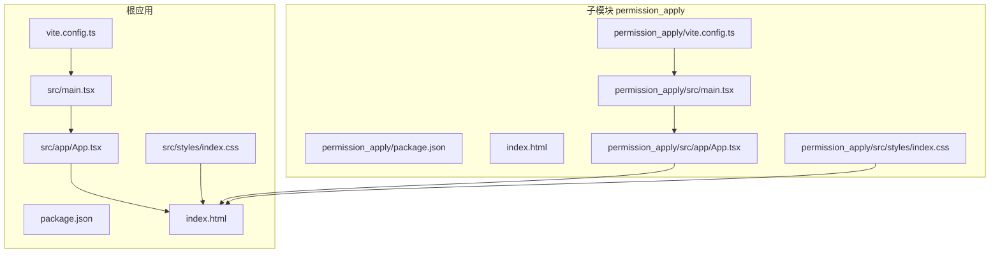
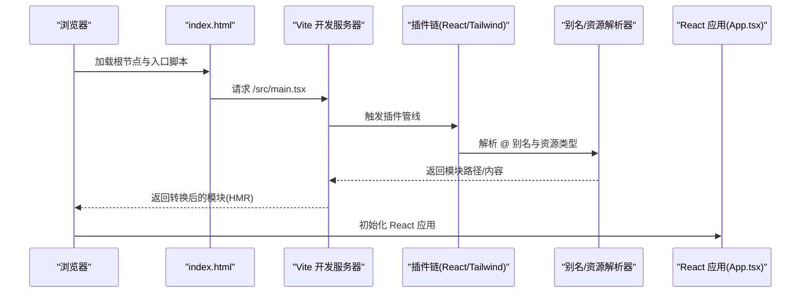
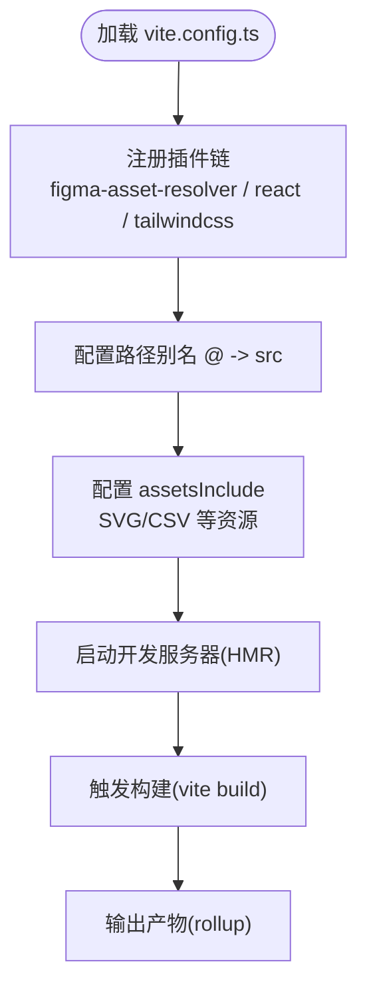
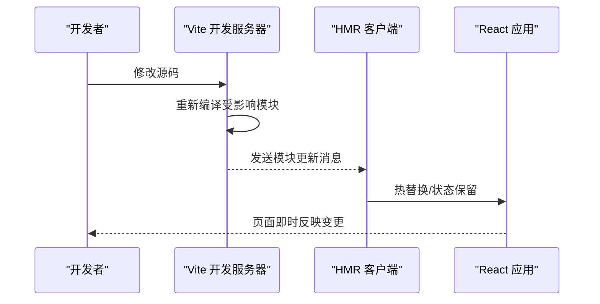
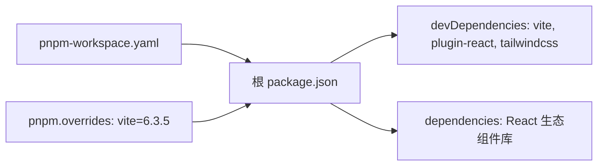
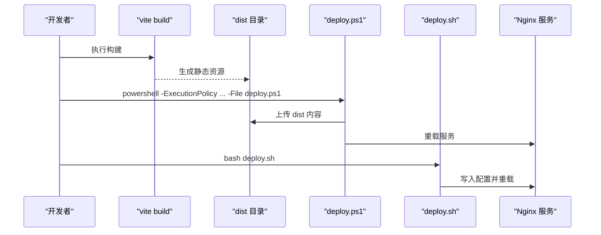
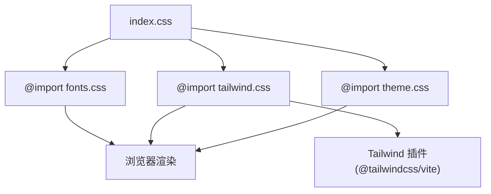
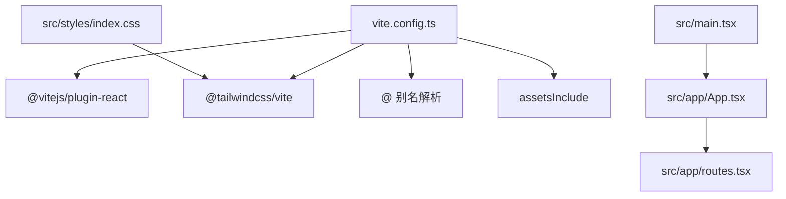

# Vite构建工具

<cite>
**本文引用的文件**
- [vite.config.ts](file://vite.config.ts)
- [package.json](file://package.json)
- [pnpm-workspace.yaml](file://pnpm-workspace.yaml)
- [index.html](file://index.html)
- [postcss.config.mjs](file://postcss.config.mjs)
- [deploy/deploy.sh](file://deploy/deploy.sh)
- [deploy.ps1](file://deploy.ps1)
- [README.md](file://README.md)
- [src/main.tsx](file://src/main.tsx)
- [src/app/App.tsx](file://src/app/App.tsx)
- [src/styles/index.css](file://src/styles/index.css)
- [permission_apply/vite.config.ts](file://permission_apply/vite.config.ts)
- [permission_apply/package.json](file://permission_apply/package.json)
- [permission_apply/src/main.tsx](file://permission_apply/src/main.tsx)
- [permission_apply/src/app/App.tsx](file://permission_apply/src/app/App.tsx)
- [permission_apply/src/styles/index.css](file://permission_apply/src/styles/index.css)
</cite>

## 目录
1. [简介](#简介)
2. [项目结构](#项目结构)
3. [核心组件](#核心组件)
4. [架构总览](#架构总览)
5. [详细组件分析](#详细组件分析)
6. [依赖关系分析](#依赖关系分析)
7. [性能考量](#性能考量)
8. [故障排查指南](#故障排查指南)
9. [结论](#结论)
10. [附录](#附录)

## 简介
本文件面向使用 Vite 6.3.5 的团队与个人开发者，系统性解析本仓库的构建配置与优化策略，覆盖开发服务器与热重载、构建优化、pnpm 工作空间与依赖管理、生产环境构建与资源优化、性能监控方案以及开发调试技巧与常见问题处理。文档同时对比主应用与子模块(permission_apply)的配置一致性，帮助你在多包场景下保持统一的工程体验。

## 项目结构
本仓库采用单仓库多包模式：根目录为主应用，permission_apply 为独立子模块。两者共享相似的 Vite 配置与构建流程，均通过 Vite 6.3.5、React 插件与 Tailwind CSS 集成实现开发与构建。

图表来源
- [vite.config.ts:19-36](file://vite.config.ts#L19-L36)
- [index.html:17-18](file://index.html#L17-L18)
- [src/main.tsx:2-6](file://src/main.tsx#L2-L6)
- [src/app/App.tsx:1-6](file://src/app/App.tsx#L1-L6)
- [src/styles/index.css:1-4](file://src/styles/index.css#L1-L4)
- [permission_apply/vite.config.ts:19-36](file://permission_apply/vite.config.ts#L19-L36)
- [permission_apply/src/main.tsx:2-6](file://permission_apply/src/main.tsx#L2-L6)
- [permission_apply/src/app/App.tsx:1-6](file://permission_apply/src/app/App.tsx#L1-L6)
- [permission_apply/src/styles/index.css:1-4](file://permission_apply/src/styles/index.css#L1-L4)

章节来源
- [vite.config.ts:19-36](file://vite.config.ts#L19-L36)
- [package.json:6-10](file://package.json#L6-L10)
- [pnpm-workspace.yaml:1-10](file://pnpm-workspace.yaml#L1-L10)
- [index.html:17-18](file://index.html#L17-L18)
- [src/main.tsx:2-6](file://src/main.tsx#L2-L6)
- [src/app/App.tsx:1-6](file://src/app/App.tsx#L1-L6)
- [src/styles/index.css:1-4](file://src/styles/index.css#L1-L4)
- [permission_apply/vite.config.ts:19-36](file://permission_apply/vite.config.ts#L19-L36)
- [permission_apply/src/main.tsx:2-6](file://permission_apply/src/main.tsx#L2-L6)
- [permission_apply/src/app/App.tsx:1-6](file://permission_apply/src/app/App.tsx#L1-L6)
- [permission_apply/src/styles/index.css:1-4](file://permission_apply/src/styles/index.css#L1-L4)

## 核心组件
- 开发服务器与热重载
  - 基于 Vite 6.3.5 的内置开发服务器，默认启用 HMR，支持 React Fast Refresh 与 CSS 热更新。
  - 通过插件链路实现别名解析与静态资源导入扩展。
- 构建产物与打包
  - 使用 Rollup 进行产物生成，结合 React 插件进行 JSX 转换与常量替换。
  - 支持 SVG、CSV 等资源的原始导入，便于在组件中直接引用。
- 样式体系
  - 通过 Tailwind CSS 与 @tailwindcss/vite 集成，PostCSS 配置保持最小化，避免重复插件。
- 依赖与工作空间
  - pnpm 工作空间定义根包与 CPU/OS 支持矩阵；通过 overrides 统一锁定 Vite 版本，保证各包一致。
- 部署与运行
  - 提供 Windows PowerShell 与 Linux Bash 两套部署脚本，自动化构建、上传与 Nginx 重载。

章节来源
- [vite.config.ts:19-36](file://vite.config.ts#L19-L36)
- [postcss.config.mjs:1-16](file://postcss.config.mjs#L1-L16)
- [package.json:68-90](file://package.json#L68-L90)
- [pnpm-workspace.yaml:1-10](file://pnpm-workspace.yaml#L1-L10)
- [deploy.ps1:22-56](file://deploy.ps1#L22-L56)
- [deploy/deploy.sh:32-93](file://deploy/deploy.sh#L32-L93)

## 架构总览
下图展示从入口 HTML 到运行时 React 应用的整体流程，以及 Vite 在开发与生产阶段的关键角色。

图表来源
- [index.html:17-18](file://index.html#L17-L18)
- [vite.config.ts:20-26](file://vite.config.ts#L20-L26)
- [vite.config.ts:27-32](file://vite.config.ts#L27-L32)
- [src/main.tsx:2-6](file://src/main.tsx#L2-L6)
- [src/app/App.tsx:1-6](file://src/app/App.tsx#L1-L6)

## 详细组件分析

### Vite 配置与插件链
- 自定义解析器(figma-asset-resolver)
  - 功能：将特定前缀的模块请求映射到本地资源目录，便于在组件中以统一标识符引用外部资产。
  - 影响：减少硬编码路径，提升跨模块复用能力。
- React 插件与 Tailwind 集成
  - React 插件负责 JSX 转换与开发期优化。
  - Tailwind 通过 @tailwindcss/vite 自动注入所需 PostCSS 插件，避免重复声明。
- 路径别名与资源导入
  - @ 别名指向 src 目录，简化导入路径。
  - assetsInclude 明确允许的原始资源类型，避免对 CSS/TSX 的误用。

图表来源
- [vite.config.ts:7-17](file://vite.config.ts#L7-L17)
- [vite.config.ts:20-26](file://vite.config.ts#L20-L26)
- [vite.config.ts:27-32](file://vite.config.ts#L27-L32)
- [vite.config.ts:34-36](file://vite.config.ts#L34-L36)

章节来源
- [vite.config.ts:7-17](file://vite.config.ts#L7-L17)
- [vite.config.ts:20-26](file://vite.config.ts#L20-L26)
- [vite.config.ts:27-32](file://vite.config.ts#L27-L32)
- [vite.config.ts:34-36](file://vite.config.ts#L34-L36)

### 开发服务器与热重载机制
- 默认行为
  - Vite 内置开发服务器自动监听文件变更并推送 HMR 更新，React 应用在开发期受益于 Fast Refresh。
- 关键点
  - 别名与自定义解析器确保模块解析稳定，避免 HMR 失效。
  - PostCSS 配置最小化，减少开发期编译开销。
- 典型流程
  - 编辑源码 → Vite 捕获变更 → 触发 HMR → 浏览器局部刷新。

图表来源
- [vite.config.ts:20-26](file://vite.config.ts#L20-L26)
- [src/main.tsx:2-6](file://src/main.tsx#L2-L6)

章节来源
- [vite.config.ts:20-26](file://vite.config.ts#L20-L26)
- [postcss.config.mjs:1-16](file://postcss.config.mjs#L1-L16)
- [src/main.tsx:2-6](file://src/main.tsx#L2-L6)

### 构建优化选项与产物组织
- 构建命令
  - 通过 npm scripts 调用 vite build，生成 dist 目录产物。
- 优化建议
  - 代码分割：利用 Vite/Rollup 的动态导入策略按路由拆分包，降低首屏体积。
  - 资源优化：开启压缩与哈希命名，合理配置 external 与 manualChunks 控制第三方库分包。
  - 预加载：对关键路由或首屏依赖使用预加载策略。
  - 缓存策略：结合服务端缓存头与资源指纹，提升二次加载性能。
- 产物校验
  - 部署前检查 dist 目录完整性，确保 index.html 与静态资源路径正确。

章节来源
- [package.json:7-9](file://package.json#L7-L9)
- [deploy/deploy.sh:32-57](file://deploy/deploy.sh#L32-L57)
- [deploy.ps1:22-46](file://deploy.ps1#L22-L46)

### pnpm 工作空间与依赖管理
- 工作空间
  - packages: ['.' ] 表示当前目录为主包；可扩展为多包协作。
  - supportedArchitectures 限定 OS/CPU/LIBC，确保跨平台一致性。
- 依赖锁定
  - pnpm overrides 统一 Vite 版本至 6.3.5，避免子包各自安装导致的版本漂移。
- peerDependencies
  - React 与 ReactDOM 标记为可选 peer，避免强制安装但不影响实际运行。

图表来源
- [pnpm-workspace.yaml:1-10](file://pnpm-workspace.yaml#L1-L10)
- [package.json:68-90](file://package.json#L68-L90)

章节来源
- [pnpm-workspace.yaml:1-10](file://pnpm-workspace.yaml#L1-L10)
- [package.json:68-90](file://package.json#L68-L90)

### 生产环境构建与部署
- 构建产物
  - 通过 vite build 输出静态资源到 dist，配合 Nginx 提供服务。
- 部署脚本
  - Windows：PowerShell 脚本自动构建、上传并尝试重载 Nginx。
  - Linux：Bash 脚本创建部署目录、备份旧版本、复制文件、设置权限、写入 Nginx 配置并重载。
- Nginx 配置
  - 示例配置文件位于 deploy/nginx.conf 与 deploy/nginx-server.conf，按需调整站点名称与证书路径。

图表来源
- [package.json:7-9](file://package.json#L7-L9)
- [deploy.ps1:22-56](file://deploy.ps1#L22-L56)
- [deploy/deploy.sh:32-93](file://deploy/deploy.sh#L32-L93)

章节来源
- [package.json:7-9](file://package.json#L7-L9)
- [deploy.ps1:22-56](file://deploy.ps1#L22-L56)
- [deploy/deploy.sh:32-93](file://deploy/deploy.sh#L32-L93)

### 样式与主题集成
- 样式入口
  - index.css 作为全局样式入口，按顺序引入字体、Tailwind 与主题样式。
- Tailwind 集成
  - 通过 @tailwindcss/vite 自动注入插件，PostCSS 配置保持空对象，避免重复声明。
- 主题与 UI 组件
  - 项目广泛使用 MUI、Radix UI 等组件库，结合 Tailwind 实现视觉一致性。

图表来源
- [src/styles/index.css:1-4](file://src/styles/index.css#L1-L4)
- [postcss.config.mjs:1-16](file://postcss.config.mjs#L1-L16)

章节来源
- [src/styles/index.css:1-4](file://src/styles/index.css#L1-L4)
- [postcss.config.mjs:1-16](file://postcss.config.mjs#L1-L16)

### 多包一致性与差异
- 配置一致性
  - 主应用与 permission_apply 的 vite.config.ts 结构完全一致，包括插件、别名与资源导入。
- 依赖一致性
  - 两者的 package.json 对应字段基本一致，均通过 overrides 锁定 Vite 版本。
- 运行入口
  - 两者 main.tsx 与 App.tsx 均以 React Router Provider 包裹应用，入口脚本一致。

章节来源
- [vite.config.ts:19-36](file://vite.config.ts#L19-L36)
- [permission_apply/vite.config.ts:19-36](file://permission_apply/vite.config.ts#L19-L36)
- [package.json:68-90](file://package.json#L68-L90)
- [permission_apply/package.json:68-90](file://permission_apply/package.json#L68-L90)
- [src/main.tsx:2-6](file://src/main.tsx#L2-L6)
- [permission_apply/src/main.tsx:2-6](file://permission_apply/src/main.tsx#L2-L6)
- [src/app/App.tsx:1-6](file://src/app/App.tsx#L1-L6)
- [permission_apply/src/app/App.tsx:1-6](file://permission_apply/src/app/App.tsx#L1-L6)

## 依赖关系分析
- 内聚与耦合
  - Vite 配置高度内聚于单一文件，通过插件扩展功能，耦合度低。
  - React 应用通过路由与上下文解耦页面组件，利于维护。
- 外部依赖
  - React 生态组件库与 Tailwind CSS 为主要外部依赖，版本通过 overrides 与 peerDependencies 管理。
- 可能的循环依赖
  - 当前结构未见显式循环依赖迹象；若新增模块，需避免相互 import 导致的环。

图表来源
- [vite.config.ts:20-36](file://vite.config.ts#L20-L36)
- [src/main.tsx:2-6](file://src/main.tsx#L2-L6)
- [src/app/App.tsx:1-6](file://src/app/App.tsx#L1-L6)
- [src/styles/index.css:1-4](file://src/styles/index.css#L1-L4)

章节来源
- [vite.config.ts:20-36](file://vite.config.ts#L20-L36)
- [src/main.tsx:2-6](file://src/main.tsx#L2-L6)
- [src/app/App.tsx:1-6](file://src/app/App.tsx#L1-L6)
- [src/styles/index.css:1-4](file://src/styles/index.css#L1-L4)

## 性能考量
- 开发期
  - 启用 HMR 与最小化 PostCSS 插件，缩短编译时间。
  - 使用别名减少路径解析成本。
- 构建期
  - 合理划分代码块，优先拆分路由级与第三方库包。
  - 对图片、字体等静态资源启用压缩与合适的缓存策略。
- 运行期
  - Nginx 层面配置 Gzip/Brotli 压缩与缓存头，提升传输效率。
  - 使用 CDN 分发静态资源，降低主站压力。

## 故障排查指南
- 开发服务器无法启动
  - 检查端口占用与网络权限；确认插件与别名配置无语法错误。
- HMR 不生效
  - 确认模块导出方式符合 Fast Refresh 要求；检查自定义解析器是否正确映射资源。
- 构建失败
  - 查看控制台报错定位具体模块；确认 assetsInclude 是否包含必要资源类型。
- 部署后页面空白
  - 校验 dist 目录完整性与 Nginx 配置；确认 index.html 引用路径与静态资源相对路径一致。
- 权限问题
  - Linux 部署脚本需 root 权限；Windows 脚本需启用执行策略。

章节来源
- [deploy/deploy.sh:25-36](file://deploy/deploy.sh#L25-L36)
- [deploy.ps1:22-46](file://deploy.ps1#L22-L46)
- [index.html:17-18](file://index.html#L17-L18)

## 结论
本项目基于 Vite 6.3.5 构建，采用最小化 PostCSS 配置与稳定的 React/Tailwind 集成，辅以 pnpm 工作空间与 overrides 管理依赖版本，形成可扩展且一致的前端工程基座。通过合理的代码分割、资源优化与 Nginx 部署策略，可在开发与生产环境中获得良好的性能与可维护性。建议在多包场景下保持配置同步，并持续关注 Vite 新版本特性以进一步优化构建效率与开发体验。

## 附录
- 快速开始
  - 安装依赖与启动开发服务器：参考根目录 README。
- 常用脚本
  - 开发：npm run dev
  - 构建：npm run build
  - 部署：npm run deploy（Windows）或执行 deploy.sh（Linux）

章节来源
- [README.md:7-11](file://README.md#L7-L11)
- [package.json:6-10](file://package.json#L6-L10)