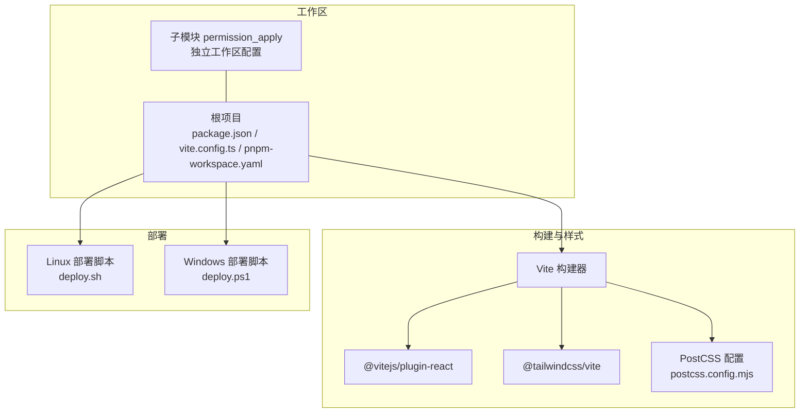
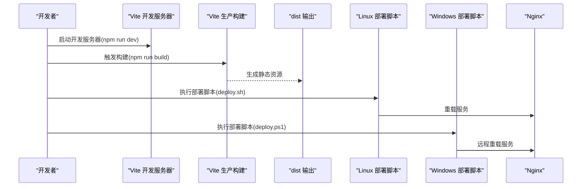
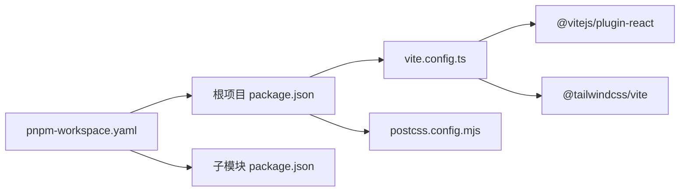

# 开发工具链

<cite>
**本文引用的文件**
- [package.json](file://package.json)
- [vite.config.ts](file://vite.config.ts)
- [postcss.config.mjs](file://postcss.config.mjs)
- [pnpm-workspace.yaml](file://pnpm-workspace.yaml)
- [README.md](file://README.md)
- [deploy.sh](file://deploy/deploy.sh)
- [deploy.ps1](file://deploy.ps1)
- [guidelines/Guidelines.md](file://guidelines/Guidelines.md)
- [permission_apply/guidelines/Guidelines.md](file://permission_apply/guidelines/Guidelines.md)
</cite>

## 目录
1. [简介](#简介)
2. [项目结构](#项目结构)
3. [核心组件](#核心组件)
4. [架构总览](#架构总览)
5. [详细组件分析](#详细组件分析)
6. [依赖关系分析](#依赖关系分析)
7. [性能考虑](#性能考虑)
8. [故障排查指南](#故障排查指南)
9. [结论](#结论)
10. [附录](#附录)

## 简介
本文件系统性梳理本项目的开发工具链与使用规范，覆盖以下方面：
- TypeScript 与 Vite 构建配置
- 代码质量保障：ESLint 与 Prettier 规则与实践
- 开发环境配置、调试与性能分析工具
- 自动化测试与持续集成（CI/CD）建议方案
- 团队协作规范与代码审查流程

说明：当前仓库未发现 ESLint 与 Prettier 的显式配置文件；本文在“代码质量保障”部分提供通用最佳实践与落地建议，便于团队统一风格与提升质量。

## 项目结构
项目采用单仓库多包工作区布局，根级与子模块均使用 pnpm workspace 管理，构建工具以 Vite 为核心，样式体系基于 Tailwind CSS v4（通过 @tailwindcss/vite 插件自动装配），并提供一键部署脚本支持 Linux 与 Windows 双环境。

图表来源
- [package.json:1-91](file://package.json#L1-L91)
- [vite.config.ts:1-37](file://vite.config.ts#L1-L37)
- [postcss.config.mjs:1-16](file://postcss.config.mjs#L1-L16)
- [pnpm-workspace.yaml:1-10](file://pnpm-workspace.yaml#L1-L10)
- [deploy.sh:1-107](file://deploy/deploy.sh#L1-L107)
- [deploy.ps1:1-65](file://deploy.ps1#L1-L65)

章节来源
- [package.json:1-91](file://package.json#L1-L91)
- [vite.config.ts:1-37](file://vite.config.ts#L1-L37)
- [postcss.config.mjs:1-16](file://postcss.config.mjs#L1-L16)
- [pnpm-workspace.yaml:1-10](file://pnpm-workspace.yaml#L1-L10)
- [README.md:1-11](file://README.md#L1-L11)

## 核心组件
- 构建与打包
  - Vite 作为开发服务器与生产构建器，启用 React 插件与 Tailwind CSS 插件，并通过自定义插件实现 Figma 资源别名解析。
  - 支持对 SVG、CSV 等资源进行原始导入。
- 样式系统
  - Tailwind CSS v4 通过 @tailwindcss/vite 自动装配所需 PostCSS 插件，避免重复配置；如需扩展可在此文件中添加额外 PostCSS 插件。
- 包管理与工作区
  - pnpm workspace 统一管理根与子模块，限定支持的操作系统与 CPU 架构，确保跨平台一致性。
- 部署工具
  - 提供 Linux（bash）与 Windows（PowerShell）两套部署脚本，分别用于本地构建后上传与远程 Nginx 重载。

章节来源
- [vite.config.ts:1-37](file://vite.config.ts#L1-L37)
- [postcss.config.mjs:1-16](file://postcss.config.mjs#L1-L16)
- [pnpm-workspace.yaml:1-10](file://pnpm-workspace.yaml#L1-L10)
- [deploy.sh:1-107](file://deploy/deploy.sh#L1-L107)
- [deploy.ps1:1-65](file://deploy.ps1#L1-L65)

## 架构总览
下图展示从开发到部署的关键流程与工具交互：

图表来源
- [package.json:6-10](file://package.json#L6-L10)
- [deploy.sh:1-107](file://deploy/deploy.sh#L1-L107)
- [deploy.ps1:1-65](file://deploy.ps1#L1-L65)

## 详细组件分析

### TypeScript 与 Vite 配置
- Vite 配置要点
  - 插件组合：自定义 Figma 资源解析插件 + React 插件 + Tailwind 插件，确保开发体验与样式自动装配。
  - 别名：将 @ 指向 src 目录，简化导入路径。
  - 原始资源：允许导入 SVG、CSV 等资源类型，避免额外 loader 配置。
- 类型支持
  - 项目使用 React 18.3.1，TypeScript 通常由 React 插件与构建器协同处理；若需显式 TS 配置，可在根目录新增 tsconfig.json 并按需继承基础配置。

章节来源
- [vite.config.ts:1-37](file://vite.config.ts#L1-L37)
- [package.json:74-90](file://package.json#L74-L90)

### 代码质量保障（ESLint 与 Prettier）
- 当前状态
  - 仓库未发现 ESLint 与 Prettier 的显式配置文件与脚本命令。
- 推荐实践
  - ESLint
    - 安装并初始化配置，选择适合 React + TypeScript 的推荐规则集；统一禁用魔法数字、强制命名导出等策略。
    - 在 package.json 中添加 lint 脚本，约定提交前执行校验。
  - Prettier
    - 安装并初始化配置，统一缩进、引号、尾逗号等风格；与编辑器保存钩子联动。
    - 在 package.json 中添加 format 脚本，约定统一格式化。
  - Git Hooks
    - 使用 Husky + lint-staged 在提交前自动运行 ESLint 与 Prettier，减少 CI 压力。
- 质量门禁
  - 在 CI 中增加 ESLint 与 Prettier 校验步骤，失败即阻止合并。

章节来源
- [package.json:6-10](file://package.json#L6-L10)

### 开发环境配置、调试与性能分析
- 开发环境
  - 使用 Vite 提供的热更新与快速启动能力；通过别名与插件提升 DX。
- 调试工具
  - 浏览器开发者工具与 React DevTools；如需更深入的性能分析，可在浏览器中启用性能面板或使用 React Profiler。
- 性能分析
  - 构建产物分析：使用 rollup-plugin-visualizer 或 vite-bundle-analyzer 生成依赖体积报告，识别大体积依赖与重复打包。
  - 运行时分析：结合浏览器性能面板观察长任务、内存增长与渲染瓶颈。

章节来源
- [vite.config.ts:1-37](file://vite.config.ts#L1-L37)

### 自动化测试与持续集成（CI/CD）
- 测试建议
  - 单元测试：使用 Vitest + React Testing Library，覆盖关键组件与工具函数。
  - 端到端测试：使用 Playwright/Cypress，针对关键用户流程进行回归验证。
  - 测试覆盖率：在 CI 中收集覆盖率报告，设定阈值门禁。
- CI/CD 方案
  - 构建阶段：安装依赖（pnpm）、运行构建、生成测试报告与产物。
  - 部署阶段：Linux 使用 deploy.sh，Windows 使用 deploy.ps1；确保 Nginx 配置正确且具备回滚能力。
  - 缓存优化：缓存 pnpm store 与构建缓存，缩短流水线时间。
  - 安全扫描：在 CI 中集成 SCA 与 SAST 步骤，降低供应链与安全风险。

章节来源
- [deploy.sh:1-107](file://deploy/deploy.sh#L1-L107)
- [deploy.ps1:1-65](file://deploy.ps1#L1-L65)

### 团队协作规范与代码审查流程
- 规范文件
  - 项目提供 guidelines/Guidelines.md 与 permission_apply/guidelines/Guidelines.md，建议团队在此基础上补充具体的设计系统与交互规范。
- 代码审查（Pull Request）流程
  - 分支策略：采用功能分支开发，主分支保护并要求审查通过后合并。
  - 审查清单：变更描述清晰、无破坏性改动、通过所有自动化检查、覆盖关键逻辑、遵循设计规范。
  - 审查工具：优先使用平台自带的 PR 审查功能，必要时附加口头同步与评审会议。

章节来源
- [guidelines/Guidelines.md:1-62](file://guidelines/Guidelines.md#L1-L62)
- [permission_apply/guidelines/Guidelines.md:1-62](file://permission_apply/guidelines/Guidelines.md#L1-L62)

## 依赖关系分析
- 工作区与包管理
  - pnpm workspace 统一管理根与子模块，限定支持的 OS/CPU/库版本，确保一致的构建与运行环境。
- 构建与样式依赖
  - Vite 作为核心构建器，React 插件负责 JSX/TSX 转换，Tailwind 插件负责样式自动装配；PostCSS 配置保持最小化，仅在需要时扩展。

图表来源
- [pnpm-workspace.yaml:1-10](file://pnpm-workspace.yaml#L1-L10)
- [package.json:1-91](file://package.json#L1-L91)
- [vite.config.ts:1-37](file://vite.config.ts#L1-L37)
- [postcss.config.mjs:1-16](file://postcss.config.mjs#L1-L16)

章节来源
- [pnpm-workspace.yaml:1-10](file://pnpm-workspace.yaml#L1-L10)
- [package.json:1-91](file://package.json#L1-L91)
- [vite.config.ts:1-37](file://vite.config.ts#L1-L37)
- [postcss.config.mjs:1-16](file://postcss.config.mjs#L1-L16)

## 性能考虑
- 构建性能
  - 使用 pnpm 减少磁盘占用与安装时间；合理拆分依赖，避免重复打包。
  - 对第三方库进行按需引入与 Tree Shaking，减少 bundle 体积。
- 运行时性能
  - 通过浏览器性能面板识别长任务与重绘热点；对高频组件进行 memo 化与懒加载。
  - 控制图片与媒体资源尺寸，使用现代格式（WebP/AVIF）与合适的压缩比。

## 故障排查指南
- 构建失败
  - 确认 Node 版本满足 Vite 与依赖要求；清理 node_modules 与 pnpm store 后重新安装。
  - 检查 Vite 配置中的别名与插件顺序，确保资源解析与样式插件正常加载。
- 部署问题
  - Linux：确认脚本权限与 dist 目录存在；检查 Nginx 配置文件路径与语法；失败时自动回滚至 .bak。
  - Windows：确认 SSH 与 scp 可用；检查远端 Nginx 服务状态与日志。
- 样式异常
  - 若 Tailwind 未生效，检查 @tailwindcss/vite 是否正确安装与启用；确认 PostCSS 配置未被意外覆盖。

章节来源
- [deploy.sh:25-36](file://deploy/deploy.sh#L25-L36)
- [deploy.sh:76-88](file://deploy/deploy.sh#L76-L88)
- [deploy.ps1:23-28](file://deploy.ps1#L23-L28)
- [deploy.ps1:33-36](file://deploy.ps1#L33-L36)
- [deploy.ps1:49-55](file://deploy.ps1#L49-L55)

## 结论
本项目以 Vite 为核心构建工具，配合 Tailwind CSS v4 与 pnpm workspace 实现高效开发与稳定交付。建议尽快补齐 ESLint 与 Prettier 的配置与脚本，完善 CI/CD 流水线与测试矩阵，并在 guidelines 中沉淀设计与交互规范，以进一步提升团队协作效率与代码质量。

## 附录
- 快速开始
  - 安装依赖后，使用开发脚本启动本地服务；构建完成后可通过部署脚本发布至服务器。
- 常用命令参考
  - 开发：npm run dev
  - 构建：npm run build
  - 部署（Windows）：npm run deploy

章节来源
- [README.md:5-11](file://README.md#L5-L11)
- [package.json:6-10](file://package.json#L6-L10)