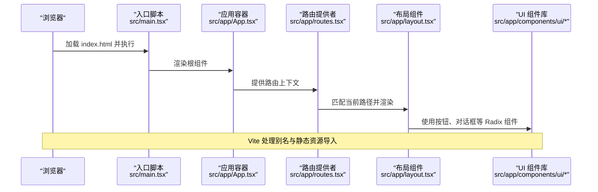
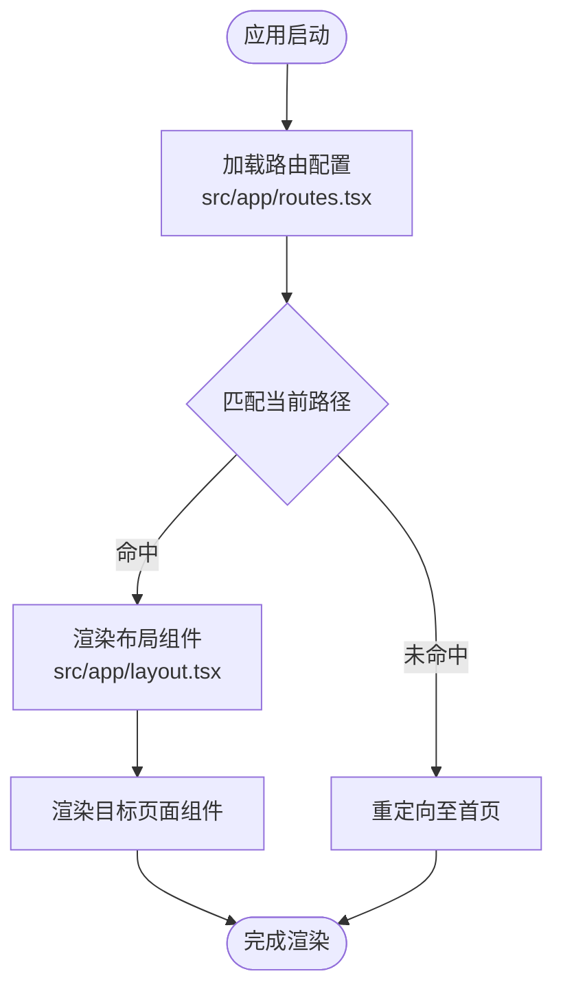
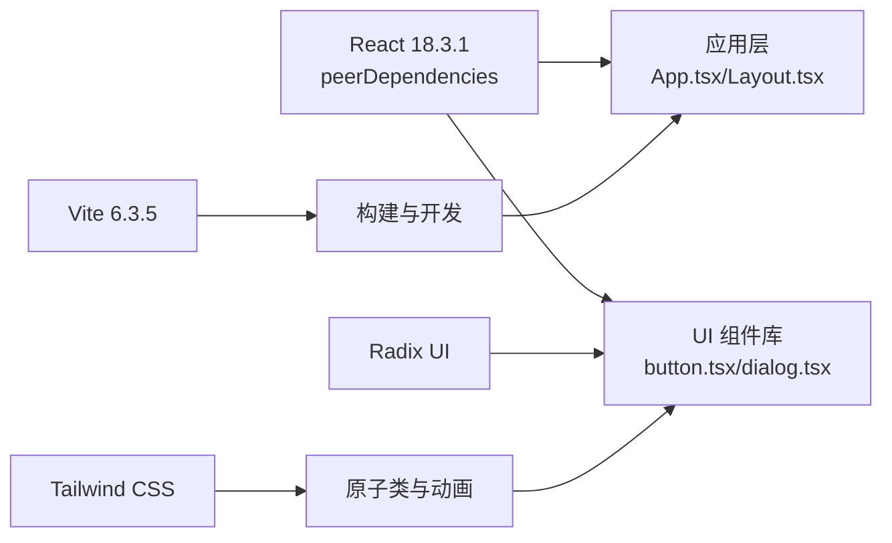

# 技术栈详解

<cite>
**本文引用的文件**
- [package.json](file://package.json)
- [vite.config.ts](file://vite.config.ts)
- [postcss.config.mjs](file://postcss.config.mjs)
- [src/main.tsx](file://src/main.tsx)
- [permission_apply/src/main.tsx](file://permission_apply/src/main.tsx)
- [src/app/App.tsx](file://src/app/App.tsx)
- [src/styles/tailwind.css](file://src/styles/tailwind.css)
- [src/app/components/ui/utils.ts](file://src/app/components/ui/utils.ts)
- [src/app/components/ui/button.tsx](file://src/app/components/ui/button.tsx)
- [src/app/components/ui/dialog.tsx](file://src/app/components/ui/dialog.tsx)
- [src/app/routes.tsx](file://src/app/routes.tsx)
- [src/app/layout.tsx](file://src/app/layout.tsx)
- [pnpm-workspace.yaml](file://pnpm-workspace.yaml)
- [permission_apply/package.json](file://permission_apply/package.json)
</cite>

## 目录
1. [引言](#引言)
2. [项目结构](#项目结构)
3. [核心组件](#核心组件)
4. [架构总览](#架构总览)
5. [详细组件分析](#详细组件分析)
6. [依赖关系分析](#依赖关系分析)
7. [性能考量](#性能考量)
8. [故障排查指南](#故障排查指南)
9. [结论](#结论)
10. [附录](#附录)

## 引言
本项目采用现代化前端技术栈：React 18.3.1（通过 peerDependencies 声明）、Vite 6.3.5（生产与开发构建工具）、Radix UI（无障碍优先的原子组件库）、Tailwind CSS（实用优先的原子化样式框架）。本文从技术选型动机、配置方式、最佳实践、版本兼容与升级路径等维度进行系统解析，并结合代码实现给出可操作的优化建议。

## 项目结构
项目采用多包工作区组织，根目录为统一的主应用，同时存在一个独立的“权限申请”子应用，两者共享部分 UI 组件与样式体系，分别拥有各自的构建与运行脚本。

```mermaid
graph TB
Root["根项目<br/>package.json"] --> ViteCfg["Vite 配置<br/>vite.config.ts"]
Root --> PostCSS["PostCSS 配置<br/>postcss.config.mjs"]
Root --> Workspace["PNPM 工作区<br/>pnpm-workspace.yaml"]
Root --> MainTSX["入口渲染<br/>src/main.tsx"]
Root --> AppTSX["应用容器<br/>src/app/App.tsx"]
Root --> RoutesTSX["路由定义<br/>src/app/routes.tsx"]
Root --> LayoutTSX["布局与导航<br/>src/app/layout.tsx"]
Root --> Styles["样式入口<br/>src/styles/tailwind.css"]
Root --> UI["UI 组件库<br/>src/app/components/ui/*"]
Root --> Utils["工具函数<br/>src/app/components/ui/utils.ts"]
PermPkg["权限申请子应用<br/>permission_apply/package.json"] --> PermMain["入口渲染<br/>permission_apply/src/main.tsx"]
PermPkg -.-> PermVite["Vite 配置<br/>permission_apply/vite.config.ts"]
```

图表来源
- [package.json:1-91](file://package.json#L1-L91)
- [vite.config.ts:1-37](file://vite.config.ts#L1-L37)
- [postcss.config.mjs:1-16](file://postcss.config.mjs#L1-L16)
- [pnpm-workspace.yaml:1-10](file://pnpm-workspace.yaml#L1-L10)
- [src/main.tsx:1-7](file://src/main.tsx#L1-L7)
- [src/app/App.tsx:1-6](file://src/app/App.tsx#L1-L6)
- [src/app/routes.tsx:1-38](file://src/app/routes.tsx#L1-L38)
- [src/app/layout.tsx:1-175](file://src/app/layout.tsx#L1-L175)
- [src/styles/tailwind.css:1-5](file://src/styles/tailwind.css#L1-L5)
- [src/app/components/ui/utils.ts:1-7](file://src/app/components/ui/utils.ts#L1-L7)
- [permission_apply/package.json:1-90](file://permission_apply/package.json#L1-L90)
- [permission_apply/src/main.tsx:1-7](file://permission_apply/src/main.tsx#L1-L7)

章节来源
- [package.json:1-91](file://package.json#L1-L91)
- [vite.config.ts:1-37](file://vite.config.ts#L1-L37)
- [postcss.config.mjs:1-16](file://postcss.config.mjs#L1-L16)
- [pnpm-workspace.yaml:1-10](file://pnpm-workspace.yaml#L1-L10)

## 核心组件
- React 18.3.1：通过 peerDependencies 声明，确保宿主应用提供 React 运行时；避免重复打包，降低体积。
- Vite 6.3.5：提供快速冷启动、热更新与高效打包能力；配合 React 插件与 Tailwind 插件，开箱即用。
- Radix UI：以无障碍为先的原子组件，提供语义化标签、键盘可达性与高可定制性，广泛用于对话框、菜单、提示等交互组件。
- Tailwind CSS：通过原子类实现样式复用，结合 tw-animate-css 实现轻量动画；使用 @tailwindcss/vite 自动注入插件链。

章节来源
- [package.json:74-85](file://package.json#L74-L85)
- [vite.config.ts:1-37](file://vite.config.ts#L1-L37)
- [src/app/components/ui/dialog.tsx:1-136](file://src/app/components/ui/dialog.tsx#L1-L136)
- [src/styles/tailwind.css:1-5](file://src/styles/tailwind.css#L1-L5)

## 架构总览
下图展示从入口到路由、布局与 UI 组件的整体调用链路，体现 React 路由驱动的单页应用结构与 Vite 的模块解析与资源处理流程。

图表来源
- [src/main.tsx:1-7](file://src/main.tsx#L1-L7)
- [src/app/App.tsx:1-6](file://src/app/App.tsx#L1-L6)
- [src/app/routes.tsx:1-38](file://src/app/routes.tsx#L1-L38)
- [src/app/layout.tsx:1-175](file://src/app/layout.tsx#L1-L175)
- [src/app/components/ui/button.tsx:1-59](file://src/app/components/ui/button.tsx#L1-L59)
- [src/app/components/ui/dialog.tsx:1-136](file://src/app/components/ui/dialog.tsx#L1-L136)
- [vite.config.ts:27-36](file://vite.config.ts#L27-L36)

## 详细组件分析

### React 18.3.1 并发特性与并发模型
- 并发渲染与自动批处理：在大型表单与复杂布局中，React 18 的并发调度可减少主线程阻塞，提升交互流畅度。
- Suspense 与渐进式加载：结合数据请求与懒加载，可在路由切换或弹窗打开时平滑过渡。
- useId、useTransition 等新 Hook：用于无障碍标识生成与状态切换的过渡控制，改善可访问性与用户体验。

实现要点
- 入口使用 createRoot 渲染，确保并发特性可用。
- 路由层使用 RouterProvider，支持嵌套与懒加载页面。
- 布局层通过 Provider 层级管理全局状态，避免不必要的重渲染。

章节来源
- [src/main.tsx:1-7](file://src/main.tsx#L1-L7)
- [src/app/App.tsx:1-6](file://src/app/App.tsx#L1-L6)
- [src/app/routes.tsx:1-38](file://src/app/routes.tsx#L1-L38)
- [src/app/layout.tsx:1-175](file://src/app/layout.tsx#L1-L175)

### Vite 6.3.5 构建与开发体验
- 插件生态：@vitejs/plugin-react 提供 JSX 转换与 HMR；@tailwindcss/vite 自动注入 Tailwind 指令与工具类。
- 别名与资源：@ 指向 src，支持 SVG/CSS 等资源的原生导入；自定义插件 figma-asset-resolver 将特定前缀映射到本地资源。
- 开发与生产：dev/build 脚本分离，生产构建输出稳定、体积可控。

最佳实践
- 保持插件顺序与最小化配置，避免重复注入 PostCSS 插件。
- 使用 assetsInclude 扩展原生导入类型，但不包含 TS/TSX/CSS 文件。
- 在多包场景下，确保各包的 Vite 版本一致，避免缓存与解析冲突。

章节来源
- [vite.config.ts:1-37](file://vite.config.ts#L1-L37)
- [postcss.config.mjs:1-16](file://postcss.config.mjs#L1-L16)
- [package.json:6-10](file://package.json#L6-L10)
- [permission_apply/package.json:6-9](file://permission_apply/package.json#L6-L9)

### Radix UI 无障碍设计与组件实现
- 设计理念：以语义化 HTML 为基础，提供键盘可达性、ARIA 属性与 SSR 友好性；组件均暴露 data-slot 便于主题化。
- 典型组件：对话框、下拉菜单、标签页、滚动区域等，广泛用于弹窗、侧边栏与内容面板。
- 动画与过渡：通过 data-state 属性驱动进入/退出动画，结合 Tailwind 原子类实现轻量过渡。

组件示例与职责
- Button：基于 Slot 与变体系统，支持多种尺寸与风格，具备无障碍焦点环与禁用态。
- Dialog：组合 Overlay/Portal/Content 等子组件，提供可访问的模态交互与关闭机制。

章节来源
- [src/app/components/ui/button.tsx:1-59](file://src/app/components/ui/button.tsx#L1-L59)
- [src/app/components/ui/dialog.tsx:1-136](file://src/app/components/ui/dialog.tsx#L1-L136)
- [src/app/components/ui/utils.ts:1-7](file://src/app/components/ui/utils.ts#L1-L7)

### Tailwind CSS 实用优先与主题化
- 原子类优先：通过组合基础类实现复杂样式，减少自定义 CSS 数量。
- 主题合并：cn 工具函数结合 clsx 与 tailwind-merge，避免重复类名与冲突覆盖。
- 动画扩展：引入 tw-animate-css，按需添加入场/出场动画。
- 源扫描：通过 @source 指定扫描范围，确保仅编译实际使用的样式。

最佳实践
- 保持类名组合清晰，避免深层嵌套；使用语义化命名与 data-slot。
- 在多包场景下，统一样式入口与工具函数，避免重复定义。

章节来源
- [src/styles/tailwind.css:1-5](file://src/styles/tailwind.css#L1-L5)
- [src/app/components/ui/utils.ts:1-7](file://src/app/components/ui/utils.ts#L1-L7)
- [src/app/layout.tsx:1-175](file://src/app/layout.tsx#L1-L175)

### 路由与布局：从入口到页面的串联
- 路由定义：集中于 routes.tsx，支持嵌套路由与通配符回退。
- 布局容器：layout.tsx 提供侧边导航、面包屑与全局状态 Provider，承载所有页面。
- 页面组件：按功能划分页面，如首页、表单提交、审批列表等。

图表来源
- [src/app/routes.tsx:1-38](file://src/app/routes.tsx#L1-L38)
- [src/app/layout.tsx:1-175](file://src/app/layout.tsx#L1-L175)

章节来源
- [src/app/routes.tsx:1-38](file://src/app/routes.tsx#L1-L38)
- [src/app/layout.tsx:1-175](file://src/app/layout.tsx#L1-L175)

## 依赖关系分析
- React 生态：React 与 ReactDOM 作为 peerDependencies，避免重复打包；其他 UI 与工具库围绕 React 生态扩展。
- UI 组件：Radix UI 提供无障碍原子组件；Button/Dialog 等封装了通用行为与样式。
- 样式体系：Tailwind 与 tw-animate-css 协同；@tailwindcss/vite 自动注入 PostCSS 插件链。
- 构建工具：Vite 与 React/Tailwind 插件共同作用；多包工作区通过 pnpm-workspace.yaml 管理。

图表来源
- [package.json:74-85](file://package.json#L74-L85)
- [src/app/components/ui/button.tsx:1-59](file://src/app/components/ui/button.tsx#L1-L59)
- [src/app/components/ui/dialog.tsx:1-136](file://src/app/components/ui/dialog.tsx#L1-L136)
- [vite.config.ts:1-37](file://vite.config.ts#L1-L37)
- [src/styles/tailwind.css:1-5](file://src/styles/tailwind.css#L1-L5)

章节来源
- [package.json:1-91](file://package.json#L1-L91)
- [pnpm-workspace.yaml:1-10](file://pnpm-workspace.yaml#L1-L10)

## 性能考量
- 构建体积：通过 peerDependencies 避免 React 重复打包；按需引入 Radix UI 子包，减少首屏体积。
- 运行时性能：利用 React 18 并发特性与 Suspense，对大列表与复杂表单进行渐进式渲染。
- 样式体积：Tailwind 原子类按需生成，结合 @source 限制扫描范围，避免无用样式进入产物。
- 开发体验：Vite 的快速冷启与 HMR，显著缩短迭代周期；多包工作区通过 pnpm 缓存与去重降低安装成本。

## 故障排查指南
- Vite 插件冲突：确认 @tailwindcss/vite 与 Tailwind 版本匹配，避免在 postcss.config.mjs 中重复声明 tailwindcss/autoprefixer。
- 资源导入异常：检查 assetsInclude 是否包含所需类型，且不包含 .css/.tsx/.ts 文件。
- 别名解析失败：确认 vite.config.ts 中 @ 别名指向正确目录，避免相对路径导致的解析错误。
- React 版本不一致：确保宿主应用提供 React 18.3.1，避免与第三方库的 React 版本冲突。
- 多包构建问题：在 pnpm-workspace.yaml 中统一 CPU/OS 支持，避免跨平台差异导致的构建失败。

章节来源
- [vite.config.ts:1-37](file://vite.config.ts#L1-L37)
- [postcss.config.mjs:1-16](file://postcss.config.mjs#L1-L16)
- [package.json:74-85](file://package.json#L74-L85)
- [pnpm-workspace.yaml:1-10](file://pnpm-workspace.yaml#L1-L10)

## 结论
本项目以 React 18.3.1 的并发能力为核心，借助 Vite 6.3.5 的高效构建与插件生态，结合 Radix UI 的无障碍设计与 Tailwind CSS 的实用优先原则，形成一套现代、可维护、可扩展的前端技术栈。通过合理的配置与最佳实践，能够在保证开发效率的同时，获得优秀的用户体验与可预测的性能表现。

## 附录

### 技术选型对比与权衡
- React 18.3.1 vs 更高版本：更高版本可能带来更丰富的并发能力，但需评估第三方库兼容性与迁移成本。
- Vite 6.3.5 vs 其他构建器：相较 Webpack，Vite 在开发阶段具有更快的冷启与热更新速度；生产构建稳定性良好。
- Radix UI vs MUI/AntD：Radix UI 更注重无障碍与可定制性，适合需要深度主题化的场景；MUI/AntD 在企业级表格/表单方面更成熟。
- Tailwind CSS vs SCSS：Tailwind 原子类减少样式体量与命名冲突，但在复杂主题与动态样式上可能不如预处理器灵活。

### 版本兼容性与升级路径
- React 18.3.1：建议与 React Router 7.x、Radix UI 1.x/2.x 保持兼容；升级前先验证路由与 UI 组件的 API 变更。
- Vite 6.3.5：建议与 @vitejs/plugin-react 4.x、@tailwindcss/vite 4.x 保持一致；升级时关注插件变更与配置项废弃。
- Radix UI：遵循官方发布日志，注意 data-* 属性与事件回调的变更；逐步替换旧组件。
- Tailwind CSS：v4 通过 @tailwindcss/vite 自动注入，升级时关注指令与扫描规则变化；保持 @source 范围明确。