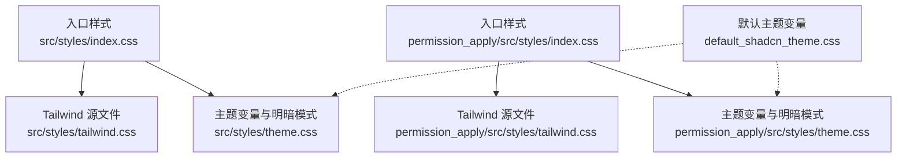
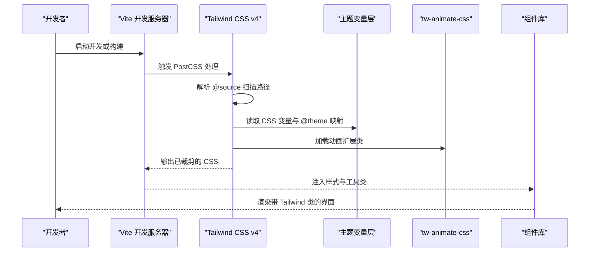
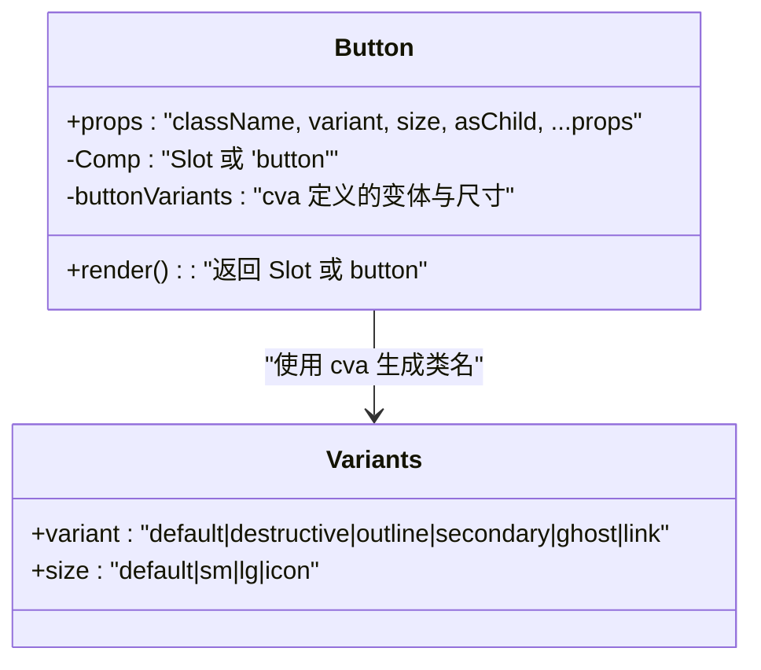
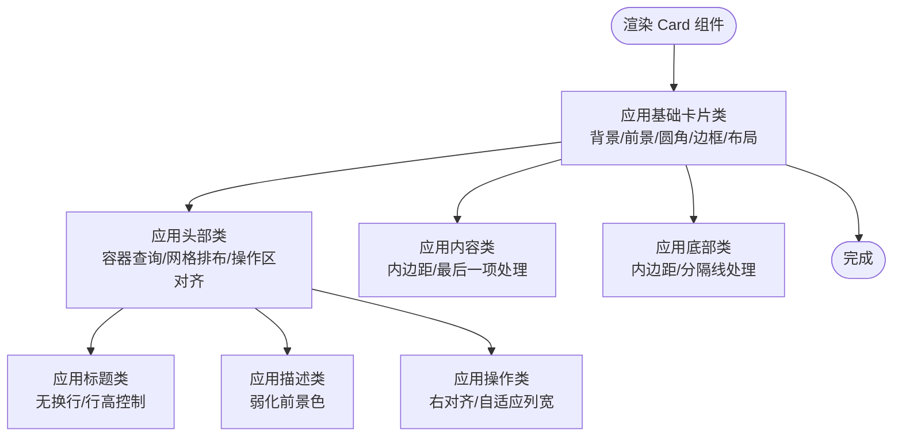
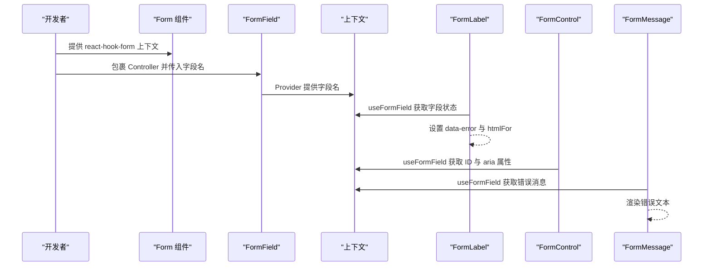
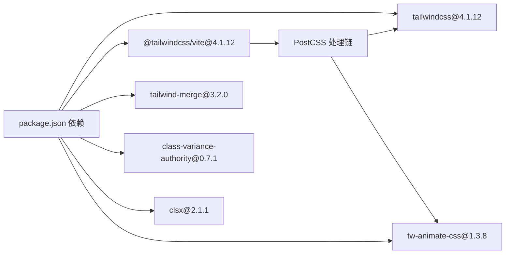

# 样式系统

<cite>
**本文引用的文件**
- [package.json](file://package.json)
- [postcss.config.mjs](file://postcss.config.mjs)
- [src/styles/index.css](file://src/styles/index.css)
- [src/styles/tailwind.css](file://src/styles/tailwind.css)
- [src/styles/theme.css](file://src/styles/theme.css)
- [permission_apply/src/styles/index.css](file://permission_apply/src/styles/index.css)
- [permission_apply/src/styles/tailwind.css](file://permission_apply/src/styles/tailwind.css)
- [permission_apply/src/styles/theme.css](file://permission_apply/src/styles/theme.css)
- [default_shadcn_theme.css](file://default_shadcn_theme.css)
- [button.tsx](file://permission_apply/src/app/components/ui/button.tsx)
- [card.tsx](file://permission_apply/src/app/components/ui/card.tsx)
- [form.tsx](file://permission_apply/src/app/components/ui/form.tsx)
- [use-mobile.ts](file://permission_apply/src/app/components/ui/use-mobile.ts)
</cite>

## 目录
1. [简介](#简介)
2. [项目结构](#项目结构)
3. [核心组件](#核心组件)
4. [架构总览](#架构总览)
5. [详细组件分析](#详细组件分析)
6. [依赖关系分析](#依赖关系分析)
7. [性能考量](#性能考量)
8. [故障排查指南](#故障排查指南)
9. [结论](#结论)
10. [附录](#附录)

## 简介
本文件面向使用 Tailwind CSS 4.1.12 的前端工程，系统性解析样式系统的配置与使用方式，涵盖以下重点：
- 原子化 CSS 设计理念与“实用优先”的类名规范
- PostCSS 配置、插件集成与构建优化
- 主题定制（含明暗模式）、响应式设计与动画效果
- 样式组织结构、命名约定与维护策略

该工程采用 Tailwind CSS v4，并通过 Vite 插件自动管理 PostCSS 流程；同时引入 tw-animate-css 实现动画类扩展。

## 项目结构
样式系统由三层组成：
- 入口聚合：在各业务模块入口 CSS 中统一导入字体、Tailwind 源文件与主题变量
- Tailwind 源文件：声明源码扫描范围与动画扩展
- 主题层：以 CSS 变量定义品牌色板、尺寸与明暗模式切换

图表来源
- [src/styles/index.css:1-4](file://src/styles/index.css#L1-L4)
- [src/styles/tailwind.css:1-5](file://src/styles/tailwind.css#L1-L5)
- [src/styles/theme.css:1-182](file://src/styles/theme.css#L1-L182)
- [permission_apply/src/styles/index.css:1-4](file://permission_apply/src/styles/index.css#L1-L4)
- [permission_apply/src/styles/tailwind.css:1-5](file://permission_apply/src/styles/tailwind.css#L1-L5)
- [permission_apply/src/styles/theme.css:1-182](file://permission_apply/src/styles/theme.css#L1-L182)
- [default_shadcn_theme.css:1-121](file://default_shadcn_theme.css#L1-L121)

章节来源
- [src/styles/index.css:1-4](file://src/styles/index.css#L1-L4)
- [permission_apply/src/styles/index.css:1-4](file://permission_apply/src/styles/index.css#L1-L4)

## 核心组件
- Tailwind 源文件：声明源码扫描路径与动画扩展，确保仅从指定目录生成所需工具类
- 主题层：以 CSS 变量集中管理色彩、半径、字体权重等，支持明/暗两套变量并在根选择器与 .dark 类中切换
- 动画扩展：引入 tw-animate-css，提供常用动画类，配合 Tailwind 使用
- 组件样式：通过 class-variance-authority 与 clsx 合并变体类，结合语义化 data-slot 属性提升可维护性

章节来源
- [src/styles/tailwind.css:1-5](file://src/styles/tailwind.css#L1-L5)
- [src/styles/theme.css:1-182](file://src/styles/theme.css#L1-L182)
- [permission_apply/src/styles/tailwind.css:1-5](file://permission_apply/src/styles/tailwind.css#L1-L5)
- [permission_apply/src/styles/theme.css:1-182](file://permission_apply/src/styles/theme.css#L1-L182)
- [default_shadcn_theme.css:1-121](file://default_shadcn_theme.css#L1-L121)

## 架构总览
Tailwind 4 在本项目中的工作流如下：
- Vite 启动时，@tailwindcss/vite 自动注入 PostCSS 处理链
- Tailwind 读取 @source 声明的扫描路径，按需生成工具类
- 主题层通过 CSS 变量与 @theme inline 将变量映射为 Tailwind 色彩/尺寸令牌
- 动画扩展通过 tw-animate-css 提供额外动画类
- 组件层使用 cva/clsx 组合变体类，保证一致性与可维护性

图表来源
- [postcss.config.mjs:1-16](file://postcss.config.mjs#L1-L16)
- [src/styles/tailwind.css:1-5](file://src/styles/tailwind.css#L1-L5)
- [src/styles/theme.css:81-120](file://src/styles/theme.css#L81-L120)
- [permission_apply/src/styles/tailwind.css:1-5](file://permission_apply/src/styles/tailwind.css#L1-L5)
- [package.json:68-72](file://package.json#L68-L72)

## 详细组件分析

### 组件：Button（按钮）
- 设计要点
  - 使用 class-variance-authority 定义变体与尺寸组合，确保类名可预测且可复用
  - 通过 cn 合并基础类、变体类与外部传入类，避免覆盖冲突
  - 支持 asChild（Slot）以适配不同语义标签
  - 关注态与无效态使用 Tailwind ring/outline 工具类，结合主题变量实现一致的视觉反馈
- 类名组织
  - 基础类：对齐、间距、圆角、字体、过渡、禁用态、图标尺寸与可聚焦态
  - 变体类：default/destructive/outline/secondary/ghost/link
  - 尺寸类：default/sm/lg/icon
  - 状态类：禁用、焦点环、无效态（含暗色模式下的差异化）

图表来源
- [button.tsx:7-35](file://permission_apply/src/app/components/ui/button.tsx#L7-L35)

章节来源
- [button.tsx:1-59](file://permission_apply/src/app/components/ui/button.tsx#L1-L59)

### 组件：Card（卡片）
- 设计要点
  - 以语义化 data-slot 标记子区域，便于主题与样式调试
  - 使用容器查询与网格布局实现响应式标题区排版
  - 通过 Tailwind 工具类控制边框、背景、圆角与内边距
- 结构化类名
  - 卡片主体：背景、前景、圆角、边框、列布局、间距
  - 卡片头部：容器查询、网格行/列排布、操作区对齐
  - 标题/描述/内容/底部：语义化类名与末子元素的内边距处理

图表来源
- [card.tsx:5-82](file://permission_apply/src/app/components/ui/card.tsx#L5-L82)

章节来源
- [card.tsx:1-93](file://permission_apply/src/app/components/ui/card.tsx#L1-L93)

### 组件：Form（表单）
- 设计要点
  - 通过上下文传递字段 ID 与状态，结合 Radix Label 与 Slot 控制器实现可访问性与可组合性
  - 错误态通过 data 属性与 Tailwind 工具类联动，确保错误提示与视觉反馈一致
  - 使用 data-slot 标记子元素，便于主题与测试定位
- 关键流程
  - FormField 包裹 Controller 并提供上下文
  - useFormField 获取字段状态与 ID，用于 aria-* 属性与错误态样式
  - FormLabel/FormDescription/FormMessage 与输入控件联动

图表来源
- [form.tsx:19-168](file://permission_apply/src/app/components/ui/form.tsx#L19-L168)

章节来源
- [form.tsx:1-169](file://permission_apply/src/app/components/ui/form.tsx#L1-L169)

### 响应式与移动端断点
- 移动端断点：以 768px 作为阈值，使用 matchMedia 监听窗口变化，提供 useIsMobile Hook
- 响应式实践：在组件中结合容器查询与 Tailwind 断点类，实现自适应布局

章节来源
- [use-mobile.ts:1-21](file://permission_apply/src/app/components/ui/use-mobile.ts#L1-L21)

## 依赖关系分析
- 核心依赖
  - tailwindcss 与 @tailwindcss/vite：提供 v4 样式引擎与 Vite 集成
  - tw-animate-css：提供动画类扩展
  - class-variance-authority 与 clsx：用于组件变体合并与类名管理
- 构建链路
  - Vite 启动时，@tailwindcss/vite 自动注入 PostCSS 处理
  - postcss.config.mjs 保持空配置，避免重复声明插件

图表来源
- [package.json:68-72](file://package.json#L68-L72)
- [postcss.config.mjs:1-16](file://postcss.config.mjs#L1-L16)

章节来源
- [package.json:68-72](file://package.json#L68-L72)
- [postcss.config.mjs:1-16](file://postcss.config.mjs#L1-L16)

## 性能考量
- 按需生成：通过 @source 限定扫描范围，避免生成冗余类，缩短构建时间
- 变体合并：使用 tailwind-merge 与 clsx 合并类名，减少冲突与重复
- 动画裁剪：仅引入 tw-animate-css 必要动画类，避免全量引入
- 主题变量：集中管理色彩与尺寸，降低重复定义带来的体积增长

## 故障排查指南
- 未生效的工具类
  - 检查 @source 路径是否包含当前组件文件
  - 确认入口 CSS 是否正确导入 tailwind.css
- 明/暗模式不生效
  - 确认根节点是否包含 .dark 类或 data-theme="dark"
  - 检查 :root 与 .dark 下的 CSS 变量是否完整
- 动画类无效
  - 确认已导入 tw-animate-css
  - 检查是否在受支持的元素上使用动画类
- 组件样式错位
  - 使用 data-slot 辅助定位，核对变体类与尺寸类组合
  - 使用 tailwind-merge 确保类名顺序正确

章节来源
- [src/styles/tailwind.css:1-5](file://src/styles/tailwind.css#L1-L5)
- [src/styles/theme.css:1-182](file://src/styles/theme.css#L1-L182)
- [permission_apply/src/styles/tailwind.css:1-5](file://permission_apply/src/styles/tailwind.css#L1-L5)
- [permission_apply/src/styles/theme.css:1-182](file://permission_apply/src/styles/theme.css#L1-L182)

## 结论
本项目基于 Tailwind CSS 4.1.12 构建了清晰、可维护的样式体系：
- 通过 @source 与入口聚合，实现按需生成与统一管理
- 以 CSS 变量与 @theme inline 提供主题定制能力，支持明/暗模式
- 引入 tw-animate-css 与组件层变体系统，兼顾易用性与一致性
- 借助 Vite 与 @tailwindcss/vite，获得高效的开发体验与构建性能

## 附录
- 命名约定建议
  - 组件类：以语义化 data-slot 标记子区域，便于主题与调试
  - 变体类：遵循 cva 的变体/尺寸枚举，避免魔法字符串
  - 动画类：仅在需要时添加，避免全局污染
- 维护策略
  - 将主题变量集中在 theme.css，避免散落定义
  - 使用 @source 精确控制扫描范围，定期清理未使用类
  - 对复杂组件拆分子类名，保持单一职责与可复用性