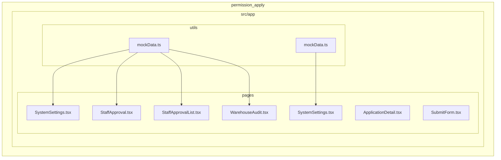
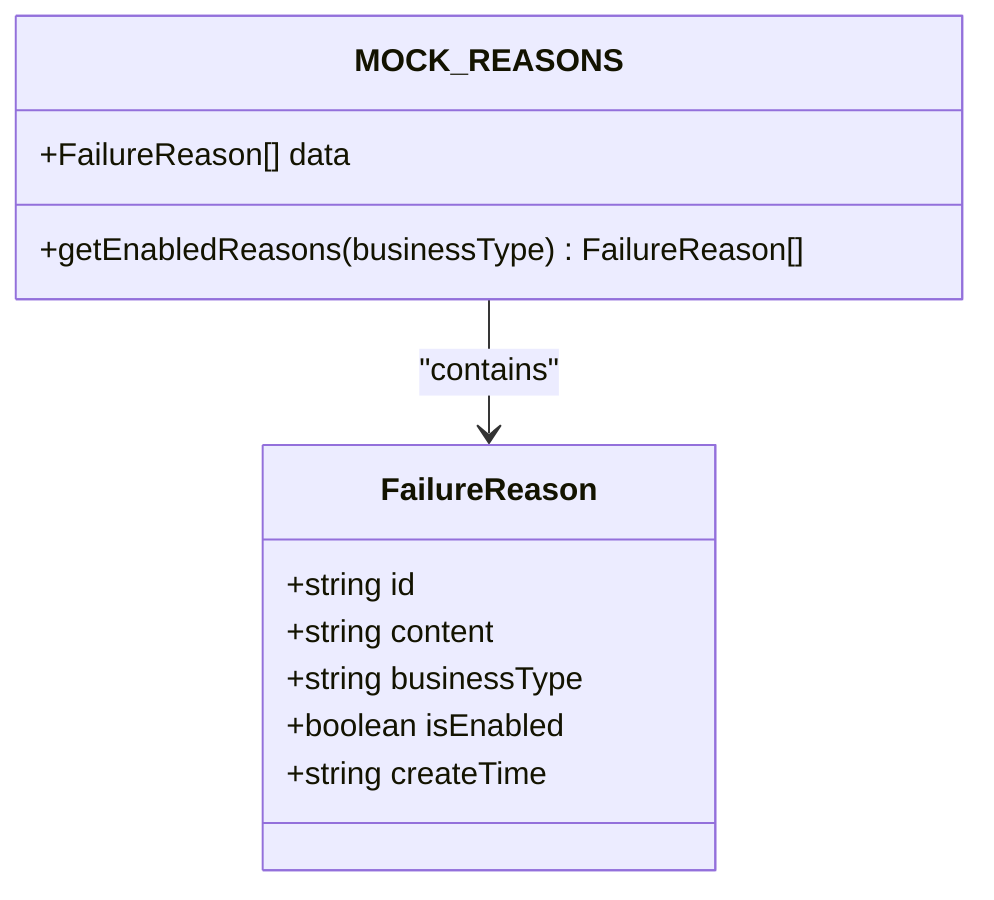
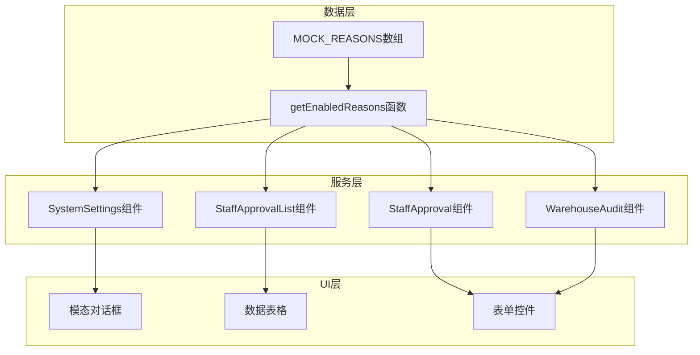
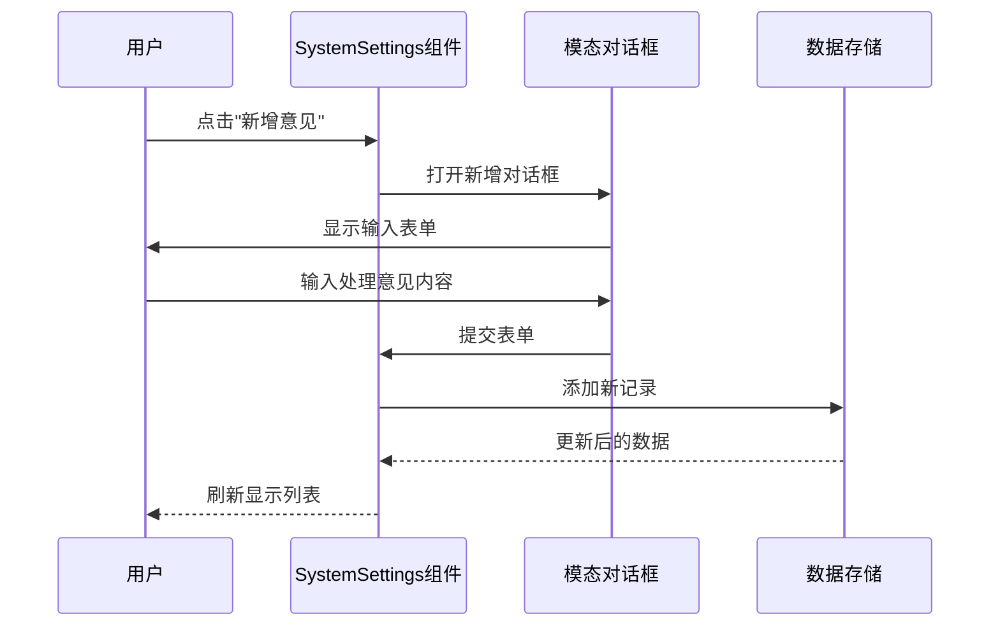
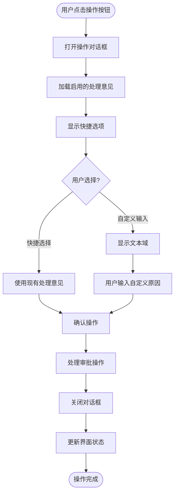
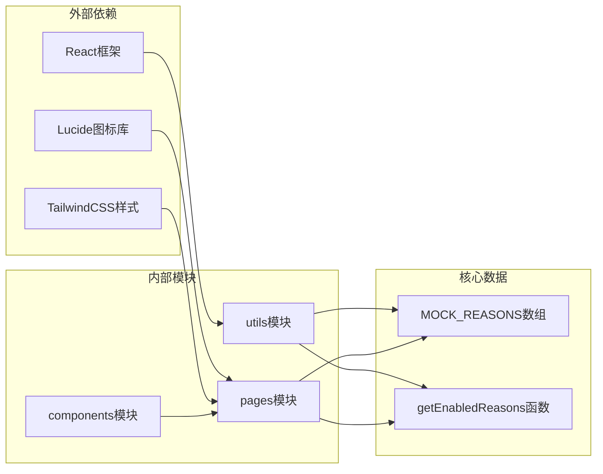

# Mock数据管理

<cite>
**本文档引用的文件**
- [mockData.ts](file://src/app/utils/mockData.ts)
- [SystemSettings.tsx](file://src/app/pages/SystemSettings.tsx)
- [StaffApproval.tsx](file://src/app/pages/StaffApproval.tsx)
- [StaffApprovalList.tsx](file://src/app/pages/StaffApprovalList.tsx)
- [WarehouseAudit.tsx](file://src/app/pages/WarehouseAudit.tsx)
- [ApplicationDetail.tsx](file://src/app/pages/ApplicationDetail.tsx)
- [SubmitForm.tsx](file://src/app/pages/SubmitForm.tsx)
- [mockData.ts](file://permission_apply/src/app/utils/mockData.ts)
- [SystemSettings.tsx](file://permission_apply/src/app/pages/SystemSettings.tsx)
</cite>

## 目录
1. [简介](#简介)
2. [项目结构](#项目结构)
3. [核心组件](#核心组件)
4. [架构概览](#架构概览)
5. [详细组件分析](#详细组件分析)
6. [依赖关系分析](#依赖关系分析)
7. [性能考虑](#性能考虑)
8. [故障排除指南](#故障排除指南)
9. [结论](#结论)

## 简介

Mock数据管理系统是一个基于React的应用程序，专门用于管理业务审批流程中的模拟数据。该系统提供了完整的Mock数据生命周期管理，包括数据设计原则、数据结构定义、增删改查操作和动态过滤机制。系统的核心是MOCK_REASONS常量数组，它作为应用中的单一事实来源，为各种审批场景提供预定义的处理意见模板。

该系统主要服务于交易权限申请、仓库审计等业务场景，通过Mock数据来演示和测试不同的审批流程和状态变化。系统设计遵循单一职责原则，将Mock数据管理功能独立封装，便于在不同页面和组件中复用。

## 项目结构

Mock数据管理系统的文件组织采用按功能模块划分的方式，主要包含以下目录结构：

**图表来源**
- [mockData.ts:1-13](file://src/app/utils/mockData.ts#L1-L13)
- [SystemSettings.tsx:1-192](file://src/app/pages/SystemSettings.tsx#L1-L192)

**章节来源**
- [mockData.ts:1-13](file://src/app/utils/mockData.ts#L1-L13)
- [SystemSettings.tsx:1-192](file://src/app/pages/SystemSettings.tsx#L1-L192)

## 核心组件

### MOCK_REASONS数据结构

MOCK_REASONS是系统的核心数据源，采用数组形式存储所有可用的处理意见模板。每个条目包含以下关键属性：

- **id**: 唯一标识符，用于快速查找和更新
- **content**: 处理意见的具体内容
- **businessType**: 业务类型标识，用于分类管理
- **isEnabled**: 启用状态，控制是否在UI中显示
- **createTime**: 创建时间戳

**图表来源**
- [mockData.ts:2-8](file://src/app/utils/mockData.ts#L2-L8)

### getEnabledReasons函数

这是一个过滤函数，根据业务类型返回启用的处理意见列表。该函数实现了动态过滤机制，支持：

- 按业务类型过滤（默认为'trade_permission'）
- 自动筛选启用状态的条目
- 返回新的数组实例，避免直接修改原始数据

**章节来源**
- [mockData.ts:10-12](file://src/app/utils/mockData.ts#L10-L12)

## 架构概览

Mock数据管理系统采用分层架构设计，确保了良好的可维护性和扩展性：

**图表来源**
- [SystemSettings.tsx:15-62](file://src/app/pages/SystemSettings.tsx#L15-L62)
- [StaffApproval.tsx:117-140](file://src/app/pages/StaffApproval.tsx#L117-L140)
- [StaffApprovalList.tsx:20-20](file://src/app/pages/StaffApprovalList.tsx#L20-L20)

## 详细组件分析

### 系统设置组件（SystemSettings）

SystemSettings组件提供了完整的Mock数据管理界面，支持以下功能：

#### 数据展示与过滤
- 支持按业务类型过滤显示的数据
- 实时显示启用状态的处理意见
- 提供业务类型的下拉选择器

#### 增删改查操作
- **新增**: 通过模态对话框添加新的处理意见
- **编辑**: 支持修改现有处理意见的内容
- **删除**: 提供确认对话框进行安全删除
- **启用/禁用**: 切换处理意见的启用状态

**图表来源**
- [SystemSettings.tsx:25-52](file://src/app/pages/SystemSettings.tsx#L25-L52)

#### 动态过滤机制
系统实现了智能的动态过滤功能：
- 实时过滤：用户选择业务类型后立即更新显示
- 状态过滤：只显示启用状态的处理意见
- 搜索功能：支持按内容关键词搜索

**章节来源**
- [SystemSettings.tsx:15-192](file://src/app/pages/SystemSettings.tsx#L15-L192)

### 审批流程组件（StaffApproval）

StaffApproval组件集成了Mock数据到实际的审批流程中，主要功能包括：

#### 快捷处理意见
- 从MOCK_REASONS中动态加载启用的处理意见
- 支持快速选择和自定义输入两种模式
- 实现了一键驳回和办理失败的功能

#### 审批状态管理
- 集成完整的审批流程状态显示
- 支持多种审批节点的状态变化
- 提供详细的流程记录和历史追踪

**图表来源**
- [StaffApproval.tsx:117-140](file://src/app/pages/StaffApproval.tsx#L117-L140)
- [StaffApproval.tsx:645-704](file://src/app/pages/StaffApproval.tsx#L645-L704)

**章节来源**
- [StaffApproval.tsx:78-708](file://src/app/pages/StaffApproval.tsx#L78-L708)

### 批量处理组件（StaffApprovalList）

StaffApprovalList组件提供了批量处理功能，支持：
- 多条记录的同时处理
- 批量驳回和批量失败操作
- 选择性处理和批量导出功能

**章节来源**
- [StaffApprovalList.tsx:9-449](file://src/app/pages/StaffApprovalList.tsx#L9-L449)

### 仓库审计组件（WarehouseAudit）

WarehouseAudit组件展示了Mock数据在复杂业务场景中的应用：
- 会签节点的一票否决机制
- 多级审批流程的状态管理
- 详细的审批历史记录

**章节来源**
- [WarehouseAudit.tsx:129-800](file://src/app/pages/WarehouseAudit.tsx#L129-L800)

## 依赖关系分析

Mock数据管理系统展现了清晰的依赖层次结构：

**图表来源**
- [mockData.ts:1-13](file://src/app/utils/mockData.ts#L1-L13)
- [SystemSettings.tsx:1-5](file://src/app/pages/SystemSettings.tsx#L1-L5)

### 组件耦合度分析

系统采用了松耦合的设计模式：
- **低耦合**: 各页面组件通过导入MOCK_REASONS和getEnabledReasons函数使用Mock数据
- **高内聚**: 数据管理功能集中在utils模块中
- **接口稳定**: 通过固定的函数接口提供数据访问，便于替换实现

**章节来源**
- [mockData.ts:1-13](file://src/app/utils/mockData.ts#L1-L13)

## 性能考虑

Mock数据管理系统在性能方面采用了多项优化策略：

### 数据访问优化
- **内存缓存**: MOCK_REASONS作为全局常量，避免重复创建
- **懒加载**: getEnabledReasons函数按需执行过滤操作
- **不可变数据**: 过滤操作返回新数组，保持原始数据不变

### UI渲染优化
- **虚拟滚动**: 大数据集时可考虑实现虚拟滚动
- **防抖处理**: 输入框的实时搜索可添加防抖机制
- **条件渲染**: 根据业务类型动态渲染相关内容

### 状态管理优化
- **局部状态**: 使用useState管理组件内部状态
- **状态提升**: 在需要共享的状态时考虑提升到父组件
- **状态持久化**: 可考虑将用户偏好状态持久化到localStorage

## 故障排除指南

### 常见问题及解决方案

#### Mock数据不显示
**问题**: 启用的处理意见没有在UI中显示
**可能原因**:
- businessType不匹配
- isEnabled状态为false
- 数据格式错误

**解决方法**:
1. 检查MOCK_REASONS数组中的businessType字段
2. 确认isEnabled状态为true
3. 验证数据结构的完整性

#### 过滤功能异常
**问题**: 按业务类型过滤时出现意外结果
**可能原因**:
- 业务类型字符串不匹配
- getEnabledReasons函数参数错误

**解决方法**:
1. 检查传入的businessType参数
2. 确认MOCK_REASONS中的businessType值
3. 验证字符串比较逻辑

#### 数据更新不生效
**问题**: 修改后的Mock数据没有反映在界面上
**可能原因**:
- 状态更新未触发重新渲染
- 数据引用未正确更新

**解决方法**:
1. 确保使用setState函数更新状态
2. 验证数组更新操作返回新数组
3. 检查组件的key属性设置

**章节来源**
- [SystemSettings.tsx:36-62](file://src/app/pages/SystemSettings.tsx#L36-L62)

## 结论

Mock数据管理系统通过精心设计的架构和实现，成功地为业务审批流程提供了灵活而强大的数据支撑。系统的主要优势包括：

### 设计优势
- **单一职责**: 将Mock数据管理功能独立封装，提高代码复用性
- **易于扩展**: 支持新的业务类型和处理意见模板
- **用户友好**: 提供直观的管理界面和操作流程

### 技术特点
- **响应式设计**: 支持多种业务场景下的数据展示
- **状态管理**: 有效的状态管理和数据流控制
- **错误处理**: 完善的错误处理和边界情况处理

### 应用价值
该系统不仅为开发和测试提供了便利，更重要的是为业务人员提供了标准化的处理意见模板，有助于提高审批流程的一致性和效率。通过Mock数据的灵活配置，系统能够适应不同的业务需求和场景变化。

未来可以考虑的功能增强包括：数据导入导出、多语言支持、更丰富的过滤选项、以及与真实数据的无缝切换机制。这些改进将进一步提升系统的实用性和用户体验。