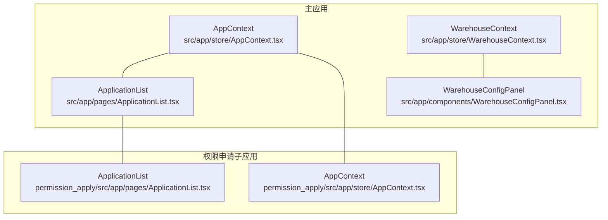
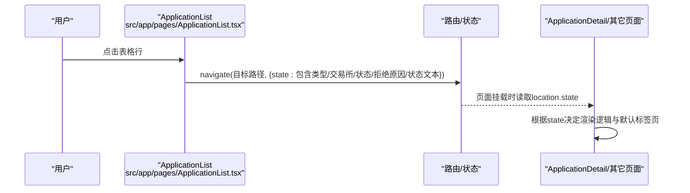
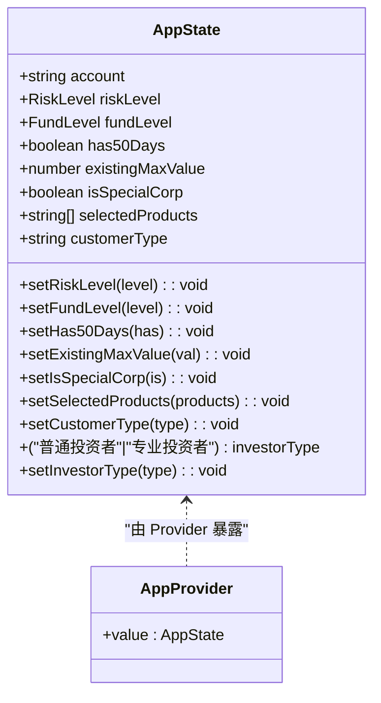
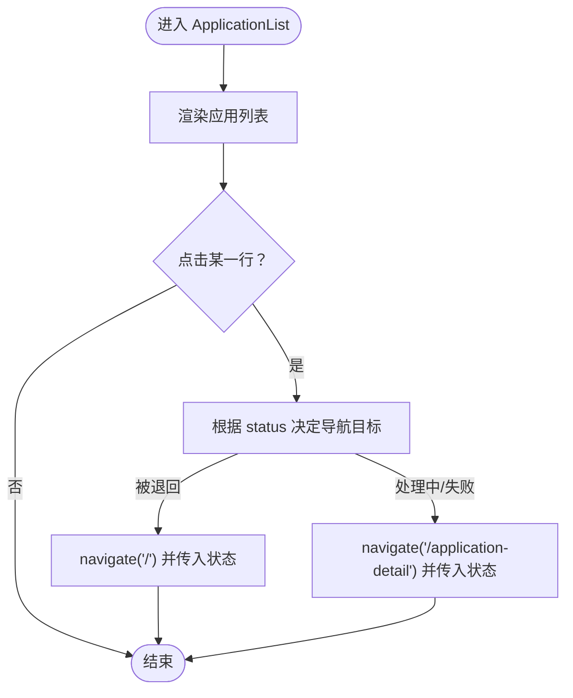
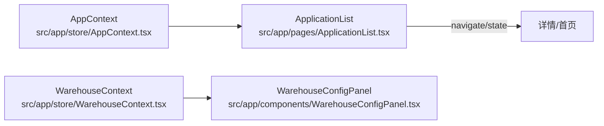

# 接口定义

<cite>
**本文引用的文件**
- [src/app/store/AppContext.tsx](file://src/app/store/AppContext.tsx)
- [permission_apply/src/app/store/AppContext.tsx](file://permission_apply/src/app/store/AppContext.tsx)
- [src/app/store/WarehouseContext.tsx](file://src/app/store/WarehouseContext.tsx)
- [src/app/pages/ApplicationList.tsx](file://src/app/pages/ApplicationList.tsx)
- [permission_apply/src/app/pages/ApplicationList.tsx](file://permission_apply/src/app/pages/ApplicationList.tsx)
- [src/app/components/WarehouseConfigPanel.tsx](file://src/app/components/WarehouseConfigPanel.tsx)
- [docs/warehouse-transfer-design.md](file://docs/warehouse-transfer-design.md)
</cite>

## 目录
1. 引言
2. 项目结构
3. 核心组件
4. 架构总览
5. 详细组件分析
6. 依赖分析
7. 性能考量
8. 故障排查指南
9. 结论
10. 附录

## 引言
本文件系统化梳理管理平台中的 TypeScript 接口与类型定义，覆盖业务实体、状态容器、表单数据与页面交互状态等。重点说明接口之间的继承与组合关系，给出使用示例与最佳实践，并讨论接口版本管理与向后兼容策略。

## 项目结构
本项目采用多包结构（主应用与“权限申请”子应用），二者共享相似的状态上下文设计模式：均通过 React Context 暴露状态与更新函数，类型定义集中在对应 store 文件中；页面组件通过路由与状态上下文进行数据传递与渲染控制。



图表来源
- [src/app/store/AppContext.tsx:1-64](file://src/app/store/AppContext.tsx#L1-L64)
- [permission_apply/src/app/store/AppContext.tsx:1-64](file://permission_apply/src/app/store/AppContext.tsx#L1-L64)
- [src/app/store/WarehouseContext.tsx:1-185](file://src/app/store/WarehouseContext.tsx#L1-L185)
- [src/app/pages/ApplicationList.tsx:1-178](file://src/app/pages/ApplicationList.tsx#L1-L178)
- [permission_apply/src/app/pages/ApplicationList.tsx:1-178](file://permission_apply/src/app/pages/ApplicationList.tsx#L1-L178)
- [src/app/components/WarehouseConfigPanel.tsx:1-29](file://src/app/components/WarehouseConfigPanel.tsx#L1-L29)

章节来源
- [src/app/store/AppContext.tsx:1-64](file://src/app/store/AppContext.tsx#L1-L64)
- [permission_apply/src/app/store/AppContext.tsx:1-64](file://permission_apply/src/app/store/AppContext.tsx#L1-L64)
- [src/app/store/WarehouseContext.tsx:1-185](file://src/app/store/WarehouseContext.tsx#L1-L185)
- [src/app/pages/ApplicationList.tsx:1-178](file://src/app/pages/ApplicationList.tsx#L1-L178)
- [permission_apply/src/app/pages/ApplicationList.tsx:1-178](file://permission_apply/src/app/pages/ApplicationList.tsx#L1-L178)
- [src/app/components/WarehouseConfigPanel.tsx:1-29](file://src/app/components/WarehouseConfigPanel.tsx#L1-L29)

## 核心组件
本节聚焦于两类核心类型定义：通用应用状态上下文与仓库（移仓）业务上下文。二者均以“类型 + 接口”的方式组织，前者用于权限申请流程，后者用于移仓业务。

- 应用状态上下文（AppContext）
  - 类型别名：风险等级、资金规模等级
  - 状态接口：包含账户信息、风险与资金等级、是否满足特定条件、已选产品列表、客户类型、投资者类型等
  - 更新函数：对上述字段进行 setter 调用
  - 使用场景：权限申请流程中的用户偏好与筛选条件持久化

- 仓库（移仓）状态上下文（WarehouseContext）
  - 类型别名：交易所枚举、方向枚举、合约类型枚举
  - 实体接口：PositionRow 表示单个持仓行，包含交易所、品种、合约、买卖方向、套保标志、手数、划转资金、备注等
  - 状态接口：包含账户、客户名称、分支、客户类型、选择的交易所、方向、合约类型、划转日期、出入金经纪商信息、实际控制账户信息、权限映射、按手数划转开关、划转原因、持仓明细、附件列表、确认状态、备注、重置函数等
  - 使用场景：移仓申请表单的数据驱动与校验

章节来源
- [src/app/store/AppContext.tsx:3-27](file://src/app/store/AppContext.tsx#L3-L27)
- [src/app/store/WarehouseContext.tsx:3-17](file://src/app/store/WarehouseContext.tsx#L3-L17)
- [src/app/store/WarehouseContext.tsx:19-73](file://src/app/store/WarehouseContext.tsx#L19-L73)

## 架构总览
下图展示应用上下文与仓库上下文在页面与组件间的交互关系，以及页面如何通过路由状态传递影响详情页渲染。



图表来源
- [src/app/pages/ApplicationList.tsx:65-71](file://src/app/pages/ApplicationList.tsx#L65-L71)

章节来源
- [src/app/pages/ApplicationList.tsx:1-178](file://src/app/pages/ApplicationList.tsx#L1-L178)

## 详细组件分析

### 应用上下文（AppContext）接口族
- 类型别名
  - 风险等级：C3/C4/C5
  - 资金规模等级：小于50万、50万至100万、大于等于100万
- 状态接口（AppState）
  - 字段：账户、风险等级、资金规模等级、是否满足50天条件、现有最大值、是否为特殊公司、已选产品数组、客户类型、投资者类型
  - 方法：各字段对应的 setter 函数签名
- 使用要点
  - 提供统一的状态入口，便于在权限申请流程中跨组件共享
  - setter 函数签名保持一致，利于封装与测试



图表来源
- [src/app/store/AppContext.tsx:6-27](file://src/app/store/AppContext.tsx#L6-L27)
- [src/app/store/AppContext.tsx:31-57](file://src/app/store/AppContext.tsx#L31-L57)

章节来源
- [src/app/store/AppContext.tsx:3-27](file://src/app/store/AppContext.tsx#L3-L27)
- [src/app/store/AppContext.tsx:31-57](file://src/app/store/AppContext.tsx#L31-L57)

### 仓库（移仓）上下文（WarehouseContext）接口族
- 类型别名
  - 交易所：DCE/CZCE/SHFE
  - 方向：OUT/IN/ACTUAL_CONTROL
  - 合约类型：FUTURES/OPTIONS
- 实体接口（PositionRow）
  - 字段：唯一标识、交易所、品种名称、合约代码、持仓方向（BUY/SELL/ALL）、套保标志（SPEC/HEDGE/空字符串）、手数、划转资金、备注
- 状态接口（WarehouseState）
  - 字段：账户、客户名称、分支、客户类型、已选交易所、方向、合约类型、划转日期、出入金经纪商成员编号与名称、出入金客户交易编码与名称、实际控制账户信息、账户权限映射、按手数划转开关、划转原因、持仓明细、附件列表、确认状态、备注
  - 方法：setter、toggle、hasPermissionForAccount、reset
- 使用要点
  - 通过 Record<T, K> 组织交易所维度的字段，便于扩展与维护
  - 通过权限映射控制敏感字段的可见性与可编辑性
  - reset 函数用于表单草稿清理

```mermaid
classDiagram
class PositionRow {
+string id
+string exchange
+string varietyName
+string contractCode
+("BUY"|"SELL"|"ALL") positionDirection
+("SPEC"|"HEDGE"|"") hedgeType
+number lots
+number transferFunds
+string remark
}
class WarehouseState {
+string account
+string customerName
+string branch
+string customerType
+WarehouseExchange[] selectedExchanges
+setSelectedExchanges(val) : void
+WarehouseDirection direction
+setDirection(val) : void
+ContractType contractType
+setContractType(val) : void
+string transferDate
+setTransferDate(val) : void
+string outBrokerMemberId
+setOutBrokerMemberId(val) : void
+string outBrokerName
+setOutBrokerName(val) : void
+string inBrokerMemberId
+setInBrokerMemberId(val) : void
+string inBrokerName
+setInBrokerName(val) : void
+Record<WarehouseExchange,string> outClientTradingCodes
+setOutClientTradingCodes(val) : void
+Record<WarehouseExchange,string> outClientNames
+setOutClientNames(val) : void
+Record<WarehouseExchange,string> inClientTradingCodes
+setInClientTradingCodes(val) : void
+string inClientName
+setInClientName(val) : void
+string actualControlOutAccount
+setActualControlOutAccount(val) : void
+string actualControlOutName
+setActualControlOutName(val) : void
+string actualControlInAccount
+setActualControlInAccount(val) : void
+string actualControlInName
+setActualControlInName(val) : void
+Record<string,boolean> accountPermissions
+toggleAccountPermission(account) : void
+hasPermissionForAccount(account) : boolean
+("YES"|"NO"|"") dceTransferByQuantity
+setDceTransferByQuantity(val) : void
+string transferReason
+setTransferReason(val) : void
+PositionRow[] positions
+setPositions(positions) : void
+{name : string,size : string}[] attachments
+setAttachments(attachments) : void
+boolean confirmed
+setConfirmed(val) : void
+string remark
+setRemark(val) : void
+reset() : void
}
class WarehouseProvider {
+value : WarehouseState
}
PositionRow <-- WarehouseState : "包含"
WarehouseState <.. WarehouseProvider : "由 Provider 暴露"
```

图表来源
- [src/app/store/WarehouseContext.tsx:7-17](file://src/app/store/WarehouseContext.tsx#L7-L17)
- [src/app/store/WarehouseContext.tsx:19-73](file://src/app/store/WarehouseContext.tsx#L19-L73)
- [src/app/store/WarehouseContext.tsx:77-177](file://src/app/store/WarehouseContext.tsx#L77-L177)

章节来源
- [src/app/store/WarehouseContext.tsx:3-17](file://src/app/store/WarehouseContext.tsx#L3-L17)
- [src/app/store/WarehouseContext.tsx:7-17](file://src/app/store/WarehouseContext.tsx#L7-L17)
- [src/app/store/WarehouseContext.tsx:19-73](file://src/app/store/WarehouseContext.tsx#L19-L73)
- [src/app/store/WarehouseContext.tsx:77-177](file://src/app/store/WarehouseContext.tsx#L77-L177)

### 页面与上下文的交互（ApplicationList）
- 列表项结构
  - 字段：流水号、申请类型、名称、提交时间、当前状态、状态文本、申请品种、交易所标识数组
- 交互逻辑
  - 点击行时根据状态判断跳转到详情或首页，并携带状态对象（包含类型、交易所、状态、拒绝原因、状态文本）
- 使用要点
  - 通过 location.state 在页面间传递轻量数据，避免全局状态污染
  - 状态文本与图标颜色与状态值强关联，便于 UI 快速渲染



图表来源
- [src/app/pages/ApplicationList.tsx:10-63](file://src/app/pages/ApplicationList.tsx#L10-L63)
- [src/app/pages/ApplicationList.tsx:65-71](file://src/app/pages/ApplicationList.tsx#L65-L71)

章节来源
- [src/app/pages/ApplicationList.tsx:1-178](file://src/app/pages/ApplicationList.tsx#L1-L178)
- [permission_apply/src/app/pages/ApplicationList.tsx:1-178](file://permission_apply/src/app/pages/ApplicationList.tsx#L1-L178)

### 组件与上下文的协作（WarehouseConfigPanel）
- 场景填充
  - 通过场景键（如 DCE 移入/移出/实际控制）一键填充表单字段
  - 依赖 useWarehouseContext 获取上下文实例与 setter
- 使用要点
  - 将复杂表单初始化拆分为“场景”，降低重复赋值成本
  - 与 ACTUAL_CONTROL_ACCOUNT_DB 等常量配合，实现受控字段的自动补全

章节来源
- [src/app/components/WarehouseConfigPanel.tsx:14-29](file://src/app/components/WarehouseConfigPanel.tsx#L14-L29)

## 依赖分析
- 上下文耦合
  - AppContext 与 WarehouseContext 分属不同业务域，但共享“类型 + 接口 + Provider/useContext”的设计范式
  - 两者均通过 setter 函数暴露可变状态，便于组件层直接调用
- 组件依赖
  - WarehouseConfigPanel 依赖 WarehouseContext 的场景填充能力
  - ApplicationList 依赖路由状态传递机制
- 外部依赖
  - React createContext/useContext 作为状态共享基础设施
  - 无循环依赖迹象



图表来源
- [src/app/store/AppContext.tsx:29-63](file://src/app/store/AppContext.tsx#L29-L63)
- [src/app/store/WarehouseContext.tsx:75-184](file://src/app/store/WarehouseContext.tsx#L75-L184)
- [src/app/pages/ApplicationList.tsx:65-71](file://src/app/pages/ApplicationList.tsx#L65-L71)
- [src/app/components/WarehouseConfigPanel.tsx:14-29](file://src/app/components/WarehouseConfigPanel.tsx#L14-L29)

章节来源
- [src/app/store/AppContext.tsx:29-63](file://src/app/store/AppContext.tsx#L29-L63)
- [src/app/store/WarehouseContext.tsx:75-184](file://src/app/store/WarehouseContext.tsx#L75-L184)
- [src/app/pages/ApplicationList.tsx:65-71](file://src/app/pages/ApplicationList.tsx#L65-L71)
- [src/app/components/WarehouseConfigPanel.tsx:14-29](file://src/app/components/WarehouseConfigPanel.tsx#L14-L29)

## 性能考量
- 状态粒度
  - 将通用字段与业务字段分组，减少无关渲染
- 记忆化与浅比较
  - 使用 React.memo 或 useMemo 缓存昂贵计算结果
- 渲染优化
  - 列表使用虚拟滚动（如需）与最小化重排
- 上下文订阅
  - 仅在必要组件订阅上下文，避免过度订阅导致的全局重渲染

## 故障排查指南
- 上下文未包裹
  - 现象：useAppContext/useWarehouseContext 抛出错误
  - 处理：确保根节点包裹对应 Provider
- 状态未更新
  - 现象：UI 不随输入变化
  - 处理：检查 setter 是否正确调用；确认字段类型与默认值一致
- 路由状态丢失
  - 现象：详情页无法读取状态
  - 处理：确认 navigate 第二参数包含 state；页面挂载时读取 location.state 并设置默认值
- 权限字段不可见
  - 现象：实际控制账户相关字段为空
  - 处理：检查 accountPermissions 映射；确认 hasPermissionForAccount 返回预期值

章节来源
- [src/app/store/AppContext.tsx:59-63](file://src/app/store/AppContext.tsx#L59-L63)
- [src/app/store/WarehouseContext.tsx:180-184](file://src/app/store/WarehouseContext.tsx#L180-L184)
- [src/app/pages/ApplicationList.tsx:65-71](file://src/app/pages/ApplicationList.tsx#L65-L71)

## 结论
本项目通过“类型别名 + 接口 + Provider/useContext”的模式，清晰地划分了通用应用状态与业务域状态。接口之间以组合为主（如 PositionRow 属于 WarehouseState），并通过 setter 函数形成统一的更新契约。页面通过路由状态传递实现轻量数据流转。建议在后续迭代中完善版本化注释与迁移策略，确保接口演进的向后兼容性。

## 附录

### 接口使用示例与最佳实践
- 使用 AppContext
  - 在根组件包裹 AppProvider
  - 在组件中通过 useAppContext 获取状态与 setter，避免直接访问全局变量
- 使用 WarehouseContext
  - 初始化时调用 reset 清理草稿
  - 通过场景填充快速生成典型表单配置
  - 对权限字段使用 hasPermissionForAccount 控制显示
- 页面间传递
  - 使用 location.state 传递轻量数据，避免引入重型状态管理库
  - 为缺失状态提供默认值，保证健壮性

### 接口版本管理与向后兼容
- 版本标注
  - 为接口与类型添加语义化版本注释，明确变更范围
- 兼容策略
  - 新增字段采用可选属性或默认值，避免破坏既有调用方
  - 旧字段标记为废弃并在后续版本移除
- 设计建议
  - 参考仓库移仓草稿设计文档，为复杂表单增加独立草稿上下文，隔离正式态与草稿态

章节来源
- [docs/warehouse-transfer-design.md:103-105](file://docs/warehouse-transfer-design.md#L103-L105)