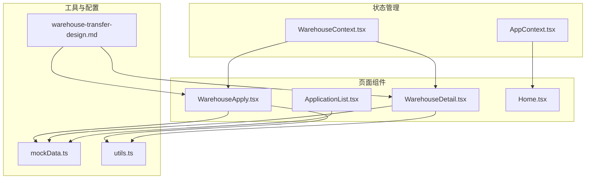
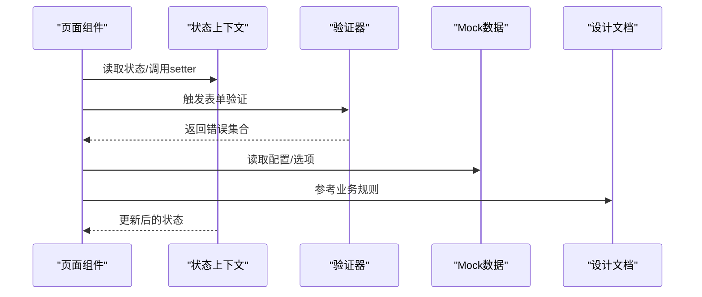
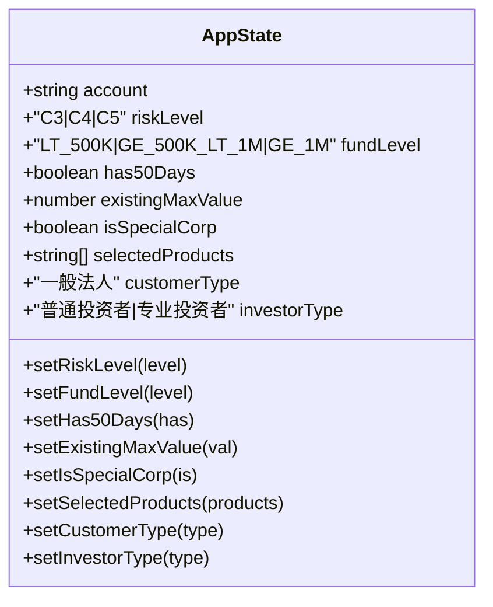
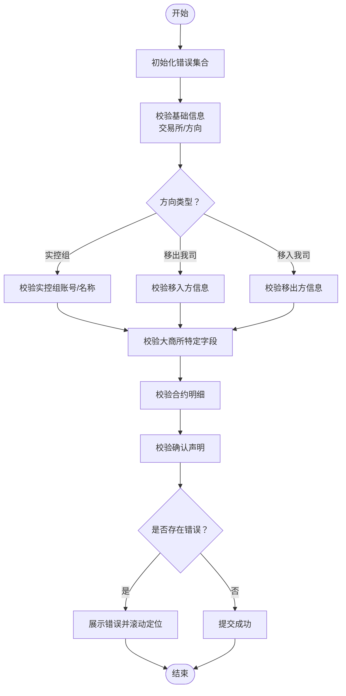
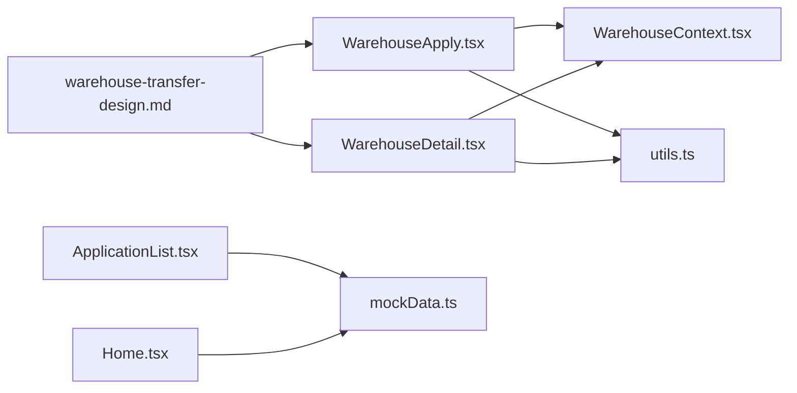

# 数据模型设计

<cite>
**本文档引用的文件**
- [WarehouseContext.tsx](file://src/app/store/WarehouseContext.tsx)
- [AppContext.tsx](file://permission_apply/src/app/store/AppContext.tsx)
- [mockData.ts](file://src/app/utils/mockData.ts)
- [mockData.ts](file://permission_apply/src/app/utils/mockData.ts)
- [WarehouseApply.tsx](file://src/app/pages/WarehouseApply.tsx)
- [WarehouseDetail.tsx](file://src/app/pages/WarehouseDetail.tsx)
- [ApplicationList.tsx](file://src/app/pages/ApplicationList.tsx)
- [warehouse-transfer-design.md](file://docs/warehouse-transfer-design.md)
- [Home.tsx](file://src/app/pages/Home.tsx)
- [utils.ts](file://src/lib/utils.ts)
</cite>

## 目录
1. [引言](#引言)
2. [项目结构](#项目结构)
3. [核心组件](#核心组件)
4. [架构概览](#架构概览)
5. [详细组件分析](#详细组件分析)
6. [依赖分析](#依赖分析)
7. [性能考虑](#性能考虑)
8. [故障排除指南](#故障排除指南)
9. [结论](#结论)
10. [附录](#附录)

## 引言
本文件系统化梳理了管理平台的数据模型设计，重点覆盖状态数据结构、接口定义、数据验证规则以及Mock数据管理。通过对仓库（移仓）业务上下文、应用上下文、页面组件以及文档规范的综合分析，形成可执行、可扩展、可维护的数据模型蓝图。同时，文档提供了实体关系图、字段定义、数据类型与约束、数据生命周期管理策略、缓存策略与性能优化建议，帮助开发者与产品团队高效协作。

## 项目结构
项目采用前后端一体化的前端工程组织方式，核心数据模型主要集中在以下位置：
- 状态管理：src/app/store/WarehouseContext.tsx、permission_apply/src/app/store/AppContext.tsx
- 页面组件：src/app/pages/WarehouseApply.tsx、src/app/pages/WarehouseDetail.tsx、src/app/pages/ApplicationList.tsx
- Mock数据：src/app/utils/mockData.ts、permission_apply/src/app/utils/mockData.ts
- 设计文档：docs/warehouse-transfer-design.md
- 工具函数：src/lib/utils.ts



**图表来源**
- [WarehouseContext.tsx:1-185](file://src/app/store/WarehouseContext.tsx#L1-L185)
- [AppContext.tsx:1-64](file://permission_apply/src/app/store/AppContext.tsx#L1-L64)
- [WarehouseApply.tsx:1-909](file://src/app/pages/WarehouseApply.tsx#L1-L909)
- [WarehouseDetail.tsx:261-286](file://src/app/pages/WarehouseDetail.tsx#L261-L286)
- [ApplicationList.tsx:1-178](file://src/app/pages/ApplicationList.tsx#L1-L178)
- [mockData.ts:1-13](file://src/app/utils/mockData.ts#L1-L13)
- [utils.ts:1-6](file://src/lib/utils.ts#L1-L6)
- [warehouse-transfer-design.md:1-105](file://docs/warehouse-transfer-design.md#L1-L105)

**章节来源**
- [WarehouseContext.tsx:1-185](file://src/app/store/WarehouseContext.tsx#L1-L185)
- [AppContext.tsx:1-64](file://permission_apply/src/app/store/AppContext.tsx#L1-L64)
- [WarehouseApply.tsx:1-909](file://src/app/pages/WarehouseApply.tsx#L1-L909)
- [WarehouseDetail.tsx:261-286](file://src/app/pages/WarehouseDetail.tsx#L261-L286)
- [ApplicationList.tsx:1-178](file://src/app/pages/ApplicationList.tsx#L1-L178)
- [mockData.ts:1-13](file://src/app/utils/mockData.ts#L1-L13)
- [utils.ts:1-6](file://src/lib/utils.ts#L1-L6)
- [warehouse-transfer-design.md:1-105](file://docs/warehouse-transfer-design.md#L1-L105)

## 核心组件
本节聚焦于数据模型的核心组件：状态上下文、页面级数据结构、验证规则与Mock数据。

- 状态上下文
  - 仓库（移仓）上下文：集中管理移仓表单的多维状态，包括交易所选择、移仓方向、合约明细、附件、确认声明等。
  - 应用上下文：用于权限申请场景的状态管理，包含客户类型、风险等级、资金等级等。

- 页面级数据结构
  - 移仓申请页面：定义了移仓方向、交易所、合约明细、附件、备注等字段的数据结构与交互逻辑。
  - 移仓详情页面：展示已填充的移仓信息，体现状态到UI的映射。
  - 申请列表页面：展示申请流水号、类型、状态、拒绝原因等聚合信息。

- 数据验证规则
  - 表单级验证：对必填字段、格式、范围进行校验，并在UI层反馈错误信息。
  - 业务规则：针对不同交易所、方向、合约类型的特殊规则进行约束。

- Mock数据管理
  - 统一的Mock配置作为应用内的单一真实来源，便于跨页面共享与测试。

**章节来源**
- [WarehouseContext.tsx:19-73](file://src/app/store/WarehouseContext.tsx#L19-L73)
- [WarehouseApply.tsx:319-380](file://src/app/pages/WarehouseApply.tsx#L319-L380)
- [WarehouseDetail.tsx:261-286](file://src/app/pages/WarehouseDetail.tsx#L261-L286)
- [ApplicationList.tsx:10-63](file://src/app/pages/ApplicationList.tsx#L10-L63)
- [mockData.ts:1-13](file://src/app/utils/mockData.ts#L1-L13)

## 架构概览
下图展示了数据模型在系统中的流转：页面组件通过上下文暴露的状态与方法驱动UI，同时触发数据验证与状态更新；Mock数据为开发与测试提供稳定的数据源；设计文档为业务规则与字段约束提供权威依据。



**图表来源**
- [WarehouseApply.tsx:319-380](file://src/app/pages/WarehouseApply.tsx#L319-L380)
- [WarehouseContext.tsx:19-73](file://src/app/store/WarehouseContext.tsx#L19-L73)
- [mockData.ts:1-13](file://src/app/utils/mockData.ts#L1-L13)
- [warehouse-transfer-design.md:1-105](file://docs/warehouse-transfer-design.md#L1-L105)

## 详细组件分析

### 仓库（移仓）状态模型
仓库上下文定义了完整的移仓业务状态模型，涵盖基础信息、交易所与方向、合约明细、附件、确认声明等。其核心接口与字段如下：

```mermaid
classDiagram
class WarehouseState {
+string account
+string customerName
+string branch
+string customerType
+WarehouseExchange[] selectedExchanges
+WarehouseExchange[] setSelectedExchanges(val)
+WarehouseDirection direction
+setDirection(val)
+ContractType contractType
+setContractType(val)
+string transferDate
+setTransferDate(val)
+string outBrokerMemberId
+setOutBrokerMemberId(val)
+string outBrokerName
+setOutBrokerName(val)
+string inBrokerMemberId
+setInBrokerMemberId(val)
+string inBrokerName
+setInBrokerName(val)
+Record~WarehouseExchange,string~ outClientTradingCodes
+setOutClientTradingCodes(val)
+Record~WarehouseExchange,string~ outClientNames
+setOutClientNames(val)
+Record~WarehouseExchange,string~ inClientTradingCodes
+setInClientTradingCodes(val)
+string inClientName
+setInClientName(val)
+string actualControlOutAccount
+setActualControlOutAccount(val)
+string actualControlOutName
+setActualControlOutName(val)
+string actualControlInAccount
+setActualControlInAccount(val)
+string actualControlInName
+setActualControlInName(val)
+Record~string,bool~ accountPermissions
+toggleAccountPermission(account)
+hasPermissionForAccount(account) bool
+string dceTransferByQuantity
+setDceTransferByQuantity(val)
+string transferReason
+setTransferReason(val)
+PositionRow[] positions
+setPositions(positions)
+{name : string,size : string}[] attachments
+setAttachments(files)
+boolean confirmed
+setConfirmed(val)
+string remark
+setRemark(val)
+reset()
}
class PositionRow {
+string id
+string exchange
+string varietyName
+string contractCode
+"BUY|SELL|ALL" positionDirection
+string hedgeType
+number lots
+number transferFunds
+string remark
}
WarehouseState --> PositionRow : "包含多个"
```

**图表来源**
- [WarehouseContext.tsx:7-73](file://src/app/store/WarehouseContext.tsx#L7-L73)

**章节来源**
- [WarehouseContext.tsx:1-185](file://src/app/store/WarehouseContext.tsx#L1-L185)

### 应用（权限申请）状态模型
应用上下文用于权限申请场景，包含客户类型、风险等级、资金等级、投资者类型等字段，支撑业务决策与UI渲染。



**图表来源**
- [AppContext.tsx:6-27](file://permission_apply/src/app/store/AppContext.tsx#L6-L27)

**章节来源**
- [AppContext.tsx:1-64](file://permission_apply/src/app/store/AppContext.tsx#L1-L64)

### 数据验证流程
表单验证采用“懒校验”与“即时校验”相结合的方式：在用户输入过程中对关键字段进行实时校验，在提交时进行完整校验并滚动定位首个错误项。



**图表来源**
- [WarehouseApply.tsx:319-380](file://src/app/pages/WarehouseApply.tsx#L319-L380)

**章节来源**
- [WarehouseApply.tsx:319-380](file://src/app/pages/WarehouseApply.tsx#L319-L380)

### Mock数据管理
Mock数据作为应用内的单一真实来源，提供静态配置与筛选逻辑，便于在开发与测试阶段快速迭代。

- 配置项
  - 原因列表：包含业务类型、启用状态、创建时间等字段。
  - 过滤函数：按业务类型与启用状态筛选有效原因。

- 使用场景
  - 权限申请页面：用于展示业务声明与确认相关提示。
  - 移仓申请页面：用于展示业务提示与规则说明。

**章节来源**
- [mockData.ts:1-13](file://src/app/utils/mockData.ts#L1-L13)
- [mockData.ts:1-13](file://permission_apply/src/app/utils/mockData.ts#L1-L13)
- [Home.tsx:485-529](file://src/app/pages/Home.tsx#L485-L529)

### 页面数据模型与示例
- 申请列表
  - 字段：流水号、申请类型、申请品种、提交时间、当前状态、拒绝原因等。
  - 示例：包含多种状态（办理中、已退回、审批失败）与对应UI展示。

- 详情页
  - 字段：交易所名称、合约、手数、方向、类型、申请日期、状态文本、驳回原因、会签节点、交易所列表、合约类别、移仓日期、移出/移入方信息、实控组信息、大商所特定字段、转移原因、合约明细、备注、附件等。

**章节来源**
- [ApplicationList.tsx:10-63](file://src/app/pages/ApplicationList.tsx#L10-L63)
- [WarehouseDetail.tsx:38-83](file://src/app/pages/WarehouseDetail.tsx#L38-L83)

## 依赖分析
- 组件耦合
  - 页面组件依赖状态上下文提供的getter/setter与辅助方法，实现状态驱动的UI更新。
  - 验证器与页面组件强耦合，但通过返回错误集合降低复杂度。
  - Mock数据与页面组件弱耦合，通过导入方式共享。

- 外部依赖
  - 工具函数：提供类名合并等通用能力，减少重复逻辑。
  - 设计文档：为字段定义、业务规则提供权威依据。



**图表来源**
- [WarehouseApply.tsx:1-909](file://src/app/pages/WarehouseApply.tsx#L1-L909)
- [WarehouseDetail.tsx:261-286](file://src/app/pages/WarehouseDetail.tsx#L261-L286)
- [ApplicationList.tsx:1-178](file://src/app/pages/ApplicationList.tsx#L1-L178)
- [mockData.ts:1-13](file://src/app/utils/mockData.ts#L1-L13)
- [utils.ts:1-6](file://src/lib/utils.ts#L1-L6)
- [warehouse-transfer-design.md:1-105](file://docs/warehouse-transfer-design.md#L1-L105)

**章节来源**
- [WarehouseApply.tsx:1-909](file://src/app/pages/WarehouseApply.tsx#L1-L909)
- [WarehouseDetail.tsx:261-286](file://src/app/pages/WarehouseDetail.tsx#L261-L286)
- [ApplicationList.tsx:1-178](file://src/app/pages/ApplicationList.tsx#L1-L178)
- [mockData.ts:1-13](file://src/app/utils/mockData.ts#L1-L13)
- [utils.ts:1-6](file://src/lib/utils.ts#L1-L6)
- [warehouse-transfer-design.md:1-105](file://docs/warehouse-transfer-design.md#L1-L105)

## 性能考虑
- 状态更新优化
  - 使用不可变更新模式（如数组/对象的浅拷贝）避免不必要的重渲染。
  - 将大型状态拆分为更细粒度的上下文，减少无关状态变更对UI的影响。

- 渲染性能
  - 列表渲染时使用稳定的key（如随机ID），避免DOM节点重建。
  - 对高频交互（如输入框）采用防抖/节流策略。

- 数据访问优化
  - 将常用配置（如交易所选项、方向选项）缓存到组件外，减少重复计算。
  - 使用Memoization（如useMemo）缓存派生数据。

- 缓存策略
  - 前端缓存：利用浏览器本地存储或内存缓存短期数据（如临时草稿）。
  - CDN缓存：静态资源设置长缓存，入口HTML短缓存以保证更新及时性。
  - Nginx配置：开启Gzip压缩、设置合理的缓存头与安全头，提升传输效率与安全性。

- 网络与IO
  - 附件上传：限制文件大小与类型，采用分片上传与断点续传（如后续接入）。
  - 请求去重：对重复请求进行去重处理，避免重复加载。

[本节为通用指导，无需具体文件分析]

## 故障排除指南
- 常见问题
  - 表单提交失败：检查验证器返回的错误键值，定位首个错误字段并修复。
  - 实控组账号无权限：确认账户权限映射与权限切换逻辑。
  - 附件上传异常：检查文件类型、大小限制与上传回调。

- 排查步骤
  - 在页面组件中打印当前状态快照，核对字段值与预期是否一致。
  - 逐步注释验证逻辑，定位具体校验规则。
  - 检查Mock数据与设计文档的一致性，确保业务规则正确。

**章节来源**
- [WarehouseApply.tsx:382-390](file://src/app/pages/WarehouseApply.tsx#L382-L390)
- [WarehouseContext.tsx:101-104](file://src/app/store/WarehouseContext.tsx#L101-L104)

## 结论
本数据模型设计以状态上下文为核心，结合页面组件的验证逻辑与Mock数据，构建了可扩展、可维护的前端数据层。通过明确的字段定义、严格的验证规则与清晰的业务约束，能够有效支撑移仓与权限申请等核心业务场景。建议在后续迭代中持续完善数据生命周期管理与缓存策略，进一步提升用户体验与系统稳定性。

[本节为总结性内容，无需具体文件分析]

## 附录
- 字段与类型速查
  - 交易所枚举：DCE、CZCE、SHFE
  - 方向枚举：IN、OUT、ACTUAL_CONTROL
  - 合约类型：FUTURES、OPTIONS
  - 持仓方向：BUY、SELL、ALL
  - 持仓类型：SPEC、HEDGE
  - 大商所按量移仓：YES、NO
  - 风险等级：C3、C4、C5
  - 资金等级：LT_500K、GE_500K_LT_1M、GE_1M
  - 投资者类型：普通投资者、专业投资者
  - 客户类型：一般法人

- 示例数据
  - 移仓申请示例：包含交易所、方向、合约明细、附件、备注等字段。
  - 申请列表示例：包含流水号、类型、状态、拒绝原因等字段。

**章节来源**
- [WarehouseContext.tsx:3-6](file://src/app/store/WarehouseContext.tsx#L3-L6)
- [WarehouseApply.tsx:48-75](file://src/app/pages/WarehouseApply.tsx#L48-L75)
- [ApplicationList.tsx:10-63](file://src/app/pages/ApplicationList.tsx#L10-L63)