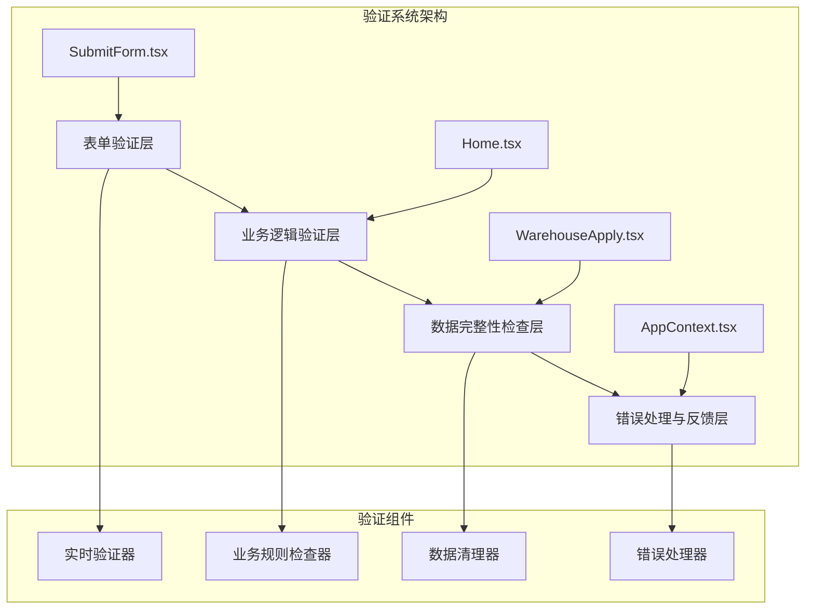
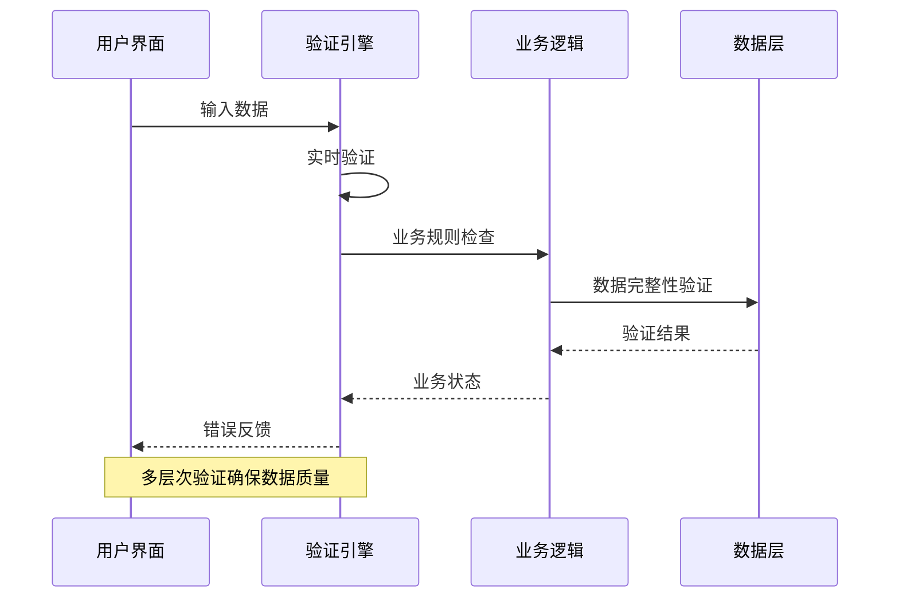
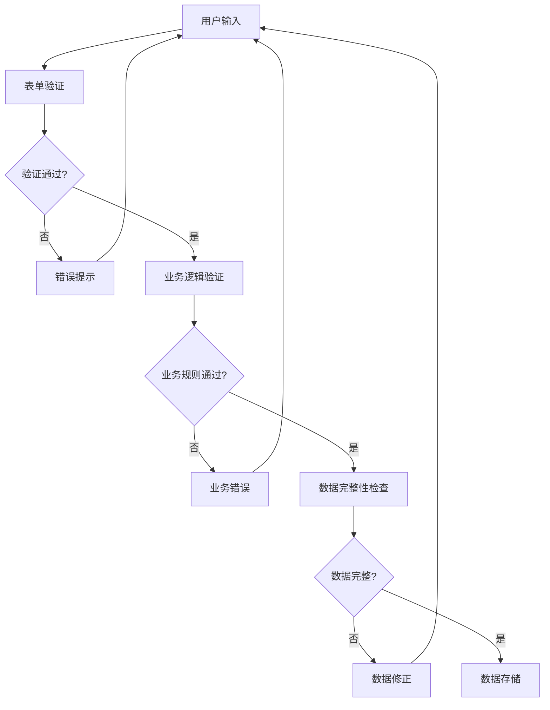
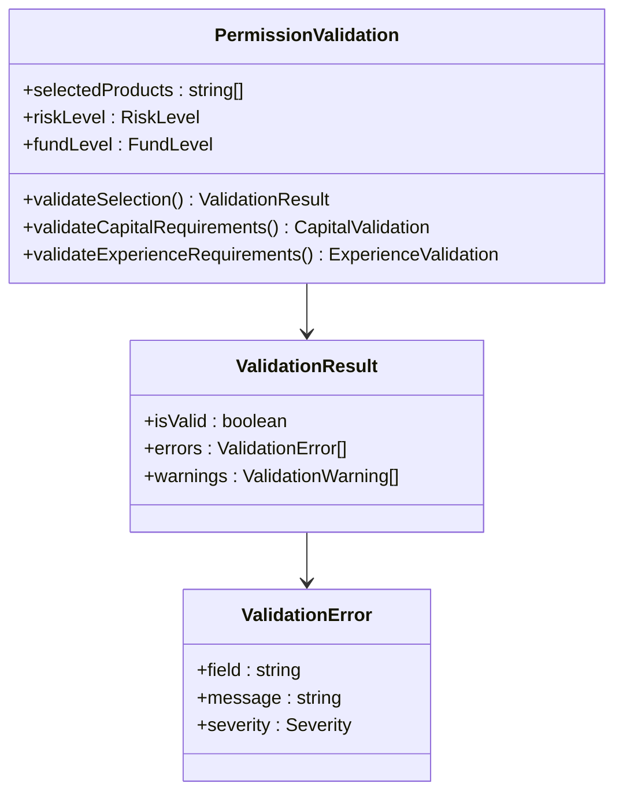
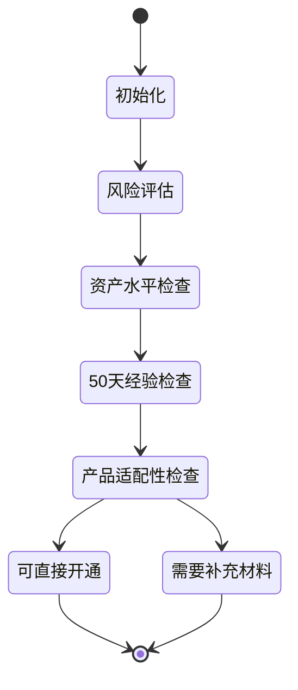
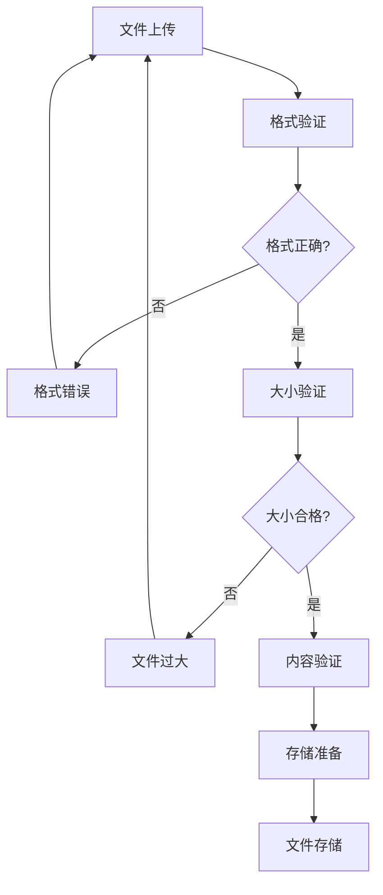
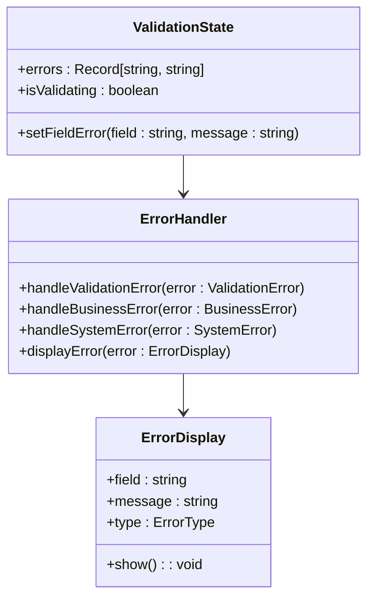
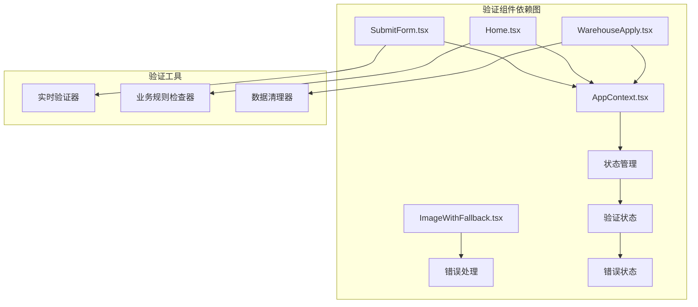

# 数据验证规则

<cite>
**本文档引用的文件**
- [SubmitForm.tsx](file://src/app/pages/SubmitForm.tsx)
- [Home.tsx](file://src/app/pages/Home.tsx)
- [WarehouseApply.tsx](file://src/app/pages/WarehouseApply.tsx)
- [AppContext.tsx](file://src/app/store/AppContext.tsx)
- [ImageWithFallback.tsx](file://src/app/components/figma/ImageWithFallback.tsx)
</cite>

## 目录
1. [简介](#简介)
2. [项目结构](#项目结构)
3. [核心组件](#核心组件)
4. [架构概览](#架构概览)
5. [详细组件分析](#详细组件分析)
6. [依赖关系分析](#依赖关系分析)
7. [性能考虑](#性能考虑)
8. [故障排除指南](#故障排除指南)
9. [结论](#结论)

## 简介

本文档详细阐述了管理平台中的数据验证规则体系，涵盖表单数据验证、业务逻辑验证和数据完整性检查三个方面。系统采用多层次验证策略，在前端界面层、业务逻辑层和数据存储层实施严格的数据质量控制。

验证规则包括实时表单验证、业务规则验证、数据完整性检查、错误处理机制和用户反馈系统。系统支持动态验证规则配置、自定义验证器实现以及数据清理和格式化功能。

## 项目结构

管理平台采用模块化的前端架构，验证逻辑分布在多个关键页面和组件中：

**图表来源**
- [SubmitForm.tsx:1-747](file://src/app/pages/SubmitForm.tsx#L1-L747)
- [Home.tsx:1-809](file://src/app/pages/Home.tsx#L1-L809)
- [WarehouseApply.tsx:1-909](file://src/app/pages/WarehouseApply.tsx#L1-L909)

**章节来源**
- [SubmitForm.tsx:1-747](file://src/app/pages/SubmitForm.tsx#L1-L747)
- [Home.tsx:1-809](file://src/app/pages/Home.tsx#L1-L809)
- [WarehouseApply.tsx:1-909](file://src/app/pages/WarehouseApply.tsx#L1-L909)

## 核心组件

### 验证引擎架构

系统采用基于React Hooks的验证引擎，主要包含以下核心组件：

1. **实时表单验证器** - 基于useMemo的延迟计算验证
2. **业务规则检查器** - 复杂业务场景的逻辑验证
3. **数据完整性检查器** - 结构化数据的完整性验证
4. **错误处理与反馈系统** - 用户友好的错误提示机制

### 验证时机策略

验证系统采用多时机触发策略：

- **即时验证** - 用户输入时实时反馈
- **失焦验证** - 字段失去焦点时触发验证
- **提交验证** - 表单提交时进行全面验证
- **条件验证** - 基于业务状态的动态验证

**章节来源**
- [SubmitForm.tsx:319-380](file://src/app/pages/SubmitForm.tsx#L319-L380)
- [Home.tsx:199-231](file://src/app/pages/Home.tsx#L199-L231)

## 架构概览

### 验证流程架构

**图表来源**
- [WarehouseApply.tsx:319-380](file://src/app/pages/WarehouseApply.tsx#L319-L380)
- [Home.tsx:199-231](file://src/app/pages/Home.tsx#L199-L231)

### 数据流验证

**图表来源**
- [SubmitForm.tsx:115-117](file://src/app/pages/SubmitForm.tsx#L115-L117)
- [WarehouseApply.tsx:319-378](file://src/app/pages/WarehouseApply.tsx#L319-L378)

## 详细组件分析

### 表单数据验证规则

#### 交易权限申请验证

系统对交易权限申请实施严格的表单验证：

**图表来源**
- [SubmitForm.tsx:57-117](file://src/app/pages/SubmitForm.tsx#L57-L117)
- [AppContext.tsx:6-27](file://src/app/store/AppContext.tsx#L6-L27)

验证规则包括：
- **必填字段验证** - 使用星号标记的强制字段
- **金额范围验证** - 资产门槛验证（10万、50万、100万）
- **时间范围验证** - 5个交易日资金记录验证
- **经验要求验证** - 实盘和仿真交易经历验证
- **文件上传验证** - 附件格式和大小验证

#### 移仓业务表单验证

移仓业务申请包含复杂的多步骤验证：

**章节来源**
- [SubmitForm.tsx:375-452](file://src/app/pages/SubmitForm.tsx#L375-L452)
- [WarehouseApply.tsx:319-378](file://src/app/pages/WarehouseApply.tsx#L319-L378)

### 业务逻辑验证规则

#### 适当性匹配验证

系统实施智能的适当性匹配验证：

**图表来源**
- [Home.tsx:175-197](file://src/app/pages/Home.tsx#L175-L197)
- [Home.tsx:208-231](file://src/app/pages/Home.tsx#L208-L231)

验证逻辑包括：
- **C3风险等级限制** - 对R4产品开通的限制
- **资产水平匹配** - 基于资金规模的产品适配
- **经验要求匹配** - 交易经验与产品复杂度匹配
- **历史权限检查** - 已开通权限的重复验证

#### 业务声明验证

系统对业务声明实施强制验证：

**章节来源**
- [Home.tsx:494-568](file://src/app/pages/Home.tsx#L494-L568)
- [Home.tsx:677-682](file://src/app/pages/Home.tsx#L677-L682)

### 数据完整性检查

#### 文件上传完整性检查

系统实施严格的文件上传完整性检查：

**图表来源**
- [Home.tsx:618-666](file://src/app/pages/Home.tsx#L618-L666)

检查项目包括：
- **文件格式验证** - 支持JPG、PNG、PDF格式
- **文件大小限制** - 单个文件不超过10MB
- **文件内容完整性** - 上传文件的可用性检查

#### 图片资源完整性检查

系统提供图片资源的完整性保护：

**章节来源**
- [ImageWithFallback.tsx:1-27](file://src/app/components/figma/ImageWithFallback.tsx#L1-L27)

### 验证错误处理与用户反馈

#### 错误处理机制

系统采用多层次的错误处理机制：

**图表来源**
- [WarehouseApply.tsx:191](file://src/app/pages/WarehouseApply.tsx#L191)
- [WarehouseApply.tsx:382-388](file://src/app/pages/WarehouseApply.tsx#L382-L388)

#### 用户反馈系统

系统提供丰富的用户反馈机制：

**章节来源**
- [SubmitForm.tsx:665-699](file://src/app/pages/SubmitForm.tsx#L665-L699)
- [Home.tsx:689-707](file://src/app/pages/Home.tsx#L689-L707)

## 依赖关系分析

### 组件间依赖关系

**图表来源**
- [AppContext.tsx:31-56](file://src/app/store/AppContext.tsx#L31-L56)
- [SubmitForm.tsx:57-60](file://src/app/pages/SubmitForm.tsx#L57-L60)

### 验证配置管理

系统支持灵活的验证配置管理：

**章节来源**
- [WarehouseApply.tsx:319-378](file://src/app/pages/WarehouseApply.tsx#L319-L378)
- [SubmitForm.tsx:94-106](file://src/app/pages/SubmitForm.tsx#L94-L106)

## 性能考虑

### 验证性能优化

系统采用多种性能优化策略：

1. **延迟计算** - 使用useMemo避免不必要的验证计算
2. **防抖处理** - 对高频输入事件进行防抖处理
3. **增量验证** - 仅对发生变化的字段进行验证
4. **缓存机制** - 缓存验证结果减少重复计算

### 内存管理

验证系统实施有效的内存管理：

- **状态清理** - 组件卸载时清理验证状态
- **事件监听器管理** - 自动清理事件监听器
- **定时器清理** - 清理防抖和节流定时器

## 故障排除指南

### 常见验证问题

#### 表单验证失败

**问题症状**：
- 表单提交按钮禁用
- 字段边框显示红色
- 错误消息弹窗

**解决方案**：
1. 检查必填字段是否已填写
2. 验证数据格式是否正确
3. 确认业务规则是否满足

#### 业务逻辑验证错误

**问题症状**：
- 适当性匹配失败
- 资产门槛不满足
- 经验要求不达标

**解决方案**：
1. 检查账户风险等级
2. 验证资产证明材料
3. 准备交易经验证明

#### 数据完整性检查失败

**问题症状**：
- 文件上传失败
- 图片加载错误
- 数据保存异常

**解决方案**：
1. 检查文件格式和大小
2. 验证网络连接
3. 清理浏览器缓存

**章节来源**
- [ImageWithFallback.tsx:9-26](file://src/app/components/figma/ImageWithFallback.tsx#L9-L26)
- [WarehouseApply.tsx:382-388](file://src/app/pages/WarehouseApply.tsx#L382-L388)

## 结论

管理平台的数据验证系统采用了全面、多层次的验证策略，有效确保了数据质量和用户体验。系统的主要特点包括：

1. **多层次验证** - 从表单级到业务级再到数据级的全方位验证
2. **实时反馈** - 即时的用户反馈和错误提示机制
3. **智能匹配** - 基于适当性的智能产品匹配验证
4. **灵活配置** - 支持动态验证规则配置和自定义验证器
5. **性能优化** - 采用多种技术手段优化验证性能

该验证系统为金融业务的合规性和数据完整性提供了坚实的技术保障，同时保持了良好的用户体验和系统性能。