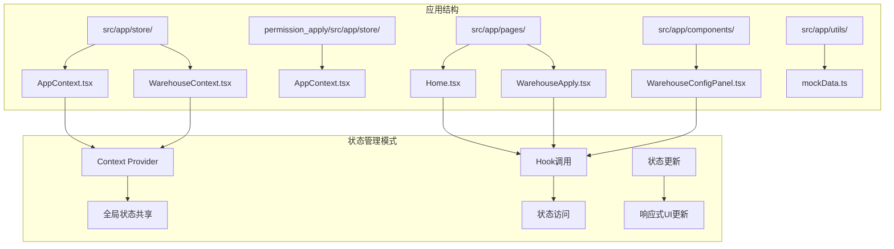
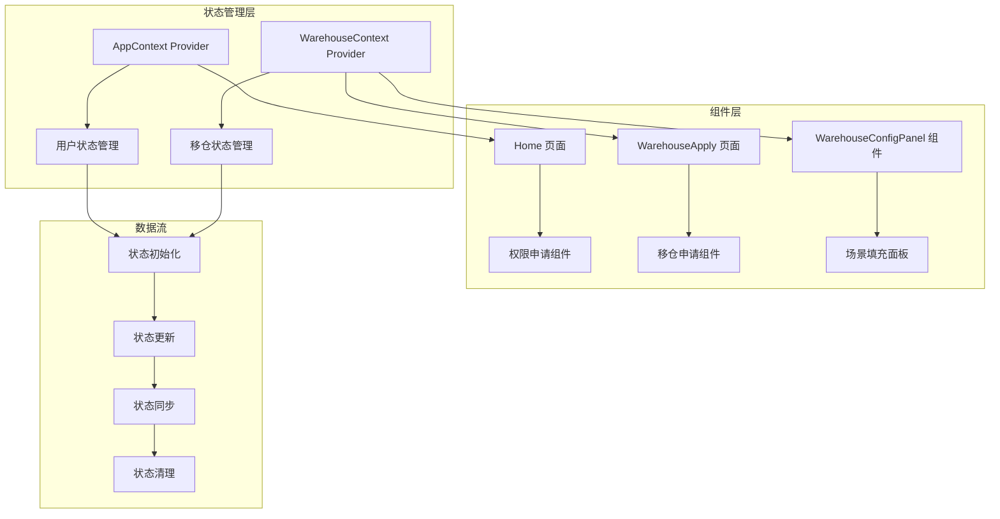
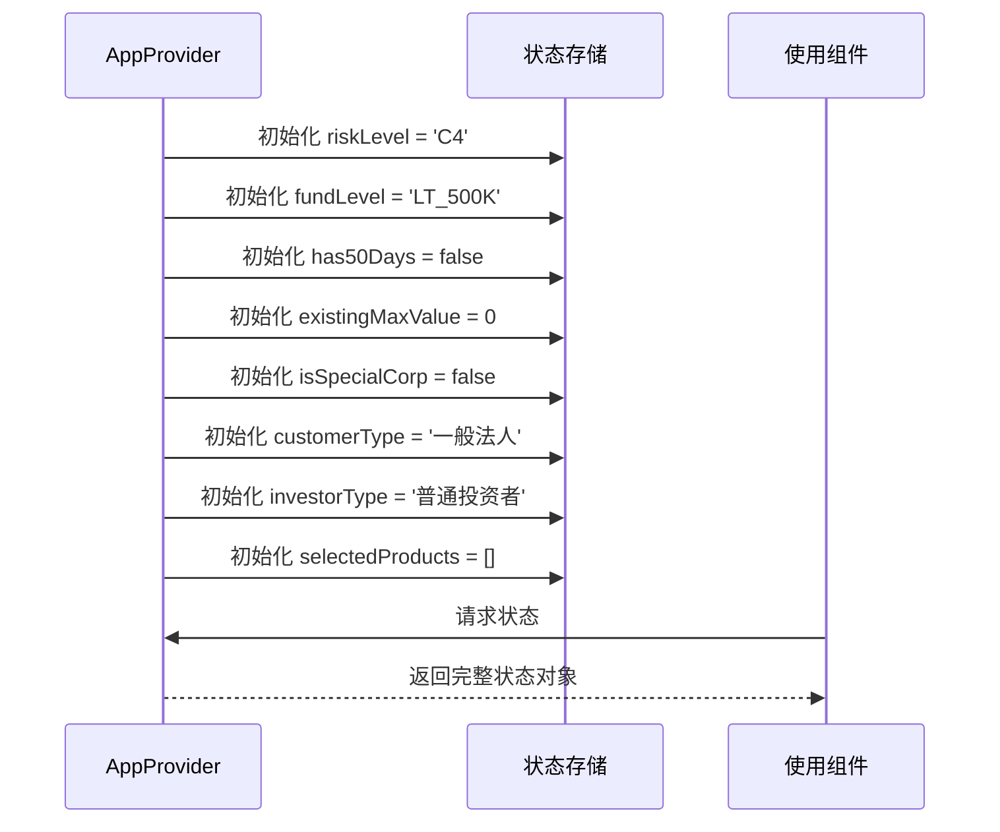
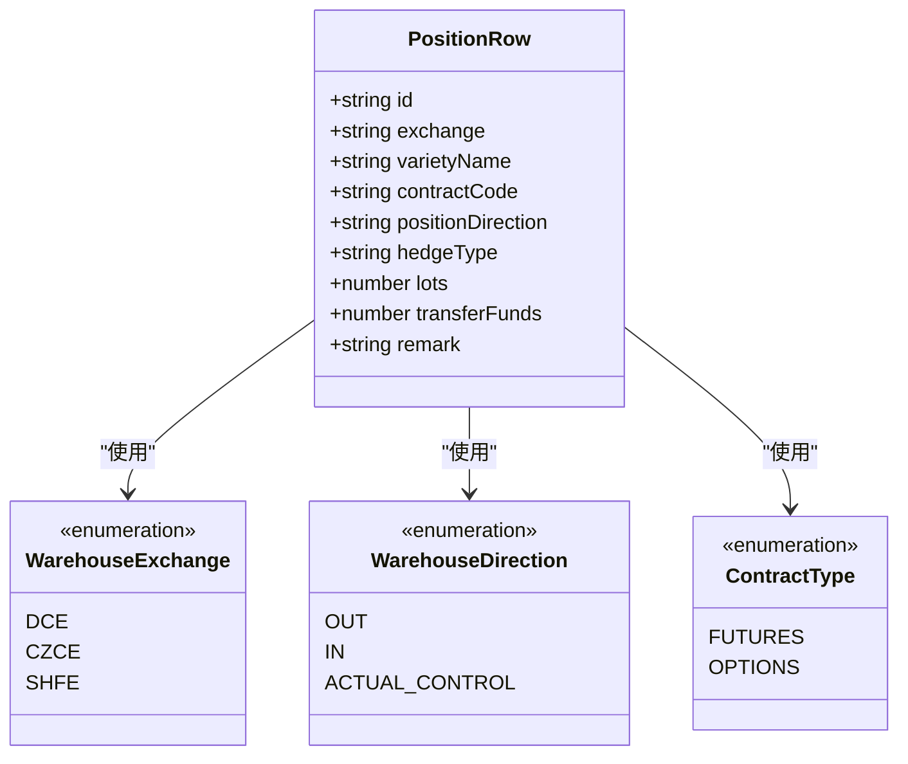
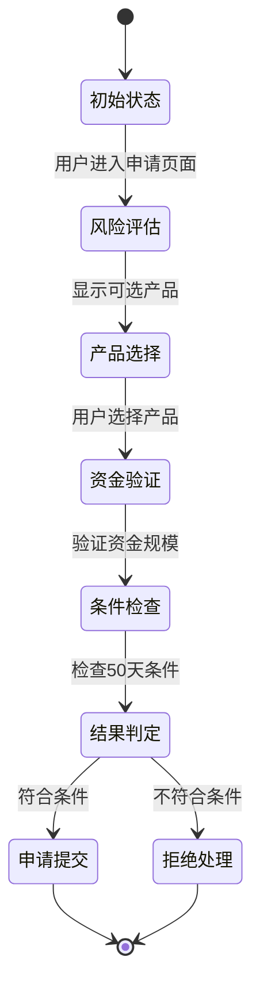
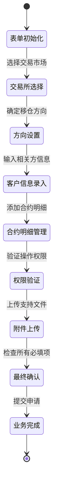
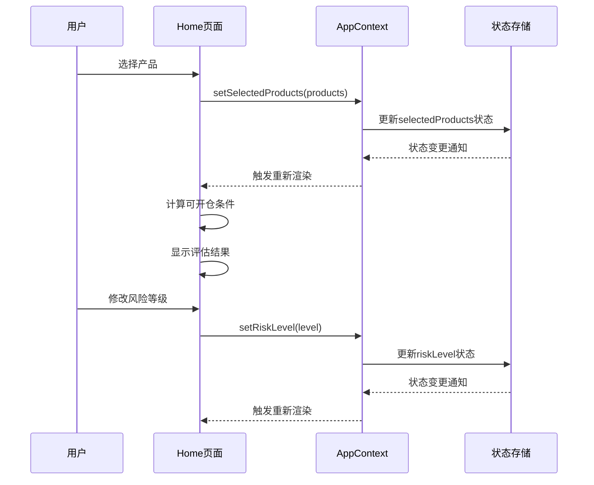
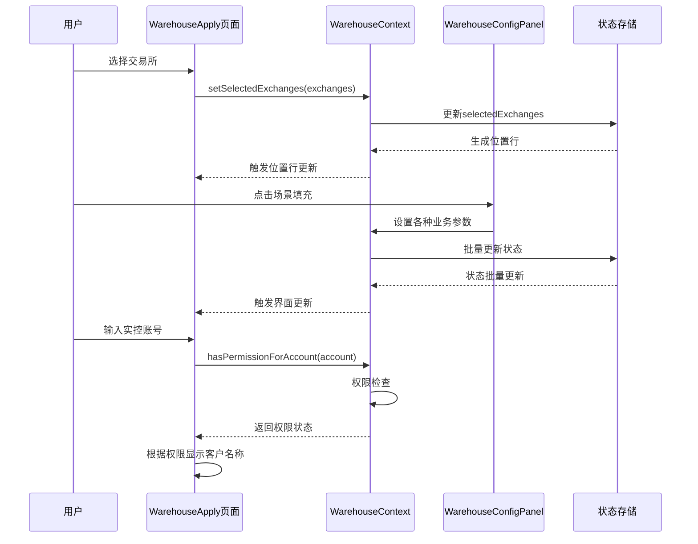
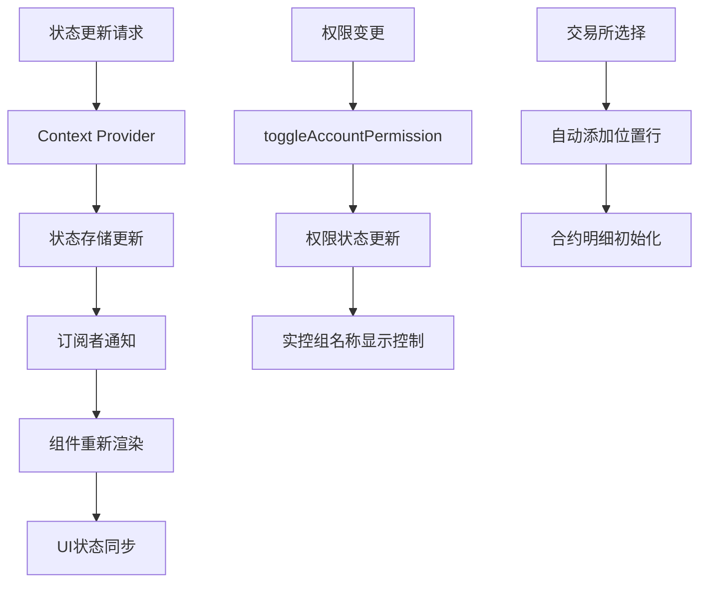
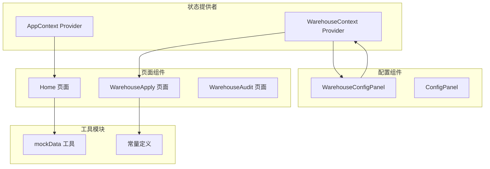

# 状态数据结构

<cite>
**本文档引用的文件**
- [AppContext.tsx](file://src/app/store/AppContext.tsx)
- [WarehouseContext.tsx](file://src/app/store/WarehouseContext.tsx)
- [AppContext.tsx](file://permission_apply/src/app/store/AppContext.tsx)
- [Home.tsx](file://src/app/pages/Home.tsx)
- [WarehouseApply.tsx](file://src/app/pages/WarehouseApply.tsx)
- [WarehouseConfigPanel.tsx](file://src/app/components/WarehouseConfigPanel.tsx)
- [mockData.ts](file://src/app/utils/mockData.ts)
</cite>

## 目录
1. [简介](#简介)
2. [项目结构](#项目结构)
3. [核心组件](#核心组件)
4. [架构概览](#架构概览)
5. [详细组件分析](#详细组件分析)
6. [依赖分析](#依赖分析)
7. [性能考虑](#性能考虑)
8. [故障排除指南](#故障排除指南)
9. [结论](#结论)

## 简介

本文档深入分析了管理平台中的状态数据结构，重点涵盖了AppContext和WarehouseContext两个核心状态管理模块。这两个上下文提供了完整的状态管理解决方案，包括用户风险等级、资金规模、权限选择、移仓业务相关状态等功能。

系统采用React Context模式实现状态管理，通过Provider模式提供全局状态访问能力。每个上下文都包含了完整的状态定义、初始化逻辑、状态更新机制和清理功能。

## 项目结构

管理平台采用模块化架构设计，状态管理分布在两个主要目录中：

**图表来源**
- [AppContext.tsx:1-64](file://src/app/store/AppContext.tsx#L1-L64)
- [WarehouseContext.tsx:1-185](file://src/app/store/WarehouseContext.tsx#L1-L185)

**章节来源**
- [AppContext.tsx:1-64](file://src/app/store/AppContext.tsx#L1-L64)
- [WarehouseContext.tsx:1-185](file://src/app/store/WarehouseContext.tsx#L1-L185)

## 核心组件

### AppContext - 用户权限申请状态管理

AppContext负责管理用户权限申请相关的状态数据，包括风险等级、资金规模、投资类型等核心信息。

### WarehouseContext - 移仓业务状态管理

WarehouseContext专门处理移仓业务的复杂状态管理，涵盖交易所选择、移仓方向、合约详情、权限控制等多个维度。

**章节来源**
- [AppContext.tsx:6-27](file://src/app/store/AppContext.tsx#L6-L27)
- [WarehouseContext.tsx:19-73](file://src/app/store/WarehouseContext.tsx#L19-L73)

## 架构概览

系统采用分层架构设计，通过Context Provider实现状态的集中管理和分发：

**图表来源**
- [AppContext.tsx:31-57](file://src/app/store/AppContext.tsx#L31-L57)
- [WarehouseContext.tsx:77-142](file://src/app/store/WarehouseContext.tsx#L77-L142)

## 详细组件分析

### AppContext 状态结构分析

AppContext定义了完整的用户权限申请状态体系，包含以下核心状态字段：

#### 用户基本信息状态
| 字段名 | 数据类型 | 默认值 | 取值范围 | 描述 |
|--------|----------|--------|----------|------|
| account | string | '85171680' | 任意字符串 | 用户账户标识符 |
| customerType | '一般法人' | '一般法人' | '一般法人' | 客户类型标识 |
| investorType | '普通投资者' \| '专业投资者' | '普通投资者' | '普通投资者', '专业投资者' | 投资者类型 |

#### 风险评估状态
| 字段名 | 数据类型 | 默认值 | 取值范围 | 描述 |
|--------|----------|--------|----------|------|
| riskLevel | RiskLevel | 'C4' | 'C3', 'C4', 'C5' | 用户风险等级 |
| fundLevel | FundLevel | 'LT_500K' | 'LT_500K', 'GE_500K_LT_1M', 'GE_1M' | 资金规模等级 |
| has50Days | boolean | false | true, false | 是否满足50天条件 |
| existingMaxValue | number | 0 | 任意数值 | 现有最大价值 |

#### 产品选择状态
| 字段名 | 数据类型 | 默认值 | 取值范围 | 描述 |
|--------|----------|--------|----------|------|
| selectedProducts | string[] | [] | 数组 | 已选择的产品列表 |
| isSpecialCorp | boolean | false | true, false | 是否为特殊企业 |

#### 状态初始化流程

**图表来源**
- [AppContext.tsx:31-57](file://src/app/store/AppContext.tsx#L31-L57)

**章节来源**
- [AppContext.tsx:3-27](file://src/app/store/AppContext.tsx#L3-L27)
- [AppContext.tsx:31-57](file://src/app/store/AppContext.tsx#L31-L57)

### WarehouseContext 状态结构分析

WarehouseContext提供了复杂的移仓业务状态管理，涵盖多个业务维度：

#### 基础业务信息状态
| 字段名 | 数据类型 | 默认值 | 取值范围 | 描述 |
|--------|----------|--------|----------|------|
| account | string | '85171680' | 任意字符串 | 客户账户 |
| customerName | string | '张三科技有限公司' | 任意字符串 | 客户名称 |
| branch | string | '上海浦东分公司' | 任意字符串 | 分支机构 |
| customerType | string | '一般法人' | 任意字符串 | 客户类型 |

#### 交易所和方向状态
| 字段名 | 数据类型 | 默认值 | 取值范围 | 描述 |
|--------|----------|--------|----------|------|
| selectedExchanges | WarehouseExchange[] | [] | ['DCE','CZCE','SHFE'] | 选中的交易所列表 |
| direction | WarehouseDirection \| '' | '' | 'OUT', 'IN', 'ACTUAL_CONTROL', '' | 移仓方向 |
| contractType | ContractType | 'FUTURES' | 'FUTURES', 'OPTIONS' | 合约类型 |

#### 日期和编号状态
| 字段名 | 数据类型 | 默认值 | 取值范围 | 描述 |
|--------|----------|--------|----------|------|
| transferDate | string | '' | 日期格式字符串 | 移仓日期 |
| outBrokerMemberId | string | '' | 任意字符串 | 移出经纪商会员号 |
| inBrokerMemberId | string | '' | 任意字符串 | 移入经纪商会员号 |

#### 客户信息状态
| 字段名 | 数据类型 | 默认值 | 取值范围 | 描述 |
|--------|----------|--------|----------|------|
| outBrokerName | string | '' | 任意字符串 | 移出经纪商名称 |
| inBrokerName | string | '' | 任意字符串 | 移入经纪商名称 |
| outClientName | Record<WarehouseExchange, string> | {DCE:'',CZCE:'',SHFE:''} | 任意字符串 | 移出客户名称映射 |
| inClientName | string | '' | 任意字符串 | 移入客户名称 |
| actualControlOutAccount | string | '' | 任意字符串 | 实控组移出账号 |
| actualControlInAccount | string | '' | 任意字符串 | 实控组移入账号 |

#### 权限控制状态
| 字段名 | 数据类型 | 默认值 | 取值范围 | 描述 |
|--------|----------|--------|----------|------|
| accountPermissions | Record<string, boolean> | {'85171680':true,...} | 键值对映射 | 账号权限映射 |
| dceTransferByQuantity | 'YES' \| 'NO' \| '' | '' | 'YES', 'NO', '' | 大商所按数量移仓 |

#### 业务数据状态
| 字段名 | 数据类型 | 默认值 | 取值范围 | 描述 |
|--------|----------|--------|----------|------|
| positions | PositionRow[] | [] | 位置行数组 | 合约明细列表 |
| attachments | {name:string,size:string}[] | [] | 文件信息数组 | 附件列表 |
| transferReason | string | '' | 任意字符串 | 移仓原因 |
| remark | string | '' | 任意字符串 | 备注信息 |
| confirmed | boolean | false | true, false | 确认状态 |

#### PositionRow 数据模型

**图表来源**
- [WarehouseContext.tsx:7-17](file://src/app/store/WarehouseContext.tsx#L7-L17)
- [WarehouseContext.tsx:3-5](file://src/app/store/WarehouseContext.tsx#L3-L5)

**章节来源**
- [WarehouseContext.tsx:19-73](file://src/app/store/WarehouseContext.tsx#L19-L73)
- [WarehouseContext.tsx:7-17](file://src/app/store/WarehouseContext.tsx#L7-L17)

### 状态转换流程

#### 风险评估状态转换

#### 移仓业务状态转换

**图表来源**
- [Home.tsx:199-231](file://src/app/pages/Home.tsx#L199-L231)
- [WarehouseApply.tsx:319-359](file://src/app/pages/WarehouseApply.tsx#L319-L359)

**章节来源**
- [Home.tsx:199-231](file://src/app/pages/Home.tsx#L199-L231)
- [WarehouseApply.tsx:319-359](file://src/app/pages/WarehouseApply.tsx#L319-L359)

### 状态更新流程

#### 权限申请状态更新

#### 移仓申请状态更新

**图表来源**
- [Home.tsx:128-155](file://src/app/pages/Home.tsx#L128-L155)
- [WarehouseApply.tsx:198-219](file://src/app/pages/WarehouseApply.tsx#L198-L219)
- [WarehouseConfigPanel.tsx:14-112](file://src/app/components/WarehouseConfigPanel.tsx#L14-L112)

**章节来源**
- [Home.tsx:128-155](file://src/app/pages/Home.tsx#L128-L155)
- [WarehouseApply.tsx:198-219](file://src/app/pages/WarehouseApply.tsx#L198-L219)
- [WarehouseConfigPanel.tsx:14-112](file://src/app/components/WarehouseConfigPanel.tsx#L14-L112)

### 状态初始化、同步和清理

#### 状态初始化机制
AppContext和WarehouseContext都实现了完整的状态初始化逻辑：

**AppContext初始化特点：**
- 预设默认风险等级为'C4'
- 资金规模默认为'LT_500K'
- 投资者类型默认为'普通投资者'
- 提供selectedProducts的空数组初始化

**WarehouseContext初始化特点：**
- 预设多个默认业务参数
- 初始化实控组权限映射
- 设置合约类型默认值
- 提供空的位置行列表

#### 状态同步机制
系统通过React Context的订阅机制实现状态同步：

#### 状态清理机制
WarehouseContext提供了完整的状态清理功能：

**重置功能包括：**
- 清空交易所选择
- 重置移仓方向
- 清空业务参数
- 重置权限状态
- 清空附件列表
- 重置确认状态

**章节来源**
- [AppContext.tsx:31-57](file://src/app/store/AppContext.tsx#L31-L57)
- [WarehouseContext.tsx:77-142](file://src/app/store/WarehouseContext.tsx#L77-L142)
- [WarehouseContext.tsx:112-142](file://src/app/store/WarehouseContext.tsx#L112-L142)

## 依赖分析

### 组件间依赖关系

**图表来源**
- [Home.tsx:60-64](file://src/app/pages/Home.tsx#L60-L64)
- [WarehouseApply.tsx:186-187](file://src/app/pages/WarehouseApply.tsx#L186-L187)
- [WarehouseConfigPanel.tsx:1-204](file://src/app/components/WarehouseConfigPanel.tsx#L1-L204)

### 状态依赖关系

| 组件 | 依赖的状态 | 用途 |
|------|------------|------|
| Home 页面 | riskLevel, fundLevel, has50Days, selectedProducts | 权限申请流程控制 |
| WarehouseApply 页面 | selectedExchanges, direction, positions, accountPermissions | 移仓申请业务逻辑 |
| WarehouseConfigPanel | 所有WarehouseContext状态 | 场景填充和权限管理 |
| mockData 工具 | MOCK_REASONS | 业务原因配置 |

**章节来源**
- [Home.tsx:60-64](file://src/app/pages/Home.tsx#L60-L64)
- [WarehouseApply.tsx:186-187](file://src/app/pages/WarehouseApply.tsx#L186-L187)
- [WarehouseConfigPanel.tsx:1-204](file://src/app/components/WarehouseConfigPanel.tsx#L1-L204)

## 性能考虑

### 状态更新优化
- 使用React.memo避免不必要的重渲染
- 合理拆分状态以减少无关更新
- 使用useMemo缓存计算结果

### 内存管理
- 及时清理临时状态和事件监听器
- 避免在状态中存储大型对象
- 合理使用引用类型状态

### 渲染性能
- 将重型计算移到Web Worker
- 使用虚拟滚动处理大量数据
- 实现懒加载和分页

## 故障排除指南

### 常见问题诊断

**状态不更新问题：**
1. 检查Context Provider是否正确包裹组件
2. 验证状态更新函数是否正确传递
3. 确认状态更新是否在正确的生命周期中执行

**权限验证失败：**
1. 检查accountPermissions映射是否正确
2. 验证实控组账号数据库是否存在
3. 确认权限切换逻辑是否正常工作

**移仓数据异常：**
1. 验证PositionRow数据结构完整性
2. 检查交易所选择与合约类型的匹配
3. 确认权限验证与UI显示的一致性

**章节来源**
- [WarehouseApply.tsx:198-219](file://src/app/pages/WarehouseApply.tsx#L198-L219)
- [WarehouseConfigPanel.tsx:144-196](file://src/app/components/WarehouseConfigPanel.tsx#L144-L196)

## 结论

本状态管理系统通过AppContext和WarehouseContext两个核心模块，实现了完整的业务状态管理解决方案。系统具有以下特点：

1. **模块化设计**：清晰分离用户权限申请和移仓业务两大功能域
2. **类型安全**：使用TypeScript枚举确保状态值的有效性
3. **响应式更新**：基于React Context实现状态的自动同步
4. **扩展性强**：支持业务规则的灵活配置和状态的动态扩展
5. **用户体验**：提供完整的状态初始化、更新和清理机制

该系统为管理平台提供了稳定可靠的状态管理基础，能够有效支撑复杂的金融业务场景。