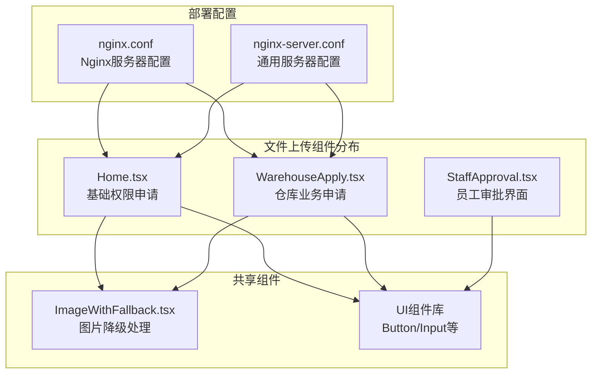
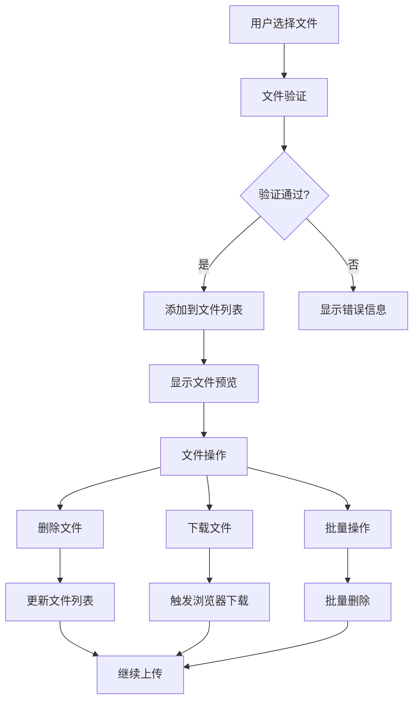
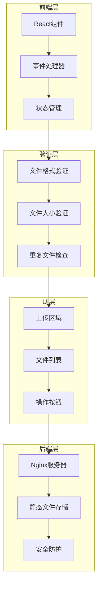
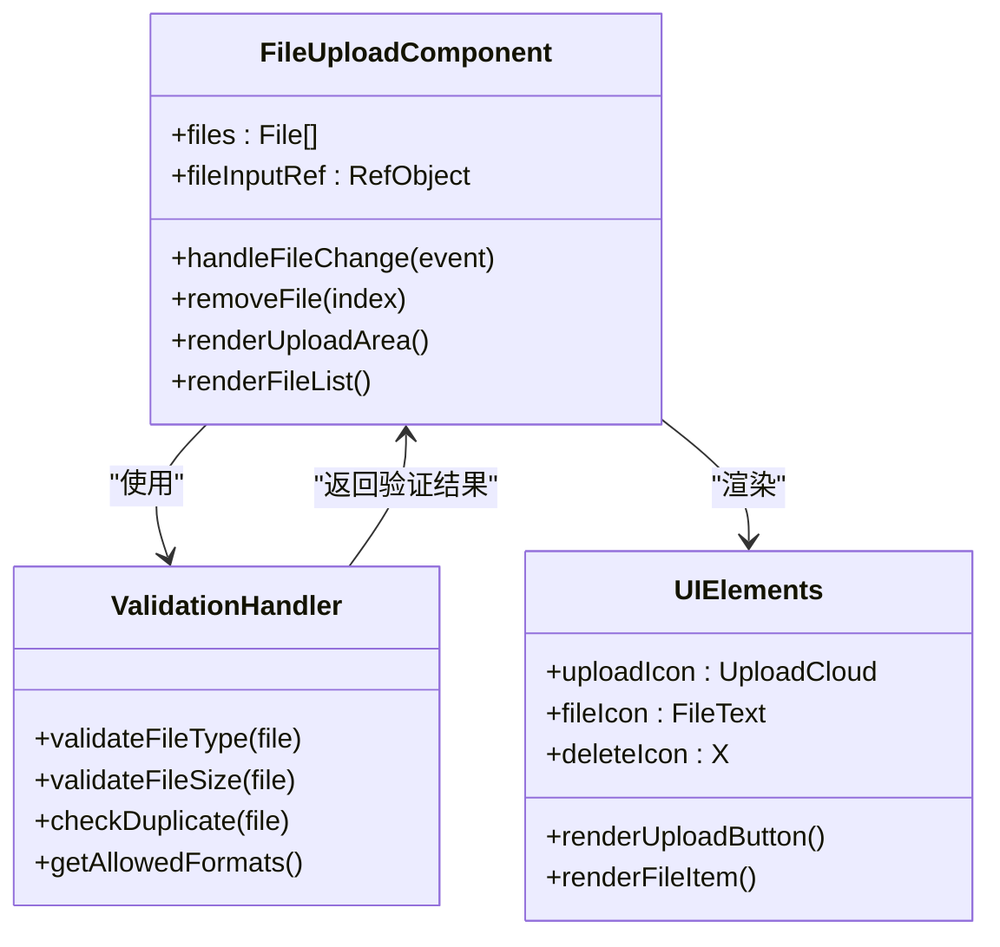
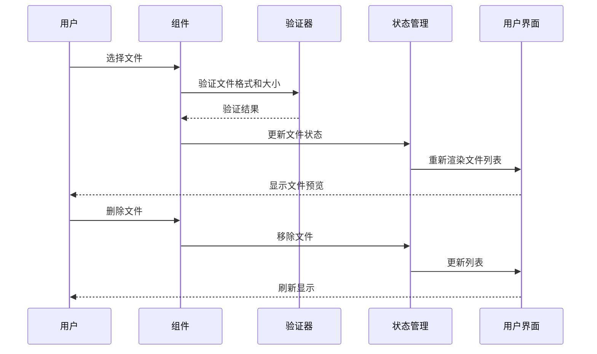
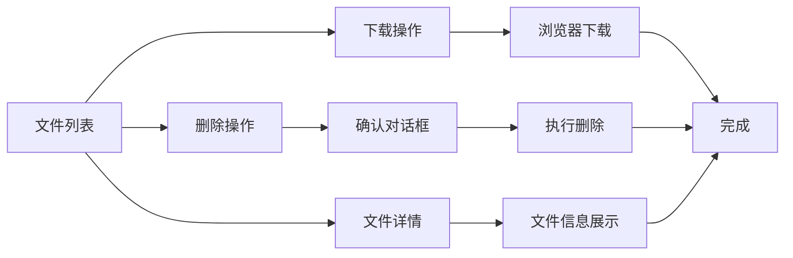
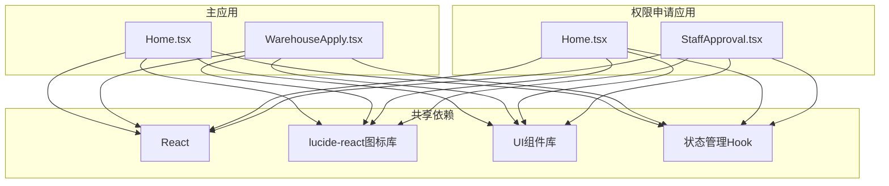
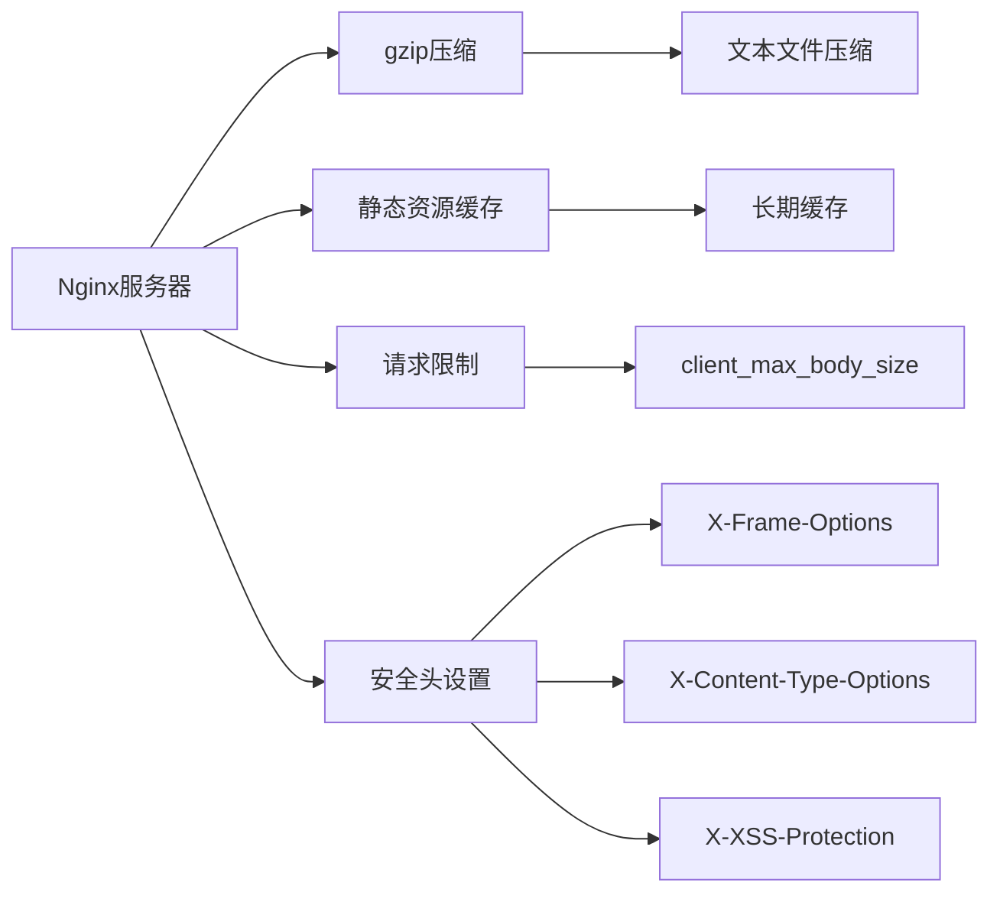
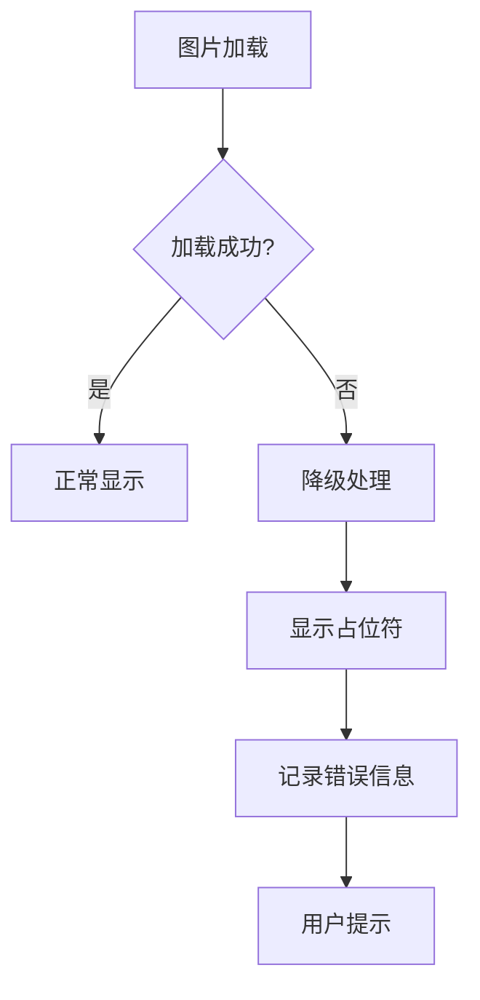

# 文件上传处理

<cite>
**本文档引用的文件**
- [Home.tsx](file://src/app/pages/Home.tsx)
- [Home.tsx](file://permission_apply/src/app/pages/Home.tsx)
- [WarehouseApply.tsx](file://src/app/pages/WarehouseApply.tsx)
- [StaffApproval.tsx](file://permission_apply/src/app/pages/StaffApproval.tsx)
- [nginx.conf](file://deploy/nginx.conf)
- [nginx-server.conf](file://deploy/nginx-server.conf)
- [ImageWithFallback.tsx](file://src/app/components/figma/ImageWithFallback.tsx)
- [ImageWithFallback.tsx](file://permission_apply/src/app/components/figma/ImageWithFallback.tsx)
</cite>

## 目录
1. [简介](#简介)
2. [项目结构](#项目结构)
3. [核心组件](#核心组件)
4. [架构概览](#架构概览)
5. [详细组件分析](#详细组件分析)
6. [依赖分析](#依赖分析)
7. [性能考虑](#性能考虑)
8. [故障排除指南](#故障排除指南)
9. [结论](#结论)
10. [附录](#附录)

## 简介

本文档深入分析了管理平台中的文件上传处理系统，涵盖前端上传组件设计、文件格式验证、预览和删除功能实现。详细说明了错误处理机制、进度显示、安全性考虑和性能优化策略，并提供了文件上传流程图和安全最佳实践。

该系统支持多种文件格式（JPG、PNG、PDF、DOC），单个文件大小限制为10MB，采用多文件上传模式。系统集成了完整的文件管理功能，包括文件预览、删除、下载和批量操作。

## 项目结构

文件上传功能主要分布在以下三个页面组件中：

**图表来源**
- [Home.tsx:607-669](file://src/app/pages/Home.tsx#L607-L669)
- [WarehouseApply.tsx:783-825](file://src/app/pages/WarehouseApply.tsx#L783-L825)
- [StaffApproval.tsx:336-391](file://permission_apply/src/app/pages/StaffApproval.tsx#L336-L391)

**章节来源**
- [Home.tsx:607-669](file://src/app/pages/Home.tsx#L607-L669)
- [WarehouseApply.tsx:783-825](file://src/app/pages/WarehouseApply.tsx#L783-L825)
- [StaffApproval.tsx:336-391](file://permission_apply/src/app/pages/StaffApproval.tsx#L336-L391)

## 核心组件

### 文件上传区域组件

每个页面都实现了相似的文件上传区域组件，具有以下共同特性：

- **拖拽支持**：用户可以点击或拖拽文件到上传区域
- **多文件选择**：支持同时选择多个文件
- **格式限制**：根据页面需求限制文件类型
- **大小限制**：单个文件不超过10MB
- **实时预览**：上传后立即显示文件列表

### 文件管理功能

系统提供了完整的文件管理功能：

**图表来源**
- [Home.tsx:157-166](file://src/app/pages/Home.tsx#L157-L166)
- [WarehouseApply.tsx:308-317](file://src/app/pages/WarehouseApply.tsx#L308-L317)

**章节来源**
- [Home.tsx:157-166](file://src/app/pages/Home.tsx#L157-L166)
- [WarehouseApply.tsx:308-317](file://src/app/pages/WarehouseApply.tsx#L308-L317)

## 架构概览

文件上传系统的整体架构采用分层设计：

**图表来源**
- [Home.tsx:629-644](file://src/app/pages/Home.tsx#L629-L644)
- [WarehouseApply.tsx:785-800](file://src/app/pages/WarehouseApply.tsx#L785-L800)
- [nginx.conf:47-54](file://deploy/nginx.conf#L47-L54)

## 详细组件分析

### 基础权限申请页面文件上传

该页面实现了最基础的文件上传功能：

**图表来源**
- [Home.tsx:84-90](file://src/app/pages/Home.tsx#L84-L90)
- [Home.tsx:157-166](file://src/app/pages/Home.tsx#L157-L166)

#### 关键实现细节

1. **文件状态管理**：使用React的useState钩子管理文件数组状态
2. **事件处理**：通过onChange事件监听文件选择
3. **文件验证**：在添加文件时进行格式和大小验证
4. **UI渲染**：动态渲染上传区域和文件列表

**章节来源**
- [Home.tsx:84-90](file://src/app/pages/Home.tsx#L84-L90)
- [Home.tsx:157-166](file://src/app/pages/Home.tsx#L157-L166)

### 仓库业务申请页面文件上传

该页面提供了更丰富的文件上传功能：

**图表来源**
- [WarehouseApply.tsx:308-317](file://src/app/pages/WarehouseApply.tsx#L308-L317)
- [WarehouseApply.tsx:315-317](file://src/app/pages/WarehouseApply.tsx#L315-L317)

#### 高级功能特性

1. **上下文集成**：与WarehouseContext集成，支持复杂的状态管理
2. **批量操作**：支持批量文件上传和管理
3. **格式扩展**：支持JPG、PNG、PDF、DOC等多种格式
4. **实时更新**：文件状态变化时即时反映在UI上

**章节来源**
- [WarehouseApply.tsx:308-317](file://src/app/pages/WarehouseApply.tsx#L308-L317)
- [WarehouseApply.tsx:315-317](file://src/app/pages/WarehouseApply.tsx#L315-L317)

### 员工审批界面文件管理

该界面专注于文件的查看、下载和删除操作：

**图表来源**
- [StaffApproval.tsx:366-385](file://permission_apply/src/app/pages/StaffApproval.tsx#L366-L385)

#### 审批场景专用功能

1. **只读模式**：在审批视图中文件通常为只读状态
2. **权限控制**：根据用户角色控制文件操作权限
3. **批量下载**：支持批量文件下载功能
4. **文件追踪**：显示文件上传者和上传时间信息

**章节来源**
- [StaffApproval.tsx:366-385](file://permission_apply/src/app/pages/StaffApproval.tsx#L366-L385)

## 依赖分析

### 组件间依赖关系

**图表来源**
- [Home.tsx:1-16](file://src/app/pages/Home.tsx#L1-L16)
- [WarehouseApply.tsx:1-30](file://src/app/pages/WarehouseApply.tsx#L1-L30)

### 第三方库依赖

系统主要依赖以下第三方库：

1. **React生态系统**：用于构建用户界面和状态管理
2. **lucide-react**：提供现代化的SVG图标
3. **UI组件库**：提供一致的用户体验和样式
4. **文件处理工具**：支持文件格式验证和大小检查

**章节来源**
- [Home.tsx:1-16](file://src/app/pages/Home.tsx#L1-L16)
- [WarehouseApply.tsx:1-30](file://src/app/pages/WarehouseApply.tsx#L1-L30)

## 性能考虑

### 前端性能优化

1. **虚拟化列表**：对于大量文件的情况，考虑使用虚拟化列表减少DOM节点数量
2. **懒加载**：图片文件采用懒加载策略，提升初始渲染性能
3. **内存管理**：及时清理文件对象引用，避免内存泄漏
4. **防抖处理**：对频繁的文件操作进行防抖处理

### 后端性能配置

Nginx服务器配置了多项性能优化措施：

**图表来源**
- [nginx.conf:18-25](file://deploy/nginx.conf#L18-L25)
- [nginx.conf:26-31](file://deploy/nginx.conf#L26-L31)
- [nginx.conf:47-54](file://deploy/nginx.conf#L47-L54)

**章节来源**
- [nginx.conf:18-25](file://deploy/nginx.conf#L18-L25)
- [nginx.conf:26-31](file://deploy/nginx.conf#L26-L31)
- [nginx.conf:47-54](file://deploy/nginx.conf#L47-L54)

## 故障排除指南

### 常见问题及解决方案

#### 文件上传失败

1. **文件格式不支持**
   - 检查文件扩展名是否在允许列表中
   - 确认文件内容与扩展名匹配

2. **文件大小超限**
   - 单个文件不得超过10MB
   - 检查Nginx配置中的client_max_body_size设置

3. **网络连接问题**
   - 检查网络连接稳定性
   - 考虑增加超时时间配置

#### 图片显示异常

系统集成了图片降级处理机制：

**图表来源**
- [ImageWithFallback.tsx:6-27](file://src/app/components/figma/ImageWithFallback.tsx#L6-L27)

**章节来源**
- [ImageWithFallback.tsx:6-27](file://src/app/components/figma/ImageWithFallback.tsx#L6-L27)
- [ImageWithFallback.tsx:6-27](file://permission_apply/src/app/components/figma/ImageWithFallback.tsx#L6-L27)

### 调试技巧

1. **浏览器开发者工具**：监控网络请求和响应
2. **控制台日志**：添加详细的错误日志输出
3. **文件大小监控**：实时显示文件大小和上传进度
4. **状态检查**：定期检查文件状态和组件状态

## 结论

该文件上传处理系统采用了模块化设计，具有以下优势：

1. **一致性**：三个页面实现了相似的上传体验
2. **可扩展性**：支持多种文件格式和自定义验证规则
3. **安全性**：内置文件类型和大小验证
4. **性能优化**：合理的前后端配置和组件设计

系统目前支持基础的文件上传、预览和删除功能，为后续的大文件处理、断点续传和批量上传等功能奠定了良好的基础。

## 附录

### 安全最佳实践

1. **文件类型验证**：客户端和服务端双重验证
2. **大小限制**：合理设置文件大小上限
3. **路径遍历防护**：防止恶意文件路径
4. **内容安全策略**：实施严格的CSP策略
5. **访问控制**：基于用户角色的文件访问权限

### 未来改进方向

1. **大文件支持**：实现分块上传和断点续传
2. **进度显示**：提供详细的上传进度反馈
3. **批量操作**：增强批量文件管理和操作能力
4. **文件预览**：支持更多文件类型的在线预览
5. **版本管理**：实现文件版本控制和历史记录