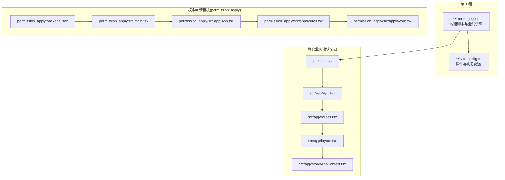
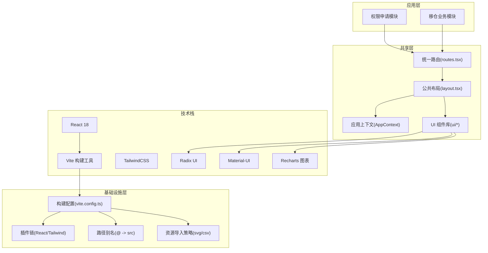
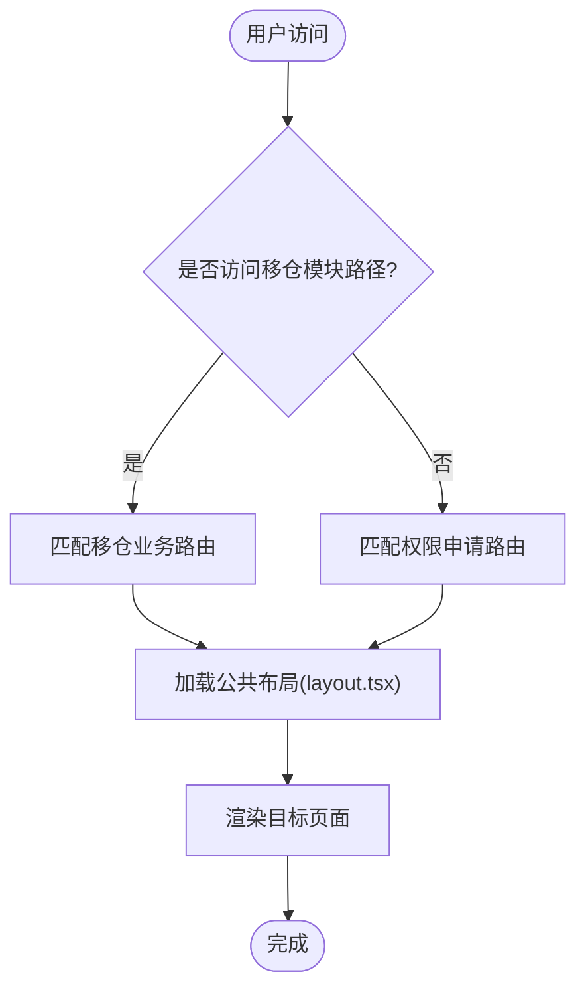
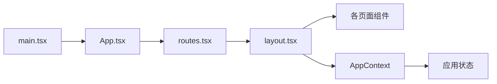

# 整体架构概览

<cite>
**本文档引用的文件**
- [package.json](file://package.json)
- [permission_apply/package.json](file://permission_apply/package.json)
- [vite.config.ts](file://vite.config.ts)
- [permission_apply/vite.config.ts](file://permission_apply/vite.config.ts)
- [src/main.tsx](file://src/main.tsx)
- [permission_apply/src/main.tsx](file://permission_apply/src/main.tsx)
- [src/app/App.tsx](file://src/app/App.tsx)
- [permission_apply/src/app/App.tsx](file://permission_apply/src/app/App.tsx)
- [src/app/routes.tsx](file://src/app/routes.tsx)
- [permission_apply/src/app/routes.tsx](file://permission_apply/src/app/routes.tsx)
- [src/app/layout.tsx](file://src/app/layout.tsx)
- [permission_apply/src/app/layout.tsx](file://permission_apply/src/app/layout.tsx)
- [src/app/store/AppContext.tsx](file://src/app/store/AppContext.tsx)
</cite>

## 目录
1. [引言](#引言)
2. [项目结构](#项目结构)
3. [核心组件](#核心组件)
4. [架构总览](#架构总览)
5. [详细组件分析](#详细组件分析)
6. [依赖关系分析](#依赖关系分析)
7. [性能考量](#性能考量)
8. [故障排除指南](#故障排除指南)
9. [结论](#结论)
10. [附录](#附录)

## 引言
本管理平台采用双模块架构：权限申请模块与移仓业务模块，二者共享统一的前端基础设施与UI体系，通过路由与布局进行功能域隔离。系统以React 18 + Vite为技术基石，结合Radix UI、Material-UI、Recharts等生态组件，构建高可用、可扩展的企业级管理界面。

## 项目结构
项目采用多包/多入口的组织方式：
- 根目录提供统一的构建配置与依赖，负责打包与部署脚本
- permission_apply 子工程专注于“交易权限申请”功能域
- src 子工程承载“移仓业务”与“交易权限申请”的公共能力，并在路由中实现模块化边界

图表来源
- [package.json:1-91](file://package.json#L1-L91)
- [vite.config.ts:1-37](file://vite.config.ts#L1-L37)
- [permission_apply/package.json:1-90](file://permission_apply/package.json#L1-L90)
- [permission_apply/src/main.tsx:1-7](file://permission_apply/src/main.tsx#L1-L7)
- [permission_apply/src/app/App.tsx:1-6](file://permission_apply/src/app/App.tsx#L1-L6)
- [permission_apply/src/app/routes.tsx:1-27](file://permission_apply/src/app/routes.tsx#L1-L27)
- [permission_apply/src/app/layout.tsx:1-87](file://permission_apply/src/app/layout.tsx#L1-L87)
- [src/main.tsx:1-7](file://src/main.tsx#L1-L7)
- [src/app/App.tsx:1-6](file://src/app/App.tsx#L1-L6)
- [src/app/routes.tsx:1-38](file://src/app/routes.tsx#L1-L38)
- [src/app/layout.tsx:1-175](file://src/app/layout.tsx#L1-L175)
- [src/app/store/AppContext.tsx:1-64](file://src/app/store/AppContext.tsx#L1-L64)

章节来源
- [package.json:1-91](file://package.json#L1-L91)
- [permission_apply/package.json:1-90](file://permission_apply/package.json#L1-L90)
- [vite.config.ts:1-37](file://vite.config.ts#L1-L37)
- [permission_apply/vite.config.ts:1-37](file://permission_apply/vite.config.ts#L1-L37)
- [src/main.tsx:1-7](file://src/main.tsx#L1-L7)
- [permission_apply/src/main.tsx:1-7](file://permission_apply/src/main.tsx#L1-L7)
- [src/app/App.tsx:1-6](file://src/app/App.tsx#L1-L6)
- [permission_apply/src/app/App.tsx:1-6](file://permission_apply/src/app/App.tsx#L1-L6)
- [src/app/routes.tsx:1-38](file://src/app/routes.tsx#L1-L38)
- [permission_apply/src/app/routes.tsx:1-27](file://permission_apply/src/app/routes.tsx#L1-L27)
- [src/app/layout.tsx:1-175](file://src/app/layout.tsx#L1-L175)
- [permission_apply/src/app/layout.tsx:1-87](file://permission_apply/src/app/layout.tsx#L1-L87)
- [src/app/store/AppContext.tsx:1-64](file://src/app/store/AppContext.tsx#L1-L64)

## 核心组件
- 应用入口与渲染
  - 权限申请模块与移仓模块均通过各自的 main.tsx 创建根节点并挂载 App 组件
  - App 组件使用 RouterProvider 挂载统一的路由配置，实现页面级导航
- 路由与页面
  - 权限申请模块：定义首页、申请列表、审批详情、系统设置等路由
  - 移仓业务模块：在权限路由基础上新增仓库相关页面，形成更广的功能域
- 布局与导航
  - 共享侧边栏与面包屑逻辑，按路径区分“交易权限申请”与“移仓业务申请”
  - 支持跨模块的系统设置入口，保证统一的运维与配置体验
- 状态管理
  - 提供 AppContext 作为应用状态容器，集中管理风险等级、资金规模、产品选择等关键状态

章节来源
- [src/main.tsx:1-7](file://src/main.tsx#L1-L7)
- [permission_apply/src/main.tsx:1-7](file://permission_apply/src/main.tsx#L1-L7)
- [src/app/App.tsx:1-6](file://src/app/App.tsx#L1-L6)
- [permission_apply/src/app/App.tsx:1-6](file://permission_apply/src/app/App.tsx#L1-L6)
- [src/app/routes.tsx:1-38](file://src/app/routes.tsx#L1-L38)
- [permission_apply/src/app/routes.tsx:1-27](file://permission_apply/src/app/routes.tsx#L1-L27)
- [src/app/layout.tsx:1-175](file://src/app/layout.tsx#L1-L175)
- [permission_apply/src/app/layout.tsx:1-87](file://permission_apply/src/app/layout.tsx#L1-L87)
- [src/app/store/AppContext.tsx:1-64](file://src/app/store/AppContext.tsx#L1-L64)

## 架构总览
系统采用“双模块 + 公共基础设施”的分层设计：
- 技术栈层：React 18、Vite、TailwindCSS、Radix UI、Material-UI、Recharts
- 应用层：权限申请模块与移仓业务模块，分别拥有独立的路由与页面集合
- 基础设施层：统一的构建配置、插件链、别名与资源导入策略
- 共享层：公共布局、主题、通知、上下文与UI组件库

图表来源
- [package.json:11-77](file://package.json#L11-L77)
- [vite.config.ts:19-36](file://vite.config.ts#L19-L36)
- [permission_apply/vite.config.ts:19-36](file://permission_apply/vite.config.ts#L19-L36)
- [src/app/routes.tsx:1-38](file://src/app/routes.tsx#L1-L38)
- [permission_apply/src/app/routes.tsx:1-27](file://permission_apply/src/app/routes.tsx#L1-L27)
- [src/app/layout.tsx:1-175](file://src/app/layout.tsx#L1-L175)
- [permission_apply/src/app/layout.tsx:1-87](file://permission_apply/src/app/layout.tsx#L1-L87)
- [src/app/store/AppContext.tsx:1-64](file://src/app/store/AppContext.tsx#L1-L64)

## 详细组件分析

### 双模块架构设计与实现
- 设计思路
  - 功能域隔离：权限申请与移仓业务分别对应独立的路由空间，避免交叉污染
  - 边界清晰：通过路由前缀与侧边栏分组明确区分模块边界
  - 复用最大化：共享布局、主题、通知与上下文，降低重复开发成本
- 实现方式
  - 权限申请模块：提供“首页、申请列表、审批详情、系统设置”等路由
  - 移仓业务模块：在权限路由基础上新增“仓库申请、列表、详情、审核、流水”等路由
  - 共享布局：统一侧边栏导航、面包屑与系统设置入口

图表来源
- [src/app/routes.tsx:18-38](file://src/app/routes.tsx#L18-L38)
- [permission_apply/src/app/routes.tsx:12-27](file://permission_apply/src/app/routes.tsx#L12-L27)
- [src/app/layout.tsx:39-55](file://src/app/layout.tsx#L39-L55)

章节来源
- [src/app/routes.tsx:1-38](file://src/app/routes.tsx#L1-L38)
- [permission_apply/src/app/routes.tsx:1-27](file://permission_apply/src/app/routes.tsx#L1-L27)
- [src/app/layout.tsx:21-55](file://src/app/layout.tsx#L21-L55)

### 组件化架构优势
- 可维护性：页面与组件解耦，便于独立演进与测试
- 可复用性：UI组件库与上下文在模块间共享，减少重复实现
- 可扩展性：新增页面仅需在对应路由中注册，不影响其他模块
- 可观测性：统一的通知与主题体系提升用户体验一致性

章节来源
- [src/app/layout.tsx:1-175](file://src/app/layout.tsx#L1-L175)
- [src/app/store/AppContext.tsx:1-64](file://src/app/store/AppContext.tsx#L1-L64)

### 技术栈整合方案
- 构建与开发
  - Vite 提供快速冷启动与热更新；React 插件与 Tailwind 插件确保开发体验
  - 路径别名 @ 指向 src，简化导入路径
- UI 与交互
  - Radix UI 与 Material-UI 提供基础控件与高级组件
  - Recharts 用于数据可视化
- 状态与通知
  - AppContext 集中管理应用状态
  - Sonner 提供全局通知

章节来源
- [vite.config.ts:19-36](file://vite.config.ts#L19-L36)
- [package.json:11-77](file://package.json#L11-L77)
- [src/app/store/AppContext.tsx:1-64](file://src/app/store/AppContext.tsx#L1-L64)
- [src/app/layout.tsx:7-7](file://src/app/layout.tsx#L7-L7)

### 系统边界划分与职责分离
- 权限申请模块
  - 职责：交易权限申请、审批流程、材料补充、系统设置
  - 页面：首页、申请列表、详情、审批列表、系统设置
- 移仓业务模块
  - 职责：仓库申请、审批、查询与审计流水
  - 页面：仓库申请、列表、详情、审核、流水
- 共享层
  - 职责：统一布局、导航、主题、通知、上下文与UI组件

章节来源
- [permission_apply/src/app/routes.tsx:12-27](file://permission_apply/src/app/routes.tsx#L12-L27)
- [src/app/routes.tsx:18-38](file://src/app/routes.tsx#L18-L38)
- [src/app/layout.tsx:21-55](file://src/app/layout.tsx#L21-L55)

### 架构决策的技术权衡
- 技术选型
  - React 18：并发特性与自动批处理提升性能与开发效率
  - Vite：更快的冷启与热更新，适合多模块开发
  - Radix UI/Material-UI：兼顾可访问性与视觉一致性
- 权衡点
  - 统一与隔离：双模块共享基础设施，但通过路由与布局实现功能域隔离
  - 性能与复杂度：组件化与上下文提升了可维护性，需注意状态膨胀与渲染优化
  - 扩展性：模块化路由便于新增页面，但需保持共享层契约稳定

章节来源
- [package.json:11-77](file://package.json#L11-L77)
- [vite.config.ts:19-36](file://vite.config.ts#L19-L36)
- [src/app/layout.tsx:1-175](file://src/app/layout.tsx#L1-L175)

## 依赖关系分析
- 依赖分布
  - 根工程与子模块共享核心依赖（React、UI库、路由等）
  - 构建配置在根与子模块一致，确保一致的开发与打包体验
- 关键依赖链
  - main.tsx -> App -> routes -> layout -> 页面组件
  - AppContext 为页面组件提供状态注入

图表来源
- [src/main.tsx:1-7](file://src/main.tsx#L1-L7)
- [src/app/App.tsx:1-6](file://src/app/App.tsx#L1-L6)
- [src/app/routes.tsx:1-38](file://src/app/routes.tsx#L1-L38)
- [src/app/layout.tsx:1-175](file://src/app/layout.tsx#L1-L175)
- [src/app/store/AppContext.tsx:1-64](file://src/app/store/AppContext.tsx#L1-L64)

章节来源
- [package.json:11-77](file://package.json#L11-L77)
- [permission_apply/package.json:10-66](file://permission_apply/package.json#L10-L66)
- [src/main.tsx:1-7](file://src/main.tsx#L1-L7)
- [src/app/App.tsx:1-6](file://src/app/App.tsx#L1-L6)
- [src/app/routes.tsx:1-38](file://src/app/routes.tsx#L1-L38)
- [src/app/layout.tsx:1-175](file://src/app/layout.tsx#L1-L175)
- [src/app/store/AppContext.tsx:1-64](file://src/app/store/AppContext.tsx#L1-L64)

## 性能考量
- 构建与打包
  - 使用 Vite 的原生 ESM 与按需编译，缩短构建时间
  - 合理拆分路由与页面，利用 React Router 的懒加载能力
- 运行时性能
  - 使用 React 18 并发特性与自动批处理，减少重渲染
  - 控制上下文范围，避免不必要的 Provider 层级过深
- 开发体验
  - Tailwind 与插件链配合，减少运行时样式计算开销

## 故障排除指南
- 构建问题
  - 确认 Vite 插件链完整（React 与 Tailwind 插件不可缺失）
  - 检查路径别名与资源导入配置
- 路由问题
  - 核对路由注册与路径前缀，确保模块边界正确
- 上下文问题
  - 确保在 AppProvider 包裹下使用 useAppContext，避免未在上下文中调用

章节来源
- [vite.config.ts:19-36](file://vite.config.ts#L19-L36)
- [permission_apply/vite.config.ts:19-36](file://permission_apply/vite.config.ts#L19-L36)
- [src/app/routes.tsx:18-38](file://src/app/routes.tsx#L18-L38)
- [src/app/store/AppContext.tsx:59-63](file://src/app/store/AppContext.tsx#L59-L63)

## 结论
该管理平台通过“双模块 + 公共基础设施”的架构设计，在保障功能域隔离的同时实现了高度复用与可扩展性。React 18 + Vite 的技术选型提供了优秀的开发体验与性能表现，配合成熟的UI组件生态，能够支撑复杂的业务场景。未来可在以下方面持续演进：模块间共享契约的稳定性、状态管理的精细化拆分、以及监控与可观测性的增强。

## 附录
- 术语
  - 模块：指具有特定业务领域的前端应用单元（如权限申请模块、移仓业务模块）
  - 共享层：指被多个模块共同使用的基础设施与组件（如布局、路由、上下文、UI库）