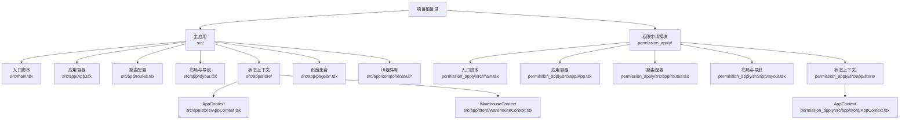
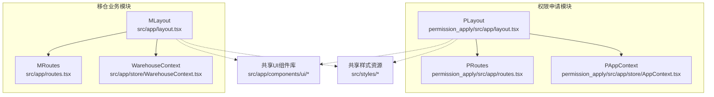
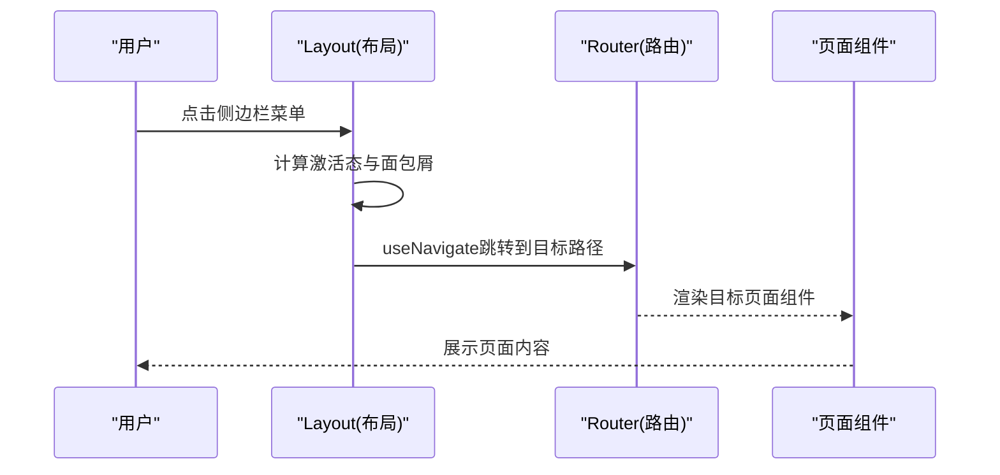
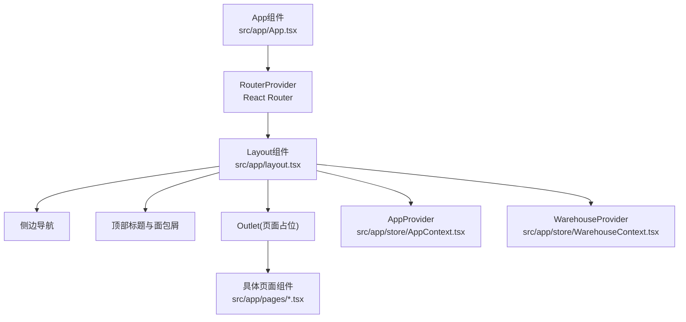
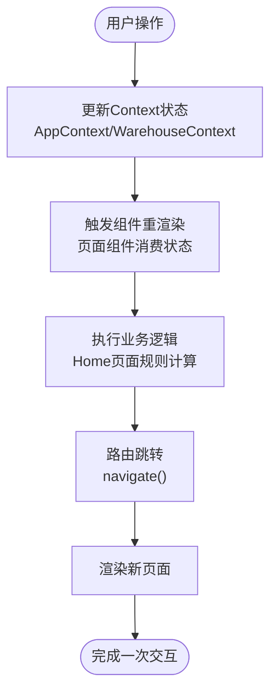

# 架构设计

<cite>
**本文引用的文件**
- [src/main.tsx](file://src/main.tsx)
- [src/app/App.tsx](file://src/app/App.tsx)
- [src/app/routes.tsx](file://src/app/routes.tsx)
- [src/app/layout.tsx](file://src/app/layout.tsx)
- [src/app/store/AppContext.tsx](file://src/app/store/AppContext.tsx)
- [src/app/store/WarehouseContext.tsx](file://src/app/store/WarehouseContext.tsx)
- [src/app/pages/Home.tsx](file://src/app/pages/Home.tsx)
- [permission_apply/src/main.tsx](file://permission_apply/src/main.tsx)
- [permission_apply/src/app/App.tsx](file://permission_apply/src/app/App.tsx)
- [permission_apply/src/app/routes.tsx](file://permission_apply/src/app/routes.tsx)
- [permission_apply/src/app/layout.tsx](file://permission_apply/src/app/layout.tsx)
- [permission_apply/src/app/store/AppContext.tsx](file://permission_apply/src/app/store/AppContext.tsx)
</cite>

## 目录
1. [引言](#引言)
2. [项目结构](#项目结构)
3. [核心组件](#核心组件)
4. [架构总览](#架构总览)
5. [详细组件分析](#详细组件分析)
6. [依赖分析](#依赖分析)
7. [性能考虑](#性能考虑)
8. [故障排查指南](#故障排查指南)
9. [结论](#结论)
10. [附录](#附录)

## 引言
本项目采用双模块架构设计，分别覆盖“权限申请模块”和“移仓业务模块”。两个模块共享统一的前端框架与UI组件体系，通过独立的路由与上下文提供者实现功能隔离与状态解耦。本文档从系统架构、设计模式、组件边界、数据流与模块交互等方面进行深入解析，并给出扩展性与可维护性的建议。

## 项目结构
项目采用多包/多模块布局，根目录包含主应用与权限申请子模块，二者均基于相同的React + Vite技术栈构建，共享UI组件库与样式资源。权限申请模块专注于交易权限开通流程；移仓业务模块负责期货/期权移仓业务的申请、审批与记录管理。

- 主应用路径：src/
- 权限申请模块路径：permission_apply/



图表来源
- [src/main.tsx:1-7](file://src/main.tsx#L1-L7)
- [src/app/App.tsx:1-6](file://src/app/App.tsx#L1-L6)
- [src/app/routes.tsx:1-38](file://src/app/routes.tsx#L1-L38)
- [src/app/layout.tsx:1-175](file://src/app/layout.tsx#L1-L175)
- [src/app/store/AppContext.tsx:1-64](file://src/app/store/AppContext.tsx#L1-L64)
- [src/app/store/WarehouseContext.tsx:1-185](file://src/app/store/WarehouseContext.tsx#L1-L185)
- [permission_apply/src/main.tsx:1-7](file://permission_apply/src/main.tsx#L1-L7)
- [permission_apply/src/app/App.tsx:1-6](file://permission_apply/src/app/App.tsx#L1-L6)
- [permission_apply/src/app/routes.tsx:1-27](file://permission_apply/src/app/routes.tsx#L1-L27)
- [permission_apply/src/app/layout.tsx:1-87](file://permission_apply/src/app/layout.tsx#L1-L87)
- [permission_apply/src/app/store/AppContext.tsx:1-64](file://permission_apply/src/app/store/AppContext.tsx#L1-L64)

章节来源
- [src/main.tsx:1-7](file://src/main.tsx#L1-L7)
- [permission_apply/src/main.tsx:1-7](file://permission_apply/src/main.tsx#L1-L7)

## 核心组件
- 应用入口与渲染
  - 主应用入口与权限申请模块入口均通过ReactDOM创建根节点并挂载App组件。
- 应用容器与路由
  - App组件使用React Router的RouterProvider加载路由配置，实现页面级导航与嵌套路由。
- 布局与导航
  - 统一的Layout组件提供侧边栏导航、面包屑与顶部标题，支持两个模块的菜单分组与跳转。
- 上下文提供者
  - AppContext：封装交易权限相关状态与方法，供权限申请流程使用。
  - WarehouseContext：封装移仓业务相关状态与方法，供移仓业务流程使用。
- 页面与业务逻辑
  - Home等页面组件通过useAppContext/useWarehouseContext消费状态，驱动UI与业务流程。

章节来源
- [src/app/App.tsx:1-6](file://src/app/App.tsx#L1-L6)
- [src/app/routes.tsx:1-38](file://src/app/routes.tsx#L1-L38)
- [src/app/layout.tsx:1-175](file://src/app/layout.tsx#L1-L175)
- [src/app/store/AppContext.tsx:1-64](file://src/app/store/AppContext.tsx#L1-L64)
- [src/app/store/WarehouseContext.tsx:1-185](file://src/app/store/WarehouseContext.tsx#L1-L185)
- [src/app/pages/Home.tsx:1-809](file://src/app/pages/Home.tsx#L1-L809)

## 架构总览
系统采用“双模块 + 共享UI”的架构设计，模块间通过独立的路由与上下文提供者实现解耦。权限申请模块与移仓业务模块共享同一套UI组件与样式资源，确保一致的用户体验与开发效率。



图表来源
- [permission_apply/src/app/layout.tsx:1-87](file://permission_apply/src/app/layout.tsx#L1-L87)
- [permission_apply/src/app/routes.tsx:1-27](file://permission_apply/src/app/routes.tsx#L1-L27)
- [permission_apply/src/app/store/AppContext.tsx:1-64](file://permission_apply/src/app/store/AppContext.tsx#L1-L64)
- [src/app/layout.tsx:1-175](file://src/app/layout.tsx#L1-L175)
- [src/app/routes.tsx:1-38](file://src/app/routes.tsx#L1-L38)
- [src/app/store/WarehouseContext.tsx:1-185](file://src/app/store/WarehouseContext.tsx#L1-L185)

## 详细组件分析

### 双模块架构设计
- 模块划分
  - 权限申请模块：聚焦交易权限开通流程，包含首页、申请列表、审批详情、系统设置等页面。
  - 移仓业务模块：聚焦期货/期权移仓业务，包含移仓申请、列表、详情、审核、审核列表等页面。
- 路由设计
  - 两个模块各自定义独立的路由树，根路径均为“/”，子路由按模块职责划分，避免命名冲突。
- 导航与布局
  - Layout组件根据当前路径判断模块归属，动态展示对应导航项与面包屑，保证用户在不同模块间的无缝切换。

章节来源
- [permission_apply/src/app/routes.tsx:1-27](file://permission_apply/src/app/routes.tsx#L1-L27)
- [src/app/routes.tsx:1-38](file://src/app/routes.tsx#L1-L38)
- [permission_apply/src/app/layout.tsx:1-87](file://permission_apply/src/app/layout.tsx#L1-L87)
- [src/app/layout.tsx:1-175](file://src/app/layout.tsx#L1-L175)

### Context Provider模式
- 设计目标
  - 将跨组件共享的状态集中管理，避免props逐层传递，提升可维护性与可测试性。
- 实现方式
  - AppContext：封装风险等级、资金规模、是否持有50天、现有最大值、特殊企业标识、产品选择、投资者类型等状态与setter。
  - WarehouseContext：封装交易所选择、方向、合约类型、移仓日期、经纪商信息、客户端交易编码与姓名、实际控制账户、权限开关、移仓原因、持仓明细、附件、确认标记、备注等状态与操作方法。
- 使用策略
  - 在Layout顶层同时包裹AppProvider与WarehouseProvider，使两个模块的状态在同一流程中可被访问，但实际业务仅使用对应模块所需的上下文。

```mermaid
classDiagram
class AppContext {
+string account
+RiskLevel riskLevel
+FundLevel fundLevel
+boolean has50Days
+number existingMaxValue
+boolean isSpecialCorp
+string[] selectedProducts
+string customerType
+("普通投资者"|"专业投资者") investorType
+setRiskLevel(level)
+setFundLevel(level)
+setHas50Days(has)
+setExistingMaxValue(val)
+setIsSpecialCorp(is)
+setSelectedProducts(products)
+setCustomerType(type)
+setInvestorType(type)
}
class WarehouseContext {
+string account
+string customerName
+string branch
+string customerType
+WarehouseExchange[] selectedExchanges
+WarehouseDirection direction
+ContractType contractType
+string transferDate
+string outBrokerMemberId
+string outBrokerName
+string inBrokerMemberId
+string inBrokerName
+Record~string,string~ outClientTradingCodes
+Record~string,string~ outClientNames
+Record~string,string~ inClientTradingCodes
+string inClientName
+string actualControlOutAccount
+string actualControlOutName
+string actualControlInAccount
+string actualControlInName
+Record~string,boolean~ accountPermissions
+toggleAccountPermission(account)
+hasPermissionForAccount(account)
+("YES"|"NO"| "") dceTransferByQuantity
+string transferReason
+PositionRow[] positions
+{name,size}[] attachments
+boolean confirmed
+string remark
+reset()
}
class Layout {
+render()
+navigate(path)
+getPageLabel(pathname)
}
Layout --> AppContext : "使用"
Layout --> WarehouseContext : "使用"
```

图表来源
- [src/app/store/AppContext.tsx:1-64](file://src/app/store/AppContext.tsx#L1-L64)
- [src/app/store/WarehouseContext.tsx:1-185](file://src/app/store/WarehouseContext.tsx#L1-L185)
- [src/app/layout.tsx:1-175](file://src/app/layout.tsx#L1-L175)

章节来源
- [src/app/store/AppContext.tsx:1-64](file://src/app/store/AppContext.tsx#L1-L64)
- [src/app/store/WarehouseContext.tsx:1-185](file://src/app/store/WarehouseContext.tsx#L1-L185)
- [src/app/layout.tsx:1-175](file://src/app/layout.tsx#L1-L175)

### 路由系统设计
- 路由组织
  - 主应用与权限申请模块均使用createBrowserRouter定义路由树，根组件为Layout，子路由覆盖各业务页面。
- 导航行为
  - Layout内部通过useNavigate与useLocation实现侧边栏点击跳转与激活态高亮，支持模块内与模块间的导航。
- 路由守卫
  - 通过Navigate组件对未知路径进行重定向，保证导航健壮性。



图表来源
- [src/app/layout.tsx:74-175](file://src/app/layout.tsx#L74-L175)
- [src/app/routes.tsx:18-38](file://src/app/routes.tsx#L18-L38)

章节来源
- [src/app/routes.tsx:1-38](file://src/app/routes.tsx#L1-L38)
- [src/app/layout.tsx:1-175](file://src/app/layout.tsx#L1-L175)

### 状态管理模式
- 权限申请模块状态
  - 通过AppContext集中管理客户基础信息、风险与资金状况、产品选择、投资者类型等，Home页面消费这些状态以决定UI与业务规则。
- 移仓业务模块状态
  - 通过WarehouseContext集中管理移仓相关的多维状态，包括交易所、方向、合约类型、日期、经纪商与客户端信息、权限开关、持仓明细、附件、确认标记与备注等，页面组件按需读写。
- 状态更新策略
  - 采用useState与自定义setter函数，结合reset方法实现表单重置；通过toggleAccountPermission与hasPermissionForAccount实现细粒度权限控制。

章节来源
- [src/app/store/AppContext.tsx:1-64](file://src/app/store/AppContext.tsx#L1-L64)
- [src/app/store/WarehouseContext.tsx:1-185](file://src/app/store/WarehouseContext.tsx#L1-L185)
- [src/app/pages/Home.tsx:1-809](file://src/app/pages/Home.tsx#L1-L809)

### 组件层次结构图


图表来源
- [src/app/App.tsx:1-6](file://src/app/App.tsx#L1-L6)
- [src/app/layout.tsx:74-175](file://src/app/layout.tsx#L74-L175)
- [src/app/store/AppContext.tsx:31-63](file://src/app/store/AppContext.tsx#L31-L63)
- [src/app/store/WarehouseContext.tsx:77-178](file://src/app/store/WarehouseContext.tsx#L77-L178)

### 数据流向图


图表来源
- [src/app/pages/Home.tsx:199-231](file://src/app/pages/Home.tsx#L199-L231)
- [src/app/layout.tsx:75-103](file://src/app/layout.tsx#L75-L103)

## 依赖分析
- 模块内聚与耦合
  - 权限申请模块与移仓业务模块在路由与UI层面保持高内聚，业务逻辑与状态在各自上下文中解耦。
- 外部依赖
  - React Router用于路由管理；UI组件库与样式资源在两个模块间共享，降低重复与维护成本。
- 潜在循环依赖
  - 当前结构未见显式循环依赖；Layout同时引入两个Provider，属于横向共享而非纵向依赖。
- 接口契约
  - 各上下文提供明确的getter/setter与工具方法，调用方通过useAppContext/useWarehouseContext访问，接口稳定。

章节来源
- [src/app/routes.tsx:1-38](file://src/app/routes.tsx#L1-L38)
- [src/app/layout.tsx:1-175](file://src/app/layout.tsx#L1-L175)
- [src/app/store/AppContext.tsx:1-64](file://src/app/store/AppContext.tsx#L1-L64)
- [src/app/store/WarehouseContext.tsx:1-185](file://src/app/store/WarehouseContext.tsx#L1-L185)

## 性能考虑
- 路由懒加载
  - 建议对大型页面组件启用懒加载，减少首屏体积与初次渲染时间。
- 状态最小化
  - 将高频更新的状态拆分为多个上下文，避免无关组件重渲染。
- UI组件优化
  - 对复杂列表与表单控件使用memo化与虚拟滚动，提升滚动性能。
- 缓存与去抖
  - 对网络请求与计算密集型逻辑增加缓存与去抖策略，降低重复计算与请求次数。

## 故障排查指南
- 路由异常
  - 若出现未知路径跳转错误，检查路由配置中的通配符重定向逻辑。
- 上下文访问异常
  - 若useAppContext或useWarehouseContext抛出未包裹Provider的错误，确认Layout已正确包裹对应Provider。
- 导航高亮不生效
  - 检查路径匹配逻辑与isActive计算，确保与导航项path一致。
- 表单状态未更新
  - 确认setter函数调用链路与状态初始化值，避免因默认值导致的UI不刷新。

章节来源
- [src/app/routes.tsx:35-36](file://src/app/routes.tsx#L35-L36)
- [src/app/layout.tsx:95-114](file://src/app/layout.tsx#L95-L114)
- [src/app/store/AppContext.tsx:59-63](file://src/app/store/AppContext.tsx#L59-L63)
- [src/app/store/WarehouseContext.tsx:180-184](file://src/app/store/WarehouseContext.tsx#L180-L184)

## 结论
本项目通过双模块架构与Context Provider模式实现了清晰的功能边界与状态管理，配合统一的UI与路由体系，既保证了业务扩展的灵活性，也提升了开发与维护效率。未来可在路由懒加载、状态拆分与性能监控方面进一步优化，以支撑更大规模的业务场景。

## 附录
- 技术决策权衡
  - 双模块设计：分离职责、降低耦合，便于团队并行开发；共享UI与样式降低维护成本。
  - Context Provider：集中状态管理、简化数据流；需注意Provider层级与状态拆分策略。
  - 路由方案：使用React Router v6的RouterProvider与嵌套路由，简洁直观。
- 扩展性建议
  - 引入路由懒加载与代码分割；
  - 将通用业务逻辑抽象为hooks或服务层；
  - 增加全局错误边界与日志上报；
  - 完善单元测试与端到端测试覆盖。