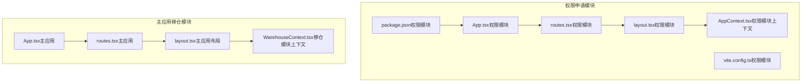
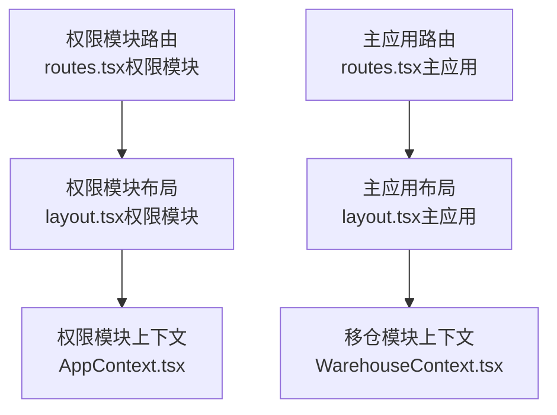
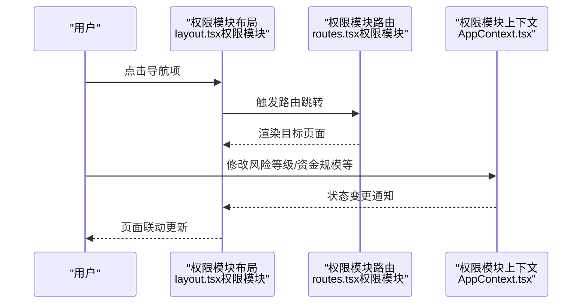
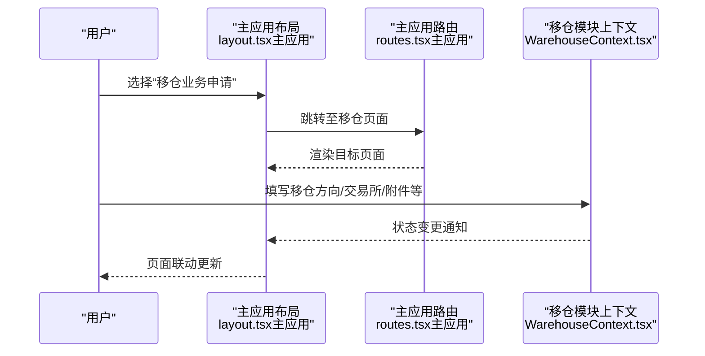
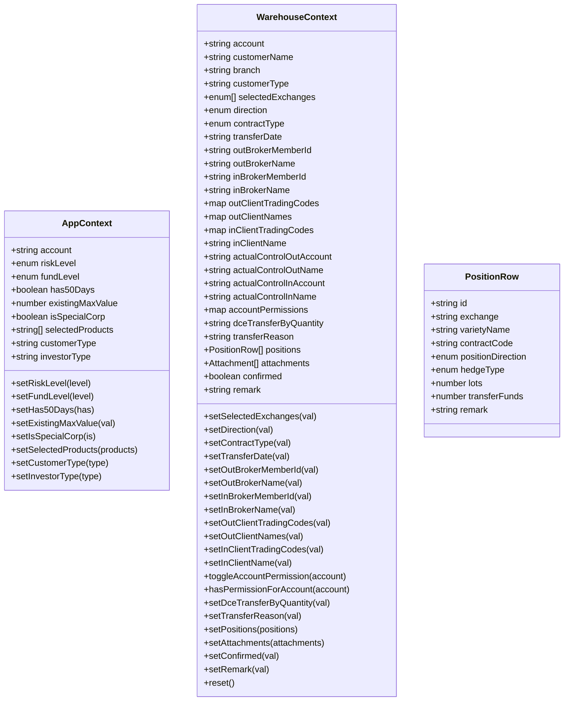
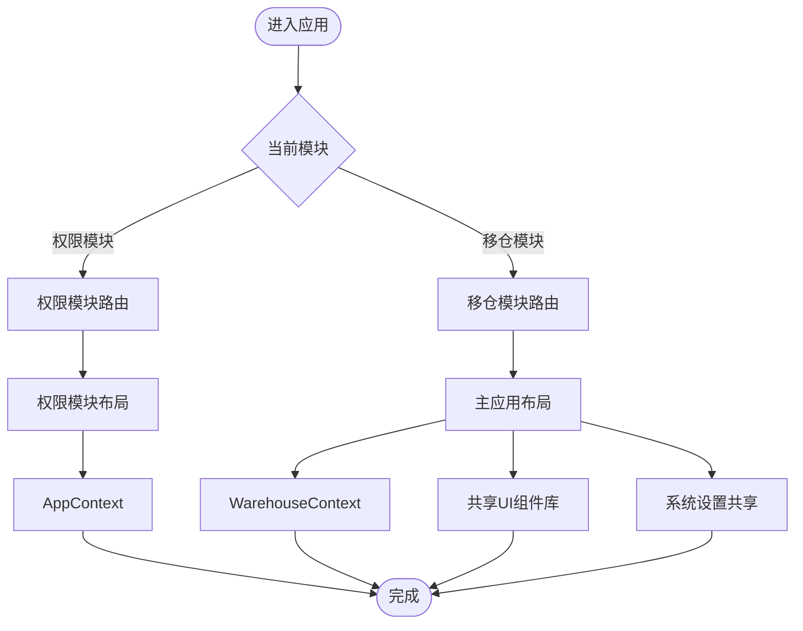
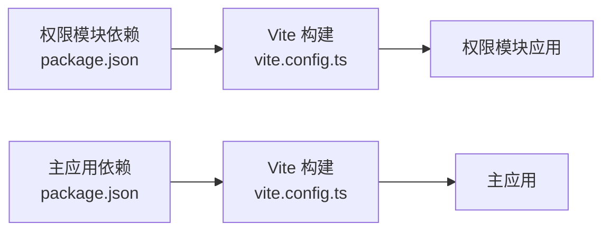

# 模块设计

<cite>
**本文引用的文件**
- [package.json](file://permission_apply/package.json)
- [vite.config.ts](file://permission_apply/vite.config.ts)
- [App.tsx](file://permission_apply/src/app/App.tsx)
- [routes.tsx（权限模块）](file://permission_apply/src/app/routes.tsx)
- [layout.tsx（权限模块）](file://permission_apply/src/app/layout.tsx)
- [AppContext.tsx（权限模块上下文）](file://permission_apply/src/app/store/AppContext.tsx)
- [routes.tsx（主应用）](file://src/app/routes.tsx)
- [layout.tsx（主应用布局）](file://src/app/layout.tsx)
- [App.tsx（主应用）](file://src/app/App.tsx)
- [WarehouseContext.tsx（移仓模块上下文）](file://src/app/store/WarehouseContext.tsx)
</cite>

## 目录
1. [引言](#引言)
2. [项目结构](#项目结构)
3. [核心组件](#核心组件)
4. [架构总览](#架构总览)
5. [详细组件分析](#详细组件分析)
6. [依赖分析](#依赖分析)
7. [性能考虑](#性能考虑)
8. [故障排查指南](#故障排查指南)
9. [结论](#结论)
10. [附录：模块扩展与接入规范](#附录模块扩展与接入规范)

## 引言
本设计文档围绕“双模块架构”展开，系统性阐述权限申请模块与移仓业务模块在工程中的实现原理、设计模式与协作机制。重点包括：
- 模块独立性设计：通过路由分组、上下文隔离与构建别名实现边界清晰。
- 资源共享策略：统一布局、导航与全局状态容器，避免重复实现。
- 模块化优势：代码复用、依赖解耦、可维护性与可扩展性提升。
- 加载策略与通信机制：基于 React Router 的路由级加载与 Context 的跨组件数据传递。
- 性能优化：按需渲染、上下文拆分与构建时别名解析。
- 扩展指南：新增模块的接入流程、命名规范与最佳实践。

## 项目结构
该项目采用“多包/多模块”组织方式，权限申请模块与移仓业务模块分别位于独立目录中，共享顶层构建配置与通用 UI 组件库，形成“模块自治、资源共享”的双模块架构。

图表来源
- [package.json:1-90](file://permission_apply/package.json#L1-L90)
- [vite.config.ts:1-37](file://permission_apply/vite.config.ts#L1-L37)
- [App.tsx（权限模块）:1-6](file://permission_apply/src/app/App.tsx#L1-L6)
- [routes.tsx（权限模块）:1-27](file://permission_apply/src/app/routes.tsx#L1-L27)
- [layout.tsx（权限模块）:1-87](file://permission_apply/src/app/layout.tsx#L1-L87)
- [AppContext.tsx（权限模块上下文）:1-64](file://permission_apply/src/app/store/AppContext.tsx#L1-L64)
- [App.tsx（主应用）:1-6](file://src/app/App.tsx#L1-L6)
- [routes.tsx（主应用）:1-38](file://src/app/routes.tsx#L1-L38)
- [layout.tsx（主应用布局）:1-175](file://src/app/layout.tsx#L1-L175)
- [WarehouseContext.tsx（移仓模块上下文）:1-185](file://src/app/store/WarehouseContext.tsx#L1-L185)

章节来源
- [package.json:1-90](file://permission_apply/package.json#L1-L90)
- [vite.config.ts:1-37](file://permission_apply/vite.config.ts#L1-L37)
- [App.tsx（权限模块）:1-6](file://permission_apply/src/app/App.tsx#L1-L6)
- [routes.tsx（权限模块）:1-27](file://permission_apply/src/app/routes.tsx#L1-L27)
- [layout.tsx（权限模块）:1-87](file://permission_apply/src/app/layout.tsx#L1-L87)
- [AppContext.tsx（权限模块上下文）:1-64](file://permission_apply/src/app/store/AppContext.tsx#L1-L64)
- [App.tsx（主应用）:1-6](file://src/app/App.tsx#L1-L6)
- [routes.tsx（主应用）:1-38](file://src/app/routes.tsx#L1-L38)
- [layout.tsx（主应用布局）:1-175](file://src/app/layout.tsx#L1-L175)
- [WarehouseContext.tsx（移仓模块上下文）:1-185](file://src/app/store/WarehouseContext.tsx#L1-L185)

## 核心组件
- 权限申请模块
  - 应用入口与路由：通过独立的 App 与路由配置，限定权限模块的页面集合与导航范围。
  - 布局与导航：左侧导航按模块聚合，顶部面包屑动态生成，支持系统设置等共享功能。
  - 全局状态：AppContext 提供风险等级、资金规模、产品选择等状态，便于表单联动与规则计算。
- 移仓业务模块
  - 应用入口与路由：主应用包含权限与移仓两类页面，通过统一布局与导航进行模块区分。
  - 全局状态：WarehouseContext 管理移仓方向、交易所、合约类型、客户信息、附件与确认状态等，支撑复杂业务表单。
- 共享层
  - 统一布局与 Provider：主应用布局同时挂载两个模块的 Provider，实现资源复用与上下文隔离。
  - UI 组件库：基于 Radix UI 与 MUI 的组件体系，保证交互一致性与可维护性。

章节来源
- [App.tsx（权限模块）:1-6](file://permission_apply/src/app/App.tsx#L1-L6)
- [routes.tsx（权限模块）:1-27](file://permission_apply/src/app/routes.tsx#L1-L27)
- [layout.tsx（权限模块）:1-87](file://permission_apply/src/app/layout.tsx#L1-L87)
- [AppContext.tsx（权限模块上下文）:1-64](file://permission_apply/src/app/store/AppContext.tsx#L1-L64)
- [App.tsx（主应用）:1-6](file://src/app/App.tsx#L1-L6)
- [routes.tsx（主应用）:1-38](file://src/app/routes.tsx#L1-L38)
- [layout.tsx（主应用布局）:1-175](file://src/app/layout.tsx#L1-L175)
- [WarehouseContext.tsx（移仓模块上下文）:1-185](file://src/app/store/WarehouseContext.tsx#L1-L185)

## 架构总览
双模块架构以“路由分组 + 上下文隔离 + 共享布局”为核心设计原则：
- 路由分组：权限模块与移仓模块各自拥有独立的路由树，互不干扰。
- 上下文隔离：权限模块使用 AppContext，移仓模块使用 WarehouseContext，避免状态污染。
- 共享布局：主应用布局统一承载两侧模块的导航、面包屑与系统设置，减少重复实现。
- 构建别名：权限模块通过 Vite 别名与自定义插件解析特定资源，提升开发体验与可维护性。

图表来源
- [routes.tsx（权限模块）:1-27](file://permission_apply/src/app/routes.tsx#L1-L27)
- [layout.tsx（权限模块）:1-87](file://permission_apply/src/app/layout.tsx#L1-L87)
- [AppContext.tsx（权限模块上下文）:1-64](file://permission_apply/src/app/store/AppContext.tsx#L1-L64)
- [routes.tsx（主应用）:1-38](file://src/app/routes.tsx#L1-L38)
- [layout.tsx（主应用布局）:1-175](file://src/app/layout.tsx#L1-L175)
- [WarehouseContext.tsx（移仓模块上下文）:1-185](file://src/app/store/WarehouseContext.tsx#L1-L185)

## 详细组件分析

### 权限申请模块（App + Routes + Layout + Context）
- 设计要点
  - 应用入口：通过 RouterProvider 注入权限模块路由，确保模块内导航与页面切换。
  - 路由配置：集中声明权限相关页面，包含首页、申请列表、详情与审批流水等。
  - 布局与导航：左侧导航仅展示权限模块条目，顶部面包屑根据当前路径动态显示模块标签。
  - 全局状态：AppContext 提供风险评估与资金规模等关键字段，支持表单联动与规则校验。
- 数据流
  - 用户在权限模块页面输入或选择后，状态写入 AppContext；后续页面可读取该状态，减少重复请求与参数传递。

图表来源
- [layout.tsx（权限模块）:1-87](file://permission_apply/src/app/layout.tsx#L1-L87)
- [routes.tsx（权限模块）:1-27](file://permission_apply/src/app/routes.tsx#L1-L27)
- [AppContext.tsx（权限模块上下文）:1-64](file://permission_apply/src/app/store/AppContext.tsx#L1-L64)

章节来源
- [App.tsx（权限模块）:1-6](file://permission_apply/src/app/App.tsx#L1-L6)
- [routes.tsx（权限模块）:1-27](file://permission_apply/src/app/routes.tsx#L1-L27)
- [layout.tsx（权限模块）:1-87](file://permission_apply/src/app/layout.tsx#L1-L87)
- [AppContext.tsx（权限模块上下文）:1-64](file://permission_apply/src/app/store/AppContext.tsx#L1-L64)

### 移仓业务模块（主应用 + 路由 + 布局 + 上下文）
- 设计要点
  - 应用入口：主应用包含权限与移仓两类页面，统一由主应用路由与布局承载。
  - 路由配置：除权限模块页面外，还包含移仓相关的申请、列表、详情与审批流水等页面。
  - 布局与导航：左侧导航分为“交易权限申请”和“移仓业务申请”，顶部面包屑按模块分组显示。
  - 全局状态：WarehouseContext 管理复杂的移仓场景数据，如交易所、方向、合约类型、客户与账户权限、附件等。
- 数据流
  - 表单填写过程中，状态逐步写入 WarehouseContext；提交前可进行确认与校验，最终统一落库或提交。

图表来源
- [layout.tsx（主应用布局）:1-175](file://src/app/layout.tsx#L1-L175)
- [routes.tsx（主应用）:1-38](file://src/app/routes.tsx#L1-L38)
- [WarehouseContext.tsx（移仓模块上下文）:1-185](file://src/app/store/WarehouseContext.tsx#L1-L185)

章节来源
- [App.tsx（主应用）:1-6](file://src/app/App.tsx#L1-L6)
- [routes.tsx（主应用）:1-38](file://src/app/routes.tsx#L1-L38)
- [layout.tsx（主应用布局）:1-175](file://src/app/layout.tsx#L1-L175)
- [WarehouseContext.tsx（移仓模块上下文）:1-185](file://src/app/store/WarehouseContext.tsx#L1-L185)

### 上下文与状态模型（类图）
- 权限模块上下文（AppContext）
  - 关键状态：风险等级、资金规模、是否满足特定条件、已选产品、客户类型、投资者类型等。
  - 作用：为权限申请流程提供统一的状态存储与派发。
- 移仓模块上下文（WarehouseContext）
  - 关键状态：账户与客户信息、交易所集合、移仓方向、合约类型、日期、经纪商与客户信息、账户权限映射、仓位明细、附件、确认标记与备注等。
  - 作用：支撑复杂的移仓业务表单与审批流程。

图表来源
- [AppContext.tsx（权限模块上下文）:1-64](file://permission_apply/src/app/store/AppContext.tsx#L1-L64)
- [WarehouseContext.tsx（移仓模块上下文）:1-185](file://src/app/store/WarehouseContext.tsx#L1-L185)

章节来源
- [AppContext.tsx（权限模块上下文）:1-64](file://permission_apply/src/app/store/AppContext.tsx#L1-L64)
- [WarehouseContext.tsx（移仓模块上下文）:1-185](file://src/app/store/WarehouseContext.tsx#L1-L185)

### 模块间隔离与资源共享（流程图）
- 隔离机制
  - 路由隔离：权限模块与移仓模块的路由树相互独立，避免页面与状态交叉。
  - 上下文隔离：AppContext 与 WarehouseContext 分别封装各自领域的状态，降低耦合。
- 资源共享
  - 布局与导航：主应用布局统一承载两侧模块的导航与面包屑，减少重复实现。
  - UI 组件库：共享 Radix UI 与 MUI 组件，保持交互一致性和可维护性。
  - 系统设置：系统设置页面对所有模块开放，实现统一的系统级配置入口。

图表来源
- [routes.tsx（权限模块）:1-27](file://permission_apply/src/app/routes.tsx#L1-L27)
- [routes.tsx（主应用）:1-38](file://src/app/routes.tsx#L1-L38)
- [layout.tsx（权限模块）:1-87](file://permission_apply/src/app/layout.tsx#L1-L87)
- [layout.tsx（主应用布局）:1-175](file://src/app/layout.tsx#L1-L175)
- [AppContext.tsx（权限模块上下文）:1-64](file://permission_apply/src/app/store/AppContext.tsx#L1-L64)
- [WarehouseContext.tsx（移仓模块上下文）:1-185](file://src/app/store/WarehouseContext.tsx#L1-L185)

章节来源
- [routes.tsx（权限模块）:1-27](file://permission_apply/src/app/routes.tsx#L1-L27)
- [routes.tsx（主应用）:1-38](file://src/app/routes.tsx#L1-L38)
- [layout.tsx（权限模块）:1-87](file://permission_apply/src/app/layout.tsx#L1-L87)
- [layout.tsx（主应用布局）:1-175](file://src/app/layout.tsx#L1-L175)
- [AppContext.tsx（权限模块上下文）:1-64](file://permission_apply/src/app/store/AppContext.tsx#L1-L64)
- [WarehouseContext.tsx（移仓模块上下文）:1-185](file://src/app/store/WarehouseContext.tsx#L1-L185)

## 依赖分析
- 依赖来源
  - 权限模块与主应用共享相同的依赖清单，确保 UI 组件库与工具链的一致性。
  - Vite 配置在权限模块中引入自定义插件与别名解析，提升开发效率与资源定位能力。
- 依赖关系
  - 权限模块：React Router、Radix UI、MUI、TailwindCSS 等。
  - 主应用：除上述依赖外，还包含移仓业务所需的复杂表单与图表组件。
- 解耦与复用
  - 通过共享依赖与统一构建配置，降低重复依赖带来的体积与维护成本。
  - 各模块内部通过 Context 与路由实现状态与视图的解耦。

图表来源
- [package.json（权限模块）:1-90](file://permission_apply/package.json#L1-L90)
- [vite.config.ts（权限模块）:1-37](file://permission_apply/vite.config.ts#L1-L37)
- [package.json（主应用）:1-91](file://package.json#L1-L91)

章节来源
- [package.json（权限模块）:1-90](file://permission_apply/package.json#L1-L90)
- [vite.config.ts（权限模块）:1-37](file://permission_apply/vite.config.ts#L1-L37)
- [package.json（主应用）:1-91](file://package.json#L1-L91)

## 性能考虑
- 按需渲染
  - 路由级加载：权限模块与移仓模块的页面按需加载，减少初始包体与首屏时间。
- 上下文拆分
  - 将权限与移仓的状态分离到不同 Context，避免无关状态变更触发重渲染。
- 构建优化
  - 使用 Vite 的别名与插件机制，提升资源解析效率与开发体验。
- UI 组件库
  - 统一使用轻量级 UI 组件库，减少不必要的样式与脚本体积。

## 故障排查指南
- 路由无法跳转
  - 检查模块路由配置是否正确注册，以及布局中导航项的路径是否匹配。
- 状态未更新
  - 确认使用的 Context 是否在对应 Provider 下方，且调用的 setter 方法是否正确。
- 构建异常
  - 检查 Vite 别名与插件配置，确保资源路径解析正常。
- 导航高亮异常
  - 核对布局中激活态判断逻辑与当前路径是否一致。

章节来源
- [routes.tsx（权限模块）:1-27](file://permission_apply/src/app/routes.tsx#L1-L27)
- [layout.tsx（权限模块）:1-87](file://permission_apply/src/app/layout.tsx#L1-L87)
- [AppContext.tsx（权限模块上下文）:1-64](file://permission_apply/src/app/store/AppContext.tsx#L1-L64)
- [routes.tsx（主应用）:1-38](file://src/app/routes.tsx#L1-L38)
- [layout.tsx（主应用布局）:1-175](file://src/app/layout.tsx#L1-L175)
- [WarehouseContext.tsx（移仓模块上下文）:1-185](file://src/app/store/WarehouseContext.tsx#L1-L185)
- [vite.config.ts（权限模块）:1-37](file://permission_apply/vite.config.ts#L1-L37)

## 结论
双模块架构通过“路由分组 + 上下文隔离 + 共享布局”的设计，在保证模块独立性的同时实现了资源复用与统一管理。权限申请模块与移仓业务模块各司其职，既降低了耦合度，又提升了可维护性与扩展性。配合合理的依赖管理与构建优化，能够有效提升开发效率与运行性能。

## 附录：模块扩展与接入规范
- 新增模块步骤
  - 创建模块目录与基础文件（App、routes、layout、store），确保路由与入口正确注册。
  - 在主应用布局中添加模块导航与面包屑映射，保持一致性。
  - 如需共享 UI 或工具函数，优先复用现有组件库与工具方法。
- 命名规范
  - 模块目录采用语义化命名，如 permission_apply、warehouse_transfer。
  - 路由路径以模块名作为前缀，避免冲突。
- 依赖管理
  - 与现有模块保持依赖版本一致，必要时通过工作区统一升级。
- 上下文设计
  - 每个模块应有独立的 Context，避免跨模块状态污染。
- 性能建议
  - 页面按需加载，避免一次性引入过多资源。
  - 对复杂表单进行分步提交与本地缓存，减少网络压力。