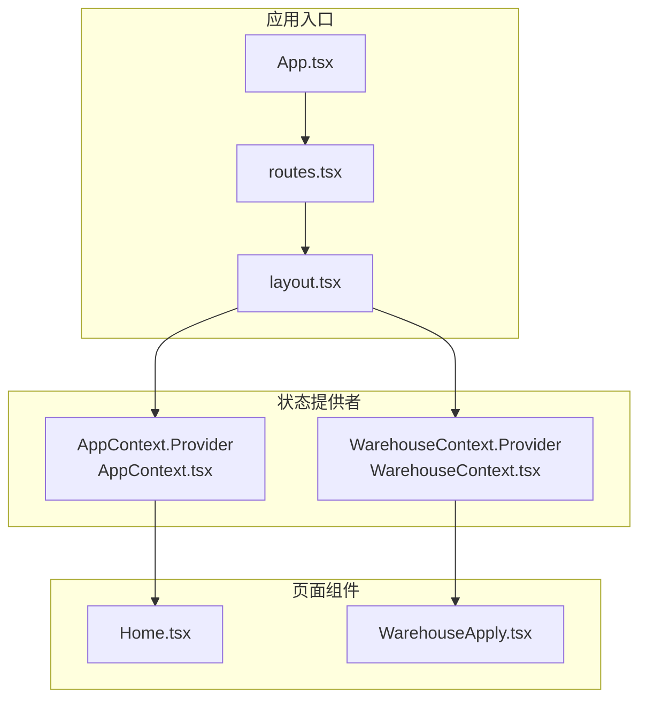
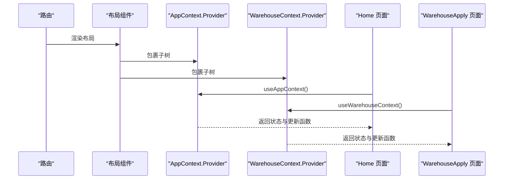
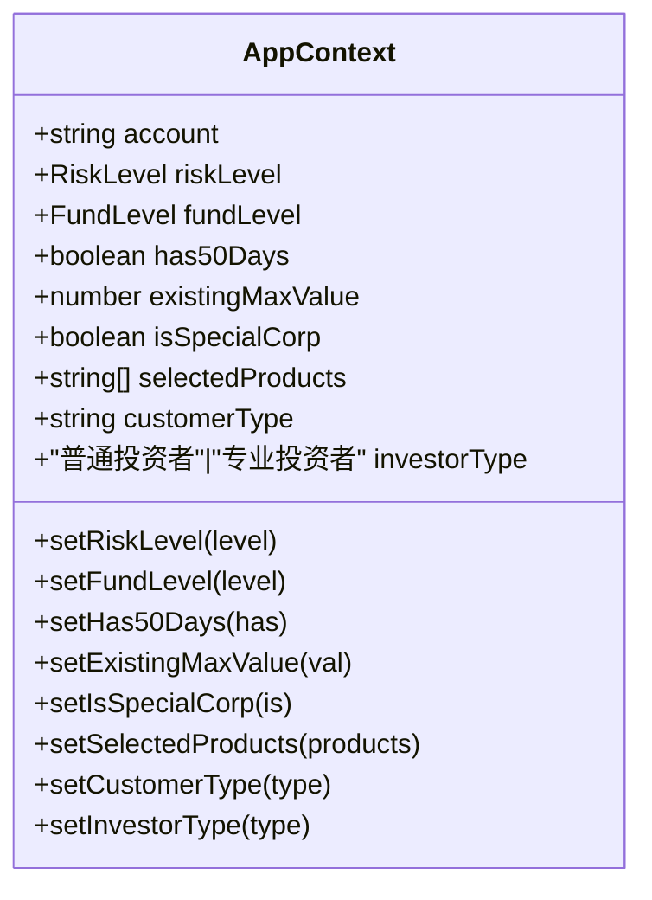
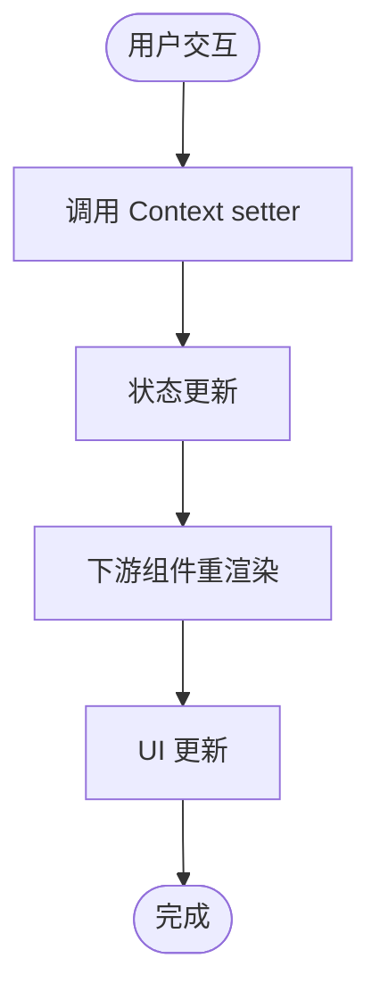
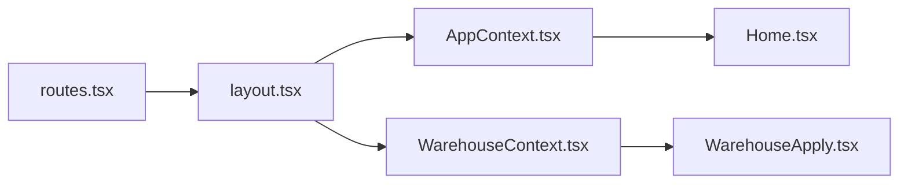

# 状态管理模式

<cite>
**本文引用的文件**
- [AppContext.tsx](file://src/app/store/AppContext.tsx)
- [WarehouseContext.tsx](file://src/app/store/WarehouseContext.tsx)
- [layout.tsx](file://src/app/layout.tsx)
- [routes.tsx](file://src/app/routes.tsx)
- [App.tsx](file://src/app/App.tsx)
- [Home.tsx](file://src/app/pages/Home.tsx)
- [WarehouseApply.tsx](file://src/app/pages/WarehouseApply.tsx)
- [warehouse-transfer-design.md](file://docs/warehouse-transfer-design.md)
- [package.json](file://package.json)
</cite>

## 目录
1. [引言](#引言)
2. [项目结构](#项目结构)
3. [核心组件](#核心组件)
4. [架构总览](#架构总览)
5. [详细组件分析](#详细组件分析)
6. [依赖分析](#依赖分析)
7. [性能考虑](#性能考虑)
8. [故障排查指南](#故障排查指南)
9. [结论](#结论)
10. [附录](#附录)

## 引言
本文件系统性梳理项目中基于 React Context 的状态管理模式，重点围绕 AppContext 和 WarehouseContext 的设计与实现，解释状态结构、数据流、状态提升策略、组件间共享机制、更新触发机制，并给出持久化方案、性能优化策略、调试技巧以及最佳实践与常见问题解决方案。文档同时结合仓库设计文档，明确业务场景下的状态边界与职责划分。

## 项目结构
项目采用模块化的前端架构，状态管理以 Context Provider 形式贯穿于页面层与组件层：
- 应用级状态：AppContext 提供交易权限申请相关的全局状态
- 业务域状态：WarehouseContext 提供移仓业务表单的全局状态
- 路由与布局：通过路由与布局组件注入 Provider，确保子树组件可访问上下文
- 页面组件：各页面通过自定义 Hook 访问对应 Context，完成状态读取与更新



图表来源
- [App.tsx:1-6](file://src/app/App.tsx#L1-L6)
- [routes.tsx:1-38](file://src/app/routes.tsx#L1-L38)
- [layout.tsx:1-175](file://src/app/layout.tsx#L1-L175)
- [AppContext.tsx:1-64](file://src/app/store/AppContext.tsx#L1-L64)
- [WarehouseContext.tsx:1-185](file://src/app/store/WarehouseContext.tsx#L1-L185)

章节来源
- [App.tsx:1-6](file://src/app/App.tsx#L1-L6)
- [routes.tsx:1-38](file://src/app/routes.tsx#L1-L38)
- [layout.tsx:1-175](file://src/app/layout.tsx#L1-L175)

## 核心组件
- AppContext：封装交易权限申请所需的全局状态与更新方法，包括账户信息、风险等级、资金等级、产品选择、投资者类型等
- WarehouseContext：封装移仓业务表单的全局状态，包括交易所选择、移仓方向、合约明细、附件、权限控制、确认状态等

章节来源
- [AppContext.tsx:1-64](file://src/app/store/AppContext.tsx#L1-L64)
- [WarehouseContext.tsx:1-185](file://src/app/store/WarehouseContext.tsx#L1-L185)

## 架构总览
- Provider 注入位置：在布局组件中同时注入 AppContext 与 WarehouseContext，保证两个业务域的状态在同一路由层级下可用
- 自定义 Hook：useAppContext/useWarehouseContext 提供安全访问上下文的能力，并在越界使用时抛出错误
- 页面消费：Home 与 WarehouseApply 分别通过各自 Hook 访问对应上下文，实现状态提升与共享



图表来源
- [layout.tsx:80-172](file://src/app/layout.tsx#L80-L172)
- [AppContext.tsx:59-63](file://src/app/store/AppContext.tsx#L59-L63)
- [WarehouseContext.tsx:180-184](file://src/app/store/WarehouseContext.tsx#L180-L184)

## 详细组件分析

### AppContext 设计与实现
- 状态结构
  - 基础信息：账户、客户类型、投资者类型
  - 风控维度：风险等级、资金等级、是否持有50天、历史最大值、是否为特殊法人
  - 产品选择：已选产品数组
- 更新策略
  - 每个状态项提供 setter 函数，便于页面组件直接调用
  - 通过 Provider 将状态与 setter 一并暴露给子树
- 使用示例
  - Home 页面通过解构 useAppContext 获取状态并绑定到表单控件
  - 通过 setSelectedProducts 等 setter 实现双向绑定与状态提升



图表来源
- [AppContext.tsx:6-27](file://src/app/store/AppContext.tsx#L6-L27)

章节来源
- [AppContext.tsx:1-64](file://src/app/store/AppContext.tsx#L1-L64)
- [Home.tsx:61-68](file://src/app/pages/Home.tsx#L61-L68)

### WarehouseContext 设计与实现
- 状态结构
  - 基础信息：客户名称、分支、客户类型
  - 业务参数：交易所集合、移仓方向、合约类型、移仓日期、经纪人与客户信息
  - 实控组：移出/移入账户与名称
  - 权限控制：账户级权限映射与切换函数
  - 明细与附件：PositionRow 列表、附件列表
  - 状态与备注：confirmed、remark
  - 重置能力：reset
- 更新策略
  - 大量 setter 用于细粒度更新
  - 通过 record 类型维护多交易所字段，避免分散状态
  - 提供 toggleAccountPermission 与 hasPermissionForAccount 实现权限开关与查询
- 使用示例
  - WarehouseApply 页面通过 useWarehouseContext 访问状态
  - 通过 setSelectedExchanges、setDirection、setPositions 等实现复杂表单的状态提升与联动

```mermaid
classDiagram
class WarehouseContext {
+string account
+string customerName
+string branch
+string customerType
+WarehouseExchange[] selectedExchanges
+setSelectedExchanges(val)
+WarehouseDirection direction
+setDirection(val)
+ContractType contractType
+setContractType(val)
+string transferDate
+setTransferDate(val)
+string outBrokerMemberId
+setOutBrokerMemberId(val)
+string outBrokerName
+setOutBrokerName(val)
+string inBrokerMemberId
+setInBrokerMemberId(val)
+string inBrokerName
+setInBrokerName(val)
+Record~WarehouseExchange,string~ outClientTradingCodes
+setOutClientTradingCodes(val)
+Record~WarehouseExchange,string~ outClientNames
+setOutClientNames(val)
+Record~WarehouseExchange,string~ inClientTradingCodes
+setInClientTradingCodes(val)
+string inClientName
+setInClientName(val)
+string actualControlOutAccount
+setActualControlOutAccount(val)
+string actualControlOutName
+setActualControlOutName(val)
+string actualControlInAccount
+setActualControlInAccount(val)
+string actualControlInName
+setActualControlInName(val)
+Record~string,boolean~ accountPermissions
+toggleAccountPermission(account)
+hasPermissionForAccount(account) boolean
+("YES"|"NO"| "") dceTransferByQuantity
+setDceTransferByQuantity(val)
+string transferReason
+setTransferReason(val)
+PositionRow[] positions
+setPositions(positions)
+{name,size}[] attachments
+setAttachments(attachments)
+boolean confirmed
+setConfirmed(val)
+string remark
+setRemark(val)
+reset()
}
```

图表来源
- [WarehouseContext.tsx:19-73](file://src/app/store/WarehouseContext.tsx#L19-L73)

章节来源
- [WarehouseContext.tsx:1-185](file://src/app/store/WarehouseContext.tsx#L1-L185)
- [WarehouseApply.tsx:185-188](file://src/app/pages/WarehouseApply.tsx#L185-L188)

### 数据流与状态提升
- 数据流向
  - 用户在页面组件中修改表单字段
  - 页面组件调用对应 Context 的 setter 更新状态
  - 状态在 Provider 下游所有子树共享，组件通过 useAppContext/useWarehouseContext 订阅变化
- 状态提升策略
  - 将页面级临时状态提升到 Context，实现跨页面共享与复用
  - 对于复杂表单（如移仓明细），通过数组与对象组合管理，减少重复渲染
- 触发机制
  - setter 调用触发 React 状态更新，进而触发下游组件重渲染
  - 对于高频更新的表单项，可通过 useMemo/memo 控制渲染范围



[此图为概念流程图，无需图表来源]

### 组件间状态共享机制
- 共享范围：Provider 包裹的子树均可访问对应 Context
- 订阅方式：useAppContext/useWarehouseContext 返回状态与 setter，组件按需订阅
- 解耦策略：页面组件仅依赖 Hook，不关心状态来源，降低耦合度

章节来源
- [layout.tsx:80-172](file://src/app/layout.tsx#L80-L172)
- [AppContext.tsx:59-63](file://src/app/store/AppContext.tsx#L59-L63)
- [WarehouseContext.tsx:180-184](file://src/app/store/WarehouseContext.tsx#L180-L184)

### 状态持久化方案
- 本地存储建议
  - 交易权限申请：可将 selectedProducts、riskLevel、fundLevel 等轻量状态持久化到 localStorage/sessionStorage
  - 移仓表单：可将 positions、attachments、方向与交易所选择等持久化，避免刷新丢失
- 实施要点
  - 在组件挂载时读取持久化数据并初始化 Context
  - 在 setter 调用时同步写入持久化存储
  - 注意敏感字段（如附件路径）不应持久化
- 与设计文档的契合
  - 仓库设计文档建议新增 WarehouseContext 管理移仓表单草稿状态，与本地持久化思路一致

章节来源
- [warehouse-transfer-design.md:103-105](file://docs/warehouse-transfer-design.md#L103-L105)

### 性能优化策略
- 渲染优化
  - 将大型表单拆分为多个子组件，使用 memo/React.memo 限制重渲染
  - 对高频更新字段使用局部状态，避免 Context 整体抖动
- 计算优化
  - 使用 useMemo 缓存复杂计算结果（如表单校验、动态字段）
  - 使用 useCallback 包装回调函数，减少子组件重渲染
- 状态粒度
  - 将细粒度状态拆分，避免单一 setter 导致大面积重渲染
- 资源管理
  - 附件上传等资源应及时清理，避免内存泄漏

[本节为通用性能建议，无需章节来源]

### 调试技巧
- 错误边界
  - 自定义 Hook 中对未包裹 Provider 的使用抛出明确错误，便于快速定位问题
- 日志与追踪
  - 在关键 setter 调用处添加日志，记录状态变化轨迹
- 开发工具
  - 使用 React DevTools 的 Profiler 分析渲染热点
- 单元测试
  - 为复杂逻辑（如表单校验、权限判断）编写单元测试，确保稳定性

章节来源
- [AppContext.tsx:61-62](file://src/app/store/AppContext.tsx#L61-L62)
- [WarehouseContext.tsx:182-183](file://src/app/store/WarehouseContext.tsx#L182-L183)

## 依赖分析
- 依赖关系
  - layout.tsx 依赖 AppContext 与 WarehouseContext 的 Provider
  - 页面组件依赖对应自定义 Hook
  - 路由配置决定 Provider 的作用域
- 外部依赖
  - react-router 用于页面路由与 Outlet 渲染
  - UI 组件库（Radix UI、Lucide Icons 等）用于表单与交互



图表来源
- [routes.tsx:1-38](file://src/app/routes.tsx#L1-L38)
- [layout.tsx:1-175](file://src/app/layout.tsx#L1-L175)
- [AppContext.tsx:1-64](file://src/app/store/AppContext.tsx#L1-L64)
- [WarehouseContext.tsx:1-185](file://src/app/store/WarehouseContext.tsx#L1-L185)

章节来源
- [package.json:11-66](file://package.json#L11-L66)

## 性能考虑
- 渲染性能
  - 将重型计算放入 useMemo/useCallback，避免每次渲染都重新计算
  - 对于大量列表（如合约明细），使用虚拟滚动或分页
- 状态体积
  - 控制 Context 中状态大小，避免不必要的深拷贝
- 并发更新
  - 对于批量更新，合并多次 setter 调用，减少中间态渲染

[本节为通用性能建议，无需章节来源]

## 故障排查指南
- 常见问题
  - 使用自定义 Hook 但未包裹 Provider：抛出“必须在 Provider 内使用”的错误
  - 状态未更新：检查 setter 是否正确调用，是否存在闭包陷阱
  - 表单校验不生效：确认校验逻辑是否在渲染前执行，或使用 useMemo 缓存
- 排查步骤
  - 在关键 setter 处添加日志，确认调用链路
  - 使用 React DevTools 检查组件树与渲染次数
  - 对比仓库设计文档，确认业务规则与状态结构一致性

章节来源
- [AppContext.tsx:61-62](file://src/app/store/AppContext.tsx#L61-L62)
- [WarehouseContext.tsx:182-183](file://src/app/store/WarehouseContext.tsx#L182-L183)

## 结论
本项目采用 Context Provider 模式实现了清晰的状态管理：AppContext 负责交易权限申请的全局状态，WarehouseContext 负责移仓业务表单的全局状态。通过 Provider 注入与自定义 Hook 订阅，实现了状态提升与组件间共享。配合本地持久化、性能优化与调试技巧，可在复杂业务场景下保持良好的开发体验与运行效率。建议后续结合仓库设计文档，完善移仓表单草稿的持久化与校验逻辑，进一步提升用户体验与系统稳定性。

## 附录
- 最佳实践
  - 将页面级临时状态提升到 Context，便于跨页面共享
  - 使用细粒度 setter 与局部状态，减少整体重渲染
  - 对复杂逻辑使用 useMemo/useCallback，提升性能
  - 为关键状态提供默认值与校验，增强健壮性
- 常见问题
  - Provider 未包裹：确保在布局中同时注入 AppContext 与 WarehouseContext
  - 状态不更新：检查 setter 调用与闭包陷阱
  - 表单校验失效：确认校验逻辑在渲染前执行或使用 useMemo 缓存