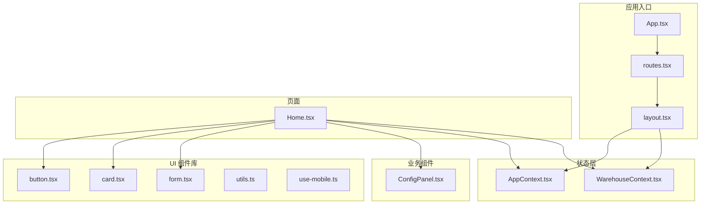
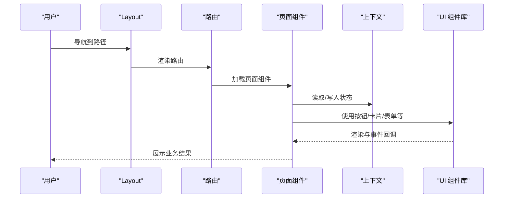
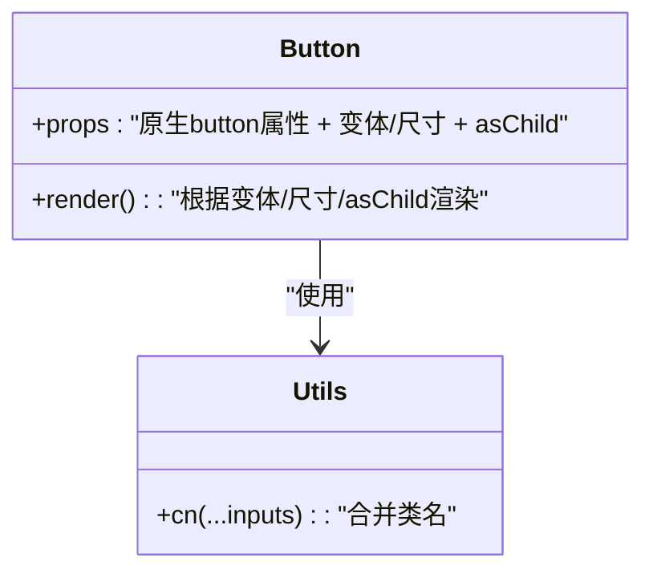
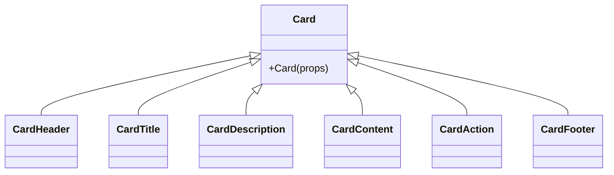
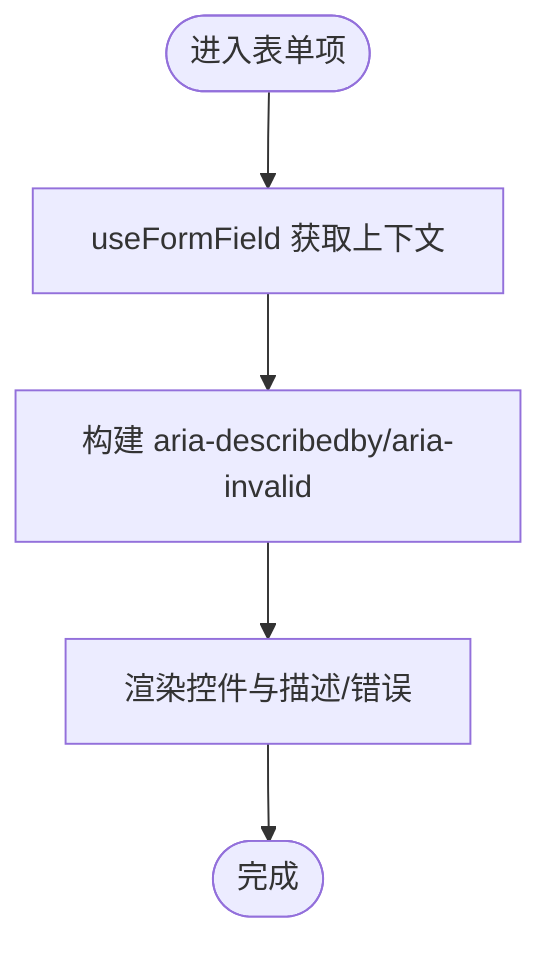
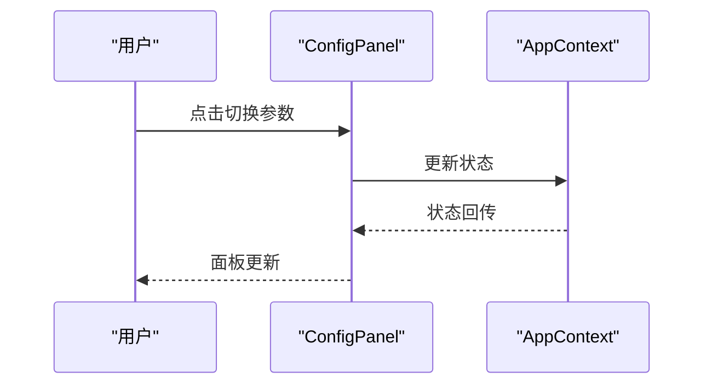
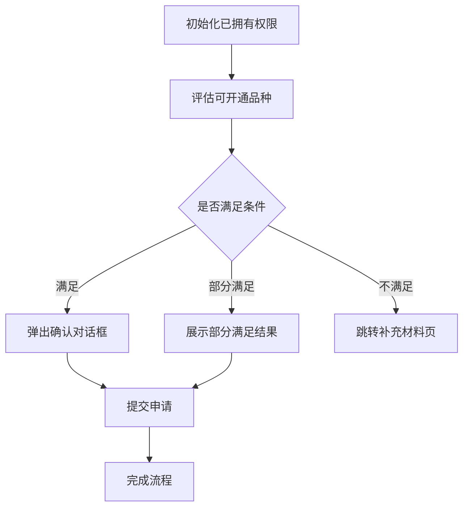
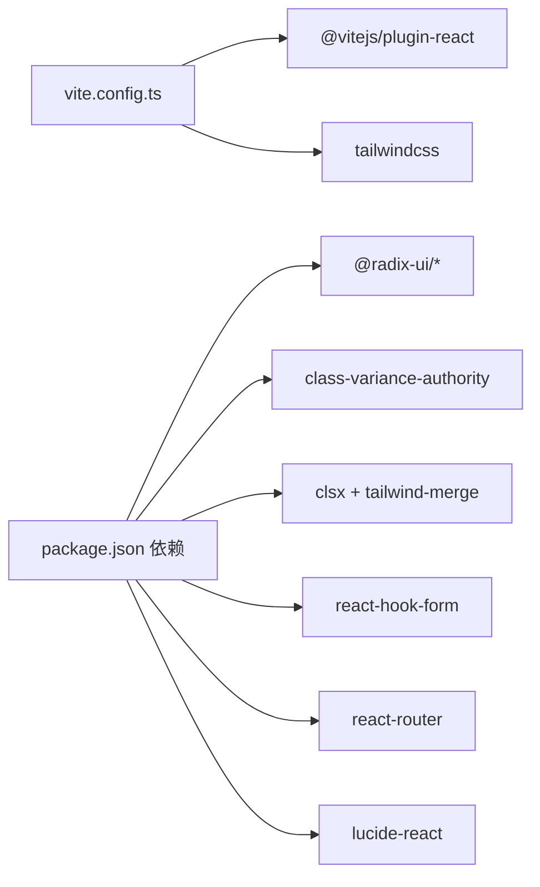

# 组件架构

<cite>
**本文引用的文件**
- [button.tsx](file://src/app/components/ui/button.tsx)
- [card.tsx](file://src/app/components/ui/card.tsx)
- [form.tsx](file://src/app/components/ui/form.tsx)
- [utils.ts](file://src/app/components/ui/utils.ts)
- [AppContext.tsx](file://src/app/store/AppContext.tsx)
- [WarehouseContext.tsx](file://src/app/store/WarehouseContext.tsx)
- [App.tsx](file://src/app/App.tsx)
- [layout.tsx](file://src/app/layout.tsx)
- [routes.tsx](file://src/app/routes.tsx)
- [Home.tsx](file://src/app/pages/Home.tsx)
- [ConfigPanel.tsx](file://src/app/components/ConfigPanel.tsx)
- [use-mobile.ts](file://src/app/components/ui/use-mobile.ts)
- [tailwind.css](file://src/styles/tailwind.css)
- [vite.config.ts](file://vite.config.ts)
- [package.json](file://package.json)
- [Guidelines.md](file://guidelines/Guidelines.md)
</cite>

## 目录
1. [引言](#引言)
2. [项目结构](#项目结构)
3. [核心组件](#核心组件)
4. [架构总览](#架构总览)
5. [详细组件分析](#详细组件分析)
6. [依赖关系分析](#依赖关系分析)
7. [性能考虑](#性能考虑)
8. [故障排查指南](#故障排查指南)
9. [结论](#结论)
10. [附录](#附录)

## 引言
本文件面向组件化设计与实现，系统梳理本项目的组件层次结构与组织原则，明确原子组件（UI 组件库）与业务组件的关系，阐述组件复用策略、组合模式与通信机制；覆盖生命周期管理、性能优化策略与可访问性设计；并给出组件开发规范、测试策略与文档标准，帮助团队在复杂业务场景下保持一致的组件质量与交付效率。

## 项目结构
项目采用“按功能域分层 + 组件库沉淀”的组织方式：
- 原子组件库集中于 src/app/components/ui，提供通用 UI 能力（按钮、卡片、表单、工具函数等）
- 业务组件位于 src/app/components，包含配置面板、流程记录等业务拼装组件
- 页面组件位于 src/app/pages，承载具体业务流程与交互
- 应用上下文与仓库上下文分别位于 src/app/store，提供跨页面的状态共享
- 路由与布局位于 src/app，统一导航、面包屑与主内容区
- 构建与样式配置位于根目录与 src/styles，使用 Vite + TailwindCSS



**图表来源**
- [App.tsx:1-6](file://src/app/App.tsx#L1-L6)
- [routes.tsx:1-38](file://src/app/routes.tsx#L1-L38)
- [layout.tsx:1-175](file://src/app/layout.tsx#L1-L175)
- [AppContext.tsx:1-64](file://src/app/store/AppContext.tsx#L1-L64)
- [WarehouseContext.tsx:1-185](file://src/app/store/WarehouseContext.tsx#L1-L185)
- [button.tsx:1-59](file://src/app/components/ui/button.tsx#L1-L59)
- [card.tsx:1-93](file://src/app/components/ui/card.tsx#L1-L93)
- [form.tsx:1-169](file://src/app/components/ui/form.tsx#L1-L169)
- [utils.ts:1-7](file://src/app/components/ui/utils.ts#L1-L7)
- [use-mobile.ts:1-22](file://src/app/components/ui/use-mobile.ts#L1-L22)
- [ConfigPanel.tsx:1-134](file://src/app/components/ConfigPanel.tsx#L1-L134)
- [Home.tsx:1-809](file://src/app/pages/Home.tsx#L1-L809)

**章节来源**
- [App.tsx:1-6](file://src/app/App.tsx#L1-L6)
- [routes.tsx:1-38](file://src/app/routes.tsx#L1-L38)
- [layout.tsx:1-175](file://src/app/layout.tsx#L1-L175)
- [vite.config.ts:1-37](file://vite.config.ts#L1-L37)
- [tailwind.css:1-5](file://src/styles/tailwind.css#L1-L5)

## 核心组件
- 原子组件（UI 组件库）
  - 按钮：支持变体与尺寸，具备可组合渲染能力，便于语义化标签与 SVG 图标嵌入
  - 卡片：提供卡片容器与标题/描述/内容/脚注等子组件，配合网格布局与响应式断点
  - 表单：基于 react-hook-form 的表单上下文与字段上下文，提供标签、控件、描述与错误消息的可访问性绑定
  - 工具函数：cn 合并类名，确保 Tailwind 与条件类名的正确合并
- 业务组件
  - 配置面板：用于在首页快速切换风险等级、资金规模、交易经历等参数，辅助演示与调试
- 上下文
  - AppContext：交易权限相关全局状态（风险等级、资金规模、既有最高权限等）
  - WarehouseContext：移仓业务相关全局状态（方向、合约类型、出入金方信息、附件等）

**章节来源**
- [button.tsx:1-59](file://src/app/components/ui/button.tsx#L1-L59)
- [card.tsx:1-93](file://src/app/components/ui/card.tsx#L1-L93)
- [form.tsx:1-169](file://src/app/components/ui/form.tsx#L1-L169)
- [utils.ts:1-7](file://src/app/components/ui/utils.ts#L1-L7)
- [ConfigPanel.tsx:1-134](file://src/app/components/ConfigPanel.tsx#L1-L134)
- [AppContext.tsx:1-64](file://src/app/store/AppContext.tsx#L1-L64)
- [WarehouseContext.tsx:1-185](file://src/app/store/WarehouseContext.tsx#L1-L185)

## 架构总览
应用采用“路由驱动 + 上下文共享 + 组件库复用”的架构：
- 路由层负责页面级视图切换与嵌套
- 布局层负责侧边导航、面包屑、头部与主内容区
- 上下文层提供跨页面状态共享，避免 props drilling
- UI 组件库沉淀通用能力，业务组件以组合方式装配



**图表来源**
- [layout.tsx:74-174](file://src/app/layout.tsx#L74-L174)
- [routes.tsx:18-38](file://src/app/routes.tsx#L18-L38)
- [Home.tsx:61-809](file://src/app/pages/Home.tsx#L61-L809)
- [AppContext.tsx:31-63](file://src/app/store/AppContext.tsx#L31-L63)
- [WarehouseContext.tsx:77-184](file://src/app/store/WarehouseContext.tsx#L77-L184)
- [button.tsx:37-56](file://src/app/components/ui/button.tsx#L37-L56)
- [card.tsx:5-82](file://src/app/components/ui/card.tsx#L5-L82)
- [form.tsx:76-157](file://src/app/components/ui/form.tsx#L76-L157)

## 详细组件分析

### 原子组件：按钮 Button
- 设计要点
  - 使用变体与尺寸的组合，通过类名变体库生成不同视觉态
  - 支持 asChild 渲染为任意 HTML 标签，增强语义化与可组合性
  - 集成无障碍属性（如 aria-invalid），提升可访问性
- 复用策略
  - 在页面中统一使用，减少重复样式代码
  - 与图标组件组合，形成带图标的按钮
- 生命周期与事件
  - 作为受控组件，事件处理集中在上层页面逻辑中



**图表来源**
- [button.tsx:37-56](file://src/app/components/ui/button.tsx#L37-L56)
- [utils.ts:4-6](file://src/app/components/ui/utils.ts#L4-L6)

**章节来源**
- [button.tsx:1-59](file://src/app/components/ui/button.tsx#L1-L59)
- [utils.ts:1-7](file://src/app/components/ui/utils.ts#L1-L7)

### 原子组件：卡片 Card
- 设计要点
  - 提供卡片容器与多个子组件（头、标题、描述、内容、动作、脚注）
  - 子组件通过 data-slot 标记，利于主题与样式系统识别
  - 响应式网格与对齐，适配多列布局
- 复用策略
  - 页面中以组合方式拼装，减少重复结构代码
- 可访问性
  - 子组件通过语义化标签与数据标记，便于屏幕阅读器识别



**图表来源**
- [card.tsx:5-92](file://src/app/components/ui/card.tsx#L5-L92)

**章节来源**
- [card.tsx:1-93](file://src/app/components/ui/card.tsx#L1-L93)

### 原子组件：表单 Form
- 设计要点
  - 基于 react-hook-form 的 Provider 与字段上下文，提供 useFormField 钩子
  - 自动维护 aria-* 属性与可访问性 ID 绑定
  - 支持描述文本与错误消息的统一展示
- 复用策略
  - 页面中以 FormItem/FormLabel/FormControl/FormDescription/FormMessage 组合使用
- 生命周期
  - 字段状态变化时自动更新 aria-invalid 与 aria-describedby



**图表来源**
- [form.tsx:45-157](file://src/app/components/ui/form.tsx#L45-L157)

**章节来源**
- [form.tsx:1-169](file://src/app/components/ui/form.tsx#L1-L169)

### 业务组件：配置面板 ConfigPanel
- 设计要点
  - 通过 AppContext 控制风险等级、资金规模、交易经历等参数
  - 支持折叠/展开，减少对主界面干扰
- 复用策略
  - 仅在首页展示，便于演示与调试



**图表来源**
- [ConfigPanel.tsx:6-133](file://src/app/components/ConfigPanel.tsx#L6-L133)
- [AppContext.tsx:31-63](file://src/app/store/AppContext.tsx#L31-L63)

**章节来源**
- [ConfigPanel.tsx:1-134](file://src/app/components/ConfigPanel.tsx#L1-L134)
- [AppContext.tsx:1-64](file://src/app/store/AppContext.tsx#L1-L64)

### 页面组件：首页 Home
- 设计要点
  - 以向导步骤串联业务流程
  - 基于 AppContext 决策是否允许勾选特定品种
  - 使用 Dialog/Modal 进行提示与确认
- 组合模式
  - 多个 UI 组件与业务组件组合，形成完整的业务页面
- 生命周期
  - 使用 useEffect 初始化已拥有权限，避免重复设置



**图表来源**
- [Home.tsx:70-231](file://src/app/pages/Home.tsx#L70-L231)
- [AppContext.tsx:31-63](file://src/app/store/AppContext.tsx#L31-L63)

**章节来源**
- [Home.tsx:1-809](file://src/app/pages/Home.tsx#L1-L809)
- [AppContext.tsx:1-64](file://src/app/store/AppContext.tsx#L1-L64)

### 上下文：AppContext 与 WarehouseContext
- 设计要点
  - AppContext 管理交易权限相关全局状态
  - WarehouseContext 管理移仓业务相关全局状态
- 通信机制
  - 通过 React Context 在组件树中传递，避免 props drilling
- 生命周期
  - Provider 包裹在布局层，确保所有页面可用

```mermaid
classDiagram
class AppContext {
+riskLevel : "C3/C4/C5"
+fundLevel : "LT_500K/GE_500K_LT_1M/GE_1M"
+has50Days : "boolean"
+existingMaxValue : "number"
+setRiskLevel(level)
+setFundLevel(level)
+setHas50Days(has)
+setExistingMaxValue(val)
}
class WarehouseContext {
+selectedExchanges : "WarehouseExchange[]"
+direction : "OUT/IN/ACTUAL_CONTROL"
+contractType : "FUTURES/OPTIONS"
+positions : "PositionRow[]"
+attachments : "{name,size}[]"
+setPositions(rows)
+setAttachments(files)
+reset()
}
```

**图表来源**
- [AppContext.tsx:6-27](file://src/app/store/AppContext.tsx#L6-L27)
- [WarehouseContext.tsx:19-73](file://src/app/store/WarehouseContext.tsx#L19-L73)

**章节来源**
- [AppContext.tsx:1-64](file://src/app/store/AppContext.tsx#L1-L64)
- [WarehouseContext.tsx:1-185](file://src/app/store/WarehouseContext.tsx#L1-L185)

## 依赖关系分析
- 构建与样式
  - Vite 插件链包含 React 与 TailwindCSS，支持原生 SVG 与 CSV 资源导入
  - TailwindCSS 通过源扫描自动提取类名，保证产物体积可控
- 依赖生态
  - UI 原子组件依赖 Radix UI、class-variance-authority、clsx、tailwind-merge
  - 表单组件依赖 react-hook-form
  - 移动端断点检测依赖自定义 Hook



**图表来源**
- [vite.config.ts:1-37](file://vite.config.ts#L1-L37)
- [package.json:11-66](file://package.json#L11-L66)

**章节来源**
- [vite.config.ts:1-37](file://vite.config.ts#L1-L37)
- [package.json:1-91](file://package.json#L1-L91)

## 性能考虑
- 组件复用与拆分
  - 将通用 UI 能力下沉到 UI 组件库，减少重复渲染与样式计算
- 类名合并
  - 使用 cn 合并类名，避免冗余样式与冲突
- 懒加载与按需
  - 对重型图表/轮播等组件采用懒加载策略（建议）
- 渲染优化
  - 使用 React.memo/useMemo/useCallback 缓存昂贵计算与子组件渲染
- 样式体积
  - TailwindCSS 源扫描仅提取实际使用的类名，降低打包体积
- 移动端体验
  - useIsMobile 提供断点检测，便于在移动端进行差异化渲染

**章节来源**
- [utils.ts:1-7](file://src/app/components/ui/utils.ts#L1-L7)
- [use-mobile.ts:1-22](file://src/app/components/ui/use-mobile.ts#L1-L22)
- [tailwind.css:1-5](file://src/styles/tailwind.css#L1-L5)

## 故障排查指南
- 表单无障碍问题
  - 确认 FormLabel 与 FormControl 的 ID 绑定正确，避免 aria-invalid 与 aria-describedby 不一致
- 上下文使用错误
  - 确保在 AppProvider/WarehouseProvider 内部使用 useAppContext/useWarehouseContext
- 路由与布局
  - 确认路由配置与布局嵌套正确，避免 Outlet 未渲染
- 移动端断点
  - 检查 useIsMobile 的断点常量与媒体查询监听是否生效

**章节来源**
- [form.tsx:90-124](file://src/app/components/ui/form.tsx#L90-L124)
- [AppContext.tsx:59-63](file://src/app/store/AppContext.tsx#L59-L63)
- [WarehouseContext.tsx:180-184](file://src/app/store/WarehouseContext.tsx#L180-L184)
- [routes.tsx:18-38](file://src/app/routes.tsx#L18-L38)
- [layout.tsx:74-174](file://src/app/layout.tsx#L74-L174)
- [use-mobile.ts:5-21](file://src/app/components/ui/use-mobile.ts#L5-L21)

## 结论
本项目通过清晰的组件分层与上下文共享，实现了 UI 组件库与业务组件的解耦；在路由与布局层面统一了导航与内容区，结合表单与上下文能力，支撑复杂的业务流程。建议持续完善测试策略与文档标准，进一步提升组件复用率与可维护性。

## 附录

### 组件开发规范
- 原子组件
  - 使用变体/尺寸参数控制外观，支持 asChild 与 data-slot 标记
  - 明确无障碍属性与键盘可达性
- 业务组件
  - 以组合为主，尽量无状态或轻状态
  - 通过上下文与 props 接口与页面解耦
- 命名与文件组织
  - 组件文件与功能域对应，避免过深层级
- 文档与示例
  - 为每个组件提供最小可运行示例与变更日志

**章节来源**
- [Guidelines.md:1-62](file://guidelines/Guidelines.md#L1-L62)

### 测试策略
- 单元测试
  - 针对纯函数与 Hook（如 useIsMobile）编写测试
- 组件测试
  - 使用可访问性测试库验证 aria 属性与键盘可达性
- 端到端测试
  - 覆盖关键业务流程（如首页权限评估与提交）

### 组件文档标准
- 文件命名与目录
  - 组件文件采用 PascalCase，与功能域目录一一对应
- API 文档
  - 明确 props 类型、默认值与行为约束
- 变更记录
  - 记录破坏性变更与迁移指南