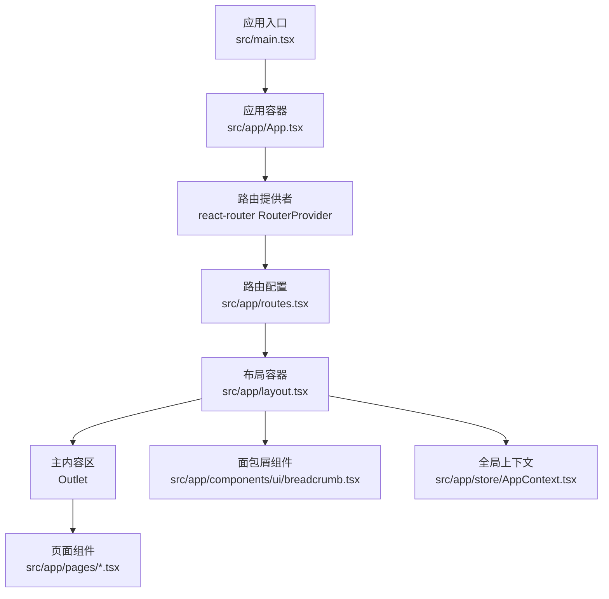
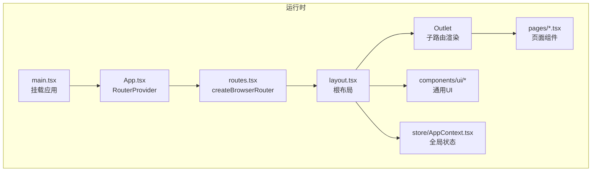
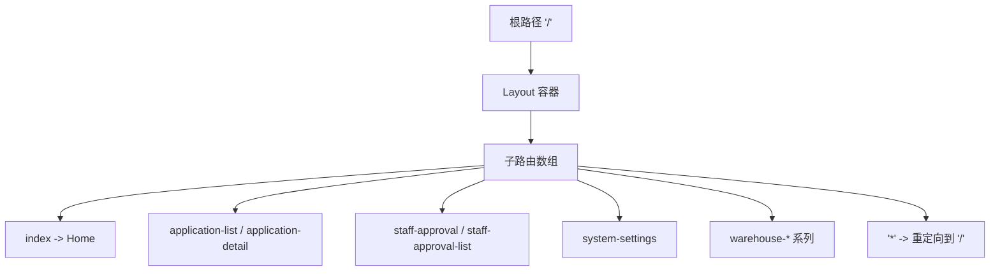
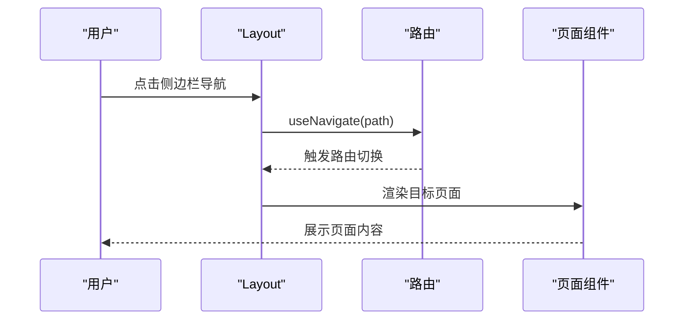
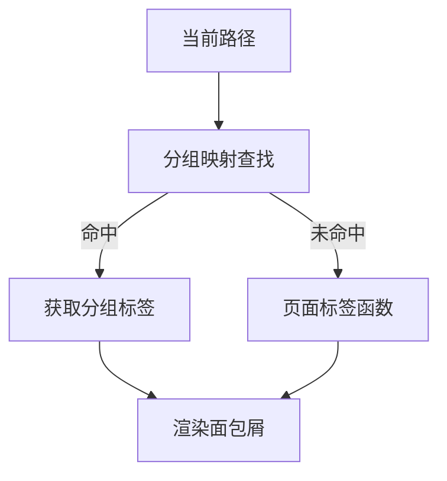
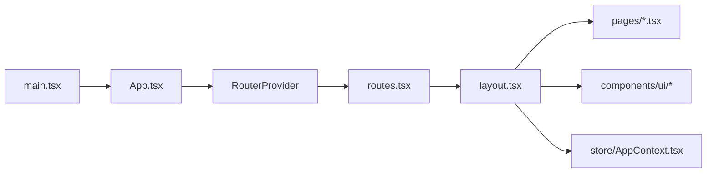

# 路由系统设计

<cite>
**本文引用的文件**
- [src/app/routes.tsx](file://src/app/routes.tsx)
- [permission_apply/src/app/routes.tsx](file://permission_apply/src/app/routes.tsx)
- [src/app/layout.tsx](file://src/app/layout.tsx)
- [permission_apply/src/app/layout.tsx](file://permission_apply/src/app/layout.tsx)
- [src/app/pages/Home.tsx](file://src/app/pages/Home.tsx)
- [permission_apply/src/app/pages/Home.tsx](file://permission_apply/src/app/pages/Home.tsx)
- [src/app/components/ui/breadcrumb.tsx](file://src/app/components/ui/breadcrumb.tsx)
- [permission_apply/src/app/components/ui/breadcrumb.tsx](file://permission_apply/src/app/components/ui/breadcrumb.tsx)
- [src/app/store/AppContext.tsx](file://src/app/store/AppContext.tsx)
- [permission_apply/src/app/store/AppContext.tsx](file://permission_apply/src/app/store/AppContext.tsx)
- [src/app/App.tsx](file://src/app/App.tsx)
- [permission_apply/src/app/App.tsx](file://permission_apply/src/app/App.tsx)
- [src/main.tsx](file://src/main.tsx)
</cite>

## 目录
1. [引言](#引言)
2. [项目结构](#项目结构)
3. [核心组件](#核心组件)
4. [架构总览](#架构总览)
5. [详细组件分析](#详细组件分析)
6. [依赖关系分析](#依赖关系分析)
7. [性能考量](#性能考量)
8. [故障排查指南](#故障排查指南)
9. [结论](#结论)
10. [附录](#附录)

## 引言
本设计文档围绕基于 React Router 的前端路由体系进行系统化梳理，覆盖路由配置策略、嵌套路由设计、动态路由参数处理、导航守卫机制、路由懒加载实现、页面切换动画效果、路由权限控制、面包屑导航、SEO 优化以及扩展与接入规范。文档以实际代码为依据，结合可视化图示帮助读者快速理解并高效扩展。

## 项目结构
- 采用“多应用”结构：根目录与 permission_apply 子项目分别维护独立的路由与布局，共享通用 UI 组件库。
- 路由集中于 routes.tsx，统一使用 createBrowserRouter 构建浏览器历史模式路由。
- 布局层通过 Layout 组件包裹所有子路由，负责侧边栏导航、面包屑、全局状态注入等。
- 页面组件位于 pages 目录，按功能模块划分；通用 UI 组件位于 components/ui。

图表来源
- [src/main.tsx:1-7](file://src/main.tsx#L1-L7)
- [src/app/App.tsx:1-6](file://src/app/App.tsx#L1-L6)
- [src/app/routes.tsx:1-38](file://src/app/routes.tsx#L1-L38)
- [src/app/layout.tsx:1-175](file://src/app/layout.tsx#L1-L175)
- [src/app/pages/Home.tsx:1-809](file://src/app/pages/Home.tsx#L1-L809)
- [src/app/components/ui/breadcrumb.tsx:1-110](file://src/app/components/ui/breadcrumb.tsx#L1-L110)
- [src/app/store/AppContext.tsx:1-64](file://src/app/store/AppContext.tsx#L1-L64)

章节来源
- [src/app/routes.tsx:1-38](file://src/app/routes.tsx#L1-L38)
- [src/app/layout.tsx:1-175](file://src/app/layout.tsx#L1-L175)
- [src/app/App.tsx:1-6](file://src/app/App.tsx#L1-L6)
- [src/main.tsx:1-7](file://src/main.tsx#L1-L7)

## 核心组件
- 路由配置：使用 createBrowserRouter 定义根路径 "/"，子路由通过 children 数组声明，包含首页、申请流程、审批、系统设置及仓库相关页面。
- 布局容器：Layout 负责侧边栏导航、面包屑渲染、顶部标题、全局 Provider 注入与条件展示的配置面板。
- 页面组件：Home 等页面通过 useNavigate/useLocation 进行导航跳转与状态传递，体现路由驱动的页面行为。
- 面包屑组件：基于 Radix Slot 的语义化面包屑 UI 组件，配合 Layout 中的分组映射与页面标签函数生成层级路径。
- 全局上下文：AppContext 提供风控等级、资金规模、是否已开通等状态，供页面逻辑与导航联动。

章节来源
- [src/app/routes.tsx:18-38](file://src/app/routes.tsx#L18-L38)
- [src/app/layout.tsx:74-175](file://src/app/layout.tsx#L74-L175)
- [src/app/pages/Home.tsx:61-809](file://src/app/pages/Home.tsx#L61-L809)
- [src/app/components/ui/breadcrumb.tsx:7-110](file://src/app/components/ui/breadcrumb.tsx#L7-L110)
- [src/app/store/AppContext.tsx:6-64](file://src/app/store/AppContext.tsx#L6-L64)

## 架构总览
React Router v6 生态下的浏览器历史模式路由，通过 RouterProvider 注入 router 实例；Layout 作为根级 Outlet 容器承载所有子路由；页面组件通过 React Hooks 与上下文交互，实现导航、状态与 UI 的解耦。

图表来源
- [src/main.tsx:1-7](file://src/main.tsx#L1-L7)
- [src/app/App.tsx:1-6](file://src/app/App.tsx#L1-L6)
- [src/app/routes.tsx:18-38](file://src/app/routes.tsx#L18-L38)
- [src/app/layout.tsx:74-175](file://src/app/layout.tsx#L74-L175)
- [src/app/store/AppContext.tsx:31-64](file://src/app/store/AppContext.tsx#L31-L64)

## 详细组件分析

### 路由配置与嵌套路由
- 根路径 "/" 对应 Layout，其 children 定义了完整的页面集合，形成一级嵌套路由。
- 通配符 "*" 路由重定向到根路径，保证未知路径安全回退。
- 子路由命名遵循语义化路径，便于维护与 SEO。

图表来源
- [src/app/routes.tsx:18-38](file://src/app/routes.tsx#L18-L38)

章节来源
- [src/app/routes.tsx:18-38](file://src/app/routes.tsx#L18-L38)

### 导航守卫机制
- 当前实现未显式定义全局或路由级守卫钩子。页面跳转主要通过 useNavigate 与 useLocation 控制，状态传递通过 location.state 实现。
- 若需实现权限校验，可在 Layout 或页面组件中读取用户上下文，结合路由路径进行前置判断与拦截。

图表来源
- [src/app/layout.tsx:75-114](file://src/app/layout.tsx#L75-L114)
- [src/app/pages/Home.tsx:61-809](file://src/app/pages/Home.tsx#L61-L809)

章节来源
- [src/app/layout.tsx:75-114](file://src/app/layout.tsx#L75-L114)
- [src/app/pages/Home.tsx:61-809](file://src/app/pages/Home.tsx#L61-L809)

### 动态路由参数处理
- 代码中未见动态段（如 :id）与 useParams 使用。若后续需要参数化页面（例如详情页），建议在 routes.tsx 中引入动态段，并在页面组件中通过 useSearchParams/useParams 获取参数。
- 参数校验与默认值处理可通过页面组件内部逻辑完成，避免无效参数导致的异常。

章节来源
- [src/app/routes.tsx:18-38](file://src/app/routes.tsx#L18-L38)

### 面包屑导航
- 布局层维护分组映射与页面标签函数，根据当前路径动态生成面包屑层级。
- 通用面包屑组件提供语义化结构，便于扩展复杂场景。

图表来源
- [src/app/layout.tsx:42-72](file://src/app/layout.tsx#L42-L72)
- [src/app/components/ui/breadcrumb.tsx:7-110](file://src/app/components/ui/breadcrumb.tsx#L7-L110)

章节来源
- [src/app/layout.tsx:42-72](file://src/app/layout.tsx#L42-L72)
- [src/app/components/ui/breadcrumb.tsx:7-110](file://src/app/components/ui/breadcrumb.tsx#L7-L110)

### 页面切换与状态传递
- 页面通过 useNavigate 与 location.state 在路由间传递数据，实现“从列表到详情”的平滑过渡。
- 可结合 React Router 的 state 字段实现轻量状态持久化，避免复杂状态管理侵入。

章节来源
- [src/app/pages/Home.tsx:61-809](file://src/app/pages/Home.tsx#L61-L809)

### 路由懒加载实现
- 当前路由配置未使用 React.lazy 与 Suspense 进行异步加载。对于大型应用，建议对重型页面组件进行懒加载，以降低首屏体积与提升性能。
- 懒加载方案可参考：在 routes.tsx 中将页面组件替换为动态导入的 Promise，再由 RouterProvider 自动处理加载状态。

章节来源
- [src/app/routes.tsx:18-38](file://src/app/routes.tsx#L18-L38)

### 页面切换动画效果
- 代码中未发现专门的路由切换动画实现。可在布局层或页面容器外层引入过渡动画库（如 Framer Motion、CSS 过渡），结合路由变化事件进行入场/离场动画。
- 动画应与用户体验一致，避免影响可访问性与性能。

章节来源
- [src/app/layout.tsx:74-175](file://src/app/layout.tsx#L74-L175)

### 路由权限控制
- 未见显式的鉴权守卫。建议在 Layout 或页面组件中引入权限上下文，对敏感路径进行访问控制。
- 可结合路由元信息（meta）与自定义 Hook 实现细粒度权限校验。

章节来源
- [src/app/layout.tsx:74-175](file://src/app/layout.tsx#L74-L175)

### SEO 优化考虑
- 当前未集成 Head 元信息管理。建议引入 react-helmet 或同等方案，在各页面动态设置 title、description 等。
- 静态站点生成（SSG）或服务端渲染（SSR）可进一步提升 SEO 表现，但需评估迁移成本。

章节来源
- [src/app/pages/Home.tsx:61-809](file://src/app/pages/Home.tsx#L61-L809)

### 新页面接入规范与扩展指南
- 路由接入：在 routes.tsx 的 children 数组中新增条目，确保路径语义清晰且与 Layout 导航保持一致。
- 布局适配：如需侧边栏高亮与面包屑联动，完善 NAV_GROUPS 与分组映射。
- 状态管理：通过 AppContext 提供必要的全局状态，避免页面间重复计算。
- 性能优化：对重型页面启用懒加载；对频繁切换的页面考虑缓存策略。
- 可访问性：为面包屑与导航提供键盘可达性与屏幕阅读器友好的标签。

章节来源
- [src/app/routes.tsx:18-38](file://src/app/routes.tsx#L18-L38)
- [src/app/layout.tsx:34-72](file://src/app/layout.tsx#L34-L72)
- [src/app/store/AppContext.tsx:31-64](file://src/app/store/AppContext.tsx#L31-L64)

## 依赖关系分析
- 应用入口依赖应用容器；应用容器依赖 RouterProvider；路由提供者依赖路由配置；路由配置依赖布局与页面组件。
- 布局依赖 UI 组件库与全局上下文；页面组件依赖布局与上下文。
- permission_apply 子项目复用相同模式，但路由集更精简。

图表来源
- [src/main.tsx:1-7](file://src/main.tsx#L1-L7)
- [src/app/App.tsx:1-6](file://src/app/App.tsx#L1-L6)
- [src/app/routes.tsx:18-38](file://src/app/routes.tsx#L18-L38)
- [src/app/layout.tsx:74-175](file://src/app/layout.tsx#L74-L175)
- [src/app/store/AppContext.tsx:31-64](file://src/app/store/AppContext.tsx#L31-L64)

章节来源
- [src/app/App.tsx:1-6](file://src/app/App.tsx#L1-L6)
- [src/app/routes.tsx:18-38](file://src/app/routes.tsx#L18-L38)
- [src/app/layout.tsx:74-175](file://src/app/layout.tsx#L74-L175)

## 性能考量
- 路由懒加载：对重型页面组件启用动态导入，减少首屏 JS 体积。
- 路由缓存：对频繁访问的页面采用缓存策略，避免重复渲染。
- 图片与资源：结合图片懒加载与 CDN 加速，提升整体加载体验。
- 动画与过渡：谨慎使用复杂动画，避免阻塞主线程。

## 故障排查指南
- 未知路径跳转：检查 routes.tsx 中通配符重定向逻辑，确保兜底路径有效。
- 导航高亮异常：核对 Layout 中的 isActive 判断与 NAV_GROUPS 映射，确保路径匹配规则正确。
- 面包屑缺失：确认分组映射与页面标签函数是否覆盖当前路径。
- 状态丢失：检查页面跳转时是否正确使用 location.state，避免误传或遗漏。

章节来源
- [src/app/routes.tsx:35](file://src/app/routes.tsx#L35)
- [src/app/layout.tsx:95-114](file://src/app/layout.tsx#L95-L114)
- [src/app/layout.tsx:42-72](file://src/app/layout.tsx#L42-L72)
- [src/app/pages/Home.tsx:66-68](file://src/app/pages/Home.tsx#L66-L68)

## 结论
本路由系统以 React Router v6 为基础，通过集中式路由配置与布局容器实现清晰的页面组织与导航体验。当前版本侧重功能完备与可维护性，未来可在权限控制、懒加载、动画与 SEO 方面进一步增强，以满足更高性能与可访问性的需求。

## 附录
- 术语说明
  - 嵌套路由：父级路由下包含子路由集合，通过 Outlet 渲染。
  - 导航守卫：在路由切换前后执行的前置校验逻辑。
  - 懒加载：按需加载页面组件，降低初始加载压力。
  - 面包屑：指示当前页面在网站结构中的位置。
  - SEO：搜索引擎优化，包括标题、描述与结构化数据等。