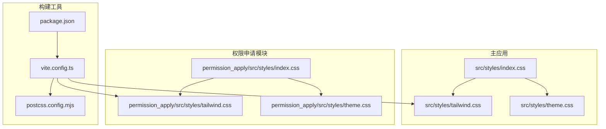
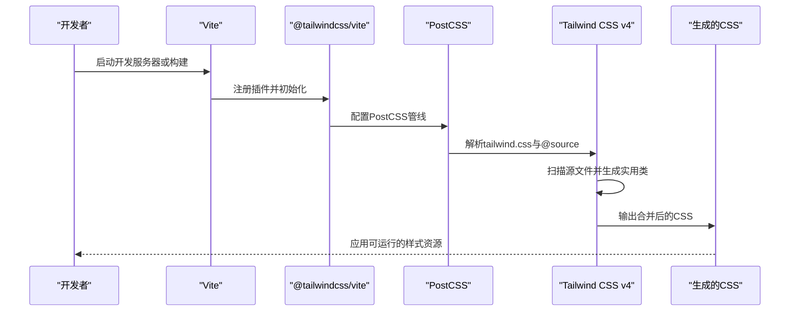
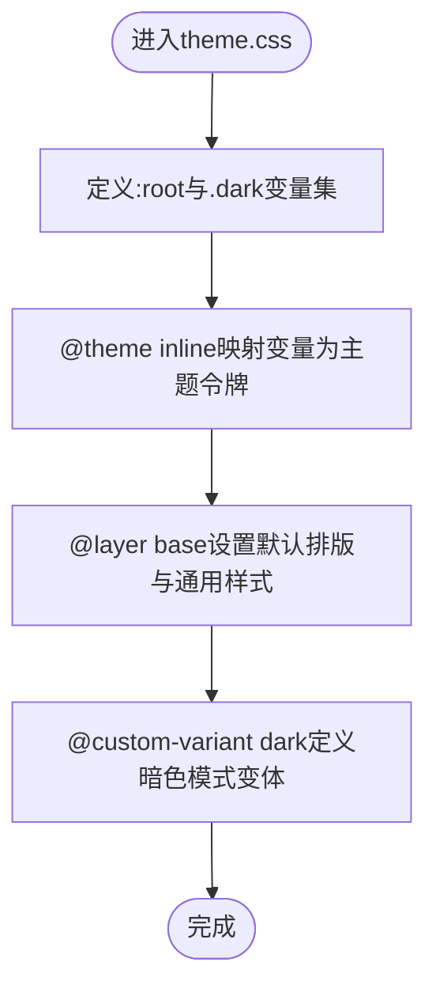
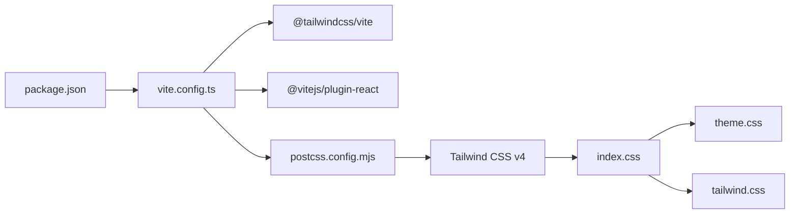

# Tailwind CSS配置

<cite>
**本文档引用的文件**
- [tailwind.css（主应用）](file://src/styles/tailwind.css)
- [tailwind.css（权限申请模块）](file://permission_apply/src/styles/tailwind.css)
- [index.css（主应用）](file://src/styles/index.css)
- [index.css（权限申请模块）](file://permission_apply/src/styles/index.css)
- [theme.css（主应用）](file://src/styles/theme.css)
- [theme.css（权限申请模块）](file://permission_apply/src/styles/theme.css)
- [postcss.config.mjs（主应用）](file://postcss.config.mjs)
- [postcss.config.mjs（权限申请模块）](file://permission_apply/postcss.config.mjs)
- [vite.config.ts（主应用）](file://vite.config.ts)
- [vite.config.ts（权限申请模块）](file://permission_apply/vite.config.ts)
- [package.json（主应用）](file://package.json)
- [package.json（权限申请模块）](file://permission_apply/package.json)
</cite>

## 目录
1. [简介](#简介)
2. [项目结构](#项目结构)
3. [核心组件](#核心组件)
4. [架构总览](#架构总览)
5. [详细组件分析](#详细组件分析)
6. [依赖关系分析](#依赖关系分析)
7. [性能考虑](#性能考虑)
8. [故障排除指南](#故障排除指南)
9. [结论](#结论)
10. [附录](#附录)

## 简介
本文件系统性梳理了本仓库中Tailwind CSS v4的配置与使用方式，重点覆盖以下方面：
- tailwind.css的导入与源码扫描机制
- 实用类生成规则与自定义工具类定义
- PostCSS处理流程与插件配置
- 响应式断点与暗色模式支持
- 构建优化策略与最佳实践

通过结合Vite、@tailwindcss/vite以及主题变量体系，实现从开发到生产的一致化样式构建。

## 项目结构
Tailwind CSS在本项目中采用“按模块分离”的组织方式：主应用与权限申请模块各自维护独立的样式入口与主题配置，但共享相同的构建链路与工具链。

图表来源
- [index.css（主应用）:1-4](file://src/styles/index.css#L1-L4)
- [tailwind.css（主应用）:1-5](file://src/styles/tailwind.css#L1-L5)
- [theme.css（主应用）:1-182](file://src/styles/theme.css#L1-L182)
- [index.css（权限申请模块）:1-4](file://permission_apply/src/styles/index.css#L1-L4)
- [tailwind.css（权限申请模块）:1-5](file://permission_apply/src/styles/tailwind.css#L1-L5)
- [theme.css（权限申请模块）:1-182](file://permission_apply/src/styles/theme.css#L1-L182)
- [vite.config.ts（主应用）:1-37](file://vite.config.ts#L1-L37)
- [postcss.config.mjs（主应用）:1-16](file://postcss.config.mjs#L1-L16)
- [package.json（主应用）:1-91](file://package.json#L1-L91)

章节来源
- [index.css（主应用）:1-4](file://src/styles/index.css#L1-L4)
- [index.css（权限申请模块）:1-4](file://permission_apply/src/styles/index.css#L1-L4)
- [tailwind.css（主应用）:1-5](file://src/styles/tailwind.css#L1-L5)
- [tailwind.css（权限申请模块）:1-5](file://permission_apply/src/styles/tailwind.css#L1-L5)
- [theme.css（主应用）:1-182](file://src/styles/theme.css#L1-L182)
- [theme.css（权限申请模块）:1-182](file://permission_apply/src/styles/theme.css#L1-L182)
- [vite.config.ts（主应用）:1-37](file://vite.config.ts#L1-L37)
- [postcss.config.mjs（主应用）:1-16](file://postcss.config.mjs#L1-L16)
- [package.json（主应用）:1-91](file://package.json#L1-L91)

## 核心组件
- tailwind.css：定义Tailwind CSS的导入与源码扫描范围，并引入动画扩展插件。
- index.css：统一聚合字体、Tailwind与主题样式，作为全局入口。
- theme.css：定义CSS变量、@theme映射与@layer base层的基础排版与默认样式；同时声明暗色模式变体。
- Vite + @tailwindcss/vite：自动注入PostCSS管线与Tailwind处理，无需手动配置tailwindcss/autoprefixer。
- PostCSS配置：当前为空对象，用于扩展额外插件（如嵌套等）。

章节来源
- [tailwind.css（主应用）:1-5](file://src/styles/tailwind.css#L1-L5)
- [tailwind.css（权限申请模块）:1-5](file://permission_apply/src/styles/tailwind.css#L1-L5)
- [index.css（主应用）:1-4](file://src/styles/index.css#L1-L4)
- [index.css（权限申请模块）:1-4](file://permission_apply/src/styles/index.css#L1-L4)
- [theme.css（主应用）:1-182](file://src/styles/theme.css#L1-L182)
- [theme.css（权限申请模块）:1-182](file://permission_apply/src/styles/theme.css#L1-L182)
- [vite.config.ts（主应用）:1-37](file://vite.config.ts#L1-L37)
- [postcss.config.mjs（主应用）:1-16](file://postcss.config.mjs#L1-L16)

## 架构总览
Tailwind v4在本项目中的工作流如下：
- Vite启动时加载@tailwindcss/vite插件，自动建立PostCSS管线。
- PostCSS读取tailwind.css中的@import与@source指令，确定扫描源文件范围。
- Tailwind根据源文件中的类名生成实用类，并合并主题变量与基础层。
- 最终输出到index.css中，供应用运行时使用。

图表来源
- [vite.config.ts（主应用）:19-26](file://vite.config.ts#L19-L26)
- [postcss.config.mjs（主应用）:1-16](file://postcss.config.mjs#L1-L16)
- [tailwind.css（主应用）:1-5](file://src/styles/tailwind.css#L1-L5)
- [index.css（主应用）:1-4](file://src/styles/index.css#L1-L4)

## 详细组件分析

### tailwind.css配置详解
- @import 'tailwindcss' source(none)：显式声明使用Tailwind CSS，且不自动扫描任何源文件，避免重复扫描。
- @source '../**/*.{js,ts,jsx,tsx}'：指定实际需要扫描的源文件路径，确保仅从这些文件中提取类名以生成实用类。
- @import 'tw-animate-css'：引入动画扩展，为实用类提供额外的动画能力。

上述配置确保：
- 明确的扫描边界，减少无关文件参与构建。
- 仅在需要时生成所需类，降低产物体积。
- 动画能力与Tailwind生态无缝集成。

章节来源
- [tailwind.css（主应用）:1-5](file://src/styles/tailwind.css#L1-L5)
- [tailwind.css（权限申请模块）:1-5](file://permission_apply/src/styles/tailwind.css#L1-L5)

### index.css聚合策略
- 顺序：字体 → Tailwind → 主题
- 作用：保证主题变量在Tailwind之后生效，使实用类能正确引用CSS变量。

章节来源
- [index.css（主应用）:1-4](file://src/styles/index.css#L1-L4)
- [index.css（权限申请模块）:1-4](file://permission_apply/src/styles/index.css#L1-L4)

### 主题与暗色模式（theme.css）
- 自定义变体：通过@custom-variant dark定义暗色模式选择器，匹配根元素下的.dark类。
- CSS变量：在:root与.dark块中分别定义明/暗两套变量，覆盖背景、前景、边框、输入、环形光晕等。
- @theme inline：将CSS变量映射为Tailwind可识别的主题令牌，使实用类与变量解耦。
- @layer base：在基础层中设置全局默认排版与通用样式，确保实用类优先级合理。

图表来源
- [theme.css（主应用）:1-182](file://src/styles/theme.css#L1-L182)
- [theme.css（权限申请模块）:1-182](file://permission_apply/src/styles/theme.css#L1-L182)

章节来源
- [theme.css（主应用）:1-182](file://src/styles/theme.css#L1-L182)
- [theme.css（权限申请模块）:1-182](file://permission_apply/src/styles/theme.css#L1-L182)

### PostCSS处理流程与插件配置
- 自动化：Tailwind CSS v4配合@tailwindcss/vite，自动设置tailwindcss与autoprefixer，无需在postcss.config.mjs中重复声明。
- 可扩展：当前配置为空对象，若需额外功能（如嵌套），可在plugins数组中添加相应插件。
- 一致性：主应用与权限申请模块共享同一份PostCSS配置，保持构建行为一致。

章节来源
- [postcss.config.mjs（主应用）:1-16](file://postcss.config.mjs#L1-L16)
- [postcss.config.mjs（权限申请模块）:1-16](file://permission_apply/postcss.config.mjs#L1-L16)
- [vite.config.ts（主应用）:3-25](file://vite.config.ts#L3-L25)
- [vite.config.ts（权限申请模块）:3-25](file://permission_apply/vite.config.ts#L3-L25)

### 响应式断点与暗色模式支持
- 断点：Tailwind v4默认断点由框架内置，无需额外配置即可使用sm、md、lg、xl、2xl等前缀。
- 暗色模式：通过theme.css中的@custom-variant dark与根元素的.dark类实现，配合CSS变量在不同主题下切换颜色与视觉层次。
- 组合使用：在组件中可直接使用诸如dark:、sm:、md:等前缀组合类，实现跨设备与主题的响应式布局。

章节来源
- [theme.css（主应用）:1-182](file://src/styles/theme.css#L1-L182)
- [theme.css（权限申请模块）:1-182](file://permission_apply/src/styles/theme.css#L1-L182)

### 实用类生成规则与自定义工具类
- 生成规则：基于@source指定的源文件集合，Tailwind v4会扫描其中的类名字符串，生成对应的CSS类。
- 自定义工具类：可通过@theme inline将CSS变量映射为主题令牌，再结合实用类进行组合；也可在组件中直接使用CSS变量实现动态样式。
- 动画扩展：引入tw-animate-css后，可使用相关动画类增强交互体验。

章节来源
- [tailwind.css（主应用）:1-5](file://src/styles/tailwind.css#L1-L5)
- [tailwind.css（权限申请模块）:1-5](file://permission_apply/src/styles/tailwind.css#L1-L5)
- [theme.css（主应用）:81-120](file://src/styles/theme.css#L81-L120)
- [theme.css（权限申请模块）:81-120](file://permission_apply/src/styles/theme.css#L81-L120)

## 依赖关系分析
- Vite插件链：@tailwindcss/vite负责注入Tailwind处理；react插件负责前端框架支持；自定义解析器用于静态资源别名。
- 包管理：Tailwind CSS v4与@tailwindcss/vite作为开发依赖，确保本地开发与CI环境一致。
- 构建产物：index.css作为最终入口，包含字体、Tailwind与主题三部分。

图表来源
- [package.json（主应用）:67-72](file://package.json#L67-L72)
- [vite.config.ts（主应用）:19-26](file://vite.config.ts#L19-L26)
- [postcss.config.mjs（主应用）:1-16](file://postcss.config.mjs#L1-L16)
- [index.css（主应用）:1-4](file://src/styles/index.css#L1-L4)
- [theme.css（主应用）:1-182](file://src/styles/theme.css#L1-L182)
- [tailwind.css（主应用）:1-5](file://src/styles/tailwind.css#L1-L5)

章节来源
- [package.json（主应用）:67-72](file://package.json#L67-L72)
- [vite.config.ts（主应用）:19-26](file://vite.config.ts#L19-L26)
- [postcss.config.mjs（主应用）:1-16](file://postcss.config.mjs#L1-L16)
- [index.css（主应用）:1-4](file://src/styles/index.css#L1-L4)
- [theme.css（主应用）:1-182](file://src/styles/theme.css#L1-L182)
- [tailwind.css（主应用）:1-5](file://src/styles/tailwind.css#L1-L5)

## 性能考虑
- 源码扫描范围最小化：通过@source精确限定扫描路径，避免无关文件参与构建，缩短扫描时间并减小产物体积。
- 变量驱动主题：使用CSS变量与@theme映射，减少重复样式定义，提升主题切换效率。
- 插件精简：默认不引入额外PostCSS插件，避免不必要的处理开销；如需嵌套等功能，再按需添加。
- 构建链路稳定：Vite + @tailwindcss/vite的组合在开发与生产环境下行为一致，便于缓存与增量编译。

## 故障排除指南
- 类未生成
  - 检查tailwind.css中的@source路径是否包含目标文件。
  - 确认组件中使用的类名书写正确，且未被其他层覆盖。
- 暗色模式无效
  - 确保根元素存在.dark类，或通过next-themes等库控制主题切换。
  - 检查theme.css中的@custom-variant dark与CSS变量映射是否正确。
- 样式冲突
  - 将默认排版置于@layer base，确保实用类优先级合理。
  - 使用CSS变量统一管理颜色与间距，减少硬编码导致的冲突。
- 构建异常
  - 确认Vite已正确注册@tailwindcss/vite与@vitejs/plugin-react。
  - 若需额外PostCSS插件，仅在postcss.config.mjs中添加，避免重复声明tailwindcss/autoprefixer。

章节来源
- [tailwind.css（主应用）:1-5](file://src/styles/tailwind.css#L1-L5)
- [theme.css（主应用）:1-182](file://src/styles/theme.css#L1-L182)
- [vite.config.ts（主应用）:19-26](file://vite.config.ts#L19-L26)
- [postcss.config.mjs（主应用）:1-16](file://postcss.config.mjs#L1-L16)

## 结论
本项目的Tailwind CSS v4配置遵循“明确源码扫描范围 + 变量驱动主题 + 最小化插件”的原则，结合Vite与@tailwindcss/vite实现了高效、可维护的样式构建链路。通过theme.css的@theme与@layer base，既保证了实用类的灵活性，又确保了主题切换与默认样式的稳定性。建议在后续迭代中持续沿用该模式，并按需扩展PostCSS插件与主题变量，以满足更复杂的UI需求。

## 附录
- 配置示例路径
  - [tailwind.css（主应用）:1-5](file://src/styles/tailwind.css#L1-L5)
  - [tailwind.css（权限申请模块）:1-5](file://permission_apply/src/styles/tailwind.css#L1-L5)
  - [index.css（主应用）:1-4](file://src/styles/index.css#L1-L4)
  - [index.css（权限申请模块）:1-4](file://permission_apply/src/styles/index.css#L1-L4)
  - [theme.css（主应用）:1-182](file://src/styles/theme.css#L1-L182)
  - [theme.css（权限申请模块）:1-182](file://permission_apply/src/styles/theme.css#L1-L182)
  - [postcss.config.mjs（主应用）:1-16](file://postcss.config.mjs#L1-L16)
  - [postcss.config.mjs（权限申请模块）:1-16](file://permission_apply/postcss.config.mjs#L1-L16)
  - [vite.config.ts（主应用）:1-37](file://vite.config.ts#L1-L37)
  - [vite.config.ts（权限申请模块）:1-37](file://permission_apply/vite.config.ts#L1-L37)
  - [package.json（主应用）:67-72](file://package.json#L67-L72)
  - [package.json（权限申请模块）:67-72](file://permission_apply/package.json#L67-L72)