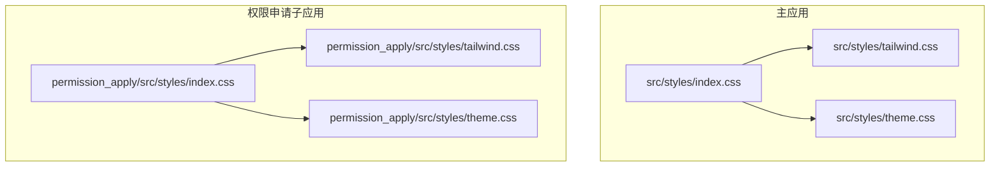
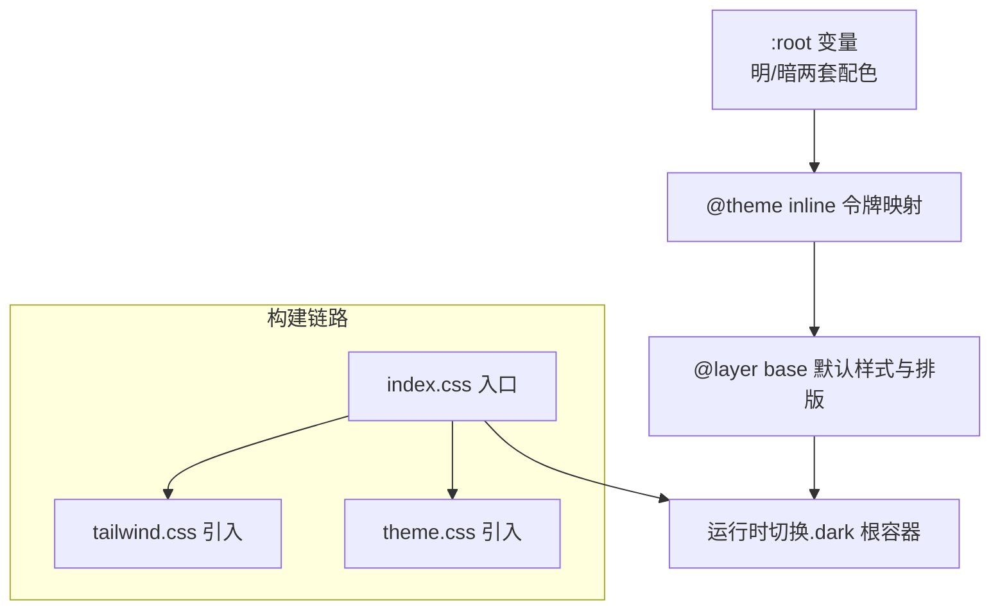
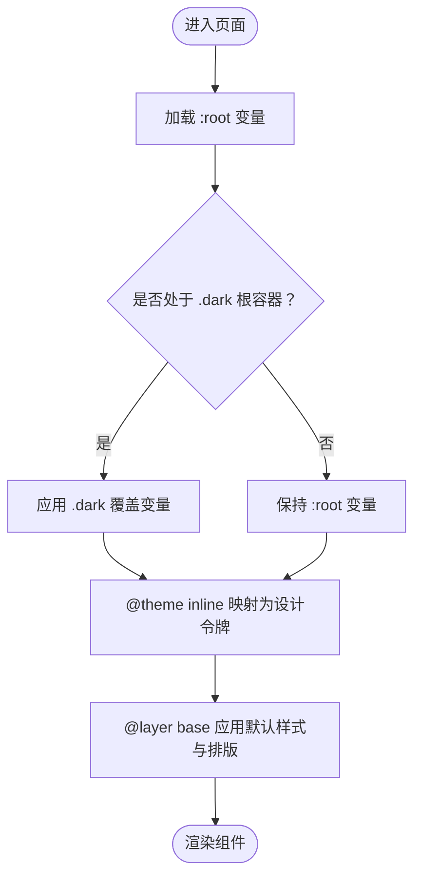
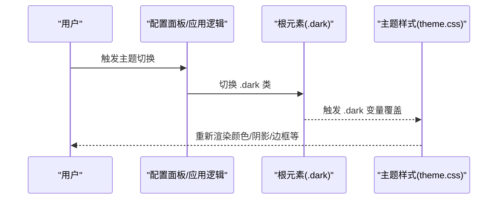
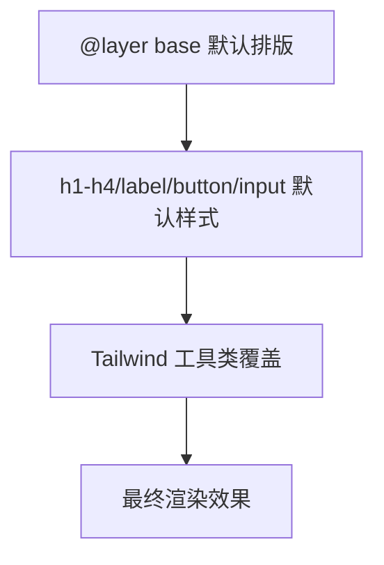
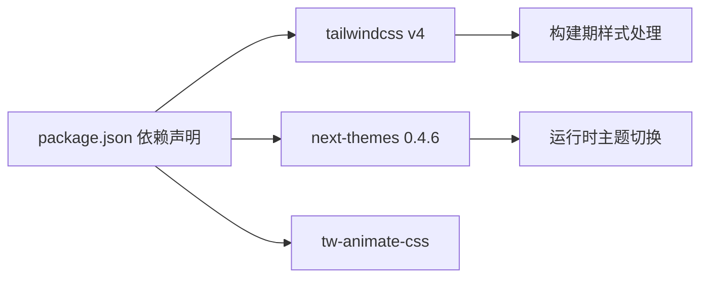

# 主题定制

<cite>
**本文引用的文件**
- [theme.css](file://src/styles/theme.css)
- [index.css](file://src/styles/index.css)
- [tailwind.css](file://src/styles/tailwind.css)
- [theme.css（权限申请）](file://permission_apply/src/styles/theme.css)
- [index.css（权限申请）](file://permission_apply/src/styles/index.css)
- [tailwind.css（权限申请）](file://permission_apply/src/styles/tailwind.css)
- [default_shadcn_theme.css](file://default_shadcn_theme.css)
- [AppContext.tsx](file://src/app/store/AppContext.tsx)
- [ConfigPanel.tsx](file://src/app/components/ConfigPanel.tsx)
- [package.json](file://package.json)
</cite>

## 目录
1. [简介](#简介)
2. [项目结构](#项目结构)
3. [核心组件](#核心组件)
4. [架构总览](#架构总览)
5. [详细组件分析](#详细组件分析)
6. [依赖分析](#依赖分析)
7. [性能考虑](#性能考虑)
8. [故障排查指南](#故障排查指南)
9. [结论](#结论)
10. [附录](#附录)

## 简介
本文件系统性阐述该管理平台的主题定制体系，覆盖以下要点：
- CSS 变量系统与设计令牌映射
- 颜色方案定义与暗色模式实现
- 主题切换机制与品牌色彩规范
- 命名约定、语义化与一致性保障
- 主题定制示例与扩展方法

主题系统以 CSS 自定义属性为核心，结合 Tailwind v4 的 @theme 令牌映射与 @layer 层级，统一在基础层注入全局样式与排版规范；同时通过 .dark 变体实现明/暗两套配色体系，并在运行时可由外部库或应用逻辑驱动主题切换。

## 项目结构
主题相关资源分布于两个子应用中：主应用与“权限申请”子应用，二者共享一致的主题文件组织方式与构建链路。



图表来源
- [index.css:1-4](file://src/styles/index.css#L1-L4)
- [tailwind.css:1-5](file://src/styles/tailwind.css#L1-L5)
- [theme.css:1-182](file://src/styles/theme.css#L1-L182)
- [index.css（权限申请）:1-4](file://permission_apply/src/styles/index.css#L1-L4)
- [tailwind.css（权限申请）:1-5](file://permission_apply/src/styles/tailwind.css#L1-L5)
- [theme.css（权限申请）:1-182](file://permission_apply/src/styles/theme.css#L1-L182)

章节来源
- [index.css:1-4](file://src/styles/index.css#L1-L4)
- [index.css（权限申请）:1-4](file://permission_apply/src/styles/index.css#L1-L4)

## 核心组件
- CSS 变量层（:root 与 .dark）
  - 定义背景、前景、卡片、弹出层、主要/次要/强调/破坏性、边框、输入、开关背景、环形高亮、图表系列色板、圆角半径等设计令牌。
  - 明/暗两套配色通过 .dark 选择器覆盖同名变量，确保在 .dark 根容器下自动切换。
- 设计令牌映射（@theme inline）
  - 将 CSS 变量映射为 Tailwind v4 的设计令牌，如 --color-background → color.background，便于在工具类中直接使用。
- 基础层样式（@layer base）
  - 在基础层设置全局边框、轮廓、body 背景与文字色。
  - 注入默认排版规则（h1-h4、label、button、input），字体大小与字重来自变量，Tailwind 工具类可覆盖这些默认值。

章节来源
- [theme.css:3-182](file://src/styles/theme.css#L3-L182)
- [theme.css（权限申请）:3-182](file://permission_apply/src/styles/theme.css#L3-L182)
- [default_shadcn_theme.css:3-121](file://default_shadcn_theme.css#L3-L121)

## 架构总览
主题系统采用“变量定义 + 令牌映射 + 基础层注入”的分层架构，配合 .dark 变体实现明/暗模式切换。



图表来源
- [theme.css:1-182](file://src/styles/theme.css#L1-L182)
- [index.css:1-4](file://src/styles/index.css#L1-L4)
- [tailwind.css:1-5](file://src/styles/tailwind.css#L1-L5)

## 详细组件分析

### 组件一：CSS 变量系统与设计令牌映射
- 变量命名约定
  - 采用语义化前缀：--color-*（背景、前景、卡片、弹出层、主要/次要/强调/破坏性、边框、输入、环形高亮）、--radius-*（圆角）、--chart-*（图表系列色板）。
  - 文本与排版：--font-size、--font-weight-*、h1-h4、label、button、input 的字号与字重均来自变量，确保全局一致性。
- 设计令牌映射
  - 使用 @theme inline 将 CSS 变量映射为 Tailwind v4 令牌，如 --color-background → color.background，从而在组件中通过工具类直接消费。
- 暗色模式实现
  - 通过 .dark 选择器覆盖同名变量，形成明/暗两套配色。.dark 通常挂载在根元素上，以影响整棵 DOM 的变量解析。



图表来源
- [theme.css:1-182](file://src/styles/theme.css#L1-L182)

章节来源
- [theme.css:3-120](file://src/styles/theme.css#L3-L120)
- [theme.css（权限申请）:3-120](file://permission_apply/src/styles/theme.css#L3-L120)
- [default_shadcn_theme.css:81-121](file://default_shadcn_theme.css#L81-L121)

### 组件二：主题切换机制
- 运行时切换
  - 通过在根元素添加/移除 .dark 类，即可驱动整站主题切换。该机制与 next-themes 等库兼容，可在客户端侧实现即时切换。
- 与 UI 组件的协作
  - 应用上下文与配置面板用于演示状态模拟，虽然不直接操作 .dark，但可作为主题切换的触发入口或状态展示。
- 构建链路
  - index.css 作为入口，按顺序引入 tailwind.css 与 theme.css，确保 @layer base 与 @theme inline 在 Tailwind 处理阶段正确生效。



图表来源
- [theme.css:1-80](file://src/styles/theme.css#L1-L80)
- [index.css:1-4](file://src/styles/index.css#L1-L4)
- [tailwind.css:1-5](file://src/styles/tailwind.css#L1-L5)

章节来源
- [theme.css:1-80](file://src/styles/theme.css#L1-L80)
- [index.css:1-4](file://src/styles/index.css#L1-L4)
- [tailwind.css:1-5](file://src/styles/tailwind.css#L1-L5)

### 组件三：颜色方案与品牌规范
- 品牌主色与前景
  - 主要色与前景色在明/暗两套中均有清晰对比度设计，满足可读性与品牌一致性。
- 辅助色板
  - 提供 muted、accent、destructive 等语义化色板，分别用于“柔和”“强调”“危险/错误”等场景。
- 图表色板
  - chart-1 至 chart-5 提供多系列可视化色板，便于数据图表的一致呈现。
- 圆角半径
  - radius-sm/md/lg/xl 通过计算变量生成，确保组件尺寸的一致性与层级关系。

```mermaid
classDiagram
class ColorTokens {
"+--color-background"
"+--color-foreground"
"+--color-primary / -foreground"
"+--color-secondary / -foreground"
"+--color-muted / -foreground"
"+--color-accent / -foreground"
"+--color-destructive / -foreground"
"+--color-border"
"+--color-input / -background"
"+--color-ring"
"+--color-chart-1..5"
"+--radius-sm/md/lg/xl"
}
```

图表来源
- [theme.css:81-120](file://src/styles/theme.css#L81-L120)
- [default_shadcn_theme.css:81-121](file://default_shadcn_theme.css#L81-L121)

章节来源
- [theme.css:81-120](file://src/styles/theme.css#L81-L120)
- [default_shadcn_theme.css:81-121](file://default_shadcn_theme.css#L81-L121)

### 组件四：排版与文本语义化
- 排版基线
  - 在 @layer base 中为 h1-h4、label、button、input 设置默认字号与字重，确保全局排版一致性。
- Tailwind 覆盖
  - Tailwind 工具类（如 text-sm、text-lg）会覆盖上述默认值，体现“基础层默认、工具类优先”的原则。



图表来源
- [theme.css:122-182](file://src/styles/theme.css#L122-L182)

章节来源
- [theme.css:122-182](file://src/styles/theme.css#L122-L182)

### 组件五：应用上下文与配置面板（主题相关）
- 应用上下文
  - 提供状态管理能力，尽管当前未直接绑定到主题切换，但可作为主题状态的承载者或触发条件的来源。
- 配置面板
  - 用于演示状态模拟，按钮与选择器展示了交互式 UI 的主题一致性（基于 CSS 变量与 Tailwind 工具类）。

章节来源
- [AppContext.tsx:1-64](file://src/app/store/AppContext.tsx#L1-L64)
- [ConfigPanel.tsx:1-134](file://src/app/components/ConfigPanel.tsx#L1-L134)

## 依赖分析
- 构建与样式处理
  - Tailwind v4 通过 @import 'tailwindcss' 与 @source 指向源文件，确保原子类与 @layer、@theme 正确解析。
  - tw-animate-css 为动画提供额外支持。
- 主题切换库
  - 依赖 next-themes（版本 0.4.6），用于在客户端侧实现主题切换与持久化。



图表来源
- [package.json:67-67](file://package.json#L67-L67)
- [tailwind.css:1-5](file://src/styles/tailwind.css#L1-L5)

章节来源
- [package.json:67-67](file://package.json#L67-L67)
- [tailwind.css:1-5](file://src/styles/tailwind.css#L1-L5)

## 性能考虑
- 变量复用与层叠
  - 通过 CSS 变量集中管理设计令牌，减少重复定义与跨组件维护成本。
- @layer 与 @theme 的解析顺序
  - 确保 @layer base 在 Tailwind 处理流程中先于工具类生效，再由工具类进行覆盖，避免不必要的重排与回流。
- 暗色模式切换
  - 仅需切换根元素类名，避免全量重绘，切换成本低。

## 故障排查指南
- 暗色模式未生效
  - 检查根元素是否存在 .dark 类；确认 .dark 选择器覆盖了必要的变量（背景、前景、卡片、弹出层、边框、环形高亮等）。
- 工具类未覆盖默认排版
  - 确认 Tailwind 工具类在 index.css 中的引入顺序位于 theme.css 之后，且未被其他样式覆盖。
- 设计令牌未生效
  - 确认 @theme inline 是否正确映射变量；检查变量名与令牌名是否一致。
- 构建异常
  - 确认 tailwind.css 的 @source 指向正确的源文件路径，避免样式未被扫描导致工具类缺失。

章节来源
- [theme.css:1-182](file://src/styles/theme.css#L1-L182)
- [index.css:1-4](file://src/styles/index.css#L1-L4)
- [tailwind.css:1-5](file://src/styles/tailwind.css#L1-L5)

## 结论
该主题系统以 CSS 变量为核心，结合 Tailwind v4 的 @theme 令牌映射与 @layer 基础层，实现了从设计令牌到运行时样式的完整闭环。明/暗双态通过 .dark 变体覆盖变量，具备良好的可维护性与扩展性。建议在后续迭代中：
- 将主题切换逻辑与 .dark 根容器绑定，确保一致性。
- 对图表色板与语义色板进行品牌化校准，提升视觉识别度。
- 在组件库层面补充主题测试用例，保障跨场景一致性。

## 附录

### 主题定制示例与扩展方法
- 新增设计令牌
  - 在 :root 中新增变量，在 @theme inline 中映射为对应令牌，随后在组件中通过工具类使用。
- 扩展暗色模式覆盖
  - 在 .dark 选择器中补充覆盖变量，确保所有组件在暗色模式下保持对比度与可读性。
- 主题切换集成
  - 在应用入口处监听主题变更事件，动态切换根元素 .dark 类，实现即时主题切换。
- 品牌色彩规范
  - 建议为品牌主色、辅助色与语义色建立命名规范与色板矩阵，确保跨模块一致性。