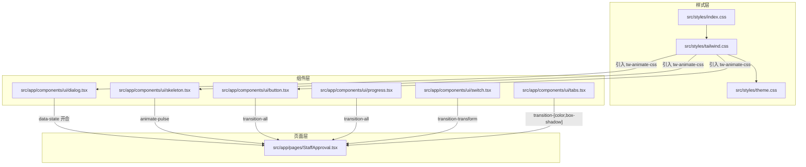
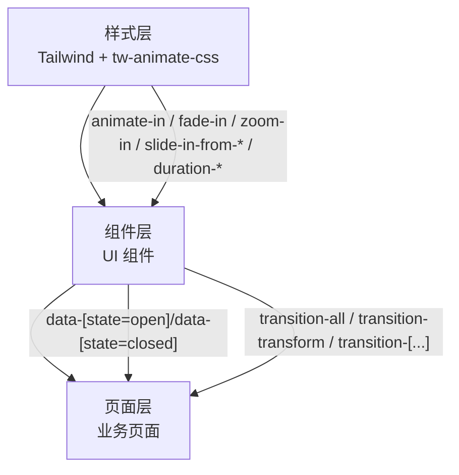
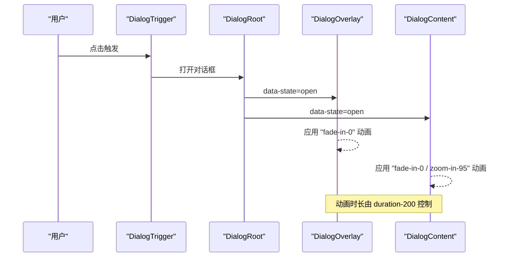
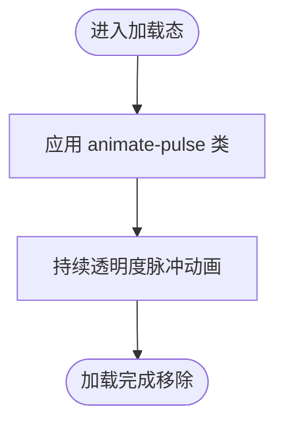
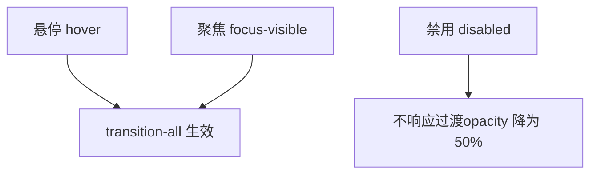
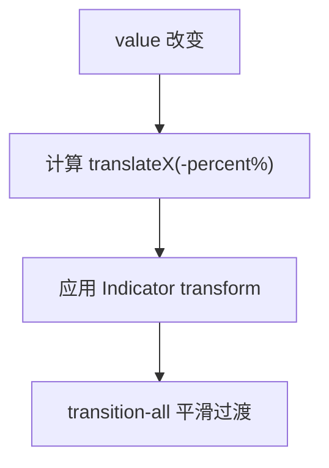
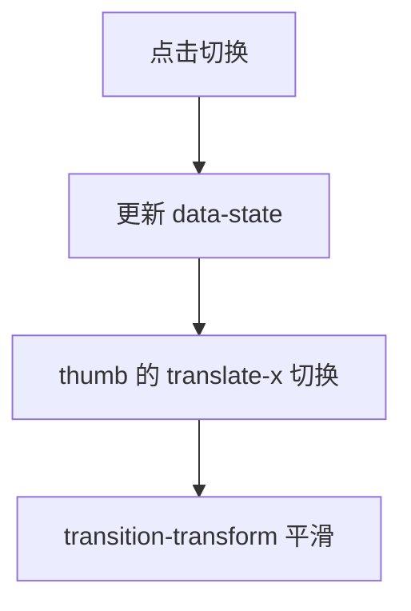
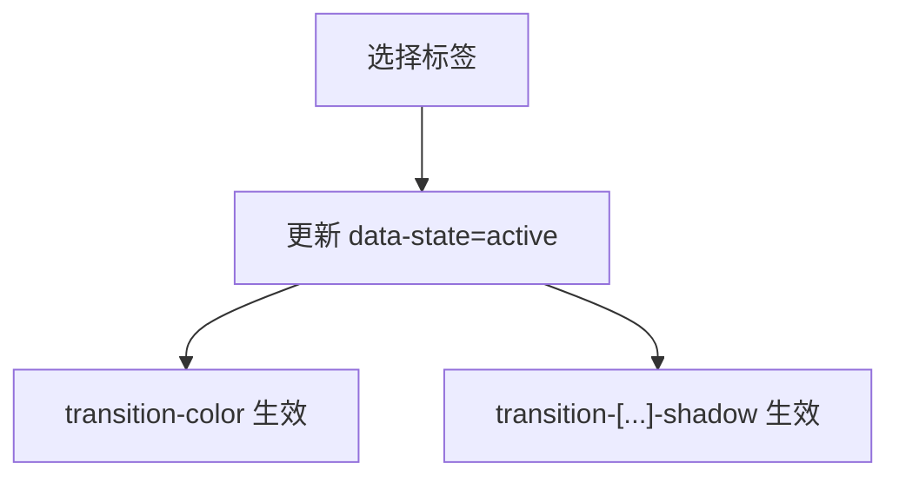
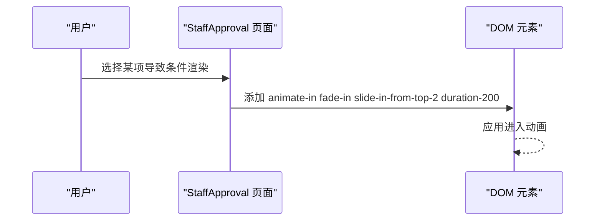
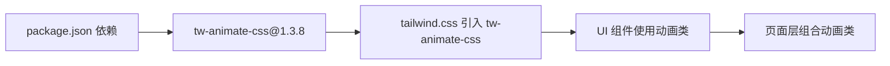

# 动画效果

<cite>
**本文引用的文件**
- [src/styles/index.css](file://src/styles/index.css)
- [src/styles/tailwind.css](file://src/styles/tailwind.css)
- [src/styles/theme.css](file://src/styles/theme.css)
- [src/app/components/ui/button.tsx](file://src/app/components/ui/button.tsx)
- [src/app/components/ui/dialog.tsx](file://src/app/components/ui/dialog.tsx)
- [src/app/components/ui/skeleton.tsx](file://src/app/components/ui/skeleton.tsx)
- [src/app/components/ui/progress.tsx](file://src/app/components/ui/progress.tsx)
- [src/app/components/ui/switch.tsx](file://src/app/components/ui/switch.tsx)
- [src/app/components/ui/tabs.tsx](file://src/app/components/ui/tabs.tsx)
- [src/app/pages/StaffApproval.tsx](file://src/app/pages/StaffApproval.tsx)
- [permission_apply/src/app/pages/StaffApproval.tsx](file://permission_apply/src/app/pages/StaffApproval.tsx)
- [package.json](file://package.json)
- [package-lock.json](file://package-lock.json)
</cite>

## 目录
1. [简介](#简介)
2. [项目结构](#项目结构)
3. [核心组件](#核心组件)
4. [架构总览](#架构总览)
5. [详细组件分析](#详细组件分析)
6. [依赖分析](#依赖分析)
7. [性能考虑](#性能考虑)
8. [故障排查指南](#故障排查指南)
9. [结论](#结论)
10. [附录](#附录)

## 简介
本文件系统性梳理本项目中的动画效果体系，覆盖以下方面：
- CSS 过渡动画与变换效果：通过 Tailwind CSS 的过渡类与 tw-animate-css 提供的动画类实现。
- 关键帧动画：通过 tw-animate-css 引入的预置动画类（如淡入、缩放、滑入等）在组件中使用。
- 组件级动画触发机制：基于 Radix UI 的状态属性（如 open/closed）与 Tailwind 原子类组合，实现开合、悬停、聚焦等状态下的平滑过渡。
- 状态变化动画与加载动画：对话框、提示框、骨架屏等组件的显隐与加载反馈。
- 性能优化与流畅度保障：过渡时长、硬件加速、合成层策略与避免重排重绘。
- 自定义动画创建指南：如何在现有体系下扩展新的动画类。

## 项目结构
动画能力由样式层与组件层协同实现：
- 样式层：引入 Tailwind 与 tw-animate-css，统一提供过渡与关键帧动画类。
- 组件层：在 UI 组件中结合 Radix UI 的 data-state 属性与动画类，实现状态驱动的动画。
- 页面层：在业务页面中按需组合动画类，实现交互细节的动效。

**图表来源**
- [src/styles/index.css:1-4](file://src/styles/index.css#L1-L4)
- [src/styles/tailwind.css:1-5](file://src/styles/tailwind.css#L1-L5)
- [src/styles/theme.css:1-182](file://src/styles/theme.css#L1-L182)
- [src/app/components/ui/dialog.tsx:1-136](file://src/app/components/ui/dialog.tsx#L1-L136)
- [src/app/components/ui/skeleton.tsx:1-14](file://src/app/components/ui/skeleton.tsx#L1-L14)
- [src/app/components/ui/button.tsx:1-59](file://src/app/components/ui/button.tsx#L1-L59)
- [src/app/components/ui/progress.tsx:1-32](file://src/app/components/ui/progress.tsx#L1-L32)
- [src/app/components/ui/switch.tsx:1-32](file://src/app/components/ui/switch.tsx#L1-L32)
- [src/app/components/ui/tabs.tsx:1-67](file://src/app/components/ui/tabs.tsx#L1-L67)
- [src/app/pages/StaffApproval.tsx:667-691](file://src/app/pages/StaffApproval.tsx#L667-L691)

**章节来源**
- [src/styles/index.css:1-4](file://src/styles/index.css#L1-L4)
- [src/styles/tailwind.css:1-5](file://src/styles/tailwind.css#L1-L5)
- [src/styles/theme.css:1-182](file://src/styles/theme.css#L1-L182)

## 核心组件
- 对话框（Dialog）：通过 data-[state=open]/data-[state=closed] 控制显隐与缩放、淡入淡出动画。
- 骨架屏（Skeleton）：使用 animate-pulse 实现呼吸式加载动画。
- 按钮（Button）：使用 transition-all 实现悬停、聚焦等状态过渡。
- 进度条（Progress）：进度变化时通过 transition-all 平滑过渡。
- 开关（Switch）：通过 transition-transform 实现拇指位移动画。
- 标签页（Tabs）：标签切换时通过 transition-[color,box-shadow] 实现视觉反馈。
- 页面（StaffApproval）：在条件渲染时使用 animate-in、fade-in、slide-in-from-*、duration-* 等类实现进入动画。

**章节来源**
- [src/app/components/ui/dialog.tsx:1-136](file://src/app/components/ui/dialog.tsx#L1-L136)
- [src/app/components/ui/skeleton.tsx:1-14](file://src/app/components/ui/skeleton.tsx#L1-L14)
- [src/app/components/ui/button.tsx:1-59](file://src/app/components/ui/button.tsx#L1-L59)
- [src/app/components/ui/progress.tsx:1-32](file://src/app/components/ui/progress.tsx#L1-L32)
- [src/app/components/ui/switch.tsx:1-32](file://src/app/components/ui/switch.tsx#L1-L32)
- [src/app/components/ui/tabs.tsx:1-67](file://src/app/components/ui/tabs.tsx#L1-L67)
- [src/app/pages/StaffApproval.tsx:667-691](file://src/app/pages/StaffApproval.tsx#L667-L691)

## 架构总览
动画系统采用“样式层 + 组件层 + 页面层”的分层设计：
- 样式层负责提供原子化的过渡与关键帧类，确保一致性与可复用性。
- 组件层通过 Radix UI 的状态属性与动画类组合，形成组件级动画。
- 页面层根据交互需求选择合适的动画类，实现业务场景的动效。

**图表来源**
- [src/styles/tailwind.css:1-5](file://src/styles/tailwind.css#L1-L5)
- [src/app/components/ui/dialog.tsx:1-136](file://src/app/components/ui/dialog.tsx#L1-L136)
- [src/app/components/ui/button.tsx:1-59](file://src/app/components/ui/button.tsx#L1-L59)
- [src/app/pages/StaffApproval.tsx:667-691](file://src/app/pages/StaffApproval.tsx#L667-L691)

## 详细组件分析

### 对话框（Dialog）
- 动画机制：Overlay 与 Content 分别使用 data-[state=open] 与 data-[state=closed] 触发进入/退出动画；组合 fade-in/out 与 zoom-in/out 实现透明度与缩放的双重过渡。
- 关键类路径：
  - Overlay：data-[state=closed]:animate-out data-[state=closed]:fade-out-0 data-[state=open]:fade-in-0
  - Content：data-[state=closed]:animate-out data-[state=closed]:fade-out-0 data-[state=closed]:zoom-out-95 data-[state=open]:animate-in data-[state=open]:fade-in-0 data-[state=open]:zoom-in-95 duration-200
- 使用场景：打开/关闭弹窗时的显隐与缩放过渡。

**图表来源**
- [src/app/components/ui/dialog.tsx:33-72](file://src/app/components/ui/dialog.tsx#L33-L72)

**章节来源**
- [src/app/components/ui/dialog.tsx:1-136](file://src/app/components/ui/dialog.tsx#L1-L136)

### 骨架屏（Skeleton）
- 动画机制：animate-pulse 实现持续的透明度呼吸动画，用于占位加载态。
- 使用场景：列表或卡片内容尚未就绪时的轻量反馈。

**图表来源**
- [src/app/components/ui/skeleton.tsx:1-14](file://src/app/components/ui/skeleton.tsx#L1-L14)

**章节来源**
- [src/app/components/ui/skeleton.tsx:1-14](file://src/app/components/ui/skeleton.tsx#L1-L14)

### 按钮（Button）
- 动画机制：transition-all 在 hover、focus、disabled 等状态下实现颜色、边框、阴影等属性的平滑过渡。
- 使用场景：交互反馈与视觉强调。

**图表来源**
- [src/app/components/ui/button.tsx:7-35](file://src/app/components/ui/button.tsx#L7-L35)

**章节来源**
- [src/app/components/ui/button.tsx:1-59](file://src/app/components/ui/button.tsx#L1-L59)

### 进度条（Progress）
- 动画机制：Indicator 的 transform 通过 transition-all 平滑过渡，实现进度推进的连续动画。
- 使用场景：上传、处理、加载等进度反馈。

**图表来源**
- [src/app/components/ui/progress.tsx:8-27](file://src/app/components/ui/progress.tsx#L8-L27)

**章节来源**
- [src/app/components/ui/progress.tsx:1-32](file://src/app/components/ui/progress.tsx#L1-L32)

### 开关（Switch）
- 动画机制：thumb 的 translate-x 通过 transition-transform 实现平滑位移，配合 data-[state=checked]/unchecked 切换位置。
- 使用场景：开关切换的直观反馈。

**图表来源**
- [src/app/components/ui/switch.tsx:8-27](file://src/app/components/ui/switch.tsx#L8-L27)

**章节来源**
- [src/app/components/ui/switch.tsx:1-32](file://src/app/components/ui/switch.tsx#L1-L32)

### 标签页（Tabs）
- 动画机制：TabsTrigger 在激活态下通过 transition-[color,box-shadow] 实现颜色与阴影的过渡，提升选中反馈。
- 使用场景：多面板切换时的视觉引导。

**图表来源**
- [src/app/components/ui/tabs.tsx:8-50](file://src/app/components/ui/tabs.tsx#L8-L50)

**章节来源**
- [src/app/components/ui/tabs.tsx:1-67](file://src/app/components/ui/tabs.tsx#L1-L67)

### 页面级动画（StaffApproval）
- 动画机制：条件渲染时使用 animate-in、fade-in、slide-in-from-*、duration-* 等类，实现元素进入时的淡入与滑入复合动画。
- 使用场景：动态显示/隐藏表单区域或提示信息。

**图表来源**
- [src/app/pages/StaffApproval.tsx:667-691](file://src/app/pages/StaffApproval.tsx#L667-L691)

**章节来源**
- [src/app/pages/StaffApproval.tsx:667-691](file://src/app/pages/StaffApproval.tsx#L667-L691)

## 依赖分析
- 样式依赖：tw-animate-css 提供了 animate-in、fade-in、zoom-in、slide-in-from-*、duration-* 等关键帧与过渡类。
- 组件依赖：各 UI 组件通过 Radix UI 的 data-state 属性与上述动画类组合，形成组件级动画。
- 页面依赖：页面在交互逻辑中按需添加动画类，实现业务层面的动效。

**图表来源**
- [package.json:65](file://package.json#L65)
- [package-lock.json:5374-5382](file://package-lock.json#L5374-L5382)
- [src/styles/tailwind.css:4](file://src/styles/tailwind.css#L4)

**章节来源**
- [package.json:11-66](file://package.json#L11-L66)
- [package-lock.json:5374-5382](file://package-lock.json#L5374-L5382)
- [src/styles/tailwind.css:1-5](file://src/styles/tailwind.css#L1-L5)

## 性能考虑
- 合成层与硬件加速
  - 优先使用 transform 与 opacity 实现动画，以触发合成层（compositor），减少布局与绘制成本。
  - 避免频繁触发布局（如 top/left、width/height、margin/padding 等）与重绘（如 color、background-color）。
- 动画时长与缓动
  - 使用 duration-* 类控制时长，建议在 150–300ms 区间内平衡感知与性能。
  - 复合动画（如 fade-in + zoom-in + slide-in-from-*）应保持时长一致，避免层级错位感。
- 过渡与关键帧的选择
  - 状态切换（open/closed）使用 data-state 驱动的 animate-in/out 与 fade/zoom/slide 组合。
  - 加载态使用 animate-pulse，避免复杂关键帧导致的 CPU 占用。
- 事件与状态管理
  - 尽量在状态变更时一次性添加/移除动画类，避免在动画过程中频繁切换类名。
  - 对高频动画（如滚动、拖拽）谨慎使用昂贵的关键帧，必要时降低帧率或简化动画。

## 故障排查指南
- 动画未生效
  - 检查是否正确引入 tw-animate-css 与 tailwind.css。
  - 确认组件是否使用了 Radix UI 的 data-state 属性，且类名拼写正确。
- 动画卡顿或掉帧
  - 检查是否存在强制同步布局（layout thrashing），尽量合并读写操作。
  - 减少同时运行的动画数量，或缩短动画时长。
- 动画闪烁或跳变
  - 确保初始状态与最终状态的 transform/opacity 差异明确，避免中间态突变。
  - 对条件渲染的元素，先设置初始动画类，再触发状态变更，避免首帧缺失。
- 加载动画不连续
  - animate-pulse 为持续动画，若数据加载完成后仍可见，检查移除逻辑。

**章节来源**
- [src/app/components/ui/dialog.tsx:33-72](file://src/app/components/ui/dialog.tsx#L33-L72)
- [src/app/components/ui/skeleton.tsx:1-14](file://src/app/components/ui/skeleton.tsx#L1-L14)
- [src/app/pages/StaffApproval.tsx:667-691](file://src/app/pages/StaffApproval.tsx#L667-L691)

## 结论
本项目通过 Tailwind CSS 与 tw-animate-css 提供的原子化动画类，结合 Radix UI 的状态属性，在组件与页面层实现了统一、可复用且高性能的动画体系。对话框、骨架屏、按钮、进度条、开关与标签页等组件均具备明确的状态驱动动画，页面层则在交互细节上补充进入/退出动画。遵循硬件加速与合成层策略，可在保证体验的同时兼顾性能。

## 附录
- 自定义动画创建指南
  - 在 tailwind.css 中引入 tw-animate-css，并在需要的组件类中组合 animate-in、fade-in、zoom-in、slide-in-from-*、duration-* 等类。
  - 使用 data-state 属性驱动进入/退出动画，确保初始状态与最终状态的 transform/opacity 清晰。
  - 对高频动画采用 transform/opacity 优先策略，避免布局与绘制抖动。
  - 通过 duration-* 调整时长，保持全局一致的动效节奏。

**章节来源**
- [src/styles/tailwind.css:1-5](file://src/styles/tailwind.css#L1-L5)
- [src/app/components/ui/dialog.tsx:33-72](file://src/app/components/ui/dialog.tsx#L33-L72)
- [src/app/pages/StaffApproval.tsx:667-691](file://src/app/pages/StaffApproval.tsx#L667-L691)