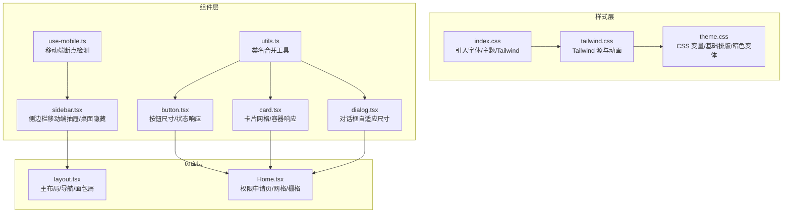
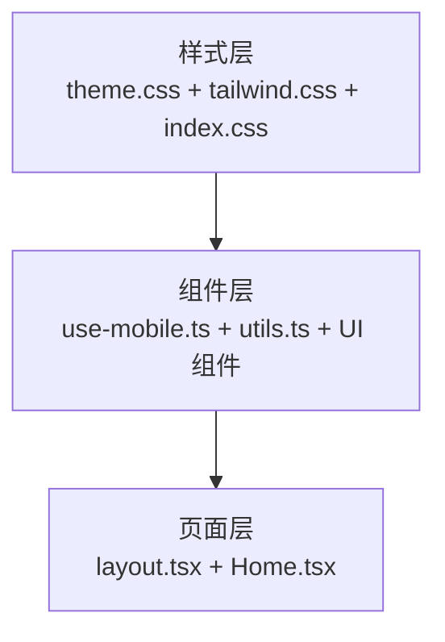
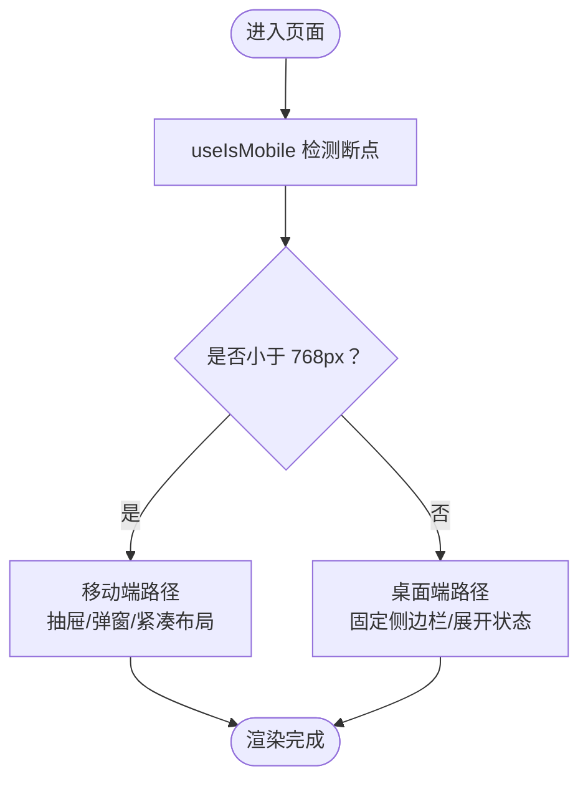
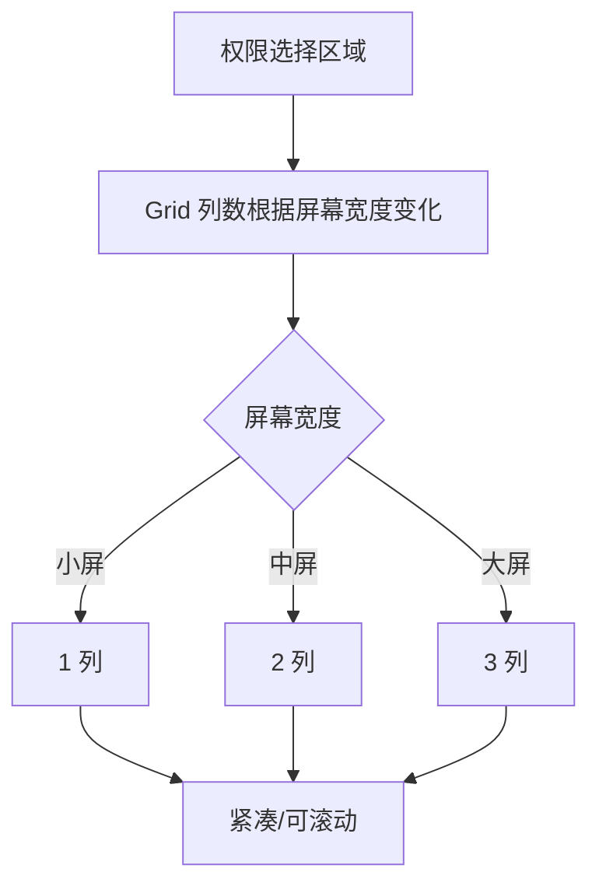
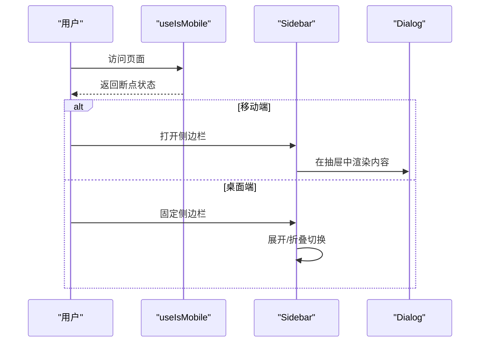
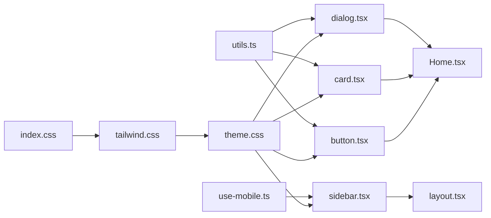

# 响应式设计

<cite>
**本文引用的文件**
- [src/styles/index.css](file://src/styles/index.css)
- [src/styles/tailwind.css](file://src/styles/tailwind.css)
- [src/styles/theme.css](file://src/styles/theme.css)
- [src/app/components/ui/use-mobile.ts](file://src/app/components/ui/use-mobile.ts)
- [src/app/components/ui/utils.ts](file://src/app/components/ui/utils.ts)
- [src/app/components/ui/button.tsx](file://src/app/components/ui/button.tsx)
- [src/app/components/ui/card.tsx](file://src/app/components/ui/card.tsx)
- [src/app/components/ui/dialog.tsx](file://src/app/components/ui/dialog.tsx)
- [src/app/components/ui/sidebar.tsx](file://src/app/components/ui/sidebar.tsx)
- [src/app/layout.tsx](file://src/app/layout.tsx)
- [src/app/pages/Home.tsx](file://src/app/pages/Home.tsx)
- [permission_apply/src/styles/index.css](file://permission_apply/src/styles/index.css)
- [permission_apply/src/styles/tailwind.css](file://permission_apply/src/styles/tailwind.css)
- [permission_apply/src/styles/theme.css](file://permission_apply/src/styles/theme.css)
- [permission_apply/src/app/layout.tsx](file://permission_apply/src/app/layout.tsx)
</cite>

## 目录
1. [简介](#简介)
2. [项目结构](#项目结构)
3. [核心组件](#核心组件)
4. [架构总览](#架构总览)
5. [详细组件分析](#详细组件分析)
6. [依赖关系分析](#依赖关系分析)
7. [性能考量](#性能考量)
8. [故障排查指南](#故障排查指南)
9. [结论](#结论)
10. [附录](#附录)

## 简介
本文件系统化梳理本项目的响应式设计体系，围绕“移动端优先”的设计理念，结合断点配置、Flexbox/Grid 使用规范、媒体查询最佳实践、触摸设备优化、组件响应式行为、字体缩放与间距调整等方面进行深入解析，并提供可操作的示例与调试技巧，帮助开发者在多端环境中保持一致且高效的用户体验。

## 项目结构
项目采用模块化组织，样式层通过 Tailwind CSS 与主题变量统一管理；页面层以路由组件为主，配合可复用 UI 组件实现响应式布局。关键路径如下：
- 样式入口与主题：src/styles/index.css → src/styles/tailwind.css → src/styles/theme.css
- 移动端检测：src/app/components/ui/use-mobile.ts
- UI 组件与工具：src/app/components/ui/*
- 页面布局与内容：src/app/layout.tsx、src/app/pages/Home.tsx
- 权限申请子应用样式与布局：permission_apply/src/styles/*、permission_apply/src/app/layout.tsx

图表来源
- [src/styles/index.css:1-4](file://src/styles/index.css#L1-L4)
- [src/styles/tailwind.css:1-5](file://src/styles/tailwind.css#L1-L5)
- [src/styles/theme.css:1-182](file://src/styles/theme.css#L1-L182)
- [src/app/components/ui/use-mobile.ts:1-22](file://src/app/components/ui/use-mobile.ts#L1-L22)
- [src/app/components/ui/utils.ts:1-7](file://src/app/components/ui/utils.ts#L1-L7)
- [src/app/components/ui/button.tsx:1-59](file://src/app/components/ui/button.tsx#L1-L59)
- [src/app/components/ui/card.tsx:1-93](file://src/app/components/ui/card.tsx#L1-L93)
- [src/app/components/ui/dialog.tsx:1-136](file://src/app/components/ui/dialog.tsx#L1-L136)
- [src/app/components/ui/sidebar.tsx:1-727](file://src/app/components/ui/sidebar.tsx#L1-L727)
- [src/app/layout.tsx:1-175](file://src/app/layout.tsx#L1-L175)
- [src/app/pages/Home.tsx:1-809](file://src/app/pages/Home.tsx#L1-L809)

章节来源
- [src/styles/index.css:1-4](file://src/styles/index.css#L1-L4)
- [src/styles/tailwind.css:1-5](file://src/styles/tailwind.css#L1-L5)
- [src/styles/theme.css:1-182](file://src/styles/theme.css#L1-L182)
- [src/app/components/ui/use-mobile.ts:1-22](file://src/app/components/ui/use-mobile.ts#L1-L22)
- [src/app/components/ui/utils.ts:1-7](file://src/app/components/ui/utils.ts#L1-L7)
- [src/app/components/ui/button.tsx:1-59](file://src/app/components/ui/button.tsx#L1-L59)
- [src/app/components/ui/card.tsx:1-93](file://src/app/components/ui/card.tsx#L1-L93)
- [src/app/components/ui/dialog.tsx:1-136](file://src/app/components/ui/dialog.tsx#L1-L136)
- [src/app/components/ui/sidebar.tsx:1-727](file://src/app/components/ui/sidebar.tsx#L1-L727)
- [src/app/layout.tsx:1-175](file://src/app/layout.tsx#L1-L175)
- [src/app/pages/Home.tsx:1-809](file://src/app/pages/Home.tsx#L1-L809)

## 核心组件
- 移动端断点检测：useIsMobile 提供基于窗口宽度的断点判断，便于组件按需切换布局或交互模式。
- 类名合并工具：cn 用于安全合并多个类名，避免冲突并提升样式组合灵活性。
- 基础按钮：通过变体与尺寸变体定义，自动适配不同屏幕下的可点击区域与视觉密度。
- 卡片与网格：卡片内部使用容器查询与网格布局，确保在小屏与大屏下均能合理换行与对齐。
- 对话框：内容区采用最大宽度与相对定位，配合移动端抽屉/弹窗行为，保证在小屏下的可读性与可用性。
- 侧边栏：桌面端固定/折叠，移动端以抽屉形式呈现，结合键盘快捷键与 Cookie 记忆状态，兼顾易用性与一致性。

章节来源
- [src/app/components/ui/use-mobile.ts:1-22](file://src/app/components/ui/use-mobile.ts#L1-L22)
- [src/app/components/ui/utils.ts:1-7](file://src/app/components/ui/utils.ts#L1-L7)
- [src/app/components/ui/button.tsx:1-59](file://src/app/components/ui/button.tsx#L1-L59)
- [src/app/components/ui/card.tsx:1-93](file://src/app/components/ui/card.tsx#L1-L93)
- [src/app/components/ui/dialog.tsx:1-136](file://src/app/components/ui/dialog.tsx#L1-L136)
- [src/app/components/ui/sidebar.tsx:1-727](file://src/app/components/ui/sidebar.tsx#L1-L727)

## 架构总览
整体响应式架构由“样式层—组件层—页面层”三层构成，样式层通过主题变量与 Tailwind 工具类提供一致的排版与间距；组件层以可复用 UI 组件为核心，内置断点感知与交互优化；页面层负责业务编排与内容展示，结合容器查询与弹性布局实现跨端一致体验。

图表来源
- [src/styles/theme.css:1-182](file://src/styles/theme.css#L1-L182)
- [src/styles/tailwind.css:1-5](file://src/styles/tailwind.css#L1-L5)
- [src/styles/index.css:1-4](file://src/styles/index.css#L1-L4)
- [src/app/components/ui/use-mobile.ts:1-22](file://src/app/components/ui/use-mobile.ts#L1-L22)
- [src/app/components/ui/utils.ts:1-7](file://src/app/components/ui/utils.ts#L1-L7)
- [src/app/layout.tsx:1-175](file://src/app/layout.tsx#L1-L175)
- [src/app/pages/Home.tsx:1-809](file://src/app/pages/Home.tsx#L1-L809)

## 详细组件分析

### 移动端断点与交互策略
- 断点：以 768px 作为移动端阈值，低于该宽度时视为移动设备，触发移动端交互与布局策略。
- 行为：在移动端使用抽屉/弹窗替代桌面端固定侧边栏；按钮与控件增大触控面积；文本与图标尺寸按需缩放。

图表来源
- [src/app/components/ui/use-mobile.ts:1-22](file://src/app/components/ui/use-mobile.ts#L1-L22)
- [src/app/components/ui/sidebar.tsx:183-206](file://src/app/components/ui/sidebar.tsx#L183-L206)
- [src/app/components/ui/dialog.tsx:59-72](file://src/app/components/ui/dialog.tsx#L59-L72)

章节来源
- [src/app/components/ui/use-mobile.ts:1-22](file://src/app/components/ui/use-mobile.ts#L1-L22)
- [src/app/components/ui/sidebar.tsx:183-206](file://src/app/components/ui/sidebar.tsx#L183-L206)
- [src/app/components/ui/dialog.tsx:59-72](file://src/app/components/ui/dialog.tsx#L59-L72)

### Flexbox 与 Grid 使用规范
- Flexbox：广泛用于导航项、按钮组、头部信息区等需要水平/垂直居中与弹性排列的场景，确保在不同屏幕宽度下保持对齐与紧凑感。
- Grid：在权限选择区域采用多列网格布局，随屏幕宽度自动调整列数，保障内容密度与可读性。
- 容器查询：卡片标题区使用容器查询修饰符，使标题在不同容器宽度下自动调整排版。

图表来源
- [src/app/pages/Home.tsx:436-475](file://src/app/pages/Home.tsx#L436-L475)
- [src/app/components/ui/card.tsx:23-28](file://src/app/components/ui/card.tsx#L23-L28)

章节来源
- [src/app/pages/Home.tsx:436-475](file://src/app/pages/Home.tsx#L436-L475)
- [src/app/components/ui/card.tsx:23-28](file://src/app/components/ui/card.tsx#L23-L28)

### 媒体查询最佳实践
- 基于 Tailwind 的断点前缀：在组件中优先使用 md/lg/xl 等断点修饰符，避免硬编码媒体查询，提高可维护性。
- 主题变量驱动：通过 CSS 变量统一字体大小、间距与圆角，确保在不同断点下的一致性与可扩展性。
- 动态断点检测：在需要运行时切换逻辑时，使用 useIsMobile 进行条件渲染与交互优化。

章节来源
- [src/app/components/ui/sidebar.tsx:210-252](file://src/app/components/ui/sidebar.tsx#L210-L252)
- [src/app/layout.tsx:86-137](file://src/app/layout.tsx#L86-L137)
- [src/styles/theme.css:136-181](file://src/styles/theme.css#L136-L181)

### 触摸设备优化
- 触控目标：按钮与菜单项具备足够尺寸与间距，提升触摸命中率。
- 抽屉与弹窗：移动端侧边栏与对话框采用抽屉/弹窗形式，避免遮挡过多内容，同时保留返回路径。
- 键盘快捷键：在桌面端提供快捷键以提升效率，不影响移动端交互。

章节来源
- [src/app/components/ui/sidebar.tsx:183-206](file://src/app/components/ui/sidebar.tsx#L183-L206)
- [src/app/components/ui/dialog.tsx:59-72](file://src/app/components/ui/dialog.tsx#L59-L72)
- [src/app/components/ui/sidebar.tsx:97-110](file://src/app/components/ui/sidebar.tsx#L97-L110)

### 字体缩放与间距调整
- 字体基线：html 使用 CSS 变量作为根字体大小，便于全局缩放与主题切换。
- 排版层级：h1/h2/h3/h4、label、button、input 等元素在基础层设定字号、字重与行高，确保在不同断点下清晰可读。
- 间距系统：通过 Tailwind 间距工具与容器查询修饰符，实现卡片、网格与段落间的统一间距。

章节来源
- [src/styles/theme.css:136-181](file://src/styles/theme.css#L136-L181)
- [src/styles/theme.css:3-42](file://src/styles/theme.css#L3-L42)

### 组件响应式行为示例
- 侧边栏：桌面端固定显示并支持折叠；移动端以抽屉形式出现，宽度与折叠状态独立控制。
- 对话框：内容区最大宽度限制与居中定位，确保在小屏下仍具可读性。
- 卡片：标题区使用容器查询修饰符，使标题在不同容器宽度下自动调整排版。

图表来源
- [src/app/components/ui/use-mobile.ts:1-22](file://src/app/components/ui/use-mobile.ts#L1-L22)
- [src/app/components/ui/sidebar.tsx:183-206](file://src/app/components/ui/sidebar.tsx#L183-L206)
- [src/app/components/ui/dialog.tsx:59-72](file://src/app/components/ui/dialog.tsx#L59-L72)

章节来源
- [src/app/components/ui/sidebar.tsx:183-206](file://src/app/components/ui/sidebar.tsx#L183-L206)
- [src/app/components/ui/dialog.tsx:59-72](file://src/app/components/ui/dialog.tsx#L59-L72)
- [src/app/components/ui/card.tsx:23-28](file://src/app/components/ui/card.tsx#L23-L28)

## 依赖关系分析
- 样式依赖：index.css 引入 tailwind.css 与 theme.css，形成从入口到主题再到基础样式的链路。
- 组件依赖：UI 组件通过 cn 合并类名，按钮与卡片依赖主题变量与容器查询，对话框与侧边栏依赖断点检测。
- 页面依赖：layout 负责整体布局与导航，Home 页面承载复杂业务与网格布局。

图表来源
- [src/styles/index.css:1-4](file://src/styles/index.css#L1-L4)
- [src/styles/tailwind.css:1-5](file://src/styles/tailwind.css#L1-L5)
- [src/styles/theme.css:1-182](file://src/styles/theme.css#L1-L182)
- [src/app/components/ui/use-mobile.ts:1-22](file://src/app/components/ui/use-mobile.ts#L1-L22)
- [src/app/components/ui/utils.ts:1-7](file://src/app/components/ui/utils.ts#L1-L7)
- [src/app/components/ui/button.tsx:1-59](file://src/app/components/ui/button.tsx#L1-L59)
- [src/app/components/ui/card.tsx:1-93](file://src/app/components/ui/card.tsx#L1-L93)
- [src/app/components/ui/dialog.tsx:1-136](file://src/app/components/ui/dialog.tsx#L1-L136)
- [src/app/components/ui/sidebar.tsx:1-727](file://src/app/components/ui/sidebar.tsx#L1-L727)
- [src/app/layout.tsx:1-175](file://src/app/layout.tsx#L1-L175)
- [src/app/pages/Home.tsx:1-809](file://src/app/pages/Home.tsx#L1-L809)

章节来源
- [src/styles/index.css:1-4](file://src/styles/index.css#L1-L4)
- [src/styles/tailwind.css:1-5](file://src/styles/tailwind.css#L1-L5)
- [src/styles/theme.css:1-182](file://src/styles/theme.css#L1-L182)
- [src/app/components/ui/use-mobile.ts:1-22](file://src/app/components/ui/use-mobile.ts#L1-L22)
- [src/app/components/ui/utils.ts:1-7](file://src/app/components/ui/utils.ts#L1-L7)
- [src/app/components/ui/button.tsx:1-59](file://src/app/components/ui/button.tsx#L1-L59)
- [src/app/components/ui/card.tsx:1-93](file://src/app/components/ui/card.tsx#L1-L93)
- [src/app/components/ui/dialog.tsx:1-136](file://src/app/components/ui/dialog.tsx#L1-L136)
- [src/app/components/ui/sidebar.tsx:1-727](file://src/app/components/ui/sidebar.tsx#L1-L727)
- [src/app/layout.tsx:1-175](file://src/app/layout.tsx#L1-L175)
- [src/app/pages/Home.tsx:1-809](file://src/app/pages/Home.tsx#L1-L809)

## 性能考量
- 样式体积：通过 Tailwind 源扫描与按需生成，减少未使用样式的打包体积。
- 渲染路径：在移动端优先的条件下，尽量减少不必要的 DOM 层级与复杂布局计算。
- 交互成本：抽屉与弹窗仅在需要时挂载，降低常驻节点带来的内存与重绘压力。
- 主题切换：CSS 变量驱动的主题切换避免了样式重排，提升暗色模式切换的流畅度。

## 故障排查指南
- 断点不生效
  - 检查 useIsMobile 是否正确监听窗口变化与初始状态设置。
  - 确认断点阈值与实际需求一致（默认 768px）。
- 样式覆盖异常
  - 使用 cn 合并类名，避免重复覆盖导致的样式错乱。
  - 检查容器查询修饰符是否正确应用于目标元素。
- 移动端交互卡顿
  - 减少抽屉/弹窗中的复杂渲染，必要时延迟加载非首屏内容。
  - 避免在滚动事件中执行昂贵操作。
- 字体/间距不一致
  - 确保所有字号与间距来源于主题变量或 Tailwind 间距工具。
  - 在不同断点下验证容器查询修饰符的效果。

章节来源
- [src/app/components/ui/use-mobile.ts:1-22](file://src/app/components/ui/use-mobile.ts#L1-L22)
- [src/app/components/ui/utils.ts:1-7](file://src/app/components/ui/utils.ts#L1-L7)
- [src/app/components/ui/sidebar.tsx:183-206](file://src/app/components/ui/sidebar.tsx#L183-L206)
- [src/styles/theme.css:136-181](file://src/styles/theme.css#L136-L181)

## 结论
本项目以移动端优先为核心，结合断点检测、容器查询与 Tailwind 工具类，构建了稳定且可扩展的响应式体系。通过主题变量统一排版与间距、组件化封装交互细节，实现了在多端环境下的高效开发与一致体验。建议在后续迭代中持续关注交互成本与样式体积，以进一步提升性能与可维护性。

## 附录
- 子应用样式与布局
  - 权限申请子应用同样采用相同的样式入口与主题体系，页面布局与主应用保持一致的断点与交互策略。

章节来源
- [permission_apply/src/styles/index.css:1-4](file://permission_apply/src/styles/index.css#L1-L4)
- [permission_apply/src/styles/tailwind.css:1-5](file://permission_apply/src/styles/tailwind.css#L1-L5)
- [permission_apply/src/styles/theme.css:1-182](file://permission_apply/src/styles/theme.css#L1-L182)
- [permission_apply/src/app/layout.tsx:1-87](file://permission_apply/src/app/layout.tsx#L1-L87)