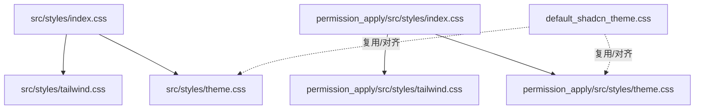
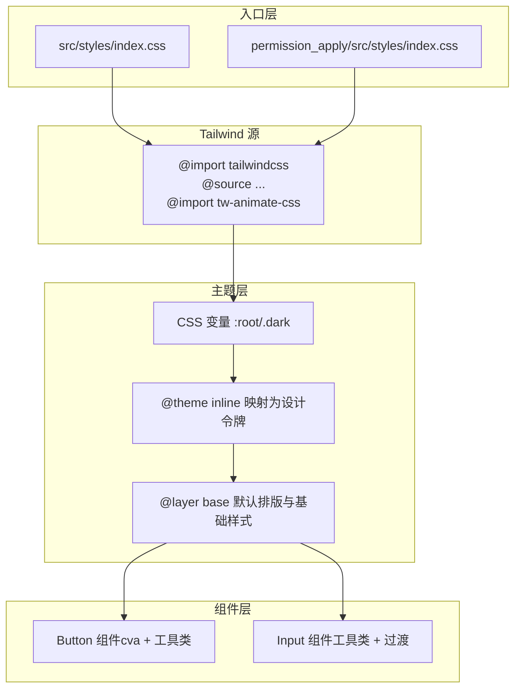
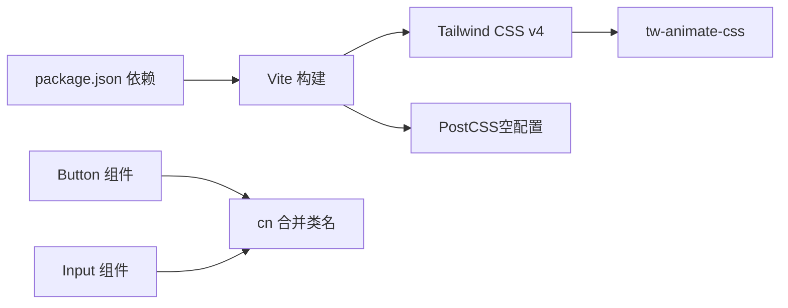

# 样式系统

<cite>
**本文引用的文件**
- [src/styles/index.css](file://src/styles/index.css)
- [src/styles/tailwind.css](file://src/styles/tailwind.css)
- [src/styles/theme.css](file://src/styles/theme.css)
- [permission_apply/src/styles/index.css](file://permission_apply/src/styles/index.css)
- [permission_apply/src/styles/tailwind.css](file://permission_apply/src/styles/tailwind.css)
- [permission_apply/src/styles/theme.css](file://permission_apply/src/styles/theme.css)
- [default_shadcn_theme.css](file://default_shadcn_theme.css)
- [package.json](file://package.json)
- [postcss.config.mjs](file://postcss.config.mjs)
- [vite.config.ts](file://vite.config.ts)
- [src/app/components/ui/button.tsx](file://src/app/components/ui/button.tsx)
- [src/app/components/ui/input.tsx](file://src/app/components/ui/input.tsx)
- [src/app/store/AppContext.tsx](file://src/app/store/AppContext.tsx)
</cite>

## 目录
1. [简介](#简介)
2. [项目结构](#项目结构)
3. [核心组件](#核心组件)
4. [架构总览](#架构总览)
5. [详细组件分析](#详细组件分析)
6. [依赖关系分析](#依赖关系分析)
7. [性能考量](#性能考量)
8. [故障排查指南](#故障排查指南)
9. [结论](#结论)
10. [附录](#附录)

## 简介
本文件系统化梳理本项目的样式体系，涵盖 Tailwind CSS 配置、主题定制（含暗色模式）、响应式与动画、CSS 变量系统、颜色与字体排版、间距规范、主题切换机制以及跨浏览器兼容性策略。文档以“分层递进”的方式呈现，既面向开发者也便于非技术读者理解。

## 项目结构
样式系统由三层构成：入口聚合、Tailwind 源配置与主题变量层，分别位于主工程与权限申请子工程中，形成一致的主题与工具类体系。

图表来源
- [src/styles/index.css:1-4](file://src/styles/index.css#L1-L4)
- [src/styles/tailwind.css:1-5](file://src/styles/tailwind.css#L1-L5)
- [src/styles/theme.css:1-182](file://src/styles/theme.css#L1-L182)
- [permission_apply/src/styles/index.css:1-4](file://permission_apply/src/styles/index.css#L1-L4)
- [permission_apply/src/styles/tailwind.css:1-5](file://permission_apply/src/styles/tailwind.css#L1-L5)
- [permission_apply/src/styles/theme.css:1-182](file://permission_apply/src/styles/theme.css#L1-L182)
- [default_shadcn_theme.css:1-121](file://default_shadcn_theme.css#L1-L121)

章节来源
- [src/styles/index.css:1-4](file://src/styles/index.css#L1-L4)
- [permission_apply/src/styles/index.css:1-4](file://permission_apply/src/styles/index.css#L1-L4)

## 核心组件
- 入口聚合
  - 主工程与权限申请工程均通过各自的 index.css 聚合字体、Tailwind 源与主题层，确保构建时顺序正确。
- Tailwind 源配置
  - 使用 Tailwind CSS v4 的新语法，通过 @source 指定扫描源文件范围，并引入 tw-animate-css 实现基础动画工具类。
- 主题层（CSS 变量与设计令牌）
  - 定义 :root 与 .dark 均使用 oklch 表达的颜色空间，统一提供背景、前景、卡片、弹出层、主要/次要/强调/破坏性、边框、输入、环形光晕、图表色板与圆角半径等设计令牌。
  - 通过 @theme inline 将 CSS 变量映射为 Tailwind 设计令牌，使工具类可直接消费。
  - 在 @layer base 中设置全局默认排版与基础元素样式，保证工具类优先级合理。
- 动画与过渡
  - 引入 tw-animate-css，结合工具类在交互中启用动画；同时在组件层使用过渡类实现焦点、悬停、禁用等状态变化。
- 构建与插件链
  - Vite 集成 @tailwindcss/vite 插件自动处理 Tailwind；PostCSS 保持空配置以便扩展。

章节来源
- [src/styles/tailwind.css:1-5](file://src/styles/tailwind.css#L1-L5)
- [src/styles/theme.css:1-182](file://src/styles/theme.css#L1-L182)
- [permission_apply/src/styles/tailwind.css:1-5](file://permission_apply/src/styles/tailwind.css#L1-L5)
- [permission_apply/src/styles/theme.css:1-182](file://permission_apply/src/styles/theme.css#L1-L182)
- [default_shadcn_theme.css:1-121](file://default_shadcn_theme.css#L1-L121)
- [vite.config.ts:1-37](file://vite.config.ts#L1-L37)
- [postcss.config.mjs:1-16](file://postcss.config.mjs#L1-L16)

## 架构总览
下图展示从入口到工具类与主题令牌的全链路：

图表来源
- [src/styles/index.css:1-4](file://src/styles/index.css#L1-L4)
- [permission_apply/src/styles/index.css:1-4](file://permission_apply/src/styles/index.css#L1-L4)
- [src/styles/tailwind.css:1-5](file://src/styles/tailwind.css#L1-L5)
- [src/styles/theme.css:1-182](file://src/styles/theme.css#L1-L182)
- [src/app/components/ui/button.tsx:1-59](file://src/app/components/ui/button.tsx#L1-L59)
- [src/app/components/ui/input.tsx:1-22](file://src/app/components/ui/input.tsx#L1-L22)

## 详细组件分析

### Tailwind 源配置与扫描
- 关键点
  - 使用 @source 指向 TypeScript/JSX 源目录，确保仅扫描实际使用的组件文件，减少无用样式生成。
  - 引入 tw-animate-css 提供基础动画工具类，便于在交互中快速启用。
- 影响
  - 构建体积可控、运行时样式精准；动画与过渡类可直接在组件中组合使用。

章节来源
- [src/styles/tailwind.css:1-5](file://src/styles/tailwind.css#L1-L5)
- [permission_apply/src/styles/tailwind.css:1-5](file://permission_apply/src/styles/tailwind.css#L1-L5)

### 主题系统与设计令牌
- 设计令牌
  - 颜色：背景、前景、卡片、弹出层、主要/次要/强调/破坏性、边框、输入、环形光晕、侧边栏系列、图表色板。
  - 字体与排版：根字号、标题层级默认字号与字重、行高。
  - 圆角：提供 sm/md/lg/xl 四档半径。
- 暗色模式
  - 通过自定义 dark 伪变体与 .dark 类切换，所有令牌在 .dark 下重新赋值，确保一致性。
- 设计令牌映射
  - @theme inline 将 CSS 变量映射为 Tailwind 设计令牌，使工具类如 bg-primary/text-primary-foreground 等生效。
- 基础层样式
  - @layer base 设置全局边框、轮廓、body 背景与文本色，以及 h1–h4、label、button、input 的默认排版，工具类按需覆盖。

章节来源
- [src/styles/theme.css:1-182](file://src/styles/theme.css#L1-L182)
- [permission_apply/src/styles/theme.css:1-182](file://permission_apply/src/styles/theme.css#L1-L182)
- [default_shadcn_theme.css:1-121](file://default_shadcn_theme.css#L1-L121)

### 组件层样式实践
- Button 组件
  - 使用 class-variance-authority（cva）定义变体与尺寸，结合 cn 合并类名。
  - 工具类覆盖：边框、背景、前景、悬停、聚焦环、禁用态、错误态（含明/暗两套），SVG 内联尺寸适配。
- Input 组件
  - 统一输入容器的边框、背景、占位符、选择区颜色、过渡与聚焦环。
  - 错误态 ring 与 border 在明/暗模式下分别配置透明度，提升可读性。

章节来源
- [src/app/components/ui/button.tsx:1-59](file://src/app/components/ui/button.tsx#L1-L59)
- [src/app/components/ui/input.tsx:1-22](file://src/app/components/ui/input.tsx#L1-L22)

### 主题切换机制与暗色模式
- 切换策略
  - 通过 .dark 类切换控制主题令牌，配合自定义 dark 伪变体确保后代元素继承正确。
- 与上下文集成
  - AppContext 提供账户与业务状态，可在应用层根据用户偏好或系统设置写入 .dark 类至根元素，从而驱动主题切换。
- 一致性保障
  - 主题变量与设计令牌在主工程与权限申请工程中保持一致，避免视觉割裂。

章节来源
- [src/styles/theme.css:1-182](file://src/styles/theme.css#L1-L182)
- [permission_apply/src/styles/theme.css:1-182](file://permission_apply/src/styles/theme.css#L1-L182)
- [src/app/store/AppContext.tsx:1-64](file://src/app/store/AppContext.tsx#L1-L64)

### 响应式设计与动画
- 响应式
  - Tailwind v4 提供内置响应式前缀与断点，结合组件内工具类即可实现多端一致体验。
- 动画
  - tw-animate-css 提供基础动画类，组件层可叠加过渡类实现平滑交互。

章节来源
- [src/styles/tailwind.css:1-5](file://src/styles/tailwind.css#L1-L5)
- [src/app/components/ui/button.tsx:1-59](file://src/app/components/ui/button.tsx#L1-L59)
- [src/app/components/ui/input.tsx:1-22](file://src/app/components/ui/input.tsx#L1-L22)

## 依赖关系分析
- 构建链路
  - Vite 加载 @tailwindcss/vite 插件，自动注入 Tailwind 所需 PostCSS 插件，无需手动配置 tailwindcss/autoprefixer。
  - PostCSS 保持空配置，便于未来按需扩展。
- 运行时依赖
  - tw-animate-css 提供动画工具类；next-themes 用于主题持久化与 SSR 支持（若需要）。
- 组件层依赖
  - Button/Input 组件依赖 cn（clsx + tailwind-merge）合并类名，cva 定义变体，Radix Slot 支持语义标签透传。

图表来源
- [package.json:1-91](file://package.json#L1-L91)
- [vite.config.ts:1-37](file://vite.config.ts#L1-L37)
- [postcss.config.mjs:1-16](file://postcss.config.mjs#L1-L16)
- [src/app/components/ui/button.tsx:1-59](file://src/app/components/ui/button.tsx#L1-L59)
- [src/app/components/ui/input.tsx:1-22](file://src/app/components/ui/input.tsx#L1-L22)

章节来源
- [package.json:1-91](file://package.json#L1-L91)
- [vite.config.ts:1-37](file://vite.config.ts#L1-L37)
- [postcss.config.mjs:1-16](file://postcss.config.mjs#L1-L16)

## 性能考量
- 样式体积
  - 通过 @source 精准扫描源文件，避免打包未使用样式。
  - 仅引入必要动画类，避免过度使用复杂动画影响性能。
- 渲染效率
  - 使用过渡类替代昂贵动画，保持帧率稳定。
  - 合理拆分组件样式，避免重复计算与重绘。
- 构建优化
  - 保持 PostCSS 空配置，减少额外转换开销；按需扩展插件。

## 故障排查指南
- 样式不生效
  - 检查 index.css 导入顺序是否正确（字体 → Tailwind → 主题）。
  - 确认 @source 路径包含当前组件文件，避免被忽略。
- 暗色模式异常
  - 确保根元素存在 .dark 类或对应切换逻辑已执行。
  - 对比 :root 与 .dark 下的令牌值，确认映射一致。
- 动画无效
  - 确认 tw-animate-css 已导入且未被覆盖。
  - 检查组件是否正确组合过渡类与动画类。
- 构建报错
  - 确认 @tailwindcss/vite 插件已加载，PostCSS 配置为空对象即可。

章节来源
- [src/styles/index.css:1-4](file://src/styles/index.css#L1-L4)
- [src/styles/tailwind.css:1-5](file://src/styles/tailwind.css#L1-L5)
- [src/styles/theme.css:1-182](file://src/styles/theme.css#L1-L182)
- [postcss.config.mjs:1-16](file://postcss.config.mjs#L1-L16)
- [vite.config.ts:1-37](file://vite.config.ts#L1-L37)

## 结论
本样式系统以 Tailwind CSS v4 为核心，结合 CSS 变量与 @theme 映射，形成可维护、可扩展的设计令牌体系。通过 .dark 类与自定义伪变体实现稳定的暗色模式，组件层采用 cva 与工具类组合，兼顾一致性与灵活性。构建链路简洁高效，具备良好的性能与可维护性。

## 附录

### 设计令牌清单（节选）
- 颜色令牌
  - 背景、前景、卡片、弹出层、主要、次要、强调、破坏性、边框、输入、环形光晕、侧边栏系列、图表色板
- 排版令牌
  - 根字号、标题层级默认字号、字重、行高
- 圆角令牌
  - sm/md/lg/xl 四档半径

章节来源
- [src/styles/theme.css:1-182](file://src/styles/theme.css#L1-L182)
- [permission_apply/src/styles/theme.css:1-182](file://permission_apply/src/styles/theme.css#L1-L182)
- [default_shadcn_theme.css:1-121](file://default_shadcn_theme.css#L1-L121)