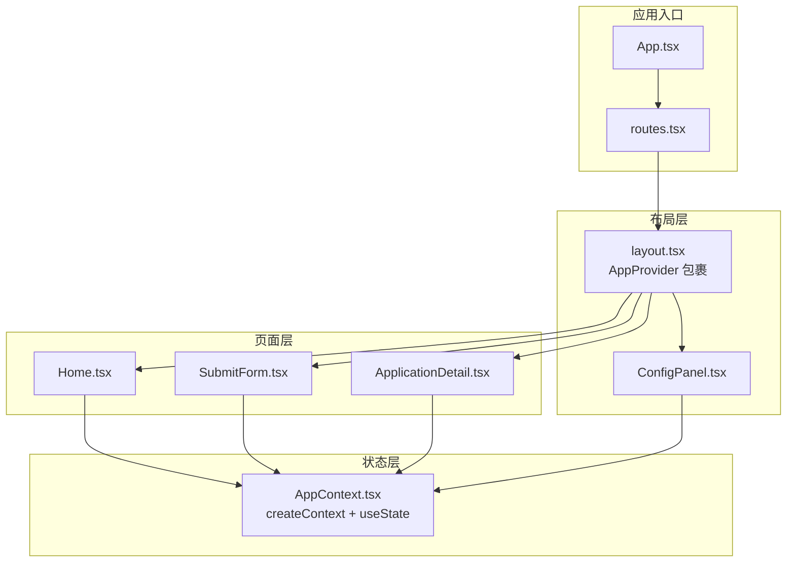
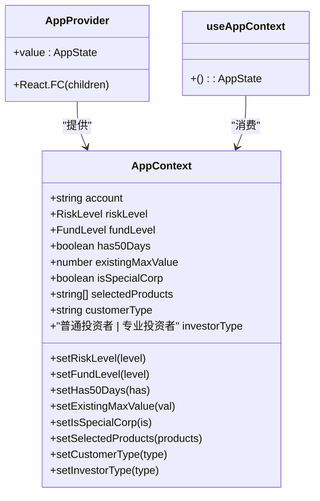
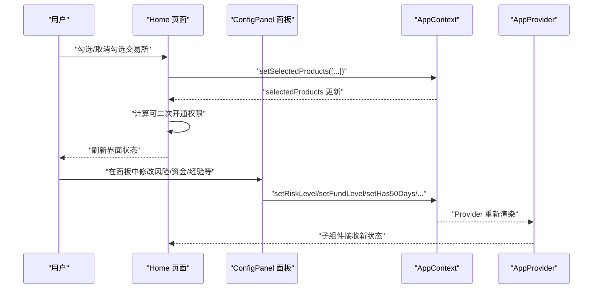
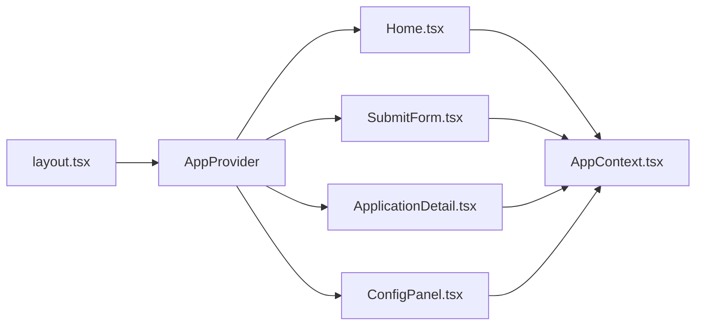

# AppContext应用上下文

<cite>
**本文档引用的文件**
- [AppContext.tsx](file://src/app/store/AppContext.tsx)
- [AppContext.tsx](file://permission_apply/src/app/store/AppContext.tsx)
- [layout.tsx](file://src/app/layout.tsx)
- [layout.tsx](file://permission_apply/src/app/layout.tsx)
- [Home.tsx](file://src/app/pages/Home.tsx)
- [SubmitForm.tsx](file://src/app/pages/SubmitForm.tsx)
- [ApplicationDetail.tsx](file://src/app/pages/ApplicationDetail.tsx)
- [ConfigPanel.tsx](file://src/app/components/ConfigPanel.tsx)
- [routes.tsx](file://src/app/routes.tsx)
- [App.tsx](file://src/app/App.tsx)
- [package.json](file://package.json)
- [utils.ts](file://src/lib/utils.ts)
</cite>

## 目录
1. [简介](#简介)
2. [项目结构](#项目结构)
3. [核心组件](#核心组件)
4. [架构总览](#架构总览)
5. [详细组件分析](#详细组件分析)
6. [依赖关系分析](#依赖关系分析)
7. [性能考量](#性能考量)
8. [故障排查指南](#故障排查指南)
9. [结论](#结论)
10. [附录](#附录)

## 简介
AppContext 是本项目中的全局状态管理模块，采用 React Context + Hooks 的模式实现跨组件的状态共享。它集中管理与交易权限申请相关的用户身份、风险等级、资金规模、交易经验、历史最高权限、客户类型、投资者类型等核心状态，并提供对应的 setter 方法用于状态更新。

该上下文在应用启动时通过根布局组件进行 Provider 包装，使得任意子组件均可通过自定义 Hook useAppContext 获取并消费这些状态，从而简化了状态传递链路，提升开发效率与可维护性。

## 项目结构
AppContext 所在位置与主要使用点如下：
- 存放位置：src/app/store/AppContext.tsx（以及 permission_apply/src/app/store/AppContext.tsx）
- 根布局注入：src/app/layout.tsx（以及 permission_apply/src/app/layout.tsx）
- 主页使用：src/app/pages/Home.tsx
- 表单页使用：src/app/pages/SubmitForm.tsx
- 详情页使用：src/app/pages/ApplicationDetail.tsx
- 配置面板：src/app/components/ConfigPanel.tsx
- 路由配置：src/app/routes.tsx
- 应用入口：src/app/App.tsx

**图表来源**
- [App.tsx:1-6](file://src/app/App.tsx#L1-L6)
- [routes.tsx:1-38](file://src/app/routes.tsx#L1-L38)
- [layout.tsx:74-175](file://src/app/layout.tsx#L74-L175)
- [AppContext.tsx:1-64](file://src/app/store/AppContext.tsx#L1-L64)
- [Home.tsx:61-809](file://src/app/pages/Home.tsx#L61-L809)
- [SubmitForm.tsx:57-747](file://src/app/pages/SubmitForm.tsx#L57-L747)
- [ApplicationDetail.tsx:1-113](file://src/app/pages/ApplicationDetail.tsx#L1-L113)
- [ConfigPanel.tsx:1-122](file://src/app/components/ConfigPanel.tsx#L1-L122)

**章节来源**
- [AppContext.tsx:1-64](file://src/app/store/AppContext.tsx#L1-L64)
- [layout.tsx:74-175](file://src/app/layout.tsx#L74-L175)
- [routes.tsx:1-38](file://src/app/routes.tsx#L1-L38)

## 核心组件
AppContext 的核心接口定义与默认值如下：
- 类型与枚举
  - 风险等级 RiskLevel：'C3' | 'C4' | 'C5'
  - 资金规模 FundLevel：'LT_500K' | 'GE_500K_LT_1M' | 'GE_1M'
- 状态结构 AppState
  - 基本信息：account（字符串）
  - 风险等级：riskLevel（RiskLevel），setRiskLevel
  - 资金规模：fundLevel（FundLevel），setFundLevel
  - 是否满足50个交易日：has50Days（boolean），setHas50Days
  - 历史最高权限值：existingMaxValue（number），setExistingMaxValue
  - 是否为特种客户：isSpecialCorp（boolean），setIsSpecialCorp
  - 已选产品集合：selectedProducts（string[]），setSelectedProducts
  - 客户类型：customerType（'一般法人'），setCustomerType
  - 投资者类型：investorType（'普通投资者' | '专业投资者'），setInvestorType
- 提供者与Hook
  - AppProvider：在根布局中包裹，向子树提供状态
  - useAppContext：自定义Hook，用于在组件中消费状态

默认初始值（Provider内部useState初始化）：
- riskLevel：'C4'
- fundLevel：'LT_500K'
- has50Days：false
- existingMaxValue：0
- isSpecialCorp：false
- customerType：'一般法人'
- investorType：'普通投资者'
- selectedProducts：[]

**章节来源**
- [AppContext.tsx:3-27](file://src/app/store/AppContext.tsx#L3-L27)
- [AppContext.tsx:31-57](file://src/app/store/AppContext.tsx#L31-L57)

## 架构总览
AppContext 作为全局状态容器，遵循以下设计原则：
- 单一职责：仅承载交易权限申请相关的上下文状态
- 明确边界：通过类型约束确保状态字段的取值范围
- 受控更新：每个状态均提供对应的 setter 方法，便于集中管理
- 组件解耦：各页面组件通过 useAppContext 消费状态，避免层层 props 下传

**图表来源**
- [AppContext.tsx:6-27](file://src/app/store/AppContext.tsx#L6-L27)
- [AppContext.tsx:29-63](file://src/app/store/AppContext.tsx#L29-L63)

## 详细组件分析

### AppProvider 与 useAppContext
- AppProvider
  - 在根布局中被调用，向整个路由树提供 AppState
  - 内部通过 useState 初始化所有状态字段
- useAppContext
  - 自定义 Hook，封装 useContext 并在未包裹时抛出错误
  - 保证只有在 AppProvider 子树内的组件才能正确访问状态

最佳实践建议：
- 确保 AppProvider 位于应用根部，覆盖所有需要访问状态的页面
- 在组件中统一通过 useAppContext 获取状态，避免直接从外部导入状态变量

**章节来源**
- [AppContext.tsx:29-63](file://src/app/store/AppContext.tsx#L29-L63)
- [layout.tsx:81-82](file://src/app/layout.tsx#L81-L82)

### 风险等级（riskLevel）
- 作用：标识普通投资者的适当性等级，影响可申请的交易权限范围
- 业务含义：
  - C3：限制开通 R4 级别品种（如金融期货、原油等）
  - C4/C5：可申请更高风险级别的权限
- 使用场景：主页权限选择逻辑会根据 riskLevel 过滤可选交易所；C3 时禁止勾选 R4 品种

**章节来源**
- [AppContext.tsx:8-9](file://src/app/store/AppContext.tsx#L8-L9)
- [Home.tsx:114-132](file://src/app/pages/Home.tsx#L114-L132)

### 资金规模（fundLevel）
- 作用：表示客户近 5 个交易日的可用资金区间，决定部分权限的开通条件
- 业务含义：
  - LT_500K：小于 50 万
  - GE_500K_LT_1M：大于等于 50 万且小于 100 万
  - GE_1M：大于等于 100 万
- 使用场景：主页“可二次开通”判断逻辑中，结合 has50Days 与 existingMaxValue 决定是否允许开通某些权限

**章节来源**
- [AppContext.tsx:12-13](file://src/app/store/AppContext.tsx#L12-L13)
- [Home.tsx:175-197](file://src/app/pages/Home.tsx#L175-L197)

### 持有时间（has50Days）
- 作用：标识客户是否满足“最近 5 个交易日每日均满足资金门槛”的条件
- 业务含义：与 fundLevel 协同影响权限开通资格
- 使用场景：在 canSecondOpen 判断中，当资金门槛满足但持有时间不足时，仍可能允许开通部分权限

**章节来源**
- [AppContext.tsx:14-15](file://src/app/store/AppContext.tsx#L14-L15)
- [Home.tsx:175-197](file://src/app/pages/Home.tsx#L175-L197)

### 历史最高权限（existingMaxValue）
- 作用：记录客户已拥有的最高权限值，用于判断是否已开通某权限
- 业务含义：
  - 0：未开通任何特殊权限
  - 5：商品类权限
  - 8：原油权限
  - 10：中金所权限
- 使用场景：主页 isAlreadyOwned 判断，避免重复勾选已开通的交易所

**章节来源**
- [AppContext.tsx:16-17](file://src/app/store/AppContext.tsx#L16-L17)
- [Home.tsx:107-109](file://src/app/pages/Home.tsx#L107-L109)

### 特种客户（isSpecialCorp）
- 作用：区分“一般法人”与“特种客户”，影响页面展示与部分流程
- 业务含义：特种客户在页面上展示不同的产品名称与流程选项
- 使用场景：主页与表单页根据 isSpecialCorp 控制展示内容与必填项

**章节来源**
- [AppContext.tsx:18-19](file://src/app/store/AppContext.tsx#L18-L19)
- [Home.tsx:308-313](file://src/app/pages/Home.tsx#L308-L313)
- [SubmitForm.tsx:178-188](file://src/app/pages/SubmitForm.tsx#L178-L188)

### 已选产品（selectedProducts）
- 作用：记录用户勾选的交易所 ID 集合，作为权限申请的核心输入
- 业务含义：用于生成申请清单、评估开通条件、去重与联动勾选
- 使用场景：主页全选/反选、自动勾选/反选原油期货与期权的关系、提交时过滤新增权限

**章节来源**
- [AppContext.tsx:21-22](file://src/app/store/AppContext.tsx#L21-L22)
- [Home.tsx:118-155](file://src/app/pages/Home.tsx#L118-L155)

### 客户类型与投资者类型（customerType, investorType）
- 作用：标识客户基础属性与适当性分类
- 业务含义：
  - customerType：'一般法人'（默认）
  - investorType：'普通投资者' | '专业投资者'
- 使用场景：页面展示适当性等级、不同类型的流程差异

**章节来源**
- [AppContext.tsx:23-26](file://src/app/store/AppContext.tsx#L23-L26)
- [Home.tsx:318-341](file://src/app/pages/Home.tsx#L318-L341)
- [SubmitForm.tsx:193-216](file://src/app/pages/SubmitForm.tsx#L193-L216)

### 状态更新流程（以主页为例）

**图表来源**
- [Home.tsx:118-155](file://src/app/pages/Home.tsx#L118-L155)
- [ConfigPanel.tsx:1-122](file://src/app/components/ConfigPanel.tsx#L1-L122)
- [AppContext.tsx:42-56](file://src/app/store/AppContext.tsx#L42-L56)

## 依赖关系分析
- 组件依赖
  - Home、SubmitForm、ApplicationDetail 等页面组件均依赖 useAppContext 获取状态
  - ConfigPanel 依赖 useAppContext 修改状态
- Provider 依赖
  - layout.tsx 中的 AppProvider 作为根级 Provider，向上提供状态
- 外部依赖
  - React Router 用于页面导航与状态传递
  - Tailwind CSS 与 UI 组件库用于界面构建

**图表来源**
- [layout.tsx:81-82](file://src/app/layout.tsx#L81-L82)
- [Home.tsx:61-809](file://src/app/pages/Home.tsx#L61-L809)
- [SubmitForm.tsx:57-747](file://src/app/pages/SubmitForm.tsx#L57-L747)
- [ApplicationDetail.tsx:1-113](file://src/app/pages/ApplicationDetail.tsx#L1-L113)
- [ConfigPanel.tsx:1-122](file://src/app/components/ConfigPanel.tsx#L1-L122)
- [AppContext.tsx:1-64](file://src/app/store/AppContext.tsx#L1-L64)

**章节来源**
- [routes.tsx:1-38](file://src/app/routes.tsx#L1-L38)
- [App.tsx:1-6](file://src/app/App.tsx#L1-L6)

## 性能考量
- 状态粒度
  - 将相关状态聚合在一个 Context 中，减少 Provider 层级与重渲染次数
- 渲染优化
  - 使用 React.memo 或 useMemo 优化复杂计算（如 canSecondOpen 的判断）
  - 合理拆分子组件，避免不必要的整体重渲染
- 数据结构
  - selectedProducts 使用数组存储，注意去重与批量操作的性能（例如使用 Set 进行临时去重）
- 最佳实践
  - 避免在高频交互中触发大量 setState
  - 对于复杂筛选与计算，考虑缓存中间结果
  - 使用 React DevTools Profiler 分析渲染热点

## 故障排查指南
常见问题与定位方法：
- useAppContext 报错：未在 AppProvider 子树内使用
  - 排查：确认 layout.tsx 中 AppProvider 是否包裹了对应页面
  - 参考：useAppContext 在未找到上下文时抛出错误
- 状态未更新或更新无效
  - 排查：检查 setter 方法调用是否正确；确认组件是否重新渲染
  - 参考：AppProvider 内部 useState 初始化与 Provider value 传递
- 权限判断异常
  - 排查：核对 riskLevel、fundLevel、has50Days、existingMaxValue 的组合逻辑
  - 参考：canSecondOpen 与 isAlreadyOwned 的实现

**章节来源**
- [AppContext.tsx:59-63](file://src/app/store/AppContext.tsx#L59-L63)
- [layout.tsx:81-82](file://src/app/layout.tsx#L81-L82)
- [Home.tsx:175-231](file://src/app/pages/Home.tsx#L175-L231)

## 结论
AppContext 通过简洁的类型定义与受控的状态更新，有效支撑了交易权限申请流程中的关键业务逻辑。其设计遵循单一职责与明确边界的原则，配合自定义 Hook 降低了组件间的耦合度。在实际使用中，建议严格遵守状态更新规范，关注性能优化与调试策略，以确保用户体验与系统稳定性。

## 附录

### API 接口文档（概览）
- 提供者
  - AppProvider：向子树提供 AppState
- Hook
  - useAppContext：返回 AppState，包含所有状态与 setter
- 状态字段
  - account：string
  - riskLevel：'C3' | 'C4' | 'C5'
  - fundLevel：'LT_500K' | 'GE_500K_LT_1M' | 'GE_1M'
  - has50Days：boolean
  - existingMaxValue：number
  - isSpecialCorp：boolean
  - selectedProducts：string[]
  - customerType：'一般法人'
  - investorType：'普通投资者' | '专业投资者'

使用示例路径（不展示具体代码，仅提供定位）：
- 在页面中消费状态：[Home.tsx:64-64](file://src/app/pages/Home.tsx#L64-L64)
- 在配置面板中更新状态：[ConfigPanel.tsx:6-14](file://src/app/components/ConfigPanel.tsx#L6-L14)
- 在表单页中消费状态：[SubmitForm.tsx:60-60](file://src/app/pages/SubmitForm.tsx#L60-L60)

**章节来源**
- [AppContext.tsx:6-27](file://src/app/store/AppContext.tsx#L6-L27)
- [Home.tsx:64-64](file://src/app/pages/Home.tsx#L64-L64)
- [ConfigPanel.tsx:6-14](file://src/app/components/ConfigPanel.tsx#L6-L14)
- [SubmitForm.tsx:60-60](file://src/app/pages/SubmitForm.tsx#L60-L60)