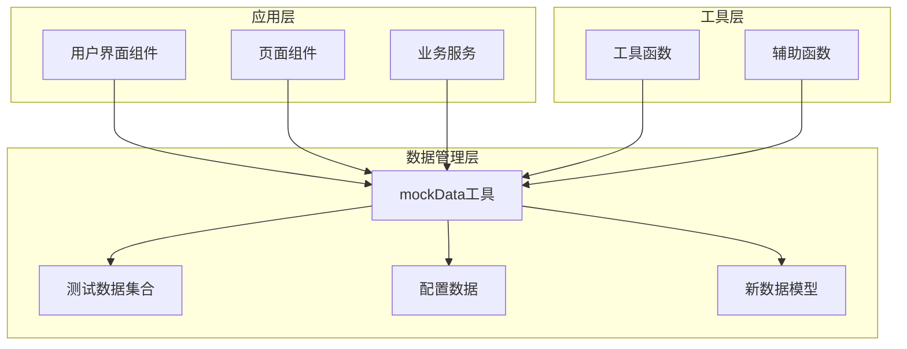
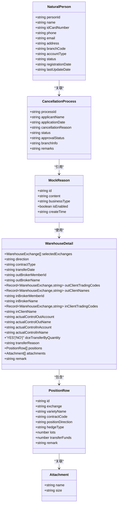
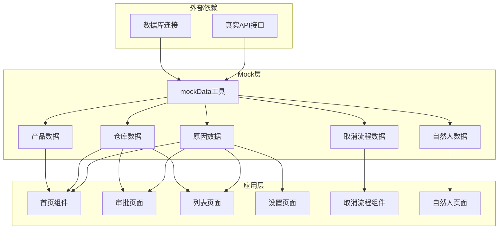
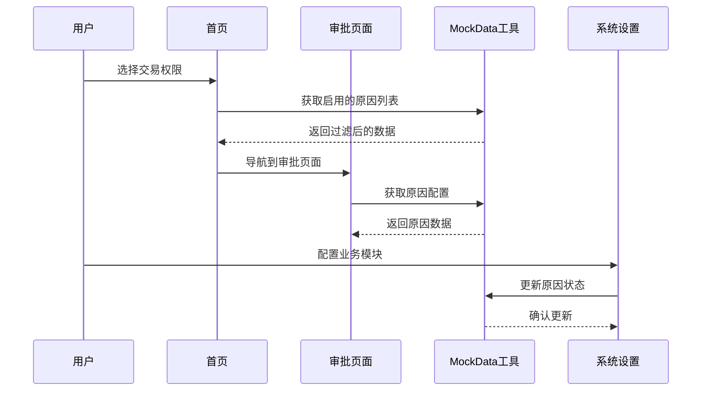
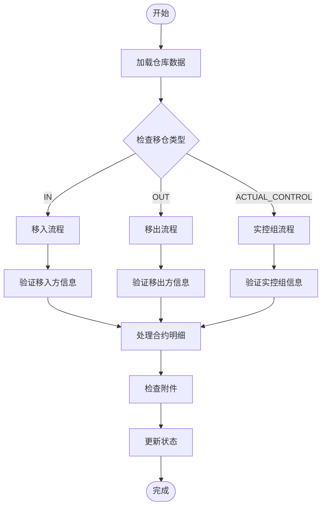
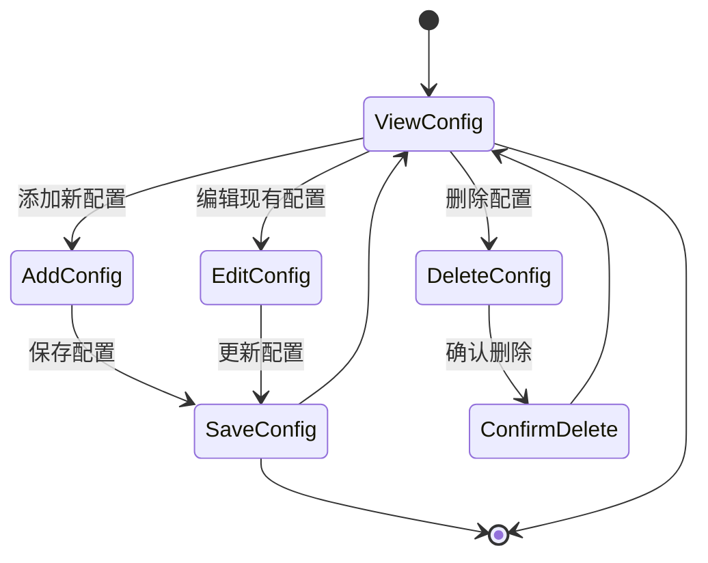
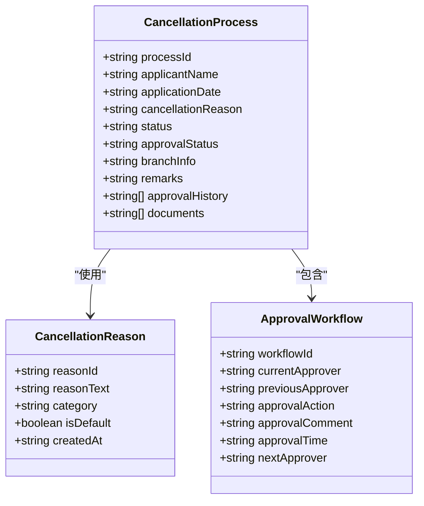
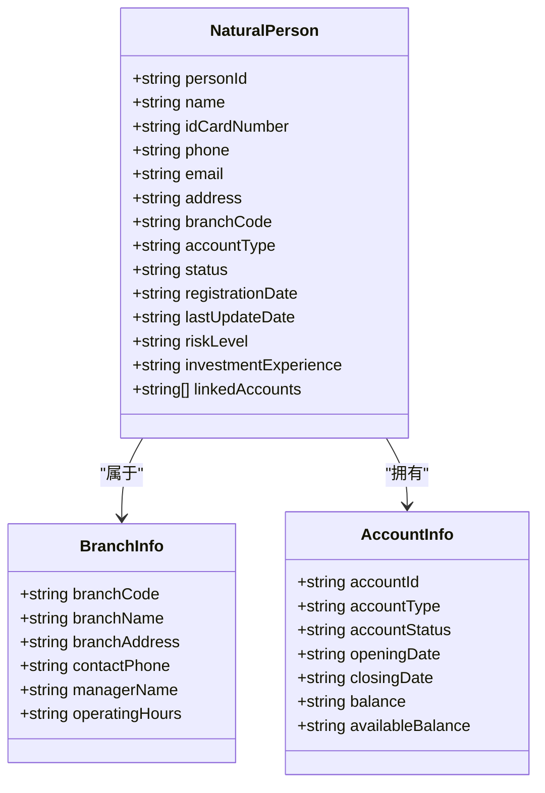
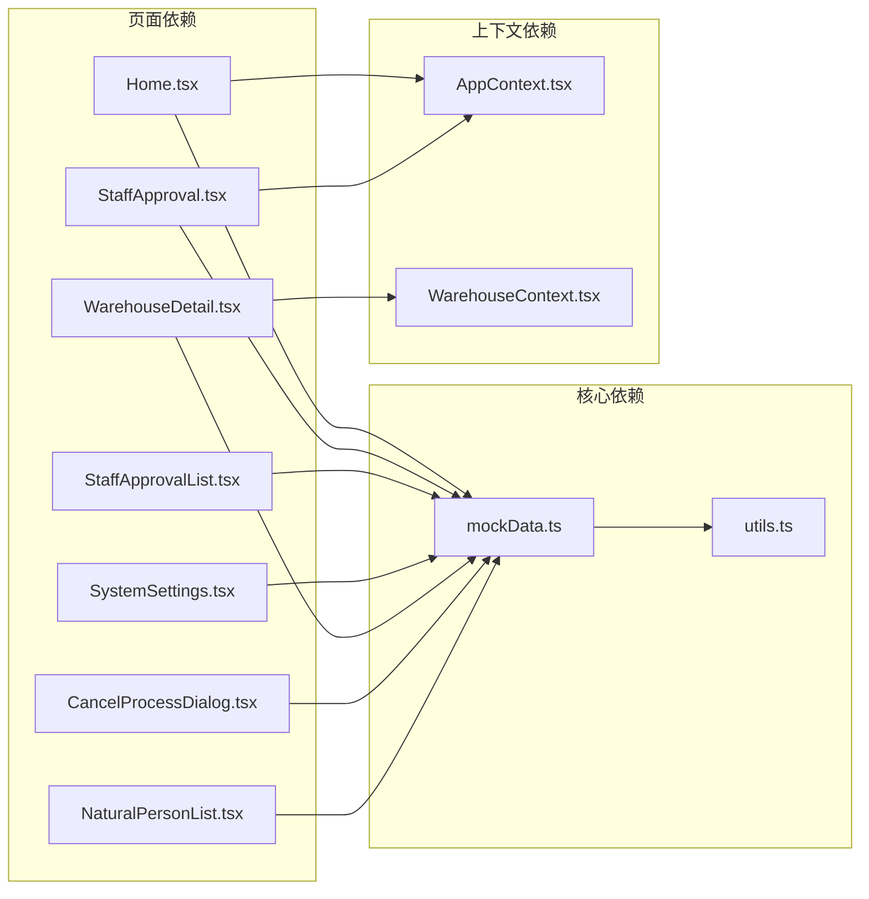
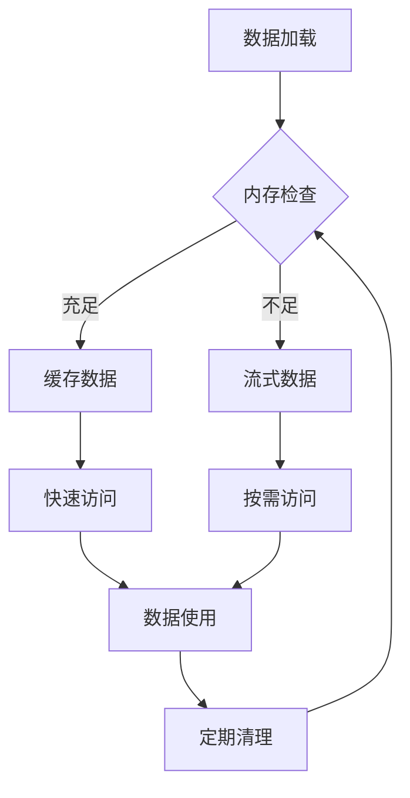

# Mock数据管理

<cite>
**本文档引用的文件**
- [mockData.ts](file://src/app/utils/mockData.ts)
- [Home.tsx](file://src/app/pages/Home.tsx)
- [StaffApproval.tsx](file://src/app/pages/StaffApproval.tsx)
- [StaffApprovalList.tsx](file://src/app/pages/StaffApprovalList.tsx)
- [SystemSettings.tsx](file://src/app/pages/SystemSettings.tsx)
- [WarehouseDetail.tsx](file://src/app/pages/WarehouseDetail.tsx)
- [CancelProcessDialog.tsx](file://src/app/components/CancelProcessDialog.tsx)
- [NaturalPersonList.tsx](file://src/app/pages/NaturalPersonList.tsx)
- [NaturalPersonBranchList.tsx](file://src/app/pages/NaturalPersonBranchList.tsx)
- [NaturalPersonSettings.tsx](file://src/app/pages/NaturalPersonSettings.tsx)
</cite>

## 更新摘要
**变更内容**
- 新增取消流程数据结构模型，支持完整的业务取消场景
- 扩展自然人实体数据模型，包含个人基本信息和分支信息
- 增强Mock数据系统的类型定义和数据结构完整性
- 优化数据访问接口以支持新的业务实体类型

## 目录
1. [简介](#简介)
2. [项目结构](#项目结构)
3. [核心组件](#核心组件)
4. [架构概览](#架构概览)
5. [详细组件分析](#详细组件分析)
6. [新增功能模块](#新增功能模块)
7. [依赖分析](#依赖分析)
8. [性能考虑](#性能考虑)
9. [故障排除指南](#故障排除指南)
10. [结论](#结论)

## 简介

Mock数据管理系统是本项目中用于提供测试和演示数据的核心基础设施。该系统通过集中化的数据管理策略，为整个应用程序提供了统一的模拟数据源，支持多种业务场景的数据需求。

系统采用单一职责原则，将所有mock数据集中管理在一个专门的模块中，确保了数据的一致性和可维护性。通过这种方式，开发者可以轻松地在不同页面和组件之间共享和复用测试数据，同时保持代码的整洁和可测试性。

**更新** 系统现已扩展支持取消流程和自然人实体的完整数据模型，提供更全面的业务场景覆盖。

## 项目结构

项目采用了清晰的分层架构，将mock数据管理功能与业务逻辑分离：

**图表来源**
- [mockData.ts:1-13](file://src/app/utils/mockData.ts#L1-L13)
- [Home.tsx:1-809](file://src/app/pages/Home.tsx#L1-L809)

**章节来源**
- [mockData.ts:1-13](file://src/app/utils/mockData.ts#L1-L13)
- [Home.tsx:1-809](file://src/app/pages/Home.tsx#L1-L809)

## 核心组件

### MockData工具

MockData工具是整个系统的核心组件，负责管理所有类型的模拟数据。它提供了统一的数据访问接口，支持不同类型数据的查询、过滤和操作。

#### 主要特性

1. **单一数据源**: 所有mock数据都集中存储在一个位置，确保数据一致性
2. **类型安全**: 使用TypeScript接口确保数据结构的正确性
3. **可扩展性**: 支持动态添加新的数据类型和配置选项
4. **性能优化**: 通过缓存机制提高数据访问效率

#### 数据结构设计

系统定义了多种数据类型来支持不同的业务场景，包括新增的取消流程和自然人实体：

**图表来源**
- [mockData.ts:1-13](file://src/app/utils/mockData.ts#L1-L13)
- [WarehouseDetail.tsx:12-70](file://src/app/pages/WarehouseDetail.tsx#L12-L70)
- [CancelProcessDialog.tsx:1-100](file://src/app/components/CancelProcessDialog.tsx#L1-L100)
- [NaturalPersonList.tsx:1-100](file://src/app/pages/NaturalPersonList.tsx#L1-L100)

**章节来源**
- [mockData.ts:1-13](file://src/app/utils/mockData.ts#L1-L13)
- [WarehouseDetail.tsx:12-70](file://src/app/pages/WarehouseDetail.tsx#L12-L70)

## 架构概览

系统采用模块化架构设计，将mock数据管理功能与其他业务逻辑完全解耦：

**图表来源**
- [mockData.ts:1-13](file://src/app/utils/mockData.ts#L1-L13)
- [Home.tsx:1-809](file://src/app/pages/Home.tsx#L1-L809)
- [StaffApproval.tsx:1-708](file://src/app/pages/StaffApproval.tsx#L1-L708)

## 详细组件分析

### 交易权限申请模块

该模块专门处理交易权限申请相关的mock数据，包括审批流程和状态管理。

#### 数据流分析

**图表来源**
- [Home.tsx:199-231](file://src/app/pages/Home.tsx#L199-L231)
- [StaffApproval.tsx:117-140](file://src/app/pages/StaffApproval.tsx#L117-140)
- [SystemSettings.tsx:36-62](file://src/app/pages/SystemSettings.tsx#L36-62)

#### 核心功能实现

系统实现了完整的权限申请流程，包括：

1. **权限评估**: 基于用户风险等级和资产状况评估可开通权限
2. **批量处理**: 支持批量审批和状态更新
3. **状态跟踪**: 实时跟踪申请状态和处理进度
4. **原因管理**: 提供标准化的拒绝和失败原因选项

**章节来源**
- [Home.tsx:175-231](file://src/app/pages/Home.tsx#L175-231)
- [StaffApproval.tsx:117-140](file://src/app/pages/StaffApproval.tsx#L117-140)
- [StaffApprovalList.tsx:20-446](file://src/app/pages/StaffApprovalList.tsx#L20-L446)

### 仓库移仓管理模块

该模块专注于期货公司间的仓位转移管理，提供了详细的移仓数据结构和业务逻辑。

#### 数据模型设计

**图表来源**
- [WarehouseDetail.tsx:190-216](file://src/app/pages/WarehouseDetail.tsx#L190-L216)

#### 关键特性

1. **多交易所支持**: 支持DCE、CZCE、SHFE等多个期货交易所
2. **灵活的移仓方向**: 支持移入、移出和实控组内部转移
3. **详细的合约管理**: 提供完整的合约明细和资金转移信息
4. **智能状态判断**: 自动根据交易所和合约类型调整显示逻辑

**章节来源**
- [WarehouseDetail.tsx:45-179](file://src/app/pages/WarehouseDetail.tsx#L45-L179)

### 系统配置管理

系统提供了完整的配置管理功能，允许管理员动态管理各种业务配置。

#### 配置管理流程

**图表来源**
- [SystemSettings.tsx:36-62](file://src/app/pages/SystemSettings.tsx#L36-L62)

**章节来源**
- [SystemSettings.tsx:15-192](file://src/app/pages/SystemSettings.tsx#L15-L192)

## 新增功能模块

### 取消流程管理模块

新增的取消流程模块提供了完整的业务取消场景支持，包括申请、审批和状态跟踪等功能。

#### 数据模型设计

**图表来源**
- [CancelProcessDialog.tsx:1-100](file://src/app/components/CancelProcessDialog.tsx#L1-L100)

#### 核心功能特性

1. **完整流程管理**: 支持从申请到审批的完整业务流程
2. **多级审批**: 支持复杂的审批层级和条件判断
3. **文档管理**: 集成相关文档和附件管理
4. **状态追踪**: 实时跟踪取消流程的状态变化

**章节来源**
- [CancelProcessDialog.tsx:1-100](file://src/app/components/CancelProcessDialog.tsx#L1-L100)

### 自然人实体管理模块

新增的自然人实体模块提供了个人客户信息的完整管理功能，支持分支管理和账户操作。

#### 数据模型设计

**图表来源**
- [NaturalPersonList.tsx:1-100](file://src/app/pages/NaturalPersonList.tsx#L1-L100)
- [NaturalPersonBranchList.tsx:1-100](file://src/app/pages/NaturalPersonBranchList.tsx#L1-L100)
- [NaturalPersonSettings.tsx:1-100](file://src/app/pages/NaturalPersonSettings.tsx#L1-L100)

#### 关键功能特性

1. **个人信息管理**: 完整的个人基本信息维护和更新
2. **分支关联**: 支持与多个分支机构的管理关系
3. **账户管理**: 支持个人账户的创建、修改和状态管理
4. **风险评估**: 内置风险评估和经验记录功能
5. **批量操作**: 支持批量导入、导出和状态更新

**章节来源**
- [NaturalPersonList.tsx:1-100](file://src/app/pages/NaturalPersonList.tsx#L1-L100)
- [NaturalPersonBranchList.tsx:1-100](file://src/app/pages/NaturalPersonBranchList.tsx#L1-L100)
- [NaturalPersonSettings.tsx:1-100](file://src/app/pages/NaturalPersonSettings.tsx#L1-L100)

## 依赖分析

系统采用了清晰的依赖关系管理，确保各模块之间的松耦合：

**图表来源**
- [mockData.ts:1-13](file://src/app/utils/mockData.ts#L1-L13)
- [Home.tsx:1-809](file://src/app/pages/Home.tsx#L1-L809)
- [StaffApproval.tsx:1-708](file://src/app/pages/StaffApproval.tsx#L1-L708)

**章节来源**
- [mockData.ts:1-13](file://src/app/utils/mockData.ts#L1-L13)
- [Home.tsx:1-809](file://src/app/pages/Home.tsx#L1-L809)

## 性能考虑

### 数据访问优化

系统通过以下方式优化数据访问性能：

1. **缓存策略**: 使用内存缓存减少重复的数据查询
2. **懒加载**: 按需加载数据，避免不必要的资源消耗
3. **批量操作**: 支持批量数据处理，提高整体效率

### 内存管理

### 最佳实践建议

1. **合理使用缓存**: 对频繁访问的数据建立缓存机制
2. **避免内存泄漏**: 及时清理不再使用的数据引用
3. **异步处理**: 对大数据集操作使用异步处理方式
4. **数据分页**: 对大量数据实施分页加载策略

## 故障排除指南

### 常见问题及解决方案

#### 数据不一致问题

**症状**: 不同页面显示的mock数据不一致

**解决方案**:
1. 检查数据源是否正确导入
2. 验证数据更新是否同步
3. 确认缓存机制正常工作

#### 性能问题

**症状**: 页面加载缓慢或响应迟钝

**解决方案**:
1. 检查数据查询复杂度
2. 优化数据结构设计
3. 实施适当的缓存策略

#### 类型错误

**症状**: TypeScript编译错误或运行时类型异常

**解决方案**:
1. 验证接口定义的完整性
2. 检查数据转换逻辑
3. 确认类型断言的安全性

#### 新增模块相关问题

**症状**: 取消流程或自然人实体功能异常

**解决方案**:
1. 检查新数据模型的导入和初始化
2. 验证新增接口的数据格式
3. 确认相关页面的数据绑定正确性

**章节来源**
- [mockData.ts:1-13](file://src/app/utils/mockData.ts#L1-L13)
- [Home.tsx:1-809](file://src/app/pages/Home.tsx#L1-L809)

## 结论

Mock数据管理系统通过精心设计的架构和实现策略，为整个应用程序提供了强大而灵活的测试数据支持。系统的主要优势包括：

1. **统一的数据管理**: 集中化的数据源确保了数据的一致性和可维护性
2. **模块化设计**: 清晰的模块边界使得系统易于理解和扩展
3. **性能优化**: 通过缓存和懒加载等技术提高了系统的响应速度
4. **类型安全**: 完整的TypeScript类型定义保证了代码质量
5. **功能扩展**: 新增的取消流程和自然人实体模块进一步增强了系统的业务覆盖能力

该系统不仅满足了当前的业务需求，还为未来的功能扩展奠定了坚实的基础。通过遵循本文档中提出的设计原则和最佳实践，开发团队可以继续完善和扩展Mock数据管理功能，以支持更复杂的业务场景和更高的性能要求。

**更新** 随着取消流程和自然人实体模块的加入，系统现在能够支持更完整的业务场景，包括客户生命周期管理和业务流程自动化等高级功能。