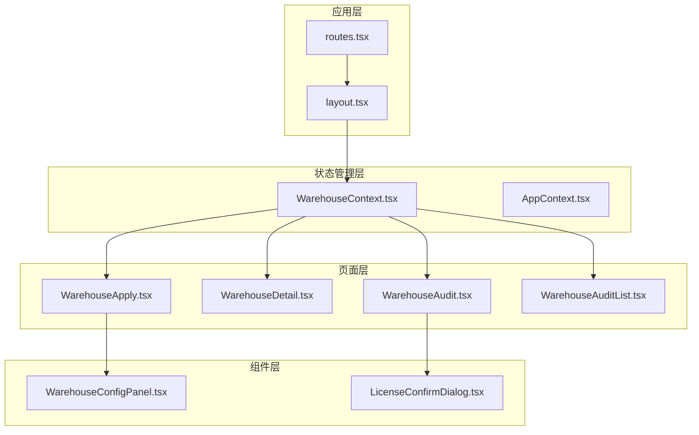
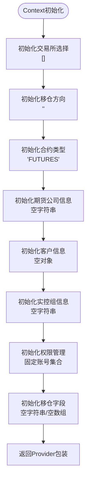
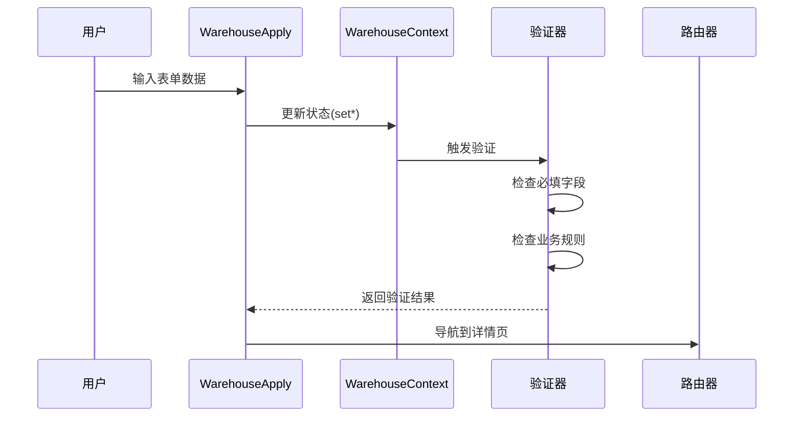
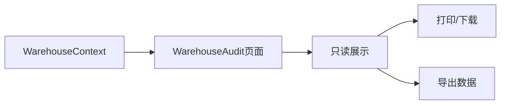
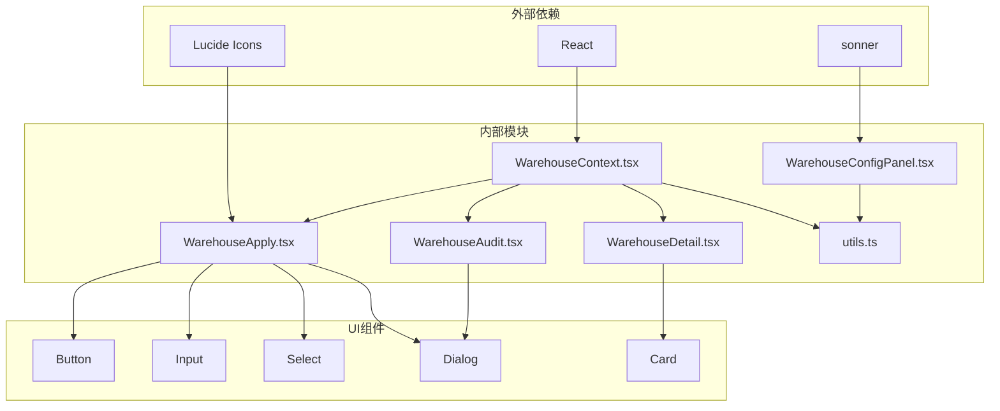

# WarehouseContext仓库上下文

<cite>
**本文档引用的文件**
- [WarehouseContext.tsx](file://src/app/store/WarehouseContext.tsx)
- [WarehouseApply.tsx](file://src/app/pages/WarehouseApply.tsx)
- [WarehouseDetail.tsx](file://src/app/pages/WarehouseDetail.tsx)
- [WarehouseAudit.tsx](file://src/app/pages/WarehouseAudit.tsx)
- [WarehouseAuditList.tsx](file://src/app/pages/WarehouseAuditList.tsx)
- [WarehouseConfigPanel.tsx](file://src/app/components/WarehouseConfigPanel.tsx)
- [routes.tsx](file://src/app/routes.tsx)
- [layout.tsx](file://src/app/layout.tsx)
</cite>

## 目录
1. [简介](#简介)
2. [项目结构](#项目结构)
3. [核心组件](#核心组件)
4. [架构概览](#架构概览)
5. [详细组件分析](#详细组件分析)
6. [依赖关系分析](#依赖关系分析)
7. [性能考虑](#性能考虑)
8. [故障排除指南](#故障排除指南)
9. [结论](#结论)

## 简介

WarehouseContext是一个专门设计用于管理期货交易所移仓业务的React Context组件。它提供了完整的移仓申请、审核和管理功能，包括多交易所支持、多种移仓方向、实控组移仓等功能特性。该上下文通过集中化的状态管理，简化了复杂的移仓业务逻辑，并提供了完善的表单验证和数据同步机制。

## 项目结构

WarehouseContext位于应用的状态管理层，采用React Context模式实现全局状态共享。整个项目围绕移仓业务构建了完整的前端生态：



**图表来源**
- [routes.tsx:18-38](file://src/app/routes.tsx#L18-L38)
- [layout.tsx:80-172](file://src/app/layout.tsx#L80-L172)
- [WarehouseContext.tsx:75-178](file://src/app/store/WarehouseContext.tsx#L75-L178)

**章节来源**
- [routes.tsx:1-38](file://src/app/routes.tsx#L1-L38)
- [layout.tsx:74-174](file://src/app/layout.tsx#L74-L174)

## 核心组件

WarehouseContext作为状态管理的核心，定义了完整的移仓业务状态结构和操作方法：

### 主要状态字段

WarehouseContext包含以下主要状态分类：

1. **基础客户信息**
   - `account`: 资金账号
   - `customerName`: 客户名称
   - `branch`: 所属分支
   - `customerType`: 客户类型

2. **移仓配置信息**
   - `selectedExchanges`: 选择的交易所数组
   - `direction`: 移仓方向（IN/OUT/ACTUAL_CONTROL）
   - `contractType`: 合约类型（FUTURES/OPTIONS）
   - `transferDate`: 移仓日期

3. **交易所相关字段**
   - `outBrokerMemberId/outBrokerName`: 移出期货公司信息
   - `inBrokerMemberId/inBrokerName`: 移入期货公司信息
   - `outClientTradingCodes/outClientNames`: 移出客户交易编码和名称
   - `inClientTradingCodes/inClientName`: 移入客户交易编码和名称

4. **实控组移仓专用字段**
   - `actualControlOutAccount/outName`: 实控组移出账号和名称
   - `actualControlInAccount/inName`: 实控组移入账号和名称

5. **业务特定字段**
   - `dceTransferByQuantity`: 大商所是否按量移仓
   - `transferReason`: 移仓申请理由
   - `positions`: 合约明细数组
   - `attachments`: 附件列表
   - `confirmed`: 确认状态
   - `remark`: 备注信息

**章节来源**
- [WarehouseContext.tsx:19-73](file://src/app/store/WarehouseContext.tsx#L19-L73)

## 架构概览

WarehouseContext采用了分层架构设计，确保了良好的代码组织和可维护性：

```mermaid
classDiagram
class WarehouseContext {
+string account
+string customerName
+string branch
+string customerType
+WarehouseExchange[] selectedExchanges
+WarehouseDirection direction
+ContractType contractType
+string transferDate
+string outBrokerMemberId
+string outBrokerName
+string inBrokerMemberId
+string inBrokerName
+Record~WarehouseExchange,string~ outClientTradingCodes
+Record~WarehouseExchange,string~ outClientNames
+Record~WarehouseExchange,string~ inClientTradingCodes
+string inClientName
+string actualControlOutAccount
+string actualControlOutName
+string actualControlInAccount
+string actualControlInName
+Record~string,bool~ accountPermissions
+string dceTransferByQuantity
+string transferReason
+PositionRow[] positions
+{name : string,size : string}[] attachments
+boolean confirmed
+string remark
+reset() void
+toggleAccountPermission(account) void
+hasPermissionForAccount(account) boolean
}
class PositionRow {
+string id
+string exchange
+string varietyName
+string contractCode
+string positionDirection
+string hedgeType
+number lots
+number transferFunds
+string remark
}
class WarehouseState {
<<interface>>
+useWarehouseContext() WarehouseContext
+WarehouseProvider(children) ReactNode
}
WarehouseContext ..|> WarehouseState
WarehouseContext --> PositionRow : "管理"
```

**图表来源**
- [WarehouseContext.tsx:3-17](file://src/app/store/WarehouseContext.tsx#L3-L17)

### 状态管理模式

WarehouseContext实现了以下状态管理模式：

1. **集中式状态管理**: 所有移仓相关状态集中在单一Context中
2. **函数式更新**: 通过setter函数进行状态更新，避免直接修改
3. **类型安全**: 使用TypeScript接口确保类型安全
4. **默认值管理**: 提供合理的默认值和初始化逻辑

**章节来源**
- [WarehouseContext.tsx:75-178](file://src/app/store/WarehouseContext.tsx#L75-L178)

## 详细组件分析

### WarehouseContext核心实现

WarehouseContext的核心实现包含了完整的状态管理和业务逻辑：

#### 状态初始化



**图表来源**
- [WarehouseContext.tsx:77-143](file://src/app/store/WarehouseContext.tsx#L77-L143)

#### 数据验证策略

WarehouseContext实现了多层次的数据验证机制：

1. **必填字段验证**: 对关键字段进行非空检查
2. **业务规则验证**: 基于移仓方向和交易所的业务规则
3. **格式验证**: 对数字、日期等格式进行验证
4. **权限验证**: 基于账户权限的访问控制

**章节来源**
- [WarehouseApply.tsx:319-378](file://src/app/pages/WarehouseApply.tsx#L319-L378)

### 页面集成分析

WarehouseContext在各个页面中的集成方式如下：

#### 申请页面集成

WarehouseApply页面通过useWarehouseContext钩子获取和管理状态：



**图表来源**
- [WarehouseApply.tsx:185-390](file://src/app/pages/WarehouseApply.tsx#L185-L390)

#### 审核页面集成

WarehouseAudit页面展示了如何从WarehouseContext获取只读状态：



**图表来源**
- [WarehouseAudit.tsx:129-153](file://src/app/pages/WarehouseAudit.tsx#L129-L153)

**章节来源**
- [WarehouseApply.tsx:185-400](file://src/app/pages/WarehouseApply.tsx#L185-L400)
- [WarehouseAudit.tsx:129-153](file://src/app/pages/WarehouseAudit.tsx#L129-L153)

### 组件扩展分析

WarehouseConfigPanel展示了如何扩展WarehouseContext的功能：

#### 场景预设功能

WarehouseConfigPanel提供了多种移仓场景的快速填充功能：

| 场景类型 | 交易所 | 移仓方向 | 特殊字段 |
|---------|--------|----------|----------|
| DCE·移入我司 | 大商所 | IN | 设置DCE按量移仓 |
| DCE·移出我司 | 大商所 | OUT | 设置申请理由 |
| DCE·实控组移仓 | 大商所 | ACTUAL_CONTROL | 实控组账号对 |
| CZCE·移入我司 | 郑商所 | IN | 郑商所特殊规则 |
| SHFE·移出我司 | 上期所 | OUT | 上期所特殊规则 |
| SHFE·实控组移仓 | 上期所 | ACTUAL_CONTROL | 实控组账号对 |

**章节来源**
- [WarehouseConfigPanel.tsx:14-112](file://src/app/components/WarehouseConfigPanel.tsx#L14-L112)

## 依赖关系分析

WarehouseContext在整个应用中的依赖关系如下：



**图表来源**
- [WarehouseContext.tsx:1-1](file://src/app/store/WarehouseContext.tsx#L1-L1)
- [WarehouseApply.tsx:1-30](file://src/app/pages/WarehouseApply.tsx#L1-L30)

### 关键依赖点

1. **React生态系统**: 依赖React Hooks进行状态管理
2. **UI组件库**: 依赖自定义UI组件库构建用户界面
3. **图标系统**: 使用Lucide图标库提供丰富的视觉元素
4. **通知系统**: 使用sonner提供用户体验反馈

**章节来源**
- [WarehouseContext.tsx:1-1](file://src/app/store/WarehouseContext.tsx#L1-L1)
- [WarehouseApply.tsx:1-30](file://src/app/pages/WarehouseApply.tsx#L1-L30)

## 性能考虑

WarehouseContext在设计时充分考虑了性能优化：

### 状态更新优化

1. **批量状态更新**: 使用useState的批量更新减少重渲染
2. **选择性渲染**: 通过useMemo和useCallback优化复杂计算
3. **状态分离**: 将频繁变化的状态与静态状态分离

### 内存管理

1. **默认值清理**: 在reset方法中清理不必要的状态
2. **附件管理**: 提供附件的增删操作，避免内存泄漏
3. **权限管理**: 使用对象引用而非数组进行权限检查

### 渲染优化

1. **条件渲染**: 基于移仓方向和交易所的条件渲染
2. **懒加载**: 附件和详情信息的懒加载
3. **虚拟滚动**: 大列表的虚拟滚动支持

## 故障排除指南

### 常见问题及解决方案

#### 状态同步问题

**问题**: 状态更新后UI没有及时反映
**解决方案**: 
1. 确保使用正确的setter函数更新状态
2. 检查状态更新是否在正确的组件生命周期中
3. 验证Context Provider是否正确包裹子组件

#### 验证错误处理

**问题**: 表单验证错误信息不准确
**解决方案**:
1. 检查validation函数中的业务规则
2. 确保错误消息与实际验证逻辑匹配
3. 验证字段的依赖关系

#### 权限控制问题

**问题**: 实控组账号权限无法正确切换
**解决方案**:
1. 检查accountPermissions对象的结构
2. 验证toggleAccountPermission函数的实现
3. 确保权限状态的持久化

**章节来源**
- [WarehouseContext.tsx:101-104](file://src/app/store/WarehouseContext.tsx#L101-L104)
- [WarehouseApply.tsx:197-219](file://src/app/pages/WarehouseApply.tsx#L197-L219)

## 结论

WarehouseContext作为一个专业的移仓业务状态管理解决方案，具有以下特点：

1. **完整性**: 覆盖了移仓业务的所有关键环节
2. **灵活性**: 支持多种移仓方向和交易所组合
3. **可扩展性**: 提供了丰富的扩展点和场景预设
4. **易用性**: 通过清晰的API和直观的界面设计降低使用门槛

该实现为期货公司的移仓业务提供了完整的技术支撑，通过集中化的状态管理和完善的验证机制，确保了业务流程的准确性和可靠性。同时，模块化的架构设计也为未来的功能扩展奠定了良好的基础。