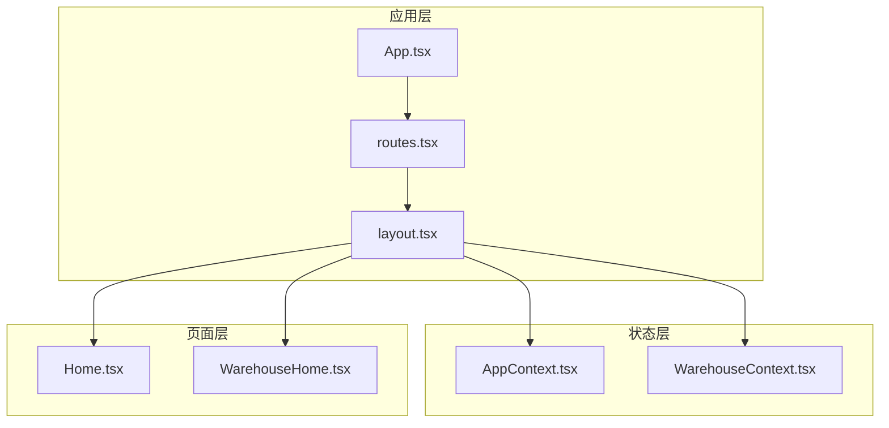
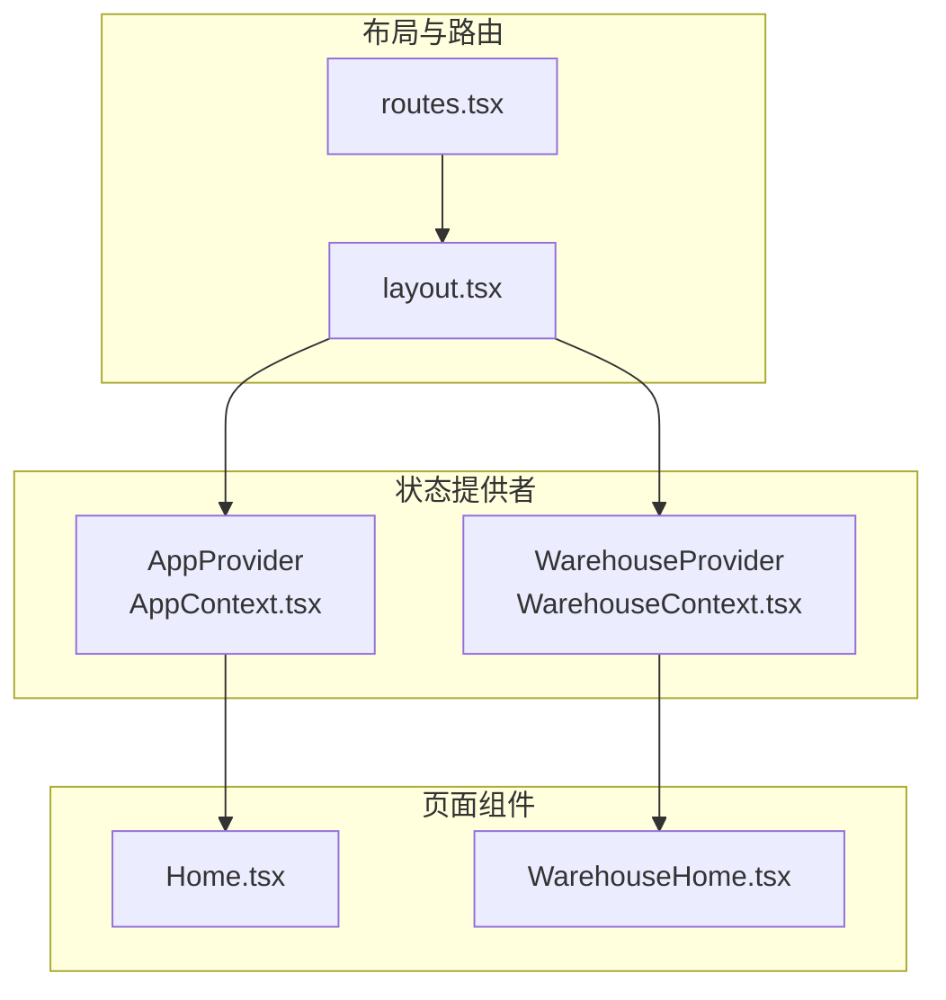
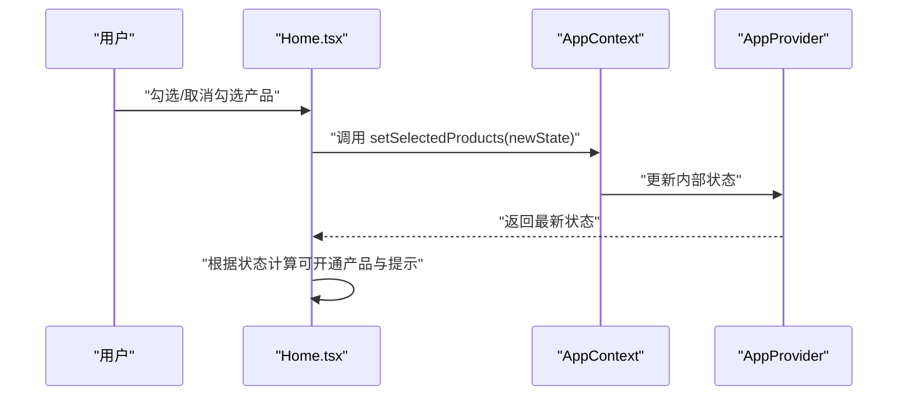
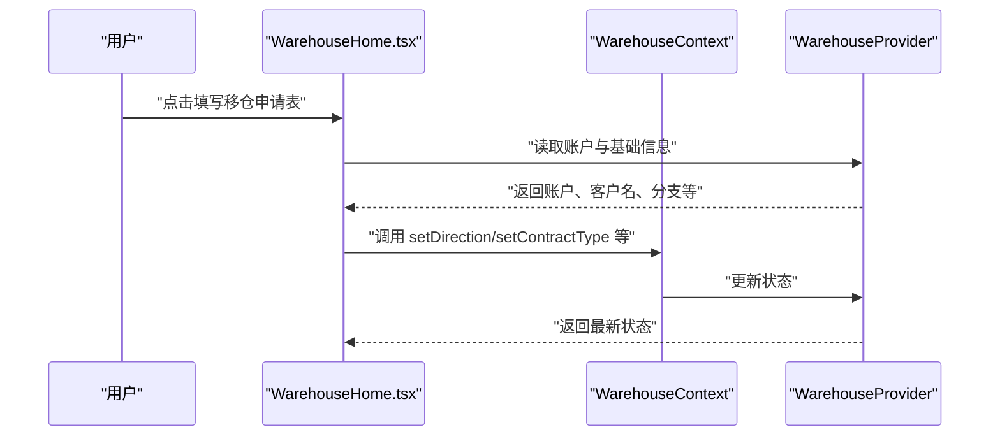
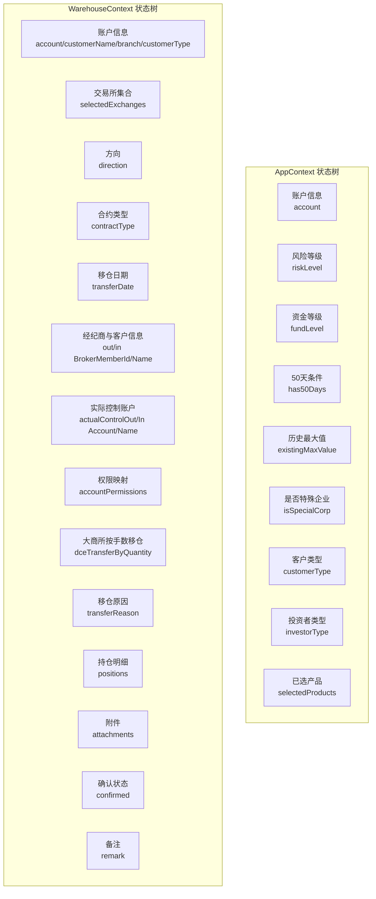
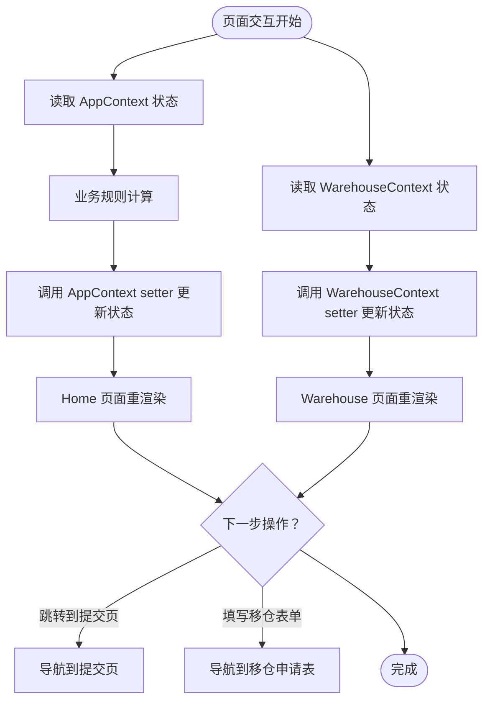
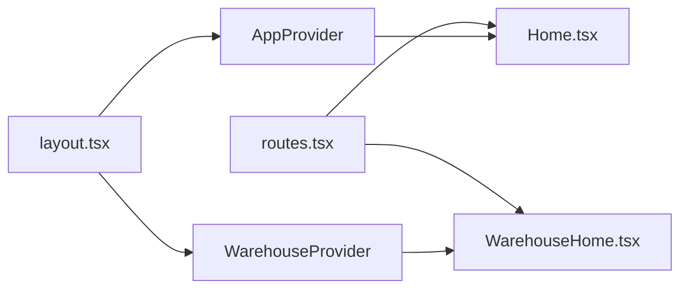

# 状态管理系统

<cite>
**本文档引用的文件**
- [AppContext.tsx](file://src/app/store/AppContext.tsx)
- [WarehouseContext.tsx](file://src/app/store/WarehouseContext.tsx)
- [mockData.ts](file://src/app/utils/mockData.ts)
- [layout.tsx](file://src/app/layout.tsx)
- [routes.tsx](file://src/app/routes.tsx)
- [Home.tsx](file://src/app/pages/Home.tsx)
- [WarehouseHome.tsx](file://src/app/pages/WarehouseHome.tsx)
- [App.tsx](file://src/app/App.tsx)
- [warehouse-transfer-design.md](file://docs/warehouse-transfer-design.md)
</cite>

## 目录
1. [简介](#简介)
2. [项目结构](#项目结构)
3. [核心组件](#核心组件)
4. [架构总览](#架构总览)
5. [详细组件分析](#详细组件分析)
6. [依赖分析](#依赖分析)
7. [性能考虑](#性能考虑)
8. [故障排查指南](#故障排查指南)
9. [结论](#结论)
10. [附录](#附录)

## 简介
本文件面向状态管理系统的技术文档，聚焦于 AppContext 与 WarehouseContext 的设计原理、状态结构定义、数据流管理与组件通信机制。文档同时覆盖状态同步机制、Mock 数据管理策略，并提供状态树结构图与数据流向图，最后给出状态更新最佳实践、性能优化技巧与调试方法。

## 项目结构
本项目采用分模块的组织方式，状态管理位于独立的 store 目录，页面组件按功能划分在 pages 目录，布局与路由在 app 目录下统一管理。AppProvider 与 WarehouseProvider 分别包裹应用与移仓相关页面，实现细粒度的状态隔离与共享。

**图表来源**
- [App.tsx:1-6](file://src/app/App.tsx#L1-L6)
- [routes.tsx:1-38](file://src/app/routes.tsx#L1-L38)
- [layout.tsx:74-174](file://src/app/layout.tsx#L74-L174)
- [AppContext.tsx:1-64](file://src/app/store/AppContext.tsx#L1-L64)
- [WarehouseContext.tsx:1-185](file://src/app/store/WarehouseContext.tsx#L1-L185)
- [Home.tsx:1-809](file://src/app/pages/Home.tsx#L1-L809)
- [WarehouseHome.tsx:1-160](file://src/app/pages/WarehouseHome.tsx#L1-L160)

**章节来源**
- [App.tsx:1-6](file://src/app/App.tsx#L1-L6)
- [routes.tsx:1-38](file://src/app/routes.tsx#L1-L38)
- [layout.tsx:74-174](file://src/app/layout.tsx#L74-L174)

## 核心组件
- AppContext：管理交易权限申请相关的全局状态，包括账户信息、风险等级、资金等级、是否满足50天条件、历史最大值、是否为特殊企业、已选产品、客户类型与投资者类型等。
- WarehouseContext：管理移仓业务的全局状态，包括交易所选择、出入金方向、合约类型、移仓日期、经纪商与客户信息、实际控制账户、权限映射、大商所按手数移仓标志、移仓原因、持仓明细、附件、确认状态与备注等。
- Mock 数据：提供业务场景中的禁用原因列表与过滤函数，作为单一事实来源用于界面筛选与提示。

**章节来源**
- [AppContext.tsx:6-27](file://src/app/store/AppContext.tsx#L6-L27)
- [WarehouseContext.tsx:19-73](file://src/app/store/WarehouseContext.tsx#L19-L73)
- [mockData.ts:1-13](file://src/app/utils/mockData.ts#L1-L13)

## 架构总览
应用通过 React Context 实现状态共享，AppProvider 负责交易权限申请域的状态，WarehouseProvider 负责移仓域的状态。布局组件在顶层组合两个 Provider，确保路由切换时状态隔离与复用。

**图表来源**
- [layout.tsx:80-82](file://src/app/layout.tsx#L80-L82)
- [routes.tsx:18-37](file://src/app/routes.tsx#L18-L37)
- [AppContext.tsx:31-57](file://src/app/store/AppContext.tsx#L31-L57)
- [WarehouseContext.tsx:77-177](file://src/app/store/WarehouseContext.tsx#L77-L177)
- [Home.tsx:61-64](file://src/app/pages/Home.tsx#L61-L64)
- [WarehouseHome.tsx:35-39](file://src/app/pages/WarehouseHome.tsx#L35-L39)

## 详细组件分析

### AppContext 设计与数据流
- 状态结构：包含账户、风险等级、资金等级、50天条件、历史最大值、是否特殊企业、客户类型、投资者类型与已选产品等字段，均通过 useState 初始化并在 Provider 中暴露 setter。
- 组件通信：Home 页面通过 useAppContext 获取状态与 setter，实现用户交互驱动的状态更新。
- 数据流：用户在页面上的勾选、输入与选择会调用对应的 setter，触发组件重渲染与后续流程判断（如是否满足开通条件）。

**图表来源**
- [Home.tsx:118-155](file://src/app/pages/Home.tsx#L118-L155)
- [AppContext.tsx:31-57](file://src/app/store/AppContext.tsx#L31-L57)

**章节来源**
- [AppContext.tsx:6-27](file://src/app/store/AppContext.tsx#L6-L27)
- [Home.tsx:61-231](file://src/app/pages/Home.tsx#L61-L231)

### WarehouseContext 设计与数据流
- 状态结构：涵盖交易所集合、出入金方向、合约类型、移仓日期、出/入金经纪商与客户信息、实际控制账户、账户权限映射、大商所按手数移仓标志、移仓原因、持仓明细、附件、确认状态与备注等。
- 方法与工具：提供 toggleAccountPermission、hasPermissionForAccount、reset 等辅助方法，便于权限开关与表单重置。
- 组件通信：WarehouseHome 等页面通过 useWarehouseContext 访问状态，结合路由与布局实现跨页面状态共享。

**图表来源**
- [WarehouseHome.tsx:35-59](file://src/app/pages/WarehouseHome.tsx#L35-L59)
- [WarehouseContext.tsx:77-177](file://src/app/store/WarehouseContext.tsx#L77-L177)

**章节来源**
- [WarehouseContext.tsx:19-73](file://src/app/store/WarehouseContext.tsx#L19-L73)
- [WarehouseHome.tsx:35-160](file://src/app/pages/WarehouseHome.tsx#L35-L160)

### 状态树结构图

**图表来源**
- [AppContext.tsx:6-27](file://src/app/store/AppContext.tsx#L6-L27)
- [WarehouseContext.tsx:19-73](file://src/app/store/WarehouseContext.tsx#L19-L73)

### 数据流向图

**图表来源**
- [Home.tsx:199-231](file://src/app/pages/Home.tsx#L199-L231)
- [WarehouseHome.tsx:52-58](file://src/app/pages/WarehouseHome.tsx#L52-L58)
- [AppContext.tsx:31-57](file://src/app/store/AppContext.tsx#L31-L57)
- [WarehouseContext.tsx:77-177](file://src/app/store/WarehouseContext.tsx#L77-L177)

## 依赖分析
- Provider 层叠：layout.tsx 同时引入 AppProvider 与 WarehouseProvider，保证两套状态域独立且可同时使用。
- 路由绑定：routes.tsx 定义了交易权限与移仓相关的页面路径，确保对应页面在正确路由下渲染。
- 组件依赖：Home 与 WarehouseHome 分别依赖各自上下文，形成清晰的职责边界。

**图表来源**
- [layout.tsx:80-82](file://src/app/layout.tsx#L80-L82)
- [routes.tsx:18-37](file://src/app/routes.tsx#L18-L37)
- [Home.tsx:61-64](file://src/app/pages/Home.tsx#L61-L64)
- [WarehouseHome.tsx:35-39](file://src/app/pages/WarehouseHome.tsx#L35-L39)

**章节来源**
- [layout.tsx:74-174](file://src/app/layout.tsx#L74-L174)
- [routes.tsx:1-38](file://src/app/routes.tsx#L1-L38)

## 性能考虑
- 状态拆分：将交易权限与移仓状态分别置于独立 Provider，避免无关状态变更导致的重渲染。
- 细粒度更新：仅在必要字段上调用 setter，减少不必要的组件刷新。
- 结构化数据：使用对象与数组形式的状态，配合不可变更新策略，提升可预测性与调试效率。
- 本地存储建议：对于高频访问但非实时的关键状态，可在本地存储中缓存，启动时合并到上下文中，降低初始化成本（见“最佳实践”）。

## 故障排查指南
- 上下文使用错误：当在未包裹 Provider 的组件中调用 useAppContext 或 useWarehouseContext 时会抛出错误。请检查布局文件是否正确嵌套 Provider。
- 状态未更新：确认组件是否从正确的上下文 hook 获取状态，且 setter 是否在事件回调中被调用。
- Mock 数据问题：getEnabledReasons 依赖 MOCK_REASONS 的 isEnabled 字段，若过滤结果为空，请检查数据源与字段值。
- 移仓权限开关：toggleAccountPermission 通过浅拷贝更新权限映射，注意不要直接修改原对象引用。

**章节来源**
- [AppContext.tsx:59-63](file://src/app/store/AppContext.tsx#L59-L63)
- [WarehouseContext.tsx:180-184](file://src/app/store/WarehouseContext.tsx#L180-L184)
- [mockData.ts:10-12](file://src/app/utils/mockData.ts#L10-L12)

## 结论
本状态管理系统通过 AppContext 与 WarehouseContext 实现交易权限与移仓业务的清晰分离，结合 React Context 的 Provider/Consumer 模式，提供了简洁、可维护的状态共享方案。配合 Mock 数据与路由布局，系统在开发与测试阶段具备良好的可扩展性与可调试性。建议在生产环境中进一步完善状态持久化与错误边界处理，以提升用户体验与稳定性。

## 附录

### 状态同步机制
- 单向数据流：用户交互 → setter → 状态更新 → 组件重渲染。
- 跨页面同步：通过路由切换与 Provider 层叠，确保状态在不同页面间保持一致。
- 重置机制：WarehouseContext 提供 reset 方法，便于表单回退与重新编辑。

**章节来源**
- [WarehouseContext.tsx:112-142](file://src/app/store/WarehouseContext.tsx#L112-L142)

### 数据持久化策略
- 本地存储：对关键状态（如已选产品、移仓表单草稿）进行本地持久化，应用启动时合并到上下文中。
- 缓存策略：对只读配置（如 Mock 数据）进行内存缓存，避免重复加载。
- 清理策略：在退出页面或提交完成后清理临时状态，释放内存。

**章节来源**
- [mockData.ts:1-13](file://src/app/utils/mockData.ts#L1-L13)
- [warehouse-transfer-design.md:103-105](file://docs/warehouse-transfer-design.md#L103-L105)

### Mock 数据管理
- 单一事实源：MOCK_REASONS 作为禁用原因的唯一数据源，getEnabledReasons 提供按业务类型过滤的便捷方法。
- 开发友好：在开发模式下可直接替换或扩展 MOCK_REASONS，无需改动业务逻辑。

**章节来源**
- [mockData.ts:1-13](file://src/app/utils/mockData.ts#L1-L13)

### 状态更新最佳实践
- 使用不可变更新：避免直接修改状态对象，优先使用新对象或浅拷贝。
- 批量更新：将多个 setter 调用合并到一次事件回调中，减少重渲染次数。
- 条件更新：仅在状态确实变化时才调用 setter，避免无效渲染。

### 调试方法
- 日志追踪：在关键 setter 调用处添加日志，记录状态变化前后值。
- 断点调试：在组件重渲染处设置断点，观察 props 与 context 变化。
- 状态快照：定期导出上下文状态快照，用于回归测试与问题复现。