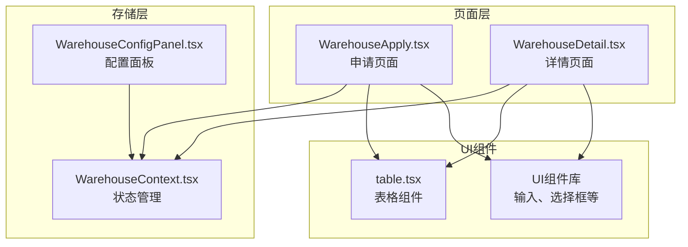
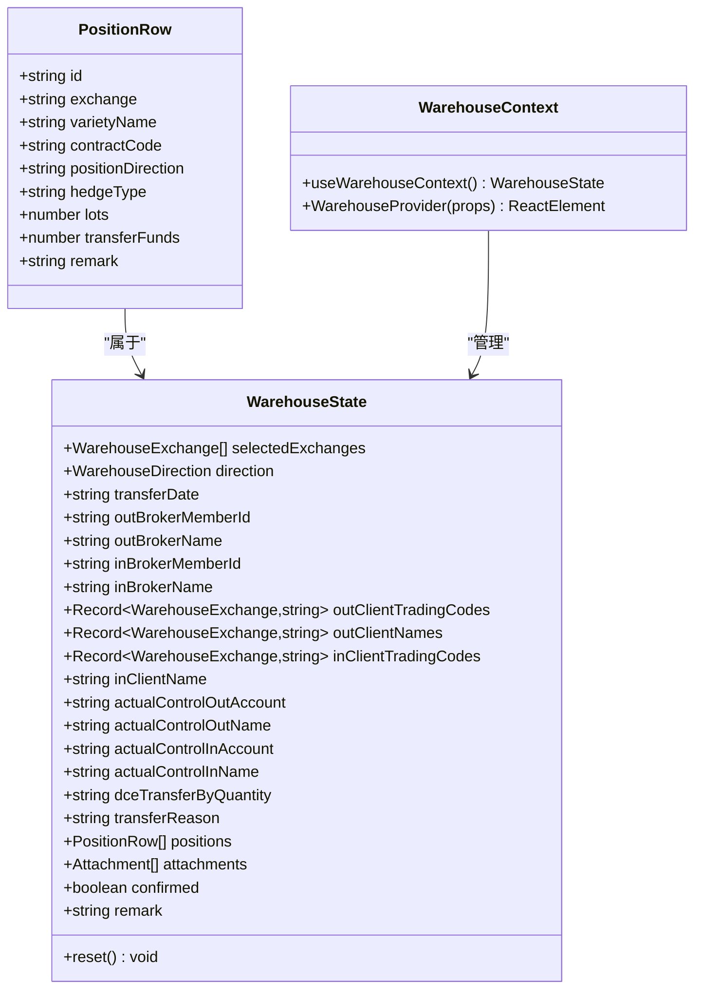
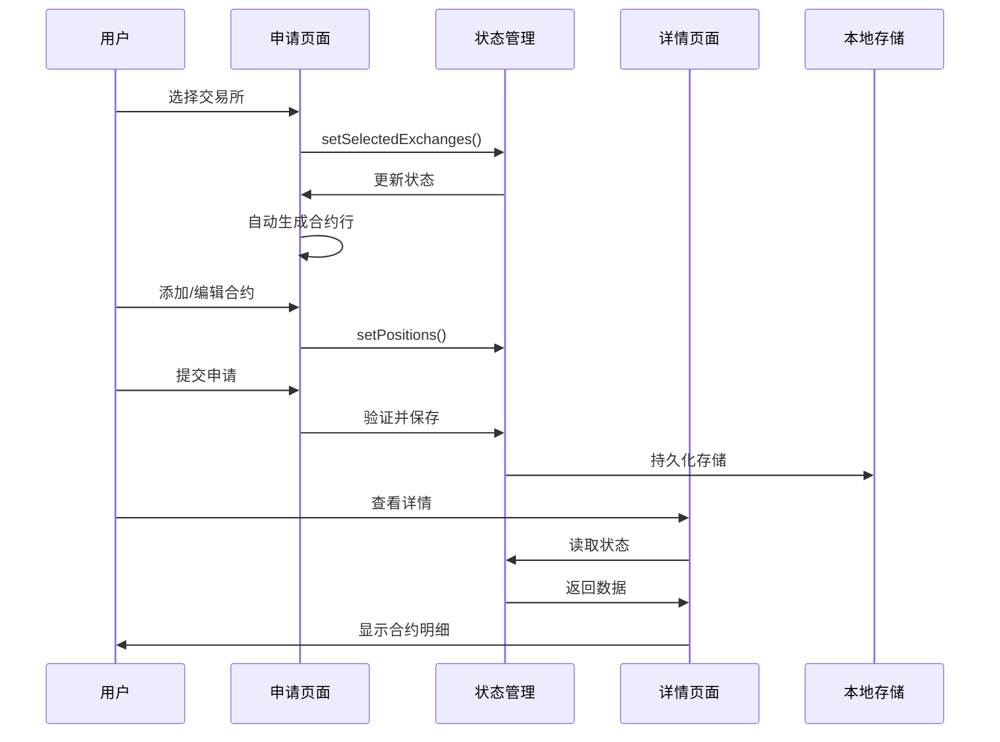
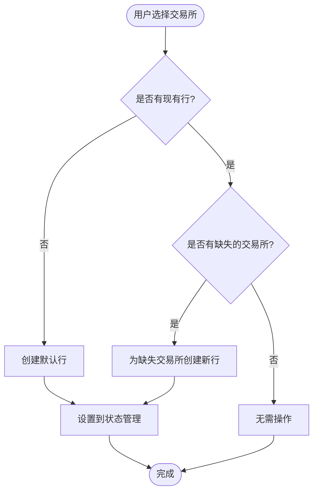
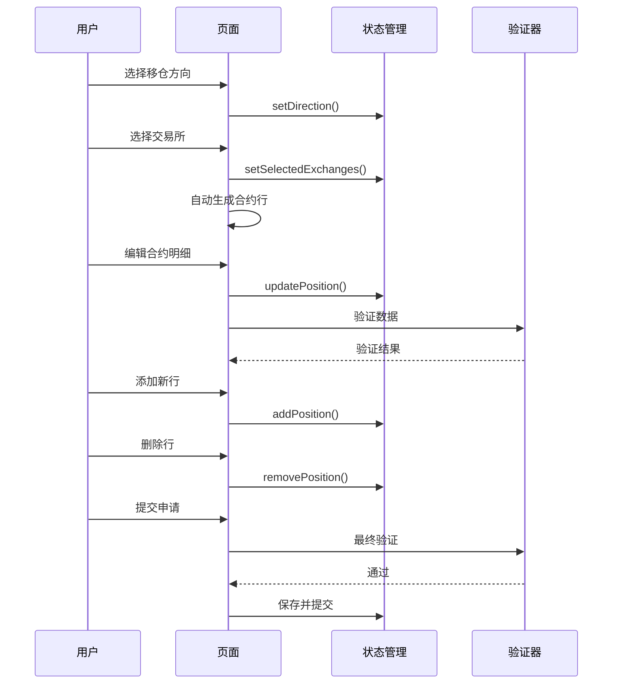
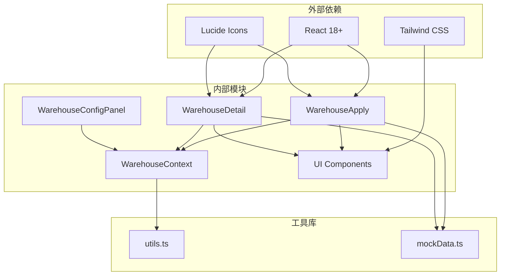

# 合约明细管理

<cite>
**本文档引用的文件**
- [WarehouseApply.tsx](file://src/app/pages/WarehouseApply.tsx)
- [WarehouseDetail.tsx](file://src/app/pages/WarehouseDetail.tsx)
- [WarehouseContext.tsx](file://src/app/store/WarehouseContext.tsx)
- [WarehouseConfigPanel.tsx](file://src/app/components/WarehouseConfigPanel.tsx)
- [table.tsx](file://src/app/components/ui/table.tsx)
</cite>

## 目录
1. [简介](#简介)
2. [项目结构](#项目结构)
3. [核心组件](#核心组件)
4. [架构概览](#架构概览)
5. [详细组件分析](#详细组件分析)
6. [依赖关系分析](#依赖关系分析)
7. [性能考虑](#性能考虑)
8. [故障排除指南](#故障排除指南)
9. [结论](#结论)

## 简介

合约明细管理功能是交易所移仓业务申请系统的核心模块，负责管理多行合约表格的完整生命周期。该功能实现了动态行添加删除机制、交易所特定字段处理，并针对不同交易所（大商所、郑商所、上期所）的手数计算差异、持仓方向和类型选择逻辑进行了专门优化。

该系统支持三种移仓方向：移入我司、移出我司和实控组移仓，每个方向都有不同的业务规则和数据验证要求。通过智能的动态行管理机制，用户可以轻松添加、编辑和删除合约明细行，同时系统会根据交易所特性自动调整界面行为和验证规则。

## 项目结构

合约明细管理功能主要分布在以下文件中：



**图表来源**
- [WarehouseApply.tsx:1-909](file://src/app/pages/WarehouseApply.tsx#L1-L909)
- [WarehouseDetail.tsx:1-441](file://src/app/pages/WarehouseDetail.tsx#L1-L441)
- [WarehouseContext.tsx:1-185](file://src/app/store/WarehouseContext.tsx#L1-L185)

**章节来源**
- [WarehouseApply.tsx:1-909](file://src/app/pages/WarehouseApply.tsx#L1-L909)
- [WarehouseDetail.tsx:1-441](file://src/app/pages/WarehouseDetail.tsx#L1-L441)
- [WarehouseContext.tsx:1-185](file://src/app/store/WarehouseContext.tsx#L1-L185)

## 核心组件

### 数据模型设计

合约明细功能基于以下核心数据结构：



**图表来源**
- [WarehouseContext.tsx:7-17](file://src/app/store/WarehouseContext.tsx#L7-L17)
- [WarehouseContext.tsx:19-73](file://src/app/store/WarehouseContext.tsx#L19-L73)

### 交易所特定字段处理

系统针对三大交易所实现了差异化处理：

| 交易所 | 特殊规则 | 手数显示 | 持仓类型 | 实控组支持 |
|--------|----------|----------|----------|------------|
| 大商所(DCE) | 按量移仓选项 | 移仓手数/预估移仓手数 | 投机/套保 | 是(仅DCE) |
| 郑商所(CZCE) | 全部持仓转移 | 预估移仓手数 | 不适用 | 否 |
| 上期所(SHFE) | 无特殊规则 | 预估移仓手数 | 投机/套保 | 是(仅SHFE) |

**章节来源**
- [WarehouseApply.tsx:225-230](file://src/app/pages/WarehouseApply.tsx#L225-L230)
- [WarehouseDetail.tsx:205-216](file://src/app/pages/WarehouseDetail.tsx#L205-L216)

## 架构概览

合约明细管理采用React Hooks + Context的状态管理模式，实现了组件间的高效通信和状态共享：



**图表来源**
- [WarehouseApply.tsx:232-278](file://src/app/pages/WarehouseApply.tsx#L232-L278)
- [WarehouseContext.tsx:107-142](file://src/app/store/WarehouseContext.tsx#L107-L142)

## 详细组件分析

### 动态行管理机制

合约明细的动态行管理是该功能的核心特性，实现了智能的行创建、更新和删除：

#### 行创建逻辑



**图表来源**
- [WarehouseApply.tsx:232-278](file://src/app/pages/WarehouseApply.tsx#L232-L278)

#### 行更新逻辑

系统提供了多种方式来更新合约行：

1. **批量更新**：通过`updatePosition(id, field, value)`函数实现
2. **交易所特定更新**：自动处理郑商所的特殊约束
3. **实时验证**：每次更新时进行数据验证

#### 行删除逻辑

删除操作通过`removePosition(id)`实现，确保不会误删空行：

**章节来源**
- [WarehouseApply.tsx:280-306](file://src/app/pages/WarehouseApply.tsx#L280-L306)

### 交易所特定字段处理

#### 大商所(DCE)处理

大商所实现了独特的按量移仓功能：

```mermaid
flowchart TD
DCE[大商所选择] --> CheckDirection{移出我司?}
CheckDirection --> |是| NoSpecial[无特殊处理]
CheckDirection --> |否| CheckQuantity{按量移仓?}
CheckQuantity --> |是| ShowLots[显示"移仓手数"]
CheckQuantity --> |否| ShowEstimate[显示"预估移仓手数"]
NoSpecial --> ShowEstimate
```

**图表来源**
- [WarehouseApply.tsx:225-230](file://src/app/pages/WarehouseApply.tsx#L225-L230)
- [WarehouseDetail.tsx:205-209](file://src/app/pages/WarehouseDetail.tsx#L205-L209)

#### 郑商所(CZCE)处理

郑商所实施了严格的限制：

1. **全部持仓转移**：不支持部分转移
2. **禁用持仓类型**：自动禁用投机/套保选择
3. **特殊提示**：在界面中显示相关说明

#### 上期所(SHFE)处理

上期所遵循标准规则，但支持实控组移仓：

1. **预估手数**：使用预估移仓手数标签
2. **实控组支持**：支持实际控制关系账户间移仓
3. **标准验证**：遵循常规验证规则

**章节来源**
- [WarehouseApply.tsx:68-75](file://src/app/pages/WarehouseApply.tsx#L68-L75)
- [WarehouseDetail.tsx:378-383](file://src/app/pages/WarehouseDetail.tsx#L378-L383)

### 持仓方向和类型选择逻辑

系统为不同交易所提供了智能化的方向和类型选择：

#### 持仓方向选择

| 方向 | 适用交易所 | 选择逻辑 |
|------|------------|----------|
| 买(BUY) | 所有交易所 | 默认值，适用于多头持仓 |
| 卖(SELL) | 所有交易所 | 适用于空头持仓 |
| 全部(ALL) | 郑商所 | 仅用于全部持仓转移 |

#### 持仓类型选择

| 类型 | 适用交易所 | 选择逻辑 |
|------|------------|----------|
| 投机(SPEC) | 大商所、上期所 | 默认值 |
| 套保(HEDGE) | 大商所、上期所 | 用于套保业务 |
| 不适用 | 郑商所 | 自动禁用 |

**章节来源**
- [WarehouseApply.tsx:57-61](file://src/app/pages/WarehouseApply.tsx#L57-L61)
- [WarehouseApply.tsx:43-46](file://src/app/pages/WarehouseApply.tsx#L43-L46)

### 完整的操作流程

合约明细管理的完整操作流程如下：



**图表来源**
- [WarehouseApply.tsx:280-306](file://src/app/pages/WarehouseApply.tsx#L280-L306)
- [WarehouseApply.tsx:319-378](file://src/app/pages/WarehouseApply.tsx#L319-L378)

**章节来源**
- [WarehouseApply.tsx:185-909](file://src/app/pages/WarehouseApply.tsx#L185-L909)

## 依赖关系分析

合约明细管理功能的依赖关系图：



**图表来源**
- [WarehouseApply.tsx:1-30](file://src/app/pages/WarehouseApply.tsx#L1-L30)
- [WarehouseContext.tsx:1-10](file://src/app/store/WarehouseContext.tsx#L1-L10)

### 组件耦合度分析

该功能实现了良好的模块化设计：

- **低耦合**：各组件通过Context进行通信，减少直接依赖
- **高内聚**：状态管理集中在WarehouseContext中
- **可扩展性**：新的交易所支持可通过配置添加

**章节来源**
- [WarehouseContext.tsx:144-177](file://src/app/store/WarehouseContext.tsx#L144-L177)

## 性能考虑

### 渲染优化

1. **虚拟滚动**：对于大量合约行的情况，可考虑实现虚拟滚动
2. **状态分片**：将大型表单拆分为多个独立的状态片段
3. **防抖处理**：对频繁的输入操作进行防抖优化

### 内存管理

1. **行ID生成**：使用随机字符串作为行ID，避免内存泄漏
2. **状态清理**：提供reset方法清理所有状态
3. **附件管理**：及时清理上传的文件引用

### 数据验证优化

1. **增量验证**：只验证受影响的行
2. **缓存策略**：缓存验证结果，避免重复计算
3. **异步验证**：对网络请求进行异步处理

## 故障排除指南

### 常见问题及解决方案

#### 问题1：合约行无法添加
**症状**：点击"添加一行"按钮无效
**原因**：状态管理器未正确初始化
**解决**：检查WarehouseProvider是否正确包裹应用

#### 问题2：交易所选择后没有自动生成行
**症状**：选择交易所后合约表格为空
**原因**：useEffect依赖项配置错误
**解决**：确认selectedExchanges作为依赖项正确传递

#### 问题3：郑商所行无法编辑持仓类型
**症状**：郑商所行的持仓类型下拉框不可用
**原因**：系统自动禁用了该功能
**解决**：这是预期行为，郑商所不支持该功能

#### 问题4：手数显示不符合预期
**症状**：手数列标题显示不正确
**原因**：getLotsLabel函数逻辑错误
**解决**：检查交易所特定的手数显示规则

**章节来源**
- [WarehouseApply.tsx:232-278](file://src/app/pages/WarehouseApply.tsx#L232-L278)
- [WarehouseDetail.tsx:205-216](file://src/app/pages/WarehouseDetail.tsx#L205-L216)

## 结论

合约明细管理功能通过精心设计的数据模型、智能的动态行管理和完善的交易所特定处理机制，为用户提供了一个强大而易用的合约管理工具。该系统的主要优势包括：

1. **智能化的用户体验**：自动化的行管理减少了用户的操作负担
2. **严格的业务规则**：针对不同交易所的特殊要求进行了专门处理
3. **良好的扩展性**：模块化设计便于未来功能扩展
4. **完善的错误处理**：全面的数据验证和错误提示机制

该功能为交易所移仓业务提供了坚实的技术基础，能够有效提升业务处理效率和准确性。