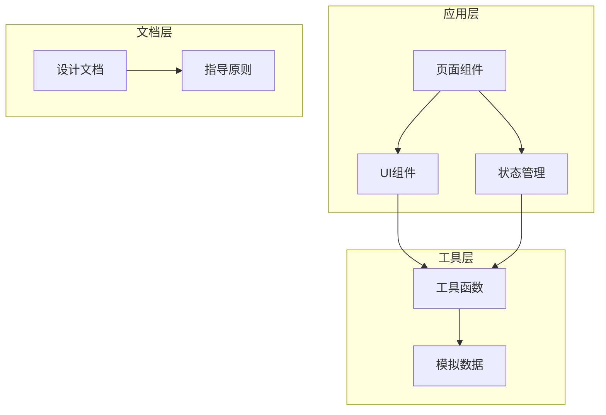
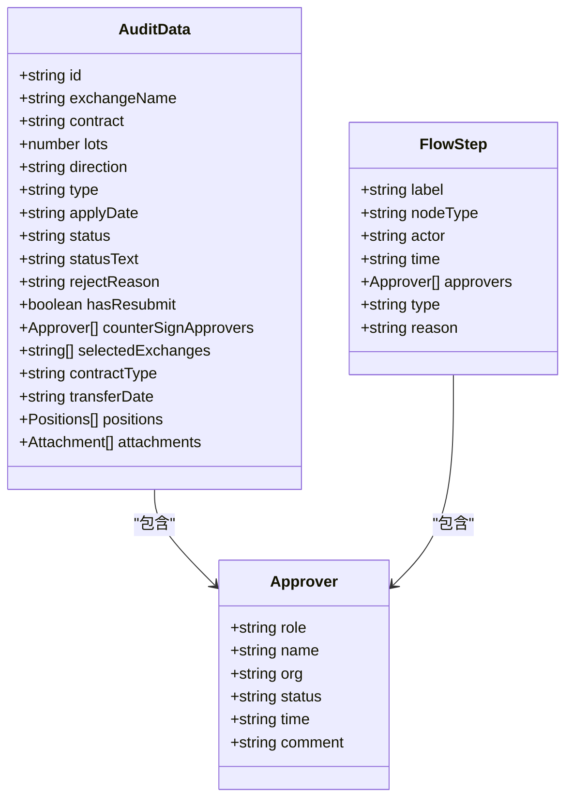
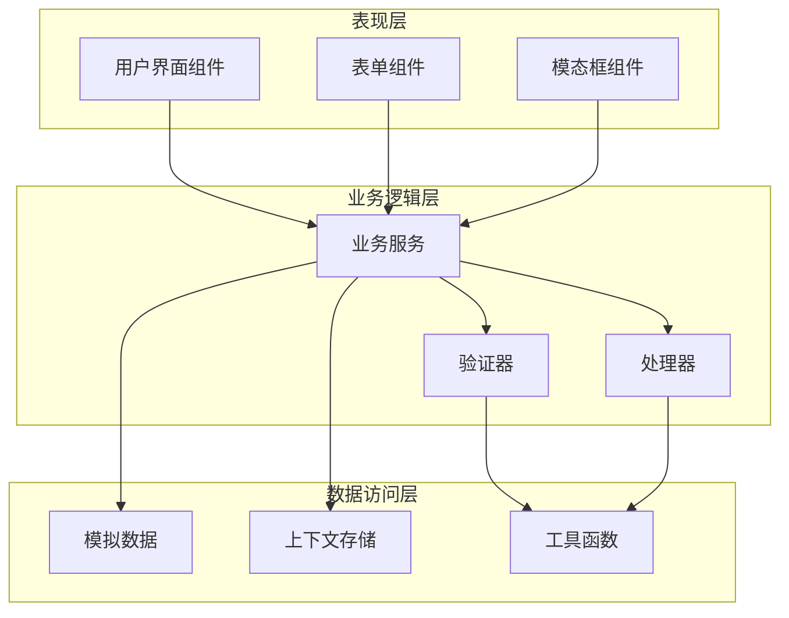
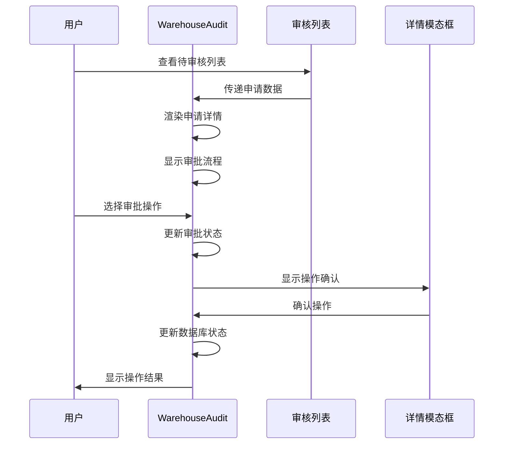
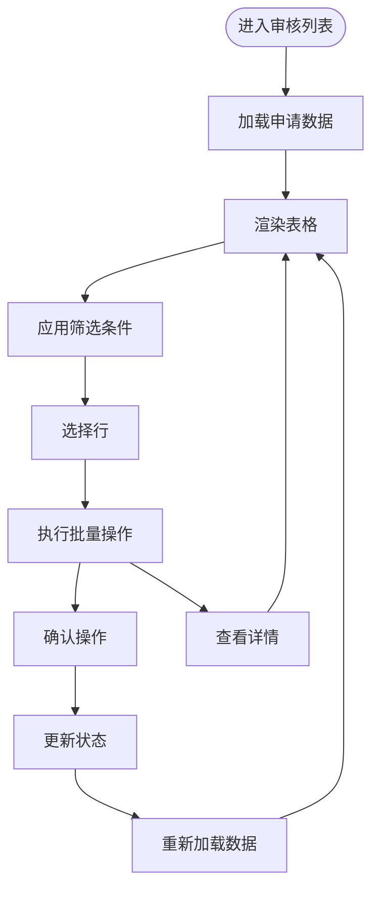
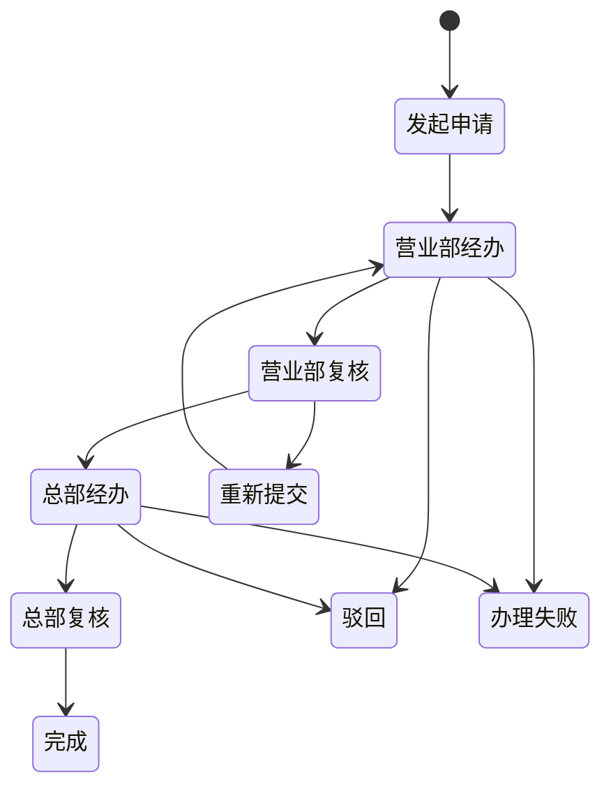
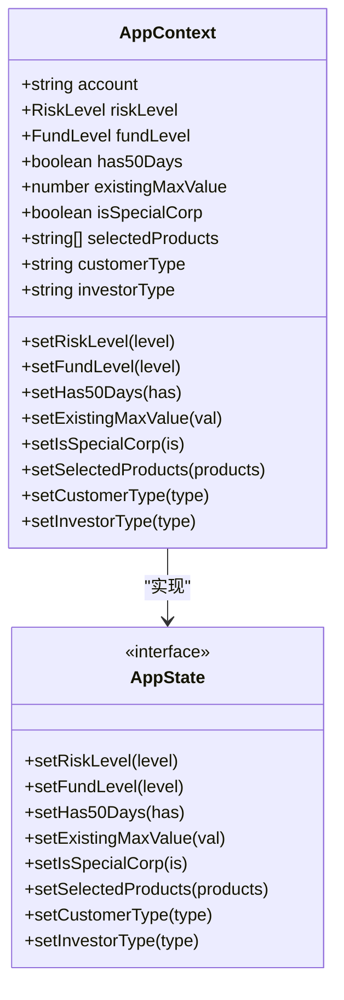
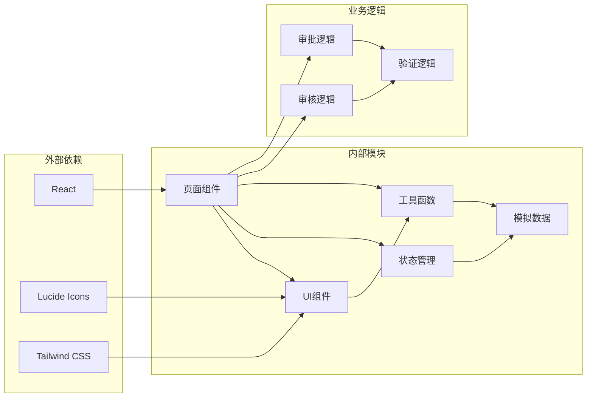

# 审核流程系统

<cite>
**本文档引用的文件**
- [WarehouseAudit.tsx](file://src/app/pages/WarehouseAudit.tsx)
- [WarehouseAuditList.tsx](file://src/app/pages/WarehouseAuditList.tsx)
- [ApplicationDetail.tsx](file://src/app/pages/ApplicationDetail.tsx)
- [StaffApproval.tsx](file://src/app/pages/StaffApproval.tsx)
- [StaffApprovalList.tsx](file://src/app/pages/StaffApprovalList.tsx)
- [SubmitForm.tsx](file://src/app/pages/SubmitForm.tsx)
- [ProcessRecord.tsx](file://src/app/components/ProcessRecord.tsx)
- [AppContext.tsx](file://src/app/store/AppContext.tsx)
- [mockData.ts](file://src/app/utils/mockData.ts)
- [warehouse-transfer-design.md](file://docs/warehouse-transfer-design.md)
</cite>

## 目录
1. [项目概述](#项目概述)
2. [项目结构](#项目结构)
3. [核心组件](#核心组件)
4. [架构概览](#架构概览)
5. [详细组件分析](#详细组件分析)
6. [依赖关系分析](#依赖关系分析)
7. [性能考虑](#性能考虑)
8. [故障排除指南](#故障排除指南)
9. [结论](#结论)

## 项目概述

审核流程系统是一个基于React的Web应用程序，专门用于管理期货交易所移仓业务的审批流程。该系统提供了完整的审核工作流程，包括客户申请、部门初审、运营中心会签、总部复核等环节，支持会签审批模式和多种业务场景。

系统采用现代化的前端技术栈，使用TypeScript构建，配合Tailwind CSS进行样式设计，实现了响应式布局和良好的用户体验。系统特别注重审核流程的可视化展示，通过流程图和状态指示器帮助审核人员快速理解业务进展。

## 项目结构

项目采用模块化的组织方式，主要分为以下几个层次：

**图表来源**
- [WarehouseAudit.tsx:1-883](file://src/app/pages/WarehouseAudit.tsx#L1-L883)
- [WarehouseAuditList.tsx:1-704](file://src/app/pages/WarehouseAuditList.tsx#L1-L704)

**章节来源**
- [WarehouseAudit.tsx:1-883](file://src/app/pages/WarehouseAudit.tsx#L1-L883)
- [WarehouseAuditList.tsx:1-704](file://src/app/pages/WarehouseAuditList.tsx#L1-L704)

## 核心组件

### 审核页面组件

系统的核心是审核页面组件，主要包括：

1. **WarehouseAudit** - 总部审核页面，负责展示详细的移仓申请信息和审批流程
2. **WarehouseAuditList** - 审核列表页面，提供批量管理和筛选功能
3. **StaffApproval** - 交易权限审批页面，用于管理客户交易权限申请
4. **StaffApprovalList** - 审批列表页面，支持批量处理功能

### 数据模型

系统定义了完整的数据模型来支持审核流程：

**图表来源**
- [WarehouseAudit.tsx:11-83](file://src/app/pages/WarehouseAudit.tsx#L11-L83)
- [WarehouseAudit.tsx:21-29](file://src/app/pages/WarehouseAudit.tsx#L21-L29)

**章节来源**
- [WarehouseAudit.tsx:11-83](file://src/app/pages/WarehouseAudit.tsx#L11-L83)
- [WarehouseAudit.tsx:21-29](file://src/app/pages/WarehouseAudit.tsx#L21-L29)

## 架构概览

系统采用分层架构设计，确保了良好的可维护性和扩展性：

**图表来源**
- [AppContext.tsx:1-64](file://src/app/store/AppContext.tsx#L1-L64)
- [mockData.ts:1-13](file://src/app/utils/mockData.ts#L1-L13)

系统的核心特点包括：

1. **状态管理** - 使用React Context进行全局状态管理
2. **组件化设计** - 采用高内聚、低耦合的组件架构
3. **数据驱动** - 通过模拟数据驱动整个审核流程
4. **响应式设计** - 支持多种设备和屏幕尺寸

## 详细组件分析

### 审核页面组件分析

#### WarehouseAudit 组件

WarehouseAudit 是系统的核心组件，负责展示详细的移仓申请信息和审批流程：

**图表来源**
- [WarehouseAudit.tsx:129-243](file://src/app/pages/WarehouseAudit.tsx#L129-L243)
- [WarehouseAudit.tsx:195-212](file://src/app/pages/WarehouseAudit.tsx#L195-L212)

组件的主要功能包括：

1. **申请信息展示** - 展示完整的移仓申请详情
2. **审批流程可视化** - 通过流程图展示当前审批状态
3. **会签审批支持** - 支持多个审批人的会签模式
4. **操作处理** - 提供通过、驳回、暂缓等操作选项

#### 审核列表组件

WarehouseAuditList 提供了完整的审核列表管理功能：

**图表来源**
- [WarehouseAuditList.tsx:413-703](file://src/app/pages/WarehouseAuditList.tsx#L413-L703)

**章节来源**
- [WarehouseAudit.tsx:129-243](file://src/app/pages/WarehouseAudit.tsx#L129-L243)
- [WarehouseAuditList.tsx:413-703](file://src/app/pages/WarehouseAuditList.tsx#L413-L703)

### 审批流程组件分析

#### StaffApproval 组件

StaffApproval 专门用于管理交易权限的审批流程：

**图表来源**
- [StaffApproval.tsx:554-627](file://src/app/pages/StaffApproval.tsx#L554-L627)

组件特色功能：

1. **多级审批** - 支持从营业部到总部的多级审批流程
2. **权限管理** - 提供全面的交易权限配置界面
3. **附件管理** - 支持多种类型的附件上传和管理
4. **操作日志** - 记录完整的操作历史

#### 审批流程记录组件

ProcessRecord 组件提供了标准化的流程记录展示：

**章节来源**
- [StaffApproval.tsx:554-627](file://src/app/pages/StaffApproval.tsx#L554-L627)
- [ProcessRecord.tsx:1-135](file://src/app/components/ProcessRecord.tsx#L1-L135)

### 状态管理系统

#### AppContext 状态管理

AppContext 提供了全局状态管理能力：

**图表来源**
- [AppContext.tsx:6-27](file://src/app/store/AppContext.tsx#L6-L27)

**章节来源**
- [AppContext.tsx:6-27](file://src/app/store/AppContext.tsx#L6-L27)

## 依赖关系分析

系统采用了清晰的依赖关系设计：

**图表来源**
- [mockData.ts:1-13](file://src/app/utils/mockData.ts#L1-L13)
- [SubmitForm.tsx:1-747](file://src/app/pages/SubmitForm.tsx#L1-L747)

**章节来源**
- [mockData.ts:1-13](file://src/app/utils/mockData.ts#L1-L13)
- [SubmitForm.tsx:1-747](file://src/app/pages/SubmitForm.tsx#L1-L747)

## 性能考虑

系统在设计时充分考虑了性能优化：

1. **组件懒加载** - 重要组件采用懒加载策略减少初始包大小
2. **虚拟滚动** - 列表组件使用虚拟滚动提升大数据量下的性能
3. **状态优化** - 使用React.memo和useMemo避免不必要的重渲染
4. **资源压缩** - 图标和静态资源经过压缩处理
5. **缓存策略** - 合理使用浏览器缓存机制

## 故障排除指南

### 常见问题及解决方案

#### 审核状态显示异常

**问题描述**: 审核状态在界面上显示不正确

**可能原因**:
1. 状态数据格式不正确
2. 状态映射逻辑错误
3. 组件状态更新时机问题

**解决步骤**:
1. 检查状态数据源的格式
2. 验证状态映射函数的逻辑
3. 确认组件的生命周期方法

#### 会签审批功能异常

**问题描述**: 会签审批无法正常工作

**可能原因**:
1. 会签状态计算逻辑错误
2. 审批人状态更新问题
3. 会签规则配置错误

**解决步骤**:
1. 检查会签状态计算函数
2. 验证审批人状态更新逻辑
3. 确认会签规则配置

#### 数据加载问题

**问题描述**: 页面数据无法正常加载

**可能原因**:
1. 模拟数据配置错误
2. API接口调用失败
3. 网络连接问题

**解决步骤**:
1. 检查模拟数据的配置
2. 验证API接口的可用性
3. 确认网络连接状态

**章节来源**
- [WarehouseAudit.tsx:32-36](file://src/app/pages/WarehouseAudit.tsx#L32-L36)
- [mockData.ts:10-12](file://src/app/utils/mockData.ts#L10-L12)

## 结论

审核流程系统是一个功能完整、设计合理的审批管理平台。系统通过模块化的架构设计、清晰的数据模型和完善的组件体系，为期货交易所移仓业务提供了高效的审批解决方案。

系统的主要优势包括：

1. **完整的业务覆盖** - 从客户申请到最终审批的全流程管理
2. **灵活的审批模式** - 支持串行和会签等多种审批模式
3. **直观的用户界面** - 通过流程图和状态指示器提供清晰的视觉反馈
4. **强大的扩展性** - 模块化的架构便于功能扩展和定制
5. **良好的用户体验** - 响应式设计和流畅的交互体验

未来可以考虑的功能增强包括：
- 实时状态同步机制
- 更丰富的报表统计功能
- 移动端适配优化
- 审批流程自定义配置
- 集成更多外部系统接口