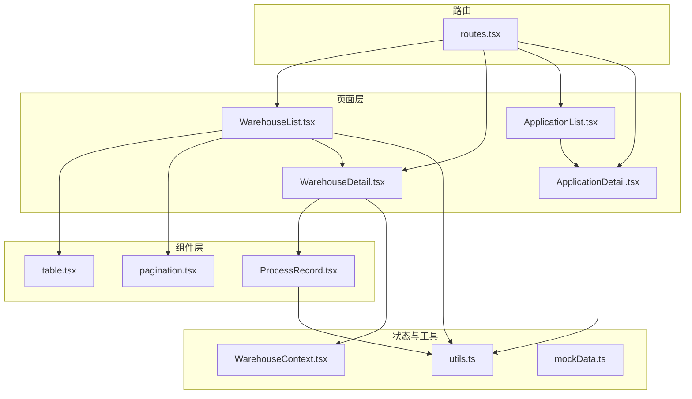
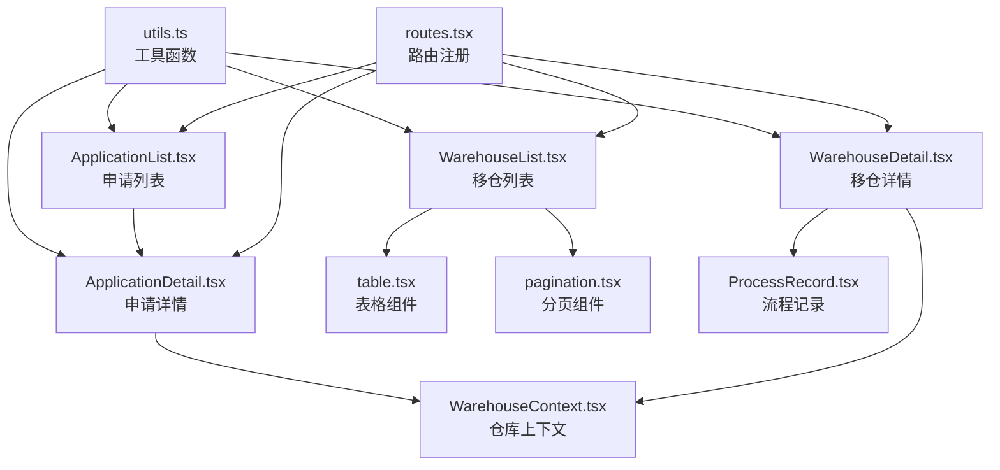
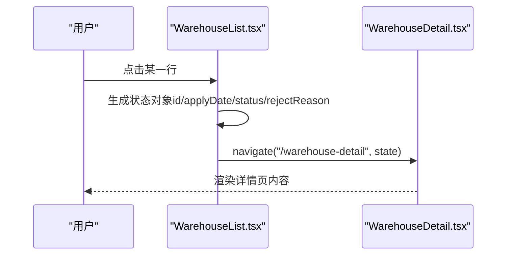
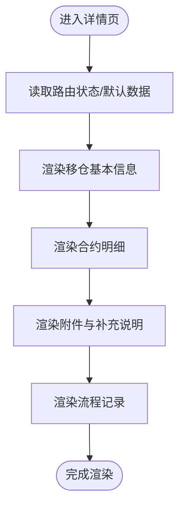
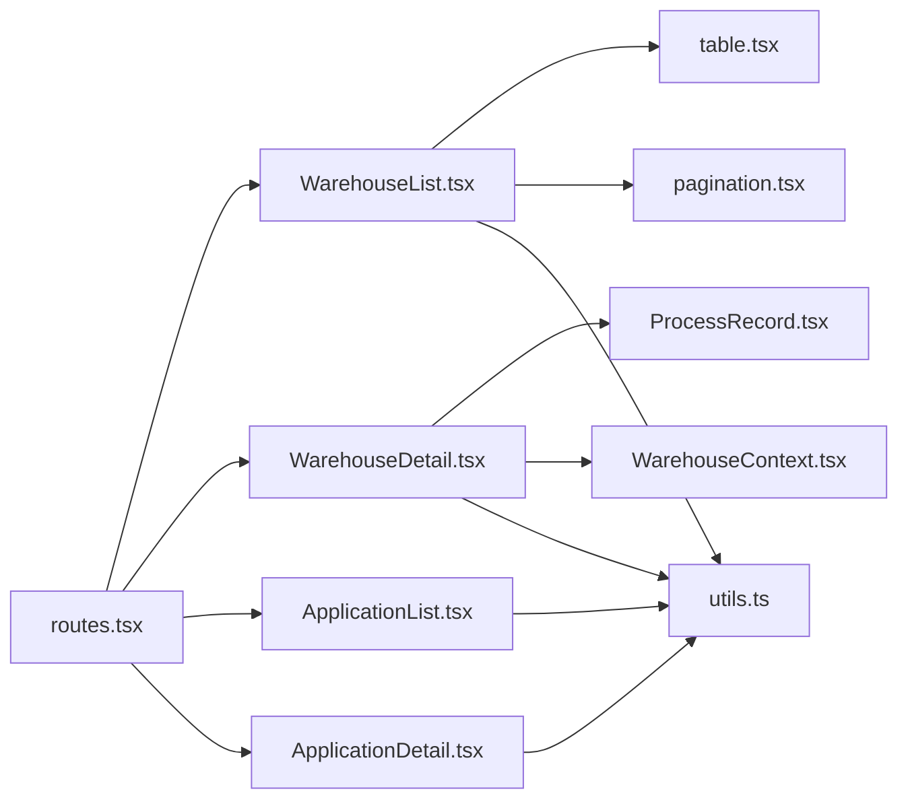
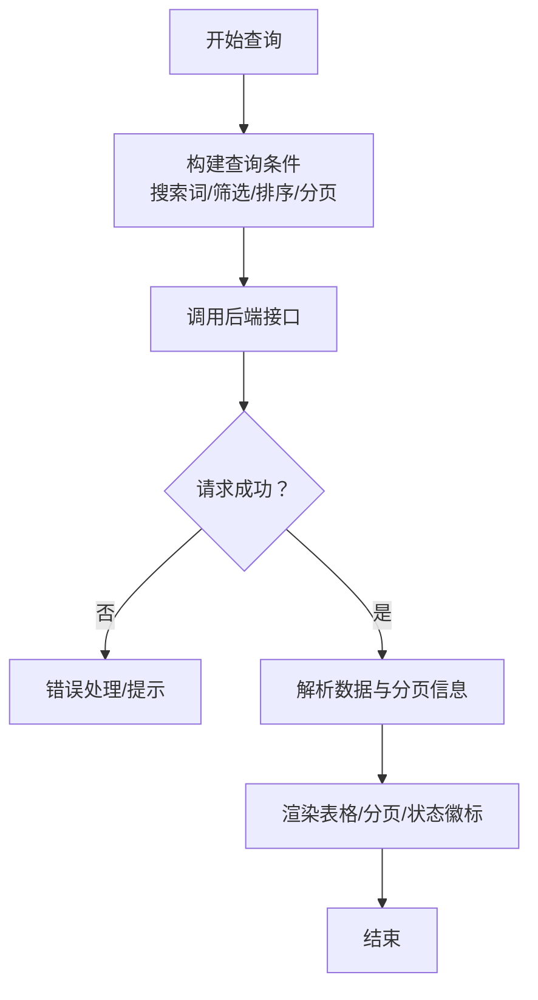

# 数据管理与查询

<cite>
**本文引用的文件**
- [ApplicationList.tsx](file://src/app/pages/ApplicationList.tsx)
- [ApplicationDetail.tsx](file://src/app/pages/ApplicationDetail.tsx)
- [WarehouseList.tsx](file://src/app/pages/WarehouseList.tsx)
- [WarehouseDetail.tsx](file://src/app/pages/WarehouseDetail.tsx)
- [table.tsx](file://src/app/components/ui/table.tsx)
- [pagination.tsx](file://src/app/components/ui/pagination.tsx)
- [ProcessRecord.tsx](file://src/app/components/ProcessRecord.tsx)
- [WarehouseContext.tsx](file://src/app/store/WarehouseContext.tsx)
- [routes.tsx](file://src/app/routes.tsx)
- [utils.ts](file://src/lib/utils.ts)
- [mockData.ts](file://src/app/utils/mockData.ts)
</cite>

## 目录
1. [简介](#简介)
2. [项目结构](#项目结构)
3. [核心组件](#核心组件)
4. [架构总览](#架构总览)
5. [组件详解](#组件详解)
6. [依赖关系分析](#依赖关系分析)
7. [性能考量](#性能考量)
8. [故障排查指南](#故障排查指南)
9. [结论](#结论)
10. [附录](#附录)

## 简介
本文件围绕“数据管理与查询”主题，系统梳理平台中移仓申请列表展示、详情查看、搜索筛选、分页处理、排序与导出等能力的设计与实现要点，并结合现有代码进行深入解析。文档同时给出数据查询逻辑、性能优化策略与用户体验设计建议，帮助开发者与产品人员快速理解与迭代相关功能。

## 项目结构
本项目采用基于页面与组件的组织方式，数据管理与查询相关的核心页面集中在 src/app/pages 下，UI 组件位于 src/app/components/ui，状态管理使用 React Context（仓库上下文），路由由 src/app/routes.tsx 统一配置。

**图表来源**
- [WarehouseList.tsx:118-219](file://src/app/pages/WarehouseList.tsx#L118-L219)
- [WarehouseDetail.tsx:190-441](file://src/app/pages/WarehouseDetail.tsx#L190-L441)
- [ApplicationList.tsx:7-178](file://src/app/pages/ApplicationList.tsx#L7-L178)
- [ApplicationDetail.tsx:7-113](file://src/app/pages/ApplicationDetail.tsx#L7-L113)
- [table.tsx:1-117](file://src/app/components/ui/table.tsx#L1-L117)
- [pagination.tsx:1-128](file://src/app/components/ui/pagination.tsx#L1-L128)
- [ProcessRecord.tsx:1-135](file://src/app/components/ProcessRecord.tsx#L1-L135)
- [WarehouseContext.tsx:1-185](file://src/app/store/WarehouseContext.tsx#L1-L185)
- [routes.tsx:1-38](file://src/app/routes.tsx#L1-L38)
- [utils.ts:1-6](file://src/lib/utils.ts#L1-L6)
- [mockData.ts:1-13](file://src/app/utils/mockData.ts#L1-L13)

**章节来源**
- [routes.tsx:18-38](file://src/app/routes.tsx#L18-L38)
- [WarehouseList.tsx:118-219](file://src/app/pages/WarehouseList.tsx#L118-L219)
- [WarehouseDetail.tsx:190-441](file://src/app/pages/WarehouseDetail.tsx#L190-L441)
- [ApplicationList.tsx:7-178](file://src/app/pages/ApplicationList.tsx#L7-L178)
- [ApplicationDetail.tsx:7-113](file://src/app/pages/ApplicationDetail.tsx#L7-L113)

## 核心组件
- 列表页面：负责展示数据表格、搜索与筛选入口、分页与导出按钮。
- 详情页面：负责展示单条记录的完整信息、流程记录与附件。
- 表格组件：封装通用表格结构与样式，支持响应式布局。
- 分页组件：提供分页导航、上一页/下一页与页码跳转。
- 流程记录组件：根据状态渲染不同阶段的流程节点。
- 仓库上下文：集中管理移仓相关状态与方法，便于跨组件共享。
- 路由：统一注册页面与导航。

**章节来源**
- [WarehouseList.tsx:118-219](file://src/app/pages/WarehouseList.tsx#L118-L219)
- [WarehouseDetail.tsx:190-441](file://src/app/pages/WarehouseDetail.tsx#L190-L441)
- [table.tsx:1-117](file://src/app/components/ui/table.tsx#L1-L117)
- [pagination.tsx:1-128](file://src/app/components/ui/pagination.tsx#L1-L128)
- [ProcessRecord.tsx:1-135](file://src/app/components/ProcessRecord.tsx#L1-L135)
- [WarehouseContext.tsx:1-185](file://src/app/store/WarehouseContext.tsx#L1-L185)
- [routes.tsx:18-38](file://src/app/routes.tsx#L18-L38)

## 架构总览
整体采用“页面-组件-上下文-路由”的分层架构。页面负责业务场景与交互；组件提供可复用的 UI 结构；上下文提供状态共享；路由统一管理导航。

**图表来源**
- [routes.tsx:18-38](file://src/app/routes.tsx#L18-L38)
- [WarehouseList.tsx:118-219](file://src/app/pages/WarehouseList.tsx#L118-L219)
- [WarehouseDetail.tsx:190-441](file://src/app/pages/WarehouseDetail.tsx#L190-L441)
- [ApplicationList.tsx:7-178](file://src/app/pages/ApplicationList.tsx#L7-L178)
- [ApplicationDetail.tsx:7-113](file://src/app/pages/ApplicationDetail.tsx#L7-L113)
- [table.tsx:1-117](file://src/app/components/ui/table.tsx#L1-L117)
- [pagination.tsx:1-128](file://src/app/components/ui/pagination.tsx#L1-L128)
- [ProcessRecord.tsx:1-135](file://src/app/components/ProcessRecord.tsx#L1-L135)
- [WarehouseContext.tsx:1-185](file://src/app/store/WarehouseContext.tsx#L1-L185)
- [utils.ts:1-6](file://src/lib/utils.ts#L1-L6)

## 组件详解

### 移仓申请列表（WarehouseList）
- 展示字段：流水号、交易所、合约、移仓方向、移仓类型、移仓手数、提交时间、当前状态、操作。
- 交互行为：
  - 点击行跳转到详情页，传递状态对象（含 id、applyDate、status、rejectReason 等）。
  - 搜索框与筛选按钮占位，当前为静态数据与占位交互。
  - 分页区域包含“上一页/下一页/页码”，当前为静态占位。
- 状态徽标：根据状态动态渲染“审核中/已完成/审核不通过”。

**图表来源**
- [WarehouseList.tsx:174-204](file://src/app/pages/WarehouseList.tsx#L174-L204)
- [WarehouseDetail.tsx:190-235](file://src/app/pages/WarehouseDetail.tsx#L190-L235)

**章节来源**
- [WarehouseList.tsx:118-219](file://src/app/pages/WarehouseList.tsx#L118-L219)

### 移仓申请详情（WarehouseDetail）
- 信息区块：
  - 移仓基本信息：交易所、方向、移出/移入方信息、实控组信息、特定交易所字段。
  - 合约明细：按交易所、品种、合约、方向、类型、手数、转移资金等展示。
  - 补充信息与附件：补充说明与附件列表。
  - 流程记录：根据状态渲染不同流程节点。
- 交互行为：
  - 返回列表按钮。
  - 详情页根据传入 id 匹配 mock 数据，找不到则使用默认数据。
  - 针对不同交易所与方向，动态决定列头与字段展示。

**图表来源**
- [WarehouseDetail.tsx:190-441](file://src/app/pages/WarehouseDetail.tsx#L190-L441)
- [ProcessRecord.tsx:1-135](file://src/app/components/ProcessRecord.tsx#L1-L135)

**章节来源**
- [WarehouseDetail.tsx:190-441](file://src/app/pages/WarehouseDetail.tsx#L190-L441)
- [ProcessRecord.tsx:1-135](file://src/app/components/ProcessRecord.tsx#L1-L135)

### 申请列表与详情（ApplicationList/ApplicationDetail）
- 列表：展示流水号、申请类型、申请品种、提交时间、当前状态与“查看详情”。
- 详情：根据状态渲染流程记录，支持“退回给客户”场景下的二次提交节点。
- 交互：点击行跳转详情，详情页根据状态决定只读/可编辑。

**章节来源**
- [ApplicationList.tsx:7-178](file://src/app/pages/ApplicationList.tsx#L7-L178)
- [ApplicationDetail.tsx:7-113](file://src/app/pages/ApplicationDetail.tsx#L7-L113)

### 表格与分页组件
- 表格组件：提供 Table/TableHead/TableRow/TableCell 等基础结构，支持响应式容器与 hover 效果。
- 分页组件：提供 Pagination/PaginationContent/PaginationLink 等，支持上一页/下一页与页码链接。

**章节来源**
- [table.tsx:1-117](file://src/app/components/ui/table.tsx#L1-L117)
- [pagination.tsx:1-128](file://src/app/components/ui/pagination.tsx#L1-L128)

### 仓库上下文（WarehouseContext）
- 状态模型：包含账户、客户、分支、客户类型、交易所集合、方向、合约类型、日期、交易编码、名称、实控账户、权限、移仓参数、仓位列表、附件、确认标记、备注等。
- 方法：设置器、重置器、权限切换与查询、仓位管理、附件管理等。
- 用途：在详情页与表单中共享状态，避免 props 逐层传递。

**章节来源**
- [WarehouseContext.tsx:1-185](file://src/app/store/WarehouseContext.tsx#L1-L185)

### 路由与导航
- 路由注册：统一在 routes.tsx 中注册页面，包括仓库相关页面与申请相关页面。
- 导航：列表页通过 navigate 进入详情页，详情页返回列表。

**章节来源**
- [routes.tsx:18-38](file://src/app/routes.tsx#L18-L38)

## 依赖关系分析
- 页面依赖组件：列表页依赖表格与分页组件；详情页依赖流程记录组件与上下文。
- 页面依赖工具：使用 utils.ts 的 cn 组合样式类。
- 页面依赖路由：通过路由进行页面间跳转。
- 上下文依赖：详情页与表单共享仓库上下文状态。

**图表来源**
- [WarehouseList.tsx:118-219](file://src/app/pages/WarehouseList.tsx#L118-L219)
- [WarehouseDetail.tsx:190-441](file://src/app/pages/WarehouseDetail.tsx#L190-L441)
- [ApplicationList.tsx:7-178](file://src/app/pages/ApplicationList.tsx#L7-L178)
- [ApplicationDetail.tsx:7-113](file://src/app/pages/ApplicationDetail.tsx#L7-L113)
- [table.tsx:1-117](file://src/app/components/ui/table.tsx#L1-L117)
- [pagination.tsx:1-128](file://src/app/components/ui/pagination.tsx#L1-L128)
- [ProcessRecord.tsx:1-135](file://src/app/components/ProcessRecord.tsx#L1-L135)
- [WarehouseContext.tsx:1-185](file://src/app/store/WarehouseContext.tsx#L1-L185)
- [utils.ts:1-6](file://src/lib/utils.ts#L1-L6)
- [routes.tsx:18-38](file://src/app/routes.tsx#L18-L38)

**章节来源**
- [routes.tsx:18-38](file://src/app/routes.tsx#L18-L38)
- [utils.ts:1-6](file://src/lib/utils.ts#L1-L6)

## 性能考量
- 列表渲染
  - 当前为静态数组渲染，建议在真实数据场景下启用虚拟滚动以降低长列表渲染成本。
  - 对于大量行的表格，优先考虑分页加载与懒加载策略。
- 排序与筛选
  - 当前为占位交互，建议在后端接口支持排序与筛选参数，前端仅传递查询条件。
  - 前端筛选可在小数据集下使用内存过滤，大数据集应走服务端过滤。
- 图片与附件
  - 附件列表建议使用缩略图与懒加载，避免一次性加载过多资源。
- 样式合并
  - 使用工具函数合并样式类，减少重复类名与样式冲突。

[本节为通用指导，无需具体文件引用]

## 故障排查指南
- 列表项点击无反应
  - 检查路由是否正确注册，以及 navigate 参数是否包含必要状态。
  - 参考：[routes.tsx:18-38](file://src/app/routes.tsx#L18-L38)，[WarehouseList.tsx:174-204](file://src/app/pages/WarehouseList.tsx#L174-L204)
- 详情页空白或默认数据
  - 确认传入的 id 是否存在于 mock 映射中，否则将回退到默认数据。
  - 参考：[WarehouseDetail.tsx:190-235](file://src/app/pages/WarehouseDetail.tsx#L190-L235)
- 状态徽标不显示
  - 检查状态值是否符合预期，确保与渲染逻辑匹配。
  - 参考：[WarehouseList.tsx:90-116](file://src/app/pages/WarehouseList.tsx#L90-L116)
- 流程记录异常
  - 确认传入的状态与拒绝原因是否正确，流程记录组件会依据状态渲染不同节点。
  - 参考：[ProcessRecord.tsx:1-135](file://src/app/components/ProcessRecord.tsx#L1-L135)
- 样式错乱
  - 检查工具函数 cn 的调用与 Tailwind 类名拼接是否正确。
  - 参考：[utils.ts:1-6](file://src/lib/utils.ts#L1-L6)

**章节来源**
- [routes.tsx:18-38](file://src/app/routes.tsx#L18-L38)
- [WarehouseList.tsx:90-116](file://src/app/pages/WarehouseList.tsx#L90-L116)
- [WarehouseDetail.tsx:190-235](file://src/app/pages/WarehouseDetail.tsx#L190-L235)
- [ProcessRecord.tsx:1-135](file://src/app/components/ProcessRecord.tsx#L1-L135)
- [utils.ts:1-6](file://src/lib/utils.ts#L1-L6)

## 结论
当前实现以静态数据与占位交互为主，聚焦于页面结构与组件化复用。后续可围绕以下方向演进：
- 引入真实数据源与服务端查询参数，完善排序、筛选与分页。
- 在详情页集成仓库上下文，实现状态持久化与跨组件共享。
- 优化长列表渲染与资源加载，提升性能与体验。
- 规范流程记录与状态机，增强可维护性与一致性。

[本节为总结性内容，无需具体文件引用]

## 附录

### 数据查询逻辑（概念流程）

[本图为概念流程图，不直接映射具体源码文件]

### 用户体验设计建议
- 列表页
  - 搜索与筛选实时反馈，避免频繁刷新。
  - 状态徽标具备明确语义与颜色提示，便于快速识别。
- 详情页
  - 信息分区块展示，重要字段加粗或高亮。
  - 附件支持预览与下载，提供清晰的尺寸与格式标识。
- 交互
  - 按钮与图标具备明确语义，hover 与点击反馈明显。
  - 返回与导航路径清晰，减少用户迷路。

[本节为通用指导，无需具体文件引用]