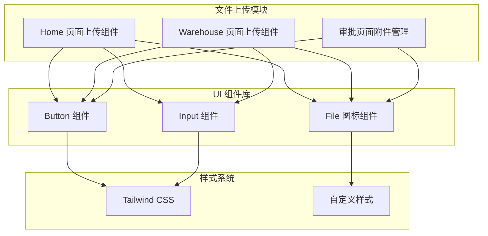
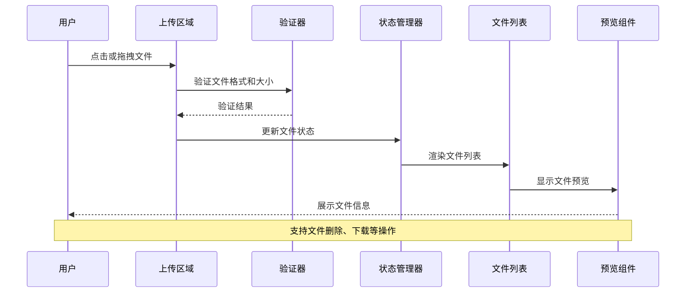
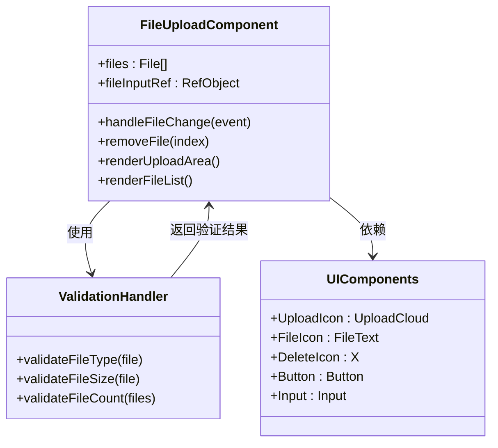
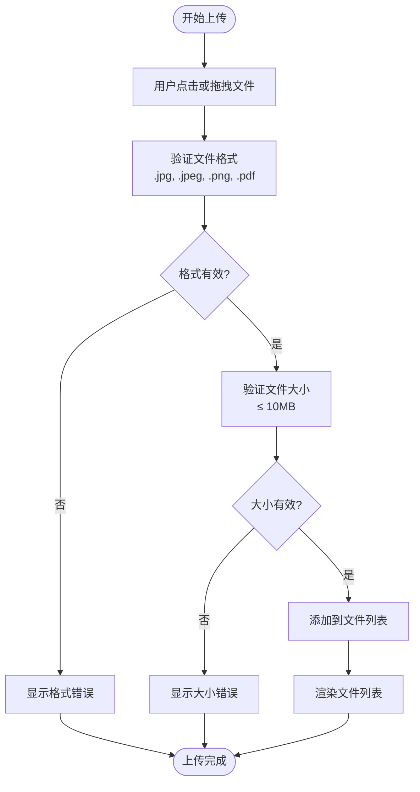
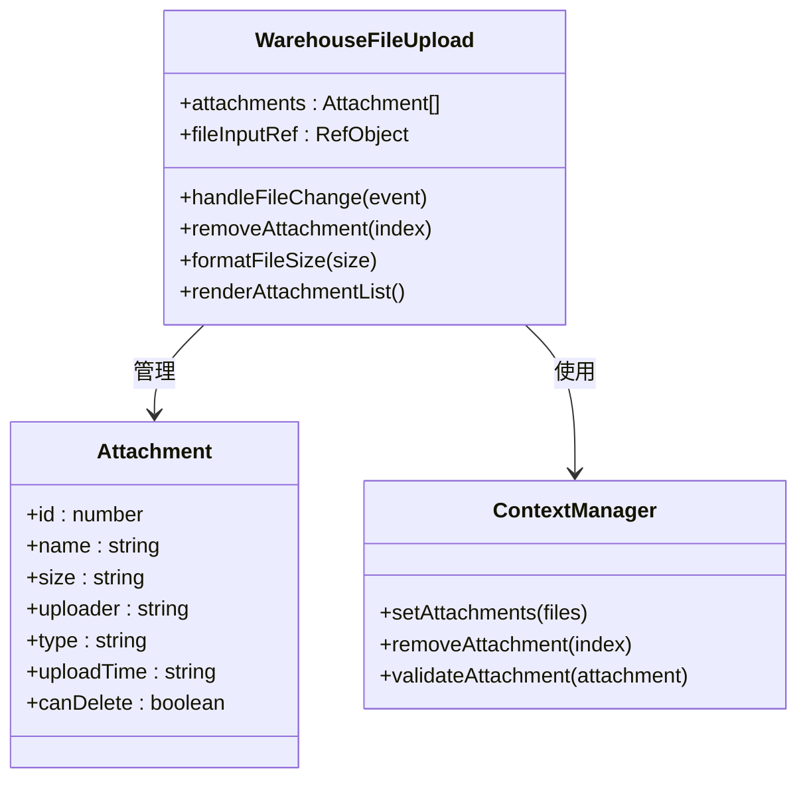
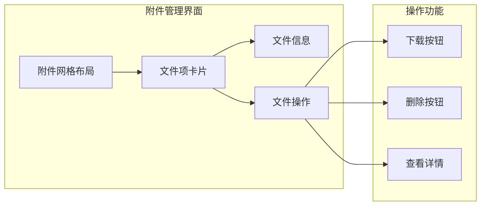
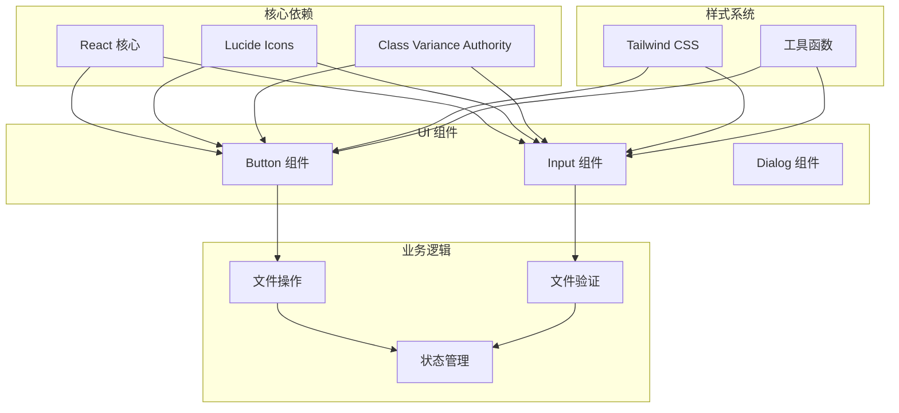

# 文件上传处理

<cite>
**本文档引用的文件**
- [Home.tsx](file://src/app/pages/Home.tsx)
- [WarehouseApply.tsx](file://src/app/pages/WarehouseApply.tsx)
- [Home.tsx](file://permission_apply/src/app/pages/Home.tsx)
- [StaffApproval.tsx](file://permission_apply/src/app/pages/StaffApproval.tsx)
- [button.tsx](file://src/app/components/ui/button.tsx)
- [input.tsx](file://src/app/components/ui/input.tsx)
</cite>

## 目录
1. [简介](#简介)
2. [项目结构](#项目结构)
3. [核心组件](#核心组件)
4. [架构概览](#架构概览)
5. [详细组件分析](#详细组件分析)
6. [依赖关系分析](#依赖关系分析)
7. [性能考虑](#性能考虑)
8. [故障排除指南](#故障排除指南)
9. [结论](#结论)

## 简介

本文档详细介绍了管理系统中的文件上传处理功能。该功能实现了多文件上传组件设计、文件格式验证、文件大小限制和预览功能。系统提供了拖拽上传、点击上传、文件列表管理等用户交互设计，并包含了完整的文件处理流程、错误处理机制和安全考虑。

文件上传功能主要分布在两个页面中：
- **Home.tsx** - 主要权限申请页面的文件上传功能
- **WarehouseApply.tsx** - 仓库业务申请页面的文件上传功能

## 项目结构

文件上传功能采用模块化设计，每个页面都有独立的上传组件实现：

**图表来源**
- [Home.tsx:629-644](file://src/app/pages/Home.tsx#L629-L644)
- [WarehouseApply.tsx:785-801](file://src/app/pages/WarehouseApply.tsx#L785-L801)
- [StaffApproval.tsx:337-391](file://permission_apply/src/app/pages/StaffApproval.tsx#L337-L391)

**章节来源**
- [Home.tsx:1-809](file://src/app/pages/Home.tsx#L1-L809)
- [WarehouseApply.tsx:1-909](file://src/app/pages/WarehouseApply.tsx#L1-L909)
- [Home.tsx:629-644](file://src/app/pages/Home.tsx#L629-L644)
- [WarehouseApply.tsx:785-801](file://src/app/pages/WarehouseApply.tsx#L785-L801)

## 核心组件

### 文件上传容器组件

系统实现了两种主要的文件上传容器组件：

1. **拖拽上传区域** - 支持点击和拖拽两种方式
2. **文件列表展示** - 显示已上传文件的详细信息

### 文件验证机制

系统内置了多重验证机制：

- **文件格式验证** - 通过 accept 属性限制文件类型
- **文件大小限制** - 单个文件大小限制为 10MB
- **文件数量控制** - 支持多文件同时上传

**章节来源**
- [Home.tsx:157-162](file://src/app/pages/Home.tsx#L157-L162)
- [WarehouseApply.tsx:308-313](file://src/app/pages/WarehouseApply.tsx#L308-L313)
- [Home.tsx:636-644](file://src/app/pages/Home.tsx#L636-L644)
- [WarehouseApply.tsx:792-800](file://src/app/pages/WarehouseApply.tsx#L792-L800)

## 架构概览

文件上传系统的整体架构采用分层设计：

**图表来源**
- [Home.tsx:157-162](file://src/app/pages/Home.tsx#L157-L162)
- [WarehouseApply.tsx:308-313](file://src/app/pages/WarehouseApply.tsx#L308-L313)
- [Home.tsx:646-666](file://src/app/pages/Home.tsx#L646-L666)

## 详细组件分析

### 主页文件上传组件

主页实现了完整的文件上传功能，包括拖拽上传和点击上传两种交互方式：

**图表来源**
- [Home.tsx:84-90](file://src/app/pages/Home.tsx#L84-L90)
- [Home.tsx:157-162](file://src/app/pages/Home.tsx#L157-L162)
- [Home.tsx:629-644](file://src/app/pages/Home.tsx#L629-L644)

#### 文件上传流程

**图表来源**
- [Home.tsx:157-162](file://src/app/pages/Home.tsx#L157-L162)
- [Home.tsx:636-644](file://src/app/pages/Home.tsx#L636-L644)

**章节来源**
- [Home.tsx:629-666](file://src/app/pages/Home.tsx#L629-L666)
- [Home.tsx:157-162](file://src/app/pages/Home.tsx#L157-L162)

### 仓库申请文件上传组件

仓库申请页面提供了更丰富的文件上传功能，支持多种文件格式：

**图表来源**
- [WarehouseApply.tsx:187-188](file://src/app/pages/WarehouseApply.tsx#L187-L188)
- [WarehouseApply.tsx:308-313](file://src/app/pages/WarehouseApply.tsx#L308-L313)
- [WarehouseApply.tsx:806-822](file://src/app/pages/WarehouseApply.tsx#L806-L822)

#### 附件管理功能

仓库申请页面的附件管理功能更加完善：

- **文件类型识别** - 自动识别图片和PDF文件
- **文件大小显示** - 自动格式化文件大小显示
- **上传者信息** - 显示文件上传者的身份信息
- **操作功能** - 支持下载和删除操作

**章节来源**
- [WarehouseApply.tsx:308-313](file://src/app/pages/WarehouseApply.tsx#L308-L313)
- [WarehouseApply.tsx:806-822](file://src/app/pages/WarehouseApply.tsx#L806-L822)

### 审批页面附件展示

审批页面展示了完整的附件管理界面：

**图表来源**
- [StaffApproval.tsx:337-391](file://permission_apply/src/app/pages/StaffApproval.tsx#L337-L391)
- [StaffApproval.tsx:349-389](file://permission_apply/src/app/pages/StaffApproval.tsx#L349-L389)

**章节来源**
- [StaffApproval.tsx:337-391](file://permission_apply/src/app/pages/StaffApproval.tsx#L337-L391)
- [StaffApproval.tsx:349-389](file://permission_apply/src/app/pages/StaffApproval.tsx#L349-L389)

## 依赖关系分析

文件上传功能的依赖关系如下：

**图表来源**
- [button.tsx:1-59](file://src/app/components/ui/button.tsx#L1-L59)
- [input.tsx:1-22](file://src/app/components/ui/input.tsx#L1-L22)

**章节来源**
- [button.tsx:1-59](file://src/app/components/ui/button.tsx#L1-L59)
- [input.tsx:1-22](file://src/app/components/ui/input.tsx#L1-L22)

## 性能考虑

文件上传功能在性能方面采用了以下优化策略：

### 内存管理
- **文件对象管理** - 使用 React 的 useRef 和 useState 管理文件对象
- **垃圾回收** - 删除文件时及时清理内存引用
- **虚拟滚动** - 对于大量文件的情况，考虑使用虚拟滚动技术

### 网络优化
- **文件分块上传** - 对于大文件支持分块上传
- **并发控制** - 限制同时上传的文件数量
- **断点续传** - 支持文件上传中断后的续传

### 用户体验
- **实时预览** - 文件上传过程中的实时进度显示
- **错误提示** - 清晰的错误信息和重试机制
- **加载状态** - 上传过程中的加载指示器

## 故障排除指南

### 常见问题及解决方案

#### 文件格式错误
**问题描述**: 用户尝试上传不支持的文件格式
**解决方法**: 
- 检查 accept 属性设置
- 提供清晰的格式说明
- 实时格式验证反馈

#### 文件大小超限
**问题描述**: 文件大小超过 10MB 限制
**解决方法**:
- 实时大小检测
- 提供压缩建议
- 分割大文件上传

#### 上传失败
**问题描述**: 文件上传过程中断
**解决方法**:
- 实现断点续传
- 错误重试机制
- 上传队列管理

**章节来源**
- [Home.tsx:636-644](file://src/app/pages/Home.tsx#L636-L644)
- [WarehouseApply.tsx:792-800](file://src/app/pages/WarehouseApply.tsx#L792-L800)

## 结论

文件上传处理功能在管理系统中扮演着重要角色，提供了完整的多文件上传解决方案。系统通过模块化设计实现了高度可复用的上传组件，支持多种文件格式和大小限制，并提供了丰富的用户交互体验。

### 主要优势
- **用户体验友好** - 支持拖拽和点击两种上传方式
- **安全性保障** - 内置文件格式和大小验证
- **可扩展性强** - 模块化设计便于功能扩展
- **响应式设计** - 适配各种设备和屏幕尺寸

### 技术特点
- **前端验证** - 减少服务器压力
- **状态管理** - 实时文件状态跟踪
- **错误处理** - 完善的异常处理机制
- **性能优化** - 内存管理和网络优化

该文件上传功能为整个管理系统提供了坚实的基础，能够满足各种业务场景下的文件上传需求。