# 移仓业务申请模块

<cite>
**本文档引用的文件**
- [WarehouseApply.tsx](file://src/app/pages/WarehouseApply.tsx)
- [WarehouseAudit.tsx](file://src/app/pages/WarehouseAudit.tsx)
- [WarehouseContext.tsx](file://src/app/store/WarehouseContext.tsx)
- [SubmitForm.tsx](file://src/app/pages/SubmitForm.tsx)
- [ApplicationDetail.tsx](file://src/app/pages/ApplicationDetail.tsx)
- [ApplicationList.tsx](file://src/app/pages/ApplicationList.tsx)
- [StaffApproval.tsx](file://src/app/pages/StaffApproval.tsx)
- [ProcessRecord.tsx](file://src/app/components/ProcessRecord.tsx)
- [mockData.ts](file://src/app/utils/mockData.ts)
- [warehouse-transfer-design.md](file://docs/warehouse-transfer-design.md)
- [国泰君安期货交易所移仓业务操作指引.md](file://docs/国泰君安期货交易所移仓业务操作指引.md)
</cite>

## 目录
1. [简介](#简介)
2. [项目结构](#项目结构)
3. [核心组件](#核心组件)
4. [架构概览](#架构概览)
5. [详细组件分析](#详细组件分析)
6. [依赖分析](#依赖分析)
7. [性能考虑](#性能考虑)
8. [故障排除指南](#故障排除指南)
9. [结论](#结论)

## 简介

移仓业务申请模块是国泰君安期货管理平台的重要组成部分，负责处理客户在各大期货交易所之间的持仓转移业务。该模块实现了完整的移仓申请、审核、执行和监控流程，涵盖了交易所选择、合约管理、风险评估、合规检查等多个核心功能。

该模块基于React技术栈构建，采用现代化的前端开发模式，提供了直观易用的用户界面和强大的后台管理系统。系统支持三种主要的移仓类型：跨期货公司转移、移入我司、移出我司，以及特殊的实际控制关系组内移仓。

## 项目结构

移仓业务申请模块采用清晰的分层架构设计，主要包含以下层次：

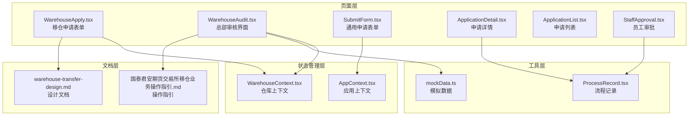

**图表来源**
- [WarehouseApply.tsx:1-909](file://src/app/pages/WarehouseApply.tsx#L1-L909)
- [WarehouseAudit.tsx:1-883](file://src/app/pages/WarehouseAudit.tsx#L1-L883)
- [WarehouseContext.tsx:1-185](file://src/app/store/WarehouseContext.tsx#L1-L185)

**章节来源**
- [WarehouseApply.tsx:1-909](file://src/app/pages/WarehouseApply.tsx#L1-L909)
- [WarehouseAudit.tsx:1-883](file://src/app/pages/WarehouseAudit.tsx#L1-L883)
- [WarehouseContext.tsx:1-185](file://src/app/store/WarehouseContext.tsx#L1-L185)

## 核心组件

### 移仓申请表单组件

移仓申请表单是整个模块的核心界面，提供了完整的移仓业务申请功能。该组件具有以下特点：

- **多交易所支持**：支持大连商品交易所(DCE)、郑州商品交易所(CZCE)、上海期货交易所(SHFE)
- **灵活的方向选择**：支持移出我司、移入我司、实际控制关系组移仓三种模式
- **实时验证**：内置完整的表单验证逻辑，确保数据完整性
- **动态配置**：根据选择的交易所和方向动态调整表单字段

### 审核管理组件

审核管理组件为总部审核人员提供了专业的审批界面，包含：

- **风险评估面板**：展示客户的风险状况和合规性检查结果
- **规则校验**：验证交易所规则和内部政策的符合性
- **操作日志**：完整的操作历史记录和状态追踪
- **批量处理**：支持会签审批和多级审批流程

### 状态管理

WarehouseContext提供集中化的状态管理，包括：

- **表单状态**：管理所有移仓申请相关的表单数据
- **权限控制**：基于账号的权限管理和访问控制
- **业务状态**：跟踪申请流程的各个阶段状态
- **附件管理**：处理各种证明文件和相关材料

**章节来源**
- [WarehouseApply.tsx:185-400](file://src/app/pages/WarehouseApply.tsx#L185-L400)
- [WarehouseAudit.tsx:129-189](file://src/app/pages/WarehouseAudit.tsx#L129-L189)
- [WarehouseContext.tsx:19-73](file://src/app/store/WarehouseContext.tsx#L19-L73)

## 架构概览

移仓业务申请模块采用了分层架构设计，确保了系统的可维护性和扩展性：

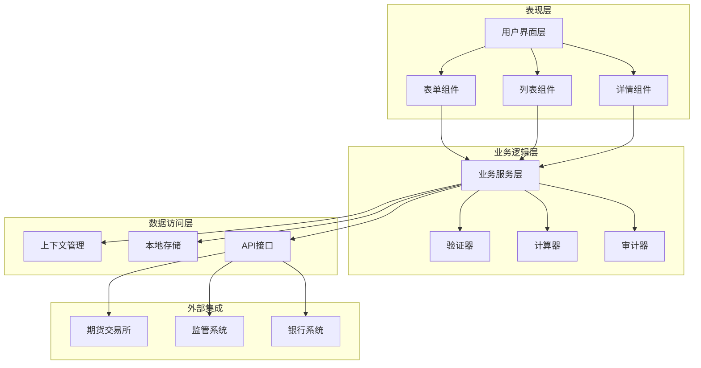

**图表来源**
- [WarehouseApply.tsx:1-909](file://src/app/pages/WarehouseApply.tsx#L1-L909)
- [WarehouseAudit.tsx:1-883](file://src/app/pages/WarehouseAudit.tsx#L1-L883)
- [WarehouseContext.tsx:1-185](file://src/app/store/WarehouseContext.tsx#L1-L185)

### 数据流架构

系统采用双向数据绑定和单向数据流相结合的设计模式：

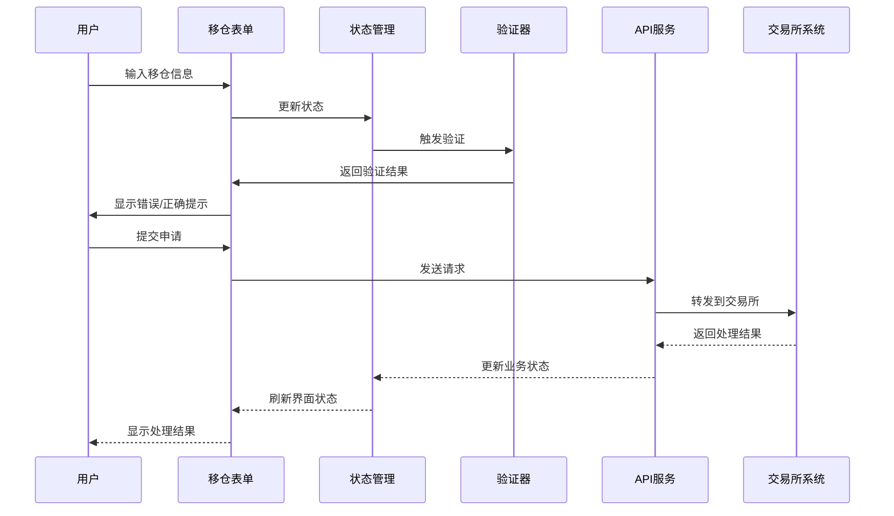

**图表来源**
- [WarehouseApply.tsx:382-390](file://src/app/pages/WarehouseApply.tsx#L382-L390)
- [WarehouseContext.tsx:144-177](file://src/app/store/WarehouseContext.tsx#L144-L177)

## 详细组件分析

### 移仓申请表单组件

#### 表单设计架构

移仓申请表单采用了模块化的设计思路，将复杂的业务逻辑分解为多个独立的功能模块：

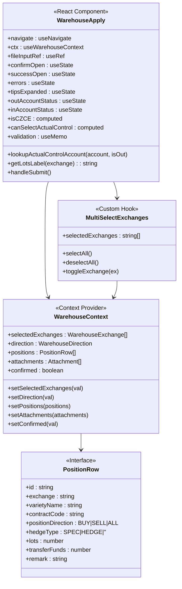

**图表来源**
- [WarehouseApply.tsx:185-400](file://src/app/pages/WarehouseApply.tsx#L185-L400)
- [WarehouseContext.tsx:7-73](file://src/app/store/WarehouseContext.tsx#L7-L73)

#### 交易所选择管理

系统支持三大期货交易所的选择和管理，每个交易所都有其特定的业务规则：

| 交易所 | 支持功能 | 特殊规则 | 限制条件 |
|--------|----------|----------|----------|
| 大连商品交易所(DCE) | 跨期货公司转移、实际控制组内转移 | 支持按量移仓选项 | 合约上市日至最后交易日前一日 |
| 郑州商品交易所(CZCE) | 跨期货公司转移 | 不支持部分转移 | 全部持仓转移 |
| 上海期货交易所(SHFE) | 实际控制组内转移 | 需提前10个交易日确认关系 | 交割单位整数倍 |

#### 合约代码输入管理

合约代码输入采用了智能验证和自动补全机制：

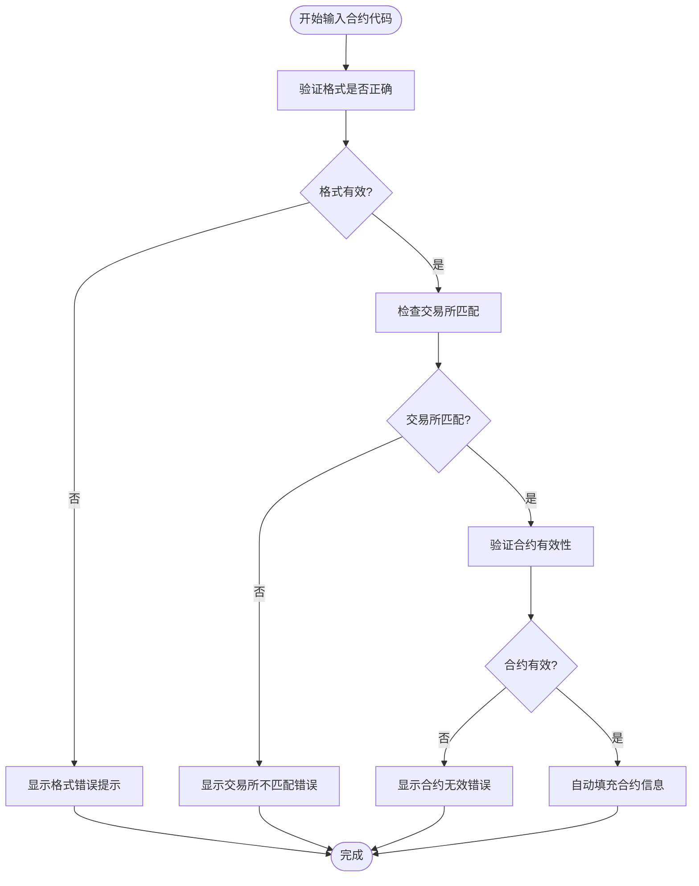

**图表来源**
- [WarehouseApply.tsx:673-750](file://src/app/pages/WarehouseApply.tsx#L673-L750)

#### 移仓手数计算

移仓手数的计算根据不同交易所和业务场景有不同的规则：

| 场景 | 计算方式 | 特殊说明 |
|------|----------|----------|
| 郑州商品交易所 | 预估移仓手数 | 支持全部持仓转移 |
| 上海期货交易所 | 预估移仓手数 | 需为交割单位整数倍 |
| 大连商品交易所 | 移仓手数或预估移仓手数 | 取决于是否按量移仓 |
| 实际控制组内转移 | 移仓手数 | 支持部分转移 |

**章节来源**
- [WarehouseApply.tsx:225-230](file://src/app/pages/WarehouseApply.tsx#L225-L230)
- [WarehouseApply.tsx:673-750](file://src/app/pages/WarehouseApply.tsx#L673-L750)

### 实际控制关系管理

实际控制关系管理是移仓业务的核心功能之一，系统提供了完善的实控关系验证和管理机制：

#### 实控账号验证流程

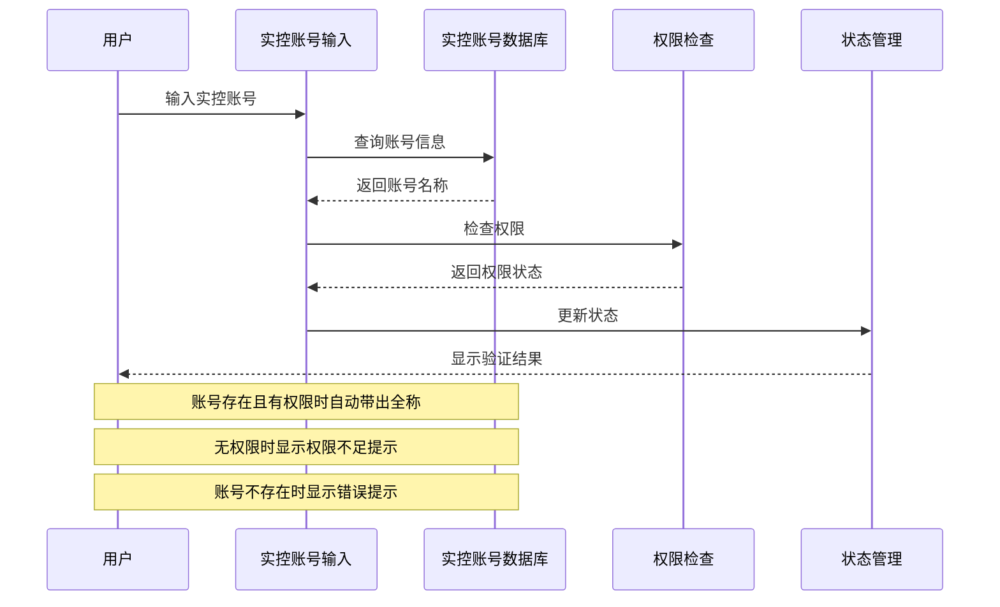

**图表来源**
- [WarehouseApply.tsx:198-219](file://src/app/pages/WarehouseApply.tsx#L198-L219)

#### 实控关系验证机制

系统实现了多层次的实控关系验证机制：

1. **账号级权限控制**：基于账号维度的权限管理
2. **实控关系验证**：验证实际控制关系的有效性
3. **合规性检查**：确保符合交易所和监管要求

**章节来源**
- [WarehouseApply.tsx:48-55](file://src/app/pages/WarehouseApply.tsx#L48-L55)
- [WarehouseContext.tsx:57-104](file://src/app/store/WarehouseContext.tsx#L57-L104)

### 风险评估机制

系统集成了全面的风险评估机制，确保移仓业务的安全性和合规性：

#### 风险控制策略

| 风险类型 | 控制策略 | 阈值设置 | 处理方式 |
|----------|----------|----------|----------|
| 资金风险 | 可用资金检查 | ≥0 | 风险度≤100% |
| 交易风险 | 交易编码状态 | 正常 | 无异常状态 |
| 合规风险 | 适当性评估 | 符合要求 | 通过审核 |
| 市场风险 | 极端行情监控 | 14:00截止 | 延缓受理 |

#### 风险评估流程

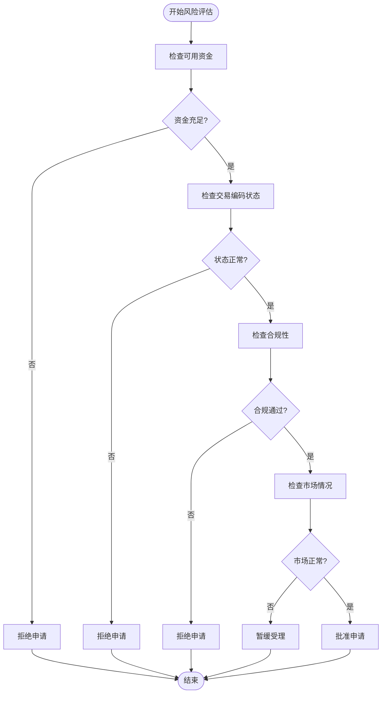

**图表来源**
- [WarehouseAudit.tsx:274-288](file://src/app/pages/WarehouseAudit.tsx#L274-L288)

### 审核流程管理

系统实现了完整的多级审核流程，确保业务处理的规范性和安全性：

#### 审核流程节点

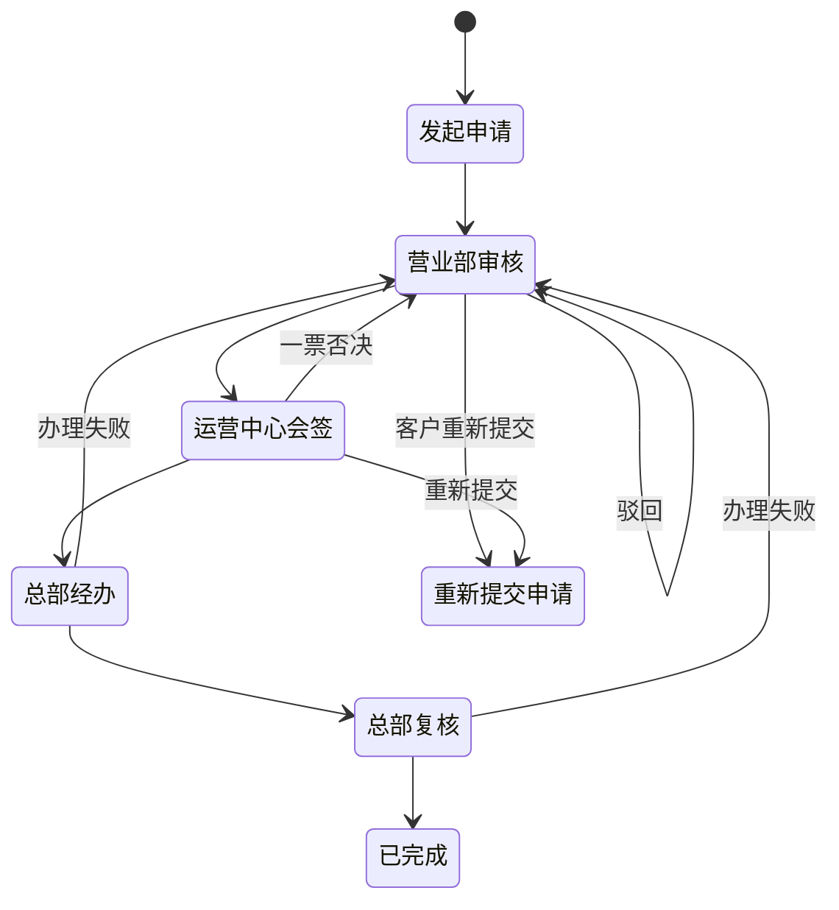

**图表来源**
- [WarehouseAudit.tsx:521-787](file://src/app/pages/WarehouseAudit.tsx#L521-L787)

#### 会签审批机制

系统支持会签审批模式，采用"一票否决"原则：

- **会签节点**：运营中心风控评估、交割评估、结算评估
- **审批流程**：所有审批人都需要通过才能进入下一节点
- **状态管理**：实时跟踪每个审批人的处理状态
- **决策机制**：任何一个审批人拒绝都会导致整个流程驳回

**章节来源**
- [WarehouseAudit.tsx:31-36](file://src/app/pages/WarehouseAudit.tsx#L31-L36)
- [WarehouseAudit.tsx:160-169](file://src/app/pages/WarehouseAudit.tsx#L160-L169)

### 合规检查机制

系统内置了全面的合规检查机制，确保所有移仓业务都符合监管要求：

#### 合规检查清单

| 检查项目 | 检查标准 | 检查方式 | 处理结果 |
|----------|----------|----------|----------|
| 资质合规 | 客户满足适当性要求 | 系统自动验证 | 通过/不通过 |
| 资金合规 | 可用资金≥0且满足最低要求 | 实时计算 | 通过/不通过 |
| 交易合规 | 交易编码状态正常 | 交易所验证 | 通过/不通过 |
| 风险合规 | 风险度≤100% | 风险评估系统 | 通过/不通过 |
| 监管合规 | 无监管限制或异常 | 监管系统查询 | 通过/不通过 |

#### 合规性验证流程

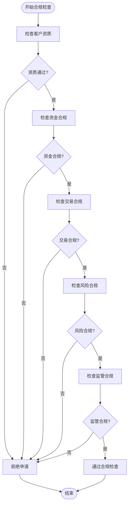

**图表来源**
- [WarehouseAudit.tsx:274-288](file://src/app/pages/WarehouseAudit.tsx#L274-L288)

### 审计追踪功能

系统实现了完整的审计追踪功能，确保所有操作都有据可查：

#### 审计日志结构

| 日志类型 | 记录内容 | 时间戳 | 操作员 | IP地址 |
|----------|----------|--------|--------|--------|
| 申请记录 | 客户提交移仓申请 | 申请时间 | 客户 | 客户IP |
| 审核记录 | 审核人员处理申请 | 处理时间 | 审核员 | 审核IP |
| 修改记录 | 申请信息修改 | 修改时间 | 操作员 | 操作IP |
| 状态变更 | 申请状态变化 | 变更时间 | 系统 | 服务器IP |
| 文件记录 | 附件上传下载 | 操作时间 | 操作员 | 操作IP |

#### 审计追踪实现

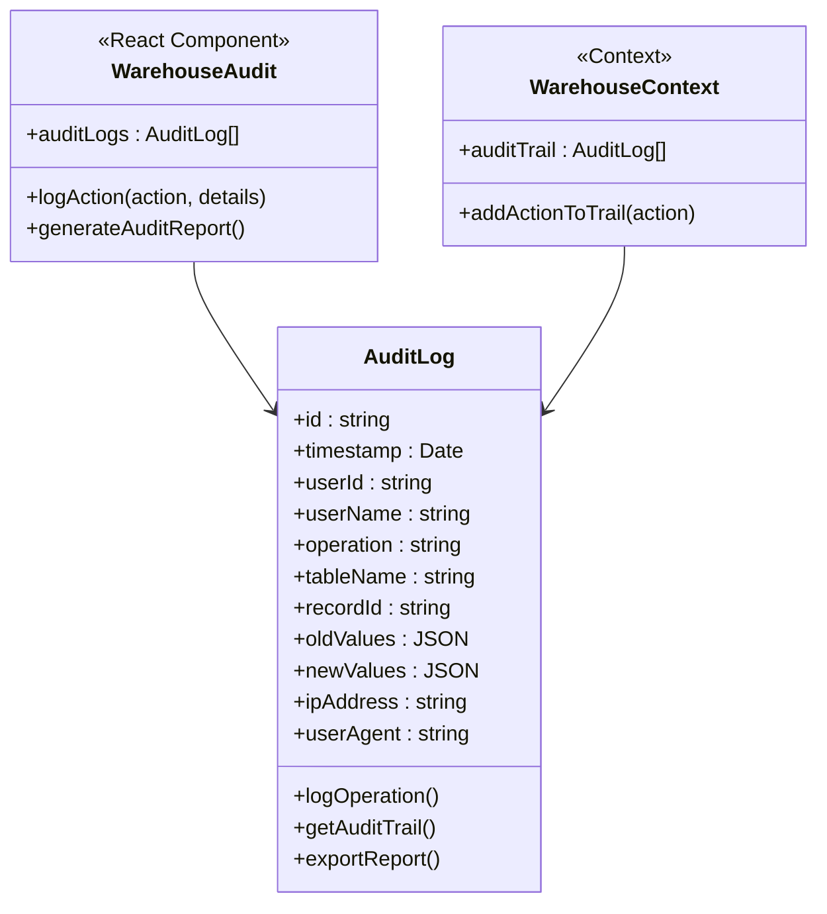

**图表来源**
- [WarehouseAudit.tsx:512-545](file://src/app/pages/WarehouseAudit.tsx#L512-L545)
- [WarehouseContext.tsx:144-177](file://src/app/store/WarehouseContext.tsx#L144-L177)

**章节来源**
- [WarehouseAudit.tsx:512-545](file://src/app/pages/WarehouseAudit.tsx#L512-L545)
- [WarehouseContext.tsx:144-177](file://src/app/store/WarehouseContext.tsx#L144-L177)

## 依赖分析

### 组件依赖关系

移仓业务申请模块的组件之间存在复杂的依赖关系，这些关系确保了系统的协调运行：

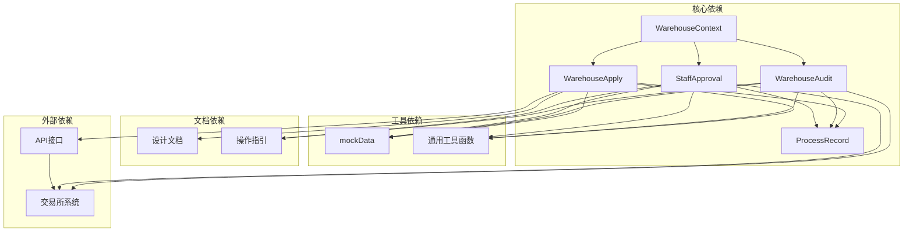

**图表来源**
- [WarehouseContext.tsx:1-185](file://src/app/store/WarehouseContext.tsx#L1-L185)
- [WarehouseApply.tsx:1-909](file://src/app/pages/WarehouseApply.tsx#L1-L909)
- [WarehouseAudit.tsx:1-883](file://src/app/pages/WarehouseAudit.tsx#L1-L883)

### 数据依赖分析

系统采用集中式状态管理模式，所有组件共享WarehouseContext中的状态：

| 组件 | 读取状态 | 写入状态 | 依赖关系 |
|------|----------|----------|----------|
| WarehouseApply | ✓ | ✓ | WarehouseContext |
| WarehouseAudit | ✓ | ✗ | WarehouseContext |
| StaffApproval | ✓ | ✗ | WarehouseContext |
| ProcessRecord | ✓ | ✗ | WarehouseContext |
| SubmitForm | ✓ | ✗ | AppContext |

### 外部依赖

系统对外部系统的依赖主要包括：

- **期货交易所系统**：用于验证合约信息和处理移仓申请
- **监管系统**：用于合规性检查和风险评估
- **银行系统**：用于资金相关操作
- **文件存储系统**：用于附件管理

**章节来源**
- [WarehouseContext.tsx:144-177](file://src/app/store/WarehouseContext.tsx#L144-L177)
- [WarehouseApply.tsx:1-909](file://src/app/pages/WarehouseApply.tsx#L1-L909)

## 性能考虑

### 前端性能优化

系统采用了多项前端性能优化策略：

1. **懒加载组件**：使用React.lazy和Suspense实现组件懒加载
2. **虚拟滚动**：对于大量数据的列表使用虚拟滚动技术
3. **防抖处理**：对高频操作（如搜索、输入）使用防抖优化
4. **缓存策略**：合理使用localStorage和sessionStorage缓存静态数据

### 状态管理优化

WarehouseContext采用了高效的更新策略：

- **局部状态更新**：只更新受影响的状态片段
- **批量更新**：合并多个状态更新操作
- **记忆化计算**：使用useMemo和useCallback避免不必要的重渲染

### API调用优化

系统实现了智能的API调用策略：

- **请求去重**：避免重复的相同请求
- **缓存策略**：对频繁访问的数据进行缓存
- **错误重试**：实现智能的错误重试机制

## 故障排除指南

### 常见问题诊断

#### 移仓申请失败

**问题现象**：移仓申请提交后立即失败

**可能原因**：
1. 资金不足或可用资金为负
2. 交易编码状态异常
3. 合规性检查未通过
4. 交易所规则不满足

**解决步骤**：
1. 检查账户可用资金是否充足
2. 验证交易编码状态是否正常
3. 确认合规性检查结果
4. 查看交易所规则限制

#### 实控关系验证失败

**问题现象**：实控账号验证无法通过

**可能原因**：
1. 账号不存在
2. 无权限查看该账号信息
3. 实控关系未生效

**解决步骤**：
1. 确认实控账号输入正确
2. 检查用户权限设置
3. 验证实控关系确认流程

#### 附件上传失败

**问题现象**：附件上传过程中断或失败

**可能原因**：
1. 文件格式不支持
2. 文件大小超出限制
3. 网络连接不稳定
4. 服务器存储空间不足

**解决步骤**：
1. 检查文件格式和大小
2. 确认网络连接稳定
3. 清理服务器存储空间
4. 重新尝试上传

### 调试工具

系统提供了多种调试工具帮助开发者定位问题：

1. **浏览器开发者工具**：检查网络请求和JavaScript错误
2. **React DevTools**：分析组件状态和性能
3. **日志系统**：查看详细的系统日志
4. **状态检查器**：监控WarehouseContext状态变化

**章节来源**
- [WarehouseApply.tsx:198-219](file://src/app/pages/WarehouseApply.tsx#L198-L219)
- [WarehouseAudit.tsx:195-212](file://src/app/pages/WarehouseAudit.tsx#L195-L212)

## 结论

移仓业务申请模块是一个功能完整、架构清晰、易于维护的业务系统。该模块成功地将复杂的移仓业务流程抽象为简洁易用的用户界面，同时保持了强大的后台处理能力和严格的风险控制机制。

### 主要优势

1. **用户体验优秀**：直观的界面设计和流畅的操作体验
2. **功能覆盖全面**：涵盖移仓业务的所有关键环节
3. **风险控制严格**：多层次的风险评估和合规检查
4. **扩展性强**：模块化设计便于功能扩展和维护
5. **性能优化良好**：采用多种前端性能优化策略

### 技术亮点

1. **状态管理**：采用集中式状态管理，确保数据一致性
2. **组件设计**：模块化组件设计，提高代码复用性
3. **验证机制**：完善的表单验证和错误处理
4. **审计追踪**：完整的操作日志和审计功能
5. **合规保障**：内置合规检查机制

### 改进建议

1. **移动端适配**：进一步优化移动端用户体验
2. **自动化测试**：增加单元测试和集成测试覆盖率
3. **监控告警**：完善系统监控和异常告警机制
4. **文档完善**：补充API文档和开发指南
5. **性能监控**：建立性能指标监控体系

该模块为国泰君安期货的移仓业务提供了强有力的技术支撑，有效提升了业务处理效率和风险控制水平，是现代金融业务系统建设的优秀范例。