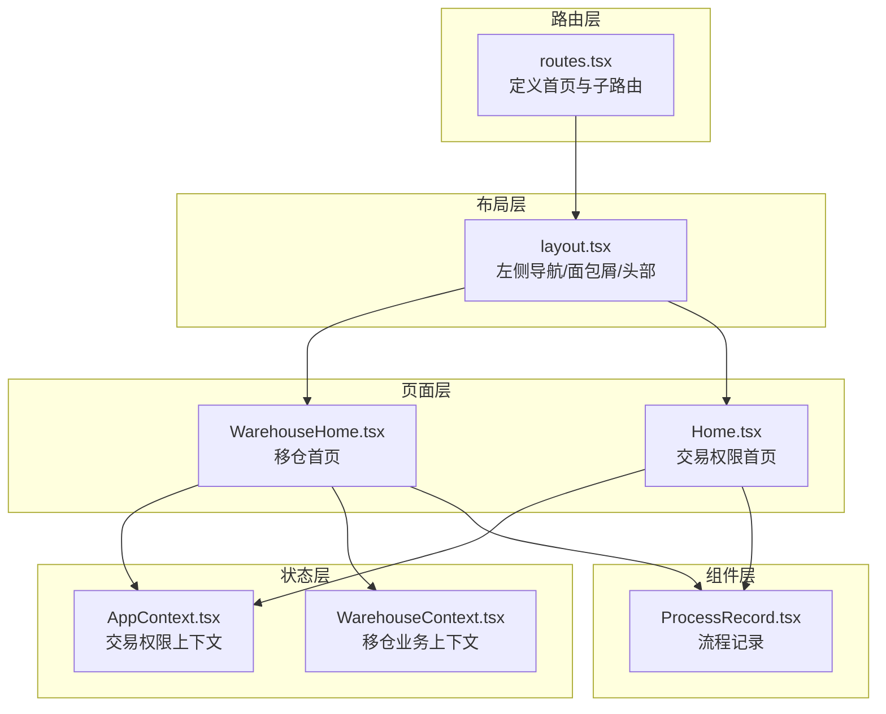
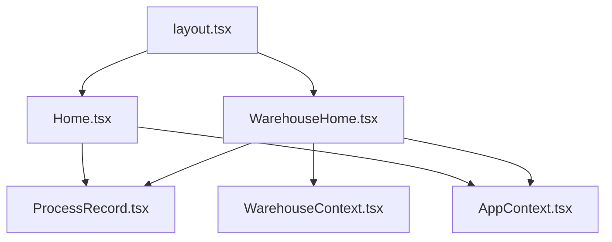
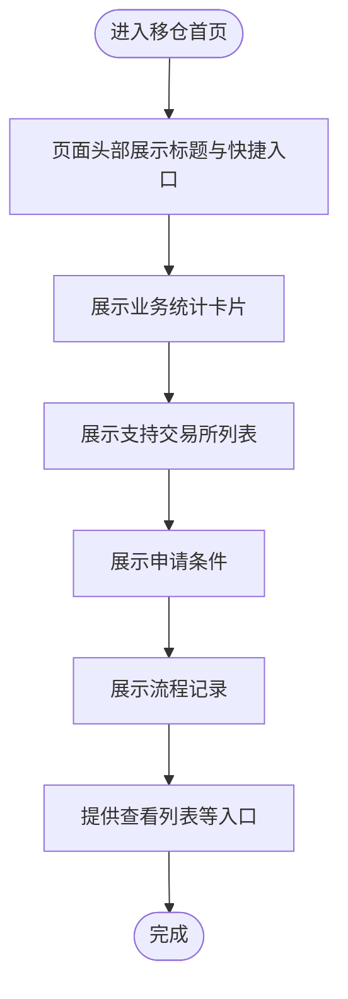
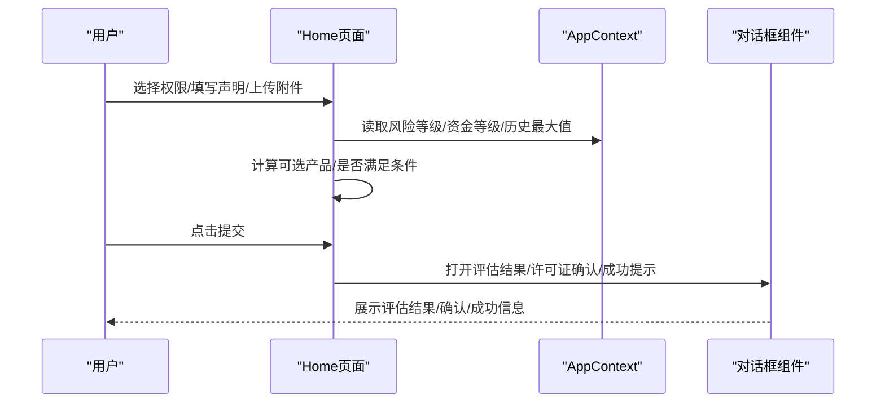
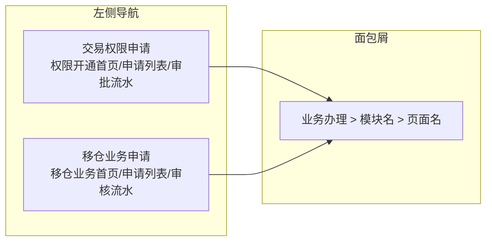
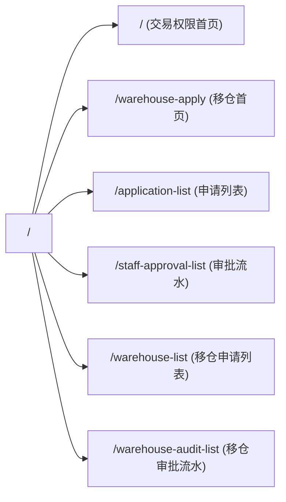
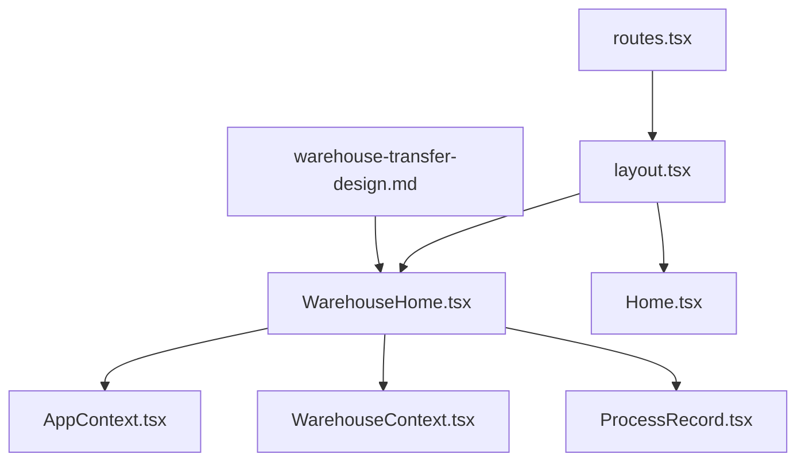

# 移仓业务首页

<cite>
**本文档引用的文件**
- [Home.tsx](file://src/app/pages/Home.tsx)
- [WarehouseHome.tsx](file://src/app/pages/WarehouseHome.tsx)
- [routes.tsx](file://src/app/routes.tsx)
- [layout.tsx](file://src/app/layout.tsx)
- [AppContext.tsx](file://src/app/store/AppContext.tsx)
- [WarehouseContext.tsx](file://src/app/store/WarehouseContext.tsx)
- [ProcessRecord.tsx](file://src/app/components/ProcessRecord.tsx)
- [warehouse-transfer-design.md](file://docs/warehouse-transfer-design.md)
</cite>

## 目录
1. [简介](#简介)
2. [项目结构](#项目结构)
3. [核心组件](#核心组件)
4. [架构总览](#架构总览)
5. [详细组件分析](#详细组件分析)
6. [依赖关系分析](#依赖关系分析)
7. [性能考量](#性能考量)
8. [故障排查指南](#故障排查指南)
9. [结论](#结论)

## 简介
本文件聚焦于“移仓业务首页”的设计与实现，涵盖页面布局、快捷入口、业务统计展示、组件组织结构、数据展示方式以及用户导航设计。通过对首页组件的深入分析，帮助开发者与使用者全面理解页面的功能边界、交互流程与扩展点，并提供用户体验优化与响应式设计建议。

## 项目结构
- 页面入口位于路由配置中，首页作为默认路由展示。
- 首页采用模块化组件设计，通过上下文共享状态，配合通用UI组件与流程记录组件实现统一风格与一致体验。
- 移仓业务首页与交易权限首页共享同一布局与导航体系，便于用户在不同业务模块间切换。

图表来源
- [routes.tsx:18-38](file://src/app/routes.tsx#L18-L38)
- [layout.tsx:74-175](file://src/app/layout.tsx#L74-L175)
- [WarehouseHome.tsx:35-160](file://src/app/pages/WarehouseHome.tsx#L35-L160)
- [Home.tsx:61-809](file://src/app/pages/Home.tsx#L61-L809)
- [AppContext.tsx:31-64](file://src/app/store/AppContext.tsx#L31-L64)
- [WarehouseContext.tsx:77-185](file://src/app/store/WarehouseContext.tsx#L77-L185)
- [ProcessRecord.tsx:4-135](file://src/app/components/ProcessRecord.tsx#L4-L135)

章节来源
- [routes.tsx:18-38](file://src/app/routes.tsx#L18-L38)
- [layout.tsx:74-175](file://src/app/layout.tsx#L74-L175)

## 核心组件
- 移仓首页页面组件：负责展示业务概览、快捷入口、业务统计卡片、支持交易所列表、申请条件说明与流程记录。
- 应用上下文：提供交易权限相关的全局状态（风险等级、资金等级、历史最大值等），用于首页的条件判断与展示。
- 移仓上下文：提供移仓业务的表单字段与状态管理能力，供后续表单页面使用。
- 流程记录组件：根据传入的状态参数渲染不同阶段的流程节点，增强用户对申请进度的感知。

章节来源
- [WarehouseHome.tsx:35-160](file://src/app/pages/WarehouseHome.tsx#L35-L160)
- [AppContext.tsx:31-64](file://src/app/store/AppContext.tsx#L31-L64)
- [WarehouseContext.tsx:77-185](file://src/app/store/WarehouseContext.tsx#L77-L185)
- [ProcessRecord.tsx:4-135](file://src/app/components/ProcessRecord.tsx#L4-L135)

## 架构总览
首页采用“布局-页面-组件-上下文”的分层架构：
- 布局层负责导航与面包屑，确保用户在不同业务模块间无缝切换。
- 页面层承载具体业务内容，如移仓首页的统计卡片与快捷入口。
- 组件层提供可复用的UI与流程展示能力。
- 上下文层提供状态共享，减少props传递，提升可维护性。

图表来源
- [layout.tsx:74-175](file://src/app/layout.tsx#L74-L175)
- [WarehouseHome.tsx:35-160](file://src/app/pages/WarehouseHome.tsx#L35-L160)
- [Home.tsx:61-809](file://src/app/pages/Home.tsx#L61-L809)
- [ProcessRecord.tsx:4-135](file://src/app/components/ProcessRecord.tsx#L4-L135)
- [AppContext.tsx:31-64](file://src/app/store/AppContext.tsx#L31-L64)
- [WarehouseContext.tsx:77-185](file://src/app/store/WarehouseContext.tsx#L77-L185)

## 详细组件分析

### 移仓首页页面组件（WarehouseHome）
- 页面头部：展示标题与副标题，并提供“填写移仓申请表”快捷入口。
- 业务统计卡片：展示“我的移仓申请”、“办理中”、“已完成”等关键指标，直观反映用户当前业务状态。
- 支持交易所区域：列出已开通移仓业务的交易所及其简要说明，帮助用户快速了解可操作范围。
- 申请条件区域：以有序列表形式呈现客户申请移仓的基本条件，提升合规意识。
- 流程记录：根据传入的状态参数渲染流程节点，便于用户追踪申请进度。
- 功能入口：提供“查看我的申请列表”的跳转按钮，引导用户进入更详细的业务列表。

图表来源
- [WarehouseHome.tsx:41-158](file://src/app/pages/WarehouseHome.tsx#L41-L158)

章节来源
- [WarehouseHome.tsx:35-160](file://src/app/pages/WarehouseHome.tsx#L35-L160)

### 交易权限首页页面组件（Home）
- 首页并非“移仓业务首页”，但其页面结构与组件模式可作为移仓首页的参考实现。首页包含：
  - 步骤向导：展示“开始-提交申请-业务办理中-结束”的流程步骤。
  - 基本资料：展示客户名称、资产账号、客户类型、所属分支、适当性等级等信息。
  - 权限申请：按产品维度展示交易所选择，支持全选、自动联动（如原油期权与原油期货的勾选关系）。
  - 业务声明与确认：包括内控制度变更、产品合同变更、受益人承诺、备注等。
  - 附件上传：支持拖拽上传与文件列表展示。
  - 提交按钮：基于必填项与条件判断启用/禁用。
  - 多个弹窗：C3风险提示、部分满足评估结果、许可证确认、成功提示等。
- 首页通过应用上下文共享状态，实现风险等级、资金等级、历史最大值等条件驱动的UI行为。

图表来源
- [Home.tsx:61-809](file://src/app/pages/Home.tsx#L61-L809)
- [AppContext.tsx:31-64](file://src/app/store/AppContext.tsx#L31-L64)

章节来源
- [Home.tsx:61-809](file://src/app/pages/Home.tsx#L61-L809)
- [AppContext.tsx:31-64](file://src/app/store/AppContext.tsx#L31-L64)

### 导航与布局（layout）
- 左侧导航：分为“交易权限申请”和“移仓业务申请”两大模块，每个模块包含若干子菜单项。
- 面包屑：根据当前路径动态显示所在模块与页面名称，提升用户定位感。
- 系统设置：作为跨模块共享的设置入口，便于用户统一配置偏好。
- 配置面板：在首页与提交表单页显示，用于调试与演示目的。

图表来源
- [layout.tsx:21-72](file://src/app/layout.tsx#L21-L72)

章节来源
- [layout.tsx:74-175](file://src/app/layout.tsx#L74-L175)

### 路由配置（routes）
- 首页路由指向“交易权限首页”，移仓业务首页对应“移仓业务首页”路由。
- 子路由覆盖了交易权限与移仓业务的典型页面，便于后续扩展。

图表来源
- [routes.tsx:18-38](file://src/app/routes.tsx#L18-L38)

章节来源
- [routes.tsx:18-38](file://src/app/routes.tsx#L18-L38)

## 依赖关系分析
- 页面到上下文：移仓首页通过应用上下文与移仓上下文获取状态，实现条件驱动的UI与业务逻辑。
- 页面到组件：流程记录组件被多个页面复用，保证流程状态展示的一致性。
- 布局到页面：布局层通过Outlet渲染具体页面，路由层决定加载哪个页面。
- 文档到实现：仓库设计文档明确了业务规则与页面字段，指导页面实现与扩展。

图表来源
- [WarehouseHome.tsx:35-160](file://src/app/pages/WarehouseHome.tsx#L35-L160)
- [AppContext.tsx:31-64](file://src/app/store/AppContext.tsx#L31-L64)
- [WarehouseContext.tsx:77-185](file://src/app/store/WarehouseContext.tsx#L77-L185)
- [ProcessRecord.tsx:4-135](file://src/app/components/ProcessRecord.tsx#L4-L135)
- [layout.tsx:74-175](file://src/app/layout.tsx#L74-L175)
- [routes.tsx:18-38](file://src/app/routes.tsx#L18-L38)
- [warehouse-transfer-design.md:1-105](file://docs/warehouse-transfer-design.md#L1-L105)

章节来源
- [WarehouseHome.tsx:35-160](file://src/app/pages/WarehouseHome.tsx#L35-L160)
- [AppContext.tsx:31-64](file://src/app/store/AppContext.tsx#L31-L64)
- [WarehouseContext.tsx:77-185](file://src/app/store/WarehouseContext.tsx#L77-L185)
- [ProcessRecord.tsx:4-135](file://src/app/components/ProcessRecord.tsx#L4-L135)
- [layout.tsx:74-175](file://src/app/layout.tsx#L74-L175)
- [routes.tsx:18-38](file://src/app/routes.tsx#L18-L38)
- [warehouse-transfer-design.md:1-105](file://docs/warehouse-transfer-design.md#L1-L105)

## 性能考量
- 组件拆分：页面与组件分离，利于按需加载与懒加载，减少首屏负担。
- 状态集中：通过上下文集中管理状态，避免深层props传递带来的重渲染问题。
- 列表渲染：统计卡片与交易所列表采用网格布局，响应式适配良好，适合移动端展示。
- 图标与样式：使用轻量级图标库与CSS类名，降低资源体积。

## 故障排查指南
- 首页空白或导航异常
  - 检查路由配置是否正确映射到页面组件。
  - 确认布局组件包裹了AppProvider与WarehouseProvider。
- 统计卡片数值不正确
  - 检查业务数据来源与计算逻辑，确认数据绑定是否正确。
- 申请条件判断异常
  - 核对AppContext中的风险等级、资金等级与历史最大值是否正确传入。
- 流程记录不显示
  - 确认传入的状态参数与ProcessRecord组件的分支逻辑匹配。

章节来源
- [routes.tsx:18-38](file://src/app/routes.tsx#L18-L38)
- [layout.tsx:81-172](file://src/app/layout.tsx#L81-L172)
- [ProcessRecord.tsx:4-135](file://src/app/components/ProcessRecord.tsx#L4-L135)

## 结论
移仓业务首页通过清晰的布局、直观的统计卡片、明确的快捷入口与流程记录，有效提升了用户的业务操作效率与透明度。页面与组件、上下文的解耦设计，使得功能扩展与维护更加便捷。建议在后续迭代中持续关注响应式适配与无障碍访问，进一步优化用户体验。