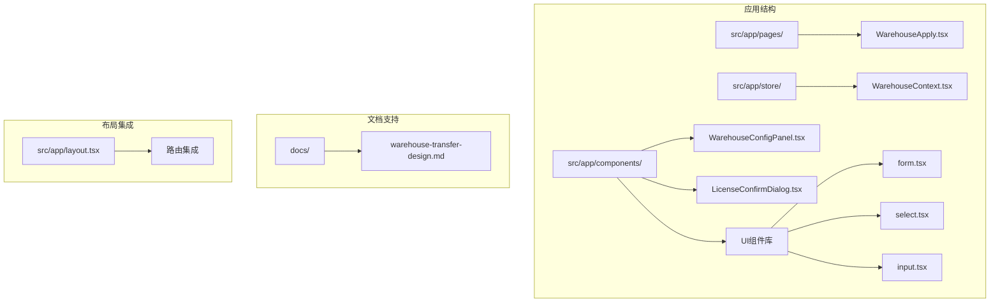
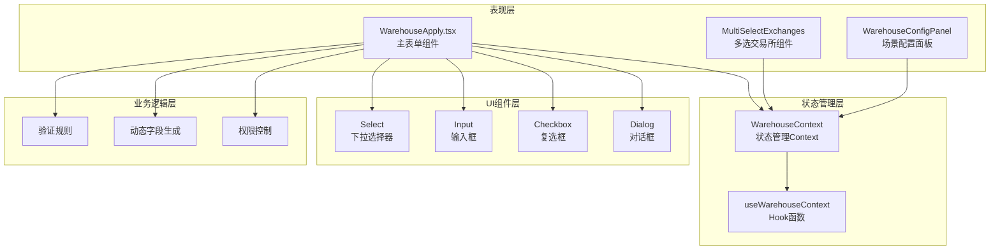
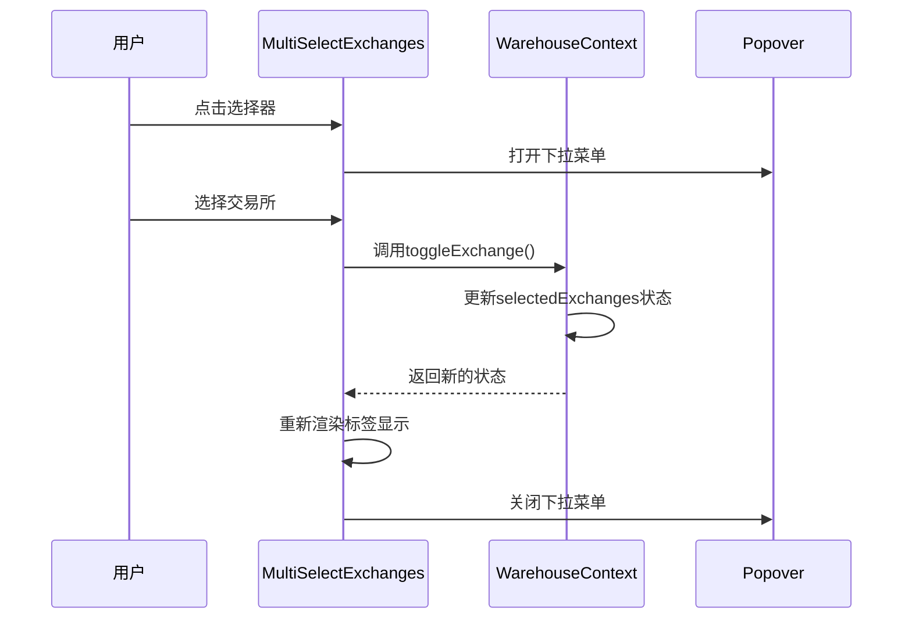
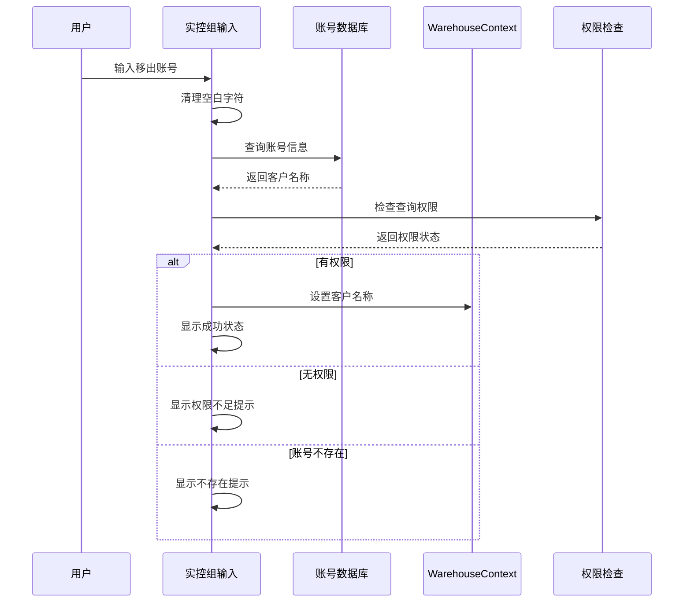
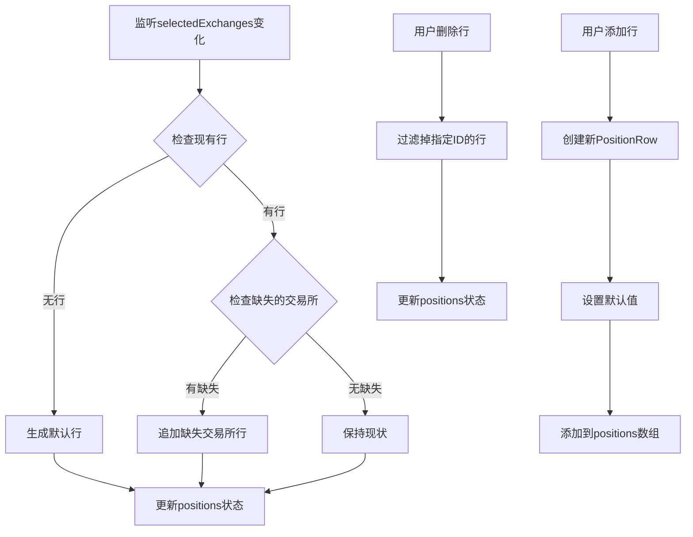
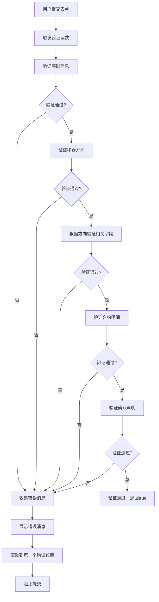
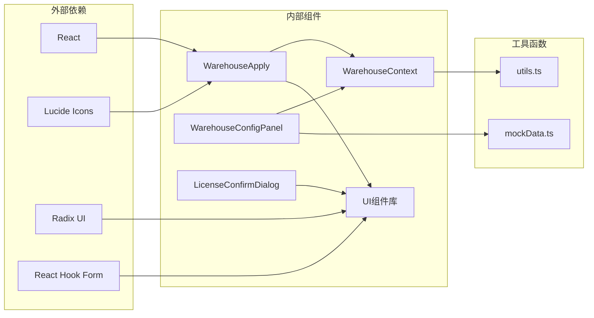

# 移仓申请表单设计

<cite>
**本文档引用的文件**
- [WarehouseApply.tsx](file://src/app/pages/WarehouseApply.tsx)
- [WarehouseContext.tsx](file://src/app/store/WarehouseContext.tsx)
- [WarehouseConfigPanel.tsx](file://src/app/components/WarehouseConfigPanel.tsx)
- [LicenseConfirmDialog.tsx](file://src/app/components/LicenseConfirmDialog.tsx)
- [form.tsx](file://src/app/components/ui/form.tsx)
- [select.tsx](file://src/app/components/ui/select.tsx)
- [input.tsx](file://src/app/components/ui/input.tsx)
- [layout.tsx](file://src/app/layout.tsx)
- [warehouse-transfer-design.md](file://docs/warehouse-transfer-design.md)
</cite>

## 目录
1. [简介](#简介)
2. [项目结构](#项目结构)
3. [核心组件](#核心组件)
4. [架构概览](#架构概览)
5. [详细组件分析](#详细组件分析)
6. [依赖关系分析](#依赖关系分析)
7. [性能考虑](#性能考虑)
8. [故障排除指南](#故障排除指南)
9. [结论](#结论)

## 简介

本文档详细阐述了国泰君安期货交易所移仓业务申请表单的设计与实现。该表单支持三种移仓方向：移出我司、移入我司和实控组移仓，并针对不同交易所（大连商品交易所、郑州商品交易所、上海期货交易所）提供了差异化配置。表单采用现代化的React Hooks模式，结合Context状态管理和自定义UI组件，实现了高度动态化的用户体验。

## 项目结构

移仓申请表单位于应用的主目录结构中，采用模块化设计：



**图表来源**
- [WarehouseApply.tsx:1-50](file://src/app/pages/WarehouseApply.tsx#L1-L50)
- [WarehouseContext.tsx:1-50](file://src/app/store/WarehouseContext.tsx#L1-L50)
- [WarehouseConfigPanel.tsx:1-50](file://src/app/components/WarehouseConfigPanel.tsx#L1-L50)

**章节来源**
- [WarehouseApply.tsx:1-100](file://src/app/pages/WarehouseApply.tsx#L1-L100)
- [layout.tsx:74-175](file://src/app/layout.tsx#L74-L175)

## 核心组件

### 表单状态管理

表单采用集中式状态管理，通过自定义Context提供完整的状态控制：

```mermaid
classDiagram
class WarehouseState {
+string account
+string customerName
+string branch
+string customerType
+WarehouseExchange[] selectedExchanges
+WarehouseDirection direction
+ContractType contractType
+string transferDate
+string outBrokerMemberId
+string outBrokerName
+string inBrokerMemberId
+string inBrokerName
+Record~WarehouseExchange,string~ outClientTradingCodes
+Record~WarehouseExchange,string~ outClientNames
+Record~WarehouseExchange,string~ inClientTradingCodes
+string inClientName
+string actualControlOutAccount
+string actualControlOutName
+string actualControlInAccount
+string actualControlInName
+Record~string,boolean~ accountPermissions
+string dceTransferByQuantity
+string transferReason
+PositionRow[] positions
+{name,size}[] attachments
+boolean confirmed
+string remark
+reset() void
}
class PositionRow {
+string id
+string exchange
+string varietyName
+string contractCode
+string positionDirection
+string hedgeType
+number lots
+number transferFunds
+string remark
}
class WarehouseContext {
+useWarehouseContext() WarehouseState
+WarehouseProvider(props) ReactElement
}
WarehouseContext --> WarehouseState : "管理"
WarehouseState --> PositionRow : "包含"
```

**图表来源**
- [WarehouseContext.tsx:7-73](file://src/app/store/WarehouseContext.tsx#L7-L73)
- [WarehouseContext.tsx:144-178](file://src/app/store/WarehouseContext.tsx#L144-L178)

### 表单字段设计

表单采用响应式网格布局，支持移动端和桌面端的自适应显示。主要字段区域包括：

1. **基础信息区**：只读显示客户基本信息
2. **移仓基本信息区**：交易所选择、移仓方向、相关方信息
3. **合约明细区**：动态生成的合约行项目
4. **补充信息区**：附件上传和备注说明
5. **业务提示区**：可折叠的业务规则说明
6. **确认声明区**：合规性确认

**章节来源**
- [WarehouseApply.tsx:401-909](file://src/app/pages/WarehouseApply.tsx#L401-L909)

## 架构概览

表单采用分层架构设计，确保关注点分离和代码可维护性：



**图表来源**
- [WarehouseApply.tsx:185-909](file://src/app/pages/WarehouseApply.tsx#L185-L909)
- [WarehouseContext.tsx:75-185](file://src/app/store/WarehouseContext.tsx#L75-L185)

## 详细组件分析

### 交易所选择器组件

MultiSelectExchanges组件实现了高级的多选功能，支持全选、取消全选和单个选择：



**图表来源**
- [WarehouseApply.tsx:86-166](file://src/app/pages/WarehouseApply.tsx#L86-L166)
- [WarehouseApply.tsx:169-183](file://src/app/pages/WarehouseApply.tsx#L169-L183)

组件特性：
- 支持全选/取消全选功能
- 实时显示已选择的交易所标签
- 动态宽度适配
- 键盘导航支持

**章节来源**
- [WarehouseApply.tsx:86-183](file://src/app/pages/WarehouseApply.tsx#L86-L183)

### 移仓方向选择器

方向选择器根据交易所选择动态显示可用选项：

```mermaid
flowchart TD
A[用户选择移仓方向] --> B{检查交易所选择}
B --> |DCE或SHFE| C[显示实控组选项]
B --> |其他组合| D[隐藏实控组选项]
C --> E[更新Select内容]
D --> E
E --> F[重新渲染界面]
G[实控组条件检查] --> H{selectedExchanges长度==1}
H --> |是| I{包含DCE或SHFE}|
H --> |否| J[清除方向选择]
I --> |是| K[允许选择实控组]
I --> |否| J
```

**图表来源**
- [WarehouseApply.tsx:426-448](file://src/app/pages/WarehouseApply.tsx#L426-L448)
- [WarehouseApply.tsx:393-397](file://src/app/pages/WarehouseApply.tsx#L393-L397)

**章节来源**
- [WarehouseApply.tsx:426-448](file://src/app/pages/WarehouseApply.tsx#L426-L448)

### 实控组账号输入组件

实控组账号输入实现了智能的账号查询和权限控制功能：



**图表来源**
- [WarehouseApply.tsx:198-219](file://src/app/pages/WarehouseApply.tsx#L198-L219)

**章节来源**
- [WarehouseApply.tsx:198-219](file://src/app/pages/WarehouseApply.tsx#L198-L219)

### 动态字段生成机制

表单根据交易所选择动态生成合约明细行：



**图表来源**
- [WarehouseApply.tsx:233-278](file://src/app/pages/WarehouseApply.tsx#L233-L278)
- [WarehouseApply.tsx:280-306](file://src/app/pages/WarehouseApply.tsx#L280-L306)

**章节来源**
- [WarehouseApply.tsx:233-306](file://src/app/pages/WarehouseApply.tsx#L233-L306)

### 数据验证规则

表单实现了多层次的验证机制：



**图表来源**
- [WarehouseApply.tsx:319-378](file://src/app/pages/WarehouseApply.tsx#L319-L378)

验证规则包括：
- **必填字段验证**：交易所、移仓方向、相关方信息
- **条件验证**：根据移仓方向显示不同的验证规则
- **业务规则验证**：针对不同交易所的特殊要求
- **数据格式验证**：手数必须大于0等

**章节来源**
- [WarehouseApply.tsx:319-378](file://src/app/pages/WarehouseApply.tsx#L319-L378)

### 用户体验设计

表单采用了多项用户体验优化策略：

1. **渐进式披露**：根据用户选择逐步显示相关信息
2. **实时反馈**：输入时即时显示状态和错误信息
3. **无障碍设计**：完整的键盘导航和屏幕阅读器支持
4. **响应式布局**：适配各种设备尺寸
5. **加载状态**：异步操作时的视觉反馈

## 依赖关系分析

表单组件之间的依赖关系如下：



**图表来源**
- [WarehouseApply.tsx:1-30](file://src/app/pages/WarehouseApply.tsx#L1-L30)
- [WarehouseContext.tsx:1-5](file://src/app/store/WarehouseContext.tsx#L1-L5)

**章节来源**
- [WarehouseApply.tsx:1-30](file://src/app/pages/WarehouseApply.tsx#L1-L30)
- [WarehouseContext.tsx:1-5](file://src/app/store/WarehouseContext.tsx#L1-L5)

## 性能考虑

### 状态优化

1. **状态分割**：将大型状态对象分解为独立的状态片段
2. **记忆化**：使用useMemo避免不必要的重渲染
3. **批量更新**：使用批量状态更新减少重渲染次数

### 渲染优化

1. **虚拟滚动**：对于大量合约行可以考虑虚拟滚动
2. **懒加载**：对话框和面板采用懒加载
3. **防抖处理**：输入验证采用防抖机制

### 内存管理

1. **清理机制**：及时清理事件监听器和定时器
2. **引用优化**：使用useCallback优化回调函数引用
3. **垃圾回收**：合理管理临时对象的生命周期

## 故障排除指南

### 常见问题及解决方案

1. **表单无法提交**
   - 检查是否有未解决的验证错误
   - 确认所有必填字段都已正确填写
   - 验证交易所选择是否符合实控组条件

2. **实控组账号查询失败**
   - 确认账号存在于数据库中
   - 检查用户权限设置
   - 验证账号格式是否正确

3. **动态字段不显示**
   - 检查交易所选择状态
   - 确认相关方信息是否完整
   - 验证业务规则条件

4. **附件上传问题**
   - 检查文件格式和大小限制
   - 确认网络连接稳定
   - 验证浏览器兼容性

**章节来源**
- [WarehouseApply.tsx:382-390](file://src/app/pages/WarehouseApply.tsx#L382-L390)

### 调试技巧

1. **开发者工具**：使用React DevTools检查组件树
2. **状态检查**：通过浏览器控制台检查状态变化
3. **网络监控**：监控API调用和响应时间
4. **性能分析**：使用Performance面板分析渲染性能

## 结论

移仓申请表单设计体现了现代前端开发的最佳实践，通过合理的架构设计、完善的验证机制和优秀的用户体验，为用户提供了高效、可靠的移仓业务申请流程。表单不仅满足了业务需求，还为未来的扩展和维护奠定了坚实的基础。

该设计的关键优势包括：
- **模块化架构**：清晰的组件分离和职责划分
- **状态管理**：集中式的Context管理确保状态一致性
- **动态UI**：根据业务规则动态生成界面元素
- **用户体验**：直观的操作流程和及时的反馈机制
- **可维护性**：良好的代码组织和文档支持

通过持续的优化和改进，该表单系统能够适应不断变化的业务需求，为用户提供更加优质的移仓服务体验。