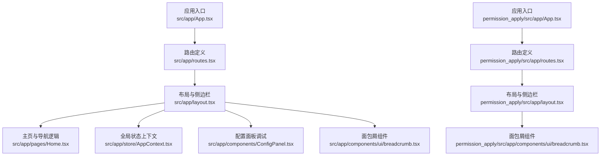
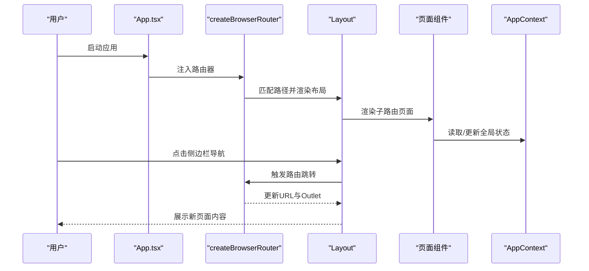
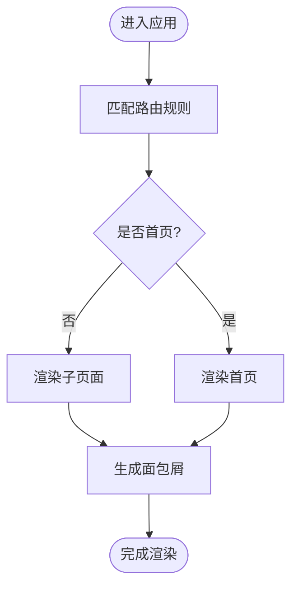
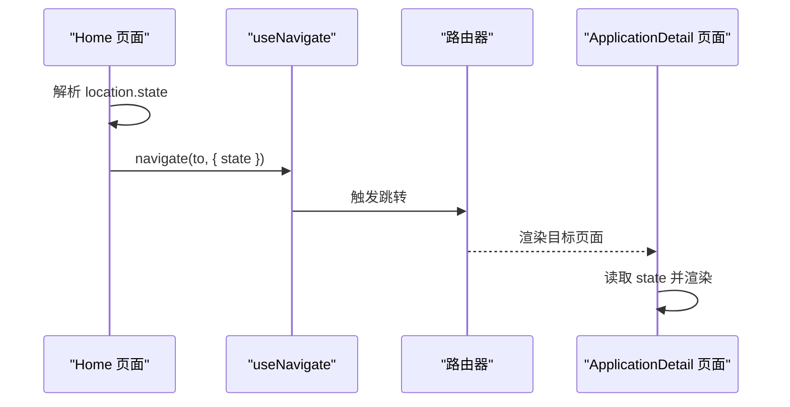
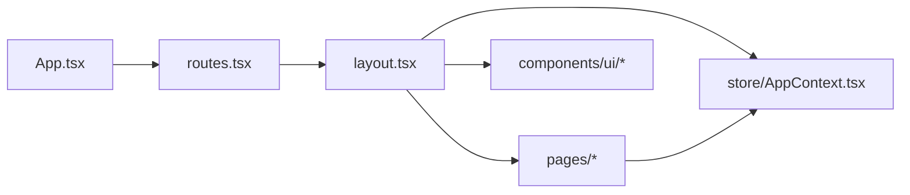

# 导航模式和最佳实践

<cite>
**本文引用的文件**
- [src/app/routes.tsx](file://src/app/routes.tsx)
- [permission_apply/src/app/routes.tsx](file://permission_apply/src/app/routes.tsx)
- [src/app/App.tsx](file://src/app/App.tsx)
- [permission_apply/src/app/App.tsx](file://permission_apply/src/app/App.tsx)
- [src/app/layout.tsx](file://src/app/layout.tsx)
- [src/app/pages/Home.tsx](file://src/app/pages/Home.tsx)
- [src/app/store/AppContext.tsx](file://src/app/store/AppContext.tsx)
- [src/app/components/ConfigPanel.tsx](file://src/app/components/ConfigPanel.tsx)
- [src/app/components/ui/breadcrumb.tsx](file://src/app/components/ui/breadcrumb.tsx)
- [permission_apply/src/app/components/ui/breadcrumb.tsx](file://permission_apply/src/app/components/ui/breadcrumb.tsx)
- [deploy/nginx-server.conf](file://deploy/nginx-server.conf)
- [package.json](file://package.json)
- [vite.config.ts](file://vite.config.ts)
</cite>

## 目录
1. [引言](#引言)
2. [项目结构](#项目结构)
3. [核心组件](#核心组件)
4. [架构总览](#架构总览)
5. [详细组件分析](#详细组件分析)
6. [依赖关系分析](#依赖关系分析)
7. [性能考虑](#性能考虑)
8. [故障排除指南](#故障排除指南)
9. [结论](#结论)
10. [附录](#附录)

## 引言
本指南围绕单页应用（SPA）中的导航模式与设计实践展开，结合仓库中的实际实现，系统阐述以下主题：
- 路由定义与嵌套路由组织
- 路由参数传递与状态传递
- 查询字符串处理建议
- URL 状态管理策略
- 导航性能优化、缓存与预加载
- 用户体验设计原则与可达性标准
- SEO 优化方案
- 常见导航场景的解决方案与故障排除

## 项目结构
该项目采用基于功能模块的分层组织方式，主应用与“权限申请”子应用共享路由与布局结构，通过独立的路由配置与页面组件实现模块化导航。

图表来源
- [src/app/App.tsx:1-6](file://src/app/App.tsx#L1-L6)
- [src/app/routes.tsx:1-38](file://src/app/routes.tsx#L1-L38)
- [permission_apply/src/app/App.tsx:1-6](file://permission_apply/src/app/App.tsx#L1-L6)
- [permission_apply/src/app/routes.tsx:1-27](file://permission_apply/src/app/routes.tsx#L1-L27)
- [src/app/layout.tsx:1-175](file://src/app/layout.tsx#L1-L175)
- [src/app/pages/Home.tsx:1-809](file://src/app/pages/Home.tsx#L1-L809)
- [src/app/store/AppContext.tsx:1-64](file://src/app/store/AppContext.tsx#L1-L64)
- [src/app/components/ConfigPanel.tsx:1-134](file://src/app/components/ConfigPanel.tsx#L1-L134)
- [src/app/components/ui/breadcrumb.tsx:1-109](file://src/app/components/ui/breadcrumb.tsx#L1-L109)
- [permission_apply/src/app/components/ui/breadcrumb.tsx:1-109](file://permission_apply/src/app/components/ui/breadcrumb.tsx#L1-L109)

章节来源
- [src/app/routes.tsx:1-38](file://src/app/routes.tsx#L1-L38)
- [permission_apply/src/app/routes.tsx:1-27](file://permission_apply/src/app/routes.tsx#L1-L27)
- [src/app/App.tsx:1-6](file://src/app/App.tsx#L1-L6)
- [permission_apply/src/app/App.tsx:1-6](file://permission_apply/src/app/App.tsx#L1-L6)

## 核心组件
- 路由器与路由配置：使用浏览器路由器集中定义路径与子路由，支持首页索引与通配符重定向。
- 布局与导航：统一的侧边栏导航、面包屑与顶部标题，根据当前路径高亮与生成页面标签。
- 页面与状态：主页负责权限选择、文件上传与状态流转；全局上下文提供风险等级、资金规模等状态。
- 配置面板：用于调试时快速切换用户状态，影响页面渲染与交互。

章节来源
- [src/app/routes.tsx:18-38](file://src/app/routes.tsx#L18-L38)
- [src/app/layout.tsx:74-175](file://src/app/layout.tsx#L74-L175)
- [src/app/pages/Home.tsx:61-809](file://src/app/pages/Home.tsx#L61-L809)
- [src/app/store/AppContext.tsx:6-64](file://src/app/store/AppContext.tsx#L6-L64)
- [src/app/components/ConfigPanel.tsx:6-134](file://src/app/components/ConfigPanel.tsx#L6-L134)

## 架构总览
下图展示从应用入口到路由、布局与页面的数据流与交互关系。

图表来源
- [src/app/App.tsx:1-6](file://src/app/App.tsx#L1-L6)
- [src/app/routes.tsx:18-38](file://src/app/routes.tsx#L18-L38)
- [src/app/layout.tsx:74-175](file://src/app/layout.tsx#L74-L175)
- [src/app/store/AppContext.tsx:31-64](file://src/app/store/AppContext.tsx#L31-L64)

## 详细组件分析

### 路由与导航模式
- 嵌套路由与索引页：根路径下定义子路由，首页作为索引路由，通配符重定向兜底。
- 侧边栏导航：根据当前路径高亮，支持多模块导航组与系统设置入口。
- 面包屑：根据路径映射生成分组与页面标签，提升上下文感知。

图表来源
- [src/app/routes.tsx:18-38](file://src/app/routes.tsx#L18-L38)
- [src/app/layout.tsx:41-72](file://src/app/layout.tsx#L41-L72)

章节来源
- [src/app/routes.tsx:18-38](file://src/app/routes.tsx#L18-L38)
- [src/app/layout.tsx:34-72](file://src/app/layout.tsx#L34-L72)

### 路由参数传递与状态传递
- 状态传递：页面间通过 location.state 传递状态（例如审批状态、拒绝原因、交易所ID集合），用于初始化与提示。
- 导航触发：侧边栏与按钮点击调用导航函数，实现页面跳转与状态注入。

图表来源
- [src/app/pages/Home.tsx:61-809](file://src/app/pages/Home.tsx#L61-L809)

章节来源
- [src/app/pages/Home.tsx:61-809](file://src/app/pages/Home.tsx#L61-L809)

### 查询字符串处理建议
- 当前实现未显式使用查询参数，建议在需要筛选、排序或分页时：
  - 使用 URLSearchParams 组织查询串
  - 在页面加载时解析并同步到本地状态
  - 通过导航函数更新查询串而不刷新页面
  - 结合历史 API 的 replaceState/updateURL 保持浏览器前进后退一致

[本节为通用实践建议，不直接分析具体文件]

### URL 状态管理策略
- 建议采用“URL 即状态”的理念：
  - 将可分享的状态（筛选、视图模式、当前项）映射到 URL
  - 使用统一的序列化/反序列化工具维护一致性
  - 对复杂对象使用 JSON 或安全编码存储于查询参数或片段标识符

[本节为通用实践建议，不直接分析具体文件]

### 导航性能优化、缓存与预加载
- 资源缓存与压缩：Nginx 配置启用 gzip 与静态资源缓存头，根路径回退到单页应用入口。
- 构建与别名：Vite 配置包含 SVG/CSS 等资源类型与路径别名，减少打包体积与解析成本。
- 预加载建议：
  - 关键页面的首屏数据可通过骨架屏与懒加载结合
  - 预取下一页所需资源（如图片、脚本）
  - 利用浏览器原生 prefetch/dns-prefetch 提升二次导航速度

章节来源
- [deploy/nginx-server.conf:1-32](file://deploy/nginx-server.conf#L1-L32)
- [vite.config.ts:19-37](file://vite.config.ts#L19-L37)

### 用户体验设计原则与可达性标准
- 可达性：面包屑组件提供导航层级与当前页标识，确保键盘与屏幕阅读器友好。
- 一致性：侧边栏高亮与面包屑联动，避免用户迷失。
- 明确反馈：状态对话框与成功提示增强用户信心。

章节来源
- [src/app/components/ui/breadcrumb.tsx:1-109](file://src/app/components/ui/breadcrumb.tsx#L1-L109)
- [permission_apply/src/app/components/ui/breadcrumb.tsx:1-109](file://permission_apply/src/app/components/ui/breadcrumb.tsx#L1-L109)
- [src/app/layout.tsx:142-160](file://src/app/layout.tsx#L142-L160)

### SEO 优化方案
- 服务端渲染/预渲染：对关键页面进行 SSR 或 SSG，确保搜索引擎可抓取。
- 动态元信息：在页面组件中动态设置 title、description、canonical。
- 结构化数据：为列表与详情页添加 JSON-LD。
- sitemap 与 robots：生成并提交 sitemap，合理配置 robots.txt。

[本节为通用实践建议，不直接分析具体文件]

### 常见导航场景的解决方案
- 从首页跳转到“我发起的申请”列表：通过按钮触发导航，携带必要状态。
- 移仓模块与交易模块的导航区分：侧边栏按模块分组，路径前缀区分业务域。
- 系统设置跨模块共享：统一入口位于侧边栏底部，便于全局访问。

章节来源
- [src/app/pages/Home.tsx:92-94](file://src/app/pages/Home.tsx#L92-L94)
- [src/app/layout.tsx:28-37](file://src/app/layout.tsx#L28-L37)
- [src/app/layout.tsx:118-132](file://src/app/layout.tsx#L118-L132)

## 依赖关系分析
- 应用入口依赖路由器；路由器依赖路由配置；布局依赖上下文与组件；页面依赖上下文与导航钩子。
- 子应用（权限申请）共享相同的路由与布局模式，体现模块化与可扩展性。

图表来源
- [src/app/App.tsx:1-6](file://src/app/App.tsx#L1-L6)
- [src/app/routes.tsx:1-38](file://src/app/routes.tsx#L1-L38)
- [src/app/layout.tsx:1-175](file://src/app/layout.tsx#L1-L175)
- [src/app/store/AppContext.tsx:1-64](file://src/app/store/AppContext.tsx#L1-L64)

章节来源
- [src/app/App.tsx:1-6](file://src/app/App.tsx#L1-L6)
- [src/app/routes.tsx:1-38](file://src/app/routes.tsx#L1-L38)
- [src/app/layout.tsx:1-175](file://src/app/layout.tsx#L1-L175)
- [src/app/store/AppContext.tsx:1-64](file://src/app/store/AppContext.tsx#L1-L64)

## 性能考虑
- 构建优化：Vite 插件链与路径别名减少解析与打包成本。
- 运行时优化：Nginx 缓存与压缩降低带宽与延迟。
- 导航优化：避免不必要的重渲染，利用状态提升与局部更新；对大列表采用虚拟滚动与分页。

章节来源
- [vite.config.ts:19-37](file://vite.config.ts#L19-L37)
- [deploy/nginx-server.conf:9-18](file://deploy/nginx-server.conf#L9-L18)

## 故障排除指南
- 路由无法匹配或出现空白页
  - 检查通配符重定向是否正确指向首页
  - 确认子路由路径与布局嵌套关系
- 导航后状态未生效
  - 确认通过 location.state 传参并在目标页面读取
- 面包屑显示异常
  - 校验路径映射表与页面标签生成逻辑
- 配置面板无效
  - 确认 AppContext Provider 包裹范围覆盖相关组件

章节来源
- [src/app/routes.tsx:35](file://src/app/routes.tsx#L35)
- [src/app/pages/Home.tsx:66-76](file://src/app/pages/Home.tsx#L66-L76)
- [src/app/layout.tsx:41-72](file://src/app/layout.tsx#L41-L72)
- [src/app/store/AppContext.tsx:31-57](file://src/app/store/AppContext.tsx#L31-L57)

## 结论
本项目以 React Router 为核心，结合统一布局与上下文管理，实现了清晰的模块化导航体系。通过状态传递、面包屑与可达性组件，提升了用户体验与可维护性。建议在后续迭代中引入查询参数规范、SEO 元信息与预渲染策略，并持续优化构建与运行时性能，以支撑更复杂的业务场景。

## 附录
- 依赖版本与插件：React Router、Radix UI 组件库、TailwindCSS、Vite 插件链等。

章节来源
- [package.json:11-66](file://package.json#L11-L66)