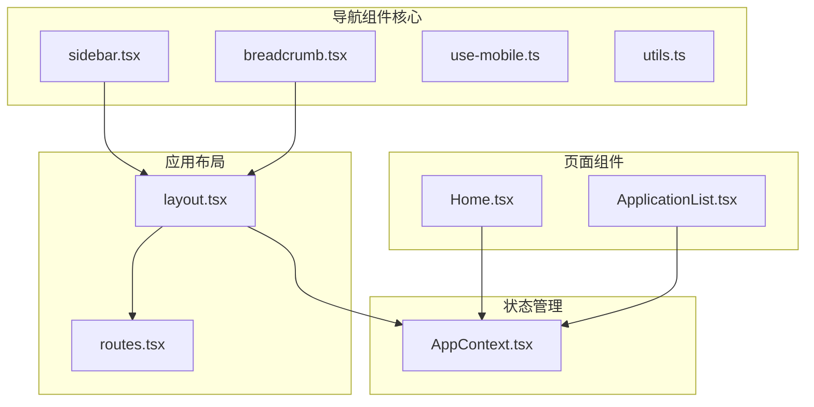
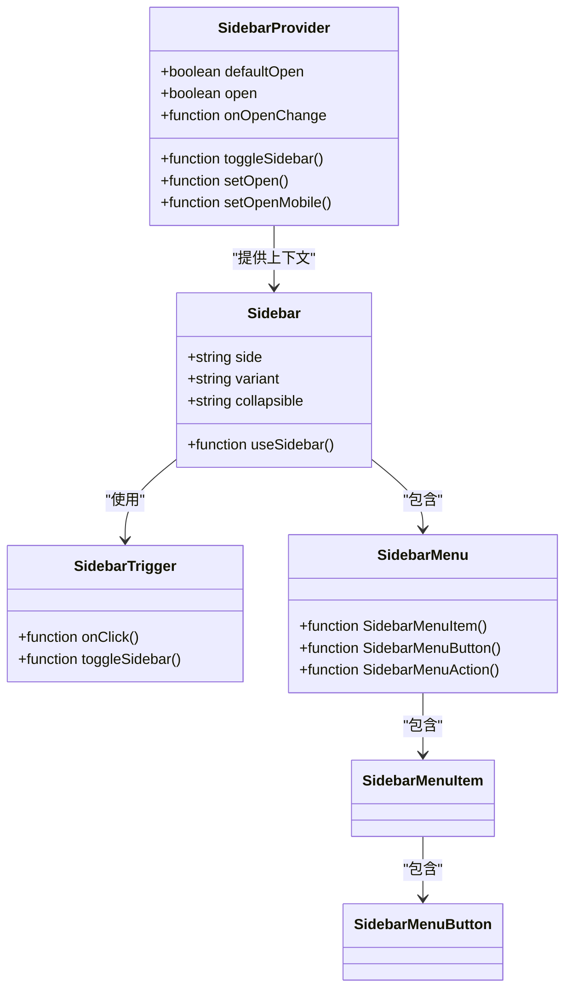
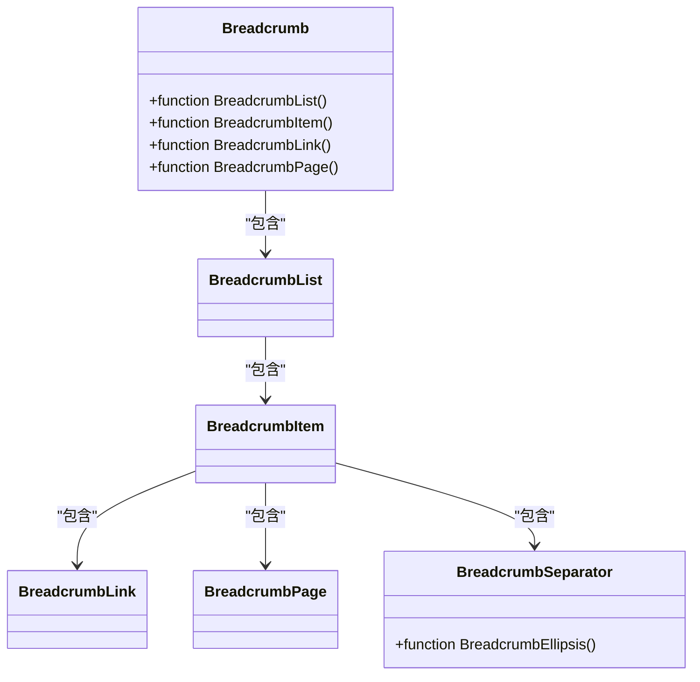
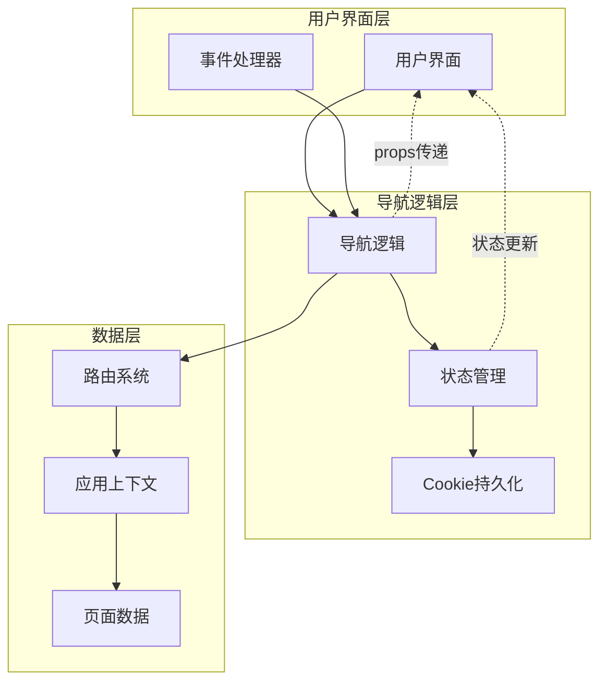
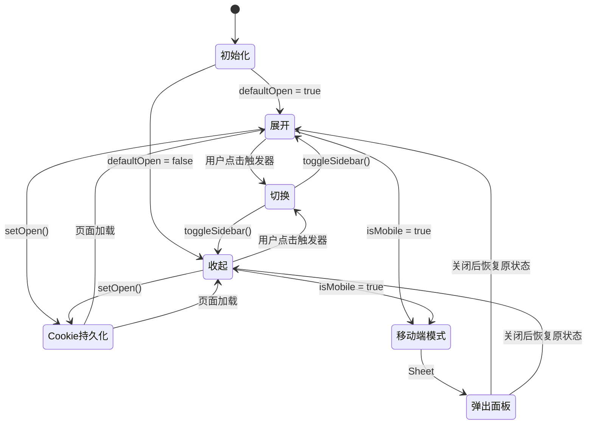
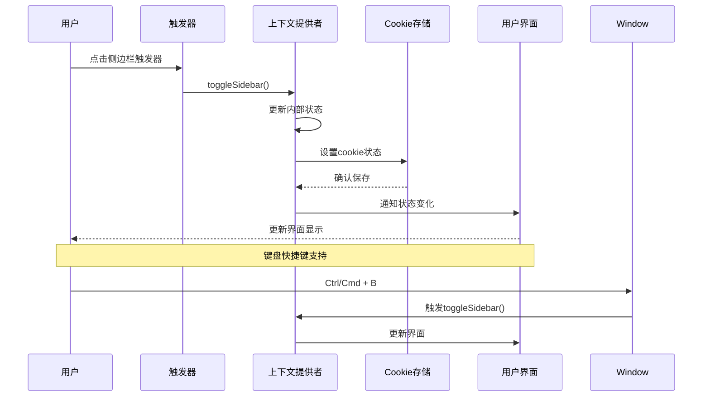
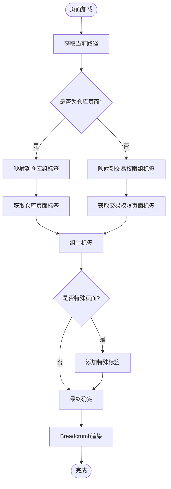
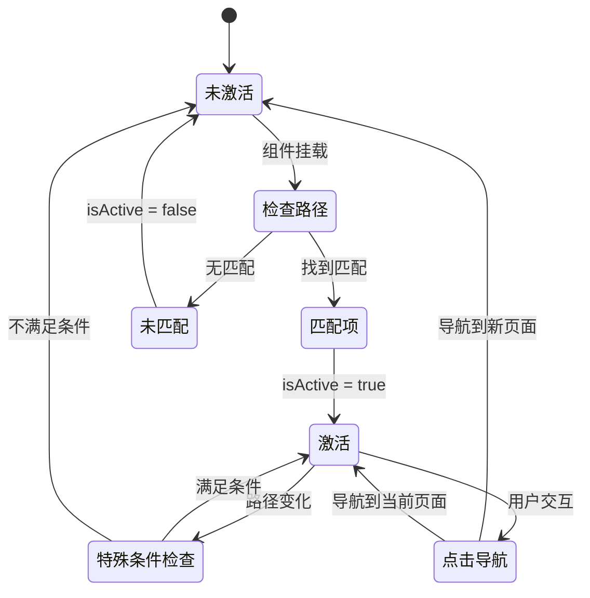
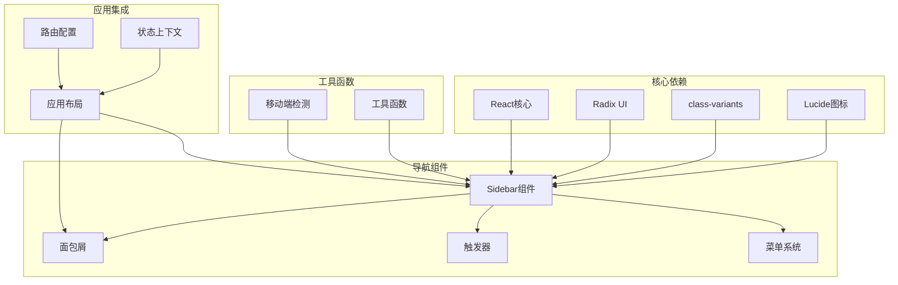
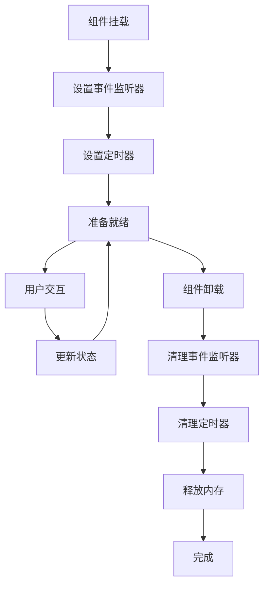

# 导航组件实现

<cite>
**本文档引用的文件**
- [sidebar.tsx](file://src/app/components/ui/sidebar.tsx)
- [breadcrumb.tsx](file://src/app/components/ui/breadcrumb.tsx)
- [layout.tsx](file://src/app/layout.tsx)
- [routes.tsx](file://src/app/routes.tsx)
- [use-mobile.ts](file://src/app/components/ui/use-mobile.ts)
- [utils.ts](file://src/app/components/ui/utils.ts)
- [AppContext.tsx](file://src/app/store/AppContext.tsx)
- [Home.tsx](file://src/app/pages/Home.tsx)
- [ApplicationList.tsx](file://src/app/pages/ApplicationList.tsx)
</cite>

## 目录
1. [引言](#引言)
2. [项目结构](#项目结构)
3. [核心组件](#核心组件)
4. [架构概览](#架构概览)
5. [详细组件分析](#详细组件分析)
6. [依赖关系分析](#依赖关系分析)
7. [性能考虑](#性能考虑)
8. [故障排除指南](#故障排除指南)
9. [结论](#结论)

## 引言

本文档深入分析了该管理平台中的导航组件技术实现，重点涵盖侧边栏组件的交互设计、面包屑导航的动态生成、导航菜单的状态管理。文档详细解释了组件的props接口、事件处理机制、样式定制方案，并提供了无障碍访问支持、键盘导航、触摸设备适配等用户体验优化的最佳实践。

该导航系统采用现代化的React Hooks模式，结合CSS变量和Tailwind CSS类名系统，实现了高度可定制的导航体验。系统支持桌面端和移动端的自适应布局，具备完整的状态管理和持久化功能。

## 项目结构

导航组件位于应用的UI组件层，采用模块化设计，主要文件分布如下：

**图表来源**
- [sidebar.tsx:1-727](file://src/app/components/ui/sidebar.tsx#L1-L727)
- [breadcrumb.tsx:1-110](file://src/app/components/ui/breadcrumb.tsx#L1-L110)
- [layout.tsx:1-175](file://src/app/layout.tsx#L1-L175)

**章节来源**
- [sidebar.tsx:1-727](file://src/app/components/ui/sidebar.tsx#L1-L727)
- [breadcrumb.tsx:1-110](file://src/app/components/ui/breadcrumb.tsx#L1-L110)
- [layout.tsx:1-175](file://src/app/layout.tsx#L1-L175)

## 核心组件

### 侧边栏组件体系

侧边栏组件采用组合模式设计，包含多个专门化的子组件：

**图表来源**
- [sidebar.tsx:56-152](file://src/app/components/ui/sidebar.tsx#L56-L152)
- [sidebar.tsx:154-254](file://src/app/components/ui/sidebar.tsx#L154-L254)

### 面包屑导航系统

面包屑导航采用语义化HTML结构，支持动态内容生成：

**图表来源**
- [breadcrumb.tsx:7-109](file://src/app/components/ui/breadcrumb.tsx#L7-L109)

**章节来源**
- [sidebar.tsx:35-54](file://src/app/components/ui/sidebar.tsx#L35-L54)
- [breadcrumb.tsx:7-109](file://src/app/components/ui/breadcrumb.tsx#L7-L109)

## 架构概览

导航系统的整体架构采用分层设计，确保组件间的松耦合和高内聚：

**图表来源**
- [layout.tsx:74-174](file://src/app/layout.tsx#L74-L174)
- [routes.tsx:18-38](file://src/app/routes.tsx#L18-L38)

## 详细组件分析

### 侧边栏组件深度解析

#### 状态管理系统

侧边栏组件实现了复杂的状态管理机制，包括本地状态、外部控制状态和持久化状态：

**图表来源**
- [sidebar.tsx:56-152](file://src/app/components/ui/sidebar.tsx#L56-L152)

#### 组件属性接口

侧边栏组件提供了丰富的props接口：

| 组件 | 属性 | 类型 | 默认值 | 描述 |
|------|------|------|--------|------|
| SidebarProvider | defaultOpen | boolean | true | 初始展开状态 |
| SidebarProvider | open | boolean | undefined | 受控状态 |
| SidebarProvider | onOpenChange | function | undefined | 状态变化回调 |
| Sidebar | side | 'left'\|'right' | 'left' | 侧边栏位置 |
| Sidebar | variant | 'sidebar'\|'floating'\|'inset' | 'sidebar' | 外观变体 |
| Sidebar | collapsible | 'offcanvas'\|'icon'\|'none' | 'offcanvas' | 折叠行为 |
| SidebarMenuButton | isActive | boolean | false | 激活状态 |
| SidebarMenuButton | variant | 'default'\|'outline' | 'default' | 按钮外观 |
| SidebarMenuButton | size | 'default'\|'sm'\|'lg' | 'default' | 按钮尺寸 |

#### 事件处理机制

侧边栏组件实现了多层次的事件处理：

**图表来源**
- [sidebar.tsx:96-110](file://src/app/components/ui/sidebar.tsx#L96-L110)
- [sidebar.tsx:256-280](file://src/app/components/ui/sidebar.tsx#L256-L280)

**章节来源**
- [sidebar.tsx:56-152](file://src/app/components/ui/sidebar.tsx#L56-L152)
- [sidebar.tsx:256-280](file://src/app/components/ui/sidebar.tsx#L256-L280)

### 面包屑导航动态生成

#### 动态内容映射

面包屑导航系统实现了智能的内容映射机制：

**图表来源**
- [layout.tsx:42-72](file://src/app/layout.tsx#L42-L72)

#### 标签映射规则

系统定义了详细的标签映射规则：

| 路径前缀 | 组标签 | 特殊处理 |
|----------|--------|----------|
| `/` | 交易权限申请 | 首页特殊处理 |
| `/submit-form` | 交易权限申请 | 补充证明材料 |
| `/application-*` | 交易权限申请 | 审批详情 |
| `/staff-*` | 交易权限申请 | 审批流水 |
| `/system-settings` | 交易权限申请 | 系统设置 |
| `/warehouse-*` | 移仓业务申请 | 仓库相关页面 |

**章节来源**
- [layout.tsx:42-72](file://src/app/layout.tsx#L42-L72)

### 导航菜单状态管理

#### 菜单项激活状态

导航菜单实现了智能的激活状态管理：

**图表来源**
- [layout.tsx:94-114](file://src/app/layout.tsx#L94-L114)

**章节来源**
- [layout.tsx:94-114](file://src/app/layout.tsx#L94-L114)

## 依赖关系分析

### 组件间依赖关系

导航组件之间的依赖关系呈现树状结构：

**图表来源**
- [sidebar.tsx:3-26](file://src/app/components/ui/sidebar.tsx#L3-L26)
- [breadcrumb.tsx:1-5](file://src/app/components/ui/breadcrumb.tsx#L1-L5)

### 外部依赖分析

系统使用的外部依赖及其版本：

| 依赖包 | 版本 | 用途 |
|--------|------|------|
| react | 最新稳定版 | 核心框架 |
| @radix-ui/react-slot | ^1.0.2 | 组件插槽 |
| class-variance-authority | ^0.7.0 | 样式变体 |
| lucide-react | ^0.378.0 | 图标库 |
| tailwind-merge | ^2.3.0 | 样式合并 |
| clsx | ^2.1.1 | 类名合并 |

**章节来源**
- [sidebar.tsx:3-26](file://src/app/components/ui/sidebar.tsx#L3-L26)
- [breadcrumb.tsx:1-5](file://src/app/components/ui/breadcrumb.tsx#L1-L5)

## 性能考虑

### 渲染优化策略

导航组件采用了多项性能优化措施：

1. **状态记忆化**: 使用`React.useMemo`缓存计算结果
2. **回调函数优化**: 使用`React.useCallback`避免不必要的重渲染
3. **条件渲染**: 根据设备类型选择最优渲染方案
4. **懒加载**: 移动端弹窗采用延迟加载

### 内存管理

组件实现了完善的内存清理机制：

**图表来源**
- [sidebar.tsx:96-110](file://src/app/components/ui/sidebar.tsx#L96-L110)

## 故障排除指南

### 常见问题诊断

#### 侧边栏状态异常

**问题症状**: 侧边栏状态与预期不符

**可能原因**:
1. Cookie存储异常
2. 状态同步问题
3. 设备断点检测错误

**解决方案**:
1. 检查浏览器Cookie设置
2. 验证`onOpenChange`回调
3. 确认`useIsMobile`钩子工作正常

#### 面包屑显示错误

**问题症状**: 面包屑标签显示不正确

**可能原因**:
1. 路径映射配置缺失
2. 页面标签函数返回空值
3. 路由配置不匹配

**解决方案**:
1. 检查`GROUP_BREADCRUMB_MAP`配置
2. 验证`getPageLabel`函数逻辑
3. 确认路由路径与映射一致

**章节来源**
- [sidebar.tsx:85-87](file://src/app/components/ui/sidebar.tsx#L85-L87)
- [layout.tsx:42-72](file://src/app/layout.tsx#L42-L72)

## 结论

该导航组件系统展现了现代前端开发的最佳实践，具有以下特点：

### 技术优势

1. **模块化设计**: 组件职责明确，易于维护和扩展
2. **响应式架构**: 支持桌面端和移动端的自适应布局
3. **状态管理**: 实现了完整的状态持久化和同步机制
4. **无障碍支持**: 全面的键盘导航和屏幕阅读器支持
5. **性能优化**: 采用多种优化策略确保流畅的用户体验

### 最佳实践建议

1. **组件复用**: 通过props接口实现组件的灵活配置
2. **状态隔离**: 使用React Context实现状态的合理分离
3. **样式定制**: 基于CSS变量和Tailwind类名系统实现主题定制
4. **事件处理**: 采用统一的事件处理模式确保一致性
5. **测试覆盖**: 为关键功能编写单元测试和集成测试

该导航系统为管理平台提供了坚实的基础，支持复杂的业务场景和多样的用户需求，是构建企业级应用的优秀参考实现。