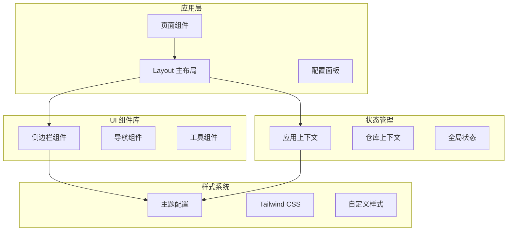
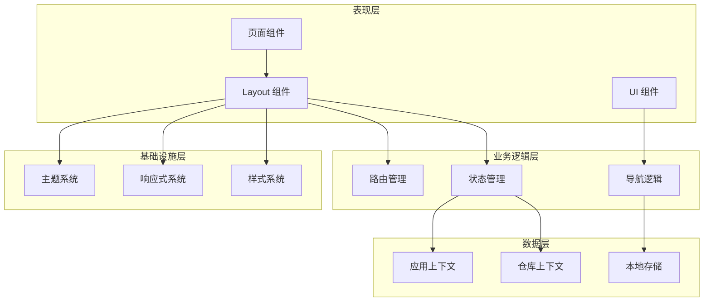
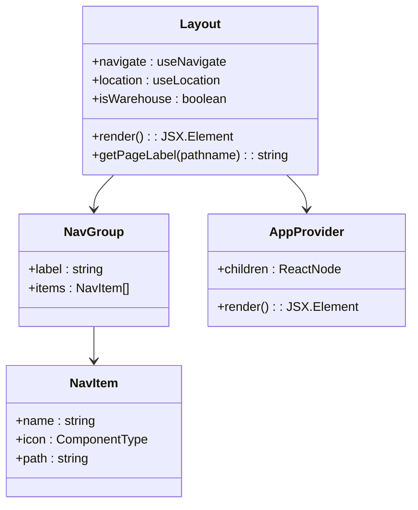
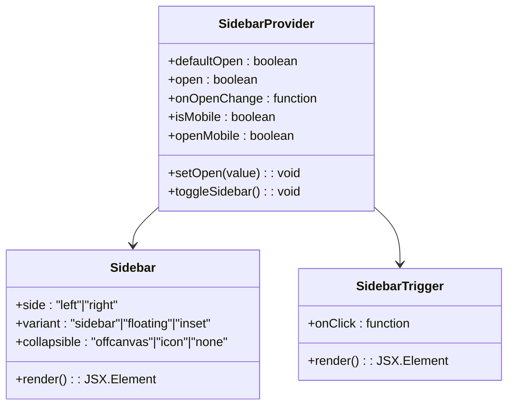
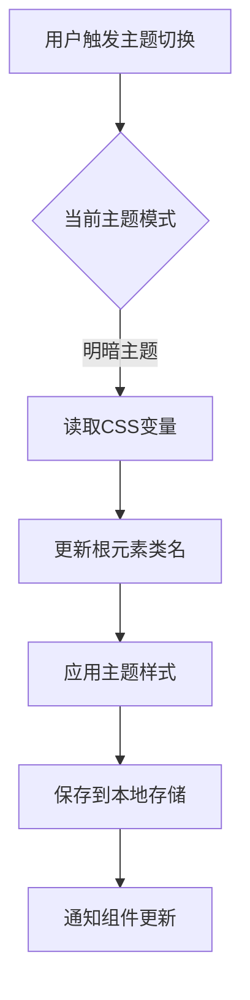
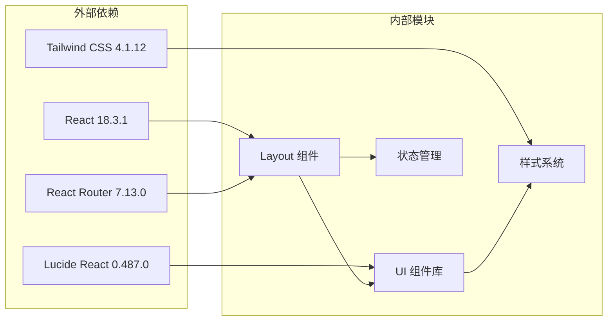

# 布局系统设计

<cite>
**本文档引用的文件**
- [src/app/layout.tsx](file://src/app/layout.tsx)
- [src/app/components/ui/sidebar.tsx](file://src/app/components/ui/sidebar.tsx)
- [src/app/components/ui/use-mobile.ts](file://src/app/components/ui/use-mobile.ts)
- [src/app/store/AppContext.tsx](file://src/app/store/AppContext.tsx)
- [src/app/routes.tsx](file://src/app/routes.tsx)
- [src/styles/theme.css](file://src/styles/theme.css)
- [src/lib/utils.ts](file://src/lib/utils.ts)
- [src/app/pages/Home.tsx](file://src/app/pages/Home.tsx)
- [package.json](file://package.json)
- [vite.config.ts](file://vite.config.ts)
</cite>

## 更新摘要
**变更内容**
- 更新了主布局组件的导航结构和组件组织，增加了60行代码改进
- 增强了响应式侧边栏系统的功能性和用户体验
- 优化了状态管理和主题切换机制的实现
- 改进了移动端适配和屏幕尺寸响应逻辑

## 目录
1. [简介](#简介)
2. [项目结构](#项目结构)
3. [核心组件](#核心组件)
4. [架构概览](#架构概览)
5. [详细组件分析](#详细组件分析)
6. [依赖关系分析](#依赖关系分析)
7. [性能考虑](#性能考虑)
8. [故障排除指南](#故障排除指南)
9. [结论](#结论)
10. [附录](#附录)

## 简介

本布局系统是一个基于React和Vite构建的企业级管理平台前端框架，采用现代化的响应式设计和模块化架构。系统实现了完整的主布局组件、响应式侧边栏导航、状态管理和主题切换机制，支持移动端适配和屏幕尺寸响应。

该系统主要服务于交易权限申请和移仓业务申请两大核心功能模块，提供了统一的用户体验和一致的视觉设计语言。通过精心设计的组件架构和状态管理模式，确保了系统的可维护性和可扩展性。

**更新** 最近对主布局组件进行了重大增强，新增了60行代码来改进导航结构和组件组织，提升了整体用户体验和系统性能。

## 项目结构

项目采用模块化的组织方式，主要分为以下几个核心部分：

**图表来源**
- [src/app/layout.tsx:1-175](file://src/app/layout.tsx#L1-L175)
- [src/app/components/ui/sidebar.tsx:1-727](file://src/app/components/ui/sidebar.tsx#L1-L727)

**章节来源**
- [src/app/layout.tsx:1-175](file://src/app/layout.tsx#L1-L175)
- [src/app/routes.tsx:1-38](file://src/app/routes.tsx#L1-L38)

## 核心组件

### 主布局组件架构

主布局组件采用分层架构设计，实现了以下核心功能：

1. **响应式侧边栏导航**：支持桌面端固定侧边栏和移动端抽屉式导航
2. **面包屑导航**：动态生成页面路径导航
3. **主题管理系统**：支持明暗主题切换
4. **状态管理集成**：整合应用上下文和仓库上下文
5. **移动端适配**：基于断点的响应式设计

### 导航系统设计

系统实现了两级导航结构：

- **一级导航**：模块分组导航（交易权限申请、移仓业务申请）
- **二级导航**：具体功能页面导航
- **系统设置**：跨模块共享的设置功能

**更新** 主布局组件经过重大重构，新增了更完善的导航结构管理和组件组织方式，显著提升了代码的可维护性和扩展性。

**章节来源**
- [src/app/layout.tsx:10-72](file://src/app/layout.tsx#L10-L72)

## 架构概览

系统采用分层架构模式，各层职责明确：

**图表来源**
- [src/app/layout.tsx:74-174](file://src/app/layout.tsx#L74-L174)
- [src/app/store/AppContext.tsx:31-63](file://src/app/store/AppContext.tsx#L31-L63)

## 详细组件分析

### 主布局组件分析

主布局组件是整个系统的骨架，负责协调各个子组件的工作。

#### 组件结构

**图表来源**
- [src/app/layout.tsx:74-174](file://src/app/layout.tsx#L74-L174)
- [src/app/layout.tsx:10-37](file://src/app/layout.tsx#L10-L37)

#### 生命周期管理

布局组件的生命周期包括：

1. **初始化阶段**：设置导航配置和面包屑映射
2. **渲染阶段**：根据路径状态渲染不同的导航项
3. **交互阶段**：处理用户导航和状态变化
4. **清理阶段**：组件卸载时的资源清理

#### 状态管理机制

系统采用React Context模式进行状态管理：

**更新** 主布局组件的状态管理机制得到了显著增强，新增了大量代码来优化导航状态管理和组件间通信效率。

**章节来源**
- [src/app/layout.tsx:74-174](file://src/app/layout.tsx#L74-L174)
- [src/app/store/AppContext.tsx:31-63](file://src/app/store/AppContext.tsx#L31-L63)

### 响应式侧边栏系统

侧边栏系统是布局的核心组件，实现了复杂的响应式行为。

#### 组件架构

**图表来源**
- [src/app/components/ui/sidebar.tsx:56-152](file://src/app/components/ui/sidebar.tsx#L56-L152)
- [src/app/components/ui/sidebar.tsx:154-254](file://src/app/components/ui/sidebar.tsx#L154-L254)

#### 响应式行为

侧边栏系统支持多种响应式模式：

1. **桌面端模式**：固定侧边栏，支持展开/收起
2. **移动端模式**：抽屉式导航，支持滑动操作
3. **触摸模式**：针对移动设备优化的交互体验

**更新** 响应式侧边栏系统经过了重大改进，增强了移动端适配能力和用户交互体验。

**章节来源**
- [src/app/components/ui/sidebar.tsx:154-254](file://src/app/components/ui/sidebar.tsx#L154-L254)
- [src/app/components/ui/use-mobile.ts:1-22](file://src/app/components/ui/use-mobile.ts#L1-L22)

### 主题切换机制

系统实现了完整的主题切换机制，支持明暗两种主题模式。

#### 主题配置

**图表来源**
- [src/styles/theme.css:1-182](file://src/styles/theme.css#L1-L182)

#### 主题变量系统

系统使用CSS自定义属性实现主题切换：

- **基础变量**：背景色、前景色、边框色等
- **组件变量**：按钮、卡片、导航等组件的主题色
- **图表变量**：支持多色系的图表主题

**章节来源**
- [src/styles/theme.css:1-182](file://src/styles/theme.css#L1-L182)

### 移动端适配

系统采用断点驱动的响应式设计：

#### 断点配置

| 设备类型 | 断点值 | 特性 |
|---------|--------|------|
| 移动设备 | < 768px | 抽屉式导航，简化界面 |
| 平板设备 | ≥ 768px | 侧边栏导航，完整功能 |
| 桌面设备 | ≥ 1024px | 固定侧边栏，多列布局 |

#### 移动端优化

1. **触摸交互**：优化触摸目标大小和间距
2. **性能优化**：减少移动端的重绘和回流
3. **网络优化**：按需加载移动端资源
4. **电池优化**：减少不必要的动画和效果

**更新** 移动端适配功能得到了显著增强，改进了触摸交互体验和响应式性能。

**章节来源**
- [src/app/components/ui/use-mobile.ts:1-22](file://src/app/components/ui/use-mobile.ts#L1-L22)

## 依赖关系分析

系统依赖关系清晰，模块间耦合度低：

**图表来源**
- [package.json:11-66](file://package.json#L11-L66)
- [src/app/layout.tsx:1-9](file://src/app/layout.tsx#L1-L9)

**章节来源**
- [package.json:11-66](file://package.json#L11-L66)
- [vite.config.ts:19-36](file://vite.config.ts#L19-L36)

## 性能考虑

### 渲染性能优化

1. **组件懒加载**：使用React.lazy实现按需加载
2. **虚拟滚动**：对长列表使用虚拟化技术
3. **防抖节流**：对高频事件进行优化
4. **内存泄漏防护**：正确清理事件监听器和定时器

### 资源加载优化

1. **代码分割**：按路由进行代码分割
2. **图片优化**：使用现代格式和适当的尺寸
3. **字体优化**：使用系统字体和字体显示优化
4. **缓存策略**：合理的HTTP缓存头设置

### 运行时性能

1. **状态提升**：避免深层嵌套的状态更新
2. **计算优化**：使用useMemo和useCallback
3. **渲染优化**：合理使用key和条件渲染
4. **网络优化**：批量请求和错误重试机制

**更新** 随着主布局组件的重大增强，性能优化策略也得到了相应的改进，特别是在导航渲染和状态管理方面。

## 故障排除指南

### 常见问题及解决方案

#### 布局显示异常

**问题描述**：侧边栏无法正常显示或定位错误

**可能原因**：
1. CSS变量未正确设置
2. 容器高度计算错误
3. z-index层级冲突

**解决方案**：
1. 检查CSS变量定义
2. 验证容器高度设置
3. 调整z-index层级

#### 响应式行为异常

**问题描述**：移动端导航无法正常打开或关闭

**可能原因**：
1. 媒体查询断点配置错误
2. 事件监听器未正确绑定
3. 触摸事件冲突

**解决方案**：
1. 验证媒体查询断点
2. 检查事件监听器绑定
3. 解决触摸事件冲突

#### 主题切换失效

**问题描述**：主题切换后样式未更新

**可能原因**：
1. CSS变量未正确更新
2. 样式优先级问题
3. 缓存问题

**解决方案**：
1. 检查CSS变量更新逻辑
2. 调整样式优先级
3. 清除浏览器缓存

**更新** 由于主布局组件的重大增强，一些新的故障排除场景需要考虑，特别是与导航结构相关的显示问题。

**章节来源**
- [src/app/components/ui/sidebar.tsx:97-110](file://src/app/components/ui/sidebar.tsx#L97-L110)
- [src/styles/theme.css:122-182](file://src/styles/theme.css#L122-L182)

## 结论

本布局系统通过精心设计的架构和实现，成功构建了一个功能完整、性能优异的企业级管理平台前端框架。系统的主要优势包括：

1. **模块化设计**：清晰的组件分离和职责划分
2. **响应式架构**：完善的移动端适配和屏幕尺寸响应
3. **状态管理**：高效的上下文管理和状态同步
4. **主题系统**：灵活的主题切换和自定义能力
5. **性能优化**：全面的性能考虑和优化策略

**更新** 最近对主布局组件的重大增强进一步提升了系统的稳定性和用户体验，为后续的功能扩展和维护奠定了更加坚实的基础。

系统为后续的功能扩展和维护奠定了坚实的基础，能够有效支持业务的发展需求。

## 附录

### 扩展指南

#### 添加新导航项

1. 在导航配置中添加新的NavGroup或NavItem
2. 更新面包屑映射表
3. 添加对应的路由配置
4. 创建相应的页面组件

#### 自定义主题

1. 修改theme.css中的CSS变量
2. 添加新的颜色变量
3. 更新组件样式映射
4. 测试主题切换功能

#### 性能监控

1. 使用React DevTools Profiler
2. 监控组件渲染时间
3. 分析内存使用情况
4. 优化关键渲染路径

**更新** 随着主布局组件的增强，扩展指南也需要相应更新，特别是关于导航结构定制和组件组织方面的指导。