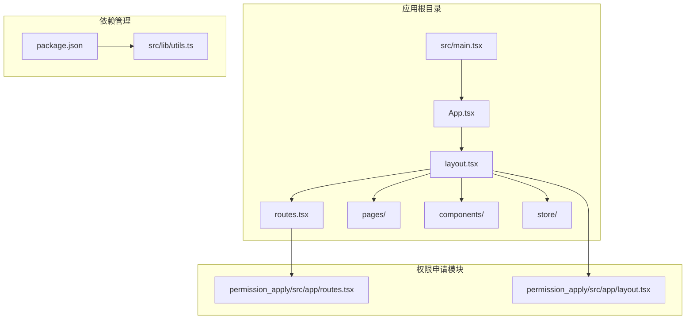
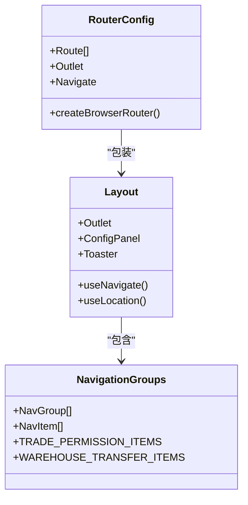
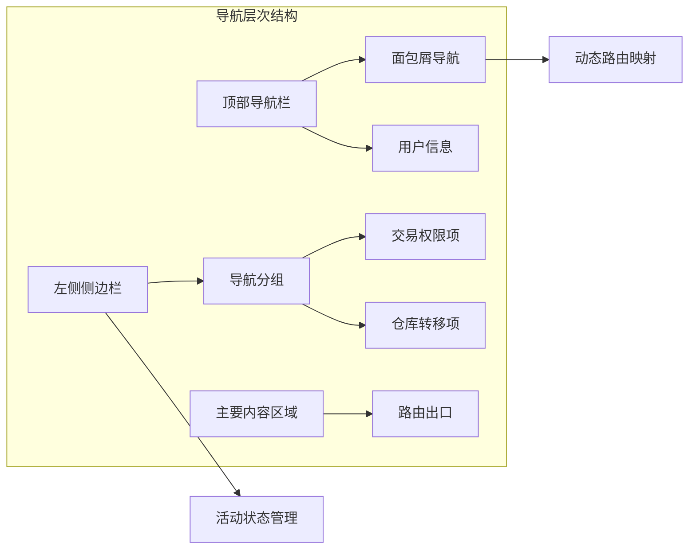
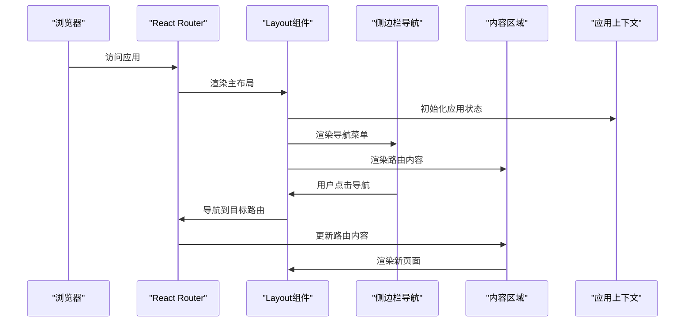
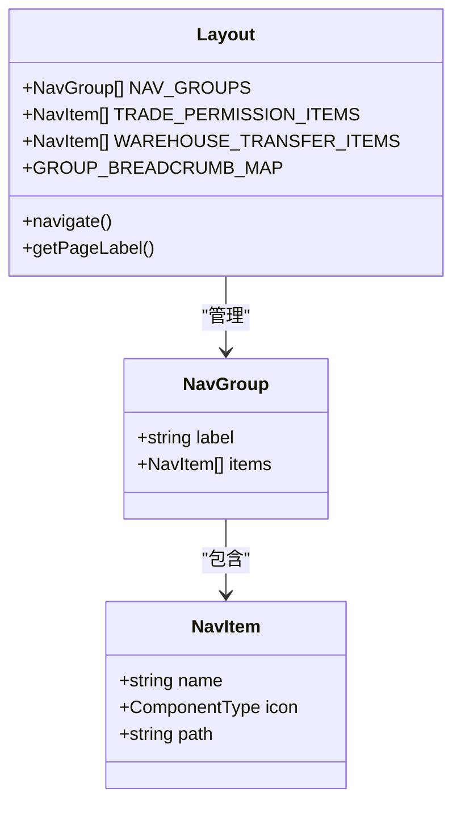
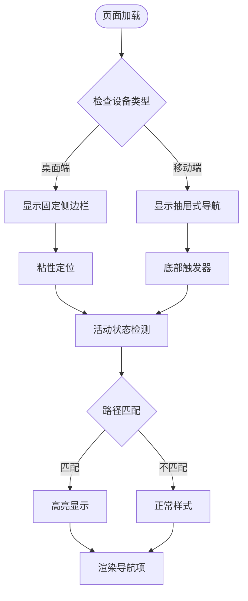
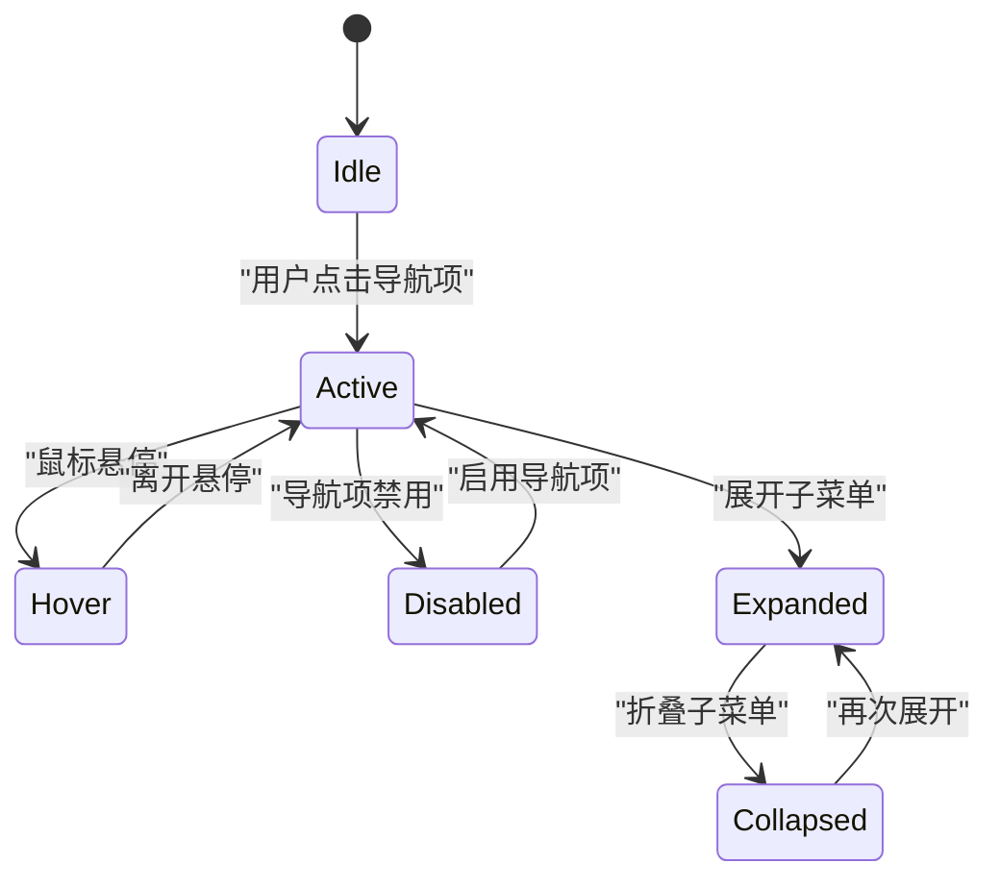
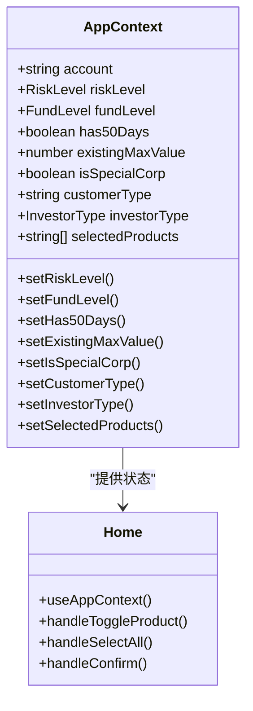

# 路由和导航系统

<cite>
**本文档引用的文件**
- [routes.tsx](file://src/app/routes.tsx)
- [layout.tsx](file://src/app/layout.tsx)
- [Home.tsx](file://src/app/pages/Home.tsx)
- [AppContext.tsx](file://src/app/store/AppContext.tsx)
- [utils.ts](file://src/lib/utils.ts)
- [breadcrumb.tsx](file://src/app/components/ui/breadcrumb.tsx)
- [sidebar.tsx](file://src/app/components/ui/sidebar.tsx)
- [ConfigPanel.tsx](file://src/app/components/ConfigPanel.tsx)
- [main.tsx](file://src/main.tsx)
- [package.json](file://package.json)
</cite>

## 目录
1. [引言](#引言)
2. [项目结构](#项目结构)
3. [核心组件](#核心组件)
4. [架构概览](#架构概览)
5. [详细组件分析](#详细组件分析)
6. [依赖关系分析](#依赖关系分析)
7. [性能考虑](#性能考虑)
8. [故障排除指南](#故障排除指南)
9. [结论](#结论)
10. [附录](#附录)

## 引言

本项目基于 React Router 7.13.0 构建了完整的路由和导航系统，实现了企业级管理平台的页面路由、主布局系统、侧边栏导航和面包屑导航功能。系统采用模块化设计，支持响应式布局和良好的用户体验。

## 项目结构

项目采用分层架构设计，主要目录结构如下：



**图表来源**
- [main.tsx:1-7](file://src/main.tsx#L1-L7)
- [routes.tsx:1-38](file://src/app/routes.tsx#L1-L38)
- [layout.tsx:1-175](file://src/app/layout.tsx#L1-L175)

**章节来源**
- [main.tsx:1-7](file://src/main.tsx#L1-L7)
- [package.json:1-91](file://package.json#L1-L91)

## 核心组件

### 路由配置系统

系统使用 React Router 7.13.0 的 createBrowserRouter API 构建路由配置，支持嵌套路由和动态路径参数。



**图表来源**
- [routes.tsx:18-38](file://src/app/routes.tsx#L18-L38)
- [layout.tsx:74-175](file://src/app/layout.tsx#L74-L175)

### 导航组件体系

系统实现了多层次的导航组件，包括侧边栏导航、面包屑导航和顶部导航。



**图表来源**
- [layout.tsx:80-167](file://src/app/layout.tsx#L80-L167)
- [breadcrumb.tsx:7-109](file://src/app/components/ui/breadcrumb.tsx#L7-L109)

**章节来源**
- [routes.tsx:1-38](file://src/app/routes.tsx#L1-L38)
- [layout.tsx:1-175](file://src/app/layout.tsx#L1-L175)

## 架构概览

系统采用主布局模式，所有页面都包裹在统一的 Layout 组件中，实现了主题一致性和导航一致性。



**图表来源**
- [layout.tsx:74-175](file://src/app/layout.tsx#L74-L175)
- [routes.tsx:18-38](file://src/app/routes.tsx#L18-L38)

## 详细组件分析

### 主布局系统

Layout 组件是整个应用的核心容器，负责管理全局布局、导航状态和用户交互。

#### 导航数据结构



**图表来源**
- [layout.tsx:10-37](file://src/app/layout.tsx#L10-L37)
- [layout.tsx:74-175](file://src/app/layout.tsx#L74-L175)

#### 响应式导航实现

系统实现了桌面端和移动端的响应式导航：



**图表来源**
- [layout.tsx:86-137](file://src/app/layout.tsx#L86-L137)
- [layout.tsx:94-114](file://src/app/layout.tsx#L94-L114)

**章节来源**
- [layout.tsx:1-175](file://src/app/layout.tsx#L1-L175)

### 面包屑导航系统

面包屑导航提供了清晰的页面层级指示，支持动态内容生成。

#### 面包屑逻辑流程

```mermaid
flowchart TD
PageLoad[页面加载] --> GetPath[获取当前路径]
GetPath --> CheckMap{检查预定义映射}
CheckMap --> |找到映射| UseMapped[使用映射标签]
CheckMap --> |未找到映射| CheckSpecial{检查特殊路径}
CheckSpecial --> |submit-form| UseSpecial1[使用"补充证明材料"]
CheckSpecial --> |staff-approval| UseSpecial2[使用"审批详情"]
CheckSpecial --> |system-settings| UseSpecial3[使用"系统设置"]
CheckSpecial --> |warehouse-apply| UseSpecial4[使用"移仓业务申请表"]
CheckSpecial --> |warehouse-detail| UseSpecial5[使用"移仓申请详情"]
CheckSpecial --> |warehouse-audit| UseSpecial6[使用"移仓审核"]
CheckSpecial --> |warehouse-audit-list| UseSpecial7[使用"移仓审批流水"]
CheckSpecial --> |其他| DefaultLabel[默认标签]
UseMapped --> RenderBreadcrumb[渲染面包屑]
UseSpecial1 --> RenderBreadcrumb
UseSpecial2 --> RenderBreadcrumb
UseSpecial3 --> RenderBreadcrumb
UseSpecial4 --> RenderBreadcrumb
UseSpecial5 --> RenderBreadcrumb
UseSpecial6 --> RenderBreadcrumb
UseSpecial7 --> RenderBreadcrumb
DefaultLabel --> RenderBreadcrumb
```

**图表来源**
- [layout.tsx:42-72](file://src/app/layout.tsx#L42-L72)
- [layout.tsx:142-155](file://src/app/layout.tsx#L142-L155)

**章节来源**
- [layout.tsx:41-72](file://src/app/layout.tsx#L41-L72)

### 侧边栏导航组件

系统实现了功能丰富的侧边栏导航，支持多级菜单和状态管理。

#### 导航状态管理



**图表来源**
- [layout.tsx:94-114](file://src/app/layout.tsx#L94-L114)
- [layout.tsx:100-113](file://src/app/layout.tsx#L100-L113)

**章节来源**
- [layout.tsx:86-137](file://src/app/layout.tsx#L86-L137)

### 应用上下文系统

AppContext 提供了全局状态管理，支持风险评估、权限管理和用户信息。

#### 状态管理模式



**图表来源**
- [AppContext.tsx:6-27](file://src/app/store/AppContext.tsx#L6-L27)
- [Home.tsx:61-68](file://src/app/pages/Home.tsx#L61-L68)

**章节来源**
- [AppContext.tsx:1-64](file://src/app/store/AppContext.tsx#L1-L64)
- [Home.tsx:1-809](file://src/app/pages/Home.tsx#L1-L809)

### 工具函数系统

cn 函数提供了条件类名合并功能，支持 Tailwind CSS 的灵活组合。

**章节来源**
- [utils.ts:1-6](file://src/lib/utils.ts#L1-L6)

## 依赖关系分析

系统依赖关系清晰，主要外部依赖包括 React Router 和 UI 组件库。

```mermaid
graph TB
subgraph "核心依赖"
React[react@18.3.1]
Router[react-router@7.13.0]
Lucide[lucide-react@0.487.0]
end
subgraph "UI组件库"
Radix[@radix-ui/react-*]
Shadcn[shadcn/ui组件]
end
subgraph "构建工具"
Vite[vite@6.3.5]
Tailwind[tailwindcss@4.1.12]
end
subgraph "应用代码"
Routes[routes.tsx]
Layout[layout.tsx]
Home[Home.tsx]
Context[AppContext.tsx]
end
React --> Router
Router --> Routes
Lucide --> Layout
Radix --> Shadcn
Tailwind --> Shadcn
Routes --> Layout
Layout --> Home
Layout --> Context
```

**图表来源**
- [package.json:11-66](file://package.json#L11-L66)
- [routes.tsx:1-10](file://src/app/routes.tsx#L1-L10)

**章节来源**
- [package.json:1-91](file://package.json#L1-L91)

## 性能考虑

### 路由性能优化

1. **懒加载策略**：路由组件按需加载，减少初始包体积
2. **状态缓存**：导航状态通过 React Router 管理，避免重复计算
3. **条件渲染**：根据路径条件渲染特定组件，减少不必要的 DOM 更新

### UI 性能优化

1. **虚拟滚动**：大量数据时使用虚拟化技术
2. **防抖处理**：输入控件添加防抖机制
3. **内存管理**：及时清理事件监听器和定时器

## 故障排除指南

### 常见问题及解决方案

#### 路由跳转问题
- **症状**：导航后页面不更新
- **原因**：useNavigate 使用不当
- **解决**：确保正确传递路径参数

#### 导航状态异常
- **症状**：导航项高亮状态错误
- **原因**：路径匹配逻辑问题
- **解决**：检查 isActive 条件判断

#### 响应式布局问题
- **症状**：移动端显示异常
- **原因**：CSS 媒体查询配置错误
- **解决**：验证断点设置和样式优先级

**章节来源**
- [layout.tsx:94-114](file://src/app/layout.tsx#L94-L114)
- [routes.tsx:18-38](file://src/app/routes.tsx#L18-L38)

## 结论

本路由和导航系统通过合理的架构设计和组件化实现，提供了完整的页面导航解决方案。系统具有以下特点：

1. **模块化设计**：清晰的组件分离和职责划分
2. **响应式支持**：适配多种设备和屏幕尺寸
3. **用户体验**：直观的导航和状态反馈
4. **扩展性强**：易于添加新的导航项和页面

## 附录

### SEO 优化建议

1. **元数据管理**：为每个页面设置独特的标题和描述
2. **结构化数据**：添加 JSON-LD 标记
3. **图片优化**：使用适当的 alt 属性和 lazy loading
4. **链接优化**：确保内部链接的有效性和可访问性

### 用户体验最佳实践

1. **加载状态**：为异步操作提供加载指示器
2. **错误处理**：友好的错误提示和恢复机制
3. **键盘导航**：支持完全的键盘操作
4. **无障碍访问**：遵循 WCAG 指南