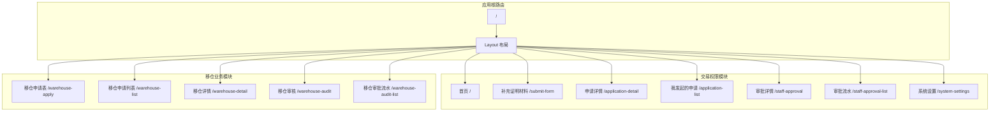
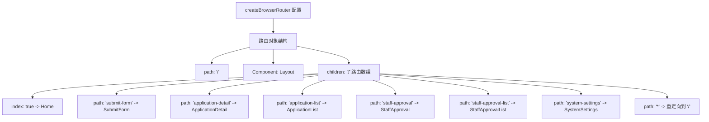
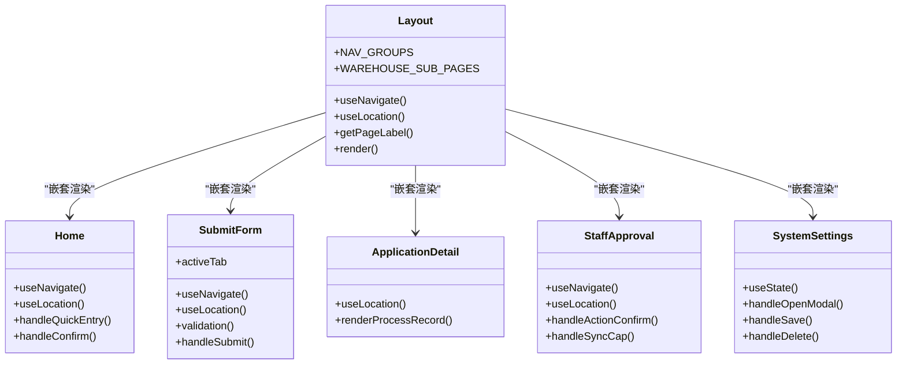
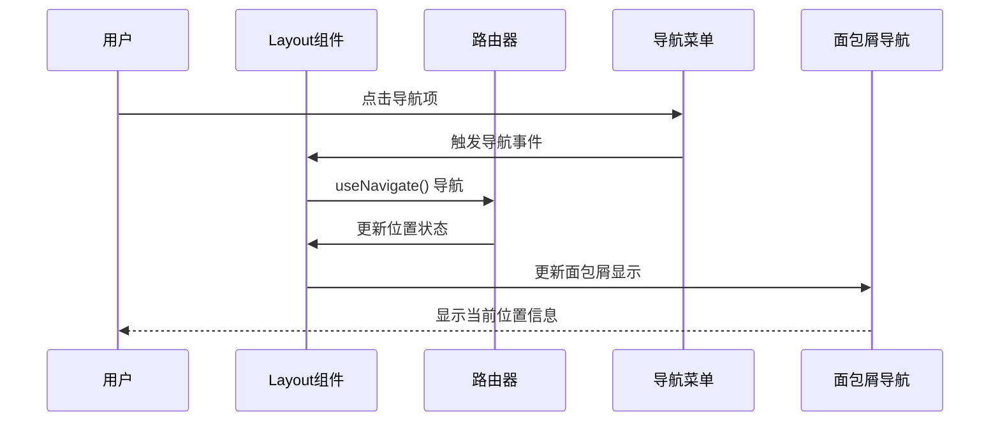
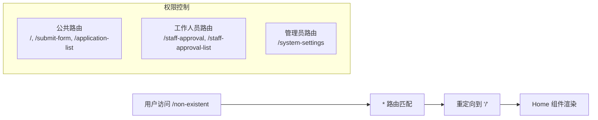
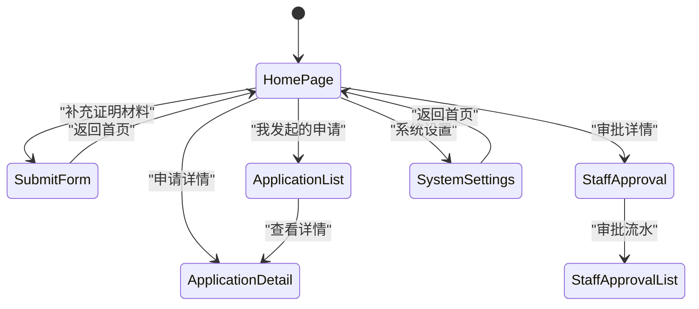
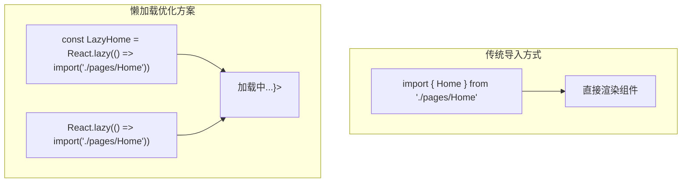
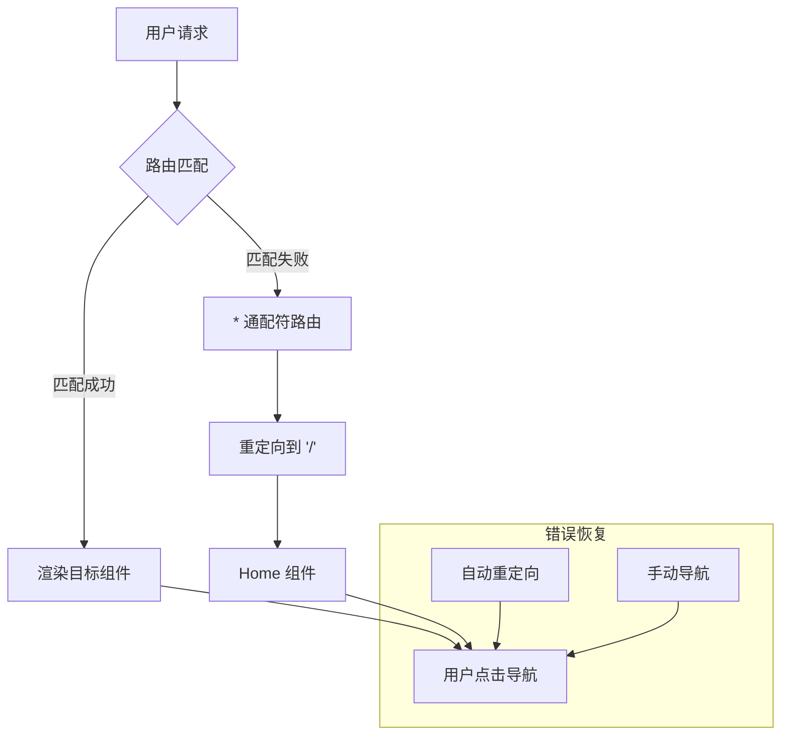

# 路由配置详解

<cite>
**本文档引用的文件**
- [src/app/routes.tsx](file://src/app/routes.tsx)
- [permission_apply/src/app/routes.tsx](file://permission_apply/src/app/routes.tsx)
- [src/app/App.tsx](file://src/app/App.tsx)
- [permission_apply/src/app/App.tsx](file://permission_apply/src/app/App.tsx)
- [src/app/layout.tsx](file://src/app/layout.tsx)
- [permission_apply/src/app/layout.tsx](file://permission_apply/src/app/layout.tsx)
- [src/app/pages/Home.tsx](file://src/app/pages/Home.tsx)
- [src/app/pages/ApplicationList.tsx](file://src/app/pages/ApplicationList.tsx)
- [src/app/pages/SubmitForm.tsx](file://src/app/pages/SubmitForm.tsx)
- [src/app/pages/ApplicationDetail.tsx](file://src/app/pages/ApplicationDetail.tsx)
- [src/app/pages/StaffApproval.tsx](file://src/app/pages/StaffApproval.tsx)
- [src/app/pages/SystemSettings.tsx](file://src/app/pages/SystemSettings.tsx)
- [src/app/pages/WarehouseApply.tsx](file://src/app/pages/WarehouseApply.tsx)
- [src/app/pages/WarehouseList.tsx](file://src/app/pages/WarehouseList.tsx)
- [src/app/pages/WarehouseDetail.tsx](file://src/app/pages/WarehouseDetail.tsx)
- [src/app/pages/WarehouseAudit.tsx](file://src/app/pages/WarehouseAudit.tsx)
</cite>

## 目录
1. [项目概述](#项目概述)
2. [路由架构总览](#路由架构总览)
3. [核心路由配置](#核心路由配置)
4. [嵌套路由设计](#嵌套路由设计)
5. [路由组件映射](#路由组件映射)
6. [路由守卫与权限控制](#路由守卫与权限控制)
7. [懒加载与性能优化](#懒加载与性能优化)
8. [错误边界处理](#错误边界处理)
9. [最佳实践指南](#最佳实践指南)
10. [故障排除](#故障排除)

## 项目概述

本项目是一个基于 React Router 的企业级管理平台，采用模块化路由架构设计。项目包含两个主要功能模块：

- **交易权限申请模块**：提供权限开通、申请管理、审批流程等功能
- **移仓业务申请模块**：提供期货移仓业务的全流程管理

项目采用嵌套路由设计，通过共享布局组件实现统一的导航和面包屑导航。

## 路由架构总览

**图表来源**
- [src/app/routes.tsx:18-38](file://src/app/routes.tsx#L18-L38)
- [permission_apply/src/app/routes.tsx:12-27](file://permission_apply/src/app/routes.tsx#L12-L27)

## 核心路由配置

### 主路由配置结构

项目采用 `createBrowserRouter` 创建路由配置，所有路由都嵌套在根布局组件中：

**图表来源**
- [src/app/routes.tsx:18-38](file://src/app/routes.tsx#L18-L38)

### 路由路径与组件映射

| 路径模式 | 组件名称 | 功能描述 | 访问权限 |
|---------|----------|----------|----------|
| `/` | Home | 交易权限申请首页 | 公共访问 |
| `/submit-form` | SubmitForm | 补充证明材料申请 | 公共访问 |
| `/application-detail` | ApplicationDetail | 申请详情展示 | 公共访问 |
| `/application-list` | ApplicationList | 我发起的申请列表 | 公共访问 |
| `/staff-approval` | StaffApproval | 审批详情（工作人员） | 工作人员 |
| `/staff-approval-list` | StaffApprovalList | 审批流水列表 | 工作人员 |
| `/system-settings` | SystemSettings | 系统设置 | 管理员 |
| `/warehouse-apply` | WarehouseApply | 移仓业务申请表 | 公共访问 |
| `/warehouse-list` | WarehouseList | 移仓申请列表 | 公共访问 |
| `/warehouse-detail` | WarehouseDetail | 移仓申请详情 | 公共访问 |
| `/warehouse-audit` | WarehouseAudit | 移仓审核 | 工作人员 |
| `/warehouse-audit-list` | WarehouseAuditList | 移仓审批流水 | 工作人员 |

**章节来源**
- [src/app/routes.tsx:18-38](file://src/app/routes.tsx#L18-L38)
- [permission_apply/src/app/routes.tsx:12-27](file://permission_apply/src/app/routes.tsx#L12-L27)

## 嵌套路由设计

### 布局组件架构

**图表来源**
- [src/app/layout.tsx:74-175](file://src/app/layout.tsx#L74-L175)
- [src/app/pages/Home.tsx:61-809](file://src/app/pages/Home.tsx#L61-L809)
- [src/app/pages/SubmitForm.tsx:57-747](file://src/app/pages/SubmitForm.tsx#L57-L747)

### 导航与面包屑系统

布局组件实现了智能的导航和面包屑系统：

**图表来源**
- [src/app/layout.tsx:75-175](file://src/app/layout.tsx#L75-L175)

**章节来源**
- [src/app/layout.tsx:1-175](file://src/app/layout.tsx#L1-L175)

## 路由组件映射

### 交易权限模块组件

| 组件名称 | 文件路径 | 功能特性 | 状态管理 |
|----------|----------|----------|----------|
| Home | src/app/pages/Home.tsx | 权限申请主界面，包含产品选择、风险评估 | 使用 AppContext |
| SubmitForm | src/app/pages/SubmitForm.tsx | 证明材料补充，支持多种申请类型 | 使用 AppContext |
| ApplicationDetail | src/app/pages/ApplicationDetail.tsx | 申请详情展示，支持只读模式 | 使用 Location State |
| ApplicationList | src/app/pages/ApplicationList.tsx | 申请列表管理 | 本地状态管理 |
| StaffApproval | src/app/pages/StaffApproval.tsx | 工作人员审批界面 | 使用 Location State |
| StaffApprovalList | src/app/pages/StaffApprovalList.tsx | 审批流水列表 | 本地状态管理 |
| SystemSettings | src/app/pages/SystemSettings.tsx | 系统配置管理 | 本地状态管理 |

### 移仓业务模块组件

| 组件名称 | 文件路径 | 功能特性 | 状态管理 |
|----------|----------|----------|----------|
| WarehouseApply | src/app/pages/WarehouseApply.tsx | 移仓申请表单，支持多交易所选择 | 使用 WarehouseContext |
| WarehouseList | src/app/pages/WarehouseList.tsx | 移仓申请列表 | 本地状态管理 |
| WarehouseDetail | src/app/pages/WarehouseDetail.tsx | 移仓详情展示 | 使用 Location State |
| WarehouseAudit | src/app/pages/WarehouseAudit.tsx | 移仓审核界面 | 使用 Location State |
| WarehouseAuditList | src/app/pages/WarehouseAuditList.tsx | 移仓审批流水 | 本地状态管理 |

**章节来源**
- [src/app/pages/Home.tsx:1-809](file://src/app/pages/Home.tsx#L1-L809)
- [src/app/pages/SubmitForm.tsx:1-747](file://src/app/pages/SubmitForm.tsx#L1-L747)
- [src/app/pages/ApplicationDetail.tsx:1-113](file://src/app/pages/ApplicationDetail.tsx#L1-L113)
- [src/app/pages/StaffApproval.tsx:1-708](file://src/app/pages/StaffApproval.tsx#L1-L708)
- [src/app/pages/SystemSettings.tsx:1-192](file://src/app/pages/SystemSettings.tsx#L1-L192)
- [src/app/pages/WarehouseApply.tsx:1-909](file://src/app/pages/WarehouseApply.tsx#L1-L909)
- [src/app/pages/WarehouseList.tsx:1-220](file://src/app/pages/WarehouseList.tsx#L1-L220)
- [src/app/pages/WarehouseDetail.tsx:1-441](file://src/app/pages/WarehouseDetail.tsx#L1-L441)
- [src/app/pages/WarehouseAudit.tsx:1-883](file://src/app/pages/WarehouseAudit.tsx#L1-L883)

## 路由守卫与权限控制

### 路由重定向机制

项目实现了智能的路由重定向机制，确保用户访问不存在的路由时能够正确跳转：

**图表来源**
- [src/app/routes.tsx:35-36](file://src/app/routes.tsx#L35-L36)

### 布局级别的导航控制

布局组件实现了基于路径的导航控制逻辑：

**图表来源**
- [src/app/layout.tsx:95-98](file://src/app/layout.tsx#L95-L98)

**章节来源**
- [src/app/routes.tsx:18-38](file://src/app/routes.tsx#L18-L38)
- [src/app/layout.tsx:74-175](file://src/app/layout.tsx#L74-L175)

## 懒加载与性能优化

### 路由懒加载策略

虽然当前项目使用了传统的组件导入方式，但可以轻松实现懒加载优化：

### 性能优化建议

1. **路由级别懒加载**：对大型组件实现按需加载
2. **代码分割**：将不常用的路由组件单独打包
3. **缓存策略**：利用浏览器缓存减少重复加载
4. **预加载机制**：对用户可能访问的路由进行预加载

## 错误边界处理

### 路由错误处理机制

项目通过通配符路由实现基本的错误处理：

**图表来源**
- [src/app/routes.tsx:35-36](file://src/app/routes.tsx#L35-L36)

### 组件级错误处理

各页面组件实现了相应的错误处理机制：

- **ApplicationList**：处理应用状态变化和导航逻辑
- **SubmitForm**：处理表单验证和状态管理
- **WarehouseApply**：处理复杂的业务逻辑和状态同步

**章节来源**
- [src/app/routes.tsx:18-38](file://src/app/routes.tsx#L18-L38)

## 最佳实践指南

### 路由配置最佳实践

1. **统一布局设计**：所有路由都嵌套在共享布局组件中
2. **清晰的路径命名**：使用语义化的路径名称
3. **合理的嵌套层次**：避免过深的嵌套结构
4. **通配符路由处理**：实现优雅的错误处理

### 性能优化建议

1. **路由懒加载**：对大型组件实现按需加载
2. **状态管理优化**：合理使用 React Context 和本地状态
3. **组件复用**：提取可复用的组件和逻辑
4. **资源优化**：压缩静态资源，优化图片和样式

### 安全性考虑

1. **权限控制**：根据用户角色控制路由访问
2. **数据验证**：对用户输入进行严格验证
3. **状态隔离**：避免敏感数据在组件间泄露
4. **错误处理**：防止敏感信息泄露到错误页面

## 故障排除

### 常见问题诊断

1. **路由不生效**：检查路由配置是否正确
2. **导航异常**：验证导航组件的使用方式
3. **状态丢失**：检查状态管理的实现
4. **性能问题**：分析组件渲染和数据加载

### 调试技巧

1. **React DevTools**：使用路由相关的调试工具
2. **浏览器开发者工具**：监控网络请求和组件渲染
3. **日志记录**：添加必要的日志输出
4. **单元测试**：编写路由相关的测试用例

**章节来源**
- [src/app/App.tsx:1-6](file://src/app/App.tsx#L1-L6)
- [permission_apply/src/app/App.tsx:1-6](file://permission_apply/src/app/App.tsx#L1-L6)