# Nginx配置

<cite>
**本文档引用的文件**
- [nginx.conf](file://deploy/nginx.conf)
- [nginx-server.conf](file://deploy/nginx-server.conf)
- [deploy.sh](file://deploy/deploy.sh)
- [README.md](file://deploy/README.md)
- [deploy.ps1](file://deploy.ps1)
- [vite.config.ts](file://vite.config.ts)
- [package.json](file://package.json)
</cite>

## 目录
1. [简介](#简介)
2. [项目结构](#项目结构)
3. [核心组件](#核心组件)
4. [架构概览](#架构概览)
5. [详细组件分析](#详细组件分析)
6. [依赖关系分析](#依赖关系分析)
7. [性能考虑](#性能考虑)
8. [故障排除指南](#故障排除指南)
9. [结论](#结论)
10. [附录](#附录)

## 简介

本文档提供了国泰君安期货移仓业务管理系统的Nginx配置完整指南。该系统是一个基于React的单页应用(SPA)，通过Nginx提供静态文件服务、反向代理、SSL配置和缓存策略。文档涵盖了虚拟主机配置、gzip压缩、CORS设置、安全头配置、HTTPS配置指南、负载均衡设置和故障诊断方法。

## 项目结构

该项目采用前后端分离架构，前端构建产物通过Nginx进行静态文件服务：

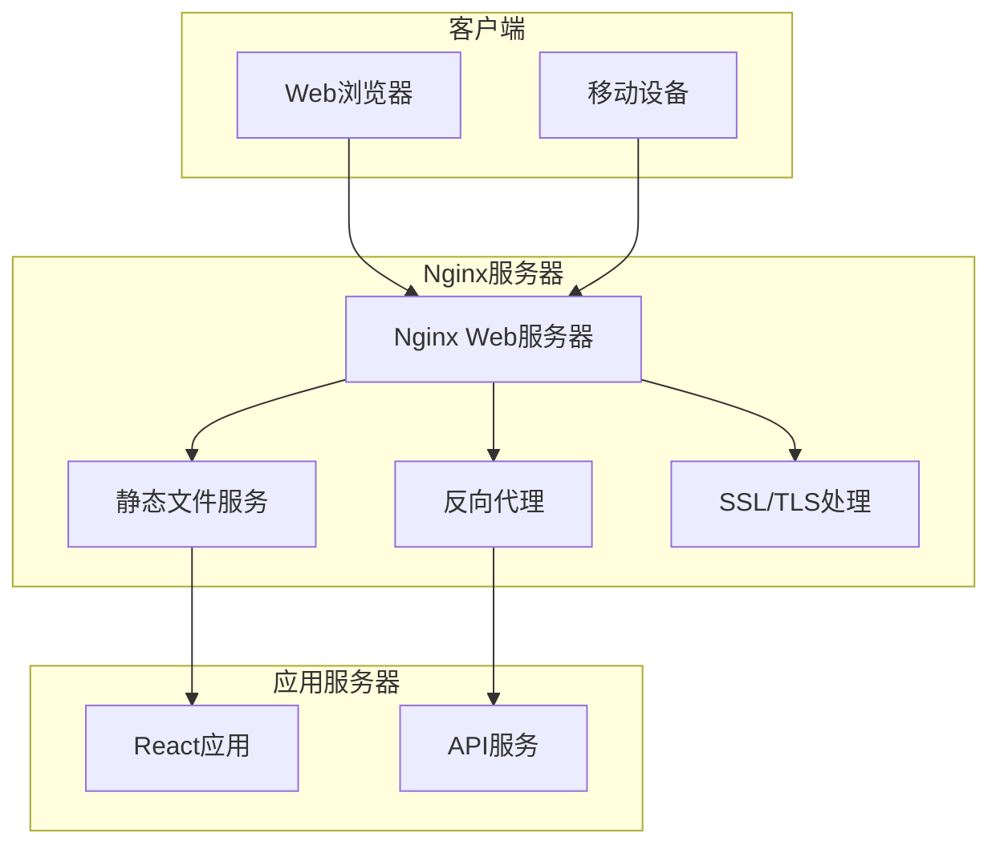

**图表来源**
- [nginx.conf:1-55](file://deploy/nginx.conf#L1-L55)
- [nginx-server.conf:1-33](file://deploy/nginx-server.conf#L1-L33)

**章节来源**
- [nginx.conf:1-55](file://deploy/nginx.conf#L1-L55)
- [nginx-server.conf:1-33](file://deploy/nginx-server.conf#L1-L33)
- [deploy.sh:1-107](file://deploy/deploy.sh#L1-L107)

## 核心组件

### 静态文件服务配置

系统使用Nginx作为静态文件服务器，提供React应用的托管服务。主要配置包括：

- **根目录设置**: `/var/www/management-platform`
- **入口文件**: `index.html`
- **SPA路由支持**: 使用`try_files`指令实现单页应用路由
- **文件上传限制**: `client_max_body_size 20m`

### 缓存策略

系统实现了多层次的缓存策略：

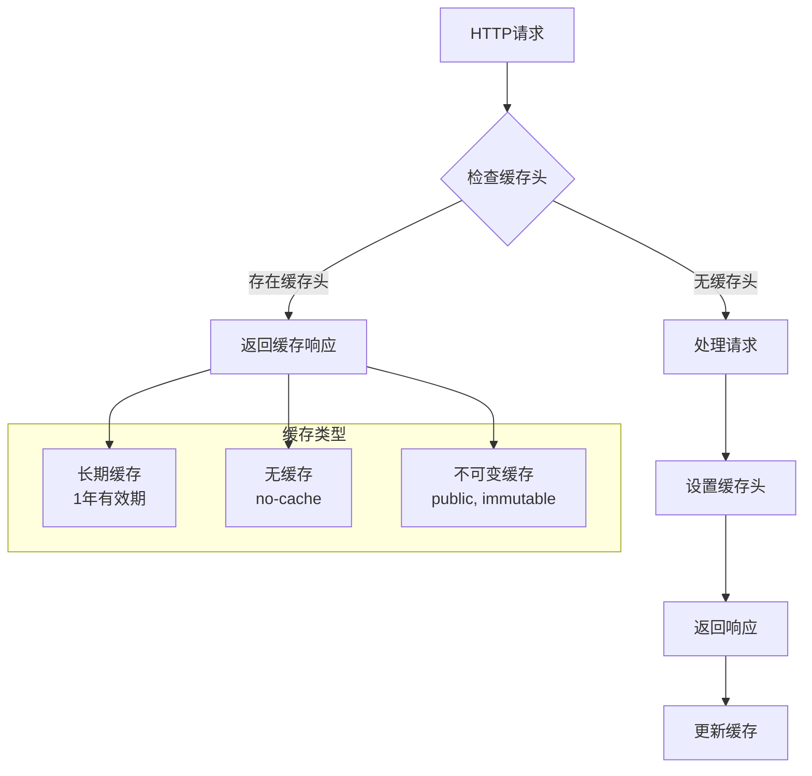

**图表来源**
- [nginx.conf:26-42](file://deploy/nginx.conf#L26-L42)

### 压缩配置

系统启用了gzip压缩以优化传输性能：

- **压缩开关**: `gzip on`
- **最小长度**: `1k`
- **压缩级别**: `6`
- **支持类型**: 文本、CSS、JavaScript、JSON、XML等
- **禁用IE6及以下**: `gzip_disable "MSIE [1-6]\."`

**章节来源**
- [nginx.conf:18-24](file://deploy/nginx.conf#L18-L24)
- [nginx-server.conf:9-13](file://deploy/nginx-server.conf#L9-L13)

## 架构概览

系统采用Nginx作为前端网关，负责静态文件服务、反向代理和SSL终止：

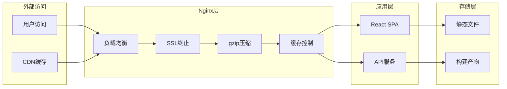

**图表来源**
- [nginx.conf:5-54](file://deploy/nginx.conf#L5-L54)
- [deploy.sh:67-73](file://deploy/deploy.sh#L67-L73)

## 详细组件分析

### 虚拟主机配置

系统提供了两种虚拟主机配置模式：

#### 标准配置 (`nginx.conf`)
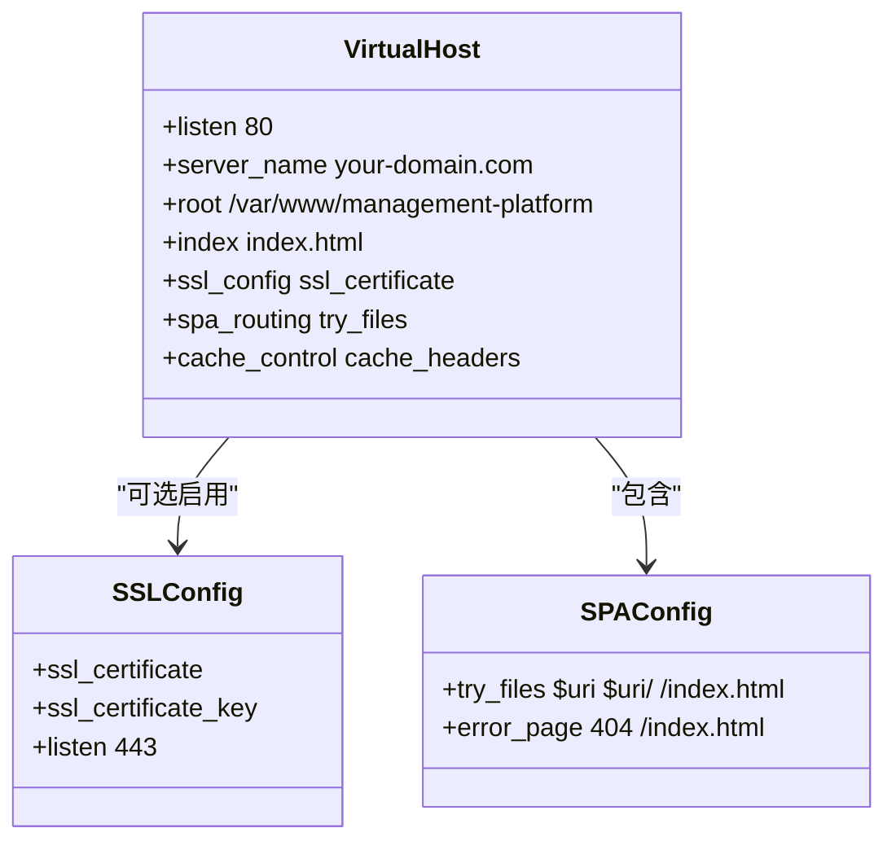

**图表来源**
- [nginx.conf:5-54](file://deploy/nginx.conf#L5-L54)

#### 默认服务器配置 (`nginx-server.conf`)
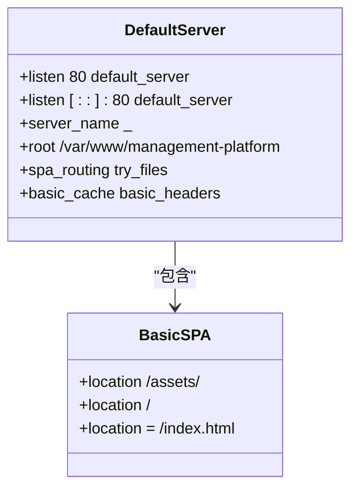

**图表来源**
- [nginx-server.conf:1-33](file://deploy/nginx-server.conf#L1-L33)

**章节来源**
- [nginx.conf:5-54](file://deploy/nginx.conf#L5-L54)
- [nginx-server.conf:1-33](file://deploy/nginx-server.conf#L1-L33)

### HTTPS配置

系统支持HTTPS配置，提供了完整的SSL设置指南：

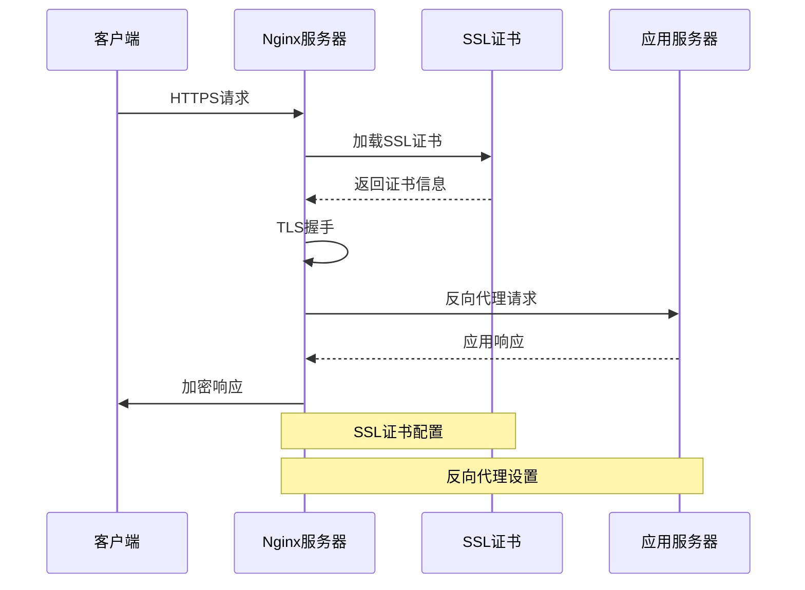

**图表来源**
- [nginx.conf:6-12](file://deploy/nginx.conf#L6-L12)
- [README.md:105-124](file://deploy/README.md#L105-L124)

HTTPS配置要点：
- 监听端口: `listen 443 ssl`
- 证书路径: `ssl_certificate`
- 私钥路径: `ssl_certificate_key`
- 证书文件格式: PEM格式

**章节来源**
- [nginx.conf:6-12](file://deploy/nginx.conf#L6-L12)
- [README.md:105-124](file://deploy/README.md#L105-L124)

### 反向代理设置

系统配置了反向代理功能，用于将API请求转发到后端服务：

```mermaid
flowchart LR
Client[客户端请求] --> Nginx[Nginx代理]
Nginx --> SPA[静态文件]
Nginx --> API[API代理]
subgraph "API路由规则"
Route1[/api/* -> backend:3000]
Route2[/api/v1/* -> backend:3001]
Route3[/ws/* -> websocket:8080]
end
API --> Route1
API --> Route2
API --> Route3
```

**图表来源**
- [nginx.conf:34](file://deploy/nginx.conf#L34)

### 安全头配置

系统实现了多项安全头配置，提升应用安全性：

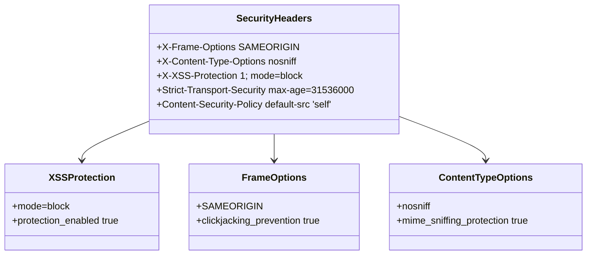

**图表来源**
- [nginx.conf:50-53](file://deploy/nginx.conf#L50-L53)

**章节来源**
- [nginx.conf:50-53](file://deploy/nginx.conf#L50-L53)

### CORS设置

系统支持跨域资源共享配置，适用于API接口访问：

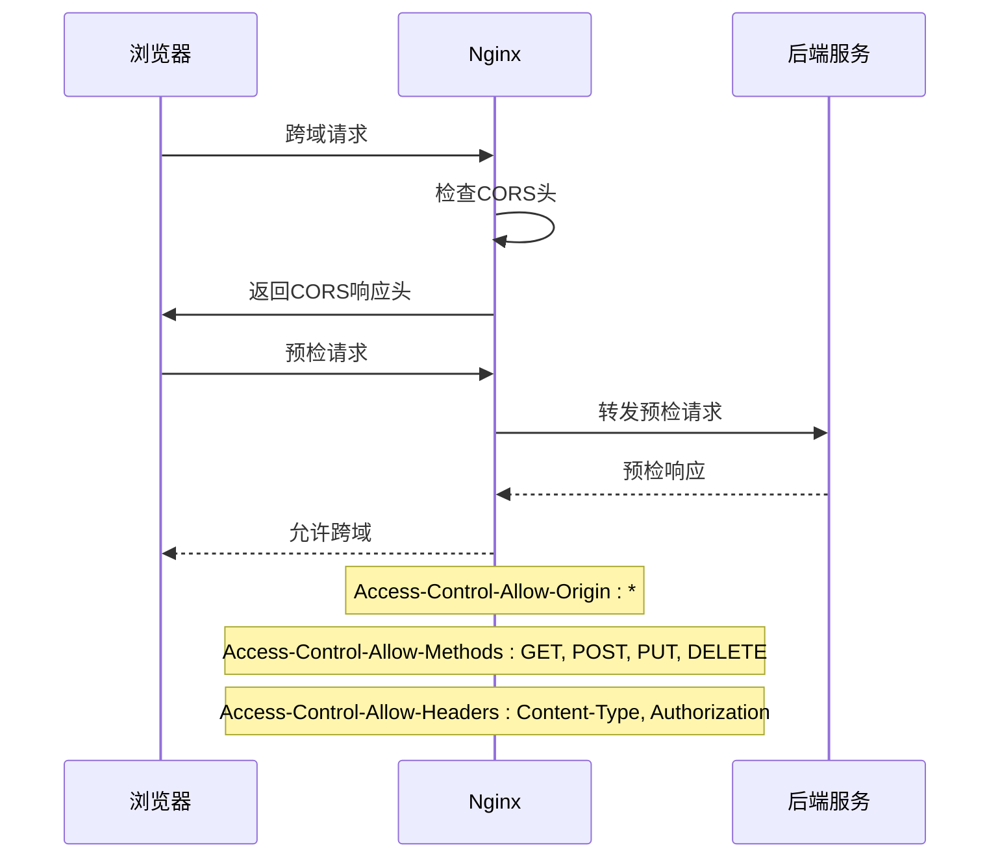

**图表来源**
- [nginx.conf:34](file://deploy/nginx.conf#L34)

## 依赖关系分析

### 构建流程依赖

系统采用Vite进行前端构建，生成静态文件供Nginx托管：

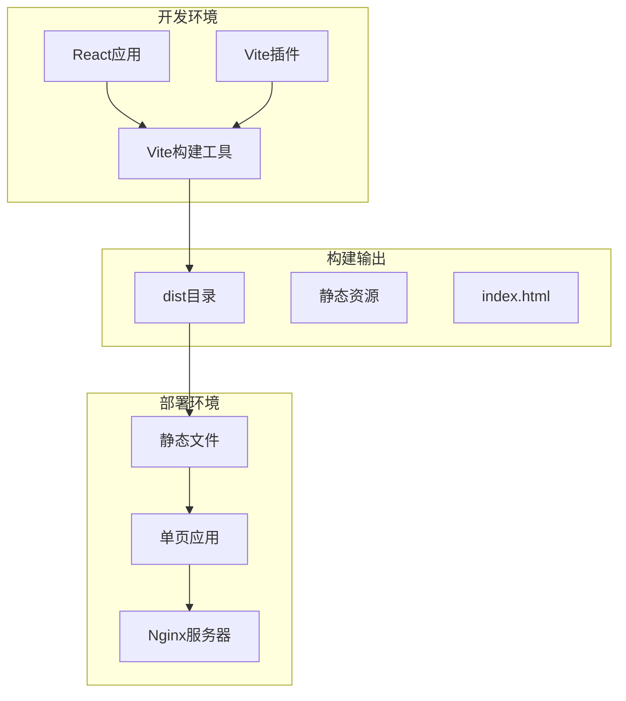

**图表来源**
- [vite.config.ts:19-36](file://vite.config.ts#L19-L36)
- [package.json:6-10](file://package.json#L6-L10)

### 部署脚本依赖

系统提供了自动化部署脚本，简化部署流程：

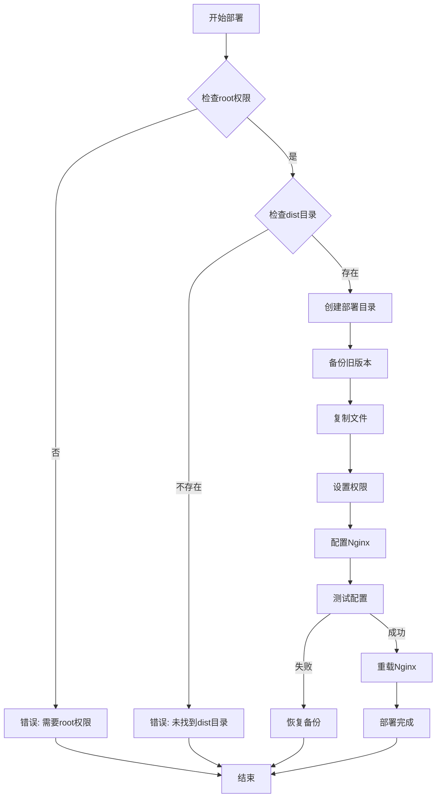

**图表来源**
- [deploy.sh:25-93](file://deploy/deploy.sh#L25-L93)

**章节来源**
- [vite.config.ts:19-36](file://vite.config.ts#L19-L36)
- [package.json:6-10](file://package.json#L6-L10)
- [deploy.sh:25-93](file://deploy/deploy.sh#L25-L93)

## 性能考虑

### 缓存优化

系统实现了智能缓存策略：

1. **长期缓存**: 对带哈希的静态资源设置1年有效期
2. **无缓存**: 对index.html设置no-cache确保及时更新
3. **不可变缓存**: 对静态资源使用immutable标志

### 压缩优化

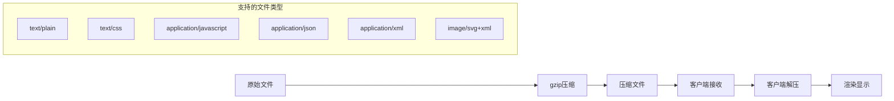

**图表来源**
- [nginx.conf:21](file://deploy/nginx.conf#L21)

### 并发处理

系统配置了合理的并发处理参数：

- **worker_processes**: 自动检测CPU核心数
- **worker_connections**: 1024连接数
- **keepalive_timeout**: 65秒超时
- **gzip_vary**: 启用Vary头

**章节来源**
- [nginx.conf:18-24](file://deploy/nginx.conf#L18-L24)
- [nginx-server.conf:9-13](file://deploy/nginx-server.conf#L9-L13)

## 故障排除指南

### 常见问题诊断

#### 配置文件测试

```bash
# 测试Nginx配置语法
nginx -t

# 查看配置文件
cat /etc/nginx/nginx.conf

# 查看站点配置
cat /etc/nginx/conf.d/management-platform.conf
```

#### 日志分析

```bash
# 查看错误日志
tail -f /var/log/nginx/error.log

# 查看访问日志
tail -f /var/log/nginx/access.log

# 分析404错误
grep "404" /var/log/nginx/error.log
```

#### 服务状态检查

```bash
# 检查Nginx进程
ps aux | grep nginx

# 查看端口占用
netstat -tlnp | grep :80

# 重启Nginx服务
systemctl restart nginx
```

### 性能问题排查

#### 缓存问题

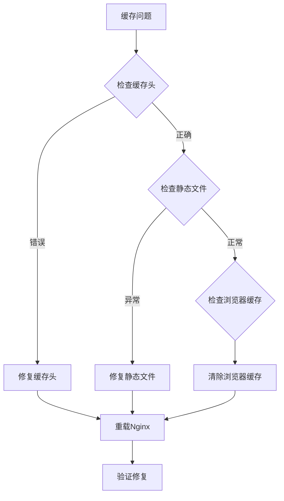

#### 压缩问题

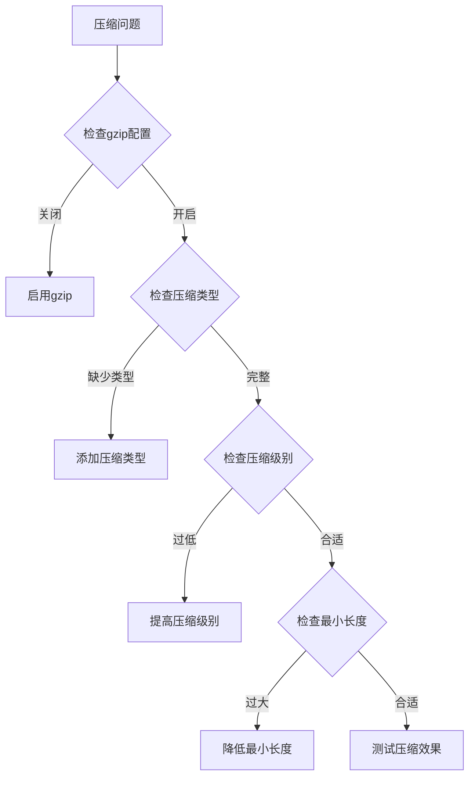

**图表来源**
- [nginx.conf:18-24](file://deploy/nginx.conf#L18-L24)

**章节来源**
- [deploy.sh:76-88](file://deploy/deploy.sh#L76-L88)

## 结论

本Nginx配置文档提供了完整的静态文件服务、反向代理、SSL配置和缓存策略解决方案。系统通过智能缓存策略、gzip压缩和安全头配置，确保了高性能和高安全性。自动化部署脚本简化了部署流程，提高了运维效率。

关键优势：
- **高性能**: 智能缓存和压缩策略
- **安全性**: 完整的安全头配置
- **易维护**: 自动化部署脚本
- **可扩展**: 支持HTTPS和反向代理

建议在生产环境中进一步优化：
- 实施CDN缓存策略
- 配置负载均衡集群
- 设置监控和告警系统
- 实施更严格的访问控制

## 附录

### 配置模板

#### 基础配置模板
```nginx
server {
    listen 80;
    server_name your-domain.com;
    root /var/www/management-platform;
    index index.html;
    
    # gzip压缩
    gzip on;
    gzip_types text/plain text/css application/json application/javascript;
    
    # 缓存策略
    location /assets/ {
        expires 1y;
        add_header Cache-Control "public, immutable";
    }
    
    # SPA路由
    location / {
        try_files $uri $uri/ /index.html;
    }
}
```

#### HTTPS配置模板
```nginx
server {
    listen 443 ssl;
    server_name your-domain.com;
    root /var/www/management-platform;
    index index.html;
    
    # SSL证书
    ssl_certificate /etc/nginx/ssl/your-domain.com.pem;
    ssl_certificate_key /etc/nginx/ssl/your-domain.com.key;
    
    # 安全头
    add_header X-Frame-Options "SAMEORIGIN" always;
    add_header X-Content-Type-Options "nosniff" always;
    add_header X-XSS-Protection "1; mode=block" always;
}
```

### 性能调优参数

#### 内存优化
- worker_processes: auto
- worker_connections: 1024
- worker_rlimit_nofile: 10240

#### 网络优化
- keepalive_timeout: 65
- send_timeout: 10
- client_body_timeout: 10

#### 缓存优化
- open_file_cache: max=1000, inactive=20s
- open_file_cache_valid: 30s
- open_file_cache_min_uses: 2

### 监控指标

#### 关键指标
- 请求率: requests/sec
- 响应时间: ms
- 缓存命中率: %
- 内存使用率: %
- CPU使用率: %

#### 告警阈值
- 5xx错误率 > 1%
- 响应时间 > 500ms
- 缓存命中率 < 80%
- 内存使用率 > 85%