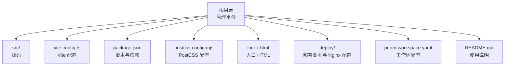
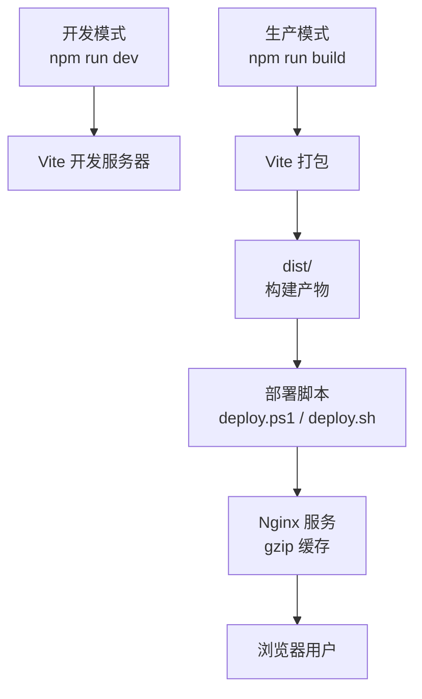
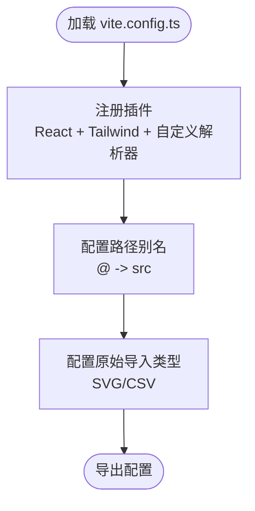
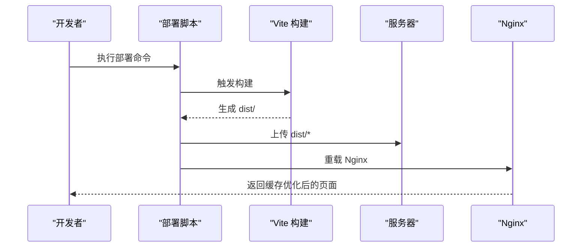
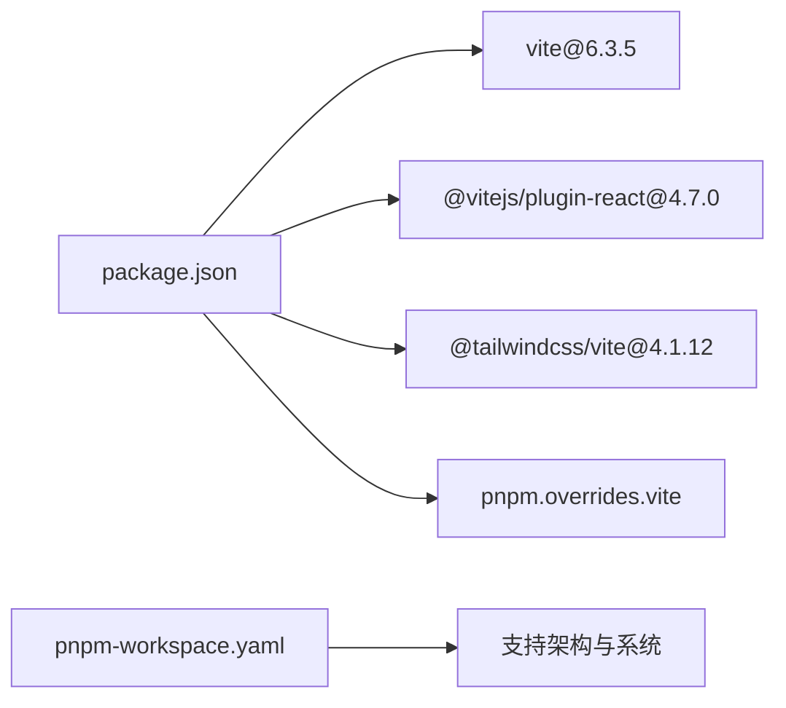

# 构建配置

<cite>
**本文引用的文件列表**
- [vite.config.ts](file://vite.config.ts)
- [package.json](file://package.json)
- [postcss.config.mjs](file://postcss.config.mjs)
- [index.html](file://index.html)
- [deploy/deploy.sh](file://deploy/deploy.sh)
- [deploy/nginx.conf](file://deploy/nginx.conf)
- [deploy.ps1](file://deploy.ps1)
- [pnpm-workspace.yaml](file://pnpm-workspace.yaml)
- [README.md](file://README.md)
</cite>

## 更新摘要
**变更内容**
- 移除了 `_module.yaml` 文件的引用，反映构建系统重构和简化的变更
- 更新了相关章节以反映当前构建配置状态
- 保持了文档的整体结构和一致性

## 目录
1. [简介](#简介)
2. [项目结构](#项目结构)
3. [核心组件](#核心组件)
4. [架构总览](#架构总览)
5. [详细组件分析](#详细组件分析)
6. [依赖关系分析](#依赖关系分析)
7. [性能考虑](#性能考虑)
8. [故障排查指南](#故障排查指南)
9. [结论](#结论)
10. [附录](#附录)

## 简介
本文件聚焦于本项目的构建配置与打包策略，围绕 Vite 构建工具展开，系统性说明：
- 开发与生产环境的差异配置
- 代码分割策略与资源处理
- 资源压缩与缓存机制
- 构建流程图与时序图
- 性能优化建议与常见问题解决方案
- 构建脚本使用方法与自定义配置示例

本项目采用 Vite 作为构建工具，结合 React 插件与 Tailwind CSS 插件，并通过 Nginx 提供静态资源服务与缓存控制。部署脚本支持本地一键构建并上传至服务器，同时提供 Nginx 配置模板以启用 gzip 压缩与长缓存策略。

**更新** 构建系统已进行重构和简化，移除了 `_module.yaml` 配置文件，使构建流程更加简洁高效。

## 项目结构
本项目采用单仓库多包工作区布局，根目录即主应用，另有子包(permission_apply)位于同级目录。构建配置集中在根目录的 Vite 配置文件中，配合 package.json 的脚本命令完成开发与生产构建。

图表来源
- [vite.config.ts:1-37](file://vite.config.ts#L1-L37)
- [package.json:1-91](file://package.json#L1-L91)
- [postcss.config.mjs:1-16](file://postcss.config.mjs#L1-L16)
- [index.html:1-22](file://index.html#L1-L22)
- [deploy/deploy.sh:1-107](file://deploy/deploy.sh#L1-L107)
- [deploy/nginx.conf:1-55](file://deploy/nginx.conf#L1-L55)
- [pnpm-workspace.yaml:1-10](file://pnpm-workspace.yaml#L1-L10)
- [README.md:1-11](file://README.md#L1-L11)

章节来源
- [vite.config.ts:1-37](file://vite.config.ts#L1-L37)
- [package.json:1-91](file://package.json#L1-L91)
- [postcss.config.mjs:1-16](file://postcss.config.mjs#L1-L16)
- [index.html:1-22](file://index.html#L1-L22)
- [deploy/deploy.sh:1-107](file://deploy/deploy.sh#L1-L107)
- [deploy/nginx.conf:1-55](file://deploy/nginx.conf#L1-L55)
- [pnpm-workspace.yaml:1-10](file://pnpm-workspace.yaml#L1-L10)
- [README.md:1-11](file://README.md#L1-L11)

## 核心组件
- Vite 配置：定义插件、别名、资源导入规则等。
- PostCSS 配置：Tailwind CSS 自动化配置，可扩展其他 PostCSS 插件。
- 入口 HTML：定义应用挂载点与基础元信息。
- 包管理与脚本：通过 npm scripts 触发 Vite 构建与开发服务器。
- 部署脚本与 Nginx：提供一键部署与静态资源缓存策略。

**更新** 构建系统重构后，移除了复杂的模块配置文件，使核心组件更加精简和易于维护。

章节来源
- [vite.config.ts:1-37](file://vite.config.ts#L1-L37)
- [postcss.config.mjs:1-16](file://postcss.config.mjs#L1-L16)
- [index.html:1-22](file://index.html#L1-L22)
- [package.json:6-10](file://package.json#L6-L10)

## 架构总览
下图展示从开发到生产的整体流程：开发模式启动 Vite Dev Server，生产模式调用 Vite 进行打包，随后通过部署脚本将产物上传至服务器，Nginx 提供静态服务并启用缓存与压缩。

图表来源
- [package.json:6-10](file://package.json#L6-L10)
- [deploy.ps1:22-29](file://deploy.ps1#L22-L29)
- [deploy/deploy.sh:22-29](file://deploy/deploy.sh#L22-L29)
- [deploy/nginx.conf:18-42](file://deploy/nginx.conf#L18-L42)

## 详细组件分析

### Vite 配置分析
- 插件体系
  - React 插件：启用 React JSX/TSX 支持与热更新。
  - Tailwind 插件：自动集成 Tailwind CSS v4，无需手动引入 tailwindcss/autoprefixer。
  - 自定义插件：figma-asset-resolver，将特定前缀的模块请求解析到本地资源目录，便于在构建时统一处理 Figma 资源。
- 别名配置
  - 将 @ 映射到 src 目录，简化导入路径书写。
- 资源导入
  - 支持对 SVG、CSV 等文件进行原始导入，避免被默认转换器处理。

图表来源
- [vite.config.ts:19-36](file://vite.config.ts#L19-L36)

**更新** 构建系统重构后，Vite 配置更加简洁，移除了复杂的模块配置文件依赖，提升了构建效率。

章节来源
- [vite.config.ts:1-37](file://vite.config.ts#L1-L37)

### PostCSS 配置分析
- Tailwind CSS v4 通过 @tailwindcss/vite 自动配置所需 PostCSS 插件，无需在此显式声明 tailwindcss/autoprefixer。
- 可选扩展：若需嵌套样式等特性，可在该文件中追加相应 PostCSS 插件。

章节来源
- [postcss.config.mjs:1-16](file://postcss.config.mjs#L1-L16)

### 入口 HTML 分析
- 定义应用挂载点 #root 与基础 meta 信息。
- 引入 /src/main.tsx 作为应用入口脚本。

章节来源
- [index.html:17-18](file://index.html#L17-L18)

### 包管理与脚本
- 开发脚本：启动 Vite 开发服务器。
- 生产脚本：执行 Vite 打包生成 dist 目录。
- 部署脚本：Windows PowerShell 脚本，先构建再上传至服务器并重载 Nginx；Linux Bash 脚本提供类似能力。

**更新** 构建脚本经过简化，不再依赖外部模块配置文件，提高了构建过程的稳定性和可维护性。

章节来源
- [package.json:6-10](file://package.json#L6-L10)
- [deploy.ps1:22-29](file://deploy.ps1#L22-L29)
- [deploy/deploy.sh:32-36](file://deploy/deploy.sh#L32-L36)

### 部署与 Nginx 缓存策略
- Nginx 配置要点
  - gzip 压缩：开启并指定压缩类型，提升传输效率。
  - 静态资源缓存：对带哈希的资源目录设置一年缓存与 immutable 标记，确保长期缓存。
  - SPA 路由回退：所有路由回退到 index.html，保证前端路由正常工作。
  - 安全头：设置 X-Frame-Options、X-Content-Type-Options、X-XSS-Protection。
  - 错误页：404 错误回退到 index.html。
- 部署脚本
  - Windows：构建后通过 scp 上传 dist 内容，远程执行 nginx 重载。
  - Linux：构建后复制 dist 内容到目标目录，自动设置权限并写入 Nginx 配置文件。

图表来源
- [deploy.ps1:22-29](file://deploy.ps1#L22-L29)
- [deploy/deploy.sh:32-36](file://deploy/deploy.sh#L32-L36)
- [deploy/nginx.conf:18-42](file://deploy/nginx.conf#L18-L42)

章节来源
- [deploy/nginx.conf:1-55](file://deploy/nginx.conf#L1-L55)
- [deploy.ps1:1-65](file://deploy.ps1#L1-L65)
- [deploy/deploy.sh:1-107](file://deploy/deploy.sh#L1-L107)

## 依赖关系分析
- Vite 版本与生态
  - Vite 6.3.5，React 插件 4.7.0，Tailwind 插件 4.1.12。
  - 通过 overrides 指定 vites 版本，确保一致性。
- 工作区配置
  - pnpm-workspace.yaml 声明了支持的操作系统与 CPU 架构，有助于跨平台构建与部署的一致性。

**更新** 构建系统重构后，移除了对 `_module.yaml` 的依赖，减少了外部配置文件的复杂性，使依赖关系更加清晰。

图表来源
- [package.json:68-90](file://package.json#L68-L90)
- [pnpm-workspace.yaml:1-10](file://pnpm-workspace.yaml#L1-L10)

章节来源
- [package.json:68-90](file://package.json#L68-L90)
- [pnpm-workspace.yaml:1-10](file://pnpm-workspace.yaml#L1-L10)

## 性能考虑
- 构建性能
  - 使用 esbuild 作为底层编译器，Vite 默认启用快速冷启动与热更新。
  - 合理拆分第三方库与业务代码，减少重复打包与体积。
- 资源优化
  - 启用 gzip 压缩，降低传输体积。
  - 对带哈希的静态资源设置长期缓存，提升二次加载速度。
  - 对 index.html 不缓存，确保更新及时生效。
- 代码分割
  - 基于动态导入实现按需加载，减少首屏体积。
  - 组件级懒加载与路由级懒加载相结合，平衡加载体验与网络开销。
- 缓存策略
  - Nginx 对 /assets/ 下的资源设置一年缓存与 immutable，适合带内容哈希的文件命名。
  - SPA 路由回退到 index.html，避免刷新导致的 404。

**更新** 构建系统重构后，由于移除了复杂的模块配置文件，构建过程更加直接，进一步提升了构建性能和稳定性。

章节来源
- [deploy/nginx.conf:18-42](file://deploy/nginx.conf#L18-L42)

## 故障排查指南
- 构建失败
  - 确认已安装依赖并执行 npm run build。
  - 若 dist 目录不存在，检查构建脚本是否成功执行。
- 部署失败
  - Windows：检查 SSH 连接与 scp 权限，确认服务器上 nginx 可重载。
  - Linux：检查部署脚本中的目录与权限设置，确保 Nginx 配置写入成功且语法正确。
- 缓存问题
  - 若页面未更新，确认 index.html 未被缓存，或强制刷新。
  - 若静态资源未更新，确认文件名包含内容哈希，且 Nginx 缓存策略正确。
- 路由问题
  - SPA 路由回退到 index.html，确保服务器已启用 try_files $uri $uri/ /index.html。

**更新** 构建系统重构后，由于移除了 `_module.yaml` 配置文件，相关的模块配置错误已不再出现，故障排查范围相应缩小。

章节来源
- [deploy.ps1:32-36](file://deploy.ps1#L32-36)
- [deploy/deploy.sh:32-36](file://deploy/deploy.sh#L32-L36)
- [deploy/nginx.conf:33-42](file://deploy/nginx.conf#L33-L42)

## 结论
本项目的构建配置简洁而实用：Vite 提供高效的开发与生产构建，Tailwind 插件自动化处理样式，PostCSS 配置保持最小化，Nginx 提供完善的缓存与压缩策略。通过部署脚本实现一键构建与上线，满足中小型前端项目的交付需求。

**更新** 随着构建系统的重构和简化，移除了 `_module.yaml` 配置文件后，整个构建流程变得更加直观和易于维护。建议在后续迭代中进一步细化代码分割策略与产物分析报告，持续优化首屏性能与缓存命中率。

## 附录

### 构建脚本使用方法
- 开发模式
  - 执行 npm run dev 启动 Vite 开发服务器。
- 生产模式
  - 执行 npm run build 生成 dist 目录。
- 部署模式
  - Windows：执行 npm run deploy，脚本会自动构建并上传至服务器，随后重载 Nginx。
  - Linux：执行 bash deploy.sh，脚本会自动构建并上传至服务器，随后重载 Nginx。

**更新** 构建脚本经过简化，不再需要额外的模块配置文件，使用方式更加直接。

章节来源
- [README.md:7-11](file://README.md#L7-L11)
- [package.json:6-10](file://package.json#L6-L10)
- [deploy.ps1:22-29](file://deploy.ps1#L22-L29)
- [deploy/deploy.sh:32-36](file://deploy/deploy.sh#L32-L36)

### 自定义配置示例（路径指引）
- 添加 PostCSS 插件
  - 在 postcss.config.mjs 中追加插件配置。
  - 参考路径：[postcss.config.mjs:1-16](file://postcss.config.mjs#L1-L16)
- 扩展 Vite 插件链
  - 在 vite.config.ts 的 plugins 数组中添加新的插件。
  - 参考路径：[vite.config.ts:20-26](file://vite.config.ts#L20-L26)
- 自定义资源导入
  - 在 vite.config.ts 的 assetsInclude 中添加需要原始导入的文件类型。
  - 参考路径：[vite.config.ts:34-36](file://vite.config.ts#L34-L36)
- 路径别名扩展
  - 在 vite.config.ts 的 resolve.alias 中添加新的别名映射。
  - 参考路径：[vite.config.ts:27-32](file://vite.config.ts#L27-L32)
- Nginx 缓存与压缩调整
  - 在 deploy/nginx.conf 中修改 gzip 与缓存策略。
  - 参考路径：[deploy/nginx.conf:18-42](file://deploy/nginx.conf#L18-L42)

**更新** 由于移除了 `_module.yaml` 配置文件，自定义配置的复杂度有所降低，主要关注点集中在现有的核心配置文件中。