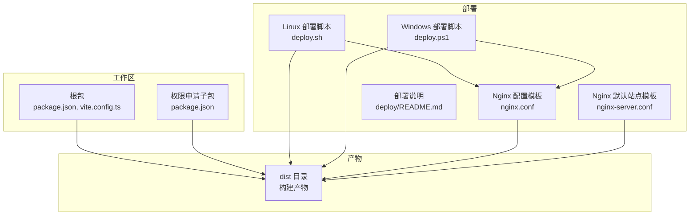
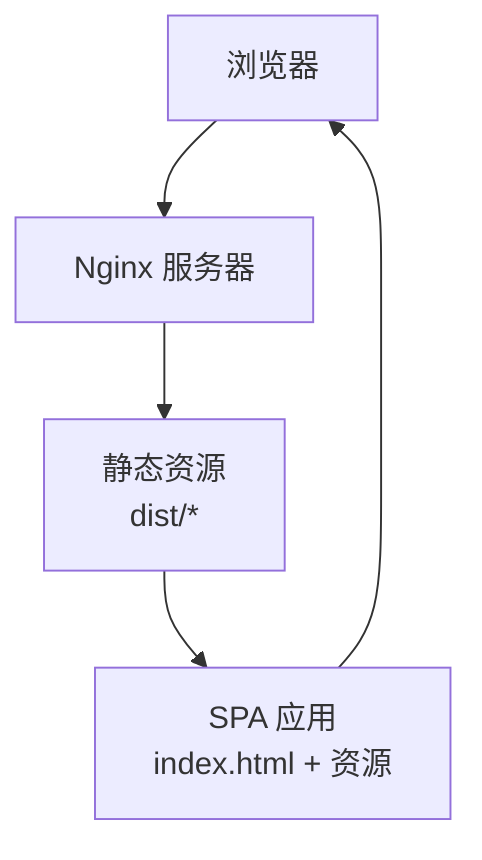
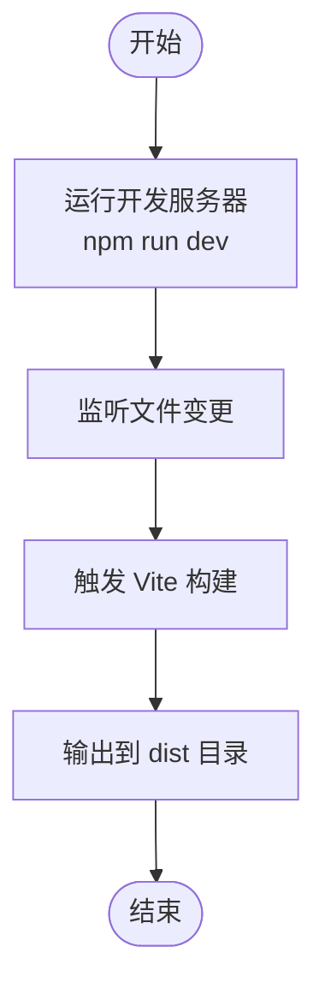
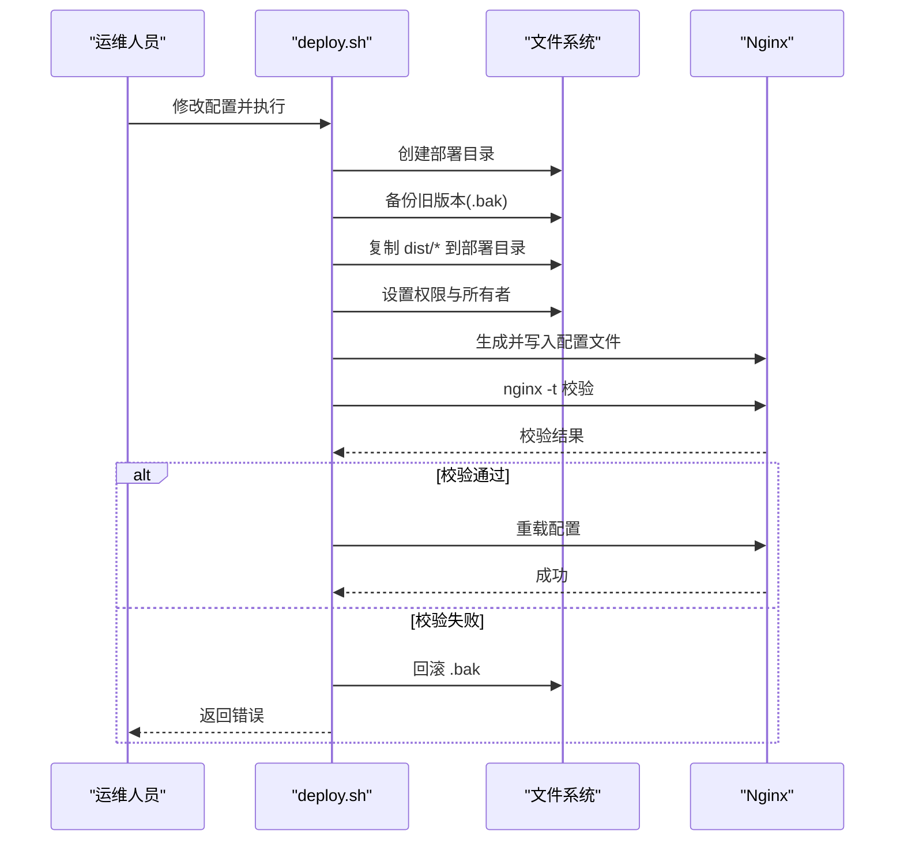
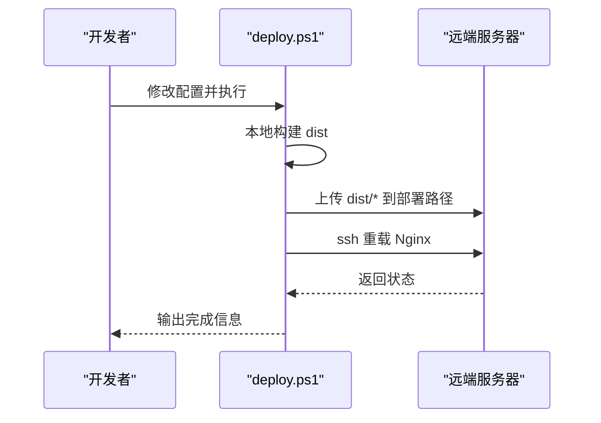
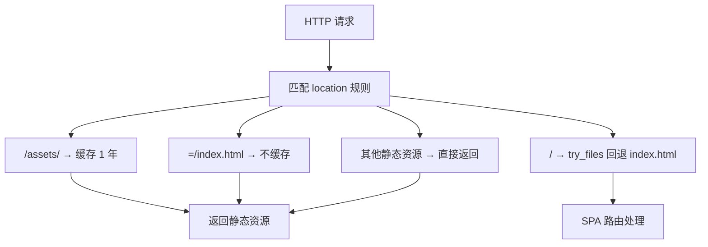
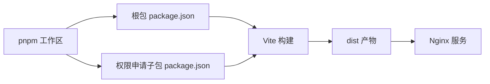

# 环境配置

<cite>
**本文档引用的文件**
- [package.json](file://package.json)
- [vite.config.ts](file://vite.config.ts)
- [deploy.sh](file://deploy/deploy.sh)
- [deploy.ps1](file://deploy.ps1)
- [nginx.conf](file://deploy/nginx.conf)
- [nginx-server.conf](file://deploy/nginx-server.conf)
- [README.md](file://deploy/README.md)
- [pnpm-workspace.yaml](file://pnpm-workspace.yaml)
- [permission_apply/package.json](file://permission_apply/package.json)
</cite>

## 目录
1. [简介](#简介)
2. [项目结构](#项目结构)
3. [核心组件](#核心组件)
4. [架构总览](#架构总览)
5. [详细组件分析](#详细组件分析)
6. [依赖关系分析](#依赖关系分析)
7. [性能考虑](#性能考虑)
8. [故障排查指南](#故障排查指南)
9. [结论](#结论)
10. [附录](#附录)

## 简介
本指南面向开发、测试与生产环境的环境配置与运维，覆盖以下主题：
- 开发、测试、生产环境的配置差异与最佳实践
- 环境变量与密钥管理建议
- 服务器环境要求、依赖安装与系统服务配置
- Docker 容器化部署策略（概念性指导）
- 环境切换策略与配置验证方法
- 环境搭建检查清单与常见问题解决方案

本项目为前端单页应用（SPA），基于 Vite 构建，通过 Nginx 提供静态文件服务。

## 项目结构
项目采用多包工作区布局，主包与权限申请子包共享统一的构建与部署流程。核心目录与文件如下：
- 根包与权限申请子包：均使用 Vite 作为构建工具，依赖管理采用 pnpm
- 部署相关：包含 Linux Shell 脚本与 Windows PowerShell 脚本，以及 Nginx 配置模板
- 构建产物：dist 目录用于生产部署

**图表来源**
- [package.json](file://package.json)
- [vite.config.ts](file://vite.config.ts)
- [deploy.sh](file://deploy/deploy.sh)
- [deploy.ps1](file://deploy.ps1)
- [nginx.conf](file://deploy/nginx.conf)
- [nginx-server.conf](file://deploy/nginx-server.conf)
- [README.md](file://deploy/README.md)

**章节来源**
- [package.json](file://package.json)
- [vite.config.ts](file://vite.config.ts)
- [pnpm-workspace.yaml](file://pnpm-workspace.yaml)
- [permission_apply/package.json](file://permission_apply/package.json)

## 核心组件
- 构建工具链
  - Vite：开发服务器、热更新与打包
  - 插件：React 与 TailwindCSS Vite 插件
  - 资源解析：自定义 Figma 资源别名与 SVG/CSV 资源导入
- 部署自动化
  - Linux：deploy.sh，负责创建部署目录、备份、复制文件、设置权限、生成 Nginx 配置、校验与重载
  - Windows：deploy.ps1，负责本地构建、上传 dist、远程重载 Nginx
- 服务器端
  - Nginx：静态文件服务、gzip 压缩、SPA 路由回退、安全头、缓存策略

**章节来源**
- [vite.config.ts](file://vite.config.ts)
- [deploy.sh](file://deploy/deploy.sh)
- [deploy.ps1](file://deploy.ps1)
- [nginx.conf](file://deploy/nginx.conf)
- [nginx-server.conf](file://deploy/nginx-server.conf)

## 架构总览
前端应用通过 Nginx 对外提供服务，Nginx 负责：
- 提供静态资源（HTML/CSS/JS/图片等）
- 启用 gzip 压缩
- SPA 路由回退至 index.html
- 设置缓存策略与安全头
- 可选 HTTPS（SSL 证书）

**图表来源**
- [nginx.conf](file://deploy/nginx.conf)
- [nginx-server.conf](file://deploy/nginx-server.conf)
- [deploy.sh](file://deploy/deploy.sh)

## 详细组件分析

### 构建与开发环境（Vite）
- 开发服务器
  - 启动命令：npm run dev
  - 端口与热更新由 Vite 管理
- 构建产物
  - 输出目录：dist
  - 包含入口 HTML、带哈希的 JS/CSS 与静态资源
- 资源处理
  - 自定义插件：Figma 资源解析器
  - 路径别名：@ 指向 src
  - 支持 SVG/CSV 资源作为模块导入

**图表来源**
- [vite.config.ts](file://vite.config.ts)
- [package.json](file://package.json)

**章节来源**
- [vite.config.ts](file://vite.config.ts)
- [package.json](file://package.json)

### 部署脚本（Linux）
- 功能要点
  - 创建部署目录并备份旧版本
  - 复制 dist 内容到目标目录
  - 设置权限（优先 nginx:nginx，否则 www-data:www-data）
  - 生成 Nginx 配置文件（替换域名占位符）
  - 校验 Nginx 配置并通过则重载
  - 失败时自动回滚备份
- 使用方式
  - 修改脚本中的部署路径与域名
  - 以 root 或 sudo 执行

**图表来源**
- [deploy.sh](file://deploy/deploy.sh)
- [nginx.conf](file://deploy/nginx.conf)

**章节来源**
- [deploy.sh](file://deploy/deploy.sh)
- [nginx.conf](file://deploy/nginx.conf)

### 部署脚本（Windows）
- 功能要点
  - 本地执行 npm run build
  - 上传 dist 内容到服务器指定路径
  - 远程执行 nginx -s reload
- 使用方式
  - 修改服务器 IP、用户名与部署路径
  - 在本地执行 npm run deploy

**图表来源**
- [deploy.ps1](file://deploy.ps1)

**章节来源**
- [deploy.ps1](file://deploy.ps1)

### Nginx 配置
- 关键点
  - 监听 80（可选 443 HTTPS）
  - 根目录指向部署目录
  - gzip 压缩与类型
  - 静态资源缓存（assets 目录 1 年）
  - SPA 路由回退到 index.html
  - index.html 不缓存
  - 安全头（X-Frame-Options、X-Content-Type-Options、X-XSS-Protection）
  - 上传大小限制
- 默认站点模板
  - 提供 default_server 配置与基础优化

**图表来源**
- [nginx.conf](file://deploy/nginx.conf)
- [nginx-server.conf](file://deploy/nginx-server.conf)

**章节来源**
- [nginx.conf](file://deploy/nginx.conf)
- [nginx-server.conf](file://deploy/nginx-server.conf)

## 依赖关系分析
- 包管理与工作区
  - pnpm 工作区：根与子包共享统一依赖与构建配置
  - 体系结构约束：linux/x64/arm64/glibc
- 构建依赖
  - Vite、React 插件、TailwindCSS 插件
- 运行时依赖
  - React 生态组件库与 UI 组件
- 部署依赖
  - Nginx（静态服务）、SSH（Windows 部署脚本）

**图表来源**
- [pnpm-workspace.yaml](file://pnpm-workspace.yaml)
- [package.json](file://package.json)
- [permission_apply/package.json](file://permission_apply/package.json)

**章节来源**
- [pnpm-workspace.yaml](file://pnpm-workspace.yaml)
- [package.json](file://package.json)
- [permission_apply/package.json](file://permission_apply/package.json)

## 性能考虑
- 静态资源缓存
  - 带哈希的资源文件设置长缓存（1 年）
  - index.html 不缓存，确保更新即时生效
- 压缩
  - 启用 gzip，减少传输体积
- 安全与可用性
  - 设置安全响应头，降低风险
  - SPA 回退保证刷新与深度链接可用
- 部署流程
  - 自动备份与回滚，降低发布风险

[本节为通用指导，无需特定文件引用]

## 故障排查指南
- 部署脚本执行失败
  - 检查是否以 root 或 sudo 执行
  - 确认 dist 目录存在
  - 查看 Nginx 配置生成与校验日志
  - 若校验失败，脚本会自动回滚 .bak
- Windows 部署失败
  - 检查 SSH 连接与凭据
  - 确认远端 Nginx 可重载
- 访问异常
  - 确认 Nginx 监听端口与防火墙
  - 检查部署目录权限与所有者
  - 确认 index.html 未被缓存（不缓存策略）
- HTTPS 配置
  - 证书路径与权限正确
  - 取消注释并重载 Nginx

**章节来源**
- [deploy.sh](file://deploy/deploy.sh)
- [deploy.ps1](file://deploy.ps1)
- [nginx.conf](file://deploy/nginx.conf)
- [README.md](file://deploy/README.md)

## 结论
本项目提供了完整的前端构建与部署方案：Vite 开发体验、自动化部署脚本与 Nginx 生产配置。通过明确的环境差异与安全策略，可稳定地在开发、测试与生产环境中交付应用。

[本节为总结性内容，无需特定文件引用]

## 附录

### 环境配置差异与切换策略
- 开发环境
  - 使用 npm run dev 启动 Vite 开发服务器
  - 本地调试与热更新
- 测试环境
  - 本地或 CI 构建 dist
  - 使用 Nginx 本地预览（可参考 nginx.conf）
- 生产环境
  - 使用 deploy.sh 或 deploy.ps1 自动化部署
  - 配置 HTTPS（可选）
  - 严格的安全头与缓存策略

[本节为通用指导，无需特定文件引用]

### 环境变量与密钥管理
- 前端环境变量
  - 仅在构建期生效，运行时通过 HTML/CSS/JS 注入
  - 建议通过构建参数或 CI 变量注入
- 密钥与敏感信息
  - 不应在前端代码中硬编码
  - 通过后端接口或服务端渲染获取敏感数据
  - 若必须内嵌，建议最小化暴露面并启用 CSP

[本节为通用指导，无需特定文件引用]

### 服务器环境要求与依赖安装
- 操作系统
  - Linux（x64/arm64，glibc）
- 依赖
  - Node.js（随 Vite 版本）
  - pnpm（工作区）
  - Nginx（静态服务）
  - SSH（Windows 部署脚本）
- 系统服务
  - Nginx 服务需可重载配置

**章节来源**
- [pnpm-workspace.yaml](file://pnpm-workspace.yaml)
- [package.json](file://package.json)
- [deploy.ps1](file://deploy.ps1)

### Docker 容器化部署（概念性指导）
- 构建阶段
  - 使用 Node.js 基础镜像执行 npm run build
- 运行阶段
  - 使用 Nginx 镜像挂载 dist 目录
  - 配置 Nginx 参数（gzip、缓存、安全头）
- 环境变量
  - 通过构建参数或环境注入
- 证书
  - 通过卷挂载或反向代理提供 HTTPS

[本节为概念性指导，无需特定文件引用]

### 环境搭建检查清单
- 开发
  - 安装 pnpm 与 Node.js
  - 执行 npm run dev，确认页面可访问
- 测试
  - 本地构建 dist
  - 使用 Nginx 预览，验证 SPA 路由与缓存
- 生产
  - 准备服务器（Linux + Nginx + SSH）
  - 配置 deploy.sh/deploy.ps1
  - 生成并校验 Nginx 配置
  - 验证 HTTPS（可选）
  - 执行部署脚本并回滚测试

**章节来源**
- [README.md](file://deploy/README.md)
- [deploy.sh](file://deploy/deploy.sh)
- [deploy.ps1](file://deploy.ps1)
- [nginx.conf](file://deploy/nginx.conf)