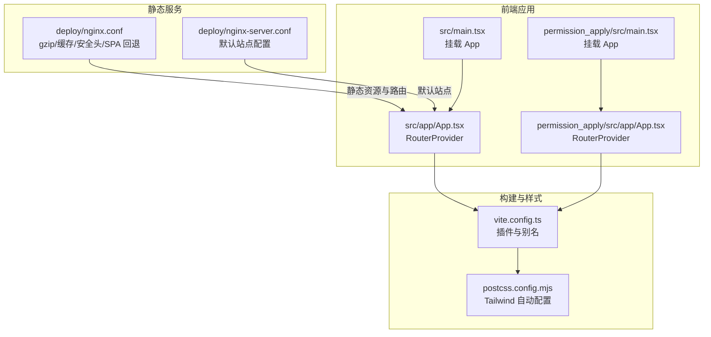
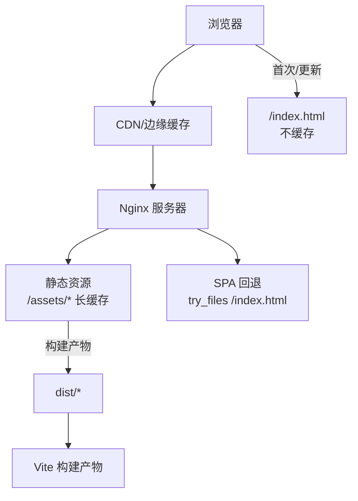
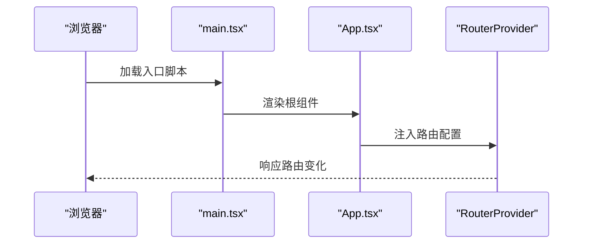
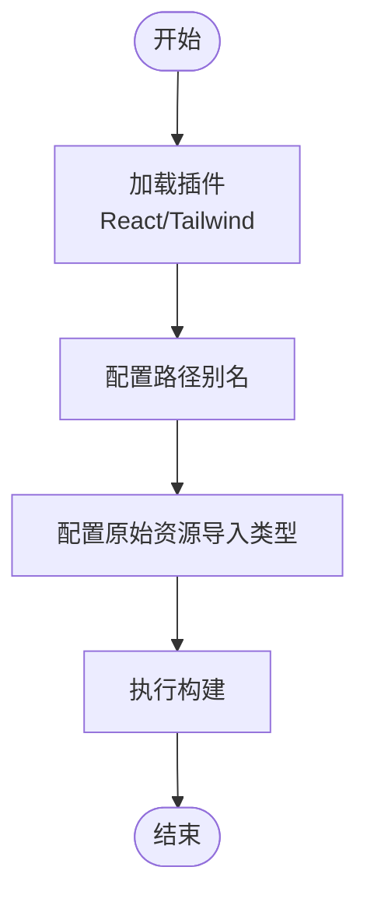
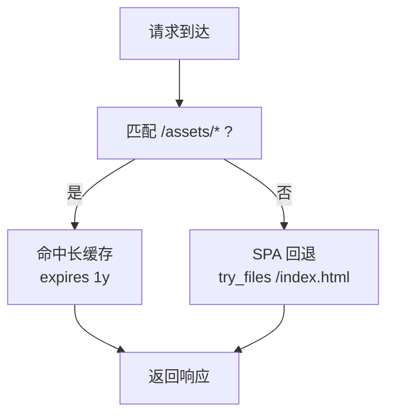
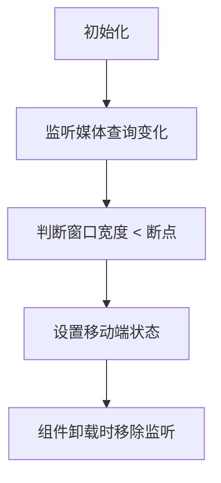
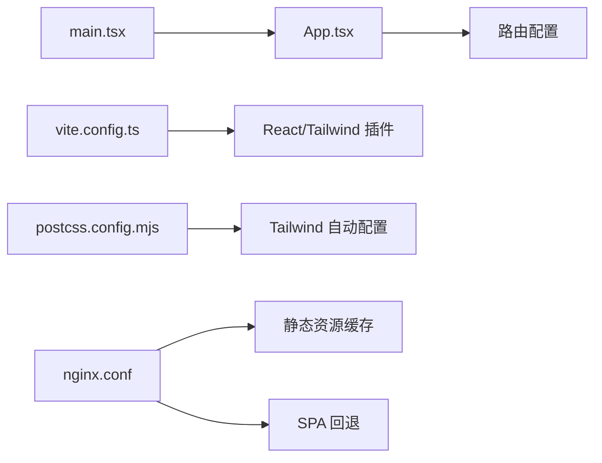

# 监控和性能优化

<cite>
**本文引用的文件**
- [package.json](file://package.json)
- [vite.config.ts](file://vite.config.ts)
- [nginx.conf](file://deploy/nginx.conf)
- [nginx-server.conf](file://deploy/nginx-server.conf)
- [postcss.config.mjs](file://postcss.config.mjs)
- [postcss.config.mjs](file://permission_apply/postcss.config.mjs)
- [src/main.tsx](file://src/main.tsx)
- [permission_apply/src/main.tsx](file://permission_apply/src/main.tsx)
- [src/app/App.tsx](file://src/app/App.tsx)
- [permission_apply/src/app/App.tsx](file://permission_apply/src/app/App.tsx)
- [src/app/components/ui/use-mobile.ts](file://src/app/components/ui/use-mobile.ts)
- [permission_apply/src/app/components/ui/use-mobile.ts](file://permission_apply/src/app/components/ui/use-mobile.ts)
</cite>

## 目录
1. [引言](#引言)
2. [项目结构](#项目结构)
3. [核心组件](#核心组件)
4. [架构总览](#架构总览)
5. [详细组件分析](#详细组件分析)
6. [依赖关系分析](#依赖关系分析)
7. [性能考量](#性能考量)
8. [故障排查指南](#故障排查指南)
9. [结论](#结论)
10. [附录](#附录)

## 引言
本指南围绕“监控与性能优化”主题，结合仓库中的前端构建配置、静态资源服务与基础路由能力，系统阐述应用性能监控、资源使用监控与用户体验监控的落地方法；并给出缓存策略、CDN 配置、网络优化与构建产物优化建议。由于当前仓库未包含后端接口、数据库访问与埋点 SDK，本文以现有前端与 Nginx 配置为基础，提供可操作的优化清单与最佳实践。

## 项目结构
该仓库采用多包结构（主应用与权限申请子应用），均基于 Vite + React 构建，并通过 Nginx 提供静态资源服务与 SPA 路由回退。关键节点如下：
- 构建与打包：Vite 配置与插件（React、Tailwind）用于开发与生产构建。
- 样式管线：PostCSS 配置由 Tailwind 自动管理，无需额外插件。
- 静态资源与路由：Nginx 提供 gzip 压缩、静态资源缓存、SPA 回退与安全头。
- 运行入口：两个应用的 main 入口分别挂载 App 组件，App 组件通过 RouterProvider 注入路由。

图表来源
- [src/main.tsx:1-7](file://src/main.tsx#L1-L7)
- [src/app/App.tsx:1-6](file://src/app/App.tsx#L1-L6)
- [permission_apply/src/main.tsx:1-7](file://permission_apply/src/main.tsx#L1-L7)
- [permission_apply/src/app/App.tsx:1-6](file://permission_apply/src/app/App.tsx#L1-L6)
- [vite.config.ts:1-37](file://vite.config.ts#L1-L37)
- [postcss.config.mjs:1-16](file://postcss.config.mjs#L1-L16)
- [deploy/nginx.conf:1-55](file://deploy/nginx.conf#L1-L55)
- [deploy/nginx-server.conf:1-33](file://deploy/nginx-server.conf#L1-L33)

章节来源
- [src/main.tsx:1-7](file://src/main.tsx#L1-L7)
- [permission_apply/src/main.tsx:1-7](file://permission_apply/src/main.tsx#L1-L7)
- [src/app/App.tsx:1-6](file://src/app/App.tsx#L1-L6)
- [permission_apply/src/app/App.tsx:1-6](file://permission_apply/src/app/App.tsx#L1-L6)
- [vite.config.ts:1-37](file://vite.config.ts#L1-L37)
- [postcss.config.mjs:1-16](file://postcss.config.mjs#L1-L16)
- [deploy/nginx.conf:1-55](file://deploy/nginx.conf#L1-L55)
- [deploy/nginx-server.conf:1-33](file://deploy/nginx-server.conf#L1-L33)

## 核心组件
- 应用入口与路由
  - 主应用与权限申请应用均通过 main.tsx 挂载 App 组件，App 组件使用 RouterProvider 注入路由，形成统一的前端路由体系。
- 构建与样式
  - Vite 配置启用 React 插件与 Tailwind 插件，设置路径别名与原始资源导入类型，保证开发体验与构建稳定性。
  - PostCSS 配置由 Tailwind 自动管理，无需手动引入额外插件。
- 静态服务与缓存
  - Nginx 配置开启 gzip 压缩、设置静态资源长缓存、对 index.html 设置不缓存以确保更新生效，并添加安全头与 SPA 回退。

章节来源
- [src/main.tsx:1-7](file://src/main.tsx#L1-L7)
- [permission_apply/src/main.tsx:1-7](file://permission_apply/src/main.tsx#L1-L7)
- [src/app/App.tsx:1-6](file://src/app/App.tsx#L1-L6)
- [permission_apply/src/app/App.tsx:1-6](file://permission_apply/src/app/App.tsx#L1-L6)
- [vite.config.ts:1-37](file://vite.config.ts#L1-L37)
- [postcss.config.mjs:1-16](file://postcss.config.mjs#L1-L16)
- [deploy/nginx.conf:1-55](file://deploy/nginx.conf#L1-L55)
- [deploy/nginx-server.conf:1-33](file://deploy/nginx-server.conf#L1-L33)

## 架构总览
下图展示从浏览器到静态资源与路由回退的整体链路，以及构建产物在生产环境中的分发方式。

图表来源
- [deploy/nginx.conf:26-42](file://deploy/nginx.conf#L26-L42)
- [deploy/nginx.conf:33-36](file://deploy/nginx.conf#L33-L36)
- [vite.config.ts:34-36](file://vite.config.ts#L34-L36)

## 详细组件分析

### 组件一：应用入口与路由
- 职责
  - main.tsx 负责挂载根组件，App.tsx 负责注入路由，形成前端单页应用骨架。
- 性能影响
  - 路由懒加载与按需渲染可降低首屏负载；路由切换时避免不必要的重渲染。
- 优化建议
  - 对页面级路由进行懒加载；对高频组件使用 memo 化；拆分大组件，减少重绘范围。

图表来源
- [src/main.tsx:1-7](file://src/main.tsx#L1-L7)
- [src/app/App.tsx:1-6](file://src/app/App.tsx#L1-L6)
- [permission_apply/src/main.tsx:1-7](file://permission_apply/src/main.tsx#L1-L7)
- [permission_apply/src/app/App.tsx:1-6](file://permission_apply/src/app/App.tsx#L1-L6)

章节来源
- [src/main.tsx:1-7](file://src/main.tsx#L1-L7)
- [permission_apply/src/main.tsx:1-7](file://permission_apply/src/main.tsx#L1-L7)
- [src/app/App.tsx:1-6](file://src/app/App.tsx#L1-L6)
- [permission_apply/src/app/App.tsx:1-6](file://permission_apply/src/app/App.tsx#L1-L6)

### 组件二：构建与样式管线
- 职责
  - Vite 配置启用 React 与 Tailwind 插件，设置路径别名与资源导入类型，保障开发与生产一致性。
- 性能影响
  - 合理的别名与资源导入可减少模块解析开销；Tailwind 自动裁剪样式，有助于减小 CSS 体积。
- 优化建议
  - 在生产构建中开启压缩与 Tree Shaking；保持 Tailwind 自动模式，避免手动引入插件导致的重复处理。

图表来源
- [vite.config.ts:19-36](file://vite.config.ts#L19-L36)
- [postcss.config.mjs:1-16](file://postcss.config.mjs#L1-L16)

章节来源
- [vite.config.ts:1-37](file://vite.config.ts#L1-L37)
- [postcss.config.mjs:1-16](file://postcss.config.mjs#L1-L16)
- [permission_apply/postcss.config.mjs:1-16](file://permission_apply/postcss.config.mjs#L1-L16)

### 组件三：静态服务与缓存策略
- 职责
  - Nginx 提供 gzip 压缩、静态资源长缓存、SPA 回退与安全头。
- 性能影响
  - 长缓存显著降低带宽与二次加载时间；gzip 压缩减少传输体积；SPA 回退确保刷新与直连路由可用。
- 优化建议
  - 对含哈希的静态资源设置一年长缓存；对 index.html 设置 no-cache；合理设置安全头；必要时接入 CDN 与 HTTPS。

图表来源
- [deploy/nginx.conf:26-42](file://deploy/nginx.conf#L26-L42)
- [deploy/nginx.conf:33-36](file://deploy/nginx.conf#L33-L36)

章节来源
- [deploy/nginx.conf:1-55](file://deploy/nginx.conf#L1-L55)
- [deploy/nginx-server.conf:1-33](file://deploy/nginx-server.conf#L1-L33)

### 组件四：移动端适配与用户体验
- 职责
  - use-mobile 工具函数根据断点判断移动端状态，便于条件渲染与布局优化。
- 性能影响
  - 条件渲染可减少移动端冗余计算与 DOM 结构；媒体查询监听需注意事件解绑，避免内存泄漏。
- 优化建议
  - 使用 CSS 媒体查询与逻辑断点结合；在组件卸载时清理监听器；对移动端交互进行节流/防抖。

图表来源
- [src/app/components/ui/use-mobile.ts:1-21](file://src/app/components/ui/use-mobile.ts#L1-L21)
- [permission_apply/src/app/components/ui/use-mobile.ts:1-21](file://permission_apply/src/app/components/ui/use-mobile.ts#L1-L21)

章节来源
- [src/app/components/ui/use-mobile.ts:1-21](file://src/app/components/ui/use-mobile.ts#L1-L21)
- [permission_apply/src/app/components/ui/use-mobile.ts:1-21](file://permission_apply/src/app/components/ui/use-mobile.ts#L1-L21)

## 依赖关系分析
- 组件耦合
  - main.tsx 仅负责挂载，App.tsx 负责路由注入，职责清晰，耦合度低。
  - Vite 与 PostCSS 配置独立于业务逻辑，便于维护。
- 外部依赖
  - React 生态与 UI 组件库广泛使用，建议关注版本兼容性与体积控制。
- 可能的优化点
  - 对第三方库进行按需引入与摇树优化；对大体积依赖进行拆分与懒加载。

图表来源
- [src/main.tsx:1-7](file://src/main.tsx#L1-L7)
- [src/app/App.tsx:1-6](file://src/app/App.tsx#L1-L6)
- [vite.config.ts:19-26](file://vite.config.ts#L19-L26)
- [postcss.config.mjs:1-16](file://postcss.config.mjs#L1-L16)
- [deploy/nginx.conf:18-42](file://deploy/nginx.conf#L18-L42)

章节来源
- [package.json:11-66](file://package.json#L11-L66)
- [vite.config.ts:1-37](file://vite.config.ts#L1-L37)
- [deploy/nginx.conf:1-55](file://deploy/nginx.conf#L1-L55)

## 性能考量
- 构建与资源优化
  - 使用 Vite 的原生 ES 模块与按需编译，减少打包体积与启动时间。
  - 保持 Tailwind 自动模式，避免重复插件引入。
  - 对含哈希的静态资源设置一年长缓存，对 index.html 设置不缓存。
- 网络与传输
  - 开启 gzip 压缩，覆盖常见文本与脚本类型。
  - 建议接入 CDN 与 HTTPS，提升全球访问速度与安全性。
- 用户体验
  - 使用媒体查询与断点工具进行移动端优化，减少冗余渲染。
  - 对高频交互进行节流/防抖，避免主线程阻塞。
- 指标与监控（基于现有配置的可落地项）
  - 首屏时间：测量从导航到首屏内容绘制的时间。
  - 资源加载：统计静态资源请求数量与体积，识别超大文件。
  - 缓存命中率：监控 /assets/* 的缓存命中情况。
  - SPA 回退：确认刷新与直连路由的回退行为正常。
  - 安全头：验证 X-Frame-Options、X-Content-Type-Options、X-XSS-Protection 是否生效。
- 告警建议
  - 缓存命中率低于阈值时告警。
  - 首屏时间超过阈值时告警。
  - SPA 回退失败或 404 页面异常时告警。

## 故障排查指南
- 首屏加载缓慢
  - 检查 gzip 是否启用与压缩类型是否覆盖目标资源。
  - 确认静态资源缓存策略是否正确应用。
  - 排查是否存在未哈希的静态资源被错误缓存。
- 刷新或直连路由 404
  - 检查 Nginx 的 try_files 配置是否指向 index.html。
  - 确认 index.html 的缓存策略未被强制缓存。
- 移动端显示异常
  - 检查断点监听是否在组件卸载时正确移除。
  - 确认媒体查询断点与设计稿一致。
- 安全头缺失
  - 检查 Nginx 中的安全头配置是否启用。
  - 确保生产环境已启用 HTTPS 并正确配置证书。

章节来源
- [deploy/nginx.conf:18-42](file://deploy/nginx.conf#L18-L42)
- [deploy/nginx.conf:33-36](file://deploy/nginx.conf#L33-L36)
- [src/app/components/ui/use-mobile.ts:10-18](file://src/app/components/ui/use-mobile.ts#L10-L18)
- [permission_apply/src/app/components/ui/use-mobile.ts:10-18](file://permission_apply/src/app/components/ui/use-mobile.ts#L10-L18)

## 结论
本指南基于现有前端与 Nginx 配置，给出了可操作的性能优化清单与监控建议。建议在现有基础上进一步完善埋点与后端接口监控，以实现端到端的性能可观测性；同时结合 CDN 与 HTTPS，持续优化全球访问体验。

## 附录
- 术语表
  - 首屏时间：从用户发起请求到首屏内容绘制完成的时间。
  - 缓存命中率：成功命中缓存的请求占总请求的比例。
  - SPA 回退：当路由无法匹配静态文件时，回退到 index.html 的机制。
- 参考配置位置
  - 构建与插件：[vite.config.ts:19-36](file://vite.config.ts#L19-L36)
  - 样式管线：[postcss.config.mjs:1-16](file://postcss.config.mjs#L1-L16)
  - 静态服务与缓存：[deploy/nginx.conf:18-42](file://deploy/nginx.conf#L18-L42)
  - SPA 回退：[deploy/nginx.conf:33-36](file://deploy/nginx.conf#L33-L36)
  - 移动端断点：[src/app/components/ui/use-mobile.ts:3](file://src/app/components/ui/use-mobile.ts#L3)