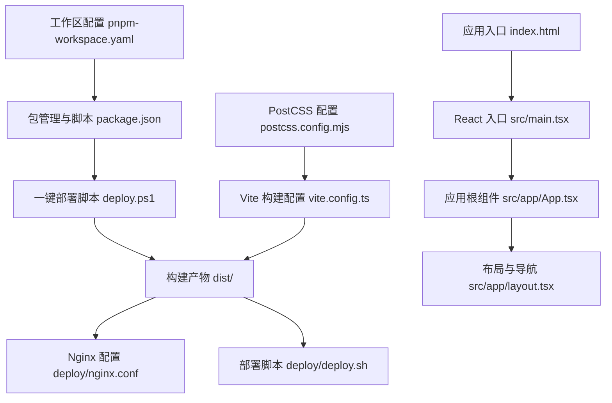
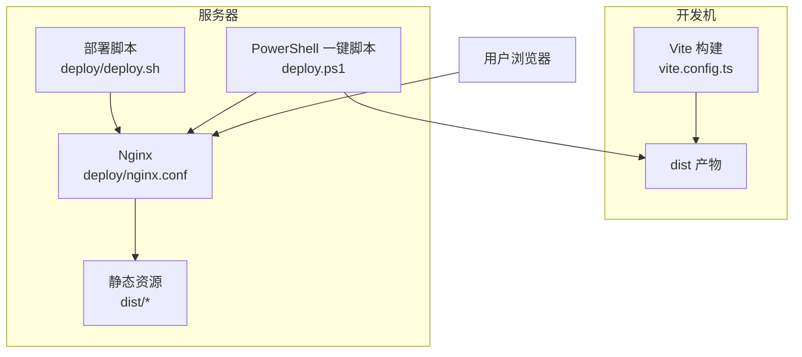
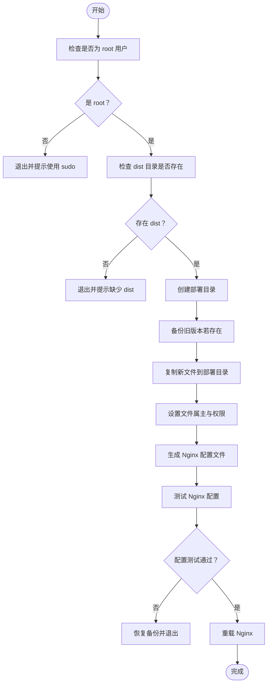
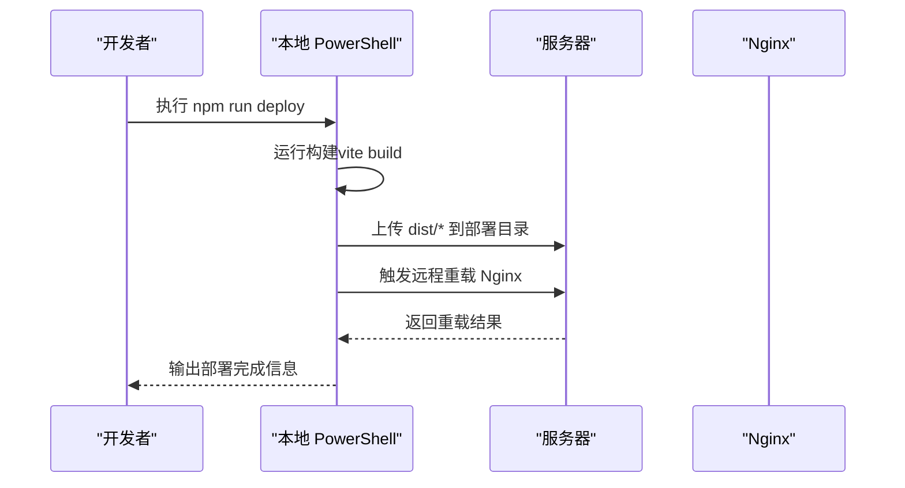
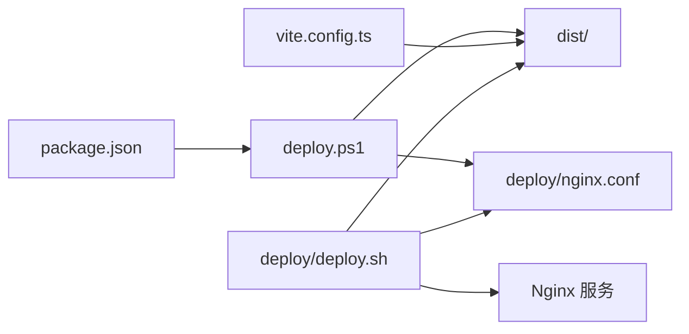
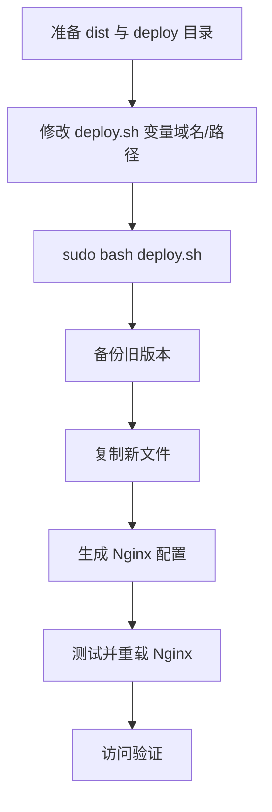
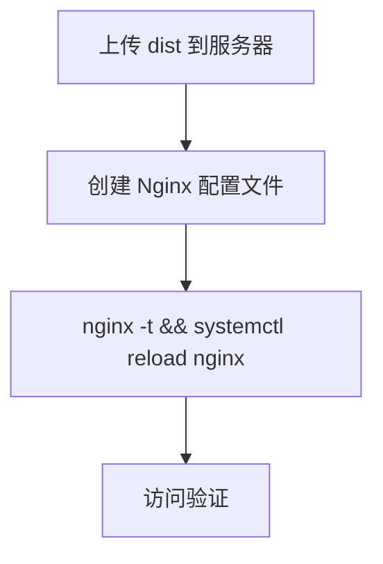

# 部署和运维

<cite>
**本文引用的文件**
- [deploy/README.md](file://deploy/README.md)
- [deploy/deploy.sh](file://deploy/deploy.sh)
- [deploy/nginx.conf](file://deploy/nginx.conf)
- [deploy/nginx-server.conf](file://deploy/nginx-server.conf)
- [deploy.ps1](file://deploy.ps1)
- [package.json](file://package.json)
- [vite.config.ts](file://vite.config.ts)
- [pnpm-workspace.yaml](file://pnpm-workspace.yaml)
- [postcss.config.mjs](file://postcss.config.mjs)
- [src/main.tsx](file://src/main.tsx)
- [src/app/App.tsx](file://src/app/App.tsx)
- [src/app/layout.tsx](file://src/app/layout.tsx)
- [index.html](file://index.html)
</cite>

## 目录
1. [简介](#简介)
2. [项目结构](#项目结构)
3. [核心组件](#核心组件)
4. [架构总览](#架构总览)
5. [详细组件分析](#详细组件分析)
6. [依赖关系分析](#依赖关系分析)
7. [性能考虑](#性能考虑)
8. [故障排除指南](#故障排除指南)
9. [结论](#结论)
10. [附录](#附录)

## 简介
本指南面向部署与运维工程师，提供从构建配置、部署脚本、环境配置到性能优化与监控的完整操作手册。项目采用前端单页应用（SPA），通过 Nginx 提供静态资源服务，并支持 gzip 压缩、静态资源缓存与安全头设置。部署方式包括自动化脚本与手动部署两种模式；同时提供 HTTPS 可选配置与一键构建上传脚本，便于快速上线与回滚。

## 项目结构
- 构建产物位于 dist/，包含入口 HTML 与按哈希命名的 JS/CSS 资源，适合长期缓存策略。
- 部署相关文件集中在 deploy/ 目录，包含部署脚本、Nginx 配置模板与使用说明。
- 应用入口与路由由 Vite 构建生成，index.html 引入主入口脚本，React 应用通过路由驱动页面切换。

图表来源
- [deploy/nginx.conf:1-55](file://deploy/nginx.conf#L1-L55)
- [deploy/deploy.sh:1-107](file://deploy/deploy.sh#L1-L107)
- [deploy.ps1:1-65](file://deploy.ps1#L1-L65)
- [vite.config.ts:1-37](file://vite.config.ts#L1-L37)
- [package.json:1-91](file://package.json#L1-L91)
- [postcss.config.mjs:1-16](file://postcss.config.mjs#L1-L16)
- [pnpm-workspace.yaml:1-10](file://pnpm-workspace.yaml#L1-L10)
- [index.html:1-22](file://index.html#L1-L22)
- [src/main.tsx:1-7](file://src/main.tsx#L1-L7)
- [src/app/App.tsx:1-6](file://src/app/App.tsx#L1-L6)
- [src/app/layout.tsx:1-175](file://src/app/layout.tsx#L1-L175)

章节来源
- [deploy/README.md:1-142](file://deploy/README.md#L1-L142)
- [package.json:1-91](file://package.json#L1-L91)

## 核心组件
- 构建与打包
  - 使用 Vite 进行构建，生成带哈希的静态资源，利于浏览器缓存与 CDN 分发。
  - 支持自定义别名与插件链（React、Tailwind、Figma 资产解析器）。
- 部署脚本
  - 自动化部署脚本负责备份旧版本、复制新文件、设置权限、生成 Nginx 配置并重载服务。
  - 提供一键 PowerShell 脚本，自动构建并上传至服务器，最后尝试重载 Nginx。
- Nginx 配置
  - 提供标准与默认站点两类配置模板，包含 gzip、静态资源缓存、SPA 路由回退、错误页映射与安全头等。
  - 支持 HTTPS 可选启用与证书路径配置。

章节来源
- [vite.config.ts:1-37](file://vite.config.ts#L1-L37)
- [deploy/deploy.sh:1-107](file://deploy/deploy.sh#L1-L107)
- [deploy.ps1:1-65](file://deploy.ps1#L1-L65)
- [deploy/nginx.conf:1-55](file://deploy/nginx.conf#L1-L55)
- [deploy/nginx-server.conf:1-33](file://deploy/nginx-server.conf#L1-L33)

## 架构总览
前端应用通过 Nginx 对外提供服务，Nginx 负责静态资源分发、缓存控制、gzip 压缩与 SPA 路由回退。部署流程分为自动化与手动两种模式，均以 dist 产物为核心，结合 Nginx 配置实现快速上线与回滚。

图表来源
- [vite.config.ts:1-37](file://vite.config.ts#L1-L37)
- [deploy/deploy.sh:1-107](file://deploy/deploy.sh#L1-L107)
- [deploy.ps1:1-65](file://deploy.ps1#L1-L65)
- [deploy/nginx.conf:1-55](file://deploy/nginx.conf#L1-L55)

## 详细组件分析

### 自动化部署脚本（Linux）
该脚本负责完整的部署生命周期：校验权限与构建产物、备份旧版本、复制新文件、设置权限、生成 Nginx 配置、测试并重载服务，失败时自动回滚。

图表来源
- [deploy/deploy.sh:25-93](file://deploy/deploy.sh#L25-L93)

章节来源
- [deploy/deploy.sh:1-107](file://deploy/deploy.sh#L1-L107)

### 一键部署脚本（Windows）
该脚本在本地执行构建、上传 dist 内容到服务器，并尝试远程重载 Nginx，适合 CI/CD 或本地快速发布。

图表来源
- [deploy.ps1:22-55](file://deploy.ps1#L22-L55)
- [package.json:6-9](file://package.json#L6-L9)

章节来源
- [deploy.ps1:1-65](file://deploy.ps1#L1-L65)
- [package.json:1-91](file://package.json#L1-L91)

### Nginx 配置要点
- gzip 压缩：开启压缩并指定类型，提升传输效率。
- 静态资源缓存：对带哈希的 /assets/ 资源设置一年缓存与 immutable 标记，index.html 不缓存以保证热更新。
- SPA 路由回退：所有未命中路径回退到 /index.html，配合前端路由。
- 安全头：设置 X-Frame-Options、X-Content-Type-Options、X-XSS-Protection。
- HTTPS：提供注释化的 443 端口监听与证书路径配置，按需启用。

章节来源
- [deploy/nginx.conf:18-54](file://deploy/nginx.conf#L18-L54)
- [deploy/nginx-server.conf:9-32](file://deploy/nginx-server.conf#L9-L32)

### 构建配置与静态资源策略
- Vite 插件链：React、Tailwind、Figma 资产解析器，确保样式与资源正确打包。
- 资源别名：@ 指向 src 目录，简化导入路径。
- 原始资源支持：SVG、CSV 等文件类型支持 raw 导入。
- 工作区与包管理：pnpm 工作区声明与 overrides，统一依赖版本。

章节来源
- [vite.config.ts:19-36](file://vite.config.ts#L19-L36)
- [pnpm-workspace.yaml:1-10](file://pnpm-workspace.yaml#L1-L10)
- [postcss.config.mjs:1-16](file://postcss.config.mjs#L1-L16)

### 应用入口与路由
- index.html：定义根节点与应用入口脚本路径。
- React 入口：创建根容器并渲染 App。
- App 组件：通过 RouterProvider 注入路由。
- 布局组件：提供侧边栏导航、面包屑与全局上下文，支撑多模块页面。

章节来源
- [index.html:15-21](file://index.html#L15-L21)
- [src/main.tsx:1-7](file://src/main.tsx#L1-L7)
- [src/app/App.tsx:1-6](file://src/app/App.tsx#L1-L6)
- [src/app/layout.tsx:74-175](file://src/app/layout.tsx#L74-L175)

## 依赖关系分析
- package.json 定义构建与部署脚本入口，关联 deploy.ps1。
- vite.config.ts 控制构建行为与资源处理。
- deploy/nginx.conf 与 deploy/nginx-server.conf 作为 Nginx 配置模板，被部署脚本写入系统配置目录。
- deploy/deploy.sh 依赖 dist 产物与 Nginx 配置模板，完成部署与回滚。
- deploy.ps1 依赖本地构建与远端 Nginx 重载能力。

图表来源
- [package.json:6-9](file://package.json#L6-L9)
- [deploy.ps1:22-55](file://deploy.ps1#L22-L55)
- [vite.config.ts:19-36](file://vite.config.ts#L19-L36)
- [deploy/deploy.sh:67-93](file://deploy/deploy.sh#L67-L93)
- [deploy/nginx.conf:1-55](file://deploy/nginx.conf#L1-L55)

章节来源
- [package.json:1-91](file://package.json#L1-L91)
- [deploy/deploy.sh:1-107](file://deploy/deploy.sh#L1-L107)
- [deploy.ps1:1-65](file://deploy.ps1#L1-L65)
- [vite.config.ts:1-37](file://vite.config.ts#L1-L37)

## 性能考虑
- 静态资源缓存
  - 带哈希的 /assets/ 文件设置一年缓存与 immutable，显著降低带宽与服务器压力。
  - index.html 不缓存，确保前端更新即时生效。
- 压缩传输
  - 启用 gzip 并覆盖常见文本与脚本类型，减少传输体积。
- SPA 路由
  - try_files 回退到 /index.html，避免 404 并保持前端路由一致性。
- 安全与稳定性
  - 添加安全响应头，降低点击劫持、嗅探与 XSS 风险。
  - 错误页映射到 /index.html，改善用户体验。
- HTTPS
  - 提供 HTTPS 可选配置，建议在生产环境强制启用并配置强密码套件与 HSTS。

章节来源
- [deploy/nginx.conf:26-54](file://deploy/nginx.conf#L26-L54)
- [deploy/nginx-server.conf:15-28](file://deploy/nginx-server.conf#L15-L28)

## 故障排除指南
- 部署脚本执行失败
  - 确认以 root 或 sudo 权限运行。
  - 确保 dist 目录存在且包含构建产物。
  - 若 Nginx 配置测试失败，脚本会自动回滚旧版本，检查配置文件语法与路径。
- Nginx 无法重载
  - 检查 systemctl 或 nginx -s reload 是否可用；确认配置文件路径与权限。
- 静态资源未更新
  - 确认 index.html 未被缓存（已在配置中设置不缓存）。
  - 检查浏览器缓存或网络代理是否强制缓存。
- HTTPS 未生效
  - 确认证书路径与权限正确，取消注释并启用 443 监听。
- 一键脚本上传失败
  - 检查 SSH 连接、服务器用户名与 IP、防火墙放通情况。

章节来源
- [deploy/deploy.sh:25-93](file://deploy/deploy.sh#L25-L93)
- [deploy.ps1:38-55](file://deploy.ps1#L38-L55)
- [deploy/README.md:105-142](file://deploy/README.md#L105-L142)

## 结论
本项目提供了完善的前端部署与运维方案：清晰的构建配置、可复用的 Nginx 模板、自动化与手动双通道部署脚本，以及 HTTPS 与缓存策略建议。遵循本文档可实现稳定、高效、可回滚的上线流程，并具备良好的扩展性与安全性。

## 附录
- 部署流程图（自动化）

图表来源
- [deploy/README.md:10-48](file://deploy/README.md#L10-L48)
- [deploy/deploy.sh:11-93](file://deploy/deploy.sh#L11-L93)

- 部署流程图（手动）

图表来源
- [deploy/README.md:52-102](file://deploy/README.md#L52-L102)

- 更新与回滚
  - 重新构建并上传新 dist，无需重启 Nginx（index.html 不缓存）。
  - 自动化脚本会在部署前自动备份旧版本，失败时回滚。
  
章节来源
- [deploy/README.md:127-142](file://deploy/README.md#L127-L142)
- [deploy/deploy.sh:43-52](file://deploy/deploy.sh#L43-L52)