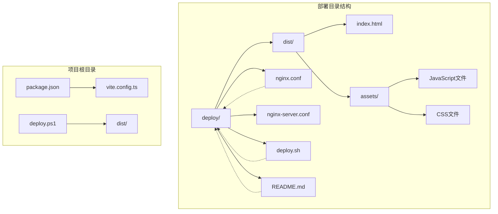
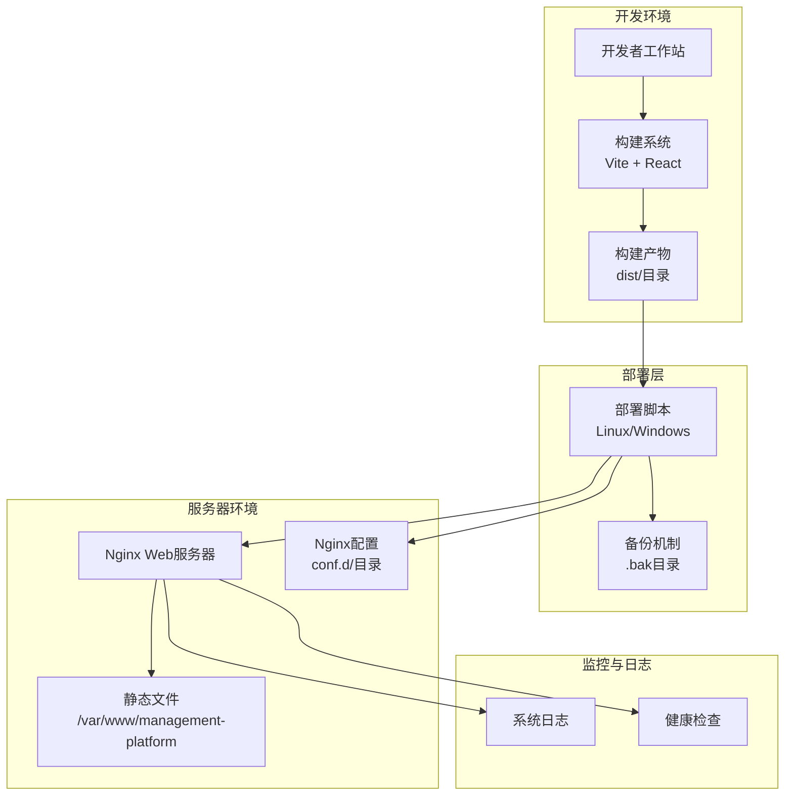
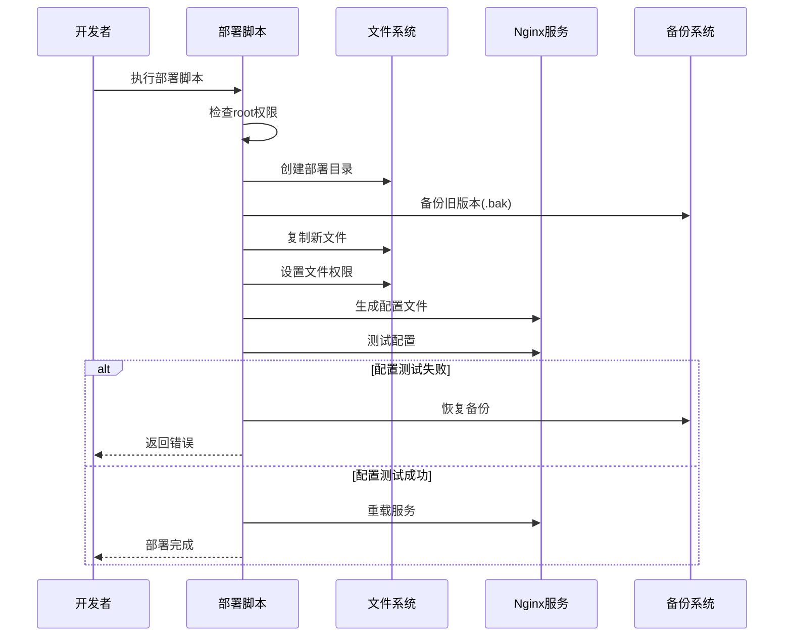
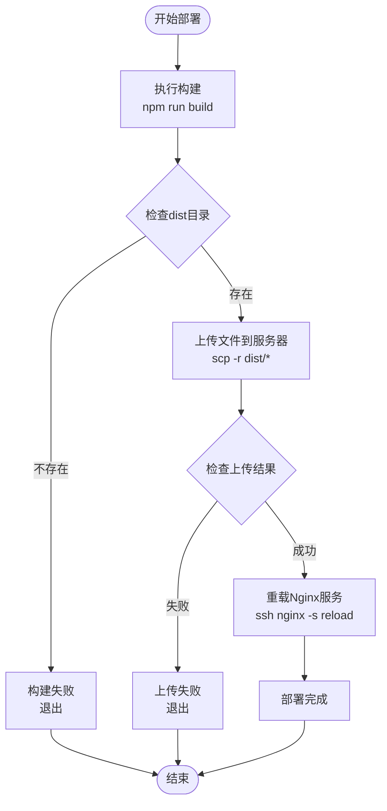
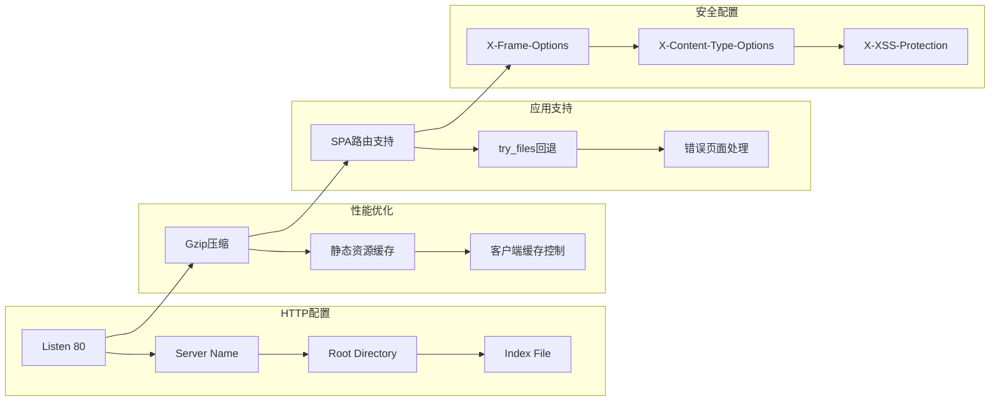
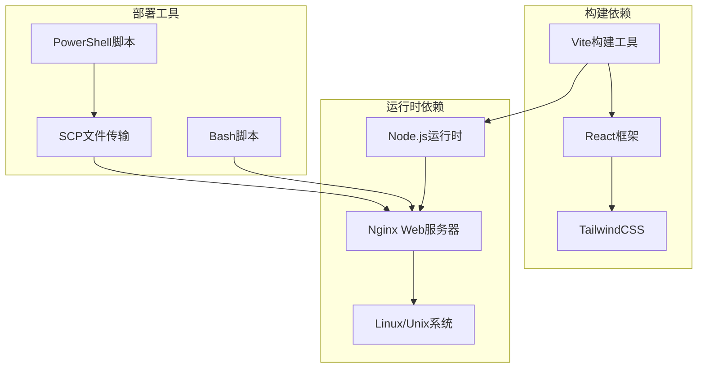

# 部署脚本

<cite>
**本文档引用的文件**
- [deploy.sh](file://deploy/deploy.sh)
- [deploy.ps1](file://deploy.ps1)
- [README.md](file://deploy/README.md)
- [nginx.conf](file://deploy/nginx.conf)
- [nginx-server.conf](file://deploy/nginx-server.conf)
- [package.json](file://package.json)
- [vite.config.ts](file://vite.config.ts)
</cite>

## 目录
1. [简介](#简介)
2. [项目结构](#项目结构)
3. [核心组件](#核心组件)
4. [架构概览](#架构概览)
5. [详细组件分析](#详细组件分析)
6. [依赖关系分析](#依赖关系分析)
7. [性能考虑](#性能考虑)
8. [故障排除指南](#故障排除指南)
9. [结论](#结论)
10. [附录](#附录)

## 简介

本指南详细介绍了国泰君安期货移仓业务管理系统的部署脚本操作流程。该系统采用现代化的前端技术栈，包括 Vite 构建工具、React 组件库和 Nginx 作为反向代理服务器。部署脚本提供了完整的自动化部署解决方案，支持 Linux 和 Windows 环境，具备完善的错误处理机制和回滚策略。

系统的核心特点：
- **双平台支持**：同时支持 Linux Bash 脚本和 Windows PowerShell 脚本
- **自动化部署**：从构建到发布的完整自动化流程
- **安全机制**：包含权限设置、备份恢复和错误处理
- **灵活配置**：支持域名配置、HTTPS 选项和自定义部署路径

## 项目结构

该项目采用模块化组织方式，部署相关的核心文件分布如下：



**图表来源**
- [deploy.sh:1-107](file://deploy/deploy.sh#L1-L107)
- [deploy/README.md:1-142](file://deploy/README.md#L1-L142)

**章节来源**
- [deploy/README.md:10-50](file://deploy/README.md#L10-L50)
- [package.json:1-91](file://package.json#L1-L91)

## 核心组件

### Linux 部署脚本 (deploy.sh)

Linux 部署脚本是整个部署系统的核心组件，提供了完整的自动化部署流程：

**主要功能特性：**
- **用户权限检查**：确保以 root 权限执行
- **文件完整性验证**：检查 dist 目录的存在性
- **智能备份机制**：自动创建旧版本备份
- **权限设置**：自动配置文件所有权和权限
- **Nginx 配置**：动态生成配置文件
- **配置测试**：验证 Nginx 配置正确性
- **回滚机制**：配置失败时自动恢复

**配置参数：**
- `DEPLOY_DIR`：部署目录路径（默认：`/var/www/management-platform`）
- `NGINX_CONF_DIR`：Nginx 配置目录（默认：`/etc/nginx/conf.d`）
- `SERVER_NAME`：服务器域名或 IP 地址

**章节来源**
- [deploy.sh:11-18](file://deploy/deploy.sh#L11-L18)
- [deploy.sh:25-36](file://deploy/deploy.sh#L25-L36)
- [deploy.sh:43-52](file://deploy/deploy.sh#L43-L52)

### Windows 部署脚本 (deploy.ps1)

Windows PowerShell 脚本提供了与 Linux 版本等价的功能，但针对 Windows 环境进行了优化：

**核心流程：**
1. **项目构建**：自动执行 `npm run build` 命令
2. **文件检查**：验证 dist 目录的存在性
3. **远程上传**：使用 SCP 协议上传文件到服务器
4. **服务重载**：自动重载 Nginx 服务

**服务器配置：**
- `SERVER_IP`：目标服务器 IP 地址
- `SERVER_USER`：服务器用户名（默认：root）
- `DEPLOY_PATH`：部署路径（默认：`/var/www/management-platform`）

**章节来源**
- [deploy.ps1:6-10](file://deploy.ps1#L6-L10)
- [deploy.ps1:22-29](file://deploy.ps1#L22-L29)
- [deploy.ps1:38-46](file://deploy.ps1#L38-L46)

### Nginx 配置文件

系统提供了两个版本的 Nginx 配置文件，满足不同的部署需求：

**主配置文件 (nginx.conf)：**
- 支持 gzip 压缩优化
- 静态资源长期缓存策略
- SPA 应用路由支持
- 安全头部配置
- HTTPS 可选支持

**服务器配置文件 (nginx-server.conf)：**
- 默认服务器配置
- 简化的静态资源处理
- 基础的 SPA 路由支持

**章节来源**
- [nginx.conf:5-54](file://deploy/nginx.conf#L5-L54)
- [nginx-server.conf:1-33](file://deploy/nginx-server.conf#L1-L33)

## 架构概览

部署系统的整体架构采用分层设计，确保了高可用性和可维护性：



**图表来源**
- [deploy.sh:38-63](file://deploy/deploy.sh#L38-L63)
- [deploy.ps1:22-29](file://deploy.ps1#L22-L29)
- [nginx.conf:14-42](file://deploy/nginx.conf#L14-L42)

## 详细组件分析

### Linux 部署流程详解

Linux 部署脚本实现了七步完整的部署流程，每一步都包含了完善的错误处理机制：



**图表来源**
- [deploy.sh:25-30](file://deploy/deploy.sh#L25-L30)
- [deploy.sh:43-52](file://deploy/deploy.sh#L43-L52)
- [deploy.sh:75-88](file://deploy/deploy.sh#L75-L88)

**部署流程详细说明：**

1. **权限检查阶段**
   - 验证当前用户是否具有 root 权限
   - 提供正确的执行方式指导

2. **备份准备阶段**
   - 删除之前的备份目录
   - 将现有部署目录重命名为 `.bak` 后缀
   - 首次部署时跳过备份步骤

3. **文件传输阶段**
   - 复制所有构建产物到部署目录
   - 确保文件完整性

4. **权限设置阶段**
   - 尝试设置 nginx 用户所有权
   - 备用 www-data 用户所有权
   - 设置 755 权限

5. **配置生成阶段**
   - 使用 sed 命令替换配置模板中的域名
   - 写入到 Nginx 配置目录

6. **配置验证阶段**
   - 执行 `nginx -t` 进行语法检查
   - 配置失败时自动恢复备份

7. **服务重载阶段**
   - 优先使用 systemd 重载
   - 备用信号重载方式

**章节来源**
- [deploy.sh:25-107](file://deploy/deploy.sh#L25-L107)

### Windows 部署流程详解

Windows PowerShell 脚本提供了简化的部署流程，专注于自动化构建和文件传输：



**图表来源**
- [deploy.ps1:22-29](file://deploy.ps1#L22-L29)
- [deploy.ps1:38-46](file://deploy.ps1#L38-L46)
- [deploy.ps1:48-55](file://deploy.ps1#L48-L55)

**Windows 部署特点：**
- **自动构建**：集成 Vite 构建过程
- **远程传输**：使用 SCP 协议进行文件传输
- **服务管理**：通过 SSH 远程重载 Nginx
- **错误处理**：每个步骤都有明确的错误检查

**章节来源**
- [deploy.ps1:22-65](file://deploy.ps1#L22-L65)

### Nginx 配置深度解析

Nginx 配置文件采用了现代 Web 应用的最佳实践：



**图表来源**
- [nginx.conf:5-54](file://deploy/nginx.conf#L5-L54)

**配置要点：**
- **gzip 压缩**：启用多种类型的文件压缩
- **静态资源缓存**：长期缓存带哈希的文件
- **SPA 路由**：支持前端路由的单页应用
- **安全头部**：提供基本的安全保护
- **HTTPS 支持**：预留 SSL 配置位置

**章节来源**
- [nginx.conf:18-42](file://deploy/nginx.conf#L18-L42)
- [nginx.conf:50-54](file://deploy/nginx.conf#L50-L54)

## 依赖关系分析

部署系统的依赖关系相对简单，主要涉及构建工具、Web 服务器和操作系统组件：



**图表来源**
- [package.json:6-10](file://package.json#L6-L10)
- [vite.config.ts:19-36](file://vite.config.ts#L19-L36)

**依赖关系特点：**
- **构建链路**：Vite → React → Tailwind → 最终产物
- **运行时要求**：Node.js + Nginx + Linux 系统
- **部署工具**：跨平台支持 Bash 和 PowerShell
- **传输协议**：SCP 协议用于文件传输

**章节来源**
- [package.json:69-72](file://package.json#L69-L72)
- [vite.config.ts:20-26](file://vite.config.ts#L20-L26)

## 性能考虑

部署脚本在设计时充分考虑了性能优化和用户体验：

### 构建性能优化
- **增量构建**：利用 Vite 的热重载和快速构建能力
- **资源优化**：自动处理静态资源的哈希命名
- **压缩策略**：启用 gzip 压缩减少传输时间

### 服务器性能优化
- **缓存策略**：静态资源长期缓存，入口文件不缓存
- **路由优化**：SPA 应用的高效路由处理
- **并发处理**：Nginx 的高性能并发处理能力

### 部署性能优化
- **并行处理**：构建和部署步骤的合理安排
- **错误恢复**：快速检测和恢复机制
- **最小化停机**：零停机部署策略

## 故障排除指南

### 常见问题及解决方案

**1. 权限相关问题**
- **症状**：脚本执行时报权限不足错误
- **原因**：非 root 用户执行部署脚本
- **解决**：使用 `sudo bash deploy.sh` 或 `sudo powershell -ExecutionPolicy Bypass -File deploy.ps1`

**2. 文件传输失败**
- **症状**：Windows 脚本显示上传失败
- **原因**：SSH 连接问题或网络中断
- **解决**：检查服务器连接、防火墙设置和 SSH 服务状态

**3. Nginx 配置错误**
- **症状**：配置测试失败，部署回滚
- **原因**：域名配置错误或权限问题
- **解决**：检查 `SERVER_NAME` 配置，确认 Nginx 配置目录权限

**4. 首次部署问题**
- **症状**：备份目录创建失败
- **原因**：部署目录权限不足
- **解决**：手动创建部署目录并设置适当权限

### 调试技巧

**Linux 环境调试：**
```bash
# 查看脚本执行详情
set -x
./deploy.sh

# 检查 Nginx 配置
nginx -t

# 查看系统日志
journalctl -u nginx
```

**Windows 环境调试：**
```powershell
# 启用详细输出
$VerbosePreference = "Continue"

# 检查 SSH 连接
ssh -T root@服务器IP

# 查看 PowerShell 详细错误
$ErrorActionPreference = "Continue"
```

**章节来源**
- [deploy.sh:25-30](file://deploy/deploy.sh#L25-L30)
- [deploy.ps1:25-28](file://deploy.ps1#L25-L28)
- [deploy.sh:75-88](file://deploy.sh#L75-L88)

## 结论

该部署脚本系统为国泰君安期货移仓业务管理系统提供了完整、可靠的自动化部署解决方案。通过精心设计的架构和完善的错误处理机制，确保了部署过程的稳定性和可靠性。

**主要优势：**
- **跨平台支持**：同时支持 Linux 和 Windows 环境
- **自动化程度高**：从构建到发布的完整自动化流程
- **安全性强**：包含权限设置、备份恢复和错误处理
- **易于维护**：清晰的代码结构和详细的文档说明

**最佳实践建议：**
- 在生产环境中始终使用 HTTPS 配置
- 定期检查备份机制的有效性
- 建立完善的监控和日志记录系统
- 制定详细的应急响应计划

## 附录

### 环境变量配置

**Linux 部署脚本配置：**
```bash
# 部署目录（可自定义）
DEPLOY_DIR="/var/www/management-platform"

# Nginx 配置目录（根据系统调整）
NGINX_CONF_DIR="/etc/nginx/conf.d"

# 服务器域名或 IP
SERVER_NAME="your-domain.com"
```

**Windows 部署脚本配置：**
```powershell
# 服务器配置
$SERVER_IP = "111.231.55.6"
$SERVER_USER = "root"
$DEPLOY_PATH = "/var/www/management-platform"
```

### 部署前准备工作清单

**Linux 环境：**
- 确保系统已安装 Nginx 和 Git
- 准备 root 用户权限
- 配置防火墙允许 HTTP/HTTPS 访问
- 准备 SSL 证书（如需 HTTPS）

**Windows 环境：**
- 安装 OpenSSH 客户端
- 配置 SSH 密钥认证
- 确保网络连接稳定
- 准备服务器访问凭据

### 安全注意事项

**文件权限设置：**
- 部署目录应设置为 755 权限
- 静态文件应设置为 644 权限
- 配置文件应设置为 644 权限

**网络安全配置：**
- 启用 HTTPS 并配置 SSL 证书
- 配置适当的防火墙规则
- 定期更新 Nginx 和系统补丁
- 实施访问日志和监控

**备份策略：**
- 部署前自动创建备份
- 定期验证备份文件完整性
- 测试备份恢复流程
- 跨地域备份存储