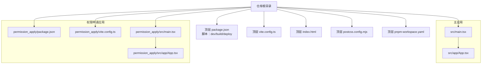
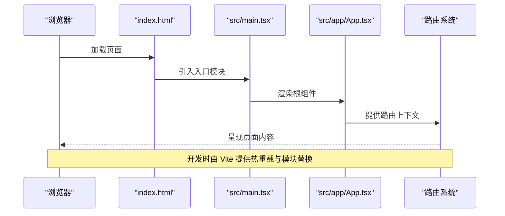
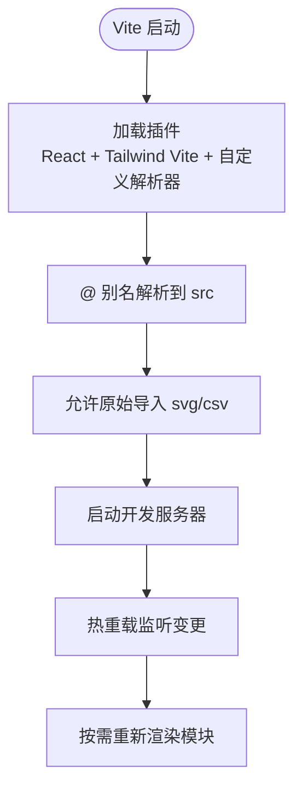
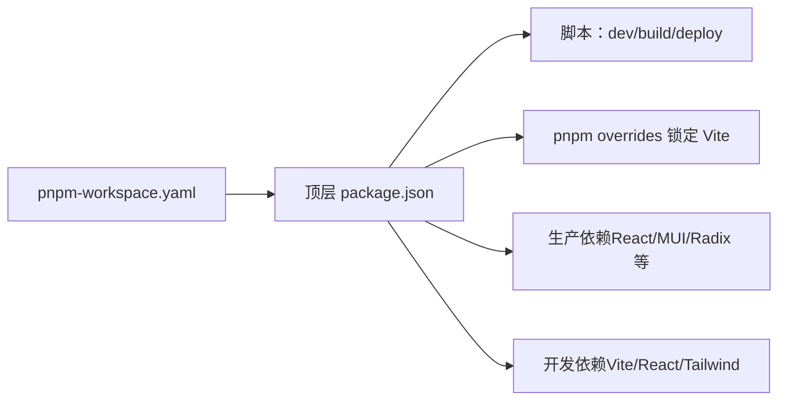
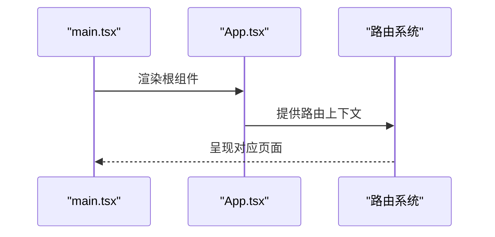

# 开发环境配置

<cite>
**本文引用的文件**
- [package.json](file://package.json)
- [vite.config.ts](file://vite.config.ts)
- [pnpm-workspace.yaml](file://pnpm-workspace.yaml)
- [postcss.config.mjs](file://postcss.config.mjs)
- [README.md](file://README.md)
- [index.html](file://index.html)
- [deploy/deploy.sh](file://deploy/deploy.sh)
- [deploy/nginx.conf](file://deploy/nginx.conf)
- [deploy/nginx-server.conf](file://deploy/nginx-server.conf)
- [src/main.tsx](file://src/main.tsx)
- [src/app/App.tsx](file://src/app/App.tsx)
- [permission_apply/package.json](file://permission_apply/package.json)
- [permission_apply/vite.config.ts](file://permission_apply/vite.config.ts)
- [permission_apply/src/main.tsx](file://permission_apply/src/main.tsx)
- [permission_apply/src/app/App.tsx](file://permission_apply/src/app/App.tsx)
</cite>

## 目录
1. [简介](#简介)
2. [项目结构](#项目结构)
3. [核心组件](#核心组件)
4. [架构总览](#架构总览)
5. [详细组件分析](#详细组件分析)
6. [依赖分析](#依赖分析)
7. [性能考虑](#性能考虑)
8. [故障排除指南](#故障排除指南)
9. [结论](#结论)
10. [附录](#附录)

## 简介
本指南面向管理平台项目的开发者，帮助你在本地快速搭建并运行开发环境。文档覆盖以下方面：
- 环境要求与工具链选择（Node.js 版本、包管理器）
- 依赖安装与开发服务器启动流程
- Vite 构建与热重载机制
- 目录结构与关键配置文件的作用
- 常见问题排查与解决方案

## 项目结构
该仓库采用多包工作区布局，顶层包含主应用与“权限申请”子应用两个独立的 Vite + React 项目，共享部分通用配置。

图表来源
- [package.json:1-91](file://package.json#L1-L91)
- [vite.config.ts:1-37](file://vite.config.ts#L1-L37)
- [index.html:1-22](file://index.html#L1-L22)
- [postcss.config.mjs:1-16](file://postcss.config.mjs#L1-L16)
- [pnpm-workspace.yaml:1-10](file://pnpm-workspace.yaml#L1-L10)
- [src/main.tsx:1-7](file://src/main.tsx#L1-L7)
- [src/app/App.tsx:1-6](file://src/app/App.tsx#L1-L6)
- [permission_apply/package.json:1-90](file://permission_apply/package.json#L1-L90)
- [permission_apply/vite.config.ts:1-37](file://permission_apply/vite.config.ts#L1-L37)
- [permission_apply/src/main.tsx:1-7](file://permission_apply/src/main.tsx#L1-L7)
- [permission_apply/src/app/App.tsx:1-6](file://permission_apply/src/app/App.tsx#L1-L6)

章节来源
- [package.json:1-91](file://package.json#L1-L91)
- [vite.config.ts:1-37](file://vite.config.ts#L1-L37)
- [index.html:1-22](file://index.html#L1-L22)
- [postcss.config.mjs:1-16](file://postcss.config.mjs#L1-L16)
- [pnpm-workspace.yaml:1-10](file://pnpm-workspace.yaml#L1-L10)
- [src/main.tsx:1-7](file://src/main.tsx#L1-L7)
- [src/app/App.tsx:1-6](file://src/app/App.tsx#L1-L6)
- [permission_apply/package.json:1-90](file://permission_apply/package.json#L1-L90)
- [permission_apply/vite.config.ts:1-37](file://permission_apply/vite.config.ts#L1-L37)
- [permission_apply/src/main.tsx:1-7](file://permission_apply/src/main.tsx#L1-L7)
- [permission_apply/src/app/App.tsx:1-6](file://permission_apply/src/app/App.tsx#L1-L6)

## 核心组件
- 包管理与脚本
  - 顶层 package.json 提供开发、构建与部署脚本，分别用于启动 Vite 开发服务器、打包产物以及调用 PowerShell 部署脚本。
- 构建工具
  - Vite 配置启用 React 插件与 Tailwind Vite 插件，并提供别名与静态资源导入能力。
- 样式与工具链
  - PostCSS 配置声明了 Tailwind Vite 自动化插件，无需手动引入 tailwindcss/autoprefixer。
- HTML 入口
  - index.html 作为应用入口，挂载根节点并加载入口模块。
- 应用入口与路由
  - 各应用的 main.tsx 负责渲染根组件，根组件通过 RouterProvider 注入路由。

章节来源
- [package.json:6-10](file://package.json#L6-L10)
- [vite.config.ts:19-36](file://vite.config.ts#L19-L36)
- [postcss.config.mjs:1-16](file://postcss.config.mjs#L1-L16)
- [index.html:15-18](file://index.html#L15-L18)
- [src/main.tsx:2-6](file://src/main.tsx#L2-L6)
- [src/app/App.tsx:1-6](file://src/app/App.tsx#L1-L6)
- [permission_apply/src/main.tsx:2-6](file://permission_apply/src/main.tsx#L2-L6)
- [permission_apply/src/app/App.tsx:1-6](file://permission_apply/src/app/App.tsx#L1-L6)

## 架构总览
下图展示了从浏览器请求到应用渲染的关键路径，以及开发服务器如何通过 Vite 提供热重载。

图表来源
- [index.html:15-18](file://index.html#L15-L18)
- [src/main.tsx:2-6](file://src/main.tsx#L2-L6)
- [src/app/App.tsx:1-6](file://src/app/App.tsx#L1-L6)

## 详细组件分析

### Vite 配置分析
- 插件体系
  - React 插件：启用 JSX 转换与开发期优化。
  - Tailwind Vite 插件：自动注入所需 PostCSS 插件，简化样式管线。
  - 自定义插件：figma-asset-resolver，将特定前缀的模块解析到本地资源目录。
- 别名与资源
  - @ 指向 src 目录，便于统一导入路径。
  - 支持 SVG、CSV 等资源的原始导入。
- 适用范围
  - 主应用与权限申请应用共享相同配置策略。

图表来源
- [vite.config.ts:19-36](file://vite.config.ts#L19-L36)
- [permission_apply/vite.config.ts:19-36](file://permission_apply/vite.config.ts#L19-L36)

章节来源
- [vite.config.ts:1-37](file://vite.config.ts#L1-L37)
- [permission_apply/vite.config.ts:1-37](file://permission_apply/vite.config.ts#L1-L37)

### 包管理与工作区
- 顶层工作区
  - pnpm-workspace.yaml 声明当前目录为工作区根，支持 Linux x64/arm64 与 glibc。
- 依赖与脚本
  - 顶层 package.json 定义开发脚本与依赖；permission_apply 子包拥有相同的依赖与脚本结构。
- 版本约束
  - pnpm overrides 显式锁定 Vite 版本以保证一致性。

图表来源
- [pnpm-workspace.yaml:1-10](file://pnpm-workspace.yaml#L1-L10)
- [package.json:6-10](file://package.json#L6-L10)
- [package.json:86-90](file://package.json#L86-L90)
- [permission_apply/package.json:6-9](file://permission_apply/package.json#L6-L9)

章节来源
- [pnpm-workspace.yaml:1-10](file://pnpm-workspace.yaml#L1-L10)
- [package.json:6-10](file://package.json#L6-L10)
- [package.json:86-90](file://package.json#L86-L90)
- [permission_apply/package.json:1-90](file://permission_apply/package.json#L1-L90)

### 应用入口与路由
- 入口文件
  - 各应用的 main.tsx 统一负责挂载根组件。
- 根组件
  - App.tsx 通过 RouterProvider 注入路由，实现页面级导航。
- 页面与组件
  - pages 与 components 目录组织页面与 UI 组件，配合上下文与工具函数支撑业务逻辑。

图表来源
- [src/main.tsx:2-6](file://src/main.tsx#L2-L6)
- [src/app/App.tsx:1-6](file://src/app/App.tsx#L1-L6)
- [permission_apply/src/main.tsx:2-6](file://permission_apply/src/main.tsx#L2-L6)
- [permission_apply/src/app/App.tsx:1-6](file://permission_apply/src/app/App.tsx#L1-L6)

章节来源
- [src/main.tsx:1-7](file://src/main.tsx#L1-L7)
- [src/app/App.tsx:1-6](file://src/app/App.tsx#L1-L6)
- [permission_apply/src/main.tsx:1-7](file://permission_apply/src/main.tsx#L1-L7)
- [permission_apply/src/app/App.tsx:1-6](file://permission_apply/src/app/App.tsx#L1-L6)

## 依赖分析
- 运行时框架
  - React 18.3.1 及其 DOM 绑定版本作为 peerDependencies，需与项目中使用的版本保持一致。
- UI 组件库
  - MUI Material 与 Radix UI 提供基础组件生态，Tailwind Vite 与 Tailwind Merge 协同实现样式系统。
- 构建与工具
  - Vite 6.x 作为开发服务器与打包工具；PostCSS 与 Tailwind Vite 自动化处理样式。
- 第三方能力
  - 图表（Recharts）、日期处理（Date-fns）、拖拽（React DnD）、通知（Sonner）等增强交互体验。

章节来源
- [package.json:74-77](file://package.json#L74-L77)
- [package.json:11-66](file://package.json#L11-L66)
- [package.json:68-73](file://package.json#L68-L73)
- [permission_apply/package.json:10-66](file://permission_apply/package.json#L10-L66)
- [permission_apply/package.json:67-72](file://permission_apply/package.json#L67-L72)

## 性能考虑
- 资源导入
  - 仅对必要文件类型启用原始导入，避免不必要的模块转换开销。
- 样式管线
  - Tailwind Vite 自动注入插件，减少手动配置带来的额外处理时间。
- 热重载
  - Vite 的模块热替换仅影响变更模块及其直接/间接依赖，提升迭代效率。

章节来源
- [vite.config.ts:34-35](file://vite.config.ts#L34-L35)
- [postcss.config.mjs:1-16](file://postcss.config.mjs#L1-L16)

## 故障排除指南
- 无法启动开发服务器
  - 确认 Node.js 版本满足项目需求（建议使用 LTS），并优先使用 pnpm 以获得与工作区一致的依赖解析。
  - 若出现端口占用，调整 Vite 配置中的端口或释放占用进程。
- 依赖安装失败
  - 使用 pnpm 并遵循工作区配置，避免混用 npm 导致版本不一致。
  - 若存在网络问题，可配置 pnpm registry 或使用代理。
- 路由或页面空白
  - 检查 index.html 是否正确挂载根节点并加载入口模块。
  - 确认 App.tsx 正确注入路由上下文。
- 样式异常
  - 确保 Tailwind Vite 插件已启用且未被禁用。
  - 如需额外 PostCSS 插件，可在 postcss.config.mjs 中按需添加。
- 部署相关
  - 部署脚本需要 root 权限，且需确保 dist 目录存在。
  - Nginx 配置需根据实际域名与路径进行替换与校验。

章节来源
- [README.md:7-10](file://README.md#L7-L10)
- [index.html:15-18](file://index.html#L15-L18)
- [src/app/App.tsx:1-6](file://src/app/App.tsx#L1-L6)
- [postcss.config.mjs:1-16](file://postcss.config.mjs#L1-L16)
- [deploy/deploy.sh:25-36](file://deploy/deploy.sh#L25-L36)
- [deploy/nginx.conf:5-8](file://deploy/nginx.conf#L5-L8)
- [deploy/nginx.conf:14-16](file://deploy/nginx.conf#L14-L16)

## 结论
通过本指南，你可以基于 pnpm 与 Vite 快速搭建开发环境，理解项目的核心配置与目录结构，并掌握热重载、样式管线与部署流程。遇到问题时，可依据故障排除章节逐项验证，确保开发与部署流程顺畅。

## 附录

### 开发环境安装步骤
- 环境要求
  - Node.js：建议使用 LTS 版本。
  - 包管理器：推荐使用 pnpm，以匹配工作区与 overrides 配置。
- 安装依赖
  - 在项目根目录执行依赖安装命令。
- 启动开发服务器
  - 执行开发脚本以启动 Vite 开发服务器。
- 构建产物
  - 执行构建脚本生成生产可用的静态资源。

章节来源
- [README.md:7-10](file://README.md#L7-L10)
- [package.json:6-10](file://package.json#L6-L10)
- [pnpm-workspace.yaml:1-10](file://pnpm-workspace.yaml#L1-L10)

### 开发服务器与热重载
- 启动方式
  - 通过顶层 package.json 中的 dev 脚本启动 Vite 开发服务器。
- 热重载机制
  - Vite 对变更文件进行模块替换，仅影响受影响模块，提升开发效率。
- 调试配置
  - 可在 Vite 配置中扩展插件或调整别名，以满足调试需求。

章节来源
- [package.json:8-9](file://package.json#L8-L9)
- [vite.config.ts:19-36](file://vite.config.ts#L19-L36)

### 目录结构与配置文件说明
- 顶层配置
  - package.json：定义脚本、依赖与 pnpm overrides。
  - vite.config.ts：插件、别名与资源导入配置。
  - postcss.config.mjs：PostCSS 配置（Tailwind Vite 自动化）。
  - pnpm-workspace.yaml：工作区与受支持架构声明。
  - index.html：应用入口与根节点挂载。
- 应用入口
  - src/main.tsx 与 src/app/App.tsx：主应用入口与路由根组件。
  - permission_apply 下的对应文件：权限申请应用的入口与根组件。
- 部署相关
  - deploy/deploy.sh：部署脚本（需 root 权限）。
  - deploy/nginx.conf 与 deploy/nginx-server.conf：Nginx 配置示例。

章节来源
- [package.json:1-91](file://package.json#L1-L91)
- [vite.config.ts:1-37](file://vite.config.ts#L1-L37)
- [postcss.config.mjs:1-16](file://postcss.config.mjs#L1-L16)
- [pnpm-workspace.yaml:1-10](file://pnpm-workspace.yaml#L1-L10)
- [index.html:1-22](file://index.html#L1-L22)
- [src/main.tsx:1-7](file://src/main.tsx#L1-L7)
- [src/app/App.tsx:1-6](file://src/app/App.tsx#L1-L6)
- [permission_apply/package.json:1-90](file://permission_apply/package.json#L1-L90)
- [permission_apply/vite.config.ts:1-37](file://permission_apply/vite.config.ts#L1-L37)
- [permission_apply/src/main.tsx:1-7](file://permission_apply/src/main.tsx#L1-L7)
- [permission_apply/src/app/App.tsx:1-6](file://permission_apply/src/app/App.tsx#L1-L6)
- [deploy/deploy.sh:1-107](file://deploy/deploy.sh#L1-L107)
- [deploy/nginx.conf:1-55](file://deploy/nginx.conf#L1-L55)
- [deploy/nginx-server.conf:1-33](file://deploy/nginx-server.conf#L1-L33)