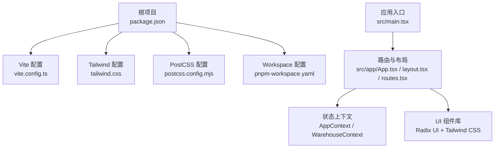
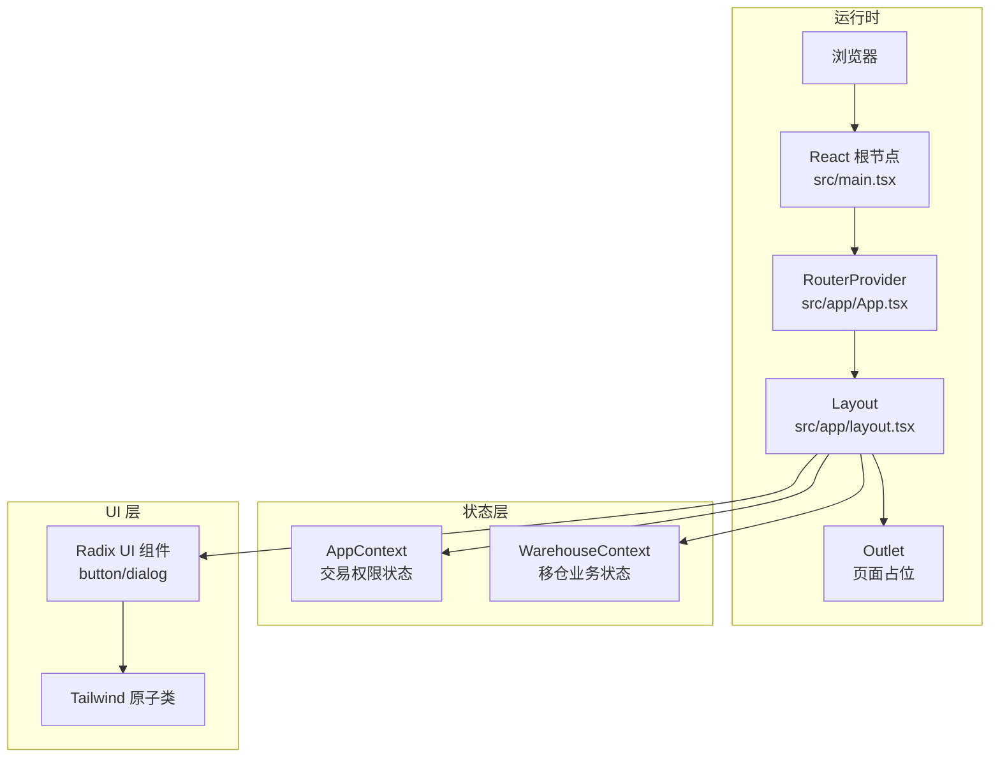
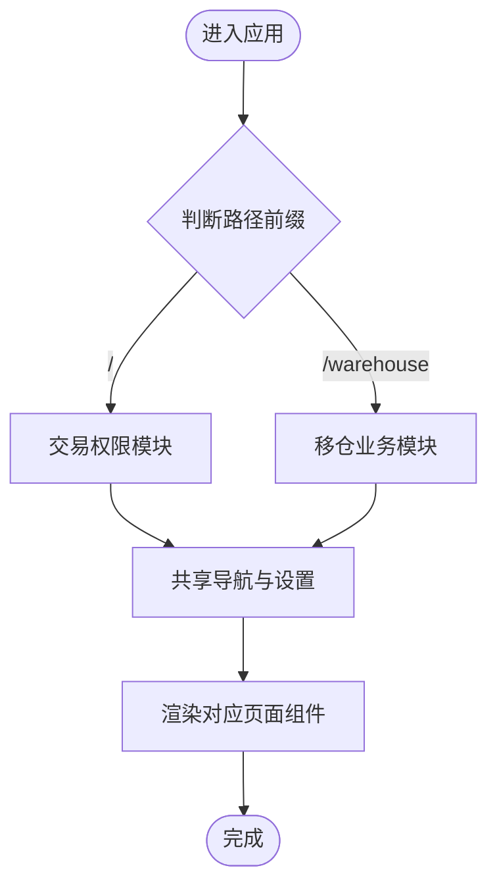
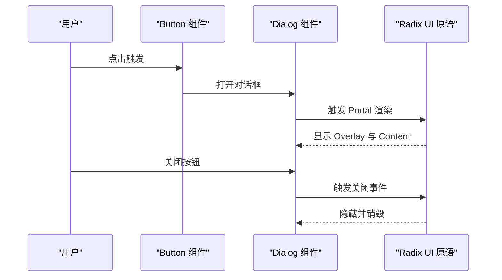
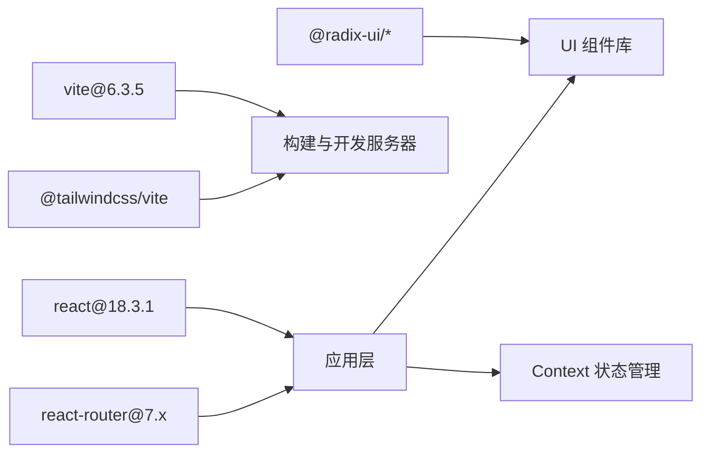

# 技术架构概览

<cite>
**本文档引用的文件**
- [package.json](file://package.json)
- [vite.config.ts](file://vite.config.ts)
- [permission_apply/package.json](file://permission_apply/package.json)
- [permission_apply/vite.config.ts](file://permission_apply/vite.config.ts)
- [src/main.tsx](file://src/main.tsx)
- [src/app/App.tsx](file://src/app/App.tsx)
- [src/app/layout.tsx](file://src/app/layout.tsx)
- [src/app/routes.tsx](file://src/app/routes.tsx)
- [src/styles/tailwind.css](file://src/styles/tailwind.css)
- [postcss.config.mjs](file://postcss.config.mjs)
- [src/app/store/AppContext.tsx](file://src/app/store/AppContext.tsx)
- [src/app/store/WarehouseContext.tsx](file://src/app/store/WarehouseContext.tsx)
- [src/app/components/ui/button.tsx](file://src/app/components/ui/button.tsx)
- [src/app/components/ui/dialog.tsx](file://src/app/components/ui/dialog.tsx)
- [pnpm-workspace.yaml](file://pnpm-workspace.yaml)
</cite>

## 目录
1. [引言](#引言)
2. [项目结构](#项目结构)
3. [核心组件](#核心组件)
4. [架构总览](#架构总览)
5. [详细组件分析](#详细组件分析)
6. [依赖关系分析](#依赖关系分析)
7. [性能考量](#性能考量)
8. [故障排除指南](#故障排除指南)
9. [结论](#结论)

## 引言
本项目是一个基于现代前端技术栈的企业级管理平台，采用 React 18.3.1 的并发特性、Vite 6.3.5 构建工具、Radix UI 无障碍组件库与 Tailwind CSS 实用优先样式系统。项目通过双模块架构（交易权限申请模块与移仓业务模块）实现功能解耦与复用，同时引入上下文状态管理机制，确保跨页面的状态一致性与可维护性。

## 项目结构
项目采用“根目录 + 子模块”的工作区组织方式，结合 Vite 与 Tailwind CSS 的现代化工程化实践：

- 根包与子包：使用 pnpm workspace 管理多包结构，支持独立构建与部署。
- 路由与布局：统一的路由配置与布局组件，左侧导航与面包屑导航清晰划分功能域。
- 组件体系：基于 Radix UI 的无障碍组件与 Tailwind CSS 的原子化样式组合，形成一致的交互与视觉语言。
- 状态管理：通过 React Context 提供模块化的全局状态，避免深层 props 下传。
- 构建与样式：Vite 配置集成 React 与 Tailwind 插件，PostCSS 保持最小干预。



图表来源
- [package.json:1-91](file://package.json#L1-L91)
- [vite.config.ts:1-37](file://vite.config.ts#L1-L37)
- [src/styles/tailwind.css:1-5](file://src/styles/tailwind.css#L1-L5)
- [postcss.config.mjs:1-16](file://postcss.config.mjs#L1-L16)
- [pnpm-workspace.yaml:1-10](file://pnpm-workspace.yaml#L1-L10)
- [src/main.tsx:1-7](file://src/main.tsx#L1-L7)
- [src/app/App.tsx:1-6](file://src/app/App.tsx#L1-L6)
- [src/app/layout.tsx:1-175](file://src/app/layout.tsx#L1-L175)
- [src/app/routes.tsx:1-38](file://src/app/routes.tsx#L1-L38)

章节来源
- [package.json:1-91](file://package.json#L1-L91)
- [vite.config.ts:1-37](file://vite.config.ts#L1-L37)
- [src/styles/tailwind.css:1-5](file://src/styles/tailwind.css#L1-L5)
- [postcss.config.mjs:1-16](file://postcss.config.mjs#L1-L16)
- [pnpm-workspace.yaml:1-10](file://pnpm-workspace.yaml#L1-L10)

## 核心组件
- 应用入口与路由
  - 入口文件负责挂载根组件并加载全局样式。
  - 路由器提供统一的页面级路由与重定向逻辑，覆盖交易权限与移仓业务两大功能域。
- 布局与导航
  - 左侧导航按功能分组展示，支持当前路径高亮与点击跳转。
  - 面包屑根据路径映射动态生成，提升用户定位能力。
- 状态上下文
  - AppContext 管理交易权限相关的用户与产品选择状态。
  - WarehouseContext 管理移仓业务的账户、交易所、方向、合约类型、日期等复杂状态，并提供重置与权限控制方法。
- UI 组件
  - 基于 Radix UI 的对话框、按钮等组件，具备无障碍属性与动画过渡。
  - 使用 Tailwind CSS 的原子类与变体系统，保证样式一致性与可扩展性。

章节来源
- [src/main.tsx:1-7](file://src/main.tsx#L1-L7)
- [src/app/App.tsx:1-6](file://src/app/App.tsx#L1-L6)
- [src/app/layout.tsx:1-175](file://src/app/layout.tsx#L1-L175)
- [src/app/routes.tsx:1-38](file://src/app/routes.tsx#L1-L38)
- [src/app/store/AppContext.tsx:1-64](file://src/app/store/AppContext.tsx#L1-L64)
- [src/app/store/WarehouseContext.tsx:1-185](file://src/app/store/WarehouseContext.tsx#L1-L185)
- [src/app/components/ui/button.tsx:1-59](file://src/app/components/ui/button.tsx#L1-L59)
- [src/app/components/ui/dialog.tsx:1-136](file://src/app/components/ui/dialog.tsx#L1-L136)

## 架构总览
本项目采用“双模块 + 单应用入口”的架构设计，通过 Vite 的插件体系与 Tailwind CSS 的原子化样式，实现快速开发与一致体验。React 18 的并发特性用于提升渲染性能与用户体验，Context 作为轻量状态管理方案满足模块内状态共享需求。



图表来源
- [src/main.tsx:1-7](file://src/main.tsx#L1-L7)
- [src/app/App.tsx:1-6](file://src/app/App.tsx#L1-L6)
- [src/app/layout.tsx:1-175](file://src/app/layout.tsx#L1-L175)
- [src/app/store/AppContext.tsx:1-64](file://src/app/store/AppContext.tsx#L1-L64)
- [src/app/store/WarehouseContext.tsx:1-185](file://src/app/store/WarehouseContext.tsx#L1-L185)
- [src/app/components/ui/button.tsx:1-59](file://src/app/components/ui/button.tsx#L1-L59)
- [src/app/components/ui/dialog.tsx:1-136](file://src/app/components/ui/dialog.tsx#L1-L136)

## 详细组件分析

### 双模块架构设计
- 模块边界
  - 交易权限申请模块：首页、申请列表、详情、审批列表、系统设置等页面。
  - 移仓业务模块：申请、列表、详情、审核、审批流水等页面。
- 共享机制
  - 系统设置与面包屑导航在两个模块间共享，减少重复实现。
  - 通过 Context 在模块内部进行状态隔离与共享，避免跨模块状态污染。
- 路由组织
  - 使用嵌套路由与 Outlet 实现模块内页面切换，统一入口与布局。



图表来源
- [src/app/layout.tsx:21-37](file://src/app/layout.tsx#L21-L37)
- [src/app/routes.tsx:18-38](file://src/app/routes.tsx#L18-L38)

章节来源
- [src/app/layout.tsx:1-175](file://src/app/layout.tsx#L1-L175)
- [src/app/routes.tsx:1-38](file://src/app/routes.tsx#L1-L38)

### 状态管理模式
- AppContext（交易权限）
  - 管理风险等级、资金规模、是否持有特定条件、已存在最大值、是否特殊公司、客户类型、投资者类型以及选中的产品集合。
  - 提供 setter 方法以响应表单与计算逻辑变化。
- WarehouseContext（移仓业务）
  - 管理交易所选择、出入库方向、合约类型、转移日期、经纪商信息、客户端信息、实际控制账户、权限映射、移仓原因、持仓明细、附件、确认状态与备注。
  - 提供重置方法与权限切换辅助函数，便于表单回退与权限校验。

```mermaid
classDiagram
class AppContext {
+string account
+RiskLevel riskLevel
+setRiskLevel(level)
+FundLevel fundLevel
+setFundLevel(level)
+boolean has50Days
+setHas50Days(has)
+number existingMaxValue
+setExistingMaxValue(val)
+boolean isSpecialCorp
+setIsSpecialCorp(is)
+string[] selectedProducts
+setSelectedProducts(products)
+string customerType
+setCustomerType(type)
+"普通投资者"|"专业投资者" investorType
+setInvestorType(type)
}
class WarehouseContext {
+string account
+string customerName
+string branch
+string customerType
+WarehouseExchange[] selectedExchanges
+setSelectedExchanges(val)
+WarehouseDirection direction
+setDirection(val)
+ContractType contractType
+setContractType(val)
+string transferDate
+setTransferDate(val)
+string outBrokerMemberId
+setOutBrokerMemberId(val)
+string outBrokerName
+setOutBrokerName(val)
+string inBrokerMemberId
+setInBrokerMemberId(val)
+string inBrokerName
+setInBrokerName(val)
+Record<Exchange, string> outClientTradingCodes
+setOutClientTradingCodes(val)
+Record<Exchange, string> outClientNames
+setOutClientNames(val)
+Record<Exchange, string> inClientTradingCodes
+setInClientTradingCodes(val)
+string inClientName
+setInClientName(val)
+string actualControlOutAccount
+setActualControlOutAccount(val)
+string actualControlOutName
+setActualControlOutName(val)
+string actualControlInAccount
+setActualControlInAccount(val)
+string actualControlInName
+setActualControlInName(val)
+Record<string, boolean> accountPermissions
+toggleAccountPermission(account)
+hasPermissionForAccount(account) boolean
+"YES"|"NO"|"" dceTransferByQuantity
+setDceTransferByQuantity(val)
+string transferReason
+setTransferReason(val)
+PositionRow[] positions
+setPositions(positions)
+{name,size}[] attachments
+setAttachments(attachments)
+boolean confirmed
+setConfirmed(val)
+string remark
+setRemark(val)
+reset()
}
```

图表来源
- [src/app/store/AppContext.tsx:1-64](file://src/app/store/AppContext.tsx#L1-L64)
- [src/app/store/WarehouseContext.tsx:1-185](file://src/app/store/WarehouseContext.tsx#L1-L185)

章节来源
- [src/app/store/AppContext.tsx:1-64](file://src/app/store/AppContext.tsx#L1-L64)
- [src/app/store/WarehouseContext.tsx:1-185](file://src/app/store/WarehouseContext.tsx#L1-L185)

### UI 组件与无障碍设计
- 按钮组件
  - 支持多种变体与尺寸，结合 class-variance-authority 与 Tailwind 原子类实现一致的视觉与交互反馈。
  - 使用 Radix UI 的 Slot 容器，允许透传到原生按钮或自定义元素。
- 对话框组件
  - 基于 Radix UI 的对话框原语，包含触发器、门户、遮罩、内容、标题与描述等子组件。
  - 内置动画与无障碍属性，支持键盘交互与焦点管理。



图表来源
- [src/app/components/ui/button.tsx:1-59](file://src/app/components/ui/button.tsx#L1-L59)
- [src/app/components/ui/dialog.tsx:1-136](file://src/app/components/ui/dialog.tsx#L1-L136)

章节来源
- [src/app/components/ui/button.tsx:1-59](file://src/app/components/ui/button.tsx#L1-L59)
- [src/app/components/ui/dialog.tsx:1-136](file://src/app/components/ui/dialog.tsx#L1-L136)

## 依赖关系分析
- 技术栈依赖
  - React 18.3.1 与 React Router 7.x 提供并发渲染与现代路由能力。
  - Vite 6.3.5 作为构建工具，配合 @vitejs/plugin-react 与 @tailwindcss/vite 提升开发效率。
  - Radix UI 组件库保障无障碍与可访问性；Tailwind CSS 提供实用优先的样式系统。
- 工作区与脚本
  - pnpm workspace 管理多包；根包与子包分别维护各自的构建脚本与依赖版本。
  - Vite 配置中包含自定义插件与别名解析，支持资源导入与路径别名。



图表来源
- [package.json:11-77](file://package.json#L11-L77)
- [vite.config.ts:19-36](file://vite.config.ts#L19-L36)
- [pnpm-workspace.yaml:1-10](file://pnpm-workspace.yaml#L1-L10)

章节来源
- [package.json:1-91](file://package.json#L1-L91)
- [vite.config.ts:1-37](file://vite.config.ts#L1-L37)
- [pnpm-workspace.yaml:1-10](file://pnpm-workspace.yaml#L1-L10)

## 性能考量
- 并发渲染与优先级调度
  - 利用 React 18 的并发特性，将低优先级更新与紧急更新分离，提升交互流畅度。
- 构建与打包优化
  - Vite 的快速冷启动与热更新显著缩短开发等待时间；按需导入与 Tree Shaking 减少产物体积。
- 样式与组件
  - Tailwind 原子类减少重复样式定义；Radix UI 组件体积小、按需使用，降低首屏负担。
- 状态管理
  - Context 分层（AppContext 与 WarehouseContext）避免无关订阅，减少不必要重渲染。

## 故障排除指南
- 构建失败
  - 检查 Vite 插件配置与别名解析，确保 @ 指向正确目录。
  - 确认 Tailwind CSS 版本与 @tailwindcss/vite 的兼容性。
- 运行时错误
  - 若出现 Context 使用错误，检查 Provider 是否包裹子树，避免在 Provider 外调用 useXXX。
  - 对话框无法关闭时，确认 Radix UI 的 Portal 与 Overlay 渲染顺序。
- 路由问题
  - 核对路由配置与路径映射，确保默认页与通配符重定向正常工作。

章节来源
- [vite.config.ts:19-36](file://vite.config.ts#L19-L36)
- [src/app/store/AppContext.tsx:59-63](file://src/app/store/AppContext.tsx#L59-L63)
- [src/app/store/WarehouseContext.tsx:180-184](file://src/app/store/WarehouseContext.tsx#L180-L184)
- [src/app/routes.tsx:18-38](file://src/app/routes.tsx#L18-L38)

## 结论
本项目通过 React 18 的并发能力、Vite 的高效构建、Radix UI 的无障碍组件与 Tailwind CSS 的实用样式系统，构建了现代化、可维护且高性能的管理平台。双模块架构与 Context 状态管理进一步提升了功能解耦与开发效率。建议在后续迭代中持续关注依赖升级与性能监控，以保持技术栈的先进性与稳定性。