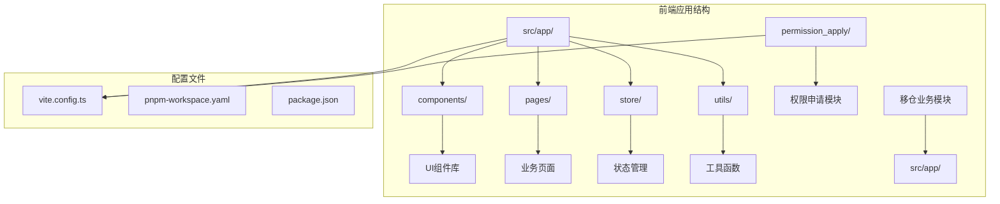
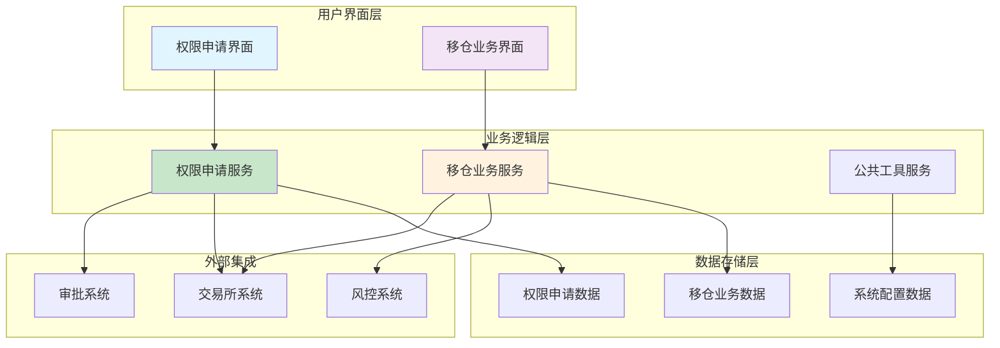
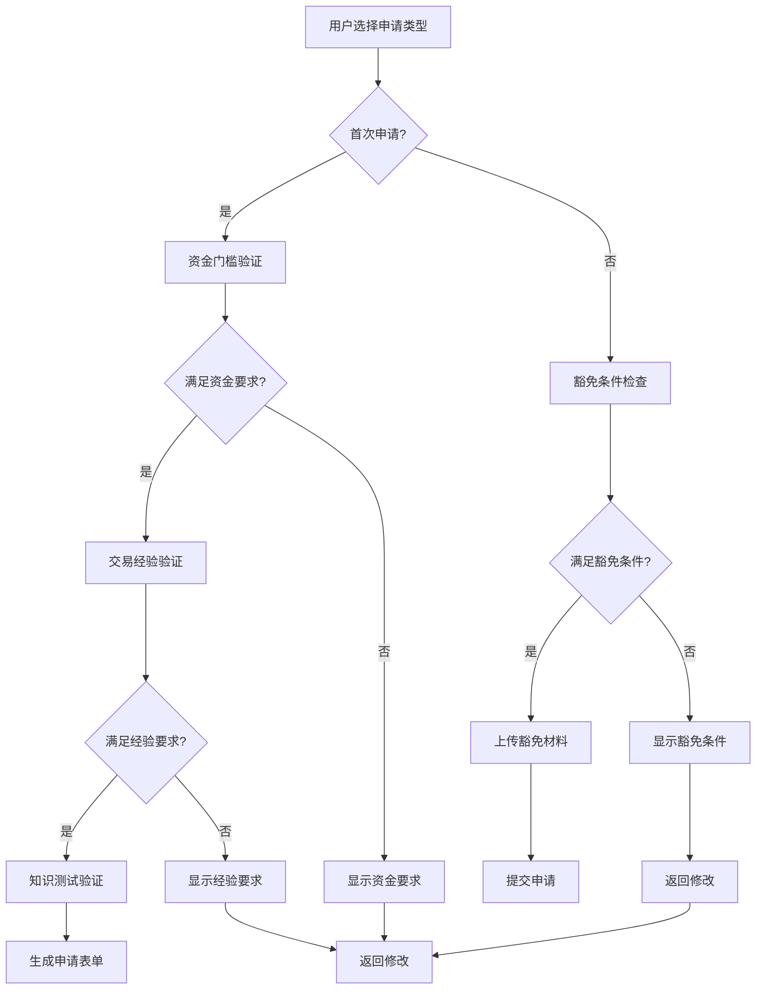
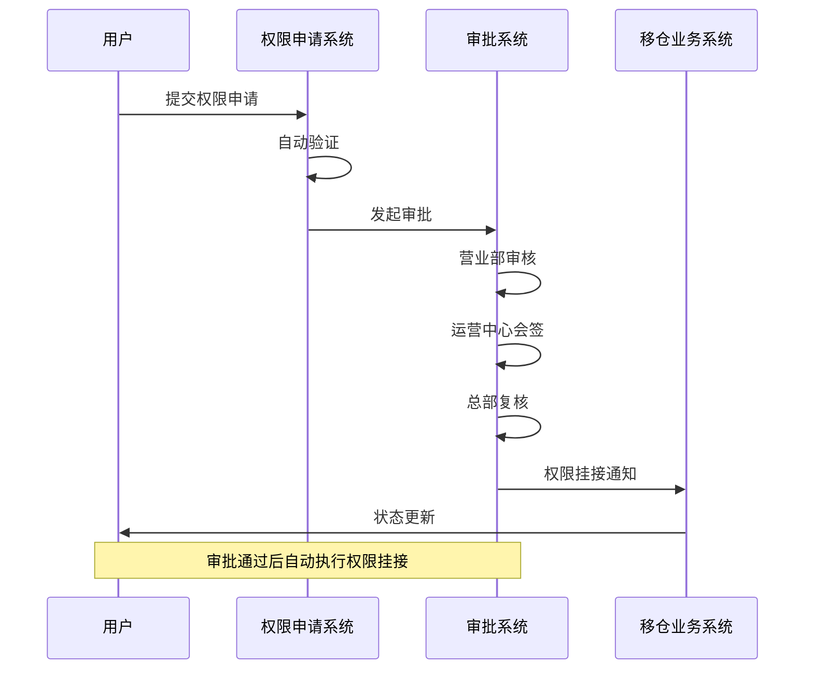
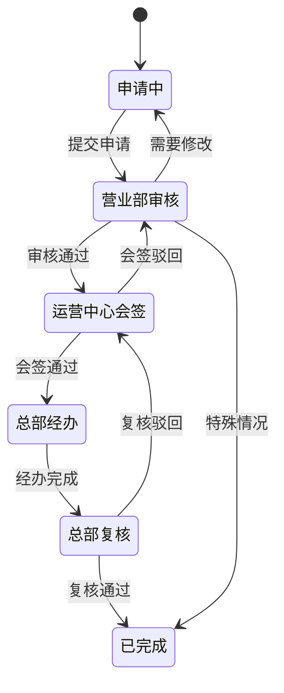
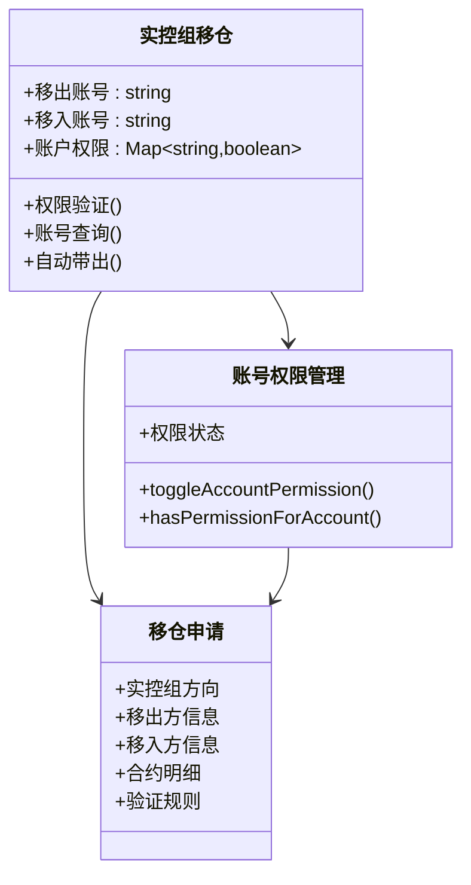
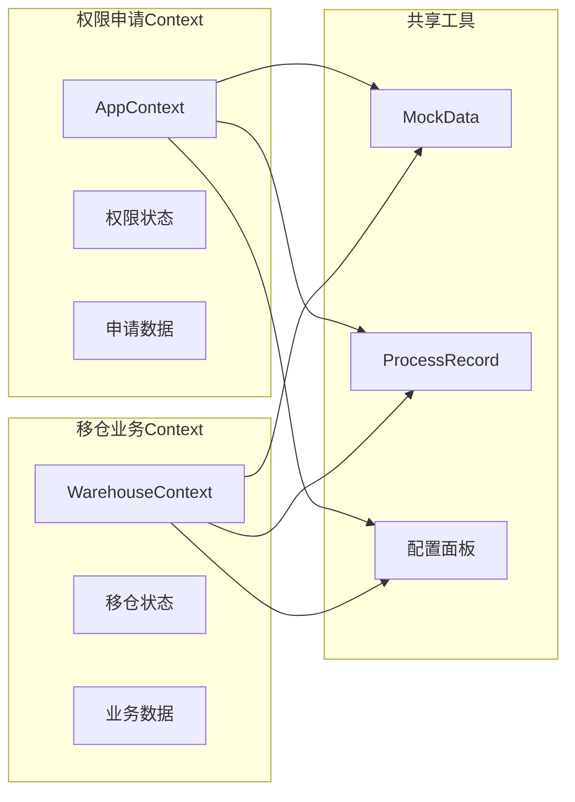
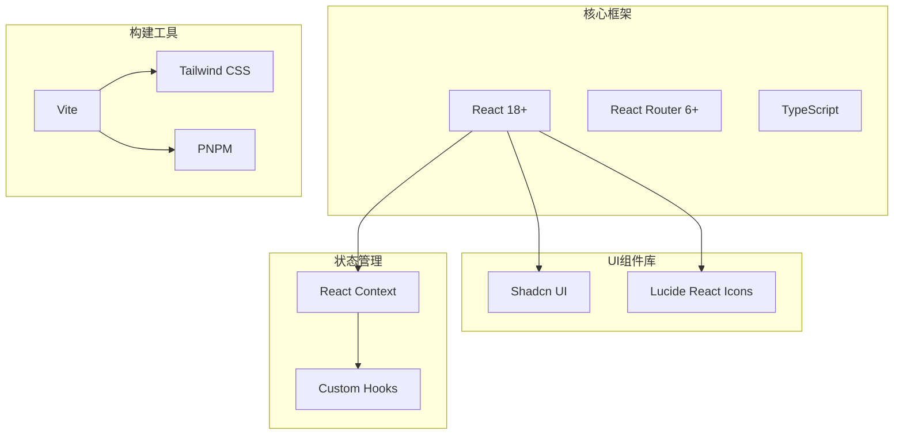
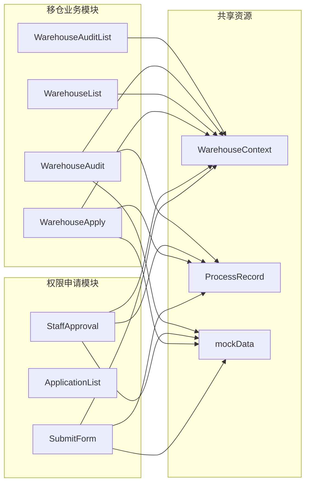
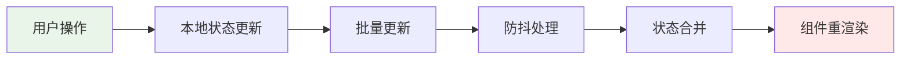

# 核心功能特性

<cite>
**本文档引用的文件**
- [App.tsx](file://src/app/App.tsx)
- [routes.tsx](file://src/app/routes.tsx)
- [WarehouseContext.tsx](file://src/app/store/WarehouseContext.tsx)
- [WarehouseApply.tsx](file://src/app/pages/WarehouseApply.tsx)
- [WarehouseAudit.tsx](file://src/app/pages/WarehouseAudit.tsx)
- [WarehouseList.tsx](file://src/app/pages/WarehouseList.tsx)
- [WarehouseDetail.tsx](file://src/app/pages/WarehouseDetail.tsx)
- [WarehouseAuditList.tsx](file://src/app/pages/WarehouseAuditList.tsx)
- [WarehouseConfigPanel.tsx](file://src/app/components/WarehouseConfigPanel.tsx)
- [ProcessRecord.tsx](file://src/app/components/ProcessRecord.tsx)
- [mockData.ts](file://src/app/utils/mockData.ts)
- [SubmitForm.tsx](file://permission_apply/src/app/pages/SubmitForm.tsx)
- [ApplicationList.tsx](file://permission_apply/src/app/pages/ApplicationList.tsx)
- [StaffApproval.tsx](file://permission_apply/src/app/pages/StaffApproval.tsx)
</cite>

## 目录
1. [项目概述](#项目概述)
2. [项目结构](#项目结构)
3. [核心组件](#核心组件)
4. [架构概览](#架构概览)
5. [详细组件分析](#详细组件分析)
6. [依赖关系分析](#依赖关系分析)
7. [性能考虑](#性能考虑)
8. [故障排除指南](#故障排除指南)
9. [结论](#结论)

## 项目概述

管理平台项目是一个基于React技术栈的企业级管理系统，主要包含两个核心业务模块：**交易权限申请系统**和**移仓业务申请系统**。这两个模块采用并行设计理念，既保持独立性又实现有机协作，为企业提供完整的业务解决方案。

### 系统设计理念

**并行运行设计**体现了现代企业管理系统的发展趋势，通过模块化架构实现：
- **独立性**：每个模块可以独立开发、测试和部署
- **协作性**：通过统一的路由系统和共享组件实现数据互通
- **扩展性**：模块间松耦合，便于未来功能扩展

### 核心业务价值

1. **提升效率**：自动化流程减少人工干预，缩短审批周期
2. **降低风险**：标准化流程和严格的数据校验机制
3. **增强透明度**：完整的流程记录和实时状态跟踪
4. **改善体验**：直观的用户界面和流畅的操作流程

## 项目结构

项目采用前后端分离的架构设计，主要目录结构如下：

**图表来源**
- [App.tsx:1-6](file://src/app/App.tsx#L1-L6)
- [routes.tsx:1-38](file://src/app/routes.tsx#L1-L38)

**章节来源**
- [App.tsx:1-6](file://src/app/App.tsx#L1-L6)
- [routes.tsx:1-38](file://src/app/routes.tsx#L1-L38)

## 核心组件

### 交易权限申请系统

交易权限申请系统提供完整的权限开通管理功能，包括首次申请、豁免申请和二次开通等功能。

#### 核心功能模块

1. **基础信息管理**
   - 客户基本信息展示
   - 账户状态和风险等级显示
   - 适当性评估结果

2. **权限申请流程**
   - 首次申请：满足资金门槛和交易经验要求
   - 豁免申请：通过其他期货公司编码或特殊条件
   - 二次开通：系统自动校验通过的权限挂接

3. **审批管理**
   - 工作人员审批视图
   - 审批流程跟踪
   - 批量处理功能

#### 关键特性

- **智能验证**：根据申请品种自动判断资金门槛要求
- **灵活配置**：支持多种申请类型的动态切换
- **实时反馈**：详细的进度状态和错误提示

**章节来源**
- [SubmitForm.tsx:1-747](file://permission_apply/src/app/pages/SubmitForm.tsx#L1-L747)
- [ApplicationList.tsx:1-178](file://permission_apply/src/app/pages/ApplicationList.tsx#L1-L178)
- [StaffApproval.tsx:1-708](file://permission_apply/src/app/pages/StaffApproval.tsx#L1-L708)

### 移仓业务申请系统

移仓业务申请系统专注于期货交易所间的持仓转移管理，提供完整的业务申请、审批和执行流程。

#### 核心功能模块

1. **移仓申请管理**
   - 多交易所支持（DCE、CZCE、SHFE）
   - 三种移仓方向（移入、移出、实控组）
   - 合约明细管理

2. **审批流程**
   - 营业部审核
   - 运营中心会签（一票否决制）
   - 总部经办和复核
   - 完成状态跟踪

3. **业务配置**
   - 场景化配置面板
   - 实控组账号权限管理
   - 交易所特定规则

#### 关键特性

- **智能表单**：根据选择的交易所动态调整字段
- **权限控制**：基于账号的精细化权限管理
- **会签机制**：运营中心多部门联合审批

**章节来源**
- [WarehouseApply.tsx:1-909](file://src/app/pages/WarehouseApply.tsx#L1-L909)
- [WarehouseAudit.tsx:1-883](file://src/app/pages/WarehouseAudit.tsx#L1-L883)
- [WarehouseList.tsx:1-220](file://src/app/pages/WarehouseList.tsx#L1-L220)
- [WarehouseAuditList.tsx:1-704](file://src/app/pages/WarehouseAuditList.tsx#L1-L704)

## 架构概览

系统采用模块化微服务架构，两个核心模块既独立运行又相互协作。

**图表来源**
- [routes.tsx:18-38](file://src/app/routes.tsx#L18-L38)
- [WarehouseContext.tsx:1-185](file://src/app/store/WarehouseContext.tsx#L1-L185)

### 模块间协作机制

两个模块通过以下方式实现协作：

1. **统一路由管理**：共享路由配置，确保导航一致性
2. **状态共享**：通过Context实现跨模块的状态共享
3. **组件复用**：公共UI组件和工具函数的共享使用
4. **数据同步**：通过统一的数据源和缓存机制

**章节来源**
- [routes.tsx:1-38](file://src/app/routes.tsx#L1-L38)
- [WarehouseContext.tsx:1-185](file://src/app/store/WarehouseContext.tsx#L1-L185)

## 详细组件分析

### 交易权限申请系统详细分析

#### 权限评估引擎

**图表来源**
- [SubmitForm.tsx:94-114](file://permission_apply/src/app/pages/SubmitForm.tsx#L94-L114)

#### 审批流程管理

**图表来源**
- [StaffApproval.tsx:1-708](file://permission_apply/src/app/pages/StaffApproval.tsx#L1-L708)

**章节来源**
- [SubmitForm.tsx:1-747](file://permission_apply/src/app/pages/SubmitForm.tsx#L1-L747)
- [StaffApproval.tsx:1-708](file://permission_apply/src/app/pages/StaffApproval.tsx#L1-L708)

### 移仓业务申请系统详细分析

#### 移仓业务流程

**图表来源**
- [WarehouseAudit.tsx:520-787](file://src/app/pages/WarehouseAudit.tsx#L520-L787)

#### 实控组移仓机制

**图表来源**
- [WarehouseContext.tsx:94-104](file://src/app/store/WarehouseContext.tsx#L94-L104)
- [WarehouseApply.tsx:197-219](file://src/app/pages/WarehouseApply.tsx#L197-L219)

**章节来源**
- [WarehouseApply.tsx:1-909](file://src/app/pages/WarehouseApply.tsx#L1-L909)
- [WarehouseAudit.tsx:1-883](file://src/app/pages/WarehouseAudit.tsx#L1-L883)
- [WarehouseContext.tsx:1-185](file://src/app/store/WarehouseContext.tsx#L1-L185)

### 共享组件和工具

#### 状态管理架构

**图表来源**
- [mockData.ts:1-13](file://src/app/utils/mockData.ts#L1-L13)
- [ProcessRecord.tsx:1-56](file://src/app/components/ProcessRecord.tsx#L1-L56)

**章节来源**
- [mockData.ts:1-13](file://src/app/utils/mockData.ts#L1-L13)
- [ProcessRecord.tsx:1-56](file://src/app/components/ProcessRecord.tsx#L1-L56)

## 依赖关系分析

### 技术栈依赖

### 模块间依赖关系

**图表来源**
- [routes.tsx:1-38](file://src/app/routes.tsx#L1-L38)
- [WarehouseContext.tsx:1-185](file://src/app/store/WarehouseContext.tsx#L1-L185)

**章节来源**
- [routes.tsx:1-38](file://src/app/routes.tsx#L1-L38)
- [WarehouseContext.tsx:1-185](file://src/app/store/WarehouseContext.tsx#L1-L185)

## 性能考虑

### 前端性能优化

1. **懒加载策略**
   - 页面级懒加载减少初始包体积
   - 组件级分割提升加载速度
   - 路由级别的代码分割

2. **状态管理优化**
   - Context的合理使用避免不必要的重渲染
   - 自定义Hook封装复杂状态逻辑
   - 数据缓存策略减少重复请求

3. **UI渲染优化**
   - 虚拟滚动处理大量数据列表
   - 图标组件按需引入
   - 样式按需加载

### 数据流优化

## 故障排除指南

### 常见问题诊断

#### 权限申请相关问题

1. **资金门槛验证失败**
   - 检查账户资金历史记录
   - 验证申请品种的资金要求
   - 确认交易日历和节假日

2. **审批流程卡顿**
   - 检查网络连接状态
   - 验证用户权限级别
   - 查看系统维护公告

#### 移仓业务相关问题

1. **实控组账号权限问题**
   - 确认账号是否存在
   - 检查权限开关状态
   - 验证账号与客户信息匹配

2. **会签流程异常**
   - 检查会签审批人状态
   - 验证会签规则配置
   - 查看系统日志

**章节来源**
- [WarehouseApply.tsx:197-219](file://src/app/pages/WarehouseApply.tsx#L197-L219)
- [mockData.ts:1-13](file://src/app/utils/mockData.ts#L1-L13)

## 结论

管理平台项目通过精心设计的双模块架构，成功实现了交易权限申请和移仓业务申请两大核心功能。系统的主要优势包括：

### 技术优势

1. **模块化设计**：两个核心模块既独立运行又紧密协作
2. **用户体验**：直观的界面设计和流畅的操作流程
3. **业务覆盖**：完整的业务流程覆盖和灵活的配置能力
4. **扩展性强**：模块化的架构便于未来功能扩展

### 业务价值

1. **效率提升**：自动化流程减少人工干预，提高处理效率
2. **风险控制**：严格的审批流程和数据校验机制
3. **成本节约**：减少纸质文档和人工审核成本
4. **合规保障**：完整的流程记录和审计追踪

### 发展前景

系统为未来的业务扩展奠定了良好的基础，可以通过以下方式进行进一步优化：
- 集成更多交易所和业务类型
- 增强AI辅助决策功能
- 优化移动端用户体验
- 加强数据分析和报表功能

通过持续的技术创新和业务优化，该系统将成为企业管理的重要数字化工具，为企业创造更大的价值。