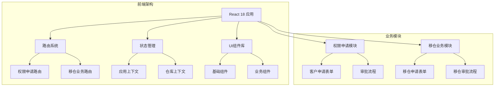
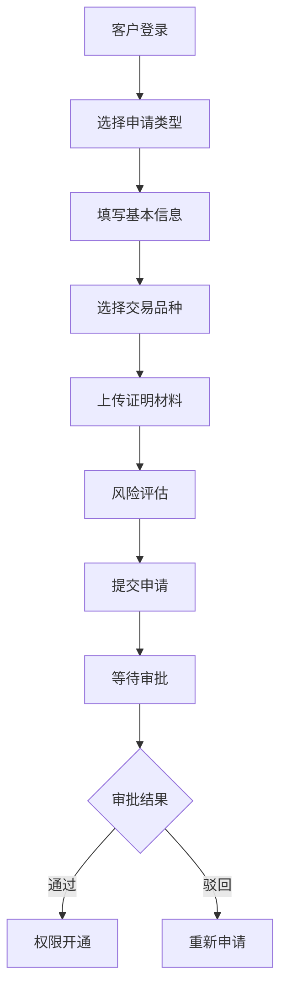
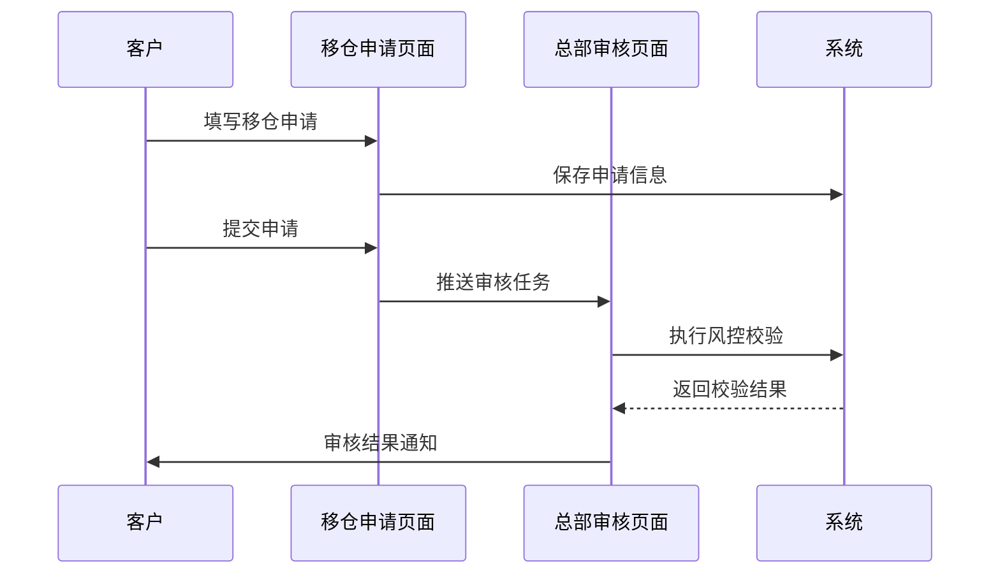

# 项目介绍

<cite>
**本文档引用的文件**
- [README.md](file://README.md)
- [package.json](file://package.json)
- [src/app/layout.tsx](file://src/app/layout.tsx)
- [src/app/routes.tsx](file://src/app/routes.tsx)
- [src/app/store/AppContext.tsx](file://src/app/store/AppContext.tsx)
- [src/app/store/WarehouseContext.tsx](file://src/app/store/WarehouseContext.tsx)
- [src/app/pages/WarehouseApply.tsx](file://src/app/pages/WarehouseApply.tsx)
- [src/app/pages/WarehouseAudit.tsx](file://src/app/pages/WarehouseAudit.tsx)
- [src/app/pages/ApplicationDetail.tsx](file://src/app/pages/ApplicationDetail.tsx)
- [src/app/pages/StaffApproval.tsx](file://src/app/pages/StaffApproval.tsx)
- [src/app/components/ui/Button.tsx](file://src/app/components/ui/Button.tsx)
- [src/app/utils/mockData.ts](file://src/app/utils/mockData.ts)
- [docs/warehouse-transfer-design.md](file://docs/warehouse-transfer-design.md)
</cite>

## 目录
1. [项目概述](#项目概述)
2. [核心目标与业务价值](#核心目标与业务价值)
3. [主要应用场景](#主要应用场景)
4. [目标用户群体](#目标用户群体)
5. [解决的核心问题](#解决的核心问题)
6. [开发背景与业务需求](#开发背景与业务需求)
7. [技术架构概览](#技术架构概览)
8. [功能模块详解](#功能模块详解)
9. [项目整体定位](#项目整体定位)
10. [总结](#总结)

## 项目概述

管理平台项目是一个面向金融机构的数字化业务管理系统，专注于为期货公司提供两大核心业务场景的数字化解决方案：

- **交易权限申请**：为客户提供便捷的交易权限开通申请渠道
- **交易所移仓业务申请**：为客户提供标准化的移仓业务申请和审批流程

该项目采用现代化的前端技术栈，基于React 18构建，通过组件化设计实现了高度可复用的UI组件体系和灵活的状态管理模式。

## 核心目标与业务价值

### 核心目标
- **提升业务效率**：通过数字化流程替代传统纸质申请，大幅缩短审批周期
- **强化合规管控**：建立标准化的风险评估和合规检查机制
- **优化用户体验**：提供直观易用的操作界面和流畅的交互体验
- **降低运营成本**：减少人工干预，提高业务处理自动化程度

### 业务价值
- **时效性提升**：从传统的数天审批周期缩短至小时级响应
- **准确性保障**：通过系统化校验减少人为错误和遗漏
- **透明度增强**：全流程可视化追踪，便于监管审计
- **扩展性强**：模块化设计支持业务功能的持续扩展和迭代

## 主要应用场景

### 场景一：交易权限申请
适用于金融机构客户进行各类期货交易权限的在线申请，包括：
- 商品期货交易权限
- 金融期货交易权限  
- 期权交易权限
- 特定品种交易权限

### 场景二：交易所移仓业务申请
针对客户在不同期货公司间进行持仓转移的需求：
- 跨公司移仓申请
- 实控组内移仓
- 特定交易所移仓（大商所、郑商所、上期所）

## 目标用户群体

### 内部用户
- **前台业务人员**：负责客户接待和初步资料收集
- **中台风控人员**：负责风险评估和合规审查
- **后台运营人员**：负责系统维护和数据管理

### 外部用户
- **机构客户**：需要申请交易权限或进行移仓操作的企业客户
- **个人投资者**：符合适当性要求的个人投资者

## 解决的核心问题

### 传统模式痛点
1. **流程繁琐**：纸质申请、多部门流转、人工传递
2. **效率低下**：审批周期长，客户体验差
3. **风险控制不足**：缺乏统一的风险评估标准
4. **数据管理困难**：历史记录难以追溯，统计分析困难

### 数字化解决方案
1. **流程自动化**：通过系统实现申请、审批、执行的全流程自动化
2. **智能校验**：内置业务规则引擎，自动识别和提示潜在风险
3. **实时监控**：提供实时的业务状态跟踪和预警机制
4. **数据洞察**：通过数据分析为业务决策提供支持

## 开发背景与业务需求

### 技术选型原因
项目采用以下技术栈，确保系统的先进性和可维护性：

- **React 18**：提供最新的性能特性和开发体验
- **Vite构建工具**：实现快速的开发服务器和高效的生产构建
- **TailwindCSS**：提供灵活的样式定制能力和响应式设计
- **Radix UI**：构建无障碍访问的高质量UI组件
- **TypeScript**：提供类型安全和更好的开发体验

### 架构设计理念
- **组件化设计**：通过可复用的UI组件提高开发效率
- **状态管理**：采用Context API实现全局状态管理
- **路由管理**：基于React Router实现单页应用的路由控制
- **数据流管理**：通过自定义Hook实现数据的集中管理和共享

## 技术架构概览

**图表来源**
- [src/app/layout.tsx:74-175](file://src/app/layout.tsx#L74-L175)
- [src/app/routes.tsx:18-38](file://src/app/routes.tsx#L18-L38)

### 核心架构特点
- **模块化组织**：按照业务功能划分模块，便于维护和扩展
- **组件复用**：通过统一的UI组件库提高开发效率
- **状态隔离**：不同的业务模块拥有独立的状态管理
- **路由驱动**：基于URL的状态管理，支持深度链接和浏览器导航

## 功能模块详解

### 权限申请模块

#### 申请表单设计
该模块提供完整的交易权限申请流程，包括：

**图表来源**
- [src/app/pages/ApplicationDetail.tsx:7-113](file://src/app/pages/ApplicationDetail.tsx#L7-L113)

#### 审批流程管理
系统支持多级审批流程，包括：
- 营业部初审
- 中台复核
- 风控评估
- 最终审批

### 移仓业务模块

#### 移仓申请流程
移仓业务模块提供了完整的移仓申请和审批流程：

**图表来源**
- [src/app/pages/WarehouseApply.tsx:185-400](file://src/app/pages/WarehouseApply.tsx#L185-L400)
- [src/app/pages/WarehouseAudit.tsx:129-244](file://src/app/pages/WarehouseAudit.tsx#L129-L244)

#### 核心功能特性
- **多交易所支持**：支持大商所、郑商所、上期所的差异化业务规则
- **实控组管理**：提供实际控制关系账户间的移仓处理
- **风险控制**：内置多种风险控制点和合规检查机制
- **流程追踪**：完整的操作日志和流程状态追踪

**章节来源**
- [src/app/pages/WarehouseApply.tsx:1-909](file://src/app/pages/WarehouseApply.tsx#L1-L909)
- [src/app/pages/WarehouseAudit.tsx:1-883](file://src/app/pages/WarehouseAudit.tsx#L1-L883)

## 项目整体定位

### 在金融业务系统中的作用

管理平台项目在金融机构的数字化转型中扮演着关键角色：

#### 业务支撑层
- **客户服务**：提供7×24小时的在线服务体验
- **业务流程**：标准化和优化核心业务流程
- **数据治理**：建立统一的数据标准和质量管理体系

#### 技术基础设施层
- **系统集成**：作为多个业务系统的统一入口
- **数据交换**：提供标准化的数据接口和协议
- **安全保障**：建立完善的安全防护和审计机制

### 项目价值体现

#### 对客户的直接价值
- **便利性**：随时随地在线办理业务
- **透明度**：实时查看业务办理进度
- **效率性**：大幅缩短业务处理时间

#### 对机构的战略价值
- **竞争力**：提升服务质量和客户满意度
- **合规性**：确保业务操作符合监管要求
- **可持续性**：为业务发展提供技术支撑

## 总结

管理平台项目通过数字化手段重构了传统金融业务的办理流程，为金融机构提供了高效、合规、便捷的数字化解决方案。项目不仅解决了业务痛点，更重要的是为金融机构的数字化转型奠定了坚实的技术基础。

通过模块化的架构设计、标准化的业务流程和智能化的风险控制，该项目成功地将复杂的金融业务转化为简单易用的数字化服务，为客户和机构双方创造了显著的价值。

未来，随着业务的发展和技术的进步，该项目将继续演进，为金融机构提供更加完善和先进的数字化服务支持。