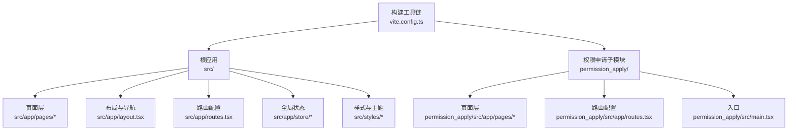
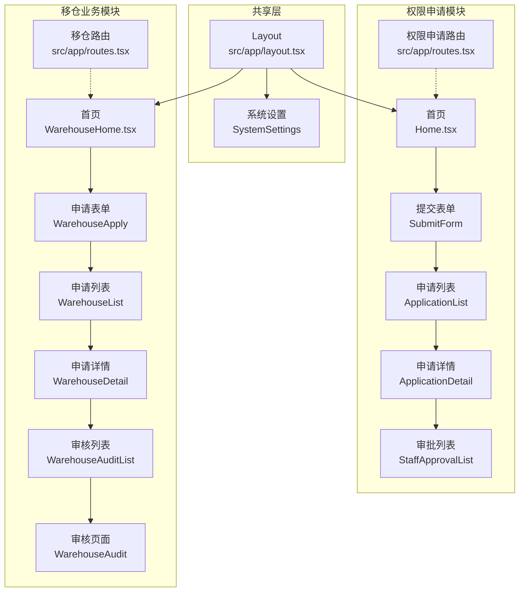
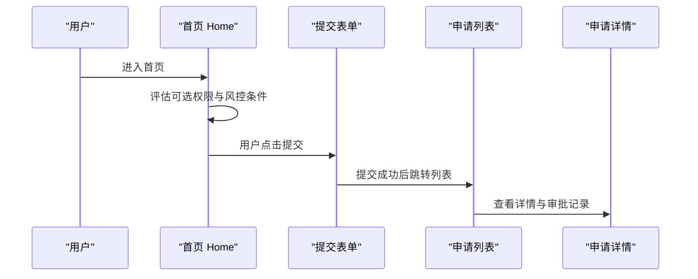
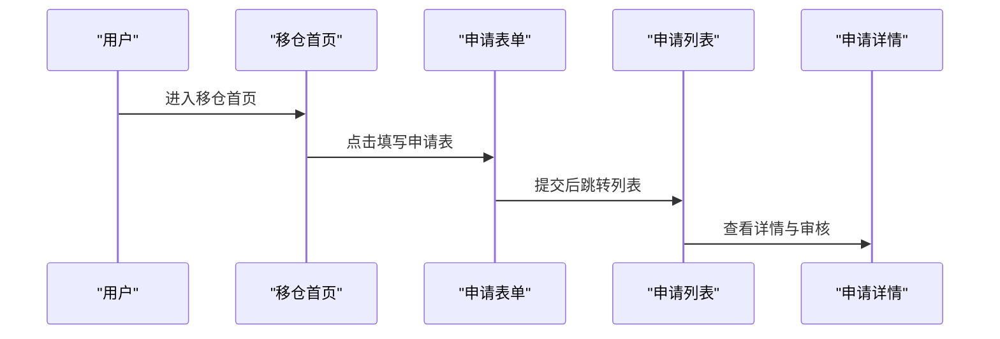
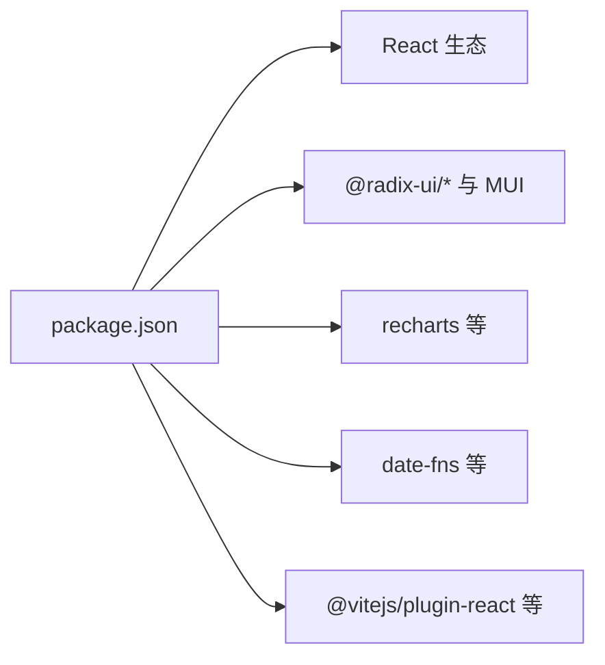

# 项目概述

<cite>
**本文档引用的文件**
- [README.md](file://README.md)
- [package.json](file://package.json)
- [vite.config.ts](file://vite.config.ts)
- [src/main.tsx](file://src/main.tsx)
- [src/app/App.tsx](file://src/app/App.tsx)
- [src/app/layout.tsx](file://src/app/layout.tsx)
- [src/app/routes.tsx](file://src/app/routes.tsx)
- [src/app/pages/Home.tsx](file://src/app/pages/Home.tsx)
- [src/app/pages/WarehouseHome.tsx](file://src/app/pages/WarehouseHome.tsx)
- [src/app/store/AppContext.tsx](file://src/app/store/AppContext.tsx)
- [src/app/store/WarehouseContext.tsx](file://src/app/store/WarehouseContext.tsx)
- [permission_apply/README.md](file://permission_apply/README.md)
- [permission_apply/src/main.tsx](file://permission_apply/src/main.tsx)
- [permission_apply/src/app/App.tsx](file://permission_apply/src/app/App.tsx)
- [permission_apply/src/app/routes.tsx](file://permission_apply/src/app/routes.tsx)
</cite>

## 目录
1. [引言](#引言)
2. [项目结构](#项目结构)
3. [核心组件](#核心组件)
4. [架构总览](#架构总览)
5. [详细组件分析](#详细组件分析)
6. [依赖分析](#依赖分析)
7. [性能考虑](#性能考虑)
8. [故障排除指南](#故障排除指南)
9. [结论](#结论)

## 引言
本管理平台项目面向机构业务场景，提供两大核心业务模块：交易权限申请系统与移仓业务申请系统。两个模块并行运行在同一应用中，共享统一的导航体系、布局与上下文状态，既保证了业务解耦，又实现了资源复用与一致体验。项目采用现代化前端技术栈（React 18.3.1、Vite 6.3.5、Radix UI、Tailwind CSS），结合路由与状态管理，构建高性能、可维护的单页应用。

## 项目结构
项目采用“根应用 + 子模块”的组织方式：
- 根应用位于 src 目录，包含完整的权限申请与移仓业务页面、通用布局与全局状态上下文。
- 权限申请子模块位于 permission_apply 目录，提供独立的权限申请流程与页面集合。
- 构建工具链通过 Vite 6.3.5 与 Tailwind CSS 实现快速开发与样式一致性。
- package.json 统一管理依赖与脚本，支持开发、构建与部署。

图表来源
- [src/app/routes.tsx:1-38](file://src/app/routes.tsx#L1-L38)
- [permission_apply/src/app/routes.tsx:1-27](file://permission_apply/src/app/routes.tsx#L1-L27)
- [vite.config.ts:1-37](file://vite.config.ts#L1-L37)

章节来源
- [README.md:1-11](file://README.md#L1-L11)
- [package.json:1-91](file://package.json#L1-L91)
- [vite.config.ts:1-37](file://vite.config.ts#L1-L37)

## 核心组件
- 应用入口与路由
  - 根应用入口分别在 src/main.tsx 与 permission_apply/src/main.tsx，均通过 createRoot 渲染 App。
  - App 组件使用 react-router 的 RouterProvider 注入路由配置。
- 路由与导航
  - 根应用路由覆盖权限申请与移仓业务相关页面，并提供系统设置与回退处理。
  - 权限申请子模块路由聚焦于权限申请相关页面。
- 布局与侧边栏
  - layout.tsx 提供统一头部、面包屑与左右分栏布局；左侧包含两组导航项：交易权限申请与移仓业务申请。
- 全局状态
  - AppContext 管理权限申请相关的客户与风控数据。
  - WarehouseContext 管理移仓业务相关的账户、交易所、方向、合约类型、日期、交易编码、权限与附件等。

章节来源
- [src/main.tsx:1-7](file://src/main.tsx#L1-L7)
- [permission_apply/src/main.tsx:1-7](file://permission_apply/src/main.tsx#L1-L7)
- [src/app/App.tsx:1-6](file://src/app/App.tsx#L1-L6)
- [permission_apply/src/app/App.tsx:1-6](file://permission_apply/src/app/App.tsx#L1-L6)
- [src/app/routes.tsx:1-38](file://src/app/routes.tsx#L1-L38)
- [permission_apply/src/app/routes.tsx:1-27](file://permission_apply/src/app/routes.tsx#L1-L27)
- [src/app/layout.tsx:1-175](file://src/app/layout.tsx#L1-L175)
- [src/app/store/AppContext.tsx:1-64](file://src/app/store/AppContext.tsx#L1-L64)
- [src/app/store/WarehouseContext.tsx:1-185](file://src/app/store/WarehouseContext.tsx#L1-L185)

## 架构总览
系统采用“共享布局 + 双业务模块”的架构设计：
- 共享层：统一布局、导航、面包屑、全局通知与系统设置。
- 权限申请模块：从首页到提交表单、审批列表与详情，形成闭环流程。
- 移仓业务模块：从首页到申请表单、列表、详情与审核，形成闭环流程。
- 状态层：AppContext 与 WarehouseContext 分别承载两类业务的状态，避免交叉污染。
- 构建层：Vite 提供开发服务器与打包能力，Tailwind CSS 提供原子化样式基础。

图表来源
- [src/app/layout.tsx:34-55](file://src/app/layout.tsx#L34-L55)
- [src/app/routes.tsx:18-37](file://src/app/routes.tsx#L18-L37)
- [src/app/pages/Home.tsx:1-809](file://src/app/pages/Home.tsx#L1-L809)
- [src/app/pages/WarehouseHome.tsx:1-160](file://src/app/pages/WarehouseHome.tsx#L1-L160)

## 详细组件分析

### 交易权限申请系统
- 业务价值
  - 通过可视化向导与规则引擎，帮助客户完成交易权限的评估、选择与提交，降低人工门槛与错误率。
  - 支持风控等级、资产规模、历史交易经验等多维条件判断，实现差异化准入。
- 关键页面与流程
  - 首页 Home：展示客户基本信息、可选权限与自动评估结果，引导用户进入下一步。
  - 提交表单：收集业务声明、受益人承诺、附件等必要信息。
  - 列表与详情：跟踪申请状态与审批流水。
- 数据流与交互
  - 使用 AppContext 管理客户与风控数据，结合页面逻辑进行条件判断与提示弹窗。
  - 通过路由参数与状态传递，实现跨页面的数据衔接。

图表来源
- [src/app/pages/Home.tsx:199-231](file://src/app/pages/Home.tsx#L199-L231)
- [src/app/routes.tsx:24-29](file://src/app/routes.tsx#L24-L29)

章节来源
- [src/app/pages/Home.tsx:1-809](file://src/app/pages/Home.tsx#L1-L809)
- [src/app/routes.tsx:1-38](file://src/app/routes.tsx#L1-L38)
- [src/app/store/AppContext.tsx:1-64](file://src/app/store/AppContext.tsx#L1-L64)

### 移仓业务申请系统
- 业务价值
  - 规范移仓业务的申请条件、交易所支持范围与操作流程，提升业务透明度与合规性。
  - 提供统计卡片与条件清单，帮助用户快速了解自身状态与准入要求。
- 关键页面与流程
  - 首页 WarehouseHome：展示支持的交易所、申请条件与个人统计数据。
  - 申请表单与列表：完成申请、查看进度与审核结果。
- 数据流与交互
  - 使用 WarehouseContext 管理移仓相关的账户、方向、合约类型、交易编码与附件等状态。

图表来源
- [src/app/pages/WarehouseHome.tsx:35-159](file://src/app/pages/WarehouseHome.tsx#L35-L159)
- [src/app/routes.tsx:30-34](file://src/app/routes.tsx#L30-L34)

章节来源
- [src/app/pages/WarehouseHome.tsx:1-160](file://src/app/pages/WarehouseHome.tsx#L1-L160)
- [src/app/routes.tsx:12-16](file://src/app/routes.tsx#L12-L16)
- [src/app/store/WarehouseContext.tsx:1-185](file://src/app/store/WarehouseContext.tsx#L1-L185)

### 现代前端技术栈与优势
- React 18.3.1
  - 并发特性与自动批处理，提升渲染性能与用户体验。
  - Hooks 与 Context 提供灵活的状态管理与组件组合。
- Vite 6.3.5
  - 快速冷启动与热更新，优化开发体验；内置按需编译与资源处理。
- Radix UI
  - 语义化、可访问性友好、样式最小化的原生组件库，适配复杂交互。
- Tailwind CSS
  - 原子化类名与主题定制，提升样式一致性与开发效率。

章节来源
- [package.json:11-77](file://package.json#L11-L77)
- [vite.config.ts:1-37](file://vite.config.ts#L1-L37)

## 依赖分析
- 运行时依赖
  - React 生态：react、react-router、react-hook-form、react-dnd 等。
  - UI 组件：@radix-ui/*、@mui/material、@emotion/react 等。
  - 图表与可视化：recharts、embla-carousel-react。
  - 工具库：date-fns、lucide-react、sonner、next-themes。
- 开发依赖
  - @vitejs/plugin-react、@tailwindcss/vite、tailwindcss、vite。
- 项目脚本
  - dev：启动开发服务器；build：构建生产包；deploy：部署脚本。

图表来源
- [package.json:11-77](file://package.json#L11-L77)

章节来源
- [package.json:1-91](file://package.json#L1-L91)

## 性能考虑
- 代码分割与懒加载
  - 建议对大型页面与图表组件进行动态导入，减少首屏体积。
- 路由与状态
  - 合理拆分 AppContext 与 WarehouseContext，避免不必要的重渲染。
- 样式与构建
  - Tailwind CSS 在生产环境启用摇树优化，确保仅打包使用到的样式。
- 图标与媒体
  - 对图标与静态资源进行按需引入，避免全局引入导致体积膨胀。

## 故障排除指南
- 开发环境无法启动
  - 确认已安装依赖并执行开发命令；检查端口占用与网络代理。
- 页面空白或路由异常
  - 检查路由配置是否正确，确认路径与组件映射一致。
- 状态未更新或上下文报错
  - 确认在对应 Provider 下使用 hooks，避免在 Provider 外部调用。
- 样式异常
  - 检查 Tailwind 配置与构建插件是否正确加载。

章节来源
- [README.md:5-11](file://README.md#L5-L11)
- [permission_apply/README.md:5-11](file://permission_apply/README.md#L5-L11)
- [src/app/store/AppContext.tsx:59-63](file://src/app/store/AppContext.tsx#L59-L63)
- [src/app/store/WarehouseContext.tsx:180-184](file://src/app/store/WarehouseContext.tsx#L180-L184)

## 结论
本项目以“双模块并行”为核心设计理念，在统一布局与状态管理下，分别支撑交易权限申请与移仓业务申请两大业务域。通过 React 18.3.1、Vite 6.3.5、Radix UI 与 Tailwind CSS 的现代技术栈组合，项目在开发效率、运行性能与可维护性方面取得平衡。建议后续持续优化路由与状态的细粒度拆分，完善测试与监控体系，以进一步提升用户体验与团队协作效率。